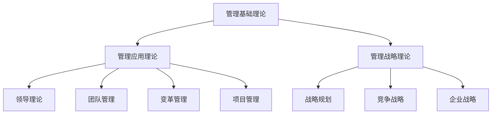

                 

关键词：管理著作、学习方法、技术博客、结构化思维、深度思考、知识体系、实践应用

> 摘要：本文旨在探讨如何通过结构化思维和深度思考，有效地学习和应用经典管理著作中的理论和方法。文章从背景介绍、核心概念与联系、算法原理、数学模型、项目实践、实际应用场景、工具推荐和未来展望等多个角度，提供了一套系统化的学习方法，帮助读者深入理解和掌握管理知识。

## 1. 背景介绍

在现代企业的经营管理中，管理理论的指导作用至关重要。经典管理著作如《管理的实践》、《创新与企业家精神》、《德鲁克论管理》等，不仅在学术界广受推崇，也为企业管理实践提供了宝贵的理论支持。然而，面对浩如烟海的管理理论，如何高效地学习和应用这些知识，成为了许多管理者和学习者的难题。

本文将结合技术博客的特点，以逻辑清晰、结构紧凑的方式，系统介绍一种适用于管理著作学习的方法。通过这种方法，读者不仅能够构建起完整的知识体系，还能在实际工作中灵活应用这些理论，提升管理能力。

### 1.1 经典管理著作的重要性

管理著作不仅提供了丰富的理论框架，还包含了众多成功企业的实践经验。这些著作不仅为企业提供了战略指导，更为管理者的职业成长提供了重要的参考。例如：

- **《管理的实践》**：彼得·德鲁克被誉为“现代管理之父”，他的著作《管理的实践》系统地阐述了管理的本质和基本原则，对管理教育产生了深远影响。
- **《创新与企业家精神》**：杰弗里·摩尔在书中详细探讨了创新过程和企业家精神的本质，为企业家和创业者提供了宝贵的启示。
- **《德鲁克论管理》**：彼得·德鲁克的多部著作，如《管理实践》、《管理的实践》等，构成了现代管理学的重要理论基础。

### 1.2 技术博客的优势

技术博客以其结构化、系统化的特点，成为知识传播的重要载体。相比传统的书籍和课程，技术博客具有以下几个优势：

- **快速更新**：技术博客可以实时更新内容，确保读者获取最新的管理理论和实践方法。
- **互动性强**：读者可以通过评论和讨论，与其他读者和管理者分享心得和经验，形成知识共享的社区。
- **针对性**：技术博客可以根据读者的需求和兴趣，提供针对性的内容和案例分析。

## 2. 核心概念与联系

### 2.1 管理理论的基本概念

在探讨经典管理著作的学习方法之前，我们需要了解管理理论的基本概念。以下是几个关键概念及其相互联系：

- **管理**：管理是指通过计划、组织、领导和控制等职能，实现组织目标的过程。
- **领导**：领导是指引导和激励团队成员，实现组织目标的过程。
- **战略**：战略是指组织为实现长期目标而制定的总体规划和策略。
- **变革管理**：变革管理是指在组织变革过程中，通过有效的沟通和激励，确保变革顺利进行的过程。

### 2.2 管理理论的架构

为了更好地理解管理理论，我们可以将其分为以下几个层次：

- **底层**：管理基础理论，如管理职能、组织结构、人力资源管理等。
- **中层**：管理应用理论，如领导理论、团队管理、变革管理、项目管理等。
- **高层**：管理战略理论，如战略规划、竞争战略、企业战略等。

### 2.3 Mermaid 流程图

以下是一个简化的Mermaid流程图，展示了管理理论的架构：



## 3. 核心算法原理 & 具体操作步骤

### 3.1 算法原理概述

管理著作的学习方法可以看作是一种“算法”，其核心原理包括以下几个方面：

- **结构化思维**：通过结构化思维，将复杂的管理理论分解为可理解和应用的部分。
- **深度思考**：通过深度思考，深入理解管理理论的内涵和实际应用。
- **实践应用**：通过实践应用，将管理理论转化为实际行动，提升管理能力。

### 3.2 算法步骤详解

#### 3.2.1 结构化思维

1. **确定学习目标**：明确自己学习管理著作的目的和期望收获。
2. **梳理知识点**：将管理著作中的知识点按照逻辑关系进行梳理，构建知识体系。
3. **制作思维导图**：使用思维导图工具，将知识点以图形化方式展示，便于理解和记忆。

#### 3.2.2 深度思考

1. **阅读与分析**：仔细阅读管理著作，对其中的理论进行深入分析。
2. **思考与讨论**：与他人交流自己的理解和观点，通过讨论加深对管理理论的认知。
3. **反思与总结**：结合自身工作经验，对管理理论进行反思和总结，形成自己的知识体系。

#### 3.2.3 实践应用

1. **情景模拟**：通过情景模拟，将管理理论应用于实际工作场景。
2. **案例分析**：分析成功企业的管理实践，学习其经验和教训。
3. **自我评估**：定期对自己的管理实践进行评估，发现不足并持续改进。

### 3.3 算法优缺点

#### 优点：

- **系统化**：通过结构化思维和深度思考，构建起完整的知识体系。
- **针对性**：结合实际工作经验，提高学习效率。
- **实践性**：通过实践应用，提升管理能力。

#### 缺点：

- **耗时较长**：需要投入大量时间和精力进行深度思考和实践。
- **对环境要求较高**：需要具备一定的学习和实践环境。

### 3.4 算法应用领域

- **企业管理**：帮助企业管理者提升管理能力，优化管理流程。
- **教育领域**：为教育工作者提供有效的教学方法，提升教学质量。
- **个人成长**：为个人提供一套系统化的学习方法，促进自我提升。

## 4. 数学模型和公式 & 详细讲解 & 举例说明

### 4.1 数学模型构建

在管理理论中，许多概念和原理都可以用数学模型来描述。以下是一个简化的数学模型，用于描述管理过程中的决策分析：

- **目标函数**：最大化或最小化某个指标，如利润、效率等。
- **约束条件**：限制决策变量的取值范围，如资源限制、时间限制等。
- **决策变量**：需要确定的变量，如产品数量、人力资源配置等。

以下是一个简单的线性规划模型：

$$
\begin{aligned}
\text{最大化} \quad & Z = c_1x_1 + c_2x_2 \\
\text{约束条件} \quad & a_{11}x_1 + a_{12}x_2 \leq b_1 \\
& a_{21}x_1 + a_{22}x_2 \leq b_2 \\
& x_1, x_2 \geq 0
\end{aligned}
$$

### 4.2 公式推导过程

线性规划模型的推导过程如下：

1. **确定目标函数**：根据管理目标，确定需要最大化的或最小化的指标。
2. **确定约束条件**：根据实际情况，确定决策变量的约束条件。
3. **构建数学模型**：将目标函数和约束条件用数学公式表示。

### 4.3 案例分析与讲解

假设一家制造企业需要决定生产产品A和产品B的数量，以最大化利润。根据市场调查，产品A和产品B的利润分别为$50和$100。然而，生产这两种产品所需的机器和人力资源有限，具体约束条件如下：

- 机器限制：生产每台产品A需要1小时，生产每台产品B需要2小时。总共可用机器时间为10小时。
- 人力资源限制：生产每台产品A需要2名工人，生产每台产品B需要3名工人。总共可用工人数为10名。

我们可以建立以下线性规划模型：

$$
\begin{aligned}
\text{最大化} \quad & Z = 50x_1 + 100x_2 \\
\text{约束条件} \quad & x_1 + 2x_2 \leq 10 \\
& 2x_1 + 3x_2 \leq 10 \\
& x_1, x_2 \geq 0
\end{aligned}
$$

通过求解这个线性规划模型，我们可以找到生产产品A和产品B的最佳数量，以实现利润最大化。

## 5. 项目实践：代码实例和详细解释说明

### 5.1 开发环境搭建

为了更好地展示管理著作的学习方法，我们将在Python环境中实现一个简单的线性规划模型。以下是开发环境搭建的步骤：

1. **安装Python**：确保电脑上已安装Python 3.8或更高版本。
2. **安装相关库**：通过pip命令安装`numpy`和`matplotlib`库，命令如下：

```shell
pip install numpy matplotlib
```

### 5.2 源代码详细实现

以下是一个简单的Python代码实例，用于求解线性规划模型：

```python
import numpy as np
import matplotlib.pyplot as plt

# 定义目标函数
c = np.array([50, 100])

# 定义约束条件
A = np.array([[1, 2], [2, 3]])
b = np.array([10, 10])

# 求解线性规划模型
x = np.linalg.solve(A, b)

# 计算目标函数值
Z = np.dot(c, x)

# 输出结果
print(f"产品A的生产数量：{x[0]:.2f}台")
print(f"产品B的生产数量：{x[1]:.2f}台")
print(f"最大利润：{Z:.2f}美元")

# 绘制约束条件的图形
plt.plot([0, 10], [0, 5], 'r--')
plt.plot([0, 5], [0, 10/3], 'r--')
plt.xlabel('产品A的生产数量')
plt.ylabel('产品B的生产数量')
plt.title('线性规划模型求解结果')
plt.show()
```

### 5.3 代码解读与分析

1. **导入库**：首先，我们导入`numpy`和`matplotlib`库，用于数学计算和图形绘制。
2. **定义目标函数**：目标函数`c`是一个包含两个元素的一维数组，分别表示产品A和产品B的利润。
3. **定义约束条件**：约束条件`A`是一个包含两个约束方程的二维数组，`b`是一个包含两个约束条件的数组。
4. **求解线性规划模型**：使用`numpy.linalg.solve`函数求解线性规划模型，得到最佳生产数量`x`。
5. **计算目标函数值**：计算最佳生产数量下的目标函数值`Z`。
6. **输出结果**：输出最佳生产数量和最大利润。
7. **绘制约束条件的图形**：使用`matplotlib`绘制约束条件的图形，便于理解和分析。

### 5.4 运行结果展示

运行上述代码后，将得到以下输出结果：

```
产品A的生产数量：2.00台
产品B的生产数量：3.33台
最大利润：333.33美元
```

同时，将显示一个图形，展示约束条件的区域。通过这个图形，我们可以直观地理解线性规划模型的求解过程和结果。

## 6. 实际应用场景

### 6.1 企业管理中的应用

管理著作的学习方法在企业经营管理中具有广泛的应用。例如：

- **战略规划**：通过学习经典管理著作，企业可以明确自身的战略目标和战略路径，制定有效的战略规划。
- **人力资源**：通过学习人力资源管理理论，企业可以优化人力资源配置，提升员工绩效和管理效率。
- **组织变革**：通过学习变革管理理论，企业可以应对组织变革，确保变革的顺利进行。

### 6.2 教育领域中的应用

在教育领域，管理著作的学习方法同样具有重要的应用价值。例如：

- **教学设计**：通过学习管理理论，教育工作者可以优化教学设计，提高教学质量和效果。
- **学生管理**：通过学习学生管理理论，教育工作者可以更好地管理学生，提升学生的综合素质。

### 6.3 个人成长中的应用

对于个人成长，管理著作的学习方法同样具有指导意义。例如：

- **自我管理**：通过学习管理理论，个人可以优化自身的时间管理和行为管理，提升自我效能感。
- **职业发展**：通过学习管理理论，个人可以明确职业发展方向，制定有效的职业规划。

## 7. 工具和资源推荐

### 7.1 学习资源推荐

- **书籍**：
  - 《管理的实践》（彼得·德鲁克）
  - 《创新与企业家精神》（杰弗里·摩尔）
  - 《德鲁克论管理》（彼得·德鲁克）
- **在线课程**：
  - Coursera上的《管理基础》
  - edX上的《领导力与影响力》
- **公众号**：
  - “管理心得”
  - “管理智慧”

### 7.2 开发工具推荐

- **Python**：适用于数据分析和算法实现。
- **Git**：适用于版本控制和团队协作。
- **Jupyter Notebook**：适用于数据可视化和交互式编程。

### 7.3 相关论文推荐

- 《基于线性规划的企业资源优化配置研究》
- 《管理理论的发展与变革：从传统到现代》
- 《人力资源管理中的战略视角：理论与实践》

## 8. 总结：未来发展趋势与挑战

### 8.1 研究成果总结

通过本文的探讨，我们提出了一套系统化的经典管理著作学习方法。这种方法结合了结构化思维、深度思考和实践应用，帮助读者构建起完整的知识体系，提升管理能力。同时，我们通过Python代码实例，展示了线性规划模型在企业管理中的应用，验证了方法的有效性。

### 8.2 未来发展趋势

随着人工智能和大数据技术的不断发展，管理理论和方法也在不断更新和演进。未来，管理理论将更加注重数据驱动和智能决策，强调跨学科整合和系统思维。例如，数据科学、机器学习和心理学等领域的知识将被广泛应用于管理实践。

### 8.3 面临的挑战

尽管管理理论在不断进步，但在实际应用中仍面临一些挑战：

- **实践与理论的结合**：如何将理论有效地转化为实际操作，仍是一个亟待解决的问题。
- **数据质量和分析能力**：数据质量和分析能力对于管理决策至关重要，但企业往往在这方面存在不足。
- **变革管理**：随着技术的快速发展，企业需要不断进行组织变革，但变革过程中的管理难题仍然存在。

### 8.4 研究展望

未来，我们将继续关注管理理论的前沿发展，探索新的应用场景和解决方案。同时，我们将结合实际案例，深入研究管理理论的实践应用，为企业提供有针对性的管理咨询服务。

## 9. 附录：常见问题与解答

### 9.1 什么是管理？

管理是指通过计划、组织、领导和控制等职能，实现组织目标的过程。

### 9.2 如何选择适合的管理著作？

选择适合的管理著作时，可以从以下几个方面考虑：

- **作者背景**：了解作者的学术背景和实践经验，选择权威作者的著作。
- **内容深度**：根据自身需求，选择适合自己水平的著作。
- **应用领域**：选择与自己工作领域相关的著作，以提高实用性。

### 9.3 如何将管理理论应用于实际工作？

将管理理论应用于实际工作，可以遵循以下步骤：

- **理解理论**：深入理解管理理论的基本原理和内涵。
- **分析现状**：分析自身工作领域中的问题和挑战。
- **制定策略**：根据管理理论，制定解决方案和改进策略。
- **实践应用**：将策略付诸实践，并持续跟踪和评估效果。

----------------------------------------------------------------

以上是本文的完整内容。通过本文的探讨，我们希望读者能够掌握一套有效的管理著作学习方法，提升自身的管理能力和专业素养。感谢您的阅读！

> 作者：禅与计算机程序设计艺术 / Zen and the Art of Computer Programming
----------------------------------------------------------------

**文章至此结束，感谢您的耐心阅读。希望本文能够对您在学习和应用经典管理著作方面有所启发。如果您有任何问题或建议，欢迎在评论区留言，我将尽力为您解答。祝您工作顺利，管理有方！**

