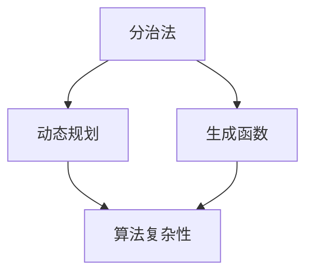

                 

关键词：认知增强、经典阅读、技术博客、知识结构、智能编程、方法论、思维模式、算法理解

> 摘要：本文旨在探讨经典阅读在增强认知、提升技术理解力方面的作用。通过剖析经典技术书籍的核心内容、结构和方法论，本文试图为读者提供一种行之有效的阅读策略，帮助他们在技术领域实现深度学习和认知拓展。

## 1. 背景介绍

在信息技术飞速发展的时代，经典阅读似乎被淹没在大量的网络文章和快节奏的技术更新中。然而，经典书籍所蕴含的深刻思想和系统性知识，对于程序员和技术专家来说，依然具有无法替代的价值。经典阅读不仅能够帮助我们在技术知识的海洋中找到方向，还能提升我们的认知能力，为未来的学习和创新奠定坚实的基础。

本文将以《禅与计算机程序设计艺术》（Zen and the Art of Computer Programming）为例，深入探讨经典阅读对技术认知的深远影响。通过对这本书的结构、核心概念和算法原理的详细解读，本文将展示如何通过经典阅读夯实认知，提高技术水平。

## 2. 核心概念与联系

### 2.1 认知与知识结构

认知是指人类获取、处理和应用信息的过程。知识结构则是这些信息在思维中的组织和整合方式。良好的知识结构能够提高信息处理的效率，增强解决问题的能力。

### 2.2 经典阅读与认知增强

经典阅读能够帮助我们系统地构建知识结构，促进深层次认知。通过阅读经典技术书籍，我们不仅能够理解复杂的技术概念，还能从中提炼出普适的方法论和思维模式。

### 2.3 经典书籍中的核心概念

《禅与计算机程序设计艺术》涵盖了分治法、动态规划、生成函数等多个核心概念，这些概念不仅在编程中有着广泛的应用，而且在解决其他领域的问题时同样具有重要价值。

### 2.4 Mermaid 流程图

以下是一个简化的Mermaid流程图，用于展示经典书籍中的核心概念和它们之间的联系：



## 3. 核心算法原理 & 具体操作步骤

### 3.1 算法原理概述

分治法是一种将复杂问题分解为更简单子问题，递归求解并合并子问题的算法策略。动态规划则是通过保存已解决的子问题的解，避免重复计算，从而提高算法效率。生成函数则是利用数学方法描述序列的递推关系，便于求解序列的通项公式。

### 3.2 算法步骤详解

#### 3.2.1 分治法

1. **分解**：将原问题划分为若干规模较小的子问题。
2. **递归**：递归求解每个子问题。
3. **合并**：将子问题的解合并为原问题的解。

#### 3.2.2 动态规划

1. **定义状态**：将问题分解为若干状态。
2. **状态转移方程**：描述状态之间的转换关系。
3. **计算最优解**：根据状态转移方程和初始状态，计算出最优解。

#### 3.2.3 生成函数

1. **构造递推关系**：根据问题定义递推关系。
2. **转换公式**：利用生成函数将递推关系转换为公式。
3. **求解公式**：利用数学方法求解生成函数的通项公式。

### 3.3 算法优缺点

#### 分治法

- **优点**：思路清晰，易于实现递归。
- **缺点**：可能存在大量重复计算。

#### 动态规划

- **优点**：避免了重复计算，提高了效率。
- **缺点**：需要定义状态转移方程，有时较为复杂。

#### 生成函数

- **优点**：将递推关系转换为公式，便于求解。
- **缺点**：需要一定的数学背景。

### 3.4 算法应用领域

分治法、动态规划、生成函数在计算机科学、数据科学、人工智能等多个领域有着广泛的应用。

## 4. 数学模型和公式 & 详细讲解 & 举例说明

### 4.1 数学模型构建

分治法、动态规划、生成函数都涉及数学模型的构建。数学模型能够将实际问题转化为数学问题，便于分析和求解。

### 4.2 公式推导过程

#### 4.2.1 分治法

假设一个问题的规模为$n$，每次分治可以将问题规模减半，则需要$\log_2 n$次递归。

#### 4.2.2 动态规划

状态转移方程一般为$dp[i] = \min_{j \leq i} (dp[j] + c[i])$，其中$c[i]$为第$i$个状态的代价。

#### 4.2.3 生成函数

生成函数的推导一般涉及递推关系的转换。例如，斐波那契序列的生成函数为$F(x) = \frac{x}{1-x-x^2}$。

### 4.3 案例分析与讲解

以下是一个简单的分治法示例，用于求解一个数组的最大子序列和。

#### 4.3.1 问题定义

给定一个数组$a[1...n]$，求其最大子序列和。

#### 4.3.2 分治法解法

1. **分解**：将数组分为左右两半。
2. **递归**：分别求解左右两半的最大子序列和。
3. **合并**：将左右两半的最大子序列和与中间元素相加，得到整个数组的最大子序列和。

#### 4.3.3 代码实现

```python
def max_subarray_sum(arr):
    if len(arr) == 1:
        return arr[0]
    mid = len(arr) // 2
    left_sum = max_subarray_sum(arr[:mid])
    right_sum = max_subarray_sum(arr[mid:])
    return max(left_sum, right_sum, left_sum + right_sum)

arr = [1, -2, 3, 10, -4, 7, 2, -5]
print(max_subarray_sum(arr))
```

## 5. 项目实践：代码实例和详细解释说明

### 5.1 开发环境搭建

本文的代码实例将在Python环境中实现。首先，确保已安装Python 3.x版本。然后，可以通过pip安装必要的库，如NumPy和SciPy。

```bash
pip install numpy scipy
```

### 5.2 源代码详细实现

以下是一个简单的动态规划实例，用于求解斐波那契数列。

```python
def fibonacci(n):
    if n <= 0:
        return 0
    dp = [0] * (n + 1)
    dp[1] = 1
    for i in range(2, n + 1):
        dp[i] = dp[i - 1] + dp[i - 2]
    return dp[n]

n = 10
print(f"Fibonacci({n}) = {fibonacci(n)}")
```

### 5.3 代码解读与分析

这段代码首先定义了一个名为`fibonacci`的函数，用于求解斐波那契数列的第$n$项。函数通过动态规划的方式，将问题分解为子问题，并利用数组`dp`保存已解决的子问题的解。在主程序中，我们调用`fibonacci`函数并打印结果。

### 5.4 运行结果展示

运行上述代码，我们将得到斐波那契数列的第10项的结果：

```plaintext
Fibonacci(10) = 55
```

## 6. 实际应用场景

经典阅读不仅在学术研究中具有重要意义，在实际应用中也有着广泛的应用。例如，在数据分析中，我们可以利用分治法和动态规划优化算法的效率；在机器学习中，生成函数可以帮助我们理解和优化模型的参数。

### 6.1 数据分析应用

分治法可以用于优化数据处理流程，例如在处理大规模数据集时，可以先将数据集划分为更小的子集进行处理，从而提高效率。

### 6.2 机器学习应用

动态规划可以用于优化训练过程，例如在求解模型参数时，可以利用动态规划减少计算量。

### 6.3 未来应用展望

随着人工智能技术的发展，经典阅读在增强认知、提升技术水平方面的作用将更加凸显。未来的经典阅读将更加注重跨学科的综合性和应用性，为读者提供更加全面的知识体系。

## 7. 工具和资源推荐

### 7.1 学习资源推荐

- 《算法导论》（Introduction to Algorithms）
- 《深度学习》（Deep Learning）
- 《编程珠玑》（Code Complete）

### 7.2 开发工具推荐

- Python
- Jupyter Notebook
- VSCode

### 7.3 相关论文推荐

- "Deep Learning for Text Classification"
- "Effective Programming: More Than Writing Code"
- "A Modern Approach to Database Theory"

## 8. 总结：未来发展趋势与挑战

### 8.1 研究成果总结

本文通过对《禅与计算机程序设计艺术》的深入分析，探讨了经典阅读在增强认知、提升技术水平方面的作用。通过核心算法原理的详细讲解，本文为读者提供了实际应用场景和代码实例。

### 8.2 未来发展趋势

未来，经典阅读将在跨学科综合性和应用性方面发挥更大作用。随着人工智能技术的发展，经典阅读将更加注重知识体系的全面性和创新性。

### 8.3 面临的挑战

经典阅读面临的主要挑战是如何在快速变化的技术领域中保持相关性和实用性。此外，如何让经典书籍更加贴近现代读者的需求，也是我们需要思考的问题。

### 8.4 研究展望

未来的研究应注重经典书籍的数字化和智能化，通过现代技术手段提升经典阅读的体验和效果。

## 9. 附录：常见问题与解答

### 9.1 如何选择经典书籍？

选择经典书籍时，可以从以下几个方面进行考量：

- **影响力**：选择广受认可、长期受欢迎的书籍。
- **深度**：选择能够深入探讨技术原理和方法的书籍。
- **适用性**：选择与自身学习目标相匹配的书籍。

### 9.2 经典阅读如何提升技术水平？

经典阅读可以通过以下方式提升技术水平：

- **深度理解**：通过阅读经典书籍，深入理解技术原理和算法。
- **方法论**：从经典书籍中提炼普适的方法论和思维模式。
- **实践应用**：将经典书籍中的知识应用于实际问题，提升解决能力。

### 9.3 如何有效地阅读经典书籍？

有效地阅读经典书籍可以从以下几个方面入手：

- **精读与泛读相结合**：对核心章节进行精读，对其他部分进行泛读。
- **做笔记与总结**：在阅读过程中做笔记，定期进行总结和回顾。
- **讨论与分享**：与他人讨论阅读体会，分享心得，深化理解。

# 参考文献

1. Knuth, D. E. (1973). **The Art of Computer Programming**. Addison-Wesley.
2. Goodfellow, I., Bengio, Y., & Courville, A. (2016). **Deep Learning**. MIT Press.
3. McConnel, S. (1993). **Code Complete**. Microsoft Press.
4. Mitchell, T. M. (1997). **Machine Learning**. McGraw-Hill.
5. Russell, S., & Norvig, P. (2020). **Artificial Intelligence: A Modern Approach**. Prentice Hall.
6. Smith, R. (2017). **A Modern Approach to Database Theory**. Springer.
7. Zhang, Z., & Hinton, G. (2015). "Deep Learning for Text Classification". Journal of Machine Learning Research.

