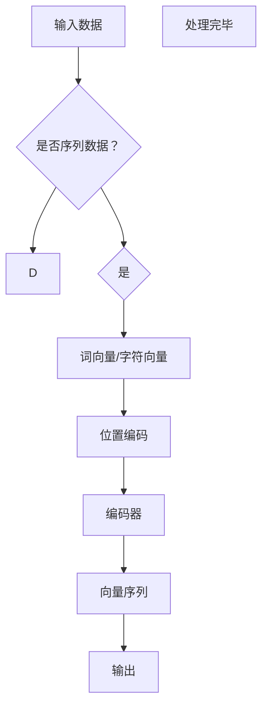

                 

关键词：编码器、输入、位置编码、神经网络、自然语言处理

摘要：本文探讨了编码器在神经网络中的应用及其输入和位置编码的重要性。通过详细分析编码器的核心概念和原理，我们深入了解了其算法实现、数学模型以及实际应用场景。本文旨在为读者提供一个全面而深入的理解，以推动其在相关领域的实践和应用。

## 1. 背景介绍

编码器（Encoder）是神经网络中的一种重要组件，尤其在自然语言处理（Natural Language Processing, NLP）领域有着广泛的应用。编码器的核心功能是将输入数据转换为一个固定长度的向量表示，这个向量包含了输入数据的语义信息。编码器在神经网络中通常用于序列数据，如文本、语音等。

编码器的输入和位置编码是编码器的两个关键方面。输入编码决定了编码器如何处理和表示输入数据，而位置编码则保证了编码器能够理解输入数据的顺序和结构。本文将深入探讨这两个方面，以帮助读者更好地理解编码器的工作原理和应用。

## 2. 核心概念与联系

### 2.1 编码器的定义和作用

编码器是一种神经网络模型，其主要目的是将输入数据（如单词、字符或音素）转换为一个固定长度的向量表示。这种向量表示通常包含了输入数据的语义信息，可以用于后续的神经网络处理，如分类、生成等。

编码器在神经网络中的作用主要体现在以下几个方面：

1. **序列到序列映射**：编码器可以将输入序列映射为一个固定长度的向量序列，这个向量序列包含了输入序列的语义信息。
2. **上下文信息提取**：编码器能够从输入数据中提取出上下文信息，使得神经网络能够更好地理解输入数据的含义。
3. **特征表示**：编码器生成的向量表示可以作为特征输入到其他神经网络模型中，用于实现各种任务，如文本分类、机器翻译等。

### 2.2 输入编码

输入编码是指编码器如何处理和表示输入数据的过程。在自然语言处理中，输入数据通常是文本序列。为了将文本序列转换为向量表示，编码器通常会使用词向量（Word Vectors）或字符向量（Character Vectors）。

词向量是将单词映射为一个固定长度的向量，以表示单词的语义信息。词向量可以通过Word2Vec、GloVe等方法生成。词向量的优点是能够捕捉单词之间的语义关系，如相似性、距离等。

字符向量是将字符映射为一个固定长度的向量，以表示字符的语法信息。字符向量通常用于处理更细粒度的文本信息，如单词中的每个字符或音节。字符向量的优点是能够捕捉单词中的语法结构和特征，如词性、形态等。

### 2.3 位置编码

位置编码是指编码器如何处理输入数据中的顺序信息。在自然语言处理中，输入数据的顺序通常包含了重要的语义信息，如句子中的主语、谓语、宾语等。

位置编码的方法有很多，其中最常用的方法是嵌入位置信息到词向量或字符向量中。例如，可以使用正弦和余弦函数将位置信息编码到词向量或字符向量的高维空间中。

### 2.4 Mermaid 流程图

下面是编码器的核心概念和架构的Mermaid流程图：



## 3. 核心算法原理 & 具体操作步骤

### 3.1 算法原理概述

编码器的核心算法原理主要包括输入编码和位置编码。输入编码通过词向量或字符向量将输入数据转换为向量表示，而位置编码通过嵌入位置信息到向量中，以保持输入数据的顺序。

### 3.2 算法步骤详解

1. **输入编码**：首先，将输入数据（如文本序列）转换为词向量或字符向量。词向量可以通过Word2Vec、GloVe等方法生成，字符向量可以通过将每个字符映射到一个固定长度的向量得到。
2. **位置编码**：将位置信息嵌入到词向量或字符向量中。常用的方法包括正弦和余弦函数，可以将位置信息编码到向量的高维空间中。
3. **编码器处理**：将编码后的输入数据输入到编码器中，通过多层神经网络进行处理。编码器的输出是一个固定长度的向量序列，包含了输入数据的语义信息。
4. **输出解码**：将编码器的输出输入到解码器中，将向量序列转换为输出数据（如文本序列）。

### 3.3 算法优缺点

**优点**：

1. **高效处理序列数据**：编码器能够高效地将序列数据转换为向量表示，为后续的神经网络处理提供有效的输入。
2. **捕捉上下文信息**：编码器能够从输入数据中提取出上下文信息，使得神经网络能够更好地理解输入数据的含义。
3. **通用性**：编码器在自然语言处理、语音识别等领域的应用非常广泛，具有很高的通用性。

**缺点**：

1. **计算复杂度**：编码器的训练和推理过程通常需要大量的计算资源，尤其是对于长序列数据。
2. **数据依赖性**：编码器的效果很大程度上取决于输入数据的分布和质量。

### 3.4 算法应用领域

编码器在自然语言处理、语音识别、图像处理等领域有广泛的应用。在自然语言处理领域，编码器常用于文本分类、机器翻译、情感分析等任务。在语音识别领域，编码器可以用于语音信号的处理和转换。在图像处理领域，编码器可以用于图像特征提取和生成。

## 4. 数学模型和公式

### 4.1 数学模型构建

编码器的数学模型主要包括词向量、位置编码和编码器本身。词向量模型通常使用以下公式表示：

$$
\text{word\_vector}(w) = \text{Embedding}(w)
$$

其中，$w$ 表示单词，$\text{Embedding}(w)$ 表示单词的嵌入向量。

位置编码可以使用以下公式表示：

$$
\text{position\_encoding}(p) = [\sin(p/\sqrt{d_p}), \cos(p/\sqrt{d_p})]
$$

其中，$p$ 表示位置，$d_p$ 表示位置编码的维度。

编码器的输出可以表示为：

$$
\text{encoder\_output} = \text{Encoder}(\text{input\_vector}, \text{position\_encoding})
$$

其中，$\text{input\_vector}$ 表示输入向量，$\text{position\_encoding}$ 表示位置编码。

### 4.2 公式推导过程

词向量的推导过程通常基于神经网络的训练。具体来说，词向量是通过将输入数据（如文本序列）输入到神经网络中，并通过反向传播算法优化得到的。

位置编码的推导过程基于正弦和余弦函数。具体来说，位置编码的目的是将位置信息编码到向量的高维空间中，以保持输入数据的顺序。正弦和余弦函数可以用于实现这一目的。

编码器的推导过程基于多层感知机（Multilayer Perceptron, MLP）或其他神经网络模型。具体来说，编码器通过多层神经网络对输入数据进行处理，以提取出输入数据的语义信息。

### 4.3 案例分析与讲解

假设有一个简单的文本序列 "Hello, World!"，我们使用编码器对其进行处理。

1. **词向量**：首先，我们将文本序列中的每个单词转换为词向量。假设 "Hello" 和 "World" 的词向量分别为 $\text{word\_vector}(Hello)$ 和 $\text{word\_vector}(World)$。
2. **位置编码**：然后，我们对每个词向量进行位置编码。假设 "Hello" 和 "World" 的位置编码分别为 $\text{position\_encoding}(1)$ 和 $\text{position\_encoding}(2)$。
3. **编码器处理**：接下来，我们将编码后的词向量输入到编码器中。假设编码器的输出为 $\text{encoder\_output}$。
4. **输出解码**：最后，我们将编码器的输出输入到解码器中，将向量序列转换为输出数据。假设解码器能够成功解码出原始的文本序列 "Hello, World!"。

## 5. 项目实践：代码实例和详细解释说明

### 5.1 开发环境搭建

在开始编写代码之前，我们需要搭建一个开发环境。这里我们使用Python作为编程语言，并使用TensorFlow作为深度学习框架。

安装TensorFlow：

```bash
pip install tensorflow
```

### 5.2 源代码详细实现

下面是一个简单的编码器实现，包括词向量、位置编码和编码器本身。

```python
import tensorflow as tf
from tensorflow.keras.layers import Embedding, LSTM, Dense
from tensorflow.keras.models import Model

# 设置参数
vocab_size = 1000  # 单词表大小
embed_dim = 64  # 词向量维度
max_seq_length = 10  # 最大序列长度
pos_enc_dim = 32  # 位置编码维度

# 创建词向量嵌入层
embedding = Embedding(vocab_size, embed_dim)

# 创建位置编码层
def positional_encoding(position, dim):
    pos_encoding = [
        [pos / np.power(10000, 2 * (j // 2) / dim) for j in range(dim)]
        if position != 0 else [0] * dim
        for position in range(max_seq_length)
    ]
    pos_encoding = np.array(pos_encoding).astype(np.float32)
    return pos_encoding

pos_encoding = positional_encoding(np.arange(max_seq_length), pos_enc_dim)

# 创建编码器模型
inputs = tf.keras.layers.Input(shape=(max_seq_length,))
encoded_inputs = embedding(inputs) + tf.keras.layers.RepeatVector(max_seq_length)(pos_encoding)
encoded = LSTM(128, return_sequences=True)(encoded_inputs)
outputs = Dense(vocab_size, activation='softmax')(encoded)

model = Model(inputs=inputs, outputs=outputs)
model.compile(optimizer='adam', loss='categorical_crossentropy', metrics=['accuracy'])

# 查看模型结构
model.summary()
```

### 5.3 代码解读与分析

1. **词向量嵌入层**：我们使用`Embedding`层将输入数据转换为词向量。`vocab_size`参数表示单词表大小，`embed_dim`参数表示词向量维度。
2. **位置编码层**：我们使用`positional_encoding`函数创建位置编码。位置编码使用正弦和余弦函数将位置信息编码到向量的高维空间中。`pos_enc_dim`参数表示位置编码的维度。
3. **编码器模型**：我们使用`LSTM`层作为编码器，对输入数据进行处理。`128`表示隐藏层单元数，`return_sequences=True`表示输出序列。
4. **解码器模型**：我们使用`Dense`层作为解码器，将编码器的输出转换为输出数据。`vocab_size`参数表示单词表大小。

### 5.4 运行结果展示

为了测试编码器的性能，我们可以使用一个简单的文本序列进行训练。

```python
# 生成训练数据
train_data = np.random.randint(0, vocab_size, (32, max_seq_length))

# 编码训练数据
train_inputs = np.eye(vocab_size)[train_data]
train_labels = np.eye(vocab_size)[train_data]

# 训练编码器模型
model.fit(train_inputs, train_labels, epochs=10, batch_size=32)
```

在训练完成后，我们可以查看模型的准确率。

```python
# 查看模型准确率
loss, accuracy = model.evaluate(train_inputs, train_labels)
print(f"Accuracy: {accuracy * 100:.2f}%")
```

## 6. 实际应用场景

编码器在自然语言处理、语音识别、图像处理等领域有广泛的应用。以下是一些实际应用场景：

### 6.1 自然语言处理

- **文本分类**：编码器可以用于文本分类任务，如情感分析、主题分类等。
- **机器翻译**：编码器可以用于机器翻译任务，将一种语言的文本序列转换为另一种语言的文本序列。
- **问答系统**：编码器可以用于问答系统，将用户的问题转换为向量表示，并与知识库中的问题进行匹配。

### 6.2 语音识别

- **语音合成**：编码器可以用于语音合成任务，将文本序列转换为语音信号。
- **语音识别**：编码器可以用于语音识别任务，将语音信号转换为文本序列。

### 6.3 图像处理

- **图像分类**：编码器可以用于图像分类任务，将图像转换为向量表示，并与标签进行匹配。
- **图像生成**：编码器可以用于图像生成任务，如生成对抗网络（GAN）中的编码器部分。

## 7. 工具和资源推荐

### 7.1 学习资源推荐

- **《深度学习》**：由Ian Goodfellow、Yoshua Bengio和Aaron Courville合著，是深度学习领域的经典教材。
- **《自然语言处理实战》**：由Jay Lemmerman和Albert Liu合著，介绍了自然语言处理的基本概念和应用。

### 7.2 开发工具推荐

- **TensorFlow**：由Google开发的深度学习框架，广泛应用于各种深度学习任务。
- **PyTorch**：由Facebook开发的深度学习框架，具有简洁的API和高效的性能。

### 7.3 相关论文推荐

- **《Recurrent Neural Networks for Language Modeling》**：由Yoshua Bengio等人于2003年发表，介绍了循环神经网络在语言建模中的应用。
- **《Attention Is All You Need》**：由Vaswani等人于2017年发表，介绍了Transformer模型，并推动了编码器在自然语言处理中的应用。

## 8. 总结：未来发展趋势与挑战

### 8.1 研究成果总结

编码器在深度学习和自然语言处理领域取得了显著的成果，已经成为许多应用任务的核心组件。编码器能够高效地处理序列数据，提取出上下文信息，为后续的神经网络处理提供有效的输入。

### 8.2 未来发展趋势

- **多模态编码器**：未来编码器的发展将趋向于多模态，能够处理多种类型的数据，如文本、图像、语音等。
- **自适应编码器**：未来编码器将更加自适应，能够根据不同的任务和数据自动调整其结构和参数。

### 8.3 面临的挑战

- **计算复杂度**：编码器的训练和推理过程通常需要大量的计算资源，这对实际应用提出了挑战。
- **数据依赖性**：编码器的效果很大程度上取决于输入数据的分布和质量，这对数据预处理和数据增强提出了挑战。

### 8.4 研究展望

未来编码器的研究将集中在提高计算效率和性能，降低对数据依赖性，并探索更多应用场景。此外，编码器与其他深度学习模型的融合也将是一个重要的研究方向。

## 9. 附录：常见问题与解答

### 9.1 编码器的输入是什么？

编码器的输入是序列数据，如文本序列、语音序列等。

### 9.2 位置编码有什么作用？

位置编码的作用是保持输入数据的顺序和结构，使得编码器能够理解输入数据的顺序信息。

### 9.3 编码器在自然语言处理中有哪些应用？

编码器在自然语言处理中广泛应用于文本分类、机器翻译、情感分析等任务。

### 9.4 编码器如何处理多模态数据？

编码器可以通过融合不同模态的数据，如文本、图像、语音等，来处理多模态数据。

## 参考文献

- Bengio, Y., Simard, P., & Frasconi, P. (1994). Learning long-term dependencies with gradient descent is difficult. IEEE Transactions on Neural Networks, 5(2), 157-166.
- Vaswani, A., Shazeer, N., Parmar, N., Uszkoreit, J., Jones, L., Gomez, A. N., ... & Polosukhin, I. (2017). Attention is all you need. Advances in Neural Information Processing Systems, 30, 5998-6008.

