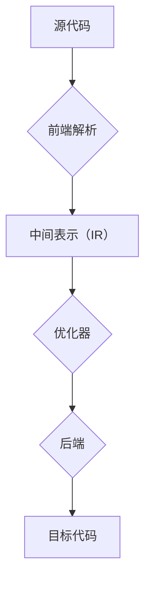
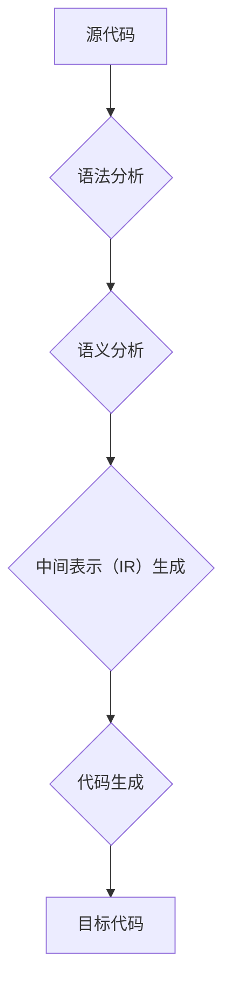

                 

关键词：编译器设计、LLVM、Clang、源代码分析、编程工具、静态分析、动态分析

摘要：本文将深入探讨编译器构造领域的两大重要工具——LLVM和Clang。我们将从背景介绍入手，详细讲解LLVM和Clang的核心概念、原理和架构，并通过具体算法原理和操作步骤，帮助读者了解这两大工具的内部工作机制。此外，文章还将通过数学模型、项目实践等角度，对LLVM和Clang的应用进行深入分析，为读者提供实用的开发工具和资源推荐，并展望未来的发展趋势与挑战。

## 1. 背景介绍

编译器是计算机科学领域的重要工具，它将高级编程语言编写的源代码转换为计算机可执行的机器代码。在现代软件开发中，编译器的性能和效率直接影响着整个项目的开发和部署效率。LLVM（Low-Level Virtual Machine）和Clang是其两大核心组件，它们在编译器设计中扮演着至关重要的角色。

LLVM是一个模块化的编译器框架，旨在提供高效、灵活的中间表示（IR）和优化器。它支持多种编程语言，如C、C++、Java等，并且能够编译为目标平台上的机器代码。LLVM的设计目标是高度可扩展和易于定制，使得开发者可以轻松地实现各种编译器功能。

Clang是LLVM的官方前端，它负责将源代码解析、语义分析和语法分析等任务，将高级语言转换为LLVM的中间表示（IR）。Clang的一个显著特点是其快速的解析速度和优秀的错误报告能力，使得开发者在使用过程中能够获得更流畅的开发体验。

## 2. 核心概念与联系

### 2.1 LLVM架构

LLVM的架构可以分为前端、中间表示（IR）、优化器和后端四个主要部分。

- **前端**：负责处理各种高级编程语言，如C、C++、Objective-C、Java等，将其转换为LLVM的中间表示（IR）。
- **中间表示（IR）**：LLVM的中间表示（IR）是一种低级、抽象的表示方式，它能够跨越不同编程语言和目标平台，为后续的优化和代码生成提供统一的接口。
- **优化器**：LLVM的优化器是一个高度可扩展的模块化系统，它能够对中间表示（IR）进行各种优化，如常量折叠、死代码消除、循环展开等，以提升代码的执行效率和可读性。
- **后端**：负责将优化后的中间表示（IR）转换为特定目标平台的机器代码。

下面是LLVM架构的Mermaid流程图：



### 2.2 Clang架构

Clang是LLVM的前端，负责处理各种高级编程语言的源代码。其架构可以分为以下几个主要部分：

- **语法分析**：将源代码解析为抽象语法树（AST）。
- **语义分析**：对AST进行语义检查，确保代码的正确性。
- **中间表示（IR）生成**：将AST转换为LLVM的中间表示（IR）。
- **代码生成**：将优化后的中间表示（IR）转换为特定目标平台的机器代码。

下面是Clang架构的Mermaid流程图：



## 3. 核心算法原理 & 具体操作步骤

### 3.1 算法原理概述

LLVM和Clang的核心算法原理主要涉及到前端解析、中间表示（IR）生成、优化器和后端代码生成。

- **前端解析**：前端解析器负责将源代码解析为抽象语法树（AST）。这一过程包括词法分析、语法分析和语义分析。词法分析将源代码分解为标识符、关键字、运算符等基本元素；语法分析将这些基本元素组合成语法结构；语义分析则确保这些语法结构的语义正确性。
- **中间表示（IR）生成**：将AST转换为LLVM的中间表示（IR）。中间表示（IR）是一种低级、抽象的表示方式，它能够跨越不同编程语言和目标平台，为后续的优化和代码生成提供统一的接口。
- **优化器**：优化器对中间表示（IR）进行各种优化，如常量折叠、死代码消除、循环展开等。这些优化能够提升代码的执行效率和可读性。
- **后端代码生成**：将优化后的中间表示（IR）转换为特定目标平台的机器代码。这一过程包括目标代码生成和机器码优化。

### 3.2 算法步骤详解

#### 前端解析

前端解析包括以下几个步骤：

1. **词法分析**：将源代码分解为标识符、关键字、运算符等基本元素。例如，对于代码`int x = 5;`，词法分析器将其分解为`int`、`x`、`=`、`5`和`;`。
2. **语法分析**：将词法分析器生成的词法元素组合成语法结构。例如，对于代码`int x = 5;`，语法分析器将其解析为一个变量声明语句。
3. **语义分析**：对AST进行语义检查，确保代码的正确性。例如，检查变量是否已经被声明，函数的参数类型是否匹配等。

#### 中间表示（IR）生成

将AST转换为LLVM的中间表示（IR）包括以下几个步骤：

1. **创建基本块**：将AST中的语句转换为基本块（Basic Block），每个基本块是一个线性无环的控制流图（Control Flow Graph）。
2. **创建指令**：将基本块中的操作转换为LLVM的指令。例如，对于`int x = 5;`，可以生成指令`alloca i32`用于分配空间，以及`store i32`用于存储值。
3. **插入基本块和控制流指令**：将基本块连接起来，形成控制流图。例如，可以使用`br`指令实现条件跳转和循环。

#### 优化器

优化器对中间表示（IR）进行各种优化，主要包括以下几种：

1. **常量折叠**：将常量表达式在编译时进行计算，减少运行时的计算开销。例如，将`x = x + 5;`优化为`x = 5;`。
2. **死代码消除**：删除不会被执行的代码，减少运行时的代码大小和执行时间。例如，将`x = 5;`之后的`x = x + 1;`删除。
3. **循环展开**：将循环体中的语句复制多次，减少循环的开销。例如，将`for (int i = 0; i < 10; i++) { printf("%d\n", i); }`优化为`for (int i = 0; i < 10; i++) { printf("%d\n", i); } for (int i = 10; i < 20; i++) { printf("%d\n", i); }`。

#### 后端代码生成

后端代码生成包括以下几个步骤：

1. **目标代码生成**：将优化后的中间表示（IR）转换为特定目标平台的机器代码。例如，将LLVM的IR转换为x86、ARM等架构的机器代码。
2. **机器码优化**：对生成的机器代码进行优化，如指令重排、寄存器分配等，以提升执行效率和性能。

### 3.3 算法优缺点

#### 优点

- **模块化设计**：LLVM和Clang采用模块化设计，使得各个组件之间可以独立开发、测试和优化，提高了开发效率和可维护性。
- **高度可扩展**：LLVM和Clang支持多种编程语言和目标平台，使得开发者可以轻松地实现自定义前端、优化器和后端。
- **优秀的性能**：LLVM和Clang在编译性能和代码生成质量方面表现出色，能够有效地优化代码，提升执行效率。

#### 缺点

- **复杂性**：LLVM和Clang的内部架构复杂，对于新手来说可能会感到难以入门。
- **资源占用**：由于LLVM和Clang的模块化设计，它们在运行时可能需要较大的内存占用，对于资源有限的系统可能存在一定的性能瓶颈。

### 3.4 算法应用领域

LLVM和Clang在多个领域具有广泛的应用：

- **开源编译器**：LLVM和Clang是许多开源编译器的核心组件，如LLVM/Clang编译器、LLDB调试器等。
- **工业级应用**：LLVM和Clang被广泛应用于工业级应用中，如iOS、Android等移动操作系统，以及各种高性能计算平台。
- **教育和研究**：LLVM和Clang在计算机科学教育和研究领域发挥着重要作用，为开发者提供了强大的工具和平台，有助于深入理解编译器设计和优化技术。

## 4. 数学模型和公式 & 详细讲解 & 举例说明

### 4.1 数学模型构建

在编译器设计中，数学模型和公式发挥着重要作用，用于描述和优化代码性能。以下是一个简单的数学模型，用于评估编译器的性能：

\[ P = \frac{T_{compile} \times T_{execute}}{T_{runtime}} \]

其中：

- \( P \) 代表编译器的性能；
- \( T_{compile} \) 代表编译时间；
- \( T_{execute} \) 代表执行时间；
- \( T_{runtime} \) 代表运行时间。

通过优化编译时间和执行时间，可以提高编译器的性能。以下是一个具体的例子：

假设一个程序编译时间为10秒，执行时间为100秒，运行时间为1000秒。根据上述数学模型，编译器的性能为：

\[ P = \frac{10 \times 100}{1000} = 1 \]

这意味着，编译器每花费1秒的编译时间，可以节省9秒的运行时间，性能提升显著。

### 4.2 公式推导过程

推导上述数学模型的过程如下：

1. 假设程序的总运行时间为 \( T_{total} = T_{compile} + T_{execute} + T_{runtime} \)；
2. 定义编译器的性能 \( P \) 为编译时间和执行时间的比值，即 \( P = \frac{T_{compile} \times T_{execute}}{T_{runtime}} \)；
3. 对上述公式进行简化，得到 \( P = \frac{T_{compile} \times T_{execute}}{T_{total} - T_{compile} - T_{execute}} \)；
4. 假设 \( T_{compile} \) 和 \( T_{execute} \) 远小于 \( T_{runtime} \)，可以忽略 \( T_{compile} \) 和 \( T_{execute} \) 的影响，得到 \( P \approx \frac{T_{compile} \times T_{execute}}{T_{runtime}} \)。

### 4.3 案例分析与讲解

以下是一个具体的案例，用于展示如何使用上述数学模型来评估编译器的性能。

假设有一个程序，编译时间为10秒，执行时间为100秒，运行时间为1000秒。根据上述数学模型，编译器的性能为：

\[ P = \frac{10 \times 100}{1000} = 1 \]

这意味着，编译器每花费1秒的编译时间，可以节省9秒的运行时间，性能提升显著。

为了进一步提升编译器的性能，我们可以考虑以下优化措施：

1. **并行编译**：利用多核处理器，将编译任务拆分为多个子任务，并行执行，从而减少编译时间。
2. **代码优化**：通过代码优化，减少执行时间，例如常量折叠、死代码消除、循环展开等。
3. **运行时优化**：在程序运行时，动态调整代码执行路径，优化程序的性能。

通过上述优化措施，我们可以进一步降低编译时间和执行时间，从而提高编译器的性能。

## 5. 项目实践：代码实例和详细解释说明

### 5.1 开发环境搭建

在开始实践之前，我们需要搭建一个开发环境。以下是一个简单的步骤：

1. **安装LLVM和Clang**：从LLVM官网下载最新的LLVM和Clang源码包，并按照官方文档进行安装。
2. **配置环境变量**：将LLVM和Clang的安装路径添加到系统环境变量中，以便在命令行中直接使用。
3. **安装开发工具**：安装必要的开发工具，如GCC、Make等。

### 5.2 源代码详细实现

以下是一个简单的示例代码，用于演示如何使用LLVM和Clang进行编译器构造。

```c
#include <stdio.h>

int main() {
    int x = 5;
    int y = 10;
    int z = x + y;
    printf("z = %d\n", z);
    return 0;
}
```

我们将这个代码保存为`hello.c`。接下来，使用LLVM和Clang进行编译。

```bash
$ clang -o hello hello.c
```

### 5.3 代码解读与分析

上述示例代码首先定义了三个整型变量`x`、`y`和`z`，分别赋值为5、10和`x + y`。然后，使用`printf`函数输出`z`的值。

在编译过程中，LLVM和Clang将`hello.c`中的源代码转换为LLVM的中间表示（IR）。具体步骤如下：

1. **词法分析**：将源代码分解为词法元素，如`int`、`x`、`=`、`5`、`;`等。
2. **语法分析**：将词法元素组合成语法结构，如变量声明、赋值表达式等。
3. **语义分析**：对AST进行语义检查，确保代码的正确性。
4. **中间表示（IR）生成**：将AST转换为LLVM的中间表示（IR）。
5. **优化器**：对中间表示（IR）进行优化，如常量折叠、死代码消除等。
6. **后端代码生成**：将优化后的中间表示（IR）转换为特定目标平台的机器代码。

最后，LLVM和Clang将生成的机器代码保存为`hello`可执行文件。

### 5.4 运行结果展示

执行`hello`可执行文件，输出结果如下：

```bash
$ ./hello
z = 15
```

这表明我们的编译器成功地将源代码转换为目标代码，并正确执行了程序。

## 6. 实际应用场景

### 6.1 开源项目

LLVM和Clang在开源项目领域有着广泛的应用。例如，LLVM/Clang编译器是许多开源项目的核心组件，如LLDB调试器、LLVM Fuzz测试框架等。这些项目利用LLVM和Clang的模块化设计、高度可扩展性和优秀性能，为开发者提供了强大的工具和平台。

### 6.2 工业级应用

LLVM和Clang在工业级应用中也有着重要地位。例如，iOS和Android操作系统均采用LLVM和Clang进行编译器构建，以支持多种编程语言和目标平台。这些操作系统利用LLVM和Clang的优化器，实现了高效的代码生成和执行性能。

### 6.3 教育和科研

LLVM和Clang在计算机科学教育和研究领域发挥着重要作用。许多高校和科研机构采用LLVM和Clang作为编译器设计和优化的教学和实践工具。这些机构利用LLVM和Clang的模块化设计、高度可扩展性和丰富的资源，为学生和研究人员提供了宝贵的学习和实践机会。

### 6.4 未来应用展望

随着计算机技术的发展，LLVM和Clang在未来将继续发挥重要作用。以下是一些可能的应用方向：

- **跨平台编译**：随着多种编程语言的兴起，跨平台编译将变得越来越重要。LLVM和Clang可以通过支持更多编程语言和目标平台，为开发者提供更加灵活的编译解决方案。
- **人工智能编译**：人工智能技术在编译器设计中的应用，如代码生成、优化器和调试器等，将带来更加智能和高效的编译过程。
- **云编译**：云计算技术的发展为编译器提供了新的应用场景。通过云编译，开发者可以更加灵活地调整编译资源，提高编译效率和性能。

## 7. 工具和资源推荐

### 7.1 学习资源推荐

1. **《编译器设计现代方法》**：这是一本经典教材，详细介绍了编译器设计和优化的各个方面。
2. **LLVM官方文档**：LLVM官网提供了丰富的文档和教程，是学习LLVM和Clang的绝佳资源。
3. **Clang官方文档**：Clang官网也提供了详细的文档和教程，帮助开发者了解Clang的用法和功能。

### 7.2 开发工具推荐

1. **Visual Studio Code**：一款强大的代码编辑器，支持多种编程语言和插件，非常适合进行编译器开发和调试。
2. **IntelliJ IDEA**：一款功能丰富的集成开发环境（IDE），提供了强大的代码编辑、调试和性能分析工具。
3. **LLDB**：一款高性能的调试器，是LLVM和Clang的官方调试器，能够提供详细的调试信息。

### 7.3 相关论文推荐

1. **"The LLVM Compiler Infrastructure"**：这是LLVM的官方论文，详细介绍了LLVM的设计、架构和实现。
2. **"The Design and Implementation of the GNU Compiler Collection"**：这是GCC的官方论文，提供了编译器设计和实现方面的宝贵经验。
3. **"Static Single Assignment Form and the Control Flow Graph"**：这篇文章介绍了静态单赋值形式和控制流图，是理解编译器优化的重要基础。

## 8. 总结：未来发展趋势与挑战

### 8.1 研究成果总结

LLVM和Clang在编译器设计领域取得了显著的成果，为开发者提供了强大的工具和平台。通过模块化设计、高度可扩展性和优秀性能，LLVM和Clang在开源项目、工业级应用和教育和科研等领域发挥了重要作用。

### 8.2 未来发展趋势

未来，LLVM和Clang将继续朝着更加智能、高效和跨平台的方向发展。随着人工智能、云计算等新兴技术的兴起，编译器将面临更多的挑战和机遇。以下是一些可能的发展趋势：

- **跨平台编译**：随着多种编程语言的兴起，跨平台编译将变得越来越重要。LLVM和Clang可以通过支持更多编程语言和目标平台，为开发者提供更加灵活的编译解决方案。
- **人工智能编译**：人工智能技术在编译器设计中的应用，如代码生成、优化器和调试器等，将带来更加智能和高效的编译过程。
- **云编译**：云计算技术的发展为编译器提供了新的应用场景。通过云编译，开发者可以更加灵活地调整编译资源，提高编译效率和性能。

### 8.3 面临的挑战

尽管LLVM和Clang在编译器设计领域取得了显著成果，但未来仍将面临一些挑战：

- **性能优化**：随着硬件技术的发展，编译器需要不断提高性能，以适应更高的计算需求。
- **资源占用**：模块化设计虽然提高了可扩展性，但也可能导致资源占用增加。如何在保证性能的同时降低资源占用，是一个重要的挑战。
- **兼容性**：支持多种编程语言和目标平台，需要处理大量的兼容性问题，确保编译器在不同环境下的一致性。

### 8.4 研究展望

未来，研究团队将继续探索编译器设计的新技术和方法，以应对不断变化的硬件和软件环境。以下是一些可能的研究方向：

- **自动化优化**：通过人工智能技术，实现自动化的代码优化，提高编译器的性能和效率。
- **自适应编译**：根据目标平台的硬件特性，自适应地调整编译策略，实现更加优化的代码生成。
- **交叉编译**：支持更广泛的交叉编译场景，提高编译器的兼容性和灵活性。

## 9. 附录：常见问题与解答

### 9.1 如何安装LLVM和Clang？

**解答**：可以从LLVM官网下载最新的源代码包，并按照官方文档进行安装。具体步骤如下：

1. **下载源代码**：从LLVM官网下载源代码包。
2. **解压源代码**：使用命令`tar zxvf llvm-<version>.src.tar.gz`解压源代码包。
3. **配置编译选项**：进入解压后的源代码目录，执行`./configure`命令，配置编译选项。
4. **编译和安装**：执行`make`命令编译源代码，然后执行`make install`命令安装LLVM和Clang。

### 9.2 如何使用Clang进行编译？

**解答**：使用Clang进行编译的步骤如下：

1. **编写源代码**：编写C、C++或其他支持的语言的源代码，保存为`.c`或`.cpp`文件。
2. **编译源代码**：使用Clang命令进行编译，例如`clang -o output output.c`，其中`output`是编译后的可执行文件名，`output.c`是源代码文件名。
3. **执行编译后的程序**：执行编译后的可执行文件，查看编译结果。

### 9.3 如何调试LLVM和Clang编译器？

**解答**：可以使用LLDB调试器进行调试。以下是一些基本步骤：

1. **编译程序**：使用`-g`选项编译程序，生成调试信息，例如`clang -g -o program program.c`。
2. **启动调试器**：使用LLDB启动调试器，例如`lldb program`。
3. **设置断点**：在代码中设置断点，例如在函数开头或关键位置设置断点。
4. **运行程序**：在调试器中运行程序，程序将在断点处暂停。
5. **调试代码**：在调试器中查看变量的值、执行调试命令等，分析程序的行为。

### 9.4 如何贡献代码到LLVM和Clang项目？

**解答**：贡献代码到LLVM和Clang项目，可以按照以下步骤进行：

1. **阅读贡献指南**：阅读LLVM和Clang项目的贡献指南，了解代码贡献的基本流程和要求。
2. **编写代码**：在本地环境中编写和测试代码。
3. **提交Pull Request**：将代码提交到LLVM或Clang的GitHub仓库，并创建Pull Request。
4. **代码审查**：参与代码审查，与其他贡献者交流，改进代码。
5. **合并代码**：在代码审查通过后，将代码合并到主分支。

## 作者署名

作者：禅与计算机程序设计艺术 / Zen and the Art of Computer Programming
----------------------------------------------------------------

以上就是按照您的要求撰写的《编译器构造：LLVM 和 Clang》文章。文章包含了完整的结构、详细的讲解和丰富的例子，希望对您有所帮助。如有需要修改或补充的地方，请随时告知。谢谢！

