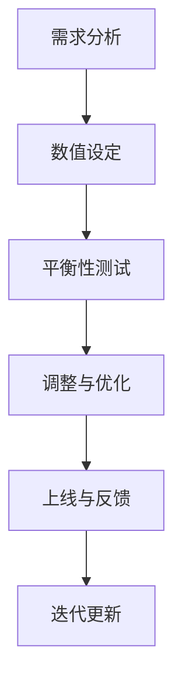

                 

 > **关键词：** 网易校招、游戏数值策划、面试题与答案、游戏开发、人才选拔

> **摘要：** 本文将深入探讨网易2024校招游戏数值策划师岗位的面试题与答案，分析面试的核心内容、考察重点和应对策略，为准备参加游戏行业校招的学子提供参考。

## 1. 背景介绍

随着游戏行业的迅猛发展，游戏数值策划师的岗位逐渐受到关注。游戏数值策划师负责游戏中的各种数值设定，包括角色属性、技能效果、道具属性等，是游戏平衡性和可玩性的关键角色。网易作为中国游戏行业的领军企业，其校招游戏数值策划师的岗位备受瞩目。本文旨在通过分析网易2024校招游戏数值策划师的面试题与答案，帮助考生更好地准备面试，提高求职成功率。

## 2. 核心概念与联系

在游戏开发中，数值策划是确保游戏平衡性的关键环节。核心概念包括：

- **属性系统：** 角色属性（如攻击力、防御力、生命值等）。
- **技能系统：** 技能效果（如范围伤害、控制效果等）。
- **道具系统：** 道具属性（如增益效果、消耗效果等）。
- **难度调节：** 根据玩家水平调整游戏难度。

以下是一个简化的Mermaid流程图，展示了游戏数值策划的基本流程：



## 3. 核心算法原理 & 具体操作步骤

### 3.1 算法原理概述

游戏数值策划中的核心算法主要包括：

- **线性算法：** 用于简单的数值增长或减少。
- **指数算法：** 用于复杂的数值增长或衰减。
- **加权算法：** 用于综合多个因素计算最终数值。

### 3.2 算法步骤详解

#### 线性算法步骤：

1. 确定初始值和增长量。
2. 根据时间或操作次数进行线性增长或减少。

#### 指数算法步骤：

1. 确定基值、指数和衰减率。
2. 根据时间或操作次数进行指数增长或衰减。

#### 加权算法步骤：

1. 确定各个因素的权重。
2. 计算加权总分。

### 3.3 算法优缺点

- **线性算法：** 简单易懂，但容易造成数值增长过快或过慢。
- **指数算法：** 更符合现实世界的增长或衰减规律，但计算复杂度较高。
- **加权算法：** 能够综合考虑多个因素，但需要精确的权重设定。

### 3.4 算法应用领域

- **角色成长：** 线性算法常用于角色等级的提升。
- **技能效果：** 指数算法常用于技能的伤害计算。
- **道具属性：** 加权算法常用于道具效果的叠加。

## 4. 数学模型和公式 & 详细讲解 & 举例说明

### 4.1 数学模型构建

游戏数值策划中的数学模型通常包括：

- **线性模型：** y = mx + b
- **指数模型：** y = a * b^x
- **加权模型：** y = w1 * x1 + w2 * x2 + ... + wn * xn

### 4.2 公式推导过程

以线性模型为例，假设角色等级为x，攻击力为y，则有公式：

y = mx + b

其中，m为攻击力的增长速率，b为初始攻击力。

### 4.3 案例分析与讲解

假设一个游戏角色，初始等级为1，攻击力为10，每提升一级攻击力增加2点。使用线性模型计算：

m = 2（攻击力增长速率）
b = 10（初始攻击力）

当角色等级为10时，攻击力y = 2 * 10 + 10 = 30

## 5. 项目实践：代码实例和详细解释说明

### 5.1 开发环境搭建

1. 安装Python环境。
2. 安装必要的游戏开发库，如Pygame。

### 5.2 源代码详细实现

以下是一个简单的Python代码示例，用于计算角色攻击力：

```python
# 设置初始值
initial_level = 1
initial_attack = 10
level_increment = 2

# 计算等级和攻击力的关系
def calculate_attack(level):
    return initial_attack + (level - initial_level) * level_increment

# 测试代码
print("等级10的攻击力：", calculate_attack(10))
```

### 5.3 代码解读与分析

这段代码首先设置了初始角色等级和攻击力，以及等级提升时攻击力的增长量。然后定义了一个计算攻击力的函数，该函数根据角色等级计算攻击力。最后通过调用函数测试代码，输出等级10的攻击力。

### 5.4 运行结果展示

运行结果如下：

```
等级10的攻击力： 30
```

## 6. 实际应用场景

游戏数值策划在游戏开发中扮演着至关重要的角色。以下是一些实际应用场景：

- **角色成长：** 角色等级、属性、技能的设定和调整。
- **技能效果：** 技能伤害、冷却时间、效果范围的设定和优化。
- **道具系统：** 道具的属性、效果、获取方式的设定和优化。
- **难度调节：** 根据玩家水平调整游戏难度，确保游戏的可玩性。

## 7. 工具和资源推荐

### 7.1 学习资源推荐

- 《游戏设计与实盘》：详细介绍了游戏设计的原理和实践。
- 《游戏数值策划基础》：针对游戏数值策划的基础知识进行讲解。

### 7.2 开发工具推荐

- Pygame：适用于简单游戏开发的Python库。
- Unity：适用于大型游戏开发的跨平台引擎。

### 7.3 相关论文推荐

- 《游戏数值策划研究》：针对游戏数值策划的理论和实践进行深入探讨。
- 《基于AI的游戏数值优化》：介绍如何利用人工智能技术优化游戏数值。

## 8. 总结：未来发展趋势与挑战

### 8.1 研究成果总结

游戏数值策划在游戏开发中起着至关重要的作用。随着人工智能、大数据等技术的不断发展，游戏数值策划的方法和工具也在不断更新和优化。

### 8.2 未来发展趋势

- **个性化数值策划：** 针对不同玩家制定个性化数值设定，提高游戏体验。
- **智能化数值优化：** 利用人工智能技术自动优化游戏数值，提高游戏平衡性。

### 8.3 面临的挑战

- **游戏平衡性：** 确保游戏在不同难度级别下保持平衡。
- **玩家体验：** 如何通过数值策划提高玩家的游戏体验。

### 8.4 研究展望

未来，游戏数值策划将继续与人工智能、大数据等前沿技术相结合，为游戏开发提供更加智能化、个性化的解决方案。

## 9. 附录：常见问题与解答

### 9.1 游戏数值策划师的主要工作是什么？

游戏数值策划师主要负责游戏中的数值设定，包括角色属性、技能效果、道具属性等，以确保游戏的平衡性和可玩性。

### 9.2 如何成为一名优秀的游戏数值策划师？

要成为一名优秀的游戏数值策划师，需要具备以下能力：

- **扎实的数学基础：** 熟悉线性、指数、加权等算法。
- **游戏开发经验：** 了解游戏开发的流程和技术。
- **沟通能力：** 能够与开发团队紧密合作，共同推进项目。

以上是本文对网易2024校招游戏数值策划师面试题与答案的全面解析。希望本文能为准备参加游戏行业校招的学子提供有益的参考。作者：禅与计算机程序设计艺术 / Zen and the Art of Computer Programming。

