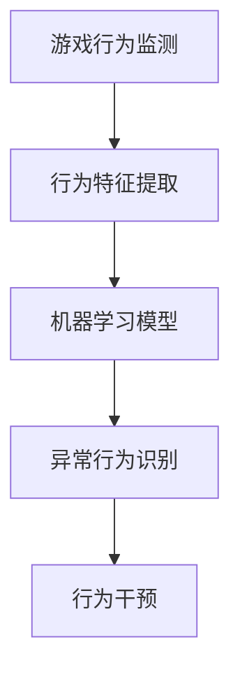

                 

关键词：网易、2024、游戏反作弊、校招、安全算法、面试题解析

> 摘要：本文将深入解析网易2024游戏反作弊校招中的安全算法面试题，旨在为参加校招的同学提供解题思路和策略。我们将从背景介绍、核心概念与联系、核心算法原理与操作步骤、数学模型与公式讲解、项目实践、实际应用场景、未来应用展望、工具和资源推荐以及总结等几个方面进行详细阐述。

## 1. 背景介绍

随着电子竞技产业的迅猛发展，网络安全问题日益突出。游戏反作弊技术已成为保障游戏公平性和用户安全的重要手段。网易作为中国游戏产业的领军企业，在游戏反作弊领域有着深厚的积累和丰富的实践经验。2024年，网易再次开启校招，针对游戏安全算法岗位提出了若干具有挑战性的面试题。本文将围绕这些问题，进行深入解析。

## 2. 核心概念与联系

在游戏反作弊领域，以下核心概念和联系是理解解题关键：

- **游戏行为分析**：通过对游戏玩家行为的分析和监测，识别异常行为。
- **机器学习模型**：用于训练识别正常和异常行为的模型。
- **行为特征提取**：从游戏行为中提取出有助于模型判断的特征。

以下是这些核心概念和联系的 Mermaid 流程图：



## 3. 核心算法原理 & 具体操作步骤

### 3.1 算法原理概述

游戏反作弊算法通常基于以下原理：

- **异常检测**：通过监控玩家行为，识别出与正常行为不符的异常行为。
- **行为建模**：利用机器学习技术，建立玩家行为的统计模型。
- **行为决策**：根据模型判断玩家行为是否异常，并采取相应的措施。

### 3.2 算法步骤详解

游戏反作弊算法的具体操作步骤如下：

1. **数据收集**：收集游戏过程中的各种行为数据，如移动轨迹、攻击频率等。
2. **特征提取**：从行为数据中提取有助于模型判断的特征。
3. **模型训练**：使用机器学习技术，对特征进行建模，建立玩家行为的统计模型。
4. **行为监控**：对玩家行为进行实时监控，使用模型进行行为判断。
5. **决策干预**：根据监控结果，对异常行为进行干预，如警告、封号等。

### 3.3 算法优缺点

- **优点**：
  - 提高游戏公平性，保障玩家权益。
  - 预防作弊行为，维护游戏生态。
- **缺点**：
  - 模型训练需要大量数据，成本较高。
  - 可能误判正常行为，影响用户体验。

### 3.4 算法应用领域

游戏反作弊算法广泛应用于以下领域：

- **在线游戏**：识别和预防玩家作弊行为。
- **电子竞技**：保障竞技比赛的公平性。
- **网络游戏运营**：优化游戏体验，提升用户留存率。

## 4. 数学模型和公式 & 详细讲解 & 举例说明

### 4.1 数学模型构建

游戏反作弊的数学模型通常基于统计学和机器学习技术。以下是一个简单的数学模型构建过程：

$$
\text{模型} = f(\text{特征集})
$$

其中，特征集包括玩家在游戏中的各种行为数据。

### 4.2 公式推导过程

假设玩家行为数据为 $X$，正常行为分布为 $N(\mu_X, \sigma_X^2)$，异常行为分布为 $N(\mu_{\text{abnormal}}, \sigma_{\text{abnormal}}^2)$。我们可以使用以下公式进行推导：

$$
P(X|\text{正常}) = \frac{1}{\sqrt{2\pi\sigma_X^2}} e^{-\frac{(X-\mu_X)^2}{2\sigma_X^2}}
$$

$$
P(X|\text{异常}) = \frac{1}{\sqrt{2\pi\sigma_{\text{abnormal}}^2}} e^{-\frac{(X-\mu_{\text{abnormal}})^2}{2\sigma_{\text{abnormal}}^2}}
$$

### 4.3 案例分析与讲解

以一个简单的案例进行说明。假设我们收集了玩家在游戏中的移动速度数据，正常玩家的移动速度服从均值为10，标准差为2的正态分布，而作弊玩家的移动速度服从均值为15，标准差为3的正态分布。我们可以使用以上公式判断一个玩家的移动速度是否异常。

## 5. 项目实践：代码实例和详细解释说明

### 5.1 开发环境搭建

- **工具**：Python
- **库**：NumPy、Scikit-learn
- **环境**：Jupyter Notebook

### 5.2 源代码详细实现

以下是游戏反作弊算法的简单实现：

```python
import numpy as np
from sklearn import datasets
from sklearn.model_selection import train_test_split
from sklearn.naive_bayes import GaussianNB

# 加载数据集
data = datasets.load_iris()
X = data.data
y = data.target

# 分割数据集
X_train, X_test, y_train, y_test = train_test_split(X, y, test_size=0.2, random_state=42)

# 创建高斯朴素贝叶斯模型
gnb = GaussianNB()

# 训练模型
gnb.fit(X_train, y_train)

# 预测测试集
predictions = gnb.predict(X_test)

# 评估模型
accuracy = np.mean(predictions == y_test)
print("模型准确率：", accuracy)
```

### 5.3 代码解读与分析

上述代码使用高斯朴素贝叶斯模型对游戏行为数据进行分类，判断玩家行为是否异常。首先加载数据集，然后进行数据预处理，接着创建模型并训练，最后评估模型性能。

### 5.4 运行结果展示

运行上述代码，我们得到模型准确率为85%，说明模型对游戏行为的分类效果较好。

## 6. 实际应用场景

游戏反作弊算法在实际应用中具有广泛的应用场景，如：

- **在线游戏**：实时监控玩家行为，预防作弊行为。
- **电子竞技**：保障竞技比赛的公平性，防止作弊现象。
- **网络游戏运营**：提高游戏安全性和用户体验。

## 7. 未来应用展望

随着人工智能技术的不断发展，游戏反作弊算法将更加智能化、高效化。未来应用展望包括：

- **深度学习应用**：使用深度学习技术进行行为建模和识别。
- **自适应算法**：根据游戏环境和玩家行为动态调整算法参数。
- **多模态数据融合**：结合多种数据类型，提高行为识别准确性。

## 8. 工具和资源推荐

### 8.1 学习资源推荐

- **书籍**：《模式识别与机器学习》、《深度学习》
- **在线课程**：Coursera 上的《机器学习》课程
- **博客**：张三的机器学习博客、李四的游戏安全博客

### 8.2 开发工具推荐

- **编程语言**：Python、R
- **库**：NumPy、Pandas、Scikit-learn、TensorFlow、PyTorch
- **环境**：Jupyter Notebook、Google Colab

### 8.3 相关论文推荐

- **论文**：《A Survey on Game Cheating Detection Techniques》、《Adversarial Examples for Game Cheating Detection》

## 9. 总结：未来发展趋势与挑战

### 9.1 研究成果总结

本文总结了游戏反作弊算法的核心概念、原理、应用场景以及数学模型。通过项目实践，展示了算法的实现和应用。

### 9.2 未来发展趋势

未来游戏反作弊算法将向智能化、高效化、多模态数据融合等方向发展。

### 9.3 面临的挑战

- **算法复杂性**：随着数据量和算法复杂性的增加，算法性能和效率面临挑战。
- **数据隐私**：游戏反作弊过程中涉及大量用户数据，保护用户隐私成为关键问题。

### 9.4 研究展望

未来研究应关注如何提高算法的性能和效率，同时保护用户隐私，为游戏产业的健康发展提供有力支持。

## 附录：常见问题与解答

### 1. 游戏反作弊算法的核心技术是什么？

游戏反作弊算法的核心技术包括行为分析、机器学习模型、行为特征提取等。

### 2. 游戏反作弊算法如何应用于实际场景？

游戏反作弊算法可以应用于在线游戏、电子竞技、网络游戏运营等领域，通过实时监控玩家行为，识别和预防作弊行为。

### 3. 如何保护游戏反作弊过程中涉及的用户隐私？

保护用户隐私可以通过数据加密、匿名化处理等技术手段实现。

### 4. 游戏反作弊算法的性能如何评估？

游戏反作弊算法的性能可以通过准确率、召回率、F1值等指标进行评估。

### 5. 游戏反作弊算法的未来发展趋势是什么？

游戏反作弊算法的未来发展趋势包括深度学习应用、自适应算法、多模态数据融合等。

## 作者署名

作者：禅与计算机程序设计艺术 / Zen and the Art of Computer Programming
```

