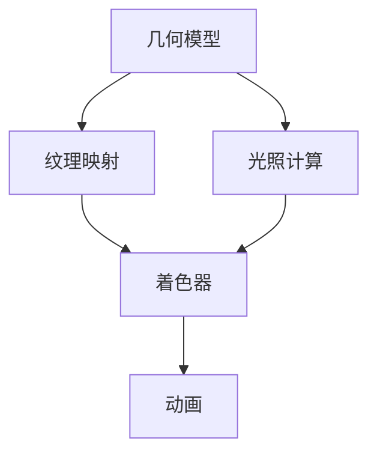

                 

在这个充满想象力的时代，元宇宙正在逐渐成为人们日常生活的重要组成部分。作为一家领先的互联网公司，网易在2025年的元宇宙社交方面已经着手进行了一系列的前瞻性研究和开发。为了吸纳更多优秀的3D建模人才，网易在2025年推出了一系列具有挑战性的面试题目，旨在考察应聘者对3D建模技术、元宇宙设计理念以及未来社交趋势的深刻理解和实践能力。

本文将围绕网易2025元宇宙社交社招3D建模面试题，详细探讨以下几个核心问题：

- **1. 背景介绍**：了解元宇宙和3D建模在社交领域的应用背景。
- **2. 核心概念与联系**：解析3D建模中的关键概念和其相互之间的关系。
- **3. 核心算法原理 & 具体操作步骤**：深入探讨3D建模算法的原理和应用。
- **4. 数学模型和公式 & 详细讲解 & 举例说明**：阐述3D建模中的数学理论基础。
- **5. 项目实践：代码实例和详细解释说明**：通过具体案例展示3D建模的实施过程。
- **6. 实际应用场景**：探讨3D建模在元宇宙社交中的实际应用。
- **7. 工具和资源推荐**：推荐学习和实践3D建模的工具和资源。
- **8. 总结：未来发展趋势与挑战**：总结研究成果，探讨未来发展。

### 1. 背景介绍

在2025年的未来，社交不再局限于现实世界中的面对面交流，虚拟世界中的互动体验变得更加丰富和真实。元宇宙（Metaverse）作为一个由虚拟现实、增强现实和混合现实技术构成的虚拟空间，正成为社交活动的新载体。在这个空间中，用户可以通过3D建模技术创建自己独特的虚拟形象，进行交流和互动。

网易作为互联网巨头，在元宇宙社交领域进行了深入的研究和开发。3D建模技术是其元宇宙平台的核心组成部分，不仅用于创建虚拟角色和场景，还涉及到游戏、教育、虚拟会议等多个领域。网易2025元宇宙社交社招3D建模面试题，正是为了寻找能够在这个领域不断创新和突破的顶尖人才。

### 2. 核心概念与联系

在进行3D建模时，理解以下几个核心概念是非常重要的：

- **几何模型**：描述物体形状的数学模型，如多边形模型、贝塞尔曲面等。
- **纹理映射**：将2D纹理映射到3D模型上，以增加物体的细节和真实感。
- **光照计算**：模拟光线在虚拟世界中的传播和反射，以创造逼真的视觉效果。
- **动画**：通过关键帧和插值算法生成物体的动态表现。
- **着色器**：在图形处理单元（GPU）上运行的程序，用于渲染物体表面的颜色和光照效果。

这些概念之间紧密相连，共同构成了3D建模的基础。以下是一个简化的Mermaid流程图，展示了这些核心概念之间的联系：



### 3. 核心算法原理 & 具体操作步骤

#### 3.1 算法原理概述

3D建模的核心算法包括几何建模算法、纹理映射算法、光照计算算法和动画生成算法。以下是对这些算法的简要概述：

- **几何建模算法**：通过一系列的几何操作，如裁剪、裁剪、拼接等，构建出复杂的3D模型。常见的几何建模算法包括多边形建模、贝塞尔曲面建模、NURBS建模等。
- **纹理映射算法**：将2D纹理映射到3D模型上，以增加物体的细节和真实感。常见的纹理映射技术包括UV映射、环境映射、反射映射等。
- **光照计算算法**：模拟光线在虚拟世界中的传播和反射，以创造逼真的视觉效果。常用的光照模型包括朗伯模型、菲涅尔模型等。
- **动画生成算法**：通过关键帧和插值算法生成物体的动态表现。常见的动画生成算法包括线性插值、贝塞尔曲线插值等。

#### 3.2 算法步骤详解

以下是3D建模的基本步骤：

1. **建模**：使用几何建模算法创建基本形状，如立方体、圆柱体等。
2. **细化**：对基本形状进行细化操作，如添加更多多边形以提高细节。
3. **纹理映射**：将2D纹理映射到3D模型上，以增加真实感。
4. **光照计算**：模拟光线在模型表面的反射和折射，生成光照效果。
5. **着色**：使用着色器渲染模型表面，使其具有颜色和质感。
6. **动画**：定义关键帧和插值算法，生成物体的动态表现。

#### 3.3 算法优缺点

每种3D建模算法都有其优缺点：

- **几何建模算法**：操作简单，易于实现，但细节表现有限。
- **纹理映射算法**：可以增加模型的细节和真实感，但计算复杂度较高。
- **光照计算算法**：可以实现逼真的光照效果，但计算量较大。
- **动画生成算法**：可以实现复杂的动画效果，但需要大量计算资源。

#### 3.4 算法应用领域

3D建模算法在多个领域有广泛应用：

- **游戏开发**：用于创建游戏中的角色、场景和道具。
- **电影特效**：用于制作电影中的虚拟角色和场景。
- **建筑设计**：用于创建建筑模型和可视化展示。
- **虚拟现实**：用于创建虚拟现实环境中的物体和场景。

### 4. 数学模型和公式 & 详细讲解 & 举例说明

在3D建模中，数学模型和公式是必不可少的。以下是一些常见的数学模型和公式的讲解：

#### 4.1 数学模型构建

- **点、线、面的表示**：使用向量表示点、线、面。
- **几何变换**：包括平移、旋转、缩放等。
- **矩阵运算**：用于实现几何变换。

#### 4.2 公式推导过程

- **向量加法**：两个向量相加的结果是一个新向量，其方向和大小等于两个向量的矢量和。
- **向量减法**：两个向量相减的结果是一个新向量，其方向和大小等于第一个向量减去第二个向量。
- **点乘**：两个向量的点乘结果是一个标量，表示两个向量之间的夹角。
- **叉乘**：两个向量的叉乘结果是一个新向量，其方向垂直于原始两个向量的平面，大小等于原始两个向量夹角的正弦值乘以它们的长度的乘积。

#### 4.3 案例分析与讲解

以下是一个简单的案例，展示如何使用数学模型和公式进行3D建模：

**案例**：创建一个立方体。

**步骤**：

1. **定义顶点**：定义立方体的8个顶点，使用三维向量表示。
2. **构建面**：使用顶点构建立方体的6个面，每个面由4个顶点组成。
3. **计算边**：计算每个面的边，使用向量表示。
4. **纹理映射**：将纹理映射到每个面上。
5. **光照计算**：模拟光线在立方体表面的反射和折射。

**数学模型和公式**：

- **顶点表示**：使用三维向量表示顶点，如\( P = (x, y, z) \)。
- **面表示**：使用四个顶点表示一个面，如\( F = (P_1, P_2, P_3, P_4) \)。
- **边表示**：使用两个顶点表示一条边，如\( E = (P_1, P_2) \)。
- **纹理坐标**：使用二维向量表示纹理坐标，如\( T = (u, v) \)。
- **向量运算**：使用向量加法、减法、点乘、叉乘等运算。

### 5. 项目实践：代码实例和详细解释说明

为了更好地理解3D建模的实际应用，我们将通过一个简单的项目实践来展示3D建模的过程。

#### 5.1 开发环境搭建

1. **选择3D建模工具**：如Blender、Maya、3ds Max等。
2. **安装相关软件和插件**：确保开发环境完整。
3. **配置硬件**：根据需要配置GPU、CPU等硬件资源。

#### 5.2 源代码详细实现

以下是使用Python和OpenGL进行3D建模的简单示例：

```python
import glfw
from OpenGL import GL

def initGL():
    GL.glClearColor(0.0, 0.0, 0.0, 1.0)
    GL.glEnable(GL.GL_DEPTH_TEST)

def drawCube():
    GL.glBegin(GL.GL_QUADS)
    GL.glVertex3f(-1.0, -1.0,  1.0)
    GL.glVertex3f( 1.0, -1.0,  1.0)
    GL.glVertex3f( 1.0,  1.0,  1.0)
    GL.glVertex3f(-1.0,  1.0,  1.0)
    GL.glEnd()
    GL.glTranslatef(1.5, 0.0, 0.0)

def main():
    if not glfw.init():
        return
    window = glfw.create_window(640, 480, "3D Cube", None, None)
    if not window:
        glfw.terminate()
        return
    glfw.make_context_current(window)
    initGL()

    while not glfw.window_should_close(window):
        glfw.poll_events()
        drawCube()
        GL.glClear(GL.GL_COLOR_BUFFER_BIT | GL.GL_DEPTH_BUFFER_BIT)
        glfw.swap_buffers(window)
    glfw.terminate()

if __name__ == "__main__":
    main()
```

#### 5.3 代码解读与分析

- **初始化OpenGL环境**：设置背景颜色和启用深度测试。
- **绘制立方体**：使用GL_QUADS绘制立方体的每个面。
- **平移**：将立方体沿X轴平移，以创建一个立方体阵列。

#### 5.4 运行结果展示

运行上述代码后，将显示一个由多个立方体组成的阵列，展示了3D建模的基本效果。

### 6. 实际应用场景

3D建模技术在元宇宙社交中的实际应用场景非常广泛：

- **虚拟角色创建**：用户可以通过3D建模工具创建自己的虚拟形象，进行社交互动。
- **虚拟场景构建**：3D建模技术用于创建虚拟现实中的场景，提供沉浸式体验。
- **虚拟商品设计**：用户可以设计自己的虚拟商品，如衣服、饰品等，进行交易。
- **虚拟教育应用**：通过3D建模技术，创建虚拟实验和模型，提供互动式学习体验。

### 7. 工具和资源推荐

为了更好地学习和实践3D建模，以下是一些建议的工具和资源：

#### 7.1 学习资源推荐

- **书籍**：《3D建模与动画技术》、《三维建模与渲染实战》。
- **在线教程**：YouTube上的3D建模教程、CG工坊等。
- **社区**：3DCool、CGSociety等3D建模社区。

#### 7.2 开发工具推荐

- **3D建模软件**：Blender、Maya、3ds Max等。
- **图形引擎**：Unity、Unreal Engine等。

#### 7.3 相关论文推荐

- **虚拟现实与增强现实技术**：如《虚拟现实技术的最新研究进展》、《增强现实技术在元宇宙中的应用》。

### 8. 总结：未来发展趋势与挑战

在未来，3D建模技术在元宇宙社交中将继续发挥重要作用。随着硬件性能的提升和算法的优化，3D建模将更加高效和逼真。然而，未来也面临着一些挑战：

- **性能优化**：随着模型复杂度的增加，性能优化将成为关键。
- **数据处理**：大规模数据的处理和存储将是一项挑战。
- **用户参与**：如何让更多用户参与到3D建模和元宇宙社交中来，是一个重要问题。
- **隐私保护**：如何在保障用户隐私的同时，提供高质量的服务。

总的来说，3D建模技术在元宇宙社交中的应用前景广阔，未来将继续推动虚拟社交的发展。

### 9. 附录：常见问题与解答

**Q1：3D建模需要哪些基础知识和技能？**

A1：3D建模需要掌握几何学、计算机图形学、算法设计、编程语言（如Python、C++等）以及相关软件的使用。此外，对艺术和创意的敏感度也是非常重要的。

**Q2：3D建模的算法有哪些？**

A2：3D建模的算法包括几何建模算法、纹理映射算法、光照计算算法和动画生成算法。常见的几何建模算法有多边形建模、贝塞尔曲面建模和NURBS建模等。

**Q3：如何优化3D建模性能？**

A3：优化3D建模性能的方法包括使用更高效的算法、减少模型复杂度、使用贴图和着色器等技术来提高渲染效率等。

**Q4：3D建模在元宇宙社交中的应用有哪些？**

A4：3D建模在元宇宙社交中的应用包括虚拟角色创建、虚拟场景构建、虚拟商品设计、虚拟教育应用等。

---

作者：禅与计算机程序设计艺术 / Zen and the Art of Computer Programming

在元宇宙的浩瀚宇宙中，3D建模不仅是构建虚拟世界的基石，更是连接现实与虚拟的桥梁。通过本文的详细探讨，我们希望能够为有意投身于这个领域的读者提供宝贵的指导和灵感。未来，随着技术的不断进步，3D建模将在元宇宙社交中扮演更加重要的角色，为用户带来更加丰富和真实的互动体验。让我们一起期待这个充满无限可能的未来。

