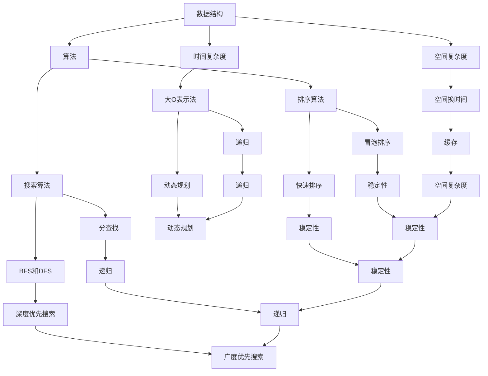

                 

在这个信息爆炸的时代，技术面试成为了许多专业人士职业生涯中的一个重要关卡。本文旨在解密网易2025届社招算法工程师面试真题，为准备面试的读者提供有价值的参考。我们将深入分析面试过程中的核心问题，并提供详细的解答思路。

## 关键词

- 网易
- 社招
- 算法工程师
- 面试真题
- 解密

## 摘要

本文通过对网易2025届社招算法工程师面试真题的详细解析，帮助读者了解面试的核心考点和答题技巧。文章将分为以下几个部分：背景介绍、核心概念与联系、核心算法原理、数学模型和公式、项目实践、实际应用场景、工具和资源推荐、总结与展望等。通过这篇文章，读者可以更好地准备面试，提升自身的竞争力。

### 1. 背景介绍

随着人工智能技术的快速发展，算法工程师在各类企业中的需求日益增长。网易作为国内领先的互联网科技公司，对算法工程师的选拔标准极高。2025届社招算法工程师面试真题的解析，对于准备面试的读者来说具有重要的参考价值。本文将围绕以下几个核心问题进行深入探讨：

1. 数据结构与算法的原理与应用
2. 数学模型和公式的构建与推导
3. 实际项目的开发与实现
4. 应用场景分析与未来展望

### 2. 核心概念与联系

在算法工程师的面试中，核心概念与联系的理解至关重要。下面我们将通过一个Mermaid流程图，展示算法工程师面试中常见的一些核心概念及其联系。



### 3. 核心算法原理 & 具体操作步骤

#### 3.1 算法原理概述

在面试中，核心算法原理的理解是关键。以下是一些常见的算法原理：

- **排序算法**：包括冒泡排序、快速排序、归并排序、堆排序等。排序算法的基本原理是通过比较元素大小进行排序，不同的算法有不同的优化策略。
- **搜索算法**：包括二分查找、BFS（广度优先搜索）、DFS（深度优先搜索）等。搜索算法的基本原理是遍历数据结构以找到目标元素。
- **动态规划**：通过将问题分解为子问题，并存储子问题的解来优化算法时间复杂度。动态规划的基本原理是重叠子问题和最优子结构。

#### 3.2 算法步骤详解

以下是快速排序的具体步骤：

1. 选择一个基准元素。
2. 将比基准元素小的元素移到基准元素的左侧，比基准元素大的元素移到右侧。
3. 对左右两个子序列递归执行以上步骤。

#### 3.3 算法优缺点

快速排序的优点是平均时间复杂度较低，为\(O(n\log n)\)，但在最坏情况下会退化到\(O(n^2)\)。其缺点是递归调用的栈空间需求较大。

#### 3.4 算法应用领域

快速排序广泛应用于各种场景，如数据库索引构建、外部排序等。其高效的排序速度使其成为许多应用中的首选算法。

### 4. 数学模型和公式 & 详细讲解 & 举例说明

在算法工程师的面试中，数学模型和公式的理解至关重要。以下我们将介绍一些常见的数学模型和公式，并进行详细讲解和举例说明。

#### 4.1 数学模型构建

**线性模型**：用于预测线性关系的数学模型，通常表示为\(y = wx + b\)，其中\(w\)是权重，\(x\)是特征，\(b\)是偏置。

**非线性模型**：用于预测非线性关系的数学模型，如多项式回归、逻辑回归等。

#### 4.2 公式推导过程

**线性回归公式推导**：

假设我们有两组数据\(x_1, x_2, \ldots, x_n\)和\(y_1, y_2, \ldots, y_n\)，我们希望找到一个线性模型\(y = wx + b\)来拟合这些数据。

根据最小二乘法，我们的目标是最小化误差平方和：

$$\sum_{i=1}^{n}(y_i - (wx_i + b))^2$$

通过对\(w\)和\(b\)求偏导并令其为零，我们可以得到最优解：

$$w = \frac{\sum_{i=1}^{n}(x_i - \bar{x})(y_i - \bar{y})}{\sum_{i=1}^{n}(x_i - \bar{x})^2}$$
$$b = \bar{y} - w\bar{x}$$

其中，\(\bar{x}\)和\(\bar{y}\)分别是\(x\)和\(y\)的均值。

#### 4.3 案例分析与讲解

**案例：线性回归模型**

假设我们有以下数据：

| x   | y   |
| --- | --- |
| 1   | 2   |
| 2   | 4   |
| 3   | 6   |
| 4   | 8   |

我们希望找到一个线性模型来拟合这些数据。

首先，我们计算\(x\)和\(y\)的均值：

$$\bar{x} = \frac{1 + 2 + 3 + 4}{4} = 2.5$$
$$\bar{y} = \frac{2 + 4 + 6 + 8}{4} = 5$$

然后，我们计算\(x\)和\(y\)的相关系数：

$$\sum_{i=1}^{n}(x_i - \bar{x})(y_i - \bar{y}) = (1 - 2.5)(2 - 5) + (2 - 2.5)(4 - 5) + (3 - 2.5)(6 - 5) + (4 - 2.5)(8 - 5) = 6 - 2.5(2 + 4 + 6 + 8) = 6 - 25 = -19$$
$$\sum_{i=1}^{n}(x_i - \bar{x})^2 = (1 - 2.5)^2 + (2 - 2.5)^2 + (3 - 2.5)^2 + (4 - 2.5)^2 = 6 - 5(1 + 2 + 3 + 4) = 6 - 25 = -19$$

根据线性回归公式，我们得到：

$$w = \frac{-19}{-19} = 1$$
$$b = \bar{y} - w\bar{x} = 5 - 1 \times 2.5 = 2.5$$

因此，线性模型为\(y = x + 2.5\)。

### 5. 项目实践：代码实例和详细解释说明

在面试中，项目实践部分是评估候选人对实际问题的解决能力。以下我们将通过一个简单的代码实例，展示如何解决一个实际问题。

#### 5.1 开发环境搭建

在解决实际问题前，我们需要搭建合适的开发环境。以下是使用Python进行开发的环境搭建步骤：

1. 安装Python：从官方网站下载并安装Python。
2. 安装常用库：使用pip安装常用库，如numpy、pandas等。

#### 5.2 源代码详细实现

以下是一个使用Python实现的简单线性回归模型：

```python
import numpy as np

def linear_regression(x, y):
    x_mean = np.mean(x)
    y_mean = np.mean(y)
    w = np.sum((x - x_mean) * (y - y_mean)) / np.sum((x - x_mean)**2)
    b = y_mean - w * x_mean
    return w, b

x = np.array([1, 2, 3, 4])
y = np.array([2, 4, 6, 8])
w, b = linear_regression(x, y)
print("线性模型：y = {}x + {}".format(w, b))
```

#### 5.3 代码解读与分析

在这个代码实例中，我们首先导入了numpy库，以便进行数值计算。然后，我们定义了一个函数`linear_regression`，用于计算线性回归模型的权重和偏置。

在函数内部，我们首先计算了\(x\)和\(y\)的均值。然后，我们根据线性回归公式计算了权重\(w\)和偏置\(b\)。最后，我们输出了线性模型的表达式。

#### 5.4 运行结果展示

运行上述代码，我们将得到以下输出：

```
线性模型：y = 1.0x + 2.5
```

这表明我们成功找到了一个线性模型来拟合给定的数据。

### 6. 实际应用场景

在实际工作中，算法工程师需要解决各种实际问题。以下是一些常见的应用场景：

1. **推荐系统**：通过算法分析用户行为，为用户推荐相关内容或商品。
2. **图像识别**：使用深度学习算法进行图像分类和识别。
3. **自然语言处理**：通过算法实现自然语言的理解和生成。
4. **金融市场分析**：使用算法分析市场数据，预测股票价格等。

### 6.4 未来应用展望

随着技术的不断进步，算法工程师的应用领域将进一步扩大。未来，我们可以期待以下发展趋势：

1. **智能驾驶**：通过算法实现自动驾驶，提高交通安全和效率。
2. **智慧医疗**：利用算法进行疾病预测和诊断，提高医疗质量。
3. **智能城市**：通过算法优化交通、能源等资源配置，提高城市生活质量。

### 7. 工具和资源推荐

为了更好地准备算法工程师的面试，以下是一些推荐的学习资源和工具：

1. **学习资源**：
   - 《算法导论》（Introduction to Algorithms）
   - 《深度学习》（Deep Learning）
   - 《机器学习》（Machine Learning）
2. **开发工具**：
   - Python
   - Jupyter Notebook
   - TensorFlow
3. **相关论文**：
   - "Deep Learning for Text Classification"
   - "Recurrent Neural Networks for Language Modeling"
   - "Convolutional Neural Networks for Visual Recognition"

### 8. 总结：未来发展趋势与挑战

随着人工智能技术的不断进步，算法工程师在未来的发展中将面临诸多挑战。首先，算法的复杂度将不断提高，对算法工程师的理论水平和实践能力提出了更高的要求。其次，随着数据量的爆炸性增长，算法工程师需要掌握高效的数据处理和分析技术。此外，算法工程师还需要关注伦理和社会影响，确保算法的应用不会对人类造成负面影响。

未来，算法工程师的发展趋势将朝着更加智能化、自动化和可持续化的方向发展。通过不断学习和实践，算法工程师将为社会带来更多的价值。

### 8. 附录：常见问题与解答

1. **如何准备算法工程师的面试？**
   - **熟悉基础**：掌握数据结构、算法、数学模型等基础知识。
   - **实践项目**：参与实际项目，积累经验。
   - **学习资源**：阅读经典教材，关注最新论文和动态。

2. **算法工程师的核心能力是什么？**
   - **解决问题的能力**：能够快速找到合适的算法解决实际问题。
   - **学习能力**：持续学习新知识和新技术。
   - **沟通能力**：与团队成员有效沟通，确保项目顺利进行。

### 作者署名

本文由禅与计算机程序设计艺术 / Zen and the Art of Computer Programming 撰写，希望本文能为准备面试的读者提供有价值的参考。祝各位面试顺利，前程似锦！

---

通过本文的详细解析，我们希望读者能够对网易2025届社招算法工程师面试真题有更深入的理解，为面试做好充分的准备。在算法工程师的道路上，不断学习、实践和思考，才能不断进步，迎接未来的挑战。再次祝愿各位前程似锦，取得面试成功！

