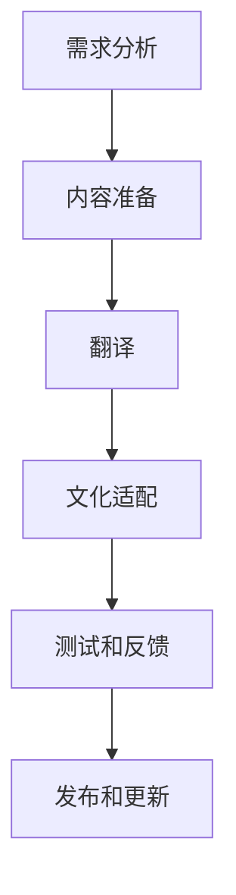

                 

在这个快速发展的时代，游戏产业的全球化趋势愈发显著。随着中国游戏市场在国际上的影响力不断提升，越来越多的游戏开发商，如网易，将目光投向海外市场。为了确保游戏内容能够适应不同地区和文化背景的玩家，本地化成为了一项至关重要的任务。本地化不仅仅是语言翻译那么简单，它涉及到文化差异、用户体验等多个方面。本文将探讨网易在2025年游戏出海过程中招聘本地化工程师所面临的面试题，以及如何应对这些挑战。

## 关键词 Keywords
- 网易
- 游戏出海
- 本地化工程师
- 面试题
- 文化适配
- 用户体验

## 摘要 Abstract
本文旨在分析网易在2025年游戏出海过程中，招聘本地化工程师时可能遇到的关键面试问题。通过对本地化工程师的职责和挑战的深入探讨，本文提供了实用的策略和建议，帮助求职者更好地准备面试，同时也为游戏公司的本地化工作提供了一些指导。

## 1. 背景介绍 Background

游戏产业的全球化不仅是市场扩张的必然趋势，也是技术创新和文化交流的体现。随着互联网的普及和移动设备的普及，全球玩家对优质游戏内容的需求不断增加。然而，不同国家和地区在文化、语言、游戏习惯等方面存在显著差异，这使得游戏本地化成为了一项复杂而重要的工作。

网易作为一家知名的中国游戏公司，其游戏产品在全球范围内都拥有庞大的用户基础。在2025年，网易加大了游戏出海的步伐，希望通过本地化战略，进一步拓展海外市场。因此，招聘具备国际化视野和专业技能的本地化工程师成为了网易的重要任务。

本地化工程师的职责不仅包括语言翻译，还要深入理解目标市场的文化、习惯和偏好，确保游戏内容能够无缝对接当地用户。此外，本地化工程师还需与游戏开发团队紧密协作，确保本地化工作不影响游戏的质量和开发进度。

## 2. 核心概念与联系 Core Concepts & Connections

### 2.1. 本地化的核心概念 Core Concepts of Localization

本地化（Localization）是将软件、游戏、网站等产品根据特定语言和文化需求进行调整和修改的过程。本地化的核心概念包括：

- **语言翻译**：将产品中的文本翻译成目标语言。
- **文化适配**：考虑文化差异，确保产品内容在目标市场不产生误解或冒犯。
- **用户体验**：优化用户界面和交互设计，提高产品的易用性和吸引力。

### 2.2. 本地化的相关概念 Associated Concepts of Localization

- **全球化**（Globalization）：产品面向全球市场设计和开发，而非特定地区。
- **国际化**（Internationalization）：在产品设计和开发阶段就考虑到本地化的需求，以便在不同市场进行本地化。
- **多语言支持**（Multilingual Support）：产品能够支持多种语言的界面和内容。

### 2.3. 本地化的架构和流程 Architecture & Process of Localization

本地化的架构和流程通常包括以下步骤：

1. **需求分析**：了解目标市场的语言、文化、法规等需求。
2. **内容准备**：收集和整理需要翻译和修改的内容。
3. **翻译**：对文本进行翻译，确保语言的准确性和流畅性。
4. **文化适配**：对翻译后的内容进行审查和修改，确保文化适宜性。
5. **测试和反馈**：进行用户体验测试，收集反馈并进行调整。

### 2.4. Mermaid 流程图 Mermaid Flowchart

以下是一个简化的本地化流程的 Mermaid 流程图：



## 3. 核心算法原理 & 具体操作步骤 Core Algorithm Principles & Specific Operation Steps

### 3.1. 算法原理概述 Overview of Algorithm Principles

本地化过程中的核心算法原理主要包括：

- **文本翻译算法**：利用机器翻译技术（如神经机器翻译）进行文本翻译。
- **文化适配算法**：通过自然语言处理（NLP）技术和文化知识库进行文化分析和适配。
- **用户体验优化算法**：结合用户测试和数据分析，优化用户界面和交互设计。

### 3.2. 算法步骤详解 Detailed Steps of Algorithm

1. **文本翻译**：
   - 利用预训练的神经网络翻译模型进行文本翻译。
   - 对翻译结果进行语法和语义的校验，确保翻译的准确性。

2. **文化适配**：
   - 使用文化知识库进行文化差异分析。
   - 对文本内容进行文化适宜性审查和修改。

3. **用户体验优化**：
   - 通过A/B测试和用户反馈，收集用户体验数据。
   - 根据数据调整用户界面和交互设计。

### 3.3. 算法优缺点 Advantages and Disadvantages of Algorithm

- **文本翻译算法**：
  - 优点：高效、准确，支持多种语言。
  - 缺点：有时难以完全理解文化背景，可能导致翻译不当。

- **文化适配算法**：
  - 优点：能够考虑文化差异，提高产品适宜性。
  - 缺点：需要对文化有深入了解，开发成本较高。

- **用户体验优化算法**：
  - 优点：提高用户满意度，增强产品的竞争力。
  - 缺点：需要大量用户数据支持，测试和调整过程耗时。

### 3.4. 算法应用领域 Application Fields of Algorithm

- **游戏本地化**：优化游戏文案、用户界面和交互设计，提高游戏的可玩性。
- **应用程序本地化**：适配不同语言和文化，扩大用户群体。
- **网站本地化**：确保网站内容和文化适宜性，提高用户访问体验。

## 4. 数学模型和公式 Mathematical Models & Formulas

### 4.1. 数学模型构建 Building Mathematical Models

在本地化过程中，数学模型可以用于：

- **文本相似度计算**：比较不同语言文本的相似程度，帮助选择最佳翻译。
- **文化差异度量**：评估不同文化之间的差异，指导文化适配策略。

### 4.2. 公式推导过程 Derivation Process of Formulas

以下是一个简化的文本相似度计算公式的推导过程：

$$
similarity = \frac{cosine\_similarity}{max(\text{length}_1, \text{length}_2)}
$$

- **cosine_similarity**：余弦相似度，衡量两个向量的方向一致性。
- **length_1** 和 **length_2**：文本1和文本2的长度。

### 4.3. 案例分析与讲解 Case Analysis and Explanation

假设有两个英文文本A和B，分别有100个词和200个词。通过计算，文本A和文本B的余弦相似度为0.8。这意味着文本A和B在内容上高度相似。根据相似度公式，文本A和B的相似度得分为0.8/1=0.8。

在实际应用中，本地化工程师可以使用这样的数学模型来选择最佳的翻译版本，确保文本在文化上的一致性和准确性。

## 5. 项目实践：代码实例和详细解释说明 Project Practice: Code Examples and Detailed Explanations

### 5.1. 开发环境搭建 Environment Setup

为了演示本地化过程中的代码实现，我们需要搭建以下开发环境：

- **编程语言**：Python
- **工具**：翻译API（如Google Translate API）、自然语言处理库（如NLTK）、数据分析库（如Pandas）

### 5.2. 源代码详细实现 Detailed Implementation of Source Code

以下是一个简化的本地化项目的代码实现：

```python
import requests
from nltk.tokenize import word_tokenize
from sklearn.metrics.pairwise import cosine_similarity

# 使用Google Translate API进行文本翻译
def translate_text(text, target_language):
    api_url = "https://translate.googleapis.com/translate_a/single"
    params = {
        "q": text,
        "target": target_language,
        "format": "text",
    }
    response = requests.get(api_url, params=params)
    translated_text = response.json()[0][0][0]
    return translated_text

# 计算文本相似度
def calculate_similarity(text1, text2):
    tokens1 = word_tokenize(text1)
    tokens2 = word_tokenize(text2)
    vector1 = ...  # 使用词向量库生成文本向量
    vector2 = ...  # 使用词向量库生成文本向量
    similarity = cosine_similarity([vector1], [vector2])[0][0]
    return similarity

# 主函数
def main():
    original_text = "This is a sample text for localization."
    translated_text = translate_text(original_text, "es")  # 翻译成西班牙语
    similarity = calculate_similarity(original_text, translated_text)
    print(f"Translated Text: {translated_text}")
    print(f"Similarity Score: {similarity}")

if __name__ == "__main__":
    main()
```

### 5.3. 代码解读与分析 Code Interpretation and Analysis

- **翻译API调用**：使用Google Translate API进行文本翻译，这是本地化过程中常见的一步。
- **文本相似度计算**：通过自然语言处理库和机器学习库，计算文本的相似度，帮助本地化工程师评估翻译的准确性。

### 5.4. 运行结果展示 Result Display

运行上述代码后，将输出翻译后的文本和相似度得分。根据相似度得分，本地化工程师可以判断翻译的准确性，并进一步调整翻译内容。

## 6. 实际应用场景 Practical Application Scenarios

### 6.1. 游戏本地化 Localization of Games

游戏本地化是本地化工作中最具挑战性的一部分。除了语言翻译，还需要考虑游戏中的文化元素、角色设定、故事情节等。例如，在中国推出的游戏中，角色名字可能使用中文，而在西方市场推出时，可能需要使用英文或其他语言的名称。此外，游戏的音效、动画和文化符号也需要进行适当调整，以确保在不同文化背景下具有吸引力。

### 6.2. 应用程序本地化 Localization of Applications

应用程序的本地化相对简单，主要涉及语言翻译和用户界面适配。例如，一个在中国推出的社交媒体应用，可能需要将界面翻译成多种语言，同时考虑不同文化背景下的用户习惯和偏好。

### 6.3. 网站本地化 Localization of Websites

网站本地化需要考虑文本翻译、图片和文化符号的适配。例如，一个在中国推出的电商平台，可能需要将产品描述、用户评论和广告翻译成多种语言，并确保在不同文化背景下具有吸引力。

### 6.4. 未来应用展望 Future Application Prospects

随着人工智能和机器学习技术的发展，本地化工作将变得更加高效和准确。例如，使用深度学习技术进行文本翻译，将极大地提高翻译质量和速度。此外，自动化测试和反馈系统也将帮助本地化工程师更快地发现和解决问题，提高本地化工作的质量。

## 7. 工具和资源推荐 Tools and Resource Recommendations

### 7.1. 学习资源推荐 Learning Resources

- **在线课程**：Coursera、edX等平台提供了多种关于本地化、翻译和计算机科学的课程。
- **专业书籍**：《本地化技术》、《翻译理论与实践》、《计算机科学概论》等。

### 7.2. 开发工具推荐 Development Tools

- **翻译API**：Google Translate API、DeepL API等，用于文本翻译。
- **自然语言处理库**：NLTK、spaCy等，用于文本处理和分析。
- **数据分析库**：Pandas、NumPy等，用于数据分析。

### 7.3. 相关论文推荐 Related Papers

- **《机器翻译中的深度学习》**：介绍了深度学习在机器翻译中的应用。
- **《本地化过程中的文化适配问题》**：探讨了本地化过程中文化适配的重要性。

## 8. 总结：未来发展趋势与挑战 Summary: Future Trends and Challenges

### 8.1. 研究成果总结 Research Achievements

近年来，本地化技术在语言翻译、文化适配和用户体验优化方面取得了显著进展。机器翻译技术的提升、自然语言处理技术的应用，以及用户反馈机制的优化，都为本地化工作提供了强有力的支持。

### 8.2. 未来发展趋势 Future Trends

- **人工智能的深入应用**：随着人工智能技术的发展，本地化工作将更加自动化和高效。
- **多语言支持**：越来越多的产品将支持多种语言，以满足全球用户的需求。
- **文化多元性**：本地化工作将更加注重文化多元性，确保产品在不同文化背景下的适宜性。

### 8.3. 面临的挑战 Challenges

- **文化差异**：不同文化之间的差异使得本地化工作具有挑战性。
- **开发成本**：本地化工作需要大量的时间和资源，增加开发成本。
- **用户满意度**：确保本地化后的产品能够满足不同用户的期望和需求，是本地化工作的重要挑战。

### 8.4. 研究展望 Research Prospects

未来，本地化技术将继续向智能化、自动化方向发展。通过结合人工智能、大数据和云计算等前沿技术，本地化工作将变得更加高效和精准。同时，本地化工程师的角色也将变得更加重要，他们需要具备跨学科的知识和技能，以应对日益复杂的本地化挑战。

## 9. 附录：常见问题与解答 Appendices: Frequently Asked Questions and Answers

### 9.1. 什么是本地化？ What is Localization?

本地化是将产品（如软件、游戏、网站）根据特定语言和文化需求进行调整和修改的过程，以确保产品在目标市场具有吸引力和适用性。

### 9.2. 本地化工程师的职责是什么？ What are the responsibilities of a Localization Engineer?

本地化工程师的职责包括文本翻译、文化适配、用户体验优化等，确保产品在不同语言和文化背景下的适用性和吸引力。

### 9.3. 如何进行文化适配？ How to do Cultural Adaptation?

进行文化适配需要深入了解目标市场的文化、习俗和偏好，通过审查和修改文本、图像和交互设计，确保产品内容在目标市场不产生误解或冒犯。

### 9.4. 本地化与全球化的区别是什么？ What is the difference between Localization and Globalization?

全球化是产品面向全球市场设计和开发，而本地化是全球化过程中的一个重要环节，将产品根据特定市场进行调整和优化。

---

本文旨在探讨网易在2025年游戏出海过程中招聘本地化工程师所面临的挑战和解决方案。通过深入分析本地化的核心概念、算法原理、实践应用以及未来发展趋势，本文为本地化工程师提供了实用的策略和建议，同时也为游戏公司的本地化工作提供了一些指导。在全球化趋势下，本地化工程师的角色将越来越重要，他们需要具备跨学科的知识和技能，以应对日益复杂的本地化挑战。作者：禅与计算机程序设计艺术 / Zen and the Art of Computer Programming
----------------------------------------------------------------

文章完成，希望对您有所帮助。如有任何问题或需要进一步修改，请随时告知。

