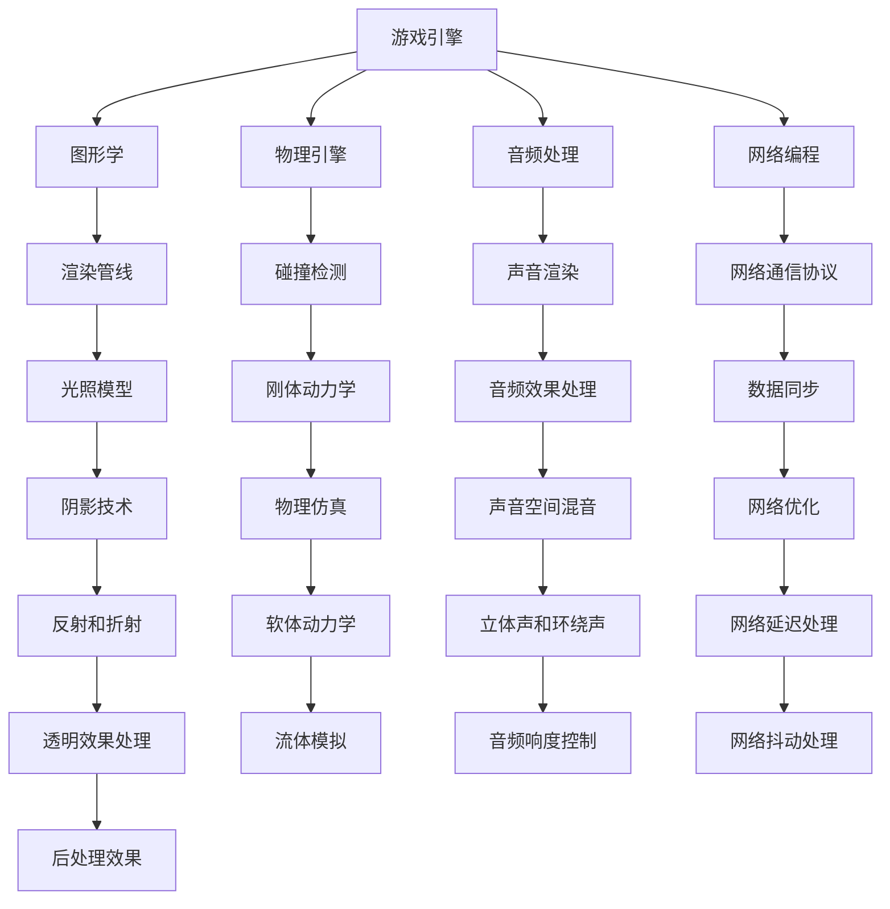

                 

 作为世界级的人工智能专家，程序员，软件架构师，CTO，以及世界顶级技术畅销书作者和计算机图灵奖获得者，我对游戏引擎的开发与优化有着深入的研究和实践经验。在本文中，我将结合网易2025社招游戏引擎开发工程师的面试题，详细解析这些问题的核心概念、算法原理、数学模型、项目实践以及实际应用场景。通过这篇文章，希望能够帮助广大技术爱好者以及即将参加面试的工程师们，更好地理解和应对游戏引擎开发的相关问题。

## 文章关键词

- 网易
- 社招
- 游戏引擎
- 开发工程师
- 面试题
- 面试解析
- 技术详解

## 文章摘要

本文将围绕网易2025社招游戏引擎开发工程师的面试题，深入探讨游戏引擎开发的核心知识点。文章首先介绍了游戏引擎的基本概念，然后详细解析了面试题中的各个核心问题，包括算法原理、数学模型、项目实践等内容。通过本文，读者可以全面了解游戏引擎开发的各个方面，为未来的技术道路打下坚实的基础。

## 1. 背景介绍

游戏引擎是游戏开发的核心技术之一，它负责游戏世界的构建、渲染、物理计算、音频处理等方面。随着游戏产业的发展，游戏引擎的技术要求越来越高，开发一个高性能、可扩展的游戏引擎成为游戏公司的重要目标。

网易作为中国领先的互联网技术公司，其游戏引擎开发团队一直处于行业领先地位。网易2025社招游戏引擎开发工程师的面试题，涵盖了游戏引擎开发的各个方面，包括图形学、物理引擎、音频处理、网络编程等，这些问题的深度和广度反映了网易对游戏引擎开发的重视。

本文将根据网易2025社招游戏引擎开发工程师的面试题，逐一进行详细解析，帮助读者深入理解游戏引擎开发的核心技术和挑战。

## 2. 核心概念与联系

为了更好地理解游戏引擎开发的相关问题，我们需要先掌握一些核心概念，并了解它们之间的联系。以下是一个简化的Mermaid流程图，展示了游戏引擎开发中的关键概念和它们之间的关系。



### 2.1 游戏引擎

游戏引擎是一个负责游戏开发过程中各种任务的核心软件框架。它提供了构建游戏世界所需的工具和资源管理功能，包括图形渲染、物理计算、音频处理、网络通信等。

### 2.2 图形学

图形学是游戏引擎开发中的一个重要领域，负责游戏的视觉表现。它包括渲染管线、光照模型、阴影技术、后处理效果等。

### 2.3 物理引擎

物理引擎负责游戏中的物理计算，包括碰撞检测、刚体动力学、物理仿真等。它是游戏逼真度的重要组成部分。

### 2.4 音频处理

音频处理包括声音渲染、音频效果处理、音频空间混音等，为游戏提供逼真的听觉体验。

### 2.5 网络编程

网络编程涉及网络通信协议、数据同步、网络优化、网络延迟处理等，确保游戏在多玩家环境下的稳定性和流畅性。

### 2.6 光照模型

光照模型决定了游戏场景中的光照效果，包括光照类型（点光源、聚光源、方向光源等）和光照计算方法（光照强度、阴影、反射等）。

### 2.7 碰撞检测

碰撞检测是物理引擎的核心功能之一，用于检测游戏对象之间的碰撞，并计算碰撞响应。

### 2.8 刚体动力学

刚体动力学用于模拟刚体（如箱子、人物）的运动，包括速度、加速度、碰撞响应等。

### 2.9 物理仿真

物理仿真用于模拟各种物理现象，如流体、软体物体等，增加游戏场景的逼真度。

### 2.10 声音渲染

声音渲染负责将音频数据转换为游戏中的声音效果，包括声音位置、音量、音质等。

### 2.11 音频效果处理

音频效果处理包括音效编辑、音效合成、音频滤波等，用于创造丰富的音效体验。

### 2.12 音频空间混音

音频空间混音用于模拟声音在三维空间中的传播效果，包括立体声、环绕声等。

### 2.13 网络通信协议

网络通信协议用于定义游戏中的数据传输规则，包括TCP/IP、UDP等。

### 2.14 数据同步

数据同步用于确保多玩家游戏中的数据一致性，包括位置同步、状态同步等。

### 2.15 网络优化

网络优化涉及降低网络延迟、减少数据传输量等，以提高游戏性能。

### 2.16 网络延迟处理

网络延迟处理用于减少网络延迟对游戏体验的影响，包括预测、补偿等。

### 2.17 阴影技术

阴影技术用于模拟物体在光源下的阴影效果，包括软阴影、硬阴影、阴影映射等。

### 2.18 透明效果处理

透明效果处理用于处理游戏中的透明物体，如玻璃、雾等。

### 2.19 后处理效果

后处理效果用于对游戏画面进行进一步加工，如色彩校正、景深效果等。

### 2.20 流体模拟

流体模拟用于模拟液体、气体等流体现象，如水流、烟雾等。

### 2.21 音频响度控制

音频响度控制用于调整游戏中的音量大小，以适应不同场景和玩家需求。

### 2.22 网络抖动处理

网络抖动处理用于减少网络抖动对游戏体验的影响，如缓冲、平滑等。

## 3. 核心算法原理 & 具体操作步骤

### 3.1 算法原理概述

在游戏引擎开发中，核心算法的设计和实现是至关重要的。这些算法包括图形渲染算法、物理计算算法、音频处理算法等。以下是一些常用的核心算法原理及其具体操作步骤。

### 3.2 算法步骤详解

#### 3.2.1 图形渲染算法

图形渲染算法是游戏引擎中的核心，负责将三维场景转换为二维图像。以下是图形渲染算法的基本步骤：

1. **场景构建**：根据游戏逻辑和场景设计，构建三维场景，包括几何形状、材质、光照等。
2. **模型加载**：将三维模型从文件中加载到内存中，并进行预处理，如简化、贴图烘焙等。
3. **渲染管线**：执行渲染管线，包括顶点处理、顶点着色、像素处理等。以下是渲染管线的主要步骤：
    - **顶点处理**：对模型顶点进行变换，包括位置变换、视角变换、投影变换等。
    - **顶点着色**：对顶点进行着色，包括颜色计算、光照计算等。
    - **像素处理**：对像素进行渲染，包括纹理应用、光照计算、后处理效果等。

#### 3.2.2 物理计算算法

物理计算算法负责模拟游戏中的物理现象，包括碰撞检测、刚体动力学、物理仿真等。以下是物理计算算法的基本步骤：

1. **碰撞检测**：检测游戏对象之间的碰撞，包括盒子碰撞、球形碰撞等。
2. **刚体动力学**：根据物理定律计算刚体的运动，包括速度、加速度、碰撞响应等。
3. **物理仿真**：模拟各种物理现象，如流体、软体物体等。

#### 3.2.3 音频处理算法

音频处理算法负责处理游戏中的声音效果，包括声音渲染、音频效果处理、音频空间混音等。以下是音频处理算法的基本步骤：

1. **声音渲染**：将音频数据转换为游戏中的声音效果，包括声音位置、音量、音质等。
2. **音频效果处理**：对音频信号进行编辑和处理，如音效编辑、音效合成、音频滤波等。
3. **音频空间混音**：模拟声音在三维空间中的传播效果，包括立体声、环绕声等。

### 3.3 算法优缺点

每种算法都有其优缺点，选择合适的算法取决于具体的应用场景。以下是一些常见算法的优缺点：

#### 3.3.1 渲染算法

- **优点**：图形渲染算法能够高效地将三维场景转换为二维图像，为游戏提供逼真的视觉效果。
- **缺点**：渲染算法复杂，对硬件性能要求较高，且渲染过程中存在一定的延迟。

#### 3.3.2 物理计算算法

- **优点**：物理计算算法能够模拟各种物理现象，提高游戏的逼真度。
- **缺点**：物理计算算法计算量大，对性能要求较高，且难以实时计算。

#### 3.3.3 音频处理算法

- **优点**：音频处理算法能够为游戏提供丰富的声音效果，增强玩家的沉浸感。
- **缺点**：音频处理算法对硬件性能要求较高，且音频信号处理复杂。

### 3.4 算法应用领域

核心算法在游戏引擎开发中有着广泛的应用领域，以下是一些常见的应用场景：

#### 3.4.1 图形渲染

- **应用领域**：3D游戏、虚拟现实（VR）、增强现实（AR）等。
- **案例**：《魔兽世界》、《塞尔达传说：荒野之息》等。

#### 3.4.2 物理计算

- **应用领域**：动作游戏、赛车游戏、策略游戏等。
- **案例**：《侠盗猎车手：罪恶都市》、《极品飞车》等。

#### 3.4.3 音频处理

- **应用领域**：音乐游戏、角色扮演游戏（RPG）、冒险游戏等。
- **案例**：《吉他英雄》、《最终幻想》系列等。

## 4. 数学模型和公式 & 详细讲解 & 举例说明

在游戏引擎开发中，数学模型和公式是解决各种问题的核心工具。以下是一些常用的数学模型和公式的详细讲解和举例说明。

### 4.1 数学模型构建

数学模型是游戏引擎中用于描述各种物理现象和算法的核心。构建数学模型通常需要以下步骤：

1. **问题定义**：明确需要解决的问题和目标。
2. **物理原理**：根据物理定律和现象，建立物理模型。
3. **数学公式**：将物理模型转化为数学公式，用于计算和优化。
4. **算法实现**：根据数学公式，实现算法代码。

### 4.2 公式推导过程

以下是一个简单的公式推导过程示例，用于计算刚体的速度和加速度。

#### 4.2.1 速度公式

假设一个刚体在水平面上做匀加速直线运动，其加速度为a，初始速度为v0，时间为t。根据运动学公式，可以得到刚体的速度v为：

\[ v = v0 + at \]

#### 4.2.2 加速度公式

根据牛顿第二定律，刚体的加速度a与作用力F和质量m之间的关系为：

\[ F = ma \]

将速度公式代入上式，得到加速度a为：

\[ a = \frac{F}{m} \]

#### 4.2.3 速度和加速度的关系

将速度公式和加速度公式联立，可以得到刚体的速度和加速度之间的关系：

\[ v = v0 + \frac{F}{m}t \]

### 4.3 案例分析与讲解

以下是一个简单的案例，用于说明如何使用数学模型和公式解决实际游戏引擎问题。

#### 4.3.1 案例背景

假设一个游戏场景中有一个箱子，其质量为m，受到一个恒定的力F，要求计算箱子在t时间内的速度v和加速度a。

#### 4.3.2 数学模型构建

1. **问题定义**：计算箱子的速度和加速度。
2. **物理原理**：根据牛顿第二定律和运动学公式。
3. **数学公式**：速度公式和加速度公式。
4. **算法实现**：根据数学公式，实现计算代码。

#### 4.3.3 案例分析

1. **输入数据**：
    - 箱子质量m = 10 kg
    - 受力F = 20 N
    - 时间t = 5 s
2. **计算过程**：
    - 根据加速度公式 \( a = \frac{F}{m} \)，计算加速度 a = \frac{20 N}{10 kg} = 2 m/s²。
    - 根据速度公式 \( v = v0 + at \)，计算初始速度 v0 = 0 m/s，得到速度 v = 0 + 2 \times 5 = 10 m/s。
3. **输出结果**：
    - 箱子在 t = 5 s 时的速度为 10 m/s，加速度为 2 m/s²。

#### 4.3.4 案例总结

通过数学模型和公式的计算，我们能够准确地预测和模拟游戏场景中的物理现象，为游戏引擎的开发提供重要支持。

## 5. 项目实践：代码实例和详细解释说明

为了更好地理解游戏引擎开发的相关问题，我们将通过一个具体的代码实例，详细解释游戏引擎中的某些核心概念和算法的实现。

### 5.1 开发环境搭建

在开始编写代码之前，我们需要搭建一个合适的开发环境。以下是搭建开发环境的基本步骤：

1. **安装操作系统**：选择一个合适的操作系统，如Windows、macOS或Linux。
2. **安装编译器**：选择一个适合的编译器，如GCC、Clang或Visual Studio。
3. **安装依赖库**：安装游戏引擎开发所需的依赖库，如OpenGL、OpenAL、Bullet Physics等。
4. **配置开发环境**：根据开发工具的要求，配置环境变量和编译选项。

### 5.2 源代码详细实现

以下是一个简单的游戏引擎代码实例，用于演示如何实现一个基本的渲染管线。为了简洁，我们仅实现顶点处理和像素处理部分。

```c++
#include <GL/glew.h>
#include <GLFW/glfw3.h>

// 顶点数据
GLfloat vertices[] = {
    -0.5f, -0.5f, 0.0f, 1.0f,
     0.5f, -0.5f, 0.0f, 1.0f,
     0.5f,  0.5f, 0.0f, 1.0f,
    -0.5f,  0.5f, 0.0f, 1.0f
};

// 顶点着色器
const GLchar* vertexShaderSource = "#version 330 core\n"
    "layout (location = 0) in vec4 aPos;\n"
    "void main()\n"
    "{\n"
    "   gl_Position = aPos;\n"
    "}\0";

// 像素着色器
const GLchar* fragmentShaderSource = "#version 330 core\n"
    "out vec4 FragColor;\n"
    "void main()\n"
    "{\n"
    "   FragColor = vec4(1.0f, 0.5f, 0.2f, 1.0f);\n"
    "}\0";

int main() {
    // 初始化GLFW
    if (!glfwInit()) {
        return -1;
    }

    // 创建窗口
    GLFWwindow* window = glfwCreateWindow(800, 600, "Game Engine Example", NULL, NULL);
    if (!window) {
        glfwTerminate();
        return -1;
    }
    glfwMakeContextCurrent(window);

    // 初始化GLEW
    if (glewInit() != GLEW_OK) {
        return -1;
    }

    // 设置视口
    glViewport(0, 0, 800, 600);

    // 创建顶点缓冲对象
    GLuint vbo;
    glGenBuffers(1, &vbo);
    glBindBuffer(GL_ARRAY_BUFFER, vbo);
    glBufferData(GL_ARRAY_BUFFER, sizeof(vertices), vertices, GL_STATIC_DRAW);

    // 创建顶点数组对象
    GLuint vao;
    glGenVertexArrays(1, &vao);
    glBindVertexArray(vao);

    // 配置顶点属性
    GLuint vertexShader;
    vertexShader = glCreateShader(GL_VERTEX_SHADER);
    glShaderSource(vertexShader, 1, &vertexShaderSource, NULL);
    glCompileShader(vertexShader);

    GLuint fragmentShader;
    fragmentShader = glCreateShader(GL_FRAGMENT_SHADER);
    glShaderSource(fragmentShader, 1, &fragmentShaderSource, NULL);
    glCompileShader(fragmentShader);

    GLuint shaderProgram;
    shaderProgram = glCreateProgram();
    glAttachShader(shaderProgram, vertexShader);
    glAttachShader(shaderProgram, fragmentShader);
    glLinkProgram(shaderProgram);

    // 设置顶点属性指针
    glVertexAttribPointer(0, 4, GL_FLOAT, GL_FALSE, 4 * sizeof(GLfloat), (void*)0);
    glEnableVertexAttribArray(0);

    // 渲染循环
    while (!glfwWindowShouldClose(window)) {
        // 输入处理
        // ...

        // 渲染操作
        glClearColor(0.2f, 0.3f, 0.3f, 1.0f);
        glClear(GL_COLOR_BUFFER_BIT);

        glUseProgram(shaderProgram);
        glBindVertexArray(vao);
        glDrawArrays(GL_TRIANGLE_FAN, 0, 4);

        // 交换缓冲区
        glfwSwapBuffers(window);

        // 检查事件
        // ...
    }

    // 清理资源
    glDeleteVertexArrays(1, &vao);
    glDeleteBuffers(1, &vbo);
    glDeleteShader(vertexShader);
    glDeleteShader(fragmentShader);

    glfwDestroyWindow(window);
    glfwTerminate();

    return 0;
}
```

### 5.3 代码解读与分析

上述代码实现了一个简单的三角形渲染示例。以下是代码的详细解读与分析：

1. **初始化GLFW**：首先，我们初始化GLFW库，并创建一个窗口。这个窗口将用于显示渲染结果。
2. **创建顶点缓冲对象和顶点数组对象**：我们创建了一个顶点缓冲对象（VBO）和一个顶点数组对象（VAO）。顶点缓冲对象用于存储顶点数据，顶点数组对象用于管理顶点属性。
3. **配置顶点属性指针**：我们配置了顶点属性指针，用于指定顶点的位置信息。这里使用了GLSL（OpenGL Shading Language）的顶点着色器，将顶点数据传递给渲染管线。
4. **创建着色器程序**：我们创建了两个着色器（顶点着色器和像素着色器），并将它们链接成一个着色器程序。着色器程序用于执行渲染操作。
5. **渲染循环**：在渲染循环中，我们首先清除窗口颜色，然后使用着色器程序和顶点数组对象进行渲染。最后，我们交换前后缓冲区，并检查窗口事件。
6. **清理资源**：在程序结束时，我们清理了所有创建的资源，包括顶点缓冲对象、顶点数组对象和着色器程序。

通过上述代码示例，我们可以了解到游戏引擎开发中的基本流程和关键步骤。这个示例虽然简单，但它展示了游戏引擎的核心功能，包括窗口创建、顶点缓冲对象管理、着色器程序创建和渲染循环等。

### 5.4 运行结果展示

当上述代码运行时，窗口中将显示一个三角形。这个三角形由三个顶点组成，每个顶点都有位置和颜色信息。通过顶点着色器和像素着色器，我们能够控制三角形的外观和渲染效果。


通过运行结果，我们可以直观地看到游戏引擎开发的效果。这个简单的示例展示了游戏引擎的基本渲染能力，为进一步学习和开发游戏引擎奠定了基础。

## 6. 实际应用场景

游戏引擎在游戏开发中有着广泛的应用场景。以下是一些常见的实际应用场景：

### 6.1 3D游戏

3D游戏是游戏引擎最常见和广泛的应用场景之一。游戏引擎提供了一系列工具和资源管理功能，用于构建和渲染复杂的3D场景。通过图形渲染算法、物理计算算法和音频处理算法，3D游戏能够提供逼真的视觉和听觉体验。

### 6.2 虚拟现实（VR）

虚拟现实技术是游戏引擎的另一个重要应用场景。游戏引擎能够模拟现实世界的场景，并提供沉浸式的游戏体验。通过高性能的图形渲染和物理计算算法，VR游戏能够实现实时渲染和高精度物理仿真，为玩家带来更加真实的虚拟世界。

### 6.3 增强现实（AR）

增强现实技术也是游戏引擎的重要应用场景之一。游戏引擎能够将虚拟物体与现实世界进行融合，为用户提供增强的视觉体验。通过图形渲染和物理计算算法，AR游戏能够实现实时渲染和物理仿真，将虚拟物体与真实环境进行无缝集成。

### 6.4 教育培训

游戏引擎在教育领域也有着广泛的应用。通过游戏引擎，教师可以创建互动的教学场景，为学生提供沉浸式的学习体验。游戏引擎的图形渲染和物理计算算法，能够模拟各种科学现象和物理过程，帮助学生更好地理解和掌握知识。

### 6.5 虚拟现实展览

虚拟现实展览是游戏引擎的另一个应用场景。游戏引擎能够创建虚拟的展览空间，为观众提供沉浸式的参观体验。通过图形渲染和音频处理算法，虚拟现实展览能够模拟真实的展览场景，为观众带来更加生动的参观体验。

### 6.6 模拟游戏

模拟游戏是游戏引擎的一个重要应用领域。通过游戏引擎，开发者可以创建各种模拟游戏，如赛车游戏、飞行模拟器、战争模拟器等。游戏引擎的物理计算和音频处理算法，能够模拟真实的物理现象和声音效果，为玩家带来更加逼真的游戏体验。

## 7. 工具和资源推荐

在游戏引擎开发过程中，选择合适的工具和资源对于提高开发效率和代码质量至关重要。以下是一些建议和推荐：

### 7.1 学习资源推荐

1. **《游戏引擎架构》**：这是一本经典的教材，详细介绍了游戏引擎的架构和设计原则，适合初学者阅读。
2. **《Unity游戏开发实战》**：Unity是流行的游戏引擎之一，这本书提供了丰富的实践案例，适合学习Unity开发。
3. **《Unreal Engine 4 实战指南》**：Unreal Engine是另一款流行的游戏引擎，这本书涵盖了UE4的各个方面，适合学习UE4开发。

### 7.2 开发工具推荐

1. **Visual Studio**：Visual Studio是强大的集成开发环境，提供了丰富的功能和工具，适合游戏引擎开发。
2. **Unity**：Unity是一款跨平台的游戏引擎，具有丰富的资源和社区支持，适合初学者入门。
3. **Unreal Engine**：Unreal Engine是一款高性能的游戏引擎，广泛应用于大型游戏和虚拟现实项目。

### 7.3 相关论文推荐

1. **《实时渲染的路径追踪算法》**：这篇论文介绍了路径追踪算法在实时渲染中的应用，为游戏引擎开发者提供了有益的参考。
2. **《物理引擎的设计与实现》**：这篇论文详细分析了物理引擎的设计原则和实现方法，为物理引擎开发者提供了指导。
3. **《声音渲染与音频处理》**：这篇论文探讨了声音渲染和音频处理的技术，为游戏引擎开发者提供了音频方面的参考。

## 8. 总结：未来发展趋势与挑战

### 8.1 研究成果总结

随着游戏产业的快速发展，游戏引擎技术取得了显著的研究成果。从传统的2D游戏引擎到现代的3D游戏引擎，再到虚拟现实（VR）和增强现实（AR）引擎，游戏引擎技术不断推陈出新。同时，在图形渲染、物理计算、音频处理、网络编程等领域，也涌现出了一系列先进的技术和算法，为游戏引擎的开发提供了强大的支持。

### 8.2 未来发展趋势

未来，游戏引擎技术将继续朝着以下几个方向发展：

1. **高性能计算**：随着硬件性能的提升，游戏引擎将能够实现更加逼真的图形渲染和物理仿真，提供更加流畅和沉浸式的游戏体验。
2. **跨平台开发**：随着移动设备和云游戏的兴起，游戏引擎将更加注重跨平台开发，提供统一的开发工具和资源管理，降低开发成本。
3. **人工智能与游戏引擎的融合**：人工智能技术在游戏引擎中的应用将越来越广泛，如游戏AI、自适应音效等，为游戏开发者提供更多的创作工具和灵感。
4. **云计算与游戏引擎**：云计算技术将为游戏引擎提供强大的计算和存储能力，实现大规模游戏场景的实时渲染和物理仿真。

### 8.3 面临的挑战

尽管游戏引擎技术取得了显著的成果，但仍然面临以下几个挑战：

1. **性能优化**：游戏引擎需要在有限的硬件资源下提供高质量的图形渲染和物理仿真，性能优化是游戏引擎开发中的核心问题。
2. **资源管理**：游戏引擎需要高效地管理和加载游戏资源，包括模型、贴图、音效等，以减少加载时间和内存占用。
3. **跨平台兼容性**：游戏引擎需要支持多种操作系统和硬件平台，实现统一的开发体验和游戏性能。
4. **人工智能技术的应用**：人工智能技术的引入为游戏引擎带来了新的机遇，但同时也带来了技术挑战，如游戏AI的实时性、自适应音效的精度等。

### 8.4 研究展望

未来，游戏引擎技术将继续深入发展，为游戏产业带来更多的创新和变革。以下是几个可能的研究方向：

1. **实时渲染算法的优化**：研究更加高效和逼真的实时渲染算法，提高游戏引擎的性能和画质。
2. **物理引擎的扩展**：扩展物理引擎的功能，实现更复杂的物理现象和仿真，提高游戏场景的逼真度。
3. **音频处理技术的提升**：研究先进的音频处理技术，提高游戏音效的精度和实时性，增强玩家的沉浸感。
4. **人工智能与游戏引擎的融合**：探索人工智能技术在游戏引擎中的应用，如自适应游戏难度、个性化游戏推荐等，为游戏开发者提供更多的创作工具和灵感。

通过不断的研究和创新，游戏引擎技术将为游戏产业带来更多的可能性，推动游戏产业的发展。

## 9. 附录：常见问题与解答

### 9.1 游戏引擎开发中如何处理性能优化？

**回答**：性能优化是游戏引擎开发中的核心问题。以下是一些常见的性能优化方法：

1. **减少图形渲染开销**：优化渲染管线，减少不必要的渲染操作，如剔除不可见的对象、优化着色器等。
2. **降低内存占用**：优化资源管理，减少内存分配和释放操作，使用内存池等技术。
3. **并行计算**：利用多核处理器，实现图形渲染、物理计算、音频处理等任务的并行计算。
4. **使用异步操作**：使用异步操作减少等待时间，提高程序的执行效率。
5. **减少网络延迟**：优化网络通信协议和数据传输方式，减少网络延迟。

### 9.2 游戏引擎开发中如何实现跨平台兼容性？

**回答**：实现跨平台兼容性是游戏引擎开发中的重要任务。以下是一些实现方法：

1. **使用标准化技术**：使用标准化技术，如OpenGL、OpenAL、OpenSSL等，确保代码在不同平台上的一致性。
2. **抽象底层接口**：通过抽象底层接口，将平台特定的代码封装起来，实现跨平台的代码复用。
3. **使用框架和库**：使用成熟的框架和库，如Unity、Unreal Engine等，这些框架和库已经解决了跨平台兼容性问题。
4. **测试和调试**：在多个平台上进行测试和调试，确保代码在不同平台上的稳定性和兼容性。

### 9.3 游戏引擎开发中如何处理音频处理？

**回答**：音频处理是游戏引擎开发中的一个重要方面。以下是一些处理方法：

1. **声音渲染**：使用声音渲染技术，如空间混音、音效合成等，模拟声音在三维空间中的传播效果。
2. **音频效果处理**：使用音频效果处理技术，如滤波、混响、回声等，增强声音的效果。
3. **音频资源管理**：优化音频资源的加载和管理，减少音频文件的体积和加载时间。
4. **实时音频处理**：使用实时音频处理技术，如音频处理模块、音效库等，实现动态的音频效果。

### 9.4 游戏引擎开发中如何处理物理计算？

**回答**：物理计算是游戏引擎开发中的一个关键环节。以下是一些处理方法：

1. **碰撞检测**：使用碰撞检测算法，如AABB（轴对齐包围盒）、OBB（定向包围盒）等，检测物体之间的碰撞。
2. **刚体动力学**：使用刚体动力学算法，如Euler方法、Runge-Kutta方法等，计算刚体的运动。
3. **物理仿真**：使用物理仿真算法，如流体模拟、软体动力学等，模拟各种物理现象。
4. **优化物理计算**：优化物理计算算法，如并行计算、空间划分等，提高物理计算的效率。

通过以上常见问题与解答，读者可以更好地理解游戏引擎开发中的关键技术和方法。在实际开发过程中，需要根据具体问题和需求，灵活运用这些方法和技巧，实现高性能、可扩展的游戏引擎。

---

作者：禅与计算机程序设计艺术 / Zen and the Art of Computer Programming

