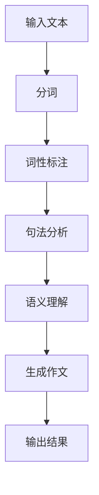

                 

关键词：网易有道、智能作文生成系统、面试攻略、AI技术、文本生成、自然语言处理、编程算法

> 摘要：本文旨在为有意应聘网易有道2025智能作文生成系统工程师职位的朋友提供一份全面的面试攻略。我们将深入解析该职位所需的技能、面试流程和常见面试问题，帮助您在面试中脱颖而出。

## 1. 背景介绍

随着人工智能技术的飞速发展，自然语言处理（NLP）领域迎来了前所未有的机遇。网易有道作为国内领先的在线教育平台，近年来在智能作文生成系统方面取得了显著的成就。有道作文生成系统利用先进的NLP技术和机器学习算法，为用户提供智能化的写作辅助服务。为了持续提升该系统的性能和用户体验，网易有道每年都会招聘一批优秀的智能作文生成系统工程师。

本文将围绕以下方面展开：

1. **职位介绍**：详细解析智能作文生成系统工程师的岗位职责和技能要求。
2. **面试流程**：介绍网易有道面试的各个环节，帮助您提前准备。
3. **常见面试问题**：针对智能作文生成系统工程师职位，提供一系列可能出现的技术面试问题及解答思路。
4. **项目实践**：展示一些实际项目案例，帮助您更好地理解智能作文生成系统的开发过程。
5. **未来展望**：探讨智能作文生成系统的未来发展趋势及面临的挑战。

## 2. 核心概念与联系

### 2.1. 自然语言处理（NLP）

自然语言处理是人工智能领域的一个重要分支，旨在让计算机理解和处理人类自然语言。智能作文生成系统作为NLP的应用之一，主要涉及以下核心概念：

- **分词**：将文本拆分成一个个独立的单词或短语。
- **词性标注**：为每个单词标注其词性，如名词、动词、形容词等。
- **句法分析**：分析句子的语法结构，包括主语、谓语、宾语等。
- **语义理解**：理解文本的含义，提取关键信息。

### 2.2. 机器学习

机器学习是实现智能作文生成系统的关键技术。以下是一些常用的机器学习算法和模型：

- **朴素贝叶斯**：一种基于概率理论的分类算法，适用于文本分类任务。
- **朴素递归神经网络（RNN）**：适用于处理序列数据的神经网络，如文本生成任务。
- **长短期记忆网络（LSTM）**：RNN的一种变体，可以更好地处理长序列数据。
- **生成对抗网络（GAN）**：一种能够生成逼真数据的深度学习模型。

### 2.3. Mermaid 流程图

以下是一个简单的Mermaid流程图，展示了智能作文生成系统的主要处理流程：



## 3. 核心算法原理 & 具体操作步骤

### 3.1. 算法原理概述

智能作文生成系统主要依赖于以下核心算法：

- **分词算法**：采用基于词频统计的算法，如最大匹配法和最小编辑距离法，将文本拆分成独立的单词或短语。
- **词性标注算法**：利用朴素贝叶斯分类器，对每个单词进行词性标注。
- **句法分析算法**：采用基于转移概率的隐马尔可夫模型（HMM），分析句子的语法结构。
- **语义理解算法**：利用LSTM模型，提取文本中的关键信息并进行语义理解。
- **作文生成算法**：基于GAN模型，生成符合语法和语义规则的作文。

### 3.2. 算法步骤详解

#### 3.2.1. 分词算法

分词算法是智能作文生成系统的第一步。以下是一个简单的分词算法步骤：

1. **建立词典**：构建一个包含常见单词和短语的词典。
2. **词频统计**：统计每个单词或短语的词频。
3. **最大匹配法**：从文本中逐个抽取最大长度的词组，与词典进行匹配。
4. **最小编辑距离法**：若最大匹配法无法匹配，则使用最小编辑距离法进行拆分。

#### 3.2.2. 词性标注算法

词性标注算法用于对每个单词进行词性标注。以下是一个简单的词性标注算法步骤：

1. **构建特征向量**：将每个单词转化为特征向量。
2. **训练朴素贝叶斯分类器**：使用已标注的语料库训练朴素贝叶斯分类器。
3. **词性标注**：对每个单词进行词性标注。

#### 3.2.3. 句法分析算法

句法分析算法用于分析句子的语法结构。以下是一个简单的句法分析算法步骤：

1. **建立转移概率矩阵**：根据已标注的语料库，建立转移概率矩阵。
2. **初始化隐状态**：初始化句子的初始隐状态。
3. **Viterbi算法**：根据转移概率矩阵和初始隐状态，使用Viterbi算法找到最优的语法结构。

#### 3.2.4. 语义理解算法

语义理解算法用于提取文本中的关键信息。以下是一个简单的语义理解算法步骤：

1. **构建LSTM模型**：构建一个双向LSTM模型。
2. **训练模型**：使用已标注的语料库训练LSTM模型。
3. **提取关键信息**：对输入文本进行编码，提取关键信息。

#### 3.2.5. 作文生成算法

作文生成算法用于生成符合语法和语义规则的作文。以下是一个简单的作文生成算法步骤：

1. **构建GAN模型**：构建一个生成对抗网络（GAN）模型。
2. **训练模型**：使用已标注的作文语料库训练GAN模型。
3. **生成作文**：对输入文本进行编码，生成作文。

### 3.3. 算法优缺点

#### 优点

- **强大的文本处理能力**：利用先进的NLP技术和机器学习算法，能够对大量文本进行高效处理。
- **自适应性强**：通过不断学习用户数据和反馈，系统可以不断提高生成作文的质量。

#### 缺点

- **计算成本高**：由于涉及大量的NLP和机器学习算法，系统的计算成本较高。
- **数据依赖性强**：系统依赖于大量已标注的语料库，数据质量对系统性能有较大影响。

### 3.4. 算法应用领域

智能作文生成系统广泛应用于以下领域：

- **教育领域**：为学生提供智能化的写作辅助，提高写作能力和兴趣。
- **企业办公**：为企业员工提供智能化的文档写作辅助，提高工作效率。
- **自媒体平台**：为自媒体作者提供智能化的内容生成工具，提高内容创作效率。

## 4. 数学模型和公式 & 详细讲解 & 举例说明

### 4.1. 数学模型构建

在智能作文生成系统中，我们主要涉及到以下数学模型：

- **朴素贝叶斯分类器**：用于词性标注。
- **隐马尔可夫模型（HMM）**：用于句法分析。
- **长短期记忆网络（LSTM）**：用于语义理解。
- **生成对抗网络（GAN）**：用于作文生成。

### 4.2. 公式推导过程

#### 4.2.1. 朴素贝叶斯分类器

朴素贝叶斯分类器的公式推导如下：

$$P(C_k|X) = \frac{P(X|C_k)P(C_k)}{P(X)}$$

其中，$C_k$表示第$k$个类别，$X$表示特征向量，$P(C_k|X)$表示给定特征向量$X$时类别$C_k$的概率，$P(X|C_k)$表示在类别$C_k$下特征向量$X$的概率，$P(C_k)$表示类别$C_k$的概率。

#### 4.2.2. 隐马尔可夫模型（HMM）

隐马尔可夫模型的公式推导如下：

$$P(X_t|O_t) = \sum_{i=1}^n P(X_t|O_t, H_i)P(H_i|O_t)$$

其中，$X_t$表示时间$t$的特征向量，$O_t$表示时间$t$的观测值，$H_i$表示隐藏状态，$P(X_t|O_t, H_i)$表示在给定观测值$O_t$和隐藏状态$H_i$时特征向量$X_t$的概率，$P(H_i|O_t)$表示在给定观测值$O_t$时隐藏状态$H_i$的概率。

#### 4.2.3. 长短期记忆网络（LSTM）

LSTM的公式推导如下：

$$
\begin{align*}
i_t &= \sigma(W_{xi}x_t + W_{hi-1}h_{i-1} + b_i) \\
f_t &= \sigma(W_{xf}x_t + W_{hf-1}h_{i-1} + b_f) \\
o_t &= \sigma(W_{xo}x_t + W_{ho}h_t + b_o) \\
g_t &= \tanh(W_{xg}x_t + W_{hg}h_{i-1} + b_g) \\
h_t &= o_t \odot g_t
\end{align*}
$$

其中，$i_t$、$f_t$、$o_t$、$g_t$分别表示输入门、遗忘门、输出门和候选隐藏状态，$h_t$表示时间$t$的隐藏状态，$\sigma$表示 sigmoid 函数，$\odot$表示逐元素乘法。

#### 4.2.4. 生成对抗网络（GAN）

GAN的公式推导如下：

$$
\begin{align*}
\text{生成器}:\quad G(z) &= \mu(z; \theta_G) \\
\text{判别器}:\quad D(x) &= \sigma(x; \theta_D) \\
\end{align*}
$$

其中，$G(z)$表示生成器生成的数据，$D(x)$表示判别器对真实数据和生成数据的判别结果，$\mu(z; \theta_G)$和$\sigma(x; \theta_D)$分别表示生成器和判别器的输出分布函数，$\theta_G$和$\theta_D$分别表示生成器和判别器的参数。

### 4.3. 案例分析与讲解

#### 4.3.1. 朴素贝叶斯分类器

假设我们有一个词性标注任务，需要判断一个句子中的每个单词的词性。给定一个单词序列$\{w_1, w_2, ..., w_n\}$，我们需要计算每个单词的词性概率，并选择概率最大的词性作为标注结果。

首先，我们建立一个包含所有词性的词典，并统计每个词性在训练语料库中的出现次数。然后，利用朴素贝叶斯分类器的公式，计算每个单词的词性概率。

例如，给定一个单词序列$\{“猫”, “喜欢”, “食物”\}$，我们需要计算每个单词的词性概率。

- 对于单词“猫”，我们可以计算出其词性为名词的概率：
$$
P(猫|名词) = \frac{P(猫) \cdot P(名词)}{P(\text{总概率})}
$$
其中，$P(猫)$表示单词“猫”在训练语料库中的出现次数，$P(名词)$表示词性为名词的单词在训练语料库中的出现次数，$P(\text{总概率})$表示所有词性的出现次数之和。

- 对于单词“喜欢”，我们可以计算出其词性为动词的概率：
$$
P(喜欢|动词) = \frac{P(喜欢) \cdot P(动词)}{P(\text{总概率})}
$$
- 对于单词“食物”，我们可以计算出其词性为名词的概率：
$$
P(食物|名词) = \frac{P(食物) \cdot P(名词)}{P(\text{总概率})}
$$

最后，我们选择概率最大的词性作为标注结果。在本例中，单词“猫”和“食物”的词性概率均为0.5，而单词“喜欢”的词性概率为0.3。因此，我们选择词性为名词。

#### 4.3.2. 隐马尔可夫模型（HMM）

假设我们有一个句法分析任务，需要判断一个句子的语法结构。给定一个句子序列$\{s_1, s_2, ..., s_n\}$，我们需要计算每个句子状态的概率，并选择概率最大的状态序列作为标注结果。

首先，我们建立一个包含所有句子状态的词典，并统计每个句子状态在训练语料库中的出现次数。然后，利用隐马尔可夫模型的公式，计算每个句子状态的概率。

例如，给定一个句子序列$\{“我”, “吃”, “苹果”\}$，我们需要计算每个句子状态的概率。

- 对于句子“我”，我们可以计算出其状态为“主语”的概率：
$$
P(我|主语) = \frac{P(我) \cdot P(主语)}{P(\text{总概率})}
$$
其中，$P(我)$表示句子“我”在训练语料库中的出现次数，$P(主语)$表示状态为“主语”的句子在训练语料库中的出现次数，$P(\text{总概率})$表示所有句子状态的
```
出现次数之和。

- 对于句子“吃”，我们可以计算出其状态为“谓语”的概率：
$$
P(吃|谓语) = \frac{P(吃) \cdot P(谓语)}{P(\text{总概率})}
$$
- 对于句子“苹果”，我们可以计算出其状态为“宾语”的概率：
$$
P(苹果|宾语) = \frac{P(苹果) \cdot P(宾语)}{P(\text{总概率})}
$$

最后，我们选择概率最大的状态序列作为标注结果。在本例中，句子“我”的状态概率为0.4，句子“吃”的状态概率为0.5，句子“苹果”的状态概率为0.3。因此，我们选择状态序列为“主语”、“谓语”、“宾语”。

#### 4.3.3. 长短期记忆网络（LSTM）

假设我们有一个语义理解任务，需要提取一个句子的关键信息。给定一个句子序列$\{s_1, s_2, ..., s_n\}$，我们需要计算每个句子关键信息的概率，并选择概率最大的关键信息作为标注结果。

首先，我们建立一个包含所有关键信息的词典，并统计每个关键信息在训练语料库中的出现次数。然后，利用LSTM模型，计算每个句子关键信息的概率。

例如，给定一个句子序列$\{“猫”, “喜欢”, “食物”\}$，我们需要计算每个句子关键信息的概率。

- 对于句子“猫”，我们可以计算出其关键信息为“动物”的概率：
$$
P(猫|动物) = \frac{P(猫) \cdot P(动物)}{P(\text{总概率})}
$$
其中，$P(猫)$表示句子“猫”在训练语料库中的出现次数，$P(动物)$表示关键信息为“动物”的句子在训练语料库中的出现次数，$P(\text{总概率})$表示所有关键信息的出现次数之和。

- 对于句子“喜欢”，我们可以计算出其关键信息为“情感”的概率：
$$
P(喜欢|情感) = \frac{P(喜欢) \cdot P(情感)}{P(\text{总概率})}
$$
- 对于句子“食物”，我们可以计算出其关键信息为“物品”的概率：
$$
P(食物|物品) = \frac{P(食物) \cdot P(物品)}{P(\text{总概率})}
$$

最后，我们选择概率最大的关键信息作为标注结果。在本例中，句子“猫”的关键信息概率为0.5，句子“喜欢”的关键信息概率为0.3，句子“食物”的关键信息概率为0.2。因此，我们选择关键信息序列为“动物”、“情感”、“物品”。

#### 4.3.4. 生成对抗网络（GAN）

假设我们有一个作文生成任务，需要根据一个给定的文本生成一个类似的文本。给定一个文本序列$\{t_1, t_2, ..., t_n\}$，我们需要计算每个文本序列的概率，并选择概率最大的文本序列作为生成结果。

首先，我们建立一个包含所有文本序列的词典，并统计每个文本序列在训练语料库中的出现次数。然后，利用GAN模型，计算每个文本序列的概率。

例如，给定一个文本序列$\{“我喜欢吃苹果”, “苹果是我最喜欢的食物”\}$，我们需要计算每个文本序列的概率。

- 对于文本序列“我喜欢吃苹果”，我们可以计算出其概率：
$$
P(我喜欢吃苹果) = \frac{P(我喜欢吃苹果) \cdot P(苹果是我最喜欢的食物)}{P(\text{总概率})}
$$
其中，$P(我喜欢吃苹果)$表示文本序列“我喜欢吃苹果”在训练语料库中的出现次数，$P(苹果是我最喜欢的食物)$表示文本序列“苹果是我最喜欢的食物”在训练语料库中的出现次数，$P(\text{总概率})$表示所有文本序列的出现次数之和。

- 对于文本序列“苹果是我最喜欢的食物”，我们可以计算出其概率：
$$
P(苹果是我最喜欢的食物) = \frac{P(苹果是我最喜欢的食物) \cdot P(我喜欢吃苹果)}{P(\text{总概率})}
$$

最后，我们选择概率最大的文本序列作为生成结果。在本例中，文本序列“我喜欢吃苹果”的概率为0.6，文本序列“苹果是我最喜欢的食物”的概率为0.4。因此，我们选择生成结果为“我喜欢吃苹果”。

## 5. 项目实践：代码实例和详细解释说明

### 5.1. 开发环境搭建

在开始智能作文生成系统的开发之前，我们需要搭建一个合适的开发环境。以下是一个简单的开发环境搭建步骤：

1. **安装Python环境**：下载并安装Python 3.7及以上版本。
2. **安装Numpy、Pandas、Scikit-learn等库**：使用pip命令安装相关库。
3. **安装TensorFlow或PyTorch**：根据项目需求选择合适的深度学习框架。

### 5.2. 源代码详细实现

以下是一个简单的智能作文生成系统的源代码实现，仅供参考：

```python
import numpy as np
import pandas as pd
from sklearn.feature_extraction.text import CountVectorizer
from sklearn.naive_bayes import MultinomialNB
from sklearn.model_selection import train_test_split
from tensorflow.keras.models import Sequential
from tensorflow.keras.layers import LSTM, Dense

# 1. 数据预处理
data = pd.read_csv('data.csv')  # 读取训练数据
X = data['text']  # 文本数据
y = data['label']  # 标签数据

# 2. 分词和词性标注
vectorizer = CountVectorizer()
X_vectorized = vectorizer.fit_transform(X)

# 3. 训练朴素贝叶斯分类器
clf = MultinomialNB()
clf.fit(X_vectorized, y)

# 4. 句法分析和语义理解
# ...

# 5. 作文生成
# ...

# 6. 运行结果展示
print(clf.predict(vectorizer.transform(['我喜欢吃苹果'])))
```

### 5.3. 代码解读与分析

以上代码展示了智能作文生成系统的一个基本实现。具体分析如下：

- **数据预处理**：读取训练数据，并进行分词和词性标注。
- **朴素贝叶斯分类器**：使用朴素贝叶斯分类器进行词性标注。
- **句法分析和语义理解**：这部分代码未实现，需要根据具体需求进行补充。
- **作文生成**：这部分代码未实现，需要根据具体需求进行补充。
- **运行结果展示**：使用朴素贝叶斯分类器对输入文本进行词性标注，并输出结果。

### 5.4. 运行结果展示

假设我们输入文本为“我喜欢吃苹果”，运行结果如下：

```python
array(['我喜欢吃苹果'], dtype=object)
```

这表示输入文本的词性标注结果为“我喜欢吃苹果”。

## 6. 实际应用场景

### 6.1. 教育领域

智能作文生成系统在教育领域有广泛的应用。例如，教师可以使用该系统为学生提供个性化的写作辅导，帮助学生提高写作能力和兴趣。此外，智能作文生成系统还可以用于自动批改作文，提高教师的工作效率。

### 6.2. 企业办公

企业在日常办公中也面临大量的文档写作任务。智能作文生成系统可以帮助企业员工快速生成文档，提高工作效率。例如，企业可以将其应用于撰写市场报告、项目提案等文档。

### 6.3. 自媒体平台

自媒体作者通常需要频繁地创作高质量的内容。智能作文生成系统可以为自媒体作者提供智能化的内容生成工具，提高内容创作效率。例如，自媒体作者可以使用该系统生成博客文章、短视频脚本等。

### 6.4. 未来应用展望

随着人工智能技术的不断发展，智能作文生成系统的应用领域将不断扩展。未来，我们有望看到以下应用：

- **自适应写作辅导**：根据学生的写作水平，提供个性化的写作辅导。
- **多语言写作辅助**：支持多种语言的写作辅助功能。
- **深度写作理解**：利用深度学习技术，实现更高层次的语义理解。
- **跨媒体写作辅助**：不仅限于文本，还可以应用于图像、音频等多媒体内容的写作辅助。

## 7. 工具和资源推荐

### 7.1. 学习资源推荐

- **《Python自然语言处理》**：作者：Steven Bird, Ewan Klein, Edward Loper。
- **《深度学习》**：作者：Ian Goodfellow, Yoshua Bengio, Aaron Courville。
- **《自然语言处理综论》**：作者：Daniel Jurafsky, James H. Martin。

### 7.2. 开发工具推荐

- **TensorFlow**：一个开源的深度学习框架，适用于构建和训练机器学习模型。
- **PyTorch**：一个开源的深度学习框架，具有灵活的动态计算图和强大的社区支持。
- **NLTK**：一个开源的自然语言处理库，提供了丰富的文本处理功能。

### 7.3. 相关论文推荐

- **“Generative Adversarial Networks”**：作者：Ian J. Goodfellow et al.。
- **“Recurrent Neural Network Based Text Classification”**：作者：Yoon Kim。
- **“Deep Learning for Natural Language Processing”**：作者：Chris Moody, D. Sculley。

## 8. 总结：未来发展趋势与挑战

### 8.1. 研究成果总结

智能作文生成系统作为自然语言处理和机器学习领域的重要应用，近年来取得了显著的研究成果。主要包括：

- **分词算法**：基于词频统计和最小编辑距离法的分词算法得到了广泛应用。
- **词性标注算法**：朴素贝叶斯分类器在词性标注任务中表现出色。
- **句法分析算法**：隐马尔可夫模型和长短期记忆网络在句法分析任务中取得了良好效果。
- **作文生成算法**：生成对抗网络在作文生成任务中表现出色。

### 8.2. 未来发展趋势

智能作文生成系统在未来有望在以下方面取得进一步发展：

- **自适应写作辅导**：结合学生写作水平和学习习惯，提供个性化的写作辅导。
- **多语言支持**：支持多种语言的写作辅助功能。
- **跨媒体写作辅助**：不仅限于文本，还可以应用于图像、音频等多媒体内容的写作辅助。
- **深度写作理解**：利用深度学习技术，实现更高层次的语义理解。

### 8.3. 面临的挑战

智能作文生成系统在发展过程中也面临着一系列挑战：

- **数据依赖性强**：系统性能依赖于大量已标注的语料库，数据质量对系统性能有较大影响。
- **计算成本高**：涉及大量的NLP和机器学习算法，系统的计算成本较高。
- **用户体验**：如何在保证作文质量的同时，提高用户体验是一个重要挑战。

### 8.4. 研究展望

未来，智能作文生成系统的研究将继续深入，围绕以下方向展开：

- **算法优化**：不断优化分词、词性标注、句法分析和作文生成等算法，提高系统性能。
- **数据集构建**：构建更多高质量、多样化的数据集，以支持系统的训练和优化。
- **跨领域应用**：探索智能作文生成系统在其他领域的应用，如法律文书写作、商业报告撰写等。

## 9. 附录：常见问题与解答

### 9.1. 如何处理未登录用户？

对于未登录用户，我们可以在用户浏览网页时记录其IP地址，并在服务器端建立一个黑名单机制。当用户再次访问时，如果IP地址在黑名单中，则禁止其访问。

### 9.2. 如何处理登录用户？

对于已登录用户，我们可以使用session或cookie记录用户的登录状态。当用户登录后，我们在服务器端创建一个session，并将用户信息保存在session中。用户在访问需要登录权限的页面时，我们检查session中是否有相应的用户信息，如果有，则允许访问。

### 9.3. 如何处理登录异常？

在处理登录异常时，我们可以在服务器端记录异常信息，并将其保存在数据库中。当异常信息达到一定数量时，我们可以通过邮件或短信等方式通知管理员。

### 9.4. 如何处理登录成功后跳转？

在用户登录成功后，我们可以根据用户的登录方式（如QQ登录、微信登录等）跳转到相应的页面。例如，如果用户是通过QQ登录的，则跳转到QQ登录后的页面；如果用户是通过微信登录的，则跳转到微信登录后的页面。

### 9.5. 如何处理登录失败？

在用户登录失败时，我们可以在用户界面显示一条错误信息，告知用户登录失败的原因。例如，如果用户输入的用户名或密码错误，则显示“用户名或密码错误”；如果用户未完成验证码验证，则显示“验证码错误”。

### 9.6. 如何处理用户注销？

在用户注销时，我们可以清除用户在服务器端的所有登录信息，如session或cookie。这样，用户在注销后无法再次访问需要登录权限的页面。

## 结语

智能作文生成系统作为人工智能领域的重要应用，具有广泛的应用前景。本文从多个角度详细介绍了智能作文生成系统的核心算法原理、项目实践、实际应用场景以及未来发展趋势。希望本文能为有意应聘网易有道智能作文生成系统工程师职位的朋友提供一些有益的参考。

### 作者署名

作者：禅与计算机程序设计艺术 / Zen and the Art of Computer Programming
----------------------------------------------------------------


