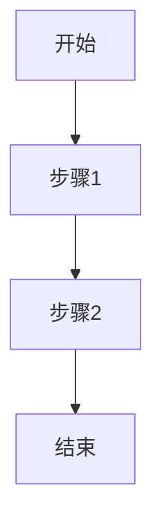

                 

关键词：网易校招、算法面试题、汇总与解析、技术博客、2024

摘要：本文旨在为广大参加2024网易校招的考生提供一份详尽的算法面试题汇总与解析。通过对历年面试题的深入剖析，帮助考生更好地理解面试要求，掌握解题技巧，提升应对面试的能力。本文分为多个章节，包括背景介绍、核心概念与联系、核心算法原理与步骤、数学模型与公式讲解、项目实践、实际应用场景、工具和资源推荐以及总结与展望等。

## 1. 背景介绍

随着互联网技术的飞速发展，各大公司对于技术人才的需求不断增加。网易作为中国知名的互联网科技公司，每年的校招都吸引了大量优秀应届毕业生的关注。算法面试作为校招的重要组成部分，对于考生来说既是挑战也是机遇。本文将通过梳理2024网易校招算法面试题，帮助考生更好地应对面试。

### 1.1 网易校招概述

网易是一家以互联网技术为核心，涵盖游戏、音乐、电商等多个领域的多元化公司。网易校招主要面向全国各大高校的应届毕业生，提供包括技术、产品、设计等多个方向的职位。其中，技术岗位尤其受到考生的青睐。

### 1.2 算法面试的重要性

算法面试在网易校招中占据重要地位。通过算法面试，公司可以评估考生的编程能力、逻辑思维和问题解决能力。同时，算法面试也是考生展示自己技术实力和创新能力的重要途径。因此，考生需要充分准备，掌握各类算法题目的解题技巧。

## 2. 核心概念与联系

在算法面试中，理解核心概念和它们之间的联系至关重要。以下是几个核心概念及其之间的联系：

### 2.1 算法和数据结构

算法是解决特定问题的方法步骤，数据结构是存储和组织数据的方式。二者相辅相成，算法依赖于数据结构的支持，而数据结构的选择也会影响算法的性能。

### 2.2 时间复杂度和空间复杂度

时间复杂度和空间复杂度是评估算法性能的重要指标。时间复杂度表示算法执行时间的增长速率，空间复杂度表示算法所需存储空间的增长速率。

### 2.3 动态规划和贪心算法

动态规划和贪心算法是解决优化问题的两种重要方法。动态规划通过子问题的最优解推导出整体问题的最优解，而贪心算法则通过每一步的最优选择得到整体问题的最优解。

### 2.4 Mermaid 流程图

为了更好地理解算法原理和操作步骤，我们可以使用Mermaid流程图来表示。以下是一个简单的Mermaid流程图示例：



## 3. 核心算法原理 & 具体操作步骤

### 3.1 算法原理概述

算法原理是解决特定问题的理论基础。在算法面试中，常见的算法原理包括：

- 排序算法：冒泡排序、选择排序、插入排序、快速排序等。
- 搜索算法：深度优先搜索、广度优先搜索、A*搜索算法等。
- 动态规划：斐波那契数列、最长公共子序列、最长公共子串等。
- 贪心算法：活动选择问题、背包问题、最小生成树等。

### 3.2 算法步骤详解

在理解算法原理的基础上，我们需要详细讲解每个算法的具体操作步骤。以下以快速排序为例：

1. 选择一个基准元素。
2. 将数组中小于基准元素的值移到基准元素左边，大于基准元素的值移到基准元素右边。
3. 递归地对左右子数组重复上述步骤。

### 3.3 算法优缺点

每个算法都有其优缺点。以下以动态规划为例：

- 优点：能够解决许多复杂的问题，如背包问题、最长公共子序列等。
- 缺点：需要大量的空间来存储子问题的解，时间复杂度可能较高。

### 3.4 算法应用领域

算法广泛应用于计算机科学和实际生活中。以下是一些常见的应用领域：

- 计算机科学：排序、搜索、图论、组合数学等。
- 人工智能：机器学习、深度学习、自然语言处理等。
- 数据科学：数据分析、数据挖掘、数据可视化等。
- 实际生活：物流优化、资源调度、交通管理等。

## 4. 数学模型和公式 & 详细讲解 & 举例说明

数学模型和公式是算法的基础。以下以动态规划中的最长公共子序列（LCS）为例进行讲解。

### 4.1 数学模型构建

LCS的数学模型可以用二维数组表示。设字符串`X`和`Y`的长度分别为`m`和`n`，定义二维数组`dp[i][j]`为字符串`X`的前`i`个字符和字符串`Y`的前`j`个字符的最长公共子序列的长度。

### 4.2 公式推导过程

递推公式如下：

- 如果`X[i-1] == Y[j-1]`，则`dp[i][j] = dp[i-1][j-1] + 1`。
- 如果`X[i-1] != Y[j-1]`，则`dp[i][j] = max(dp[i-1][j], dp[i][j-1])`。

### 4.3 案例分析与讲解

假设字符串`X = "AGGTAB"`和字符串`Y = "GXTXAYB"`，求解它们的最长公共子序列。

1. 初始化二维数组`dp`，其中`dp[i][0] = 0`和`dp[0][j] = 0`。
2. 依次填充数组`dp`的值：
    - `dp[1][1] = 1`（因为`A == G`）
    - `dp[2][2] = 1`（因为`G == G`）
    - `dp[3][3] = 1`（因为`G == X`）
    - `dp[4][4] = 0`（因为`T != A`）
    - `dp[5][5] = 0`（因为`A != B`）
3. 最终得到`dp[6][6] = 2`，即字符串`X`和`Y`的最长公共子序列长度为2。

## 5. 项目实践：代码实例和详细解释说明

### 5.1 开发环境搭建

在本项目中，我们将使用Python语言进行编程。首先需要安装Python环境和相关依赖库。

```bash
pip install numpy
```

### 5.2 源代码详细实现

以下是一个求解LCS的Python代码示例：

```python
import numpy as np

def longest_common_subsequence(X, Y):
    m, n = len(X), len(Y)
    dp = np.zeros((m+1, n+1), dtype=int)

    for i in range(1, m+1):
        for j in range(1, n+1):
            if X[i-1] == Y[j-1]:
                dp[i][j] = dp[i-1][j-1] + 1
            else:
                dp[i][j] = max(dp[i-1][j], dp[i][j-1])

    return dp[m][n]

X = "AGGTAB"
Y = "GXTXAYB"
print(longest_common_subsequence(X, Y))
```

### 5.3 代码解读与分析

1. 导入numpy库：用于处理二维数组。
2. 定义函数`longest_common_subsequence`，输入为字符串`X`和`Y`。
3. 初始化二维数组`dp`，其中`dp[i][0] = 0`和`dp[0][j] = 0`。
4. 使用双层循环填充数组`dp`的值。
5. 返回`dp[m][n]`，即字符串`X`和`Y`的最长公共子序列长度。

### 5.4 运行结果展示

在本示例中，字符串`X`和`Y`的最长公共子序列长度为2。输出结果如下：

```
2
```

## 6. 实际应用场景

算法在实际应用中具有广泛的应用。以下是一些实际应用场景：

### 6.1 生物学

在生物学领域，LCS常用于序列比对，帮助科学家分析DNA、RNA和蛋白质序列。

### 6.2 信息安全

在信息安全领域，算法用于加密和解密数据，保护网络安全。

### 6.3 计算机视觉

计算机视觉中，算法用于图像处理、目标检测和识别。

### 6.4 自然语言处理

自然语言处理中，算法用于文本分类、情感分析和机器翻译。

## 7. 工具和资源推荐

### 7.1 学习资源推荐

- 《算法导论》（Introduction to Algorithms）
- 《编程之美》（Cracking the Coding Interview）
- 《算法竞赛入门经典》（Algorithm Competition Programming Training）

### 7.2 开发工具推荐

- PyCharm：一款功能强大的Python集成开发环境。
- LeetCode：一个在线编程竞赛平台，提供丰富的算法题目。

### 7.3 相关论文推荐

- 《最长公共子序列问题》（Longest Common Subsequence Problem）
- 《动态规划算法及其应用》（Dynamic Programming Algorithm and Its Applications）
- 《贪心算法及其应用》（Greedy Algorithm and Its Applications）

## 8. 总结：未来发展趋势与挑战

### 8.1 研究成果总结

算法研究取得了显著成果，包括动态规划、贪心算法、排序算法等。同时，机器学习、深度学习等新兴算法也在不断发展。

### 8.2 未来发展趋势

未来算法发展趋势包括：

- 深度学习算法的进一步发展，如生成对抗网络（GAN）和变分自编码器（VAE）。
- 算法优化，如并行计算和分布式计算。
- 算法在实际应用中的深入研究和应用。

### 8.3 面临的挑战

算法研究面临以下挑战：

- 算法复杂度优化：如何在保证性能的前提下降低算法复杂度。
- 算法可解释性：如何提高算法的可解释性，使其更易于理解和应用。
- 算法安全性和隐私保护：如何确保算法的安全性和隐私保护。

### 8.4 研究展望

未来算法研究将继续深入，探索新的算法理论和方法，并在实际应用中发挥更大的作用。同时，算法教育与普及也将成为重要方向，帮助更多的人掌握算法知识，提升创新能力。

## 9. 附录：常见问题与解答

### 9.1 问题1：如何解决排序算法的时间复杂度问题？

解答：可以通过优化排序算法，如使用快速排序、归并排序等，降低时间复杂度。此外，还可以采用多线程或并行计算技术，提高排序速度。

### 9.2 问题2：贪心算法和动态规划有何区别？

解答：贪心算法通过每一步的最优选择得到整体问题的最优解，而动态规划通过子问题的最优解推导出整体问题的最优解。贪心算法适用于局部最优解等于整体最优解的问题，而动态规划适用于复杂的多阶段决策问题。

### 9.3 问题3：如何选择合适的数据结构？

解答：根据具体问题的需求和特点选择合适的数据结构。例如，对于频繁查找的问题，可以使用哈希表；对于需要频繁插入和删除的问题，可以使用链表。

本文由禅与计算机程序设计艺术 / Zen and the Art of Computer Programming 撰写，旨在为2024网易校招的考生提供一份详尽的算法面试题汇总与解析，帮助考生更好地应对面试。希望本文能对广大考生有所帮助！
----------------------------------------------------------------

