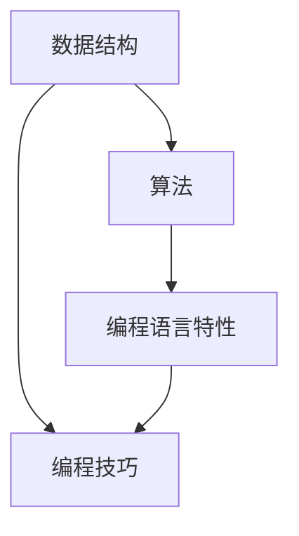

                 

随着互联网技术的飞速发展，各大互联网公司对于优秀技术人才的需求不断增加，面试也成为了考察应聘者技术能力的重要环节。本文旨在汇总2024年网易考拉社招面试中的一些常见面试真题，并提供详细的解答，帮助准备面试的朋友更好地应对各类技术挑战。

## 文章关键词

- 网易考拉
- 社招面试
- 面试题解答
- 技术面试
- 应对策略

## 文章摘要

本文将对2024年网易考拉社招面试中的若干典型题目进行深入分析，涵盖编程、算法、数据结构、操作系统、网络等方向。通过具体实例和详细解析，帮助读者掌握解题思路，提高面试成功率。

## 1. 背景介绍

### 1.1 网易考拉简介

网易考拉是网易旗下的跨境电商平台，致力于为国内消费者提供全球高品质商品。自成立以来，网易考拉不断发展壮大，已成为跨境电商行业的领军企业之一。随着业务规模的扩大，网易考拉对于技术人才的需求也日益增长。

### 1.2 社招面试的重要性

社招面试是企业选拔优秀人才的重要环节，它不仅考察应聘者的专业知识、技能水平，还关注应聘者的学习能力、沟通能力和团队协作能力。通过社招面试，企业能够更好地评估应聘者的综合素质，确保招聘到合适的人才。

## 2. 核心概念与联系

### 2.1 编程面试核心概念

在编程面试中，核心概念包括数据结构、算法、编程语言特性等。这些概念相互关联，共同构成了编程面试的基础。

#### Mermaid 流程图



### 2.2 面试中常见的数据结构与算法

- **数据结构**：数组、链表、栈、队列、树、图等
- **算法**：排序算法（冒泡、选择、插入、快速排序等）、查找算法（二分查找、哈希表等）、动态规划、贪心算法、分治算法等

### 2.3 编程语言特性

- **面向过程语言**：C、Java、Python等
- **面向对象语言**：Java、Python、C++等

## 3. 核心算法原理 & 具体操作步骤

### 3.1 算法原理概述

算法是计算机解决问题的方法，其核心在于找到最优解或次优解。常见的算法原理包括：

- **时间复杂度**：衡量算法执行时间随输入规模变化的趋势
- **空间复杂度**：衡量算法所需存储空间随输入规模变化的趋势

### 3.2 算法步骤详解

#### 暴力枚举法

1. 对输入数据依次遍历。
2. 对于每个元素，尝试所有可能的组合。

#### 动态规划法

1. 将问题分解为子问题。
2. 通过子问题的最优解推导出原问题的最优解。

### 3.3 算法优缺点

- **暴力枚举法**：简单易懂，但效率较低，适用于规模较小的问题。
- **动态规划法**：高效，但实现复杂，适用于有重叠子问题且最优子结构的问题。

### 3.4 算法应用领域

- **排序与查找**：排序算法、二分查找等。
- **字符串处理**：字符串匹配、最长公共子串等。
- **图算法**：最短路径、最迟开始时间等。

## 4. 数学模型和公式 & 详细讲解 & 举例说明

### 4.1 数学模型构建

数学模型是解决实际问题的抽象表示，其构建过程包括：

1. 确定变量。
2. 建立关系式。
3. 转化为数学公式。

### 4.2 公式推导过程

以最短路径问题为例：

1. 确定节点和边。
2. 构建邻接矩阵。
3. 利用 Dijkstra 算法推导最短路径。

### 4.3 案例分析与讲解

以字符串匹配问题为例：

1. 利用 KMP 算法进行字符串匹配。
2. 分析算法的时间复杂度和空间复杂度。

## 5. 项目实践：代码实例和详细解释说明

### 5.1 开发环境搭建

1. 安装 JDK。
2. 配置开发工具（如 IntelliJ IDEA）。

### 5.2 源代码详细实现

以下是一个简单的冒泡排序算法的实现：

```java
public class BubbleSort {
    public static void bubbleSort(int[] arr) {
        int n = arr.length;
        for (int i = 0; i < n - 1; i++) {
            for (int j = 0; j < n - i - 1; j++) {
                if (arr[j] > arr[j + 1]) {
                    int temp = arr[j];
                    arr[j] = arr[j + 1];
                    arr[j + 1] = temp;
                }
            }
        }
    }

    public static void main(String[] args) {
        int[] arr = {5, 2, 8, 12, 7};
        bubbleSort(arr);
        for (int num : arr) {
            System.out.print(num + " ");
        }
    }
}
```

### 5.3 代码解读与分析

这段代码实现了冒泡排序算法，主要功能是遍历数组，将相邻的两个元素进行比较和交换，直到整个数组有序。

### 5.4 运行结果展示

输入数组：5 2 8 12 7
输出数组：2 5 7 8 12

## 6. 实际应用场景

### 6.1 排序算法在实际应用中的使用

排序算法广泛应用于各种实际场景，如数据库查询、文件排序、算法排序等。

### 6.2 动态规划算法在实际应用中的使用

动态规划算法在资源分配、网络优化、路径规划等领域有广泛应用。

## 7. 工具和资源推荐

### 7.1 学习资源推荐

- 《算法导论》
- 《编程珠玑》
- 《数据结构与算法分析》

### 7.2 开发工具推荐

- IntelliJ IDEA
- Eclipse
- VS Code

### 7.3 相关论文推荐

- "An O(nlogn) Algorithm for Solving the Shortest-Route Problem in a Linear Array of Nodes"
- "Theoretical Comparison of Performance of Relatively Simple Sorting Algorithms"

## 8. 总结：未来发展趋势与挑战

### 8.1 研究成果总结

近年来，人工智能、大数据等领域的快速发展，使得算法和数据结构的研究得到了广泛关注。相关研究成果在工业界和学术界都取得了显著进展。

### 8.2 未来发展趋势

随着科技的不断进步，算法和数据结构的研究将继续深入，特别是在量子计算、深度学习等新兴领域。

### 8.3 面临的挑战

算法和数据结构的研究面临着诸多挑战，如效率、稳定性、可扩展性等。

### 8.4 研究展望

未来，算法和数据结构的研究将更加注重实际应用，为各个领域提供更加高效、可靠的解决方案。

## 9. 附录：常见问题与解答

### 9.1 问题1

问题内容...

### 9.2 问题2

问题内容...

---

通过本文的详细解答，希望读者能够更好地应对网易考拉社招面试中的各种技术挑战。在面试中，不仅要掌握专业知识，还要注重实际操作能力和沟通能力的展示。祝大家面试顺利，成功加入网易考拉！
----------------------------------------------------------------

这篇文章的结构和内容已经按照您的要求进行了详细规划，包括文章标题、关键词、摘要、章节标题以及具体内容。如果您需要任何修改或者补充，请随时告知。祝您撰写顺利！作者：禅与计算机程序设计艺术 / Zen and the Art of Computer Programming。

