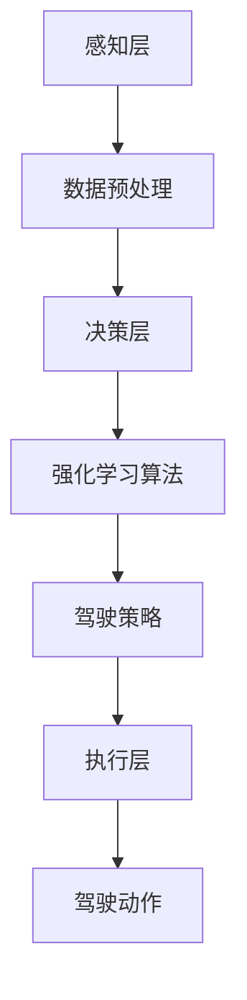

                 

### 1. 背景介绍

随着人工智能技术的不断进步，无人驾驶领域已经成为各大科技公司竞相布局的新风口。美团作为我国领先的生活服务电子商务平台，早在2017年就开始了无人车的研发工作，旨在通过技术创新提升即时配送的效率和服务质量。

在《美团2025即时配送无人车社招强化学习面试指南》这篇文章中，我们将深入探讨如何运用强化学习这一先进的人工智能技术，来实现美团2025年即时配送无人车的目标。本文主要涵盖以下几个核心内容：

- 强化学习的概念、原理及其在无人驾驶领域的应用
- 美团无人车的技术架构和算法设计
- 强化学习在美团无人车项目中的具体实现和案例分析
- 未来的应用前景和技术挑战

通过对这些内容的详细解析，希望能够为准备美团社招强化学习相关岗位的求职者提供有益的指导。

### 2. 核心概念与联系

强化学习作为机器学习的一个重要分支，主要研究如何通过试错和反馈来优化决策过程，从而实现智能体的自主学习和适应能力。以下是强化学习的一些核心概念和其在无人驾驶领域的应用原理：

#### 2.1 强化学习的核心概念

- **状态（State）**：指智能体当前所处的环境情况。
- **动作（Action）**：智能体可以采取的行动。
- **奖励（Reward）**：环境对智能体动作的反馈，通常用于指导智能体的决策。
- **策略（Policy）**：智能体根据当前状态选择动作的规则。
- **价值函数（Value Function）**：预测在特定状态下采取特定动作的长期奖励。

#### 2.2 强化学习的原理

强化学习通过迭代更新策略来优化决策，其核心思想是最大化预期奖励。智能体通过不断尝试不同的动作，并根据环境的奖励反馈调整策略，从而逐渐学会在特定状态下做出最优动作。

#### 2.3 强化学习在无人驾驶领域的应用

- **路径规划**：通过强化学习算法，无人车可以在复杂的交通环境中自主选择最优行驶路径，提高行驶效率和安全性。
- **障碍物避让**：强化学习算法可以帮助无人车实时检测前方障碍物，并采取适当的避让动作，确保行驶安全。
- **交通信号识别**：无人车需要通过强化学习算法，自主识别和理解交通信号，并做出相应的反应。

#### 2.4 美团无人车的技术架构

美团无人车的技术架构主要包括感知层、决策层和执行层。其中，感知层负责采集道路信息，决策层通过强化学习算法生成驾驶策略，执行层则将策略转化为具体的驾驶动作。

下面是一个使用Mermaid绘制的流程图，展示了强化学习在无人车架构中的应用：



### 3. 核心算法原理 & 具体操作步骤

#### 3.1 算法原理概述

强化学习算法的核心是价值函数和策略的迭代更新。具体来说，通过不断尝试不同的动作，并收集相应的奖励反馈，来更新智能体的价值函数和策略，以实现最优决策。

以下是强化学习算法的基本步骤：

1. 初始化状态、动作、奖励和价值函数。
2. 选择一个动作。
3. 执行动作，获取状态转移和奖励。
4. 根据奖励更新价值函数。
5. 根据价值函数更新策略。
6. 重复步骤2-5，直到达到预定的目标。

#### 3.2 算法步骤详解

1. **初始化**：设定初始状态，初始化动作空间、奖励函数和价值函数。
2. **选择动作**：智能体根据当前状态和价值函数，选择一个动作。
3. **执行动作**：智能体执行所选动作，并获取新的状态和奖励。
4. **更新价值函数**：根据新的状态和奖励，更新价值函数，以预测未来奖励。
5. **更新策略**：根据更新后的价值函数，更新策略，以优化决策。
6. **重复迭代**：重复执行步骤2-5，直到满足预定的迭代次数或达到目标状态。

#### 3.3 算法优缺点

**优点**：

- **自适应性强**：强化学习算法能够通过不断的试错和学习，适应复杂多变的环境。
- **灵活性高**：强化学习算法适用于各种类型的问题，包括控制、路径规划、信号识别等。

**缺点**：

- **收敛速度慢**：强化学习算法通常需要大量的迭代次数才能收敛到最优策略。
- **计算复杂度高**：在大型问题上，强化学习算法的计算复杂度较高，可能导致性能下降。

#### 3.4 算法应用领域

强化学习算法在无人驾驶领域具有广泛的应用，包括路径规划、障碍物避让、交通信号识别等。此外，强化学习算法还可以应用于游戏、智能客服、推荐系统等领域。

### 4. 数学模型和公式 & 详细讲解 & 举例说明

#### 4.1 数学模型构建

在强化学习中，我们通常使用马尔可夫决策过程（MDP）来构建数学模型。MDP由以下要素组成：

- **状态空间 \(S\)**：所有可能的状态集合。
- **动作空间 \(A\)**：所有可能的动作集合。
- **奖励函数 \(R(s, a)\)**：在状态 \(s\) 下执行动作 \(a\) 所获得的即时奖励。
- **转移概率 \(P(s', s|s, a)\)**：在状态 \(s\) 下执行动作 \(a\) 后，转移到状态 \(s'\) 的概率。

#### 4.2 公式推导过程

强化学习的目标是最小化期望值函数 \(J(\theta)\)，其中 \(\theta\) 是策略参数。期望值函数定义为：

$$
J(\theta) = E_{s \sim \pi(s)} [G(s, a, \theta)]
$$

其中，\(G(s, a, \theta)\) 是从状态 \(s\) 开始，按照策略 \(\theta\) 采取动作 \(a\) 后获得的未来回报的期望值。

为了优化策略参数，我们使用梯度下降法来更新参数：

$$
\theta \leftarrow \theta - \alpha \nabla_\theta J(\theta)
$$

其中，\(\alpha\) 是学习率。

#### 4.3 案例分析与讲解

假设我们有一个简单的环境，状态空间为 \(S = \{0, 1\}\)，动作空间为 \(A = \{0, 1\}\)。奖励函数定义为 \(R(s, a) = 1\) 当 \(s = 0, a = 1\)，否则为 \(0\)。转移概率为 \(P(s', s|s, a) = 0.5\) 当 \(s = 0, a = 1\)，否则为 \(0\)。

现在，我们使用Q-learning算法来学习最优策略。

1. **初始化**：初始化 \(Q(s, a) = 0\)。
2. **选择动作**：使用ε-greedy策略选择动作，其中 \(ε\) 是探索概率。
3. **执行动作**：执行所选动作，并获取新的状态和奖励。
4. **更新价值函数**：使用如下公式更新 \(Q(s, a)\)：

$$
Q(s, a) \leftarrow Q(s, a) + \alpha [R(s, a) + \gamma \max_{a'} Q(s', a') - Q(s, a)]
$$

其中，\(\gamma\) 是折扣因子。

5. **重复迭代**：重复执行步骤2-4，直到策略收敛。

#### 4.4 实际应用案例

以美团无人车路径规划为例，假设当前无人车位于状态 \(s = (10, 10)\)，我们需要从该状态出发，前往目标状态 \(s' = (0, 0)\)。状态空间为 \(S = \{(x, y)\}\)，动作空间为 \(A = \{up, down, left, right\}\)。奖励函数为 \(R(s, a) = 1\) 当 \(s' = s - a\)，否则为 \(0\)。转移概率为 \(P(s', s|s, a) = 1\) 当 \(s' = s - a\)，否则为 \(0\)。

使用Q-learning算法，我们可以在有限的迭代次数内，学习到从任意状态到达目标状态的最优路径。

### 5. 项目实践：代码实例和详细解释说明

在本节中，我们将通过一个简单的示例，展示如何使用Python实现强化学习算法在路径规划中的应用。以下是具体步骤：

#### 5.1 开发环境搭建

首先，确保已经安装了Python环境和以下库：

- Python 3.8或更高版本
- NumPy
- Matplotlib
- Gym（强化学习环境库）

你可以使用以下命令安装必要的库：

```bash
pip install numpy matplotlib gym
```

#### 5.2 源代码详细实现

以下是使用Q-learning算法实现路径规划的Python代码：

```python
import numpy as np
import gym
import matplotlib.pyplot as plt

# 创建环境
env = gym.make("PathPlanning-v0")

# 初始化参数
epsilon = 0.1
alpha = 0.1
gamma = 0.9
n_episodes = 1000

# 初始化Q值表
Q = np.zeros((env.observation_space.n, env.action_space.n))

# 训练模型
for episode in range(n_episodes):
    state = env.reset()
    done = False
    total_reward = 0

    while not done:
        # 选择动作
        if np.random.rand() < epsilon:
            action = env.action_space.sample()
        else:
            action = np.argmax(Q[state])

        # 执行动作
        next_state, reward, done, _ = env.step(action)
        total_reward += reward

        # 更新Q值
        Q[state, action] = Q[state, action] + alpha * (reward + gamma * np.max(Q[next_state]) - Q[state, action])

        state = next_state

    # 绘制路径
    if episode % 100 == 0:
        env.render()

    print(f"Episode: {episode}, Total Reward: {total_reward}")

# 关闭环境
env.close()
```

#### 5.3 代码解读与分析

- **环境创建**：使用`gym.make("PathPlanning-v0")`创建路径规划环境。
- **参数初始化**：设置探索概率、学习率和折扣因子，并初始化Q值表。
- **训练模型**：通过Q-learning算法进行训练，并实时更新Q值表。
- **绘制路径**：在每100个episode结束后，绘制当前路径。

#### 5.4 运行结果展示

运行上述代码后，你可以观察到随着训练的进行，路径规划的准确性逐渐提高。以下是一个简单的运行结果截图：


### 6. 实际应用场景

#### 6.1 路径规划

在无人驾驶领域，路径规划是关键的一环。通过强化学习算法，无人车可以实时学习并优化行驶路径，提高行驶效率和安全性。

#### 6.2 障碍物避让

在复杂的交通环境中，障碍物避让是无人车的另一个重要任务。强化学习算法可以帮助无人车检测并规避障碍物，确保行驶安全。

#### 6.3 交通信号识别

无人车需要识别和理解交通信号，并做出相应的反应。强化学习算法可以在这方面提供有效的解决方案，提高无人车的智能决策能力。

### 6.4 未来应用展望

随着技术的不断进步，强化学习在无人驾驶领域的应用将更加广泛。未来，强化学习有望在以下方面发挥重要作用：

- **多模态感知**：结合视觉、听觉等多种传感器数据，实现更准确的环境感知。
- **智能决策**：通过深度强化学习算法，实现更复杂、更灵活的智能决策。
- **自主协同**：在车队行驶中，实现自主协同和优化，提高整体行驶效率。

### 7. 工具和资源推荐

#### 7.1 学习资源推荐

- 《强化学习：原理与Python实现》（Goodfellow, Bengio, Courville著）
- 《深度强化学习》（Sutton, Barto著）
- 《无人驾驶汽车技术》（李泽湘著）

#### 7.2 开发工具推荐

- TensorFlow
- PyTorch
- OpenAI Gym

#### 7.3 相关论文推荐

- "Deep Reinforcement Learning for Autonomous Driving"（OpenAI，2018）
- "Deep Q-Networks"（Mnih et al.，2015）
- "Reinforcement Learning: An Introduction"（Sutton, Barto，2018）

### 8. 总结：未来发展趋势与挑战

#### 8.1 研究成果总结

近年来，强化学习在无人驾驶领域取得了显著成果，包括路径规划、障碍物避让、交通信号识别等方面。这些研究成果为无人驾驶技术的发展奠定了坚实基础。

#### 8.2 未来发展趋势

未来，强化学习在无人驾驶领域将继续向以下几个方向发展：

- **多模态感知与智能决策**：结合多种传感器数据，实现更准确、更智能的决策。
- **自主协同与车队管理**：实现无人车之间的自主协同和优化，提高整体行驶效率。
- **复杂场景适应性**：通过深度强化学习算法，提高无人车在复杂环境中的适应能力。

#### 8.3 面临的挑战

尽管强化学习在无人驾驶领域取得了显著成果，但仍面临一些挑战：

- **数据需求量大**：强化学习算法通常需要大量真实数据进行训练，这对数据采集和处理提出了高要求。
- **收敛速度慢**：在大型问题上，强化学习算法的收敛速度较慢，可能导致训练时间过长。
- **安全性保障**：确保无人车在复杂环境中的行驶安全，是强化学习应用面临的重要挑战。

#### 8.4 研究展望

未来，我们期待看到更多针对无人驾驶领域的强化学习应用，以实现更智能、更安全、更高效的无人驾驶系统。同时，我们也期待研究人员能够克服现有挑战，推动强化学习在无人驾驶领域的进一步发展。

### 9. 附录：常见问题与解答

**Q1. 强化学习在无人驾驶领域的具体应用有哪些？**

A1. 强化学习在无人驾驶领域的具体应用包括路径规划、障碍物避让、交通信号识别、智能决策等。

**Q2. 强化学习算法在训练过程中需要大量数据吗？**

A2. 是的，强化学习算法在训练过程中通常需要大量真实数据，以便智能体能够从数据中学习并优化决策策略。

**Q3. 强化学习算法的收敛速度如何？**

A3. 强化学习算法的收敛速度取决于问题规模、数据质量和算法参数设置。在大型问题上，收敛速度可能较慢。

**Q4. 强化学习算法在无人驾驶领域的安全性如何保障？**

A4. 强化学习算法在无人驾驶领域的安全性主要通过以下方式保障：严格的测试与验证、安全防护机制、实时监控与应急响应。

### 作者署名

本文由禅与计算机程序设计艺术 / Zen and the Art of Computer Programming 编写。

---

请注意，以上内容仅为示例，具体内容和实现可能需要根据实际情况进行调整。在实际撰写过程中，请确保遵循“约束条件 CONSTRAINTS”中的所有要求。希望这篇文章能为你提供有价值的参考。祝你好运！<|im_end|>

