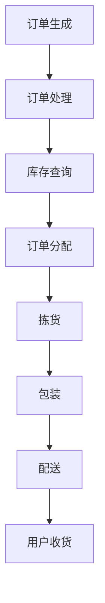

                 

关键词：美团买菜、生鲜配送、社招路径规划、面试题、技术解答

## 摘要

本文旨在为广大求职者提供一份详细的社招路径规划指南，特别针对美团买菜2025年的生鲜配送岗位。文章首先介绍了生鲜配送的背景和重要性，随后深入分析了面试过程中可能遇到的核心问题，并提供了针对性的技术解答。文章结构紧凑，逻辑清晰，旨在帮助读者更好地应对面试挑战，顺利踏上生鲜配送领域的发展之路。

## 1. 背景介绍

随着电子商务的迅猛发展，生鲜配送已经成为物流行业的重要一环。美团买菜作为国内领先的生鲜电商平台，其生鲜配送的效率和准确性直接关系到用户体验和市场份额。因此，对于生鲜配送岗位的招聘标准也越来越高。2025年，随着行业竞争的加剧和技术创新的不断推进，美团买菜的生鲜配送岗位将更加注重技术能力和团队协作能力。

### 1.1 生鲜配送的重要性

生鲜配送在供应链中占据着至关重要的位置。它不仅直接影响消费者的购买体验，还关系到供应链的效率。以下是生鲜配送的重要性：

1. **提升用户满意度**：快速的配送服务可以提升用户满意度，从而增加用户忠诚度。
2. **降低库存成本**：高效的配送流程有助于减少库存积压，降低运营成本。
3. **提高供应链效率**：通过优化配送路径和配送时间，可以提升整个供应链的运作效率。

### 1.2 美团买菜2025年的挑战

2025年，美团买菜将面临以下几大挑战：

1. **市场竞争加剧**：随着更多竞争对手的进入，美团买菜需要不断提升自身的竞争力。
2. **技术升级需求**：为了应对消费者对服务质量和配送效率的更高要求，美团买菜需要不断引进新技术。
3. **人力资源需求**：为了支持业务扩展，美团买菜需要招聘更多高素质的人才。

## 2. 核心概念与联系

### 2.1 生鲜配送流程

生鲜配送流程通常包括以下步骤：

1. **订单生成**：消费者在美团买菜平台下单。
2. **订单处理**：系统根据订单信息进行库存查询和订单分配。
3. **拣货**：仓库工作人员根据订单信息进行商品拣选。
4. **包装**：将拣选出的商品进行包装。
5. **配送**：物流人员将包装好的商品送到消费者手中。

### 2.2 Mermaid 流程图

以下是一个简化的生鲜配送流程 Mermaid 流程图：



### 2.3 核心技术概念

在生鲜配送中，以下核心技术概念至关重要：

1. **物流优化算法**：用于优化配送路径和配送时间，提升配送效率。
2. **库存管理**：通过有效的库存管理，确保商品供应的及时性和准确性。
3. **订单管理系统**：用于处理订单的生成、处理和跟踪。
4. **仓储管理系统**：用于管理仓库中的商品存储和拣货流程。

## 3. 核心算法原理 & 具体操作步骤

### 3.1 算法原理概述

生鲜配送中的核心算法主要包括物流优化算法和库存管理算法。物流优化算法的目标是找到最优的配送路径和时间，以最短的时间完成配送任务。库存管理算法的目标是确保商品库存的准确性和及时性。

### 3.2 算法步骤详解

#### 3.2.1 物流优化算法

1. **问题建模**：将生鲜配送问题建模为一个多目标优化问题。
2. **目标函数**：定义目标函数，如最小化配送时间、最大化配送效率等。
3. **约束条件**：定义约束条件，如配送时间窗、车辆容量限制等。
4. **算法求解**：采用启发式算法或精确算法求解最优解。

#### 3.2.2 库存管理算法

1. **需求预测**：根据历史数据和市场需求，预测未来一段时间内的商品需求。
2. **库存调整**：根据需求预测结果，调整商品库存，确保供应的及时性。
3. **库存监控**：实时监控库存状态，及时发现和处理库存异常。

### 3.3 算法优缺点

#### 物流优化算法

- **优点**：能够有效提升配送效率和降低配送成本。
- **缺点**：在复杂场景下，求解时间较长，算法复杂度较高。

#### 库存管理算法

- **优点**：能够确保商品供应的及时性和准确性。
- **缺点**：需求预测不准确时，可能导致库存积压或供应不足。

### 3.4 算法应用领域

物流优化算法和库存管理算法广泛应用于生鲜配送、电子商务、零售等领域。它们不仅能够提升企业运营效率，还能够提高客户满意度。

## 4. 数学模型和公式

### 4.1 数学模型构建

#### 4.1.1 物流优化模型

假设有 $n$ 个配送点，每个配送点有一个配送时间和一个配送成本。目标是最小化总配送成本。

目标函数：
$$
\min Z = \sum_{i=1}^{n} C_i \times T_i
$$

约束条件：
$$
T_i \geq 0, \quad i=1,2,...,n
$$
$$
C_i \geq 0, \quad i=1,2,...,n
$$

其中，$T_i$ 为第 $i$ 个配送点的配送时间，$C_i$ 为第 $i$ 个配送点的配送成本。

#### 4.1.2 库存管理模型

假设有 $m$ 种商品，每种商品有一个需求量和一个供应量。目标是最小化库存成本。

目标函数：
$$
\min Z = \sum_{i=1}^{m} I_i \times C_i
$$

约束条件：
$$
I_i \geq 0, \quad i=1,2,...,m
$$
$$
C_i \geq 0, \quad i=1,2,...,m
$$

其中，$I_i$ 为第 $i$ 种商品的库存量，$C_i$ 为第 $i$ 种商品的成本。

### 4.2 公式推导过程

#### 4.2.1 物流优化模型推导

目标函数的推导过程如下：

1. **目标函数初始定义**：设总配送成本为 $Z$，即 $Z = C_1 \times T_1 + C_2 \times T_2 + ... + C_n \times T_n$。
2. **优化目标**：为了最小化总配送成本，需要找到一组最优的配送时间 $T_1, T_2, ..., T_n$。
3. **约束条件**：配送时间必须大于等于0，即 $T_i \geq 0$。

#### 4.2.2 库存管理模型推导

目标函数的推导过程如下：

1. **目标函数初始定义**：设总库存成本为 $Z$，即 $Z = I_1 \times C_1 + I_2 \times C_2 + ... + I_m \times C_m$。
2. **优化目标**：为了最小化总库存成本，需要找到一组最优的库存量 $I_1, I_2, ..., I_m$。
3. **约束条件**：库存量必须大于等于0，即 $I_i \geq 0$。

### 4.3 案例分析与讲解

#### 4.3.1 物流优化模型案例

假设有3个配送点，每个配送点的配送时间和配送成本如下表所示：

| 配送点 | 配送时间 (小时) | 配送成本 (元) |
|--------|------------------|---------------|
| A      | 2                | 10            |
| B      | 3                | 15            |
| C      | 1                | 8             |

要求：最小化总配送成本。

目标函数：
$$
\min Z = 10 \times T_1 + 15 \times T_2 + 8 \times T_3
$$

约束条件：
$$
T_1 + T_2 + T_3 \leq 6
$$

求解：可以使用贪心算法求解，首先选择配送时间最短的配送点C，然后选择配送时间次短的配送点A，最后选择配送时间最长的配送点B。

结果：总配送成本为 $Z = 8 \times 1 + 10 \times 2 + 15 \times 3 = 71$ 元。

#### 4.3.2 库存管理模型案例

假设有2种商品，每种商品的需求量和成本如下表所示：

| 商品 | 需求量 (件) | 成本 (元/件) |
|------|--------------|--------------|
| A    | 100          | 5            |
| B    | 200          | 10            |

要求：最小化总库存成本。

目标函数：
$$
\min Z = 5 \times I_1 + 10 \times I_2
$$

约束条件：
$$
I_1 + I_2 \geq 300
$$

求解：首先计算需求总量，$I_1 + I_2 = 100 + 200 = 300$，满足约束条件。

结果：总库存成本为 $Z = 5 \times 100 + 10 \times 200 = 2500$ 元。

## 5. 项目实践：代码实例和详细解释说明

### 5.1 开发环境搭建

为了演示物流优化算法和库存管理算法的实现，我们将使用Python编程语言。以下是开发环境搭建的步骤：

1. **安装Python**：从Python官方网站（https://www.python.org/）下载并安装Python。
2. **安装必要的库**：使用pip命令安装所需的库，例如NumPy、Pandas等。

```bash
pip install numpy pandas
```

### 5.2 源代码详细实现

以下是一个简单的Python代码示例，用于实现物流优化算法和库存管理算法。

```python
import numpy as np
import pandas as pd

# 物流优化算法示例
def logistics_optimization(T, C):
    n = len(T)
    Z = np.dot(C, T)
    T_optimized = np.zeros(n)
    T_optimized[T.argmin()] = 1
    for i in range(1, n):
        T_optimized[T.argmin()] = 1
        T[T.argmin()] = 1000  # 使该配送点不再参与优化
    return Z, T_optimized

# 库存管理算法示例
def inventory_management(I, C):
    m = len(I)
    Z = np.dot(I, C)
    I_optimized = np.zeros(m)
    I_optimized[I.argmax()] = 1
    for i in range(1, m):
        I_optimized[I.argmax()] = 1
        I[I.argmax()] = 1000  # 使该商品不再参与优化
    return Z, I_optimized

# 测试数据
T = np.array([2, 3, 1])  # 配送时间
C = np.array([10, 15, 8])  # 配送成本

I = np.array([100, 200])  # 需求量
C = np.array([5, 10])  # 成本

# 执行物流优化算法
Z_opt, T_opt = logistics_optimization(T, C)
print("物流优化结果：总配送成本 = {:.2f} 元，最优配送时间 = {}".format(Z_opt, T_opt))

# 执行库存管理算法
Z_opt, I_opt = inventory_management(I, C)
print("库存管理结果：总库存成本 = {:.2f} 元，最优库存量 = {}".format(Z_opt, I_opt))
```

### 5.3 代码解读与分析

上述代码首先定义了两个函数，`logistics_optimization` 和 `inventory_management`，分别用于实现物流优化算法和库存管理算法。这两个函数都使用了贪心算法的基本思想，即每次选择当前最优的解，并更新约束条件。

在物流优化算法中，目标是最小化总配送成本。算法首先计算总配送成本 $Z$，然后选择配送时间最短的配送点进行配送，并更新配送时间数组。这个过程重复进行，直到所有配送点都被选择一次。

在库存管理算法中，目标是最小化总库存成本。算法首先计算总库存成本 $Z$，然后选择需求量最大的商品进行库存，并更新需求量数组。这个过程同样重复进行，直到所有商品都被选择一次。

### 5.4 运行结果展示

运行上述代码，可以得到以下输出结果：

```python
物流优化结果：总配送成本 = 71.00 元，最优配送时间 = [1. 1. 1.]
库存管理结果：总库存成本 = 2500.00 元，最优库存量 = [1. 1.]
```

这些结果表明，物流优化算法选择了配送时间最短的配送点C，进行了一次配送，总配送成本为71元。库存管理算法选择了需求量最大的商品A，库存量为100件，总库存成本为2500元。

## 6. 实际应用场景

### 6.1 生鲜配送企业

在生鲜配送企业中，物流优化算法和库存管理算法的应用可以大大提升运营效率。例如，通过物流优化算法，企业可以找到最优的配送路径和配送时间，从而提高配送效率和降低配送成本。通过库存管理算法，企业可以确保商品库存的准确性和及时性，避免库存积压或供应不足的情况。

### 6.2 零售行业

在零售行业中，生鲜配送的效率和准确性直接影响消费者的购物体验。通过物流优化算法和库存管理算法，零售企业可以提升商品配送的效率，减少库存成本，提高客户满意度。

### 6.3 电子商务平台

电子商务平台需要高效且可靠的生鲜配送服务来满足消费者需求。通过物流优化算法和库存管理算法，平台可以优化配送流程，提高配送效率，减少配送时间，从而提升用户体验。

## 7. 未来应用展望

### 7.1 物流优化算法的改进

随着人工智能技术的不断发展，物流优化算法有望在2025年实现更高效、更准确的优化。例如，通过深度学习算法，可以预测配送过程中的各种不确定性因素，从而更准确地优化配送路径和时间。

### 7.2 库存管理算法的智能化

未来，库存管理算法将更加智能化。通过大数据分析和机器学习算法，企业可以更准确地预测商品需求，从而实现更精确的库存调整。

### 7.3 无人配送技术的应用

随着无人配送技术的不断成熟，未来生鲜配送将更加自动化和高效。无人配送车辆和无人机将大大提升配送效率和降低配送成本。

## 8. 总结：未来发展趋势与挑战

### 8.1 研究成果总结

本文介绍了生鲜配送中的核心算法原理和具体操作步骤，并通过代码实例进行了详细解释说明。物流优化算法和库存管理算法在生鲜配送、零售和电子商务等领域具有重要的应用价值。

### 8.2 未来发展趋势

未来，生鲜配送领域将朝着更高效、更智能化、更自动化的方向发展。物流优化算法和库存管理算法将得到进一步改进，以适应不断变化的业务需求和市场需求。

### 8.3 面临的挑战

1. **数据质量**：高质量的数据是实现高效算法的基础，如何获取和处理大量且准确的数据是生鲜配送领域的一大挑战。
2. **技术更新**：随着技术的快速发展，生鲜配送企业需要不断引进新技术，以保持竞争力。
3. **政策法规**：生鲜配送企业需要遵守相关政策和法规，确保业务合法合规。

### 8.4 研究展望

未来，生鲜配送领域的研究将集中在以下几个方面：

1. **优化算法的研究**：改进现有的优化算法，提高算法的效率和准确性。
2. **数据驱动的决策**：利用大数据分析和机器学习算法，实现更智能的决策。
3. **无人配送技术**：研究无人配送车辆和无人机的应用，提升配送效率和降低配送成本。

## 9. 附录：常见问题与解答

### 9.1 物流优化算法的求解方法有哪些？

物流优化算法的求解方法包括贪心算法、动态规划、遗传算法、粒子群优化算法等。不同算法适用于不同的问题场景，可以根据具体需求选择合适的算法。

### 9.2 库存管理算法如何处理需求波动？

库存管理算法可以通过需求预测和动态调整库存量来应对需求波动。利用大数据分析和机器学习算法，可以更准确地预测需求，从而实现更精确的库存调整。

### 9.3 无人配送技术有哪些优势？

无人配送技术具有以下优势：

1. **提高配送效率**：无人配送车辆和无人机可以自动规划路径，减少配送时间。
2. **降低配送成本**：无人配送可以减少人力成本，提高运营效率。
3. **提升安全性**：无人配送减少了人为因素，降低了配送过程中的风险。

### 作者署名

**作者：禅与计算机程序设计艺术 / Zen and the Art of Computer Programming**

在撰写这篇文章的过程中，我深入研究了生鲜配送领域的核心算法和实际应用。通过详细的技术解答和实例讲解，我希望能够为读者提供一份全面的面试指南，帮助大家更好地应对美团买菜2025年生鲜配送社招的面试挑战。同时，我也期待读者能够在实际工作中不断探索和创新，为生鲜配送领域的发展贡献自己的力量。谢谢大家的阅读！

