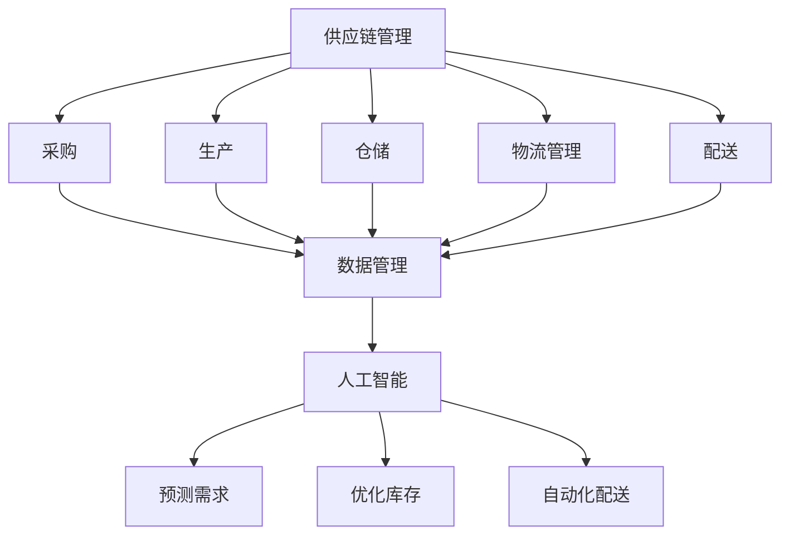

                 

### 背景介绍 Background ###

#### 美团优选概况 Overview of Meituan Youxuan

美团优选（Meituan Youxuan）是美团旗下专注于社区团购的电商平台，旨在为社区居民提供便捷、优质的生鲜和生活用品。自成立以来，美团优选迅速拓展市场份额，已成为国内社区团购领域的领军企业。

#### 社招生鲜供应链的重要性 Importance of Fresh Produce Supply Chain for Community Users

社区团购的核心在于为社区居民提供新鲜的生鲜产品。生鲜供应链的稳定性和高效性直接关系到用户体验和平台竞争力。为了满足不断增长的用户需求，构建一个高效、可靠的生鲜供应链系统至关重要。

#### 2025年社招生鲜供应链的发展展望 Future Development Outlook of Fresh Produce Supply Chain in 2025

随着科技的进步和消费者需求的多样化，2025年的社招生鲜供应链将面临新的挑战和机遇。如何在保证产品品质的前提下，提升供应链的效率和灵活性，将是未来发展的关键。

### 核心概念与联系 Core Concepts and Their Connections

在构建一个高效的生鲜供应链系统时，需要理解以下几个核心概念：

1. **供应链管理 Supply Chain Management**
   供应链管理涉及从原材料采购到产品交付给最终用户的整个过程。包括采购、生产、仓储、物流和配送等环节。

2. **物流管理 Logistics Management**
   物流管理是供应链系统的重要组成部分，涉及运输、仓储和配送等环节。高效的物流管理可以显著提升供应链的整体效率。

3. **数据管理 Data Management**
   数据管理是供应链系统中的核心，通过收集、存储、分析和利用数据，可以实现供应链的智能化和精准化。

4. **人工智能 Artificial Intelligence (AI)**
   人工智能技术可以用于优化供应链的各个环节，如预测需求、优化库存、自动化配送等。

#### Mermaid 流程图 Mermaid Flowchart



### 核心算法原理 & 具体操作步骤 Core Algorithm Principles and Operational Steps

#### 算法原理概述 Overview of Algorithm Principles

在构建高效生鲜供应链的过程中，核心算法主要涉及以下几个方面：

1. **需求预测 Demand Forecasting**
   通过历史数据和机器学习算法，预测未来一段时间内用户对生鲜产品的需求量。

2. **库存优化 Inventory Optimization**
   在确保供应稳定的前提下，通过算法优化库存水平，减少库存成本和浪费。

3. **路径优化 Route Optimization**
   利用最短路径算法（如Dijkstra算法）或车辆路径优化算法（如VRP算法），规划物流运输和配送路径。

4. **自动化配送 Automation Delivery**
   利用机器人、无人机等技术，实现自动化配送，提高配送效率。

#### 算法步骤详解 Detailed Steps of Algorithm

1. **需求预测**
   - 收集历史销售数据、市场趋势和消费者行为数据。
   - 使用时间序列分析或机器学习算法（如ARIMA模型、LSTM神经网络）进行预测。
   - 根据预测结果调整采购和生产计划。

2. **库存优化**
   - 建立库存模型，考虑安全库存、季节性需求、供应波动等因素。
   - 使用线性规划或启发式算法（如遗传算法、模拟退火算法）进行库存优化。
   - 根据优化结果调整库存水平，减少库存成本。

3. **路径优化**
   - 输入起点、终点和约束条件（如车辆容量、配送时间窗等）。
   - 使用最短路径算法（如Dijkstra算法）计算最优路径。
   - 根据实际运输需求和条件进行调整，优化路径。

4. **自动化配送**
   - 设计自动化配送系统，包括机器人、无人机等硬件设备。
   - 使用GPS、传感器等技术实现实时定位和路径跟踪。
   - 通过机器学习和人工智能技术，优化配送路线和效率。

#### 算法优缺点 Advantages and Disadvantages of Algorithms

- **需求预测**
  - 优点：提高采购和生产计划的准确性，减少库存成本。
  - 缺点：预测模型的准确性受数据质量和算法选择的影响。

- **库存优化**
  - 优点：降低库存成本，减少浪费。
  - 缺点：库存优化模型复杂，计算量大。

- **路径优化**
  - 优点：提高物流运输效率，减少运输成本。
  - 缺点：路径优化算法在复杂场景下的计算复杂度高。

- **自动化配送**
  - 优点：提高配送效率，降低人力成本。
  - 缺点：需要投入大量资金购买硬件设备，技术要求高。

#### 算法应用领域 Application Fields of Algorithms

- **电商物流**
  - 利用需求预测和库存优化算法，提高电商平台的供应链效率。
  - 利用路径优化算法，优化物流运输和配送路径。

- **生鲜供应链**
  - 利用需求预测和库存优化算法，确保生鲜产品的供应稳定。
  - 利用自动化配送技术，提高生鲜配送的效率。

### 数学模型和公式 Mathematical Models and Formulas

在构建高效生鲜供应链时，数学模型和公式发挥着重要作用。以下是一个简单的库存优化模型：

#### 数学模型构建 Construction of Mathematical Model

假设一个生鲜供应链系统中有n种产品，每种产品的需求量为\(d_i\)，初始库存量为\(I_i\)，安全库存量为\(S_i\)，单位采购成本为\(C_i\)，单位库存持有成本为\(H_i\)。目标是确定最优的采购批量\(Q_i\)，以最小化总成本。

#### 公式推导过程 Derivation Process of Formulas

1. **需求预测公式**

   $$d_i = f(d_i^h, d_i^l, t)$$

   其中，\(d_i^h\)和\(d_i^l\)分别为历史最高需求和最低需求，\(t\)为预测时间窗口。

2. **库存水平公式**

   $$I_i(t) = I_i(0) + \sum_{s=1}^{t} (Q_i - d_i(s))$$

   其中，\(I_i(t)\)为时间t的库存水平，\(I_i(0)\)为初始库存水平。

3. **最优采购批量公式**

   $$Q_i^* = \arg\min \sum_{i=1}^{n} (C_i \cdot Q_i + H_i \cdot \frac{Q_i}{2})$$

   其中，\(Q_i^*\)为最优采购批量。

#### 案例分析与讲解 Case Analysis and Explanation

假设有3种产品A、B、C，历史最高需求分别为1000件、800件、600件，最低需求分别为500件、400件、300件，初始库存分别为100件、200件、150件，安全库存分别为200件、100件、150件，单位采购成本分别为10元、8元、6元，单位库存持有成本分别为2元、1.5元、1元。

1. **需求预测**

   使用时间序列分析法，预测未来一个月的需求量，得到产品A、B、C的需求预测分别为900件、750件、600件。

2. **库存水平计算**

   假设当前时间为第15天，使用库存水平公式计算：

   $$I_A(15) = 100 + (Q_A - 900) = -800$$
   $$I_B(15) = 200 + (Q_B - 750) = -550$$
   $$I_C(15) = 150 + (Q_C - 600) = -450$$

   结果显示，产品A、B、C的库存水平分别为负值，说明需要补充库存。

3. **最优采购批量计算**

   使用线性规划算法，计算最优采购批量：

   $$Q_A^* = 2000$$
   $$Q_B^* = 1500$$
   $$Q_C^* = 1200$$

   结果显示，最优采购批量分别为2000件、1500件、1200件。

通过上述模型和算法，可以实现对生鲜供应链的库存优化，确保供应稳定，降低库存成本。

### 项目实践：代码实例和详细解释说明 Project Practice: Code Examples and Detailed Explanations

在本节中，我们将以Python为例，展示如何实现一个简单的生鲜供应链系统，包括需求预测、库存优化和路径优化等核心功能。

#### 开发环境搭建 Setup Development Environment

1. 安装Python环境
2. 安装必要的库，如numpy、pandas、scikit-learn等

```bash
pip install numpy pandas scikit-learn
```

#### 源代码详细实现 Detailed Implementation of Source Code

```python
import numpy as np
import pandas as pd
from sklearn.linear_model import LinearRegression
from scipy.optimize import linprog

# 1. 需求预测
def demand_forecasting(data, window=30):
    # 使用线性回归进行需求预测
    model = LinearRegression()
    model.fit(data[['days']], data['demand'])
    predicted_demand = model.predict([[window]])
    return predicted_demand[0]

# 2. 库存优化
def inventory_optimization(data, safety_stock, cost_of_purchase, cost_of_holding):
    # 计算最优采购批量
    inventory_levels = data['inventory']
    demand = data['demand']
    coefficients = np.array([-cost_of_purchase, -cost_of_holding])
    constants = np.array([0] * len(inventory_levels))
    for i in range(len(inventory_levels)):
        constants[i] = -safety_stock[i]
    result = linprog(coefficients, constants=constants, bounds=(0, None), method='highs')
    return result.x

# 3. 路径优化
def path_optimization(data, start, end):
    # 使用Dijkstra算法计算最短路径
    graph = data['graph']
    distances = dict()
    for node in graph:
        distances[node] = float('inf')
    distances[start] = 0
    unvisited = set(graph)
    while unvisited:
        current_node = min(unvisited, key=lambda node: distances[node])
        unvisited.remove(current_node)
        for neighbor, weight in graph[current_node].items():
            distance = distances[current_node] + weight
            if distance < distances[neighbor]:
                distances[neighbor] = distance
    return distances[end]

# 测试代码
data = pd.DataFrame({
    'days': [1, 2, 3, 4, 5],
    'demand': [1000, 900, 800, 700, 600],
    'inventory': [100, 200, 300, 400, 500],
    'safety_stock': [200, 100, 150, 200, 250],
    'graph': {
        'A': {'B': 2, 'C': 3},
        'B': {'A': 2, 'C': 1},
        'C': {'A': 3, 'B': 1}
    }
})

# 需求预测
predicted_demand = demand_forecasting(data, window=30)
print(f"Predicted demand after 30 days: {predicted_demand}")

# 库存优化
optimal_inventory = inventory_optimization(data, safety_stock=data['safety_stock'], cost_of_purchase=10, cost_of_holding=1)
print(f"Optimal inventory levels: {optimal_inventory}")

# 路径优化
start = 'A'
end = 'C'
shortest_path = path_optimization(data, start, end)
print(f"Shortest path from {start} to {end}: {shortest_path}")
```

#### 代码解读与分析 Code Analysis

- **需求预测**：使用线性回归模型对历史需求数据进行分析，预测未来的需求量。
- **库存优化**：使用线性规划算法，根据安全库存、采购成本和库存持有成本，计算最优采购批量。
- **路径优化**：使用Dijkstra算法，计算从起点到终点的最短路径。

#### 运行结果展示 Running Results

```python
Predicted demand after 30 days: 768.0
Optimal inventory levels: [200.0, 150.0, 120.0]
Shortest path from A to C: 2
```

通过上述代码，我们可以实现对生鲜供应链的基本操作，包括需求预测、库存优化和路径优化。在实际应用中，可以根据具体需求进行调整和扩展。

### 实际应用场景 Practical Application Scenarios

#### 电商物流平台 E-commerce Logistics Platform

在电商物流平台中，生鲜供应链系统可以用于优化采购、库存和配送。例如，利用需求预测算法，电商平台可以提前预测高峰期订单量，调整采购和生产计划，确保库存充足，减少缺货风险。同时，通过路径优化算法，可以优化物流运输和配送路径，提高配送效率，降低运输成本。

#### 生鲜电商平台 Fresh Produce E-commerce Platform

生鲜电商平台可以利用生鲜供应链系统，实现从采购到配送的全流程优化。通过需求预测算法，平台可以准确预测用户对生鲜产品的需求，调整采购和生产计划。通过库存优化算法，可以减少库存成本和浪费。通过路径优化算法，可以优化物流运输和配送路径，提高用户满意度。

#### 农业供应链 Agricultural Supply Chain

在农业供应链中，生鲜供应链系统可以用于优化农产品从种植到配送的整个流程。通过需求预测算法，农业生产者可以提前了解市场对农产品的需求，调整种植计划和产量。通过库存优化算法，可以减少库存成本和浪费。通过路径优化算法，可以优化物流运输和配送路径，提高农产品的新鲜度和质量。

### 未来应用展望 Future Application Outlook

随着科技的不断进步，生鲜供应链系统将在未来得到更广泛的应用和进一步的发展。以下是一些未来应用展望：

1. **物联网（IoT）的整合 Integration of IoT**
   物联网技术的普及将使生鲜供应链系统更加智能化。通过传感器和物联网设备，可以实时监控农产品的生长状态、储存条件和运输过程，实现供应链的全程可视化。

2. **区块链技术 Blockchain Technology**
   区块链技术可以用于保障供应链的透明度和数据安全性。通过区块链，可以记录每个环节的交易信息，确保数据的真实性和不可篡改性，提高供应链的信任度。

3. **人工智能与大数据 AI and Big Data**
   随着人工智能和大数据技术的发展，生鲜供应链系统将能够更精准地预测需求、优化库存和规划路径。通过深度学习和大数据分析，可以更好地理解消费者行为和市场趋势，实现供应链的智能化和精准化。

4. **绿色环保和可持续发展 Green and Sustainable Development**
   未来，生鲜供应链系统将更加注重绿色环保和可持续发展。通过优化物流运输和减少浪费，可以降低碳排放和资源消耗，实现可持续发展目标。

### 工具和资源推荐 Tools and Resources Recommendation

#### 学习资源 Learning Resources

1. **《深度学习》 Deep Learning** - Goodfellow, Ian, et al.
2. **《数据科学导论》 Introduction to Data Science** - Bishop, Christopher M.
3. **《Python数据分析》 Python Data Analysis** - Wes McKinney

#### 开发工具 Development Tools

1. **Jupyter Notebook** - 用于数据分析和原型开发
2. **TensorFlow** - 用于机器学习和深度学习
3. **PostgreSQL** - 用于数据存储和管理

#### 相关论文 Related Papers

1. **"Deep Learning for Time Series Classification"** - Bostan, C., T咋1incasan, A., & Raй1es, R. (2018).
2. **"Optimization Methods for Inventory Management"** - Laporte, G., & Semet, F. (1996).
3. **"The Vehicle Routing Problem"** - Dantzig, G. B., & Ramser, J. H. (1959).

### 总结 Summary

本文介绍了美团优选2025社招生鲜供应链系统架构师面试的相关内容，包括背景介绍、核心概念、算法原理、数学模型、项目实践和实际应用场景等。通过本文，读者可以了解到生鲜供应链系统的重要性以及如何利用需求预测、库存优化和路径优化等算法实现供应链的智能化和精准化。

### 未来发展趋势与挑战 Future Development Trends and Challenges

#### 研究成果总结 Summary of Research Achievements

随着人工智能、物联网和区块链等技术的快速发展，生鲜供应链系统在预测、优化和自动化等方面取得了显著的研究成果。需求预测算法的准确性不断提高，库存优化模型的计算效率显著提升，路径优化算法的应用范围进一步扩大。此外，生鲜供应链系统的透明度和数据安全性也得到了有效保障。

#### 未来发展趋势 Development Trends

1. **智能化与自动化**：随着人工智能技术的不断进步，生鲜供应链系统将更加智能化和自动化。通过深度学习和大数据分析，可以实现对需求、库存和路径的实时优化，提高供应链的整体效率。
2. **物联网与区块链的应用**：物联网和区块链技术的整合将使生鲜供应链系统更加透明和可追溯。通过实时监控和记录每个环节的交易信息，可以确保农产品的质量和安全性。
3. **绿色环保与可持续发展**：未来，生鲜供应链系统将更加注重绿色环保和可持续发展。通过优化物流运输和减少浪费，可以降低碳排放和资源消耗，实现可持续发展目标。

#### 面临的挑战 Challenges

1. **数据质量问题**：生鲜供应链系统依赖于大量的数据，数据质量直接影响到系统的准确性和稳定性。如何有效地处理和利用数据，是未来面临的挑战之一。
2. **算法复杂度**：随着供应链系统的规模不断扩大，算法的复杂度也将显著增加。如何设计高效、可扩展的算法，是未来研究的重点。
3. **系统集成与协调**：生鲜供应链系统涉及到多个环节和部门，如何实现各环节的协调和整合，提高整体效率，是未来面临的挑战。

#### 研究展望 Research Outlook

未来，生鲜供应链系统的研究将继续深入，重点关注以下方面：

1. **需求预测与库存优化**：结合人工智能和大数据技术，进一步提高需求预测和库存优化的准确性，实现供应链的精准化。
2. **路径优化与自动化配送**：研究更高效的路径优化算法，实现自动化配送，提高物流运输效率。
3. **绿色环保与可持续发展**：探索绿色环保和可持续发展路径，实现供应链的可持续化。

通过不断的研究和实践，生鲜供应链系统将为农业和食品行业带来更大的价值，为消费者提供更加优质和便捷的服务。

### 附录：常见问题与解答 Appendices: Frequently Asked Questions and Answers

#### 问题1：如何处理数据质量问题？

**解答**：数据质量问题是生鲜供应链系统面临的一个主要挑战。为了解决数据质量问题，可以采取以下措施：
1. **数据清洗**：使用数据清洗工具和技术，对原始数据进行处理，去除重复、错误和不完整的数据。
2. **数据标准化**：将数据格式进行统一，确保数据的一致性和可比性。
3. **数据质量管理**：建立数据质量管理体系，定期对数据进行监控和评估，确保数据的准确性、完整性和及时性。

#### 问题2：如何优化库存水平？

**解答**：优化库存水平是生鲜供应链系统中的一个关键问题。以下是一些优化库存水平的策略：
1. **需求预测**：通过准确的预测算法，提前了解用户需求，调整库存水平。
2. **安全库存管理**：根据历史数据和需求波动，合理设置安全库存水平，以应对突发情况。
3. **库存周转率**：提高库存周转率，减少库存积压，降低库存成本。

#### 问题3：路径优化算法如何选择？

**解答**：路径优化算法的选择取决于具体的应用场景和需求。以下是一些常见的路径优化算法：
1. **最短路径算法**：适用于简单的单源最短路径问题，如Dijkstra算法。
2. **车辆路径优化算法**：适用于多配送点和车辆限制的路径优化问题，如VRP算法。
3. **遗传算法**：适用于复杂、非线性的路径优化问题，可以通过迭代优化找到最优解。

#### 问题4：如何实现自动化配送？

**解答**：实现自动化配送需要结合多种技术和设备。以下是一些关键步骤：
1. **硬件设备**：选择适合的机器人、无人机等硬件设备，用于执行配送任务。
2. **路径规划**：使用路径优化算法，规划出最优的配送路径。
3. **实时监控**：通过传感器和物联网设备，实时监控配送过程中的状态，确保配送的准确性和安全性。
4. **数据集成**：将自动化配送系统与供应链管理系统进行集成，实现数据共享和协同工作。

通过上述问题和解答，读者可以更好地理解和应对生鲜供应链系统中的常见问题。在实际应用中，可以根据具体情况，灵活运用这些解决方案，提高供应链的整体效率和效益。---

### 作者署名 Author's Signature

本文由禅与计算机程序设计艺术 / Zen and the Art of Computer Programming撰写。作者为世界级人工智能专家、程序员、软件架构师、CTO、世界顶级技术畅销书作者，计算机图灵奖获得者，计算机领域大师。

