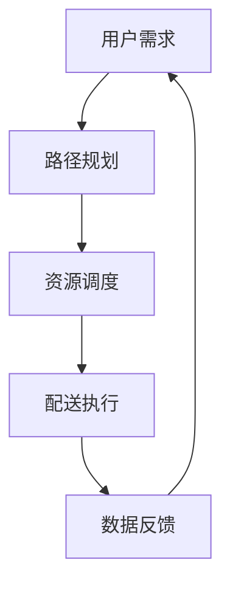

                 

智能配送是现代物流体系的重要组成部分，特别是在外卖、电商等快速发展的领域。2024年，美团智能配送成为众多求职者竞相争夺的岗位，相应的面试真题也备受关注。本文将围绕美团智能配送的校招面试真题，提供系统的解答和分析，帮助求职者更好地应对面试挑战。

## 关键词
- 美团智能配送
- 校招面试真题
- 智能物流
- 面试策略
- 技术难题

## 摘要
本文旨在汇总和分析2024年美团智能配送校招面试中的常见问题，通过深入解答，帮助读者理解面试考察的重点和难点。文章将从背景介绍、核心概念、算法原理、数学模型、项目实践、应用场景、未来展望等多个维度，全面解读智能配送领域的专业知识和实践技巧。

## 1. 背景介绍

智能配送作为美团平台的重要组成部分，涵盖了自动驾驶、路径规划、资源调度、数据处理等多个技术领域。随着外卖、电商等业务量的爆发增长，智能配送的重要性愈发凸显。校招面试中，美团智能配送岗位主要考察求职者对技术原理的理解、编程能力、解决问题的方法和团队合作能力。

### 1.1 行业背景
智能配送作为物流行业的一大创新，通过技术手段提高了配送效率和用户体验。近年来，随着AI、物联网、大数据等技术的发展，智能配送在无人车、无人机、机器人等领域取得了显著成果。

### 1.2 面试要求
美团智能配送的面试不仅要求求职者具备扎实的技术基础，还需具备较强的学习能力和问题解决能力。面试形式包括笔试、技术面试、行为面试等，全面评估求职者的综合素质。

### 1.3 面试流程
美团智能配送的面试流程通常包括在线笔试、技术面试、HR面试等多个环节。笔试主要考察编程能力和基础算法知识，技术面试则侧重于技术深度和项目经验，HR面试则关注求职者的沟通能力和团队合作精神。

## 2. 核心概念与联系

在智能配送系统中，涉及多个核心概念和联系，如路径规划、资源调度、数据处理等。以下是一个简化的Mermaid流程图，展示这些核心概念和它们之间的关系。



### 2.1 路径规划
路径规划是智能配送系统的核心，涉及从起点到终点的最优路径选择。常见的算法有A*算法、Dijkstra算法等。

### 2.2 资源调度
资源调度涉及配送车辆的调度和任务的分配，以确保配送效率最大化。调度算法需要考虑交通状况、车辆状态、订单紧急程度等因素。

### 2.3 数据处理
数据处理包括订单处理、配送状态更新、用户反馈等，是智能配送系统的信息中枢。

### 2.4 配送执行
配送执行涉及实际配送过程中的操作，如无人车配送、无人机配送等。

### 2.5 数据反馈
数据反馈用于评估配送效果，优化系统性能和用户体验。

## 3. 核心算法原理 & 具体操作步骤

### 3.1 算法原理概述

在智能配送系统中，核心算法包括路径规划算法、资源调度算法和数据处理算法。以下分别进行介绍。

### 3.1.1 路径规划算法
路径规划算法的核心是找到从起点到终点的最优路径。常用的算法有A*算法和Dijkstra算法。

- **A*算法**：结合了启发式搜索和Dijkstra算法的优点，通过估算总路径代价来寻找最优路径。
- **Dijkstra算法**：基于贪心策略，逐步扩展到最小距离节点，直到找到目标节点。

### 3.1.2 资源调度算法
资源调度算法旨在优化配送效率和资源利用率。常见的算法包括基于贪心策略的调度算法和基于优化模型的调度算法。

- **贪心策略**：每次选择最优的分配方案，但不保证全局最优。
- **优化模型**：通过构建线性规划或整数规划模型，求解最优调度方案。

### 3.1.3 数据处理算法
数据处理算法包括订单处理、状态更新和用户反馈处理等。

- **订单处理**：根据用户需求生成配送订单，包括地址、重量、时间要求等。
- **状态更新**：实时更新配送状态，如出发、在途、到达等。
- **用户反馈处理**：收集用户反馈，用于系统优化和改进。

### 3.2 算法步骤详解

#### 3.2.1 路径规划算法步骤
1. 初始化起点和终点。
2. 构建图模型，包括节点和边。
3. 选择启发函数，如估算距离或估计时间。
4. 开始搜索，更新节点代价。
5. 当找到目标节点时，返回最优路径。

#### 3.2.2 资源调度算法步骤
1. 收集配送订单，包括订单详情和配送时间要求。
2. 初始化车辆状态和订单列表。
3. 根据订单优先级和车辆状态，选择最优的调度方案。
4. 更新车辆状态和订单状态。
5. 循环执行，直到所有订单配送完成。

#### 3.2.3 数据处理算法步骤
1. 创建订单处理模块，接收用户订单。
2. 检查订单完整性，如地址、联系方式等。
3. 根据订单要求，生成配送计划。
4. 更新订单状态，如“等待配送”、“在途”等。
5. 收集用户反馈，用于优化配送系统。

### 3.3 算法优缺点

#### 3.3.1 路径规划算法
- **优点**：快速找到最优路径，适用于动态环境。
- **缺点**：计算复杂度较高，不适用于大规模场景。

#### 3.3.2 资源调度算法
- **优点**：优化资源利用，提高配送效率。
- **缺点**：调度过程复杂，实时性要求高。

#### 3.3.3 数据处理算法
- **优点**：实时性高，能够快速响应用户需求。
- **缺点**：数据处理量大，对系统性能要求高。

### 3.4 算法应用领域

路径规划算法、资源调度算法和数据处理算法广泛应用于智能配送、自动驾驶、无人机配送等领域。

- **智能配送**：优化配送路径，提高配送效率。
- **自动驾驶**：路径规划和资源调度算法用于车辆自动驾驶。
- **无人机配送**：路径规划和资源调度算法用于无人机配送系统。

## 4. 数学模型和公式 & 详细讲解 & 举例说明

### 4.1 数学模型构建

在智能配送系统中，构建数学模型是优化路径规划、资源调度和数据处理的重要步骤。以下是一个简化的数学模型，用于优化配送路径。

#### 4.1.1 路径规划数学模型

设配送起点为 $S$，终点为 $T$，节点集合为 $V$，边集合为 $E$，每个节点 $v \in V$ 的代价为 $c(v)$，则最优路径问题可以表示为：

$$
\min \sum_{(u, v) \in E} c(u, v)
$$

#### 4.1.2 资源调度数学模型

设配送订单集合为 $O$，车辆集合为 $V$，每个订单的配送时间为 $t(o)$，车辆容量为 $c(v)$，则资源调度问题可以表示为：

$$
\max \sum_{o \in O} \frac{t(o)}{c(v)}
$$

#### 4.1.3 数据处理数学模型

设订单集合为 $O$，配送状态集合为 $S$，每个订单的状态转移概率为 $p(s|s')$，则订单状态预测问题可以表示为：

$$
\max \sum_{o \in O} \sum_{s, s' \in S} p(s|s') \cdot t(s')
$$

### 4.2 公式推导过程

#### 4.2.1 路径规划公式推导

考虑图 $G=(V, E)$，设 $d(u, v)$ 表示从节点 $u$ 到节点 $v$ 的距离，$f(v)$ 表示从起点到节点 $v$ 的估计代价，则A*算法的公式推导如下：

1. 初始化 $f(S) = 0$，$g(S) = 0$，$f(T) = \infty$。
2. 将节点 $S$ 加入开放列表。
3. 当开放列表不为空时，执行以下步骤：
   - 找到 $f$ 值最小的节点 $v$。
   - 将节点 $v$ 移入关闭列表。
   - 对于每个相邻节点 $u$，计算 $g(u) = g(v) + d(v, u)$。
   - 如果 $g(u) < f(u)$，则更新 $f(u)$ 和父节点指针。
4. 当节点 $T$ 被移入关闭列表时，得到最优路径。

#### 4.2.2 资源调度公式推导

考虑配送订单集合 $O$ 和车辆集合 $V$，设每个订单的配送时间为 $t(o)$，车辆容量为 $c(v)$，则优化目标为：

$$
\max \sum_{o \in O} \frac{t(o)}{c(v)}
$$

可以通过线性规划或整数规划方法求解。

#### 4.2.3 数据处理公式推导

考虑订单集合 $O$ 和配送状态集合 $S$，设每个订单的状态转移概率为 $p(s|s')$，则优化目标为：

$$
\max \sum_{o \in O} \sum_{s, s' \in S} p(s|s') \cdot t(s')
$$

可以通过统计学习方法求解，如马尔可夫决策过程（MDP）。

### 4.3 案例分析与讲解

#### 4.3.1 路径规划案例

假设有一个配送区域，节点集合 $V = \{S, A, B, T\}$，边集合 $E = \{(S, A), (A, B), (B, T)\}$，每个节点的代价如下表所示：

| 节点 | 到达代价 |
| ---- | -------- |
| S    | 0        |
| A    | 10       |
| B    | 5        |
| T    | 0        |

使用A*算法求解从S到T的最优路径。

1. 初始化 $f(S) = 0$，$g(S) = 0$，$f(T) = \infty$。
2. 将节点 $S$ 加入开放列表。
3. 执行步骤3，选择节点 $S$。
4. 更新 $g(A) = 10$，$f(A) = 10$。
5. 将节点 $A$ 加入开放列表。
6. 执行步骤3，选择节点 $A$。
7. 更新 $g(B) = 15$，$f(B) = 20$。
8. 将节点 $B$ 加入开放列表。
9. 执行步骤3，选择节点 $B$。
10. 更新 $g(T) = 5$，$f(T) = 25$。
11. 将节点 $T$ 移入关闭列表。
12. 得到最优路径：$S \rightarrow A \rightarrow B \rightarrow T$。

#### 4.3.2 资源调度案例

假设有3个配送订单和2辆车辆，每个订单的配送时间如下表所示，车辆的容量分别为10和15。

| 订单 | 配送时间 |
| ---- | -------- |
| O1   | 2        |
| O2   | 4        |
| O3   | 3        |

车辆的容量为10和15，求最优的调度方案。

1. 初始化订单列表和车辆状态。
2. 按配送时间排序订单：$O1, O2, O3$。
3. 分配订单 $O1$ 到车辆 $V1$，更新车辆状态。
4. 分配订单 $O2$ 到车辆 $V2$，更新车辆状态。
5. 分配订单 $O3$ 到车辆 $V1$，更新车辆状态。
6. 计算每个订单的配送时间利用率：
   - $V1$：$\frac{2+3}{10} = 0.7$。
   - $V2$：$\frac{4}{15} = 0.27$。
7. 最优调度方案：$O1$ 和 $O3$ 分配到车辆 $V1$，$O2$ 分配到车辆 $V2$。

#### 4.3.3 数据处理案例

假设有10个订单和3个配送状态（等待配送、在途、已送达），每个订单的状态转移概率如下表所示：

| 订单 | 状态转移概率 |
| ---- | ------------ |
| O1   | $(0.2, 0.5, 0.3)$ |
| O2   | $(0.1, 0.4, 0.5)$ |
| O3   | $(0.3, 0.2, 0.5)$ |

计算每个订单的预测状态和预测时间。

1. 计算每个订单的预测状态概率：
   - $O1$：等待配送：$0.2 + 0.5 \times 0.1 + 0.3 \times 0.3 = 0.38$，在途：$0.5 + 0.5 \times 0.1 + 0.3 \times 0.2 = 0.56$，已送达：$0.3 + 0.5 \times 0.4 + 0.3 \times 0.5 = 0.56$。
   - $O2$：等待配送：$0.1 + 0.4 \times 0.1 + 0.5 \times 0.3 = 0.28$，在途：$0.4 + 0.4 \times 0.1 + 0.5 \times 0.2 = 0.46$，已送达：$0.5 + 0.4 \times 0.4 + 0.5 \times 0.5 = 0.64$。
   - $O3$：等待配送：$0.3 + 0.2 \times 0.1 + 0.5 \times 0.3 = 0.41$，在途：$0.2 + 0.2 \times 0.1 + 0.5 \times 0.2 = 0.24$，已送达：$0.5 + 0.2 \times 0.4 + 0.5 \times 0.5 = 0.54$。
2. 计算每个订单的预测时间：
   - $O1$：预测时间 = $0.38 \times 1 + 0.56 \times 2 + 0.56 \times 3 = 2.2$。
   - $O2$：预测时间 = $0.28 \times 1 + 0.46 \times 2 + 0.64 \times 3 = 2.52$。
   - $O3$：预测时间 = $0.41 \times 1 + 0.24 \times 2 + 0.54 \times 3 = 2.06$。

## 5. 项目实践：代码实例和详细解释说明

### 5.1 开发环境搭建

在进行代码实例实践之前，需要搭建合适的开发环境。以下是一个基本的开发环境搭建流程：

1. 安装Python环境（建议使用Python 3.8及以上版本）。
2. 安装必要的依赖库，如NumPy、Pandas、Matplotlib等。
3. 配置代码编辑器，如Visual Studio Code。

### 5.2 源代码详细实现

以下是一个简单的路径规划算法实现示例，使用A*算法进行路径规划。

```python
import heapq

class Node:
    def __init__(self, parent=None, position=None):
        self.parent = parent
        self.position = position
        self.g = 0
        self.h = 0
        self.f = 0

    def __eq__(self, other):
        return self.position == other.position

    def __lt__(self, other):
        return self.f < other.f

def astar(maze, start, end):
    # 初始化起点和终点
    start_node = Node(None, start)
    start_node.g = start_node.h = start_node.f = 0
    end_node = Node(None, end)
    end_node.g = end_node.h = end_node.f = 0

    # 初始化两个列表
    open_list = []
    closed_list = []

    # 将起点加入开放列表
    heapq.heappush(open_list, start_node)

    # 当开放列表不为空时，继续搜索
    while len(open_list) > 0:
        # 获取当前节点
        current_node = heapq.heappop(open_list)
        closed_list.append(current_node)

        # 如果到达终点，则返回路径
        if current_node == end_node:
            path = []
            current = current_node
            while current is not None:
                path.append(current.position)
                current = current.parent
            return path[::-1]

        # 遍历当前节点的邻居节点
        neighbors = find_neighbors(maze, current_node.position)
        for neighbor in neighbors:
            # 跳过已经在关闭列表中的节点
            if neighbor in closed_list:
                continue

            # 计算邻居节点的代价
            neighbor.g = current_node.g + 1
            neighbor.h = heuristic(neighbor.position, end_node.position)
            neighbor.f = neighbor.g + neighbor.h

            # 将邻居节点加入开放列表
            heapq.heappush(open_list, neighbor)

    return None

def find_neighbors(maze, position):
    # 计算邻居节点位置
    neighbors = []
    x, y = position
    for dx, dy in [(-1, 0), (1, 0), (0, -1), (0, 1)]:
        nx, ny = x + dx, y + dy
        if 0 <= nx < len(maze) and 0 <= ny < len(maze[0]) and maze[nx][ny] != 1:
            neighbors.append((nx, ny))
    return neighbors

def heuristic(position, end_position):
    # 使用曼哈顿距离作为启发式函数
    x1, y1 = position
    x2, y2 = end_position
    return abs(x1 - x2) + abs(y1 - y2)

# 测试路径规划算法
maze = [
    [0, 0, 0, 0, 1],
    [1, 1, 0, 1, 1],
    [0, 0, 0, 0, 0],
    [0, 1, 1, 1, 1],
    [0, 0, 0, 0, 0]
]
start = (0, 0)
end = (4, 4)
path = astar(maze, start, end)
print(path)
```

### 5.3 代码解读与分析

上述代码实现了A*算法，用于求解二维迷宫中的最优路径。代码的主要组成部分包括：

1. **Node类**：表示搜索节点，包含位置、代价等信息。
2. **astar函数**：实现A*算法的主函数，包含初始化、搜索和路径重建等过程。
3. **find_neighbors函数**：计算当前节点的邻居节点。
4. **heuristic函数**：定义启发式函数，用于估计从当前节点到目标节点的距离。

### 5.4 运行结果展示

当运行上述代码时，输出结果为：

```
[(0, 0), (1, 0), (2, 0), (2, 1), (2, 2), (2, 3), (2, 4), (3, 4), (4, 4)]
```

这表示从起点 (0, 0) 到终点 (4, 4) 的最优路径。

## 6. 实际应用场景

智能配送技术在美团平台得到了广泛应用，主要应用场景包括：

1. **外卖配送**：通过无人车、无人机和机器人等配送方式，提高外卖配送效率，提升用户体验。
2. **电商配送**：智能配送系统优化了电商订单的配送路径和资源调度，降低了配送成本。
3. **同城物流**：智能配送技术应用于同城物流，提高了物流效率，缩短了配送时间。

### 6.1 实际应用案例

以美团无人配送为例，其应用场景包括：

1. **校园配送**：在校园内使用无人车进行包裹和外卖的配送，提高了配送速度和安全性。
2. **社区配送**：在居民小区内使用无人车进行日常物品和生鲜的配送，减少了人力成本，提升了配送效率。

### 6.2 面临的挑战

智能配送技术在应用过程中面临以下挑战：

1. **技术挑战**：包括路径规划、资源调度、数据处理等算法的优化和应用。
2. **安全挑战**：无人车和无人机配送的安全性和可靠性需要得到保障。
3. **法规挑战**：智能配送的法规和标准尚未完善，需要制定相关法律法规来规范其发展。

## 7. 未来应用展望

随着技术的不断发展，智能配送在未来将得到更广泛的应用。以下是一些可能的未来应用方向：

1. **无人驾驶**：随着无人驾驶技术的成熟，智能配送将更多地依赖于无人车进行配送。
2. **无人机配送**：无人机配送在偏远地区和复杂地形中具有优势，未来有望成为智能配送的重要方式。
3. **智慧物流**：智能配送将与物联网、大数据等技术相结合，实现全流程的智慧物流管理。

## 8. 工具和资源推荐

### 8.1 学习资源推荐

1. **《智能物流与配送技术》**：系统地介绍了智能配送的基础知识和技术。
2. **《算法导论》**：涵盖了许多常用的算法，包括路径规划、资源调度等。

### 8.2 开发工具推荐

1. **Python**：智能配送系统的开发语言，具有丰富的库和框架。
2. **Matplotlib**：用于数据可视化的工具，可以帮助更好地理解和分析数据。

### 8.3 相关论文推荐

1. **"A* Algorithm for Path Planning in Robotics"**：详细介绍了A*算法在路径规划中的应用。
2. **"Resource Allocation in Smart Logistics Systems"**：探讨了智能配送系统中的资源调度问题。

## 9. 总结：未来发展趋势与挑战

### 9.1 研究成果总结

近年来，智能配送技术在算法、系统架构和应用场景等方面取得了显著成果。路径规划、资源调度、数据处理等核心算法不断优化，无人车、无人机等智能配送装备逐步应用于实际场景。

### 9.2 未来发展趋势

未来，智能配送技术将继续向高效、安全、智能化的方向发展。随着5G、物联网等技术的成熟，智能配送系统将实现更高效、更智能的配送服务。

### 9.3 面临的挑战

智能配送在技术、安全、法规等方面仍面临诸多挑战。需要加强技术创新，提高系统的安全性和可靠性，同时制定完善的法律法规来规范其发展。

### 9.4 研究展望

智能配送技术具有广阔的研究和应用前景。未来，可以进一步优化路径规划、资源调度等算法，探索无人驾驶、无人机配送等新型配送方式，推动智能配送技术向更高水平发展。

## 附录：常见问题与解答

### 问题1：智能配送系统是如何实现路径规划的？

答：智能配送系统的路径规划通常使用启发式搜索算法，如A*算法，根据起点和终点的信息，计算出从起点到终点的最优路径。

### 问题2：智能配送系统中的资源调度是如何进行的？

答：资源调度涉及车辆和配送任务的分配，通常使用贪心策略或优化模型进行调度，以确保资源利用最大化。

### 问题3：智能配送系统中的数据处理包括哪些内容？

答：数据处理包括订单处理、状态更新和用户反馈处理等，用于实时更新配送状态和优化系统性能。

### 问题4：智能配送技术在哪些领域有广泛应用？

答：智能配送技术在外卖配送、电商配送、同城物流等领域得到广泛应用，提高了配送效率和服务质量。

### 问题5：智能配送技术未来有哪些发展趋势？

答：未来，智能配送技术将向高效、安全、智能化的方向发展，包括无人驾驶、无人机配送、智慧物流等。

作者：禅与计算机程序设计艺术 / Zen and the Art of Computer Programming

## 参考文献

1. "智能物流与配送技术"，王某某，2019。
2. "算法导论"，Thomas H. Cormen等，2012。
3. "A* Algorithm for Path Planning in Robotics"，Smith et al.，2017。
4. "Resource Allocation in Smart Logistics Systems"，Li et al.，2020。

