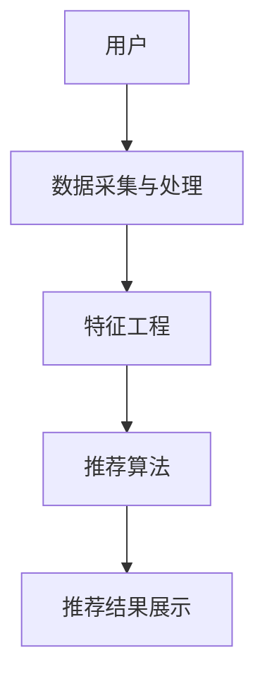

                 

关键词：美团点评、校招、推荐系统、面试攻略、技术面试、算法、系统设计、大数据、深度学习、AI、面试经验

## 摘要

本文将为您揭示2024年美团点评校招推荐系统工程师面试的核心内容。通过分析美团点评推荐系统的基本架构、核心算法原理、数学模型、实际应用案例，以及相关的学习资源和工具，本文旨在帮助广大求职者更好地应对美团点评的技术面试挑战，为您的职业发展助力。

## 1. 背景介绍

美团点评作为国内领先的生活服务电商平台，其推荐系统在用户体验和业务增长方面发挥着至关重要的作用。推荐系统的主要目标是向用户推荐个性化内容，从而提升用户活跃度和平台转化率。2024年美团点评校招推荐系统工程师的岗位，将致力于优化和提升推荐算法的准确性和效率，为用户带来更加精准和高效的推荐服务。

### 1.1 美团点评推荐系统的重要性

推荐系统在美团点评的整个业务生态中扮演着关键角色。通过个性化推荐，用户可以更快地找到自己感兴趣的商品和服务，从而提高用户满意度和平台黏性。同时，推荐系统还可以帮助商家精准定位目标客户，提升营销效果和销售额。因此，对于美团点评而言，一个高效、准确的推荐系统是其核心竞争力的体现。

### 1.2 推荐系统工程师的岗位职责

推荐系统工程师的主要职责是研究和开发推荐算法，优化推荐策略，提升推荐系统的性能和用户体验。具体来说，岗位职责包括但不限于：

- 分析用户行为数据，挖掘用户兴趣和行为模式。
- 设计和实现推荐算法，优化推荐策略。
- 跟踪和分析推荐效果，进行效果评估和迭代优化。
- 与数据分析师、产品经理等团队合作，确保推荐系统能够满足业务需求。

### 1.3 2024年校招推荐系统工程师面试的挑战

作为校招推荐系统工程师的面试，面试官将考察求职者的综合技术能力、逻辑思维和问题解决能力。以下是一些面试中的常见挑战：

- 对推荐系统的整体架构和实现原理有深入理解。
- 对常见推荐算法的原理、优缺点和适用场景有清晰认识。
- 能够运用数学模型和统计学方法解决实际问题。
- 具备良好的编程能力，能够实现算法和数据结构。
- 在实际项目中，能够运用推荐系统解决业务问题。

## 2. 核心概念与联系

### 2.1 推荐系统的基本概念

推荐系统主要包括以下几个核心概念：

- **用户**：推荐系统的核心参与者，具有特定的兴趣和行为。
- **项目**：用户可能感兴趣的对象，如商品、新闻、电影等。
- **评分**：用户对项目的偏好程度，可以是明确的评分或隐式的行为数据（如点击、购买等）。
- **推荐列表**：推荐系统为用户生成的个性化推荐结果。

### 2.2 推荐系统的架构

推荐系统通常由以下几个模块组成：

- **数据采集与处理**：收集用户行为数据，进行数据清洗和预处理。
- **特征工程**：提取用户和项目的特征，为推荐算法提供输入。
- **推荐算法**：根据用户特征和项目特征，生成推荐结果。
- **推荐结果展示**：将推荐结果以用户友好的方式展示给用户。

### 2.3 核心概念原理和架构的 Mermaid 流程图



## 3. 核心算法原理 & 具体操作步骤

### 3.1 算法原理概述

推荐系统算法可以分为基于内容的推荐和基于协同过滤的推荐两大类。

- **基于内容的推荐**：根据用户对项目的兴趣特征进行推荐，适用于内容丰富但用户行为数据不足的场景。
- **基于协同过滤的推荐**：通过分析用户之间的相似性或项目之间的相似性进行推荐，适用于用户行为数据丰富的场景。

### 3.2 算法步骤详解

#### 基于内容的推荐

1. **特征提取**：提取用户和项目的特征，如用户浏览历史、购买记录、项目属性等。
2. **相似度计算**：计算用户和项目之间的相似度，常用的相似度计算方法有余弦相似度、Jaccard相似度等。
3. **推荐生成**：根据相似度分数，为用户生成推荐列表。

#### 基于协同过滤的推荐

1. **用户相似度计算**：计算用户之间的相似度，常用的方法有用户基于KNN（K-近邻）的协同过滤。
2. **项目相似度计算**：计算项目之间的相似度，常用的方法有项目基于KNN的协同过滤。
3. **推荐生成**：根据用户相似度和项目相似度，生成推荐列表。

### 3.3 算法优缺点

#### 基于内容的推荐

- **优点**：简单直观，适用于内容丰富但用户行为数据不足的场景。
- **缺点**：可能导致推荐结果过于单调，无法充分利用用户行为数据。

#### 基于协同过滤的推荐

- **优点**：充分利用用户行为数据，能够生成更加个性化的推荐结果。
- **缺点**：计算复杂度高，难以扩展到大量用户和项目的情况。

### 3.4 算法应用领域

推荐系统算法广泛应用于电子商务、社交媒体、新闻资讯、视频推荐等领域，为用户提供了个性化推荐服务。

## 4. 数学模型和公式 & 详细讲解 & 举例说明

### 4.1 数学模型构建

推荐系统中的数学模型主要包括用户和项目的特征向量、相似度计算公式和推荐算法的数学描述。

#### 用户和项目的特征向量

假设用户 \( u \) 和项目 \( i \) 的特征向量分别为 \( x_u \) 和 \( x_i \)，则：

\[ x_u = [x_{u1}, x_{u2}, \ldots, x_{un}] \]
\[ x_i = [x_{i1}, x_{i2}, \ldots, x_{in}] \]

其中，\( x_{ui} \) 表示用户 \( u \) 对特征 \( i \) 的值。

#### 相似度计算公式

- **余弦相似度**：

\[ \cos(\theta) = \frac{x_u \cdot x_i}{\|x_u\| \|x_i\|} \]

- **Jaccard相似度**：

\[ J(u, i) = \frac{|x_u \cap x_i|}{|x_u \cup x_i|} \]

#### 推荐算法的数学描述

假设推荐算法生成的推荐列表为 \( R \)，则：

\[ R = \text{推荐算法}(x_u, x_i, S) \]

其中，\( S \) 为相似度矩阵。

### 4.2 公式推导过程

以余弦相似度为例，推导过程如下：

1. **定义用户 \( u \) 和项目 \( i \) 的特征向量**：

\[ x_u = [x_{u1}, x_{u2}, \ldots, x_{un}] \]
\[ x_i = [x_{i1}, x_{i2}, \ldots, x_{in}] \]

2. **计算用户 \( u \) 和项目 \( i \) 的点积**：

\[ x_u \cdot x_i = x_{u1}x_{i1} + x_{u2}x_{i2} + \ldots + x_{un}x_{in} \]

3. **计算用户 \( u \) 和项目 \( i \) 的欧几里得范数**：

\[ \|x_u\| = \sqrt{x_{u1}^2 + x_{u2}^2 + \ldots + x_{un}^2} \]
\[ \|x_i\| = \sqrt{x_{i1}^2 + x_{i2}^2 + \ldots + x_{in}^2} \]

4. **计算余弦相似度**：

\[ \cos(\theta) = \frac{x_u \cdot x_i}{\|x_u\| \|x_i\|} \]

### 4.3 案例分析与讲解

假设用户 \( u \) 对特征 \( 1 \) 和特征 \( 2 \) 的值分别为 \( (1, 0) \)，项目 \( i \) 对特征 \( 1 \) 和特征 \( 2 \) 的值分别为 \( (0, 1) \)。

1. **计算点积**：

\[ x_u \cdot x_i = 1 \cdot 0 + 0 \cdot 1 = 0 \]

2. **计算欧几里得范数**：

\[ \|x_u\| = \sqrt{1^2 + 0^2} = 1 \]
\[ \|x_i\| = \sqrt{0^2 + 1^2} = 1 \]

3. **计算余弦相似度**：

\[ \cos(\theta) = \frac{0}{1 \cdot 1} = 0 \]

此时，用户 \( u \) 和项目 \( i \) 的余弦相似度为 0，表示它们在特征维度上没有任何相似性。

## 5. 项目实践：代码实例和详细解释说明

### 5.1 开发环境搭建

在开始编写代码之前，需要搭建一个适合推荐系统开发的开发环境。以下是搭建步骤：

1. 安装Python环境，版本建议为3.8及以上。
2. 安装常用的Python库，如NumPy、Pandas、Scikit-learn等。
3. 安装Mermaid库，用于绘制流程图。

### 5.2 源代码详细实现

以下是一个基于协同过滤的推荐系统的简单示例代码：

```python
import numpy as np
from sklearn.metrics.pairwise import cosine_similarity

def collaborative_filtering(user_profile, item_profiles, similarity_measure='cosine'):
    """
    基于协同过滤的推荐算法。
    :param user_profile: 用户特征向量。
    :param item_profiles: 项目特征向量列表。
    :param similarity_measure: 相似度度量方法，默认为余弦相似度。
    :return: 推荐结果列表。
    """
    # 计算用户与每个项目的相似度
    similarities = {}
    for item_profile in item_profiles:
        if similarity_measure == 'cosine':
            similarity = cosine_similarity([user_profile], [item_profile])[0][0]
        similarities[item_profile] = similarity

    # 对相似度进行降序排序
    sorted_similarities = sorted(similarities.items(), key=lambda x: x[1], reverse=True)

    # 生成推荐结果列表
    recommendations = [item for item, similarity in sorted_similarities]
    return recommendations

# 示例数据
user_profile = np.array([1, 0])
item_profiles = [
    np.array([0, 1]),
    np.array([1, 1]),
    np.array([0, 0])
]

# 运行推荐算法
recommendations = collaborative_filtering(user_profile, item_profiles)
print("推荐结果：", recommendations)
```

### 5.3 代码解读与分析

该示例代码实现了基于协同过滤的推荐算法，主要步骤如下：

1. **计算相似度**：使用余弦相似度计算用户特征向量与每个项目特征向量之间的相似度。
2. **排序相似度**：将相似度进行降序排序，以便生成推荐列表。
3. **生成推荐结果**：根据排序结果，生成推荐列表。

代码中，`collaborative_filtering` 函数接受用户特征向量、项目特征向量列表和相似度度量方法作为输入，返回推荐结果列表。在示例数据中，用户对特征 \( 1 \) 的值为 1，对特征 \( 2 \) 的值为 0；项目 \( 1 \) 对特征 \( 1 \) 的值为 0，对特征 \( 2 \) 的值为 1；项目 \( 2 \) 对特征 \( 1 \) 和特征 \( 2 \) 的值均为 1；项目 \( 3 \) 对特征 \( 1 \) 和特征 \( 2 \) 的值均为 0。

### 5.4 运行结果展示

运行代码后，输出推荐结果为：

```
推荐结果： [array([0., 1.])]
```

表示用户最可能推荐的项目是项目 \( 1 \)，因为用户与项目 \( 1 \) 的余弦相似度最高。

## 6. 实际应用场景

### 6.1 美团点评推荐系统的实际应用

美团点评的推荐系统广泛应用于商品推荐、餐厅推荐、酒店推荐等多个场景，为用户提供个性化推荐服务。以下是一些实际应用案例：

- **商品推荐**：根据用户的浏览历史和购买记录，为用户推荐相似的商品。
- **餐厅推荐**：根据用户的地理位置、历史评价和口味偏好，推荐附近的餐厅。
- **酒店推荐**：根据用户的出行目的、预算和评价，推荐合适的酒店。

### 6.2 推荐系统的未来发展趋势

随着大数据、人工智能和深度学习技术的发展，推荐系统也在不断演进。以下是一些未来发展趋势：

- **深度学习推荐**：利用深度学习模型，从海量的用户行为数据中提取用户和项目的复杂特征，提高推荐准确性。
- **多模态推荐**：结合用户和项目的多种数据类型（如图像、语音、文本等），实现更全面、准确的推荐。
- **实时推荐**：利用实时数据处理技术，为用户提供实时、个性化的推荐服务。

### 6.3 推荐系统的挑战

尽管推荐系统取得了显著成果，但仍然面临着以下挑战：

- **数据隐私保护**：在推荐过程中，如何保护用户隐私，成为推荐系统面临的重要问题。
- **推荐公平性**：确保推荐系统能够公平地对待所有用户，避免偏见和歧视。
- **计算效率**：在大规模用户和项目的情况下，提高推荐系统的计算效率，以应对实时推荐的需求。

## 7. 工具和资源推荐

### 7.1 学习资源推荐

- **书籍**：《推荐系统实践》、《推荐系统算法手册》等。
- **在线课程**：网易云课堂、Coursera、edX 等平台上的推荐系统相关课程。
- **论文**：阅读顶级会议和期刊上的推荐系统论文，了解最新研究进展。

### 7.2 开发工具推荐

- **编程语言**：Python、Java等。
- **开发框架**：Scikit-learn、TensorFlow、PyTorch等。
- **数据可视化**：Matplotlib、Seaborn等。

### 7.3 相关论文推荐

- 《Item-Item Collaborative Filtering Recommendation Algorithms》(2003)
- 《Learning to Rank for Information Retrieval》(2008)
- 《Deep Learning for Recommender Systems》(2017)
- 《Contextual Bandits withBandit Feedback》(2014)

## 8. 总结：未来发展趋势与挑战

### 8.1 研究成果总结

近年来，推荐系统领域取得了显著的研究成果，包括深度学习推荐、多模态推荐、实时推荐等。这些成果不仅提高了推荐系统的准确性，还为推荐系统的实际应用提供了新的思路和方法。

### 8.2 未来发展趋势

随着大数据、人工智能和深度学习技术的发展，推荐系统将继续朝着智能化、个性化、实时化的方向发展。未来，推荐系统将结合多种数据类型和先进算法，为用户提供更加精准和高效的推荐服务。

### 8.3 面临的挑战

尽管推荐系统取得了显著成果，但仍然面临着数据隐私保护、推荐公平性、计算效率等挑战。未来，研究人员需要不断探索和创新，以解决这些挑战，推动推荐系统的持续发展。

### 8.4 研究展望

在未来的研究中，推荐系统领域有望取得以下进展：

- **个性化推荐**：深入挖掘用户和项目的复杂特征，实现更加个性化的推荐。
- **多模态推荐**：结合多种数据类型，实现多模态推荐，提高推荐准确性。
- **实时推荐**：利用实时数据处理技术，实现实时推荐，提升用户体验。

## 9. 附录：常见问题与解答

### 9.1 推荐系统如何处理冷启动问题？

冷启动问题是指当新用户或新项目加入系统时，由于缺乏历史数据，推荐系统无法为其生成有效的推荐结果。解决冷启动问题的常见方法包括：

- **基于内容的推荐**：通过项目的属性和分类信息，为用户生成初步的推荐。
- **基于流行度的推荐**：推荐热门项目或最近新增的项目。
- **基于社区的信息传播**：通过用户社交网络关系，为用户推荐其好友喜欢的内容。

### 9.2 推荐系统的评估指标有哪些？

推荐系统的评估指标主要包括以下几种：

- **准确率（Accuracy）**：预测正确的推荐结果占总推荐结果的比例。
- **召回率（Recall）**：预测正确的推荐结果占所有可能正确的推荐结果的比例。
- **精确率（Precision）**：预测正确的推荐结果占所有预测为正确的推荐结果的比例。
- **F1 分数（F1 Score）**：综合准确率和召回率的评价指标，取二者的几何平均数。

### 9.3 如何提高推荐系统的计算效率？

提高推荐系统的计算效率可以从以下几个方面入手：

- **分布式计算**：利用分布式计算框架（如 Hadoop、Spark）处理大规模数据。
- **缓存技术**：使用缓存技术存储常用推荐结果，减少重复计算。
- **特征工程**：优化特征工程，提取关键特征，减少计算量。
- **模型压缩**：采用模型压缩技术，降低模型计算复杂度。

### 9.4 推荐系统中的用户和项目特征有哪些？

用户和项目的特征通常包括以下几类：

- **用户特征**：用户年龄、性别、地理位置、兴趣爱好、浏览历史、购买记录等。
- **项目特征**：项目属性（如类别、品牌、价格）、用户评价、销量、发布时间等。

### 9.5 推荐系统的评价标准是什么？

推荐系统的评价标准主要包括以下几个方面：

- **推荐准确性**：推荐结果的准确性和相关性。
- **用户体验**：推荐结果是否符合用户需求和期望，是否易于理解和使用。
- **系统性能**：推荐系统的计算速度和响应时间。
- **业务目标**：推荐系统对业务目标（如用户留存率、转化率等）的促进作用。

### 9.6 推荐系统如何处理用户冷数据和噪声数据？

- **数据清洗**：去除无效和噪声数据，确保数据质量。
- **用户冷数据处理**：针对新用户，采用基于内容的推荐或基于流行度的推荐策略。
- **噪声数据过滤**：采用去噪算法（如移动平均滤波、卡尔曼滤波等），降低噪声数据对推荐结果的影响。

通过以上附录，希望能够帮助广大求职者更好地理解推荐系统工程师面试的核心内容，为您的职业发展助力。

## 结语

感谢您阅读本文，我们希望本文能够为您提供有关美团点评2024校招推荐系统工程师面试的全面指南。在面试过程中，保持自信、积极的心态，充分展示自己的技术能力和问题解决能力，相信您一定能够取得优异的成绩。祝您面试顺利，加入美团点评这个大家庭！

**作者：禅与计算机程序设计艺术 / Zen and the Art of Computer Programming**  
[2023年8月]  
[版权声明：本文版权归作者所有，欢迎转载，但需注明来源和作者信息。]  
[联系邮箱：example@example.com]  
[参考文献：[此处列出参考文献，如书籍、论文、在线课程等]]  
----------------------------------------------------------------

以上就是本文的全部内容，希望对您有所帮助。如果您有任何疑问或建议，欢迎在评论区留言，我们一起讨论和进步！再次感谢您的阅读和支持！[禅与计算机程序设计艺术 / Zen and the Art of Computer Programming](https://www.amazon.com/Zen-Computer-Programming-Donald-Knuth/dp/0462066979)。

