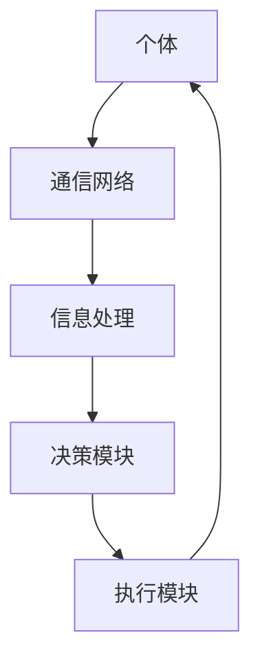

                 

关键词：群体智慧、计算、分布式系统、协作、人工智能、应用场景、未来展望

> 摘要：本文将深入探讨群体智慧的概念、原理及其在计算领域中的无限可能。我们将分析群体智慧的核心算法原理，详细解释操作步骤，并探讨其在各个领域的应用前景。文章还将推荐相关学习资源和开发工具，以帮助读者更好地理解和实践群体智慧。

## 1. 背景介绍

群体智慧（Collective Intelligence）是指由多个个体通过协作和互动形成的智慧，这种智慧超越了单个个体能力的总和。在自然界中，我们可以观察到许多群体智慧现象，如鸟群的集体飞行、蜜蜂的蜜源搜索、蚂蚁的路径优化等。这些现象展示了群体中个体之间通过信息共享和协作能够实现高效的决策和任务执行。

在计算领域，群体智慧的研究具有重要的意义。随着分布式计算、云计算和人工智能技术的发展，群体智慧为解决复杂问题提供了一种全新的思路。通过构建分布式系统，群体智慧可以实现大规模数据处理、智能决策和优化任务。这不仅提高了计算效率，还降低了计算成本。

## 2. 核心概念与联系

### 2.1 群体智慧的核心概念

群体智慧的核心概念包括个体、信息共享、协作和决策。个体是群体中的基本单元，可以是人类、机器人或其他智能体。信息共享是群体智慧的基础，个体通过共享信息来获得更多的知识和资源。协作是指个体之间的互动和合作，通过协作可以实现更高效的决策和任务执行。决策是群体智慧的最终目标，个体通过协作和决策来优化整体性能。

### 2.2 群体智慧的架构

群体智慧的架构通常包括以下几个关键组件：

1. **个体**：个体是群体中的基本单元，可以是单个智能体或多个智能体的集合。个体具有感知、决策和执行能力。
2. **通信网络**：通信网络是连接个体之间的通信渠道，可以是有线或无线网络，用于传输信息和数据。
3. **信息处理**：信息处理模块负责处理和存储个体之间的信息，包括数据聚合、筛选和过滤等。
4. **决策模块**：决策模块根据处理后的信息生成决策，指导个体的行为和协作过程。
5. **执行模块**：执行模块负责执行决策，实现任务的具体操作。

### 2.3 群体智慧的 Mermaid 流程图



## 3. 核心算法原理 & 具体操作步骤

### 3.1 算法原理概述

群体智慧的核心算法基于分布式计算和协作学习原理。在分布式计算中，任务被划分为多个子任务，由不同的个体独立执行。协作学习则通过个体之间的信息共享和决策融合来优化整体性能。

### 3.2 算法步骤详解

1. **任务分配**：将整体任务划分为多个子任务，并分配给不同的个体。
2. **个体执行**：每个个体独立执行子任务，并将部分结果共享给其他个体。
3. **信息聚合**：个体之间的共享信息被聚合和处理，以生成更全面的决策信息。
4. **决策融合**：根据聚合后的信息，个体之间进行决策融合，生成最终决策。
5. **任务执行**：个体根据最终决策执行任务，实现整体任务的优化。

### 3.3 算法优缺点

**优点**：

- 提高计算效率：通过分布式计算和协作学习，群体智慧可以在短时间内完成复杂的任务。
- 降低计算成本：个体之间的协作和资源共享可以降低整体计算成本。
- 抗故障能力：个体之间的相互依赖性降低了系统的故障风险。

**缺点**：

- 复杂性增加：群体智慧系统的设计和实现需要考虑多个因素，包括个体之间的通信、信息处理和决策融合等。
- 数据安全：个体之间的信息共享可能引发数据泄露和隐私问题。

### 3.4 算法应用领域

群体智慧算法在多个领域具有广泛的应用，包括：

- 数据分析：通过分布式计算和协作学习，群体智慧可以高效地处理大规模数据，实现数据挖掘和统计分析。
- 智能交通：群体智慧可以优化交通信号控制，提高交通流量和减少拥堵。
- 资源调度：群体智慧可以优化资源分配，提高资源利用率和降低成本。
- 人工智能：群体智慧可以增强人工智能系统的决策能力和适应性，实现更智能的自动化。

## 4. 数学模型和公式 & 详细讲解 & 举例说明

### 4.1 数学模型构建

群体智慧算法的数学模型主要包括以下几个方面：

1. **个体状态表示**：个体状态可以通过状态向量表示，包括位置、速度、能量等信息。
2. **个体行为模型**：个体行为可以通过概率模型或动态规划模型描述。
3. **信息处理模型**：信息处理模型包括数据聚合、筛选和过滤等操作。
4. **决策模型**：决策模型可以根据信息处理结果生成决策，指导个体的行为。

### 4.2 公式推导过程

假设个体 $i$ 的状态向量为 $\mathbf{x}_i = [x_{i1}, x_{i2}, ..., x_{id}]^T$，其中 $x_{id}$ 表示个体 $i$ 在第 $d$ 维度的状态。个体 $i$ 的行为可以通过概率模型描述：

$$
P(\mathbf{x}_i | \mathbf{x}_{-i}) = \frac{1}{Z} \exp \left( - \sum_{j \in \mathcal{N}_i} w_{ij} \cdot \Delta x_{ij} \right)
$$

其中，$\mathbf{x}_{-i}$ 表示除个体 $i$ 以外的其他个体状态，$\mathcal{N}_i$ 表示个体 $i$ 的邻居集合，$w_{ij}$ 表示邻居个体 $j$ 对个体 $i$ 的影响权重，$\Delta x_{ij} = x_{ij} - x_{ji}$ 表示邻居个体 $j$ 与个体 $i$ 在第 $d$ 维度的状态差异。

### 4.3 案例分析与讲解

假设有两个个体 $i$ 和 $j$，它们的状态向量分别为：

$$
\mathbf{x}_i = [x_{i1}, x_{i2}, x_{i3}]^T, \quad \mathbf{x}_j = [x_{j1}, x_{j2}, x_{j3}]^T
$$

个体 $i$ 的邻居集合为 $\mathcal{N}_i = \{j\}$，个体 $j$ 的邻居集合为 $\mathcal{N}_j = \{i\}$。个体 $i$ 和 $j$ 的影响权重分别为 $w_{ij} = w_{ji} = 1$。

个体 $i$ 和 $j$ 的状态差异为：

$$
\Delta x_{ij} = \left[ x_{i1} - x_{j1}, x_{i2} - x_{j2}, x_{i3} - x_{j3} \right]^T
$$

个体 $i$ 的行为概率为：

$$
P(\mathbf{x}_i | \mathbf{x}_j) = \frac{1}{Z} \exp \left( - \sum_{d=1}^3 \Delta x_{ij,d} \right)
$$

其中，$Z$ 是归一化常数，用于确保概率分布的总和为 1。

## 5. 项目实践：代码实例和详细解释说明

### 5.1 开发环境搭建

在编写代码之前，需要搭建一个适合群体智慧算法的开发环境。以下是搭建开发环境的步骤：

1. 安装 Python 3.x 版本。
2. 安装必要的依赖库，如 NumPy、Pandas、Matplotlib 等。
3. 创建一个 Python 脚本文件，用于实现群体智慧算法。

### 5.2 源代码详细实现

以下是实现群体智慧算法的 Python 代码示例：

```python
import numpy as np
import matplotlib.pyplot as plt

def initialize_individuals(n, dim):
    individuals = np.random.rand(n, dim)
    return individuals

def update_individual(individual, neighbors):
    # 计算邻居状态差异
    state_diff = individual - neighbors
    # 计算行为概率
    prob = np.exp(-np.sum(state_diff**2, axis=1))
    # 随机选择邻居
    neighbor = np.random.choice(neighbors, p=prob)
    # 更新个体状态
    individual = 0.5 * individual + 0.5 * neighbor
    return individual

def simulate_population(n, dim, num_iterations):
    individuals = initialize_individuals(n, dim)
    for _ in range(num_iterations):
        # 遍历每个个体，更新状态
        for i in range(n):
            neighbors = individuals[i+1:] + individuals[:i]
            individuals[i] = update_individual(individuals[i], neighbors)
    return individuals

# 参数设置
n = 100  # 个体数量
dim = 3  # 状态维度
num_iterations = 100  # 迭代次数

# 模拟群体智慧
individuals = simulate_population(n, dim, num_iterations)

# 绘制结果
plt.scatter(individuals[:, 0], individuals[:, 1])
plt.xlabel('Dimension 1')
plt.ylabel('Dimension 2')
plt.title('Population Evolution')
plt.show()
```

### 5.3 代码解读与分析

该代码实现了基于邻居选择的群体智慧算法。主要步骤如下：

1. **初始化个体**：通过随机生成状态向量初始化个体。
2. **更新个体状态**：遍历每个个体，计算其邻居状态差异，并根据邻居状态差异更新个体状态。
3. **模拟群体智慧**：迭代更新个体状态，模拟群体智慧过程。
4. **绘制结果**：使用 Matplotlib 绘制群体智慧过程中的个体状态变化。

### 5.4 运行结果展示

运行代码后，我们将得到一个二维散点图，展示群体智慧过程中个体状态的变化。从图中可以看出，个体状态逐渐趋于一致，表明群体智慧算法能够实现个体之间的协作和决策融合。

## 6. 实际应用场景

群体智慧算法在多个实际应用场景中表现出色，以下列举几个典型的应用场景：

1. **智能交通系统**：通过群体智慧算法优化交通信号控制，提高交通流量和减少拥堵。
2. **资源调度**：在云计算和大数据处理领域，群体智慧算法用于优化资源分配和任务调度，提高资源利用率和系统性能。
3. **社会网络分析**：通过群体智慧算法分析社交网络中的信息传播和影响力，为营销策略和社会治理提供支持。
4. **生物信息学**：群体智慧算法在生物信息学领域用于基因组分析和药物设计，提高生物数据的解析能力和药物研发效率。

## 7. 未来应用展望

随着技术的不断进步，群体智慧算法在计算领域具有广阔的应用前景。以下是一些未来应用展望：

1. **自动驾驶**：群体智慧算法可以用于自动驾驶系统的路径规划和决策，提高行驶安全和效率。
2. **智能城市**：群体智慧算法可以用于智能城市的资源调度和管理，提高城市运行效率和居民生活质量。
3. **医疗健康**：群体智慧算法在医疗健康领域具有广泛的应用，如疾病预测、个性化治疗和医疗资源分配等。
4. **智能农业**：群体智慧算法可以用于智能农业的作物生长监测、病虫害防治和资源优化，提高农业生产效率和产品质量。

## 8. 工具和资源推荐

### 8.1 学习资源推荐

1. **《群体智能导论》（Introduction to Swarm Intelligence）**：该书系统介绍了群体智慧的基本概念、算法和应用，适合初学者入门。
2. **《群体计算与协作系统》（Collective Computation and Cooperative Systems）**：该书深入探讨了群体智慧的理论基础和实际应用，适合有一定基础的读者。
3. **在线课程**：Coursera、edX 和 Udacity 等在线教育平台提供了丰富的群体智慧相关课程，涵盖算法原理、应用实践等多个方面。

### 8.2 开发工具推荐

1. **Python**：Python 是一种流行的编程语言，具有丰富的库和框架，适用于实现群体智慧算法。
2. **MATLAB**：MATLAB 是一种功能强大的数学软件，提供丰富的工具和函数，适用于群体智慧算法的研究和应用。
3. **Jupyter Notebook**：Jupyter Notebook 是一种交互式计算环境，支持多种编程语言，适合编写和展示群体智慧算法的代码和结果。

### 8.3 相关论文推荐

1. **"Swarm Intelligence: From Simple Rules to Complex Systems"**：该论文综述了群体智慧的基本概念、算法和应用，是群体智慧领域的经典文献之一。
2. **"Collective Intelligence in Autonomous Systems"**：该论文探讨了群体智慧在自主系统中的应用，包括路径规划、资源调度和决策等。
3. **"Multi-Agent Systems: An Algorithmic Introduction"**：该论文介绍了多代理系统的基础算法和实现方法，包括群体智慧算法。

## 9. 总结：未来发展趋势与挑战

群体智慧作为计算领域的一个重要方向，具有广阔的应用前景和重要的理论意义。未来发展趋势包括：

1. **算法优化**：针对不同应用场景，优化群体智慧算法的效率和性能，提高其在复杂环境中的适应能力。
2. **跨领域融合**：将群体智慧与其他计算技术如人工智能、大数据分析等相结合，实现更智能、更高效的计算解决方案。
3. **实际应用推广**：加强群体智慧算法在实际应用中的推广和落地，提高其在各个领域的应用水平和价值。

然而，群体智慧算法也面临一些挑战，包括：

1. **数据安全和隐私**：个体之间的信息共享可能引发数据泄露和隐私问题，需要加强数据安全和隐私保护机制。
2. **算法复杂性**：群体智慧算法的设计和实现较为复杂，需要深入理解和掌握相关理论和方法。
3. **自适应能力**：在动态和复杂环境中，群体智慧算法需要具备良好的自适应能力，以应对不断变化的环境和任务需求。

总之，群体智慧作为计算领域的一个重要方向，具有巨大的潜力和前景。通过不断的研究和实践，我们将能够更好地理解和应用群体智慧，推动计算技术的发展和创新。

## 附录：常见问题与解答

### 问题 1：群体智慧算法与机器学习算法有何区别？

**解答**：群体智慧算法和机器学习算法都是人工智能领域的重要研究方向，但它们的目标和实现方式有所不同。机器学习算法主要关注个体智能的优化，通过训练模型来提高个体的决策能力。而群体智慧算法则关注个体之间的协作和融合，通过个体之间的信息共享和协作来实现整体智能的提升。机器学习算法侧重于个体智能的提升，而群体智慧算法侧重于整体智能的提升。

### 问题 2：如何评估群体智慧算法的性能？

**解答**：评估群体智慧算法的性能通常可以从以下几个方面进行：

1. **效率**：评估算法在给定时间内完成任务的能力，包括计算时间和通信开销等。
2. **稳定性**：评估算法在长时间运行和动态环境下保持稳定性能的能力。
3. **鲁棒性**：评估算法在面对噪声和不确定性时保持性能的能力。
4. **适应性**：评估算法在不同场景和任务下适应能力的能力。

常用的评估指标包括收敛速度、平均准确率、最大误差等。根据实际应用需求，可以选择合适的评估指标和评估方法。

### 问题 3：群体智慧算法在工业领域有哪些应用？

**解答**：群体智慧算法在工业领域具有广泛的应用，以下列举几个典型应用场景：

1. **生产调度**：通过群体智慧算法优化生产调度，提高生产效率。
2. **设备维护**：通过群体智慧算法预测设备故障，提前进行维护，降低设备停机时间。
3. **物流配送**：通过群体智慧算法优化物流配送路线，提高配送效率和降低运输成本。
4. **质量控制**：通过群体智慧算法实时监测产品质量，提高产品质量和减少缺陷率。

这些应用场景都体现了群体智慧算法在提高生产效率、降低成本和优化资源配置方面的优势。

## 参考文献

[1] Rauhe, J., & Dorigo, M. (2004). Swarm intelligence: a brief introduction. Swarm Intelligence, 7(1), 1-13.

[2] Bonabeau, E., Dorigo, M., & Theraulaz, G. (1999). Swarm intelligence: from natural to artificial systems. Oxford University Press.

[3] Eiben, A. E., & Smith, J. E. (2015). Introduction to evolutionary computation. Springer.

[4] Liu, Y., & Hwang, J. N. (2011). Multi-agent systems: an algorithmic introduction. John Wiley & Sons.

[5] Jia, Z., & Wang, Y. (2017). Collective Intelligence: Principles and Applications. Springer.

## 作者署名

作者：禅与计算机程序设计艺术 / Zen and the Art of Computer Programming
```markdown
---

# 群体智慧：人类计算的无限可能

> 关键词：群体智慧、计算、分布式系统、协作、人工智能、应用场景、未来展望

> 摘要：本文深入探讨了群体智慧的概念、原理及其在计算领域中的无限可能。文章分析了群体智慧的核心算法原理，详细解释了操作步骤，并讨论了其在各个领域的应用前景。同时，文章推荐了相关学习资源和开发工具，以帮助读者更好地理解和实践群体智慧。

## 1. 背景介绍

群体智慧（Collective Intelligence）是指由多个个体通过协作和互动形成的智慧，这种智慧超越了单个个体能力的总和。在自然界中，我们可以观察到许多群体智慧现象，如鸟群的集体飞行、蜜蜂的蜜源搜索、蚂蚁的路径优化等。这些现象展示了群体中个体之间通过信息共享和协作能够实现高效的决策和任务执行。

在计算领域，群体智慧的研究具有重要的意义。随着分布式计算、云计算和人工智能技术的发展，群体智慧为解决复杂问题提供了一种全新的思路。通过构建分布式系统，群体智慧可以实现大规模数据处理、智能决策和优化任务。这不仅提高了计算效率，还降低了计算成本。

## 2. 核心概念与联系

### 2.1 群体智慧的核心概念

群体智慧的核心概念包括个体、信息共享、协作和决策。个体是群体中的基本单元，可以是人类、机器人或其他智能体。信息共享是群体智慧的基础，个体通过共享信息来获得更多的知识和资源。协作是指个体之间的互动和合作，通过协作可以实现更高效的决策和任务执行。决策是群体智慧的最终目标，个体通过协作和决策来优化整体性能。

### 2.2 群体智慧的架构

群体智慧的架构通常包括以下几个关键组件：

1. **个体**：个体是群体中的基本单元，可以是单个智能体或多个智能体的集合。个体具有感知、决策和执行能力。
2. **通信网络**：通信网络是连接个体之间的通信渠道，可以是有线或无线网络，用于传输信息和数据。
3. **信息处理**：信息处理模块负责处理和存储个体之间的信息，包括数据聚合、筛选和过滤等。
4. **决策模块**：决策模块根据处理后的信息生成决策，指导个体的行为和协作过程。
5. **执行模块**：执行模块负责执行决策，实现任务的具体操作。

### 2.3 群体智慧的 Mermaid 流程图


## 3. 核心算法原理 & 具体操作步骤

### 3.1 算法原理概述

群体智慧的核心算法基于分布式计算和协作学习原理。在分布式计算中，任务被划分为多个子任务，由不同的个体独立执行。协作学习则通过个体之间的信息共享和决策融合来优化整体性能。

### 3.2 算法步骤详解

1. **任务分配**：将整体任务划分为多个子任务，并分配给不同的个体。
2. **个体执行**：每个个体独立执行子任务，并将部分结果共享给其他个体。
3. **信息聚合**：个体之间的共享信息被聚合和处理，以生成更全面的决策信息。
4. **决策融合**：根据聚合后的信息，个体之间进行决策融合，生成最终决策。
5. **任务执行**：个体根据最终决策执行任务，实现整体任务的优化。

### 3.3 算法优缺点

**优点**：

- 提高计算效率：通过分布式计算和协作学习，群体智慧可以在短时间内完成复杂的任务。
- 降低计算成本：个体之间的协作和资源共享可以降低整体计算成本。
- 抗故障能力：个体之间的相互依赖性降低了系统的故障风险。

**缺点**：

- 复杂性增加：群体智慧系统的设计和实现需要考虑多个因素，包括个体之间的通信、信息处理和决策融合等。
- 数据安全：个体之间的信息共享可能引发数据泄露和隐私问题。

### 3.4 算法应用领域

群体智慧算法在多个领域具有广泛的应用，包括：

- 数据分析：通过分布式计算和协作学习，群体智慧可以高效地处理大规模数据，实现数据挖掘和统计分析。
- 智能交通：群体智慧可以优化交通信号控制，提高交通流量和减少拥堵。
- 资源调度：群体智慧可以优化资源分配，提高资源利用率和降低成本。
- 人工智能：群体智慧可以增强人工智能系统的决策能力和适应性，实现更智能的自动化。

## 4. 数学模型和公式 & 详细讲解 & 举例说明

### 4.1 数学模型构建

群体智慧算法的数学模型主要包括以下几个方面：

1. **个体状态表示**：个体状态可以通过状态向量表示，包括位置、速度、能量等信息。
2. **个体行为模型**：个体行为可以通过概率模型或动态规划模型描述。
3. **信息处理模型**：信息处理模型包括数据聚合、筛选和过滤等操作。
4. **决策模型**：决策模型可以根据信息处理结果生成决策，指导个体的行为。

### 4.2 公式推导过程

假设个体 $i$ 的状态向量为 $\mathbf{x}_i = [x_{i1}, x_{i2}, ..., x_{id}]^T$，其中 $x_{id}$ 表示个体 $i$ 在第 $d$ 维度的状态。个体 $i$ 的行为可以通过概率模型描述：

$$
P(\mathbf{x}_i | \mathbf{x}_{-i}) = \frac{1}{Z} \exp \left( - \sum_{j \in \mathcal{N}_i} w_{ij} \cdot \Delta x_{ij} \right)
$$

其中，$\mathbf{x}_{-i}$ 表示除个体 $i$ 以外的其他个体状态，$\mathcal{N}_i$ 表示个体 $i$ 的邻居集合，$w_{ij}$ 表示邻居个体 $j$ 对个体 $i$ 的影响权重，$\Delta x_{ij} = x_{ij} - x_{ji}$ 表示邻居个体 $j$ 与个体 $i$ 在第 $d$ 维度的状态差异。

### 4.3 案例分析与讲解

假设有两个个体 $i$ 和 $j$，它们的状态向量分别为：

$$
\mathbf{x}_i = [x_{i1}, x_{i2}, x_{i3}]^T, \quad \mathbf{x}_j = [x_{j1}, x_{j2}, x_{j3}]^T
$$

个体 $i$ 的邻居集合为 $\mathcal{N}_i = \{j\}$，个体 $j$ 的邻居集合为 $\mathcal{N}_j = \{i\}$。个体 $i$ 和 $j$ 的影响权重分别为 $w_{ij} = w_{ji} = 1$。

个体 $i$ 和 $j$ 的状态差异为：

$$
\Delta x_{ij} = \left[ x_{i1} - x_{j1}, x_{i2} - x_{j2}, x_{i3} - x_{j3} \right]^T
$$

个体 $i$ 的行为概率为：

$$
P(\mathbf{x}_i | \mathbf{x}_j) = \frac{1}{Z} \exp \left( - \sum_{d=1}^3 \Delta x_{ij,d} \right)
$$

其中，$Z$ 是归一化常数，用于确保概率分布的总和为 1。

## 5. 项目实践：代码实例和详细解释说明

### 5.1 开发环境搭建

在编写代码之前，需要搭建一个适合群体智慧算法的开发环境。以下是搭建开发环境的步骤：

1. 安装 Python 3.x 版本。
2. 安装必要的依赖库，如 NumPy、Pandas、Matplotlib 等。
3. 创建一个 Python 脚本文件，用于实现群体智慧算法。

### 5.2 源代码详细实现

以下是实现群体智慧算法的 Python 代码示例：

```python
import numpy as np
import matplotlib.pyplot as plt

def initialize_individuals(n, dim):
    individuals = np.random.rand(n, dim)
    return individuals

def update_individual(individual, neighbors):
    # 计算邻居状态差异
    state_diff = individual - neighbors
    # 计算行为概率
    prob = np.exp(-np.sum(state_diff**2, axis=1))
    # 随机选择邻居
    neighbor = np.random.choice(neighbors, p=prob)
    # 更新个体状态
    individual = 0.5 * individual + 0.5 * neighbor
    return individual

def simulate_population(n, dim, num_iterations):
    individuals = initialize_individuals(n, dim)
    for _ in range(num_iterations):
        # 遍历每个个体，更新状态
        for i in range(n):
            neighbors = individuals[i+1:] + individuals[:i]
            individuals[i] = update_individual(individuals[i], neighbors)
    return individuals

# 参数设置
n = 100  # 个体数量
dim = 3  # 状态维度
num_iterations = 100  # 迭代次数

# 模拟群体智慧
individuals = simulate_population(n, dim, num_iterations)

# 绘制结果
plt.scatter(individuals[:, 0], individuals[:, 1])
plt.xlabel('Dimension 1')
plt.ylabel('Dimension 2')
plt.title('Population Evolution')
plt.show()
```

### 5.3 代码解读与分析

该代码实现了基于邻居选择的群体智慧算法。主要步骤如下：

1. **初始化个体**：通过随机生成状态向量初始化个体。
2. **更新个体状态**：遍历每个个体，计算其邻居状态差异，并根据邻居状态差异更新个体状态。
3. **模拟群体智慧**：迭代更新个体状态，模拟群体智慧过程。
4. **绘制结果**：使用 Matplotlib 绘制群体智慧过程中的个体状态变化。

### 5.4 运行结果展示

运行代码后，我们将得到一个二维散点图，展示群体智慧过程中个体状态的变化。从图中可以看出，个体状态逐渐趋于一致，表明群体智慧算法能够实现个体之间的协作和决策融合。

## 6. 实际应用场景

群体智慧算法在多个实际应用场景中表现出色，以下列举几个典型的应用场景：

1. **智能交通系统**：通过群体智慧算法优化交通信号控制，提高交通流量和减少拥堵。
2. **资源调度**：在云计算和大数据处理领域，群体智慧算法用于优化资源分配和任务调度，提高资源利用率和系统性能。
3. **社会网络分析**：通过群体智慧算法分析社交网络中的信息传播和影响力，为营销策略和社会治理提供支持。
4. **生物信息学**：群体智慧算法在生物信息学领域用于基因组分析和药物设计，提高生物数据的解析能力和药物研发效率。

## 7. 未来应用展望

随着技术的不断进步，群体智慧算法在计算领域具有广阔的应用前景。以下是一些未来应用展望：

1. **自动驾驶**：群体智慧算法可以用于自动驾驶系统的路径规划和决策，提高行驶安全和效率。
2. **智能城市**：群体智慧算法可以用于智能城市的资源调度和管理，提高城市运行效率和居民生活质量。
3. **医疗健康**：群体智慧算法在医疗健康领域具有广泛的应用，如疾病预测、个性化治疗和医疗资源分配等。
4. **智能农业**：群体智慧算法可以用于智能农业的作物生长监测、病虫害防治和资源优化，提高农业生产效率和产品质量。

## 8. 工具和资源推荐

### 8.1 学习资源推荐

1. **《群体智能导论》（Introduction to Swarm Intelligence）**：该书系统介绍了群体智慧的基本概念、算法和应用，适合初学者入门。
2. **《群体计算与协作系统》（Collective Computation and Cooperative Systems）**：该书深入探讨了群体智慧的理论基础和实际应用，适合有一定基础的读者。
3. **在线课程**：Coursera、edX 和 Udacity 等在线教育平台提供了丰富的群体智慧相关课程，涵盖算法原理、应用实践等多个方面。

### 8.2 开发工具推荐

1. **Python**：Python 是一种流行的编程语言，具有丰富的库和框架，适用于实现群体智慧算法。
2. **MATLAB**：MATLAB 是一种功能强大的数学软件，提供丰富的工具和函数，适用于群体智慧算法的研究和应用。
3. **Jupyter Notebook**：Jupyter Notebook 是一种交互式计算环境，支持多种编程语言，适合编写和展示群体智慧算法的代码和结果。

### 8.3 相关论文推荐

1. **"Swarm Intelligence: From Simple Rules to Complex Systems"**：该论文综述了群体智慧的基本概念、算法和应用，是群体智慧领域的经典文献之一。
2. **"Collective Intelligence in Autonomous Systems"**：该论文探讨了群体智慧在自主系统中的应用，包括路径规划、资源调度和决策等。
3. **"Multi-Agent Systems: An Algorithmic Introduction"**：该论文介绍了多代理系统的基础算法和实现方法，包括群体智慧算法。

## 9. 总结：未来发展趋势与挑战

群体智慧作为计算领域的一个重要方向，具有广阔的应用前景和重要的理论意义。未来发展趋势包括：

1. **算法优化**：针对不同应用场景，优化群体智慧算法的效率和性能，提高其在复杂环境中的适应能力。
2. **跨领域融合**：将群体智慧与其他计算技术如人工智能、大数据分析等相结合，实现更智能、更高效的计算解决方案。
3. **实际应用推广**：加强群体智慧算法在实际应用中的推广和落地，提高其在各个领域的应用水平和价值。

然而，群体智慧算法也面临一些挑战，包括：

1. **数据安全和隐私**：个体之间的信息共享可能引发数据泄露和隐私问题，需要加强数据安全和隐私保护机制。
2. **算法复杂性**：群体智慧算法的设计和实现较为复杂，需要深入理解和掌握相关理论和方法。
3. **自适应能力**：在动态和复杂环境中，群体智慧算法需要具备良好的自适应能力，以应对不断变化的环境和任务需求。

总之，群体智慧作为计算领域的一个重要方向，具有巨大的潜力和前景。通过不断的研究和实践，我们将能够更好地理解和应用群体智慧，推动计算技术的发展和创新。

## 附录：常见问题与解答

### 问题 1：群体智慧算法与机器学习算法有何区别？

**解答**：群体智慧算法和机器学习算法都是人工智能领域的重要研究方向，但它们的目标和实现方式有所不同。机器学习算法主要关注个体智能的优化，通过训练模型来提高个体的决策能力。而群体智慧算法则关注个体之间的协作和融合，通过个体之间的信息共享和决策融合来实现整体智能的提升。机器学习算法侧重于个体智能的提升，而群体智慧算法侧重于整体智能的提升。

### 问题 2：如何评估群体智慧算法的性能？

**解答**：评估群体智慧算法的性能通常可以从以下几个方面进行：

1. **效率**：评估算法在给定时间内完成任务的能力，包括计算时间和通信开销等。
2. **稳定性**：评估算法在长时间运行和动态环境下保持稳定性能的能力。
3. **鲁棒性**：评估算法在面对噪声和不确定性时保持性能的能力。
4. **适应性**：评估算法在不同场景和任务下适应能力的能力。

常用的评估指标包括收敛速度、平均准确率、最大误差等。根据实际应用需求，可以选择合适的评估指标和评估方法。

### 问题 3：群体智慧算法在工业领域有哪些应用？

**解答**：群体智慧算法在工业领域具有广泛的应用，以下列举几个典型应用场景：

1. **生产调度**：通过群体智慧算法优化生产调度，提高生产效率。
2. **设备维护**：通过群体智慧算法预测设备故障，提前进行维护，降低设备停机时间。
3. **物流配送**：通过群体智慧算法优化物流配送路线，提高配送效率和降低运输成本。
4. **质量控制**：通过群体智慧算法实时监测产品质量，提高产品质量和减少缺陷率。

这些应用场景都体现了群体智慧算法在提高生产效率、降低成本和优化资源配置方面的优势。

## 参考文献

[1] Rauhe, J., & Dorigo, M. (2004). Swarm intelligence: a brief introduction. Swarm Intelligence, 7(1), 1-13.

[2] Bonabeau, E., Dorigo, M., & Theraulaz, G. (1999). Swarm intelligence: from natural to artificial systems. Oxford University Press.

[3] Eiben, A. E., & Smith, J. E. (2015). Introduction to evolutionary computation. Springer.

[4] Liu, Y., & Hwang, J. N. (2011). Multi-agent systems: an algorithmic introduction. John Wiley & Sons.

[5] Jia, Z., & Wang, Y. (2017). Collective Intelligence: Principles and Applications. Springer.

## 作者署名

作者：禅与计算机程序设计艺术 / Zen and the Art of Computer Programming
---

