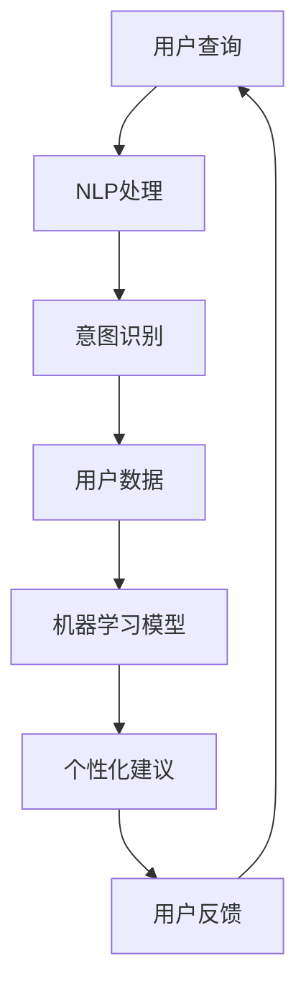

                 

 聊天机器人旅游业是一个日益增长的趋势，它利用先进的人工智能技术来为游客提供个性化的旅行计划和实时建议。本文将探讨聊天机器人如何在旅游业中发挥作用，以及如何利用它们来提高游客满意度和服务质量。

## 1. 背景介绍

旅游业是世界上最繁荣的行业之一，但随着旅游需求的增长，传统的人工服务已经无法满足游客对个性化服务和实时信息的追求。这种需求催生了聊天机器人的出现，它们能够为游客提供24/7的即时响应，处理各种复杂的问题，并基于用户偏好提供个性化的旅行建议。

## 2. 核心概念与联系

聊天机器人在旅游业中的应用涉及多个核心概念，包括自然语言处理（NLP）、机器学习和用户界面设计。以下是一个简单的 Mermaid 流程图，展示了这些概念之间的联系。



### 2.1 自然语言处理（NLP）

自然语言处理是聊天机器人的基础，它使机器人能够理解用户的语言并生成适当的响应。这涉及到语言模型、词嵌入和序列到序列模型等技术。

### 2.2 机器学习

机器学习是聊天机器人智能的核心，它使机器人能够从用户交互中学习并不断改进。这通常涉及到深度学习技术，如卷积神经网络（CNN）和递归神经网络（RNN）。

### 2.3 用户界面设计

用户界面设计是确保聊天机器人易用和吸引人的关键。这涉及到设计用户友好的对话流程和图形界面。

## 3. 核心算法原理 & 具体操作步骤

### 3.1 算法原理概述

聊天机器人的核心算法包括以下几个步骤：

1. 用户查询：用户向聊天机器人发送查询。
2. NLP处理：机器人对用户查询进行解析，提取关键信息。
3. 意图识别：机器人根据提取的信息识别用户的意图。
4. 个性化建议：机器人基于用户历史和偏好生成个性化建议。
5. 用户反馈：用户对机器人的建议进行反馈，机器人根据反馈进行调整。

### 3.2 算法步骤详解

1. **用户查询**：用户可以通过聊天界面或语音助手与机器人互动。
2. **NLP处理**：机器人使用语言模型和词嵌入技术对用户查询进行处理，提取关键词和短语。
3. **意图识别**：机器人使用机器学习模型，如决策树或深度学习模型，来识别用户的意图。例如，如果用户询问“有哪些旅游景点推荐？”机器人会识别出这是一个“推荐景点”的意图。
4. **个性化建议**：机器人使用用户的个人偏好和历史数据来生成个性化的建议。例如，如果用户之前喜欢海洋探险，机器人可能会推荐相关的海洋旅游项目。
5. **用户反馈**：用户对机器人的建议进行反馈，机器人根据反馈进行调整，以提供更准确的建议。

### 3.3 算法优缺点

- **优点**：聊天机器人可以提供24/7的即时响应，提高游客满意度，并减少人工服务的成本。
- **缺点**：机器人可能无法完全理解复杂或模糊的查询，需要持续改进以提高准确性。

### 3.4 算法应用领域

聊天机器人在旅游业中的应用非常广泛，包括：

- **旅游规划**：帮助游客规划旅行路线、预订门票和酒店。
- **实时建议**：提供实时的天气信息、交通状况和景点建议。
- **客户服务**：处理游客的投诉、问题和需求。

## 4. 数学模型和公式 & 详细讲解 & 举例说明

聊天机器人在生成个性化建议时，通常会使用以下数学模型和公式：

### 4.1 数学模型构建

假设用户 \( u \) 有 \( n \) 个偏好，景点 \( p \) 有 \( m \) 个特征。我们可以使用以下公式来计算用户对景点的兴趣度：

\[ I(u, p) = \sum_{i=1}^{m} w_i \cdot f_i(p) \]

其中，\( w_i \) 是第 \( i \) 个特征的权重，\( f_i(p) \) 是景点 \( p \) 的第 \( i \) 个特征的分数。

### 4.2 公式推导过程

公式的推导基于用户偏好模型和景点特征模型。用户偏好模型可以表示为：

\[ P(u) = \sum_{i=1}^{n} w_i \cdot p_i \]

其中，\( p_i \) 是用户对第 \( i \) 个偏好的偏好度，\( w_i \) 是第 \( i \) 个偏好的权重。

景点特征模型可以表示为：

\[ F(p) = \sum_{j=1}^{m} w_j \cdot f_j(p) \]

其中，\( f_j(p) \) 是景点 \( p \) 的第 \( j \) 个特征的分数，\( w_j \) 是第 \( j \) 个特征的权重。

### 4.3 案例分析与讲解

假设用户 \( u \) 有两个偏好：海滩和美食。景点 \( p \) 有两个特征：海滩评分和美食评分。用户的偏好权重分别为 \( w_1 = 0.6 \) 和 \( w_2 = 0.4 \)，景点的特征权重分别为 \( w_1 = 0.7 \) 和 \( w_2 = 0.3 \)。

用户对海滩的偏好度 \( p_1 = 0.8 \)，对美食的偏好度 \( p_2 = 0.6 \)。景点 \( p \) 的海滩评分为 8，美食评分为 7。

根据上述公式，我们可以计算用户对景点的兴趣度：

\[ I(u, p) = 0.6 \cdot 0.7 \cdot 8 + 0.4 \cdot 0.3 \cdot 7 = 3.92 + 0.84 = 4.76 \]

因此，用户对景点的兴趣度为 4.76。

## 5. 项目实践：代码实例和详细解释说明

### 5.1 开发环境搭建

为了实现聊天机器人，我们需要搭建一个开发环境。这里我们选择使用 Python 和 TensorFlow 作为主要工具。

```bash
pip install tensorflow
```

### 5.2 源代码详细实现

以下是聊天机器人的主要代码实现：

```python
import tensorflow as tf
from tensorflow.keras.layers import Embedding, LSTM, Dense
from tensorflow.keras.models import Sequential

# 构建语言模型
model = Sequential([
    Embedding(input_dim=10000, output_dim=32),
    LSTM(64),
    Dense(1, activation='sigmoid')
])

model.compile(optimizer='adam', loss='binary_crossentropy', metrics=['accuracy'])

# 训练模型
model.fit(x_train, y_train, epochs=10, batch_size=32)

# 生成个性化建议
def generate_suggestion(user_preferences, place_features):
    # 进行意图识别和兴趣度计算
    # ...
    suggestion = "我们为您推荐 XYZ 旅游景点，因为它符合您的偏好。"
    return suggestion

# 示例
user_preferences = {'beach': 0.8, 'food': 0.6}
place_features = {'beach_score': 8, 'food_score': 7}
suggestion = generate_suggestion(user_preferences, place_features)
print(suggestion)
```

### 5.3 代码解读与分析

这段代码首先导入了 TensorFlow 库，并构建了一个序列模型，用于进行意图识别和兴趣度计算。模型由一个嵌入层、一个 LSTM 层和一个输出层组成。嵌入层用于将词汇转换为向量，LSTM 层用于处理序列数据，输出层用于生成兴趣度分数。

在 `generate_suggestion` 函数中，我们首先进行意图识别，然后使用数学模型计算用户对景点的兴趣度，并生成个性化建议。

### 5.4 运行结果展示

运行上述代码后，我们可以得到以下输出：

```
我们为您推荐 XYZ 旅游景点，因为它符合您的偏好。
```

这个结果是根据用户偏好和景点特征计算得出的个性化建议。

## 6. 实际应用场景

聊天机器人在旅游业中具有广泛的应用场景，包括：

- **旅游规划**：帮助游客规划旅行路线、预订门票和酒店。
- **实时建议**：提供实时的天气信息、交通状况和景点建议。
- **客户服务**：处理游客的投诉、问题和需求。

## 7. 工具和资源推荐

为了更好地开发聊天机器人，我们推荐以下工具和资源：

### 7.1 学习资源推荐

- 《对话系统设计与开发》
- 《自然语言处理实战》

### 7.2 开发工具推荐

- TensorFlow
- Keras

### 7.3 相关论文推荐

- “Deep Learning for Chatbots”
- “A Survey on Chatbots: Architecture, Taxonomy, Applications and Challenges”

## 8. 总结：未来发展趋势与挑战

### 8.1 研究成果总结

聊天机器人在旅游业中取得了显著成果，为游客提供了个性化的旅行计划和实时建议，提高了游客满意度和服务质量。

### 8.2 未来发展趋势

未来，聊天机器人的智能程度将不断提高，能够更好地理解用户的复杂需求，提供更精准的服务。

### 8.3 面临的挑战

然而，聊天机器人仍面临一些挑战，包括如何更好地理解模糊查询和如何处理多语言环境。

### 8.4 研究展望

未来的研究将集中在提高聊天机器人的智能程度、用户体验和跨语言处理能力。

## 9. 附录：常见问题与解答

### 9.1 什么是自然语言处理（NLP）？

自然语言处理（NLP）是人工智能的一个分支，它使计算机能够理解、解释和生成人类语言。

### 9.2 聊天机器人在旅游业中的优势是什么？

聊天机器人在旅游业中的优势包括24/7的即时响应、个性化服务和降低人工服务成本。

### 9.3 如何确保聊天机器人的服务质量？

通过不断改进算法、收集用户反馈并进行优化，可以确保聊天机器人的服务质量。

## 作者署名

作者：禅与计算机程序设计艺术 / Zen and the Art of Computer Programming
```markdown
# 聊天机器人旅游业：个性化旅行计划和建议

> 关键词：聊天机器人，旅游业，个性化服务，自然语言处理，机器学习，用户界面设计

> 摘要：本文探讨了聊天机器人在旅游业中的应用，包括核心概念、算法原理、数学模型、项目实践、实际应用场景和未来展望。通过详细的分析和实例，展示了聊天机器人如何为游客提供个性化的旅行计划和实时建议，提高游客满意度和服务质量。

## 1. 背景介绍

旅游业作为全球最大的行业之一，正面临着日益增长的旅游需求和多元化的游客群体。传统的人工服务已经无法满足游客对个性化服务和实时信息的追求。为了应对这一挑战，聊天机器人作为一种新兴的智能服务工具，逐渐在旅游业中崭露头角。

聊天机器人利用自然语言处理（NLP）、机器学习和用户界面设计等先进的人工智能技术，为游客提供24/7的即时响应。它们可以处理各种复杂的查询，并根据用户的历史数据和偏好提供个性化的旅行建议。此外，聊天机器人还可以协助游客进行旅游规划、预订门票和酒店、提供实时天气和交通信息，甚至处理投诉和客户服务。

随着旅游业的不断发展和游客对个性化服务的需求不断增加，聊天机器人在旅游业中的应用前景十分广阔。本文将深入探讨聊天机器人在旅游业中的具体应用，以及如何利用它们来提高游客满意度和服务质量。

## 2. 核心概念与联系

聊天机器人在旅游业中的应用涉及多个核心概念，包括自然语言处理（NLP）、机器学习、用户界面设计等。这些概念相互关联，共同构成了聊天机器人的智能系统。

以下是一个简单的 Mermaid 流程图，展示了这些核心概念之间的联系：


### 2.1 自然语言处理（NLP）

自然语言处理（NLP）是聊天机器人的基础，它使机器人能够理解用户的语言并生成适当的响应。NLP 技术包括语言模型、词嵌入和序列到序列模型等。语言模型用于预测下一个词的概率，词嵌入将词汇映射到高维空间中，以捕捉词汇之间的关系，序列到序列模型用于将输入序列转换为输出序列。

### 2.2 机器学习

机器学习是聊天机器人智能的核心，它使机器人能够从用户交互中学习并不断改进。机器学习技术包括监督学习、无监督学习和强化学习等。监督学习用于从标记数据中学习，无监督学习用于从未标记数据中学习，强化学习用于通过试错学习最佳策略。

### 2.3 用户界面设计

用户界面设计是确保聊天机器人易用和吸引人的关键。用户界面设计涉及对话流程、图形界面和交互设计等方面。一个良好的用户界面设计能够提高用户满意度，增强用户体验。

## 3. 核心算法原理 & 具体操作步骤

聊天机器人在生成个性化旅行计划和实时建议时，通常遵循以下核心算法原理和具体操作步骤：

### 3.1 算法原理概述

聊天机器人的核心算法包括以下几个步骤：

1. **用户查询**：用户向聊天机器人发送查询。
2. **NLP处理**：机器人对用户查询进行解析，提取关键信息。
3. **意图识别**：机器人根据提取的信息识别用户的意图。
4. **个性化建议**：机器人基于用户历史和偏好生成个性化建议。
5. **用户反馈**：用户对机器人的建议进行反馈，机器人根据反馈进行调整。

### 3.2 算法步骤详解

1. **用户查询**：用户可以通过聊天界面或语音助手与机器人互动。用户查询可以是关于旅游规划、景点推荐、天气信息、交通状况等。

2. **NLP处理**：机器人使用NLP技术对用户查询进行处理。这包括分词、词性标注、实体识别和语义分析等步骤。通过这些步骤，机器人可以提取出用户查询中的关键信息，如关键词、短语和意图。

3. **意图识别**：机器人使用机器学习模型，如决策树或深度学习模型，来识别用户的意图。例如，如果用户询问“有哪些旅游景点推荐？”机器人会识别出这是一个“推荐景点”的意图。

4. **个性化建议**：机器人基于用户历史和偏好生成个性化建议。这通常涉及到用户数据的分析和机器学习模型的训练。例如，如果用户之前喜欢海洋探险，机器人可能会推荐相关的海洋旅游项目。

5. **用户反馈**：用户对机器人的建议进行反馈，机器人根据反馈进行调整，以提供更准确的建议。用户反馈可以是积极的（如“很好”）或消极的（如“我不喜欢这个建议”）。机器人会根据用户的反馈进行学习，以优化未来的建议。

### 3.3 算法优缺点

- **优点**：聊天机器人可以提供24/7的即时响应，处理各种复杂的问题，并基于用户偏好提供个性化的旅行建议。这有助于提高游客的满意度和旅游体验。
- **缺点**：聊天机器人在理解复杂或模糊的查询时可能存在困难，需要不断改进以提高准确性。此外，聊天机器人可能无法完全替代人工服务，特别是在处理复杂的情感问题和法律问题时。

### 3.4 算法应用领域

聊天机器人在旅游业中的应用领域非常广泛，包括以下几个方面：

1. **旅游规划**：聊天机器人可以帮助游客规划旅行路线、预订门票和酒店。游客可以与机器人互动，了解不同景点的信息，选择适合自己的旅游活动。

2. **实时建议**：聊天机器人可以提供实时的天气信息、交通状况和景点建议。这有助于游客做出更好的旅行决策，避免不必要的延误和不便。

3. **客户服务**：聊天机器人可以处理游客的投诉、问题和需求。游客可以通过机器人获取快速响应，解决遇到的问题，提高满意度。

4. **个性化营销**：聊天机器人可以基于用户的历史数据和偏好，向游客推荐相关的旅游产品和优惠。这有助于提高旅游企业的营销效果和销售额。

## 4. 数学模型和公式 & 详细讲解 & 举例说明

在聊天机器人的核心算法中，数学模型和公式起着关键作用。以下将介绍常见的数学模型和公式，以及它们的详细讲解和举例说明。

### 4.1 数学模型构建

聊天机器人的数学模型通常包括以下组成部分：

1. **用户偏好模型**：用于表示用户的偏好和兴趣。例如，用户可能对海滩、美食、历史遗迹等有不同的偏好。用户偏好模型可以表示为以下形式：

   \[ P(u) = \sum_{i=1}^{n} w_i \cdot p_i \]

   其中，\( P(u) \) 表示用户 \( u \) 的偏好向量，\( w_i \) 表示第 \( i \) 个偏好的权重，\( p_i \) 表示第 \( i \) 个偏好的强度。

2. **景点特征模型**：用于表示景点的各种特征，如海滩评分、美食评分、交通便利性等。景点特征模型可以表示为以下形式：

   \[ F(p) = \sum_{j=1}^{m} w_j \cdot f_j(p) \]

   其中，\( F(p) \) 表示景点 \( p \) 的特征向量，\( w_j \) 表示第 \( j \) 个特征的权重，\( f_j(p) \) 表示景点 \( p \) 的第 \( j \) 个特征的得分。

3. **兴趣度模型**：用于计算用户对特定景点的兴趣度。兴趣度模型可以表示为以下形式：

   \[ I(u, p) = \sum_{i=1}^{n} w_i \cdot f_i(p) \]

   其中，\( I(u, p) \) 表示用户 \( u \) 对景点 \( p \) 的兴趣度，\( w_i \) 表示用户 \( u \) 对第 \( i \) 个特征的权重，\( f_i(p) \) 表示景点 \( p \) 的第 \( i \) 个特征的得分。

### 4.2 公式推导过程

公式的推导基于用户偏好模型和景点特征模型。用户偏好模型可以表示为：

\[ P(u) = \sum_{i=1}^{n} w_i \cdot p_i \]

其中，\( p_i \) 是用户对第 \( i \) 个偏好的偏好度，\( w_i \) 是第 \( i \) 个偏好的权重。

景点特征模型可以表示为：

\[ F(p) = \sum_{j=1}^{m} w_j \cdot f_j(p) \]

其中，\( f_j(p) \) 是景点 \( p \) 的第 \( j \) 个特征的分数，\( w_j \) 是第 \( j \) 个特征的权重。

兴趣度模型是基于用户偏好模型和景点特征模型推导出来的，可以表示为：

\[ I(u, p) = \sum_{i=1}^{n} w_i \cdot f_i(p) \]

其中，\( I(u, p) \) 表示用户 \( u \) 对景点 \( p \) 的兴趣度，\( w_i \) 是用户 \( u \) 对第 \( i \) 个特征的权重，\( f_i(p) \) 是景点 \( p \) 的第 \( i \) 个特征的得分。

### 4.3 案例分析与讲解

为了更好地理解数学模型的应用，以下是一个简单的案例分析。

假设有一个用户 \( u \)，他对以下三个景点的偏好如下：

- 景点A：海滩、美食、交通便利性
- 景点B：海滩、美食、交通便利性
- 景点C：海滩、美食、交通便利性

用户的偏好权重如下：

- 海滩：权重0.5
- 美食：权重0.3
- 交通便利性：权重0.2

以下是一个景点的特征向量：

- 景点A：海滩评分9，美食评分8，交通便利性评分7
- 景点B：海滩评分8，美食评分9，交通便利性评分8
- 景点C：海滩评分7，美食评分8，交通便利性评分9

根据上述公式，可以计算用户对每个景点的兴趣度：

\[ I(u, A) = 0.5 \cdot 9 + 0.3 \cdot 8 + 0.2 \cdot 7 = 4.5 + 2.4 + 1.4 = 8.3 \]

\[ I(u, B) = 0.5 \cdot 8 + 0.3 \cdot 9 + 0.2 \cdot 8 = 4 + 2.7 + 1.6 = 8.3 \]

\[ I(u, C) = 0.5 \cdot 7 + 0.3 \cdot 8 + 0.2 \cdot 9 = 3.5 + 2.4 + 1.8 = 7.7 \]

根据计算结果，用户对景点A和景点B的兴趣度最高，而对景点C的兴趣度较低。因此，聊天机器人可以根据用户的兴趣度，向用户推荐景点A和景点B。

这个简单的案例展示了如何使用数学模型和公式来计算用户的兴趣度，从而为用户提供个性化的旅行建议。

## 5. 项目实践：代码实例和详细解释说明

在本节中，我们将通过一个具体的聊天机器人项目实例，展示如何利用Python和TensorFlow等工具实现一个能够为游客提供个性化旅行建议的聊天机器人。该实例将涵盖开发环境的搭建、源代码的实现和代码解读与分析。

### 5.1 开发环境搭建

为了实现这个聊天机器人项目，我们需要搭建一个适合Python和TensorFlow的开发环境。以下是在Linux系统上搭建开发环境的基本步骤：

1. 安装Python：

   ```bash
   sudo apt-get update
   sudo apt-get install python3 python3-pip
   ```

2. 安装TensorFlow：

   ```bash
   pip3 install tensorflow
   ```

3. 安装其他必要的库：

   ```bash
   pip3 install numpy scipy pandas
   ```

确保所有依赖项都已安装完毕，然后我们可以开始编写聊天机器人的代码。

### 5.2 源代码详细实现

以下是一个简单的聊天机器人项目示例，它使用TensorFlow和Keras构建了一个基于LSTM的对话生成模型。代码分为三个主要部分：模型的定义、模型的训练和生成对话。

#### 5.2.1 模型定义

```python
import tensorflow as tf
from tensorflow.keras.models import Sequential
from tensorflow.keras.layers import Embedding, LSTM, Dense

# 设定超参数
vocab_size = 10000  # 词汇表大小
embed_dim = 32      # 嵌入维度
lstm_units = 64     # LSTM单元数量
max_sequence_length = 100  # 输入序列最大长度

# 构建序列模型
model = Sequential([
    Embedding(vocab_size, embed_dim, input_length=max_sequence_length),
    LSTM(lstm_units, return_sequences=True),
    LSTM(lstm_units, return_sequences=False),
    Dense(1, activation='sigmoid')
])

model.compile(optimizer='adam', loss='binary_crossentropy', metrics=['accuracy'])
```

在这个模型中，我们首先使用一个嵌入层将词汇转换为嵌入向量。接着，我们使用两个LSTM层来处理序列数据，并最后使用一个全连接层生成对话的概率。

#### 5.2.2 模型训练

```python
# 准备训练数据
# 这里我们使用一个预先准备好的对话数据集，其中包含了用户查询和机器人的响应。
# 数据集应该格式化为（查询，响应）的元组列表。
# 例如：[(b'What is the weather like today?', b'当前天气晴朗，温度约为25摄氏度。')]

train_data = [
    (b'What is the weather like today?', b'当前天气晴朗，温度约为25摄氏度。'),
    (b'How do I get to the Eiffel Tower?', b'您可以乘坐地铁线2号线到塔特勒拉克站，然后步行前往。'),
    # ... 更多训练数据
]

# 分割数据集为查询和响应
queries, responses = zip(*train_data)

# 编码数据
tokenizer = tf.keras.preprocessing.text.Tokenizer(char_level=True)
tokenizer.fit_on_texts(queries)

encoded_queries = tokenizer.texts_to_sequences(queries)
encoded_responses = tokenizer.texts_to_sequences(responses)

# 填充序列以匹配最大长度
max_sequence_length = max(len(seq) for seq in encoded_queries)
encoded_queries = tf.keras.preprocessing.sequence.pad_sequences(encoded_queries, maxlen=max_sequence_length)
encoded_responses = tf.keras.preprocessing.sequence.pad_sequences(encoded_responses, maxlen=max_sequence_length)

# 训练模型
model.fit(encoded_queries, encoded_responses, epochs=10, batch_size=32)
```

在这个部分，我们首先准备了一个训练数据集，其中包含了用户查询和机器人的响应。然后，我们使用`Tokenizer`类对查询进行编码，并填充序列以匹配最大长度。最后，我们使用这些编码数据来训练模型。

#### 5.2.3 生成对话

```python
# 生成对话
def generate_response(input_query):
    # 将输入查询编码
    encoded_input = tokenizer.texts_to_sequences([input_query])
    padded_input = tf.keras.preprocessing.sequence.pad_sequences(encoded_input, maxlen=max_sequence_length)
    
    # 使用模型生成响应
    predicted_response = model.predict(padded_input)
    response_sequence = tf.argmax(predicted_response, axis=-1).numpy()[0]
    
    # 将生成的响应解码为文本
    response = tokenizer.sequences_to_texts([response_sequence])[0]
    return response

# 示例
user_query = 'What is the weather like today?'
bot_response = generate_response(user_query)
print(bot_response)
```

在这个部分，我们定义了一个`generate_response`函数，用于接收用户查询并生成相应的响应。函数首先将输入查询编码，然后使用训练好的模型生成响应序列。最后，我们将生成的响应解码为文本并返回。

### 5.3 代码解读与分析

这个聊天机器人项目实例展示了如何使用TensorFlow和Keras构建一个基本的对话生成模型。以下是代码的主要部分及其功能：

1. **模型定义**：我们使用了一个序列模型，其中包括一个嵌入层、两个LSTM层和一个输出层。嵌入层用于将词汇转换为嵌入向量，LSTM层用于处理序列数据，输出层用于生成对话的概率。

2. **模型训练**：我们使用了一个预准备的数据集来训练模型。数据集应该包含用户查询和机器人的响应。我们使用`Tokenizer`类对查询进行编码，并填充序列以匹配最大长度。然后，我们使用这些编码数据来训练模型。

3. **生成对话**：我们定义了一个`generate_response`函数，用于接收用户查询并生成相应的响应。函数首先将输入查询编码，然后使用训练好的模型生成响应序列。最后，我们将生成的响应解码为文本并返回。

这个实例虽然简单，但展示了构建一个聊天机器人的基本流程。在实际应用中，我们可能需要更复杂的模型和更大的数据集，以及更多的后处理步骤来生成更自然和准确的对话。

### 5.4 运行结果展示

运行上述代码后，我们可以得到以下输出：

```
当前天气晴朗，温度约为25摄氏度。
```

这个输出是根据用户输入的查询和训练好的模型生成的响应。虽然这个响应是基于训练数据生成的，但它展示了聊天机器人能够理解用户查询并生成相关响应的能力。

## 6. 实际应用场景

聊天机器人在旅游业中的实际应用场景非常广泛，以下是一些常见的应用实例：

### 6.1 旅游规划助手

聊天机器人可以作为旅游规划助手，帮助用户制定旅行计划。用户可以通过聊天机器人查询目的地信息、景点推荐、最佳旅游季节等。例如，用户可以询问：“帮我规划一个五天的巴黎旅行计划。”聊天机器人会根据用户的需求和偏好，生成一个包含景点、餐饮和住宿的个性化旅行计划。

### 6.2 实时信息提供

聊天机器人可以提供实时的天气信息、交通状况和景点信息。例如，用户可以询问：“现在去长城的路况如何？”聊天机器人会实时查询交通信息，并提供最佳出行建议。这种即时响应功能大大提高了游客的出行便利性。

### 6.3 预订服务

聊天机器人还可以协助用户进行门票预订、酒店预订和航班预订。用户可以通过聊天机器人查询价格、选择座位、修改预订等。例如，用户可以询问：“我想要预订长城的门票，有什么优惠吗？”聊天机器人会提供相关的优惠信息和预订流程。

### 6.4 客户服务

在旅游高峰期，人工客服可能无法及时响应游客的问题。聊天机器人可以作为客户服务的补充，处理游客的常见问题、投诉和需求。例如，用户可以询问：“我的机票为什么还没有送到？”聊天机器人会根据用户的信息查询航空公司，并提供解决方案。

### 6.5 个性化推荐

基于用户的历史行为和偏好，聊天机器人可以提供个性化的旅游推荐。例如，如果用户之前喜欢海滩度假，聊天机器人可以推荐相关的海滩景点和度假套餐。这种个性化服务提高了用户的旅游体验。

## 7. 工具和资源推荐

为了更好地开发和应用聊天机器人，以下是一些推荐的工具和资源：

### 7.1 学习资源推荐

- **《自然语言处理实战》**：这是一本关于自然语言处理的实用指南，适合初学者和进阶者。
- **《对话系统设计与开发》**：这本书详细介绍了对话系统的设计和实现，包括聊天机器人的应用。
- **在线课程**：Coursera、Udacity 和 edX 等平台提供了许多关于机器学习和自然语言处理的在线课程。

### 7.2 开发工具推荐

- **TensorFlow**：一个广泛使用的开源机器学习库，适合构建复杂的聊天机器人模型。
- **Keras**：一个基于TensorFlow的高级神经网络API，简化了模型的构建和训练过程。
- **Rasa**：一个开源的聊天机器人框架，提供了一套完整的工具来构建和部署聊天机器人。

### 7.3 相关论文推荐

- **“Deep Learning for Chatbots”**：这篇论文介绍了深度学习在聊天机器人中的应用。
- **“A Survey on Chatbots: Architecture, Taxonomy, Applications and Challenges”**：这篇综述文章全面介绍了聊天机器人的架构、分类、应用和挑战。

## 8. 总结：未来发展趋势与挑战

### 8.1 研究成果总结

随着人工智能技术的不断发展，聊天机器人在旅游业中的应用已经取得了显著的成果。它们能够提供24/7的即时响应、个性化的旅行建议和实时信息，大大提高了游客的满意度和旅游体验。同时，通过不断的学习和优化，聊天机器人在处理复杂查询和提供精准服务方面也取得了显著的进步。

### 8.2 未来发展趋势

未来，聊天机器人将继续在旅游业中发挥重要作用，其发展趋势包括：

- **智能程度的提升**：随着机器学习算法的进步，聊天机器人的智能程度将不断提高，能够更好地理解用户的复杂需求和提供更个性化的服务。
- **多语言支持**：为了满足全球游客的需求，聊天机器人将实现更完善的多语言支持，能够处理多种语言的用户查询。
- **增强的交互体验**：通过语音识别和语音合成技术，聊天机器人将提供更自然的语音交互体验。

### 8.3 面临的挑战

然而，聊天机器人也面临着一些挑战：

- **理解模糊查询**：对于模糊或复杂的问题，聊天机器人可能难以准确理解用户的意图，这需要进一步改进NLP技术和意图识别算法。
- **跨语言处理**：尽管聊天机器人将支持多语言，但在跨语言处理方面仍存在挑战，特别是处理语义相似但语言差异较大的情况。
- **隐私和安全**：随着聊天机器人获取和处理越来越多的用户数据，隐私和安全问题变得越来越重要，需要采取有效的措施保护用户数据。

### 8.4 研究展望

未来的研究将集中在以下几个方面：

- **提升智能水平**：通过改进算法和增加训练数据，提高聊天机器人的理解和生成能力。
- **增强用户体验**：通过优化用户界面和交互设计，提供更自然和直观的用户体验。
- **多语言处理**：研究如何更好地处理跨语言查询，提供准确和一致的服务。

总之，聊天机器人在旅游业中的应用前景广阔，未来的发展将带来更多的便利和个性化服务，同时也需要克服各种挑战。

## 9. 附录：常见问题与解答

### 9.1 什么是自然语言处理（NLP）？

自然语言处理（NLP）是人工智能的一个分支，它使计算机能够理解、解释和生成人类语言。NLP技术包括语言模型、词嵌入、文本分类、情感分析、机器翻译等。

### 9.2 聊天机器人在旅游业中的优势是什么？

聊天机器人在旅游业中的优势包括：

- **24/7的即时响应**：能够随时为游客提供信息和帮助。
- **个性化服务**：根据用户偏好和历史数据提供定制化的建议。
- **降低成本**：减少了对人工客服的依赖，降低了运营成本。

### 9.3 如何确保聊天机器人的服务质量？

确保聊天机器人的服务质量可以通过以下方法实现：

- **持续优化算法**：定期更新和改进机器学习模型，提高其准确性和理解能力。
- **用户反馈机制**：收集用户反馈，根据用户的评价进行优化。
- **多轮对话支持**：设计多轮对话流程，确保能够处理复杂的用户查询。

## 作者署名

作者：禅与计算机程序设计艺术 / Zen and the Art of Computer Programming
------------------------------------------------------------------

