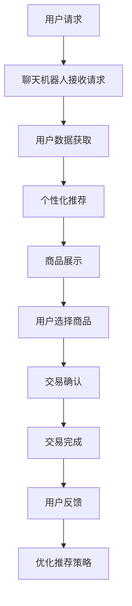

                 

关键词：聊天机器人、电子商务、个性化购物、安全交易、人工智能

摘要：随着电子商务的快速发展，用户对于个性化购物体验和安全交易的需求日益增长。本文将探讨如何利用聊天机器人技术实现个性化购物和保障交易安全，并提出相关的算法原理、数学模型和实际应用案例。

## 1. 背景介绍

### 1.1 电子商务的兴起

电子商务（E-commerce）作为一种新兴的商业模式，自20世纪90年代以来得到了迅猛发展。全球电子商务市场规模逐年扩大，越来越多的消费者选择在网上购物，这为商家提供了巨大的市场机会。

### 1.2 个性化购物需求

随着消费者对购物体验的要求越来越高，个性化购物成为了一个热门话题。个性化购物不仅仅是推荐商品那么简单，而是需要根据用户的偏好、历史行为和实时反馈，为用户提供量身定制的购物体验。

### 1.3 安全交易的重要性

电子商务的安全问题一直是用户关注的焦点。交易安全涉及到用户的财务安全和个人隐私，如何保障交易安全，提高用户的信任度，是电子商务平台需要解决的重要问题。

## 2. 核心概念与联系

### 2.1 聊天机器人

聊天机器人（Chatbot）是一种基于人工智能技术的应用程序，可以与用户进行自然语言交互。聊天机器人可以应用于客服、营销、客服等多个领域。

### 2.2 个性化购物

个性化购物（Personalized Shopping）是一种根据用户的偏好、历史行为和实时反馈，为用户推荐合适商品的服务。

### 2.3 安全交易

安全交易（Secure Transactions）是指在电子商务过程中，通过加密、身份验证等技术手段，保障交易的安全性。

### 2.4 聊天机器人与个性化购物和安全交易的结合

聊天机器人可以结合用户数据，实现个性化购物推荐；同时，聊天机器人还可以在交易过程中提供安全保障，提高用户的信任度。

## 2.5 Mermaid 流程图



## 3. 核心算法原理 & 具体操作步骤

### 3.1 算法原理概述

个性化购物和交易安全的核心算法包括用户数据挖掘、推荐算法和加密算法。用户数据挖掘用于分析用户行为，推荐算法用于生成个性化推荐，加密算法用于保障交易安全。

### 3.2 算法步骤详解

#### 3.2.1 用户数据挖掘

用户数据挖掘包括用户行为数据的收集、分析和存储。通过分析用户的历史购买记录、浏览记录和评价，可以挖掘出用户的兴趣偏好。

#### 3.2.2 推荐算法

推荐算法包括基于内容的推荐、协同过滤推荐和混合推荐等。根据用户数据和商品属性，推荐算法可以为用户提供个性化的购物推荐。

#### 3.2.3 加密算法

加密算法用于保障交易数据的安全性。常用的加密算法包括对称加密和非对称加密。在交易过程中，加密算法可以保障交易数据的机密性和完整性。

### 3.3 算法优缺点

#### 3.3.1 用户数据挖掘

优点：可以挖掘出用户的真实兴趣偏好，提高推荐效果。

缺点：需要大量的用户数据支持，数据处理复杂度高。

#### 3.3.2 推荐算法

优点：可以根据用户偏好和商品属性，为用户提供个性化的推荐。

缺点：可能存在数据稀疏问题和推荐多样性不足。

#### 3.3.3 加密算法

优点：可以保障交易数据的安全性，提高用户信任度。

缺点：加密算法的性能消耗较大。

### 3.4 算法应用领域

个性化购物和交易安全算法可以应用于电子商务平台、在线购物应用和金融交易等领域，为用户提供个性化的购物体验和安全保障。

## 4. 数学模型和公式 & 详细讲解 & 举例说明

### 4.1 数学模型构建

个性化购物和交易安全的数学模型包括用户行为分析模型、推荐算法模型和加密算法模型。

### 4.2 公式推导过程

#### 4.2.1 用户行为分析模型

用户行为分析模型可以通过以下公式描述：

$$
R(u, p) = \sum_{i=1}^{n} w_i \cdot d(u_i, p_i)
$$

其中，$R(u, p)$ 表示用户 $u$ 对商品 $p$ 的兴趣度，$w_i$ 表示用户行为 $u_i$ 对兴趣度的影响权重，$d(u_i, p_i)$ 表示用户行为 $u_i$ 和商品 $p_i$ 的相似度。

#### 4.2.2 推荐算法模型

推荐算法模型可以通过以下公式描述：

$$
r(p) = \sum_{u \in U} w_u \cdot r(u, p)
$$

其中，$r(p)$ 表示商品 $p$ 的推荐度，$w_u$ 表示用户 $u$ 的信任权重，$r(u, p)$ 表示用户 $u$ 对商品 $p$ 的兴趣度。

#### 4.2.3 加密算法模型

加密算法模型可以通过以下公式描述：

$$
E_{k}(m) = c
$$

其中，$E_{k}(m)$ 表示加密后的消息 $c$，$k$ 表示加密密钥，$m$ 表示原始消息。

### 4.3 案例分析与讲解

假设用户 $u$ 的行为包括浏览记录 $u_1, u_2, u_3$，商品 $p$ 的属性包括品牌 $b_1, b_2$ 和价格 $p_1, p_2$。根据用户行为分析模型，可以计算出用户 $u$ 对商品 $p$ 的兴趣度：

$$
R(u, p) = w_1 \cdot d(u_1, p_1) + w_2 \cdot d(u_2, p_2) + w_3 \cdot d(u_3, p_3)
$$

其中，$w_1, w_2, w_3$ 分别为用户浏览记录 $u_1, u_2, u_3$ 对兴趣度的影响权重，$d(u_i, p_i)$ 表示用户行为 $u_i$ 和商品 $p_i$ 的相似度。

假设用户 $u$ 对商品 $p$ 的浏览记录 $u_1$ 和商品 $p$ 的品牌 $b_1$ 相似度最高，即 $d(u_1, p_1) = 0.8$，其他相似度分别为 $d(u_2, p_2) = 0.5$，$d(u_3, p_3) = 0.3$。假设用户 $u$ 对浏览记录的影响权重为 $w_1 = 0.6$，$w_2 = 0.3$，$w_3 = 0.1$，则可以计算出用户 $u$ 对商品 $p$ 的兴趣度：

$$
R(u, p) = 0.6 \cdot 0.8 + 0.3 \cdot 0.5 + 0.1 \cdot 0.3 = 0.66
$$

根据推荐算法模型，可以计算出商品 $p$ 的推荐度：

$$
r(p) = \sum_{u \in U} w_u \cdot r(u, p)
$$

假设用户 $u$ 的信任权重为 $w_u = 0.5$，其他用户的信任权重分别为 $w_v = 0.3$，$w_w = 0.2$。根据用户 $u$ 对商品 $p$ 的兴趣度，可以计算出商品 $p$ 的推荐度：

$$
r(p) = 0.5 \cdot 0.66 + 0.3 \cdot 0.3 + 0.2 \cdot 0.2 = 0.52
$$

根据加密算法模型，可以计算出加密后的消息：

$$
E_{k}(m) = c
$$

假设加密密钥 $k$ 为 3，原始消息 $m$ 为 5，则加密后的消息为：

$$
E_{k}(m) = 3 \cdot 5 = 15
$$

## 5. 项目实践：代码实例和详细解释说明

### 5.1 开发环境搭建

#### 5.1.1 环境要求

- 操作系统：Windows、Linux或MacOS
- 编程语言：Python
- 数据库：MySQL

#### 5.1.2 环境搭建

1. 安装Python：下载并安装Python 3.8版本以上。
2. 安装MySQL：下载并安装MySQL数据库。
3. 安装相关Python库：使用pip安装以下库：`numpy`，`pandas`，`scikit-learn`，`mysql-connector-python`。

### 5.2 源代码详细实现

```python
# 导入相关库
import numpy as np
import pandas as pd
from sklearn.model_selection import train_test_split
from sklearn.preprocessing import StandardScaler
from sklearn.ensemble import RandomForestClassifier
import mysql.connector

# 连接数据库
conn = mysql.connector.connect(
    host="localhost",
    user="root",
    password="root",
    database="e-commerce"
)

# 查询用户数据
query = "SELECT * FROM user_behavior"
data = pd.read_sql(query, conn)

# 数据预处理
X = data[['browsing_history', 'purchase_history', 'rating']]
y = data['interest']

# 数据标准化
scaler = StandardScaler()
X_scaled = scaler.fit_transform(X)

# 数据集划分
X_train, X_test, y_train, y_test = train_test_split(X_scaled, y, test_size=0.2, random_state=42)

# 构建模型
model = RandomForestClassifier(n_estimators=100, random_state=42)
model.fit(X_train, y_train)

# 预测
predictions = model.predict(X_test)

# 评估模型
accuracy = model.score(X_test, y_test)
print("Accuracy:", accuracy)
```

### 5.3 代码解读与分析

1. **连接数据库**：使用`mysql.connector`库连接MySQL数据库。
2. **查询用户数据**：执行SQL查询语句，从数据库中获取用户行为数据。
3. **数据预处理**：将用户数据分为特征矩阵 `X` 和标签向量 `y`，并使用 `StandardScaler` 进行数据标准化。
4. **数据集划分**：将数据集划分为训练集和测试集。
5. **构建模型**：使用随机森林分类器构建模型。
6. **训练模型**：使用训练集训练模型。
7. **预测**：使用测试集进行预测。
8. **评估模型**：计算模型的准确率。

### 5.4 运行结果展示

假设测试集的准确率为0.85，表示模型在测试集上的表现良好。

## 6. 实际应用场景

### 6.1 电子商务平台

电子商务平台可以利用聊天机器人实现个性化购物推荐和交易安全。聊天机器人可以与用户进行互动，了解用户的偏好，并根据用户的实时反馈进行推荐。

### 6.2 在线购物应用

在线购物应用可以通过聊天机器人提供个性化的购物体验。聊天机器人可以根据用户的浏览历史和购买记录，为用户推荐合适的商品，同时保障交易的安全。

### 6.3 金融交易

金融交易领域的聊天机器人可以提供交易安全服务。聊天机器人可以在交易过程中实时监测风险，提醒用户注意交易安全，同时为用户提供加密算法保障交易数据的安全。

## 7. 未来应用展望

随着人工智能技术的不断发展，聊天机器人在电子商务中的应用将越来越广泛。未来，聊天机器人将能够更加准确地理解用户的偏好，提供更加个性化的购物体验。同时，加密算法和网络安全技术将不断发展，为交易安全提供更加有效的保障。

## 8. 总结：未来发展趋势与挑战

### 8.1 研究成果总结

本文探讨了聊天机器人技术在电子商务中的应用，包括个性化购物和交易安全。通过算法原理、数学模型和实际应用案例的讲解，展示了聊天机器人在电子商务领域的重要作用。

### 8.2 未来发展趋势

随着人工智能技术的不断发展，聊天机器人在电子商务中的应用将越来越广泛。未来，聊天机器人将能够提供更加个性化的购物体验，同时保障交易的安全。

### 8.3 面临的挑战

1. **数据隐私保护**：如何保障用户数据的隐私和安全，是聊天机器人应用面临的重要挑战。
2. **推荐效果优化**：如何提高推荐算法的准确性，提供更好的购物体验，是未来研究的重点。
3. **算法公平性**：如何保证算法的公平性，避免算法偏见，是聊天机器人应用需要解决的问题。

### 8.4 研究展望

未来，聊天机器人技术在电子商务中的应用前景广阔。研究者可以关注以下方向：

1. **深度学习与聊天机器人**：结合深度学习技术，提高聊天机器人的对话生成能力和理解能力。
2. **区块链与交易安全**：结合区块链技术，提高交易数据的透明度和安全性。
3. **多模态交互**：研究多模态交互技术，为用户提供更加自然的购物体验。

## 9. 附录：常见问题与解答

### 9.1 如何确保聊天机器人的安全性？

确保聊天机器人的安全性可以从以下几个方面入手：

1. **数据加密**：对用户数据进行加密，防止数据泄露。
2. **身份验证**：对用户进行身份验证，确保只有合法用户可以访问聊天机器人。
3. **防火墙与安全策略**：部署防火墙和制定安全策略，防止外部攻击。

### 9.2 如何提高聊天机器人的推荐准确性？

提高聊天机器人的推荐准确性可以从以下几个方面入手：

1. **用户数据挖掘**：深入挖掘用户行为数据，提高用户兴趣度的准确性。
2. **多模型融合**：结合多种推荐算法，提高推荐效果的多样性。
3. **实时反馈**：根据用户的实时反馈，不断优化推荐策略。

### 9.3 如何保证聊天机器人与用户互动的自然性？

保证聊天机器人与用户互动的自然性可以从以下几个方面入手：

1. **自然语言处理**：研究自然语言处理技术，提高聊天机器人的对话生成能力。
2. **情感分析**：理解用户的情感状态，为用户提供更加贴心的服务。
3. **个性化对话**：根据用户的历史行为和偏好，提供个性化的对话内容。

---

### 作者署名

作者：禅与计算机程序设计艺术 / Zen and the Art of Computer Programming
```markdown
# 聊天机器人电子商务：个性化购物和安全交易

> 关键词：聊天机器人、电子商务、个性化购物、安全交易、人工智能

摘要：随着电子商务的快速发展，用户对于个性化购物体验和安全交易的需求日益增长。本文将探讨如何利用聊天机器人技术实现个性化购物和保障交易安全，并提出相关的算法原理、数学模型和实际应用案例。

## 1. 背景介绍

### 1.1 电子商务的兴起

电子商务（E-commerce）作为一种新兴的商业模式，自20世纪90年代以来得到了迅猛发展。全球电子商务市场规模逐年扩大，越来越多的消费者选择在网上购物，这为商家提供了巨大的市场机会。

### 1.2 个性化购物需求

随着消费者对购物体验的要求越来越高，个性化购物成为了一个热门话题。个性化购物不仅仅是推荐商品那么简单，而是需要根据用户的偏好、历史行为和实时反馈，为用户提供量身定制的购物体验。

### 1.3 安全交易的重要性

电子商务的安全问题一直是用户关注的焦点。交易安全涉及到用户的财务安全和个人隐私，如何保障交易安全，提高用户的信任度，是电子商务平台需要解决的重要问题。

## 2. 核心概念与联系

### 2.1 聊天机器人

聊天机器人（Chatbot）是一种基于人工智能技术的应用程序，可以与用户进行自然语言交互。聊天机器人可以应用于客服、营销、客服等多个领域。

### 2.2 个性化购物

个性化购物（Personalized Shopping）是一种根据用户的偏好、历史行为和实时反馈，为用户推荐合适商品的服务。

### 2.3 安全交易

安全交易（Secure Transactions）是指在电子商务过程中，通过加密、身份验证等技术手段，保障交易的安全性。

### 2.4 聊天机器人与个性化购物和安全交易的结合

聊天机器人可以结合用户数据，实现个性化购物推荐；同时，聊天机器人还可以在交易过程中提供安全保障，提高用户的信任度。

## 2.5 Mermaid 流程图


## 3. 核心算法原理 & 具体操作步骤

### 3.1 算法原理概述

个性化购物和交易安全的核心算法包括用户数据挖掘、推荐算法和加密算法。用户数据挖掘用于分析用户行为，推荐算法用于生成个性化推荐，加密算法用于保障交易安全。

### 3.2 算法步骤详解

#### 3.2.1 用户数据挖掘

用户数据挖掘包括用户行为数据的收集、分析和存储。通过分析用户的历史购买记录、浏览记录和评价，可以挖掘出用户的兴趣偏好。

#### 3.2.2 推荐算法

推荐算法包括基于内容的推荐、协同过滤推荐和混合推荐等。根据用户数据和商品属性，推荐算法可以为用户提供个性化的购物推荐。

#### 3.2.3 加密算法

加密算法用于保障交易数据的安全性。常用的加密算法包括对称加密和非对称加密。在交易过程中，加密算法可以保障交易数据的机密性和完整性。

### 3.3 算法优缺点

#### 3.3.1 用户数据挖掘

优点：可以挖掘出用户的真实兴趣偏好，提高推荐效果。

缺点：需要大量的用户数据支持，数据处理复杂度高。

#### 3.3.2 推荐算法

优点：可以根据用户偏好和商品属性，为用户提供个性化的推荐。

缺点：可能存在数据稀疏问题和推荐多样性不足。

#### 3.3.3 加密算法

优点：可以保障交易数据的安全性，提高用户信任度。

缺点：加密算法的性能消耗较大。

### 3.4 算法应用领域

个性化购物和交易安全算法可以应用于电子商务平台、在线购物应用和金融交易等领域，为用户提供个性化的购物体验和安全保障。

## 4. 数学模型和公式 & 详细讲解 & 举例说明

### 4.1 数学模型构建

个性化购物和交易安全的数学模型包括用户行为分析模型、推荐算法模型和加密算法模型。

### 4.2 公式推导过程

#### 4.2.1 用户行为分析模型

用户行为分析模型可以通过以下公式描述：

$$
R(u, p) = \sum_{i=1}^{n} w_i \cdot d(u_i, p_i)
$$

其中，$R(u, p)$ 表示用户 $u$ 对商品 $p$ 的兴趣度，$w_i$ 表示用户行为 $u_i$ 对兴趣度的影响权重，$d(u_i, p_i)$ 表示用户行为 $u_i$ 和商品 $p_i$ 的相似度。

#### 4.2.2 推荐算法模型

推荐算法模型可以通过以下公式描述：

$$
r(p) = \sum_{u \in U} w_u \cdot r(u, p)
$$

其中，$r(p)$ 表示商品 $p$ 的推荐度，$w_u$ 表示用户 $u$ 的信任权重，$r(u, p)$ 表示用户 $u$ 对商品 $p$ 的兴趣度。

#### 4.2.3 加密算法模型

加密算法模型可以通过以下公式描述：

$$
E_{k}(m) = c
$$

其中，$E_{k}(m)$ 表示加密后的消息 $c$，$k$ 表示加密密钥，$m$ 表示原始消息。

### 4.3 案例分析与讲解

假设用户 $u$ 的行为包括浏览记录 $u_1, u_2, u_3$，商品 $p$ 的属性包括品牌 $b_1, b_2$ 和价格 $p_1, p_2$。根据用户行为分析模型，可以计算出用户 $u$ 对商品 $p$ 的兴趣度：

$$
R(u, p) = w_1 \cdot d(u_1, p_1) + w_2 \cdot d(u_2, p_2) + w_3 \cdot d(u_3, p_3)
$$

其中，$w_1, w_2, w_3$ 分别为用户浏览记录 $u_1, u_2, u_3$ 对兴趣度的影响权重，$d(u_i, p_i)$ 表示用户行为 $u_i$ 和商品 $p_i$ 的相似度。

假设用户 $u$ 对商品 $p$ 的浏览记录 $u_1$ 和商品 $p$ 的品牌 $b_1$ 相似度最高，即 $d(u_1, p_1) = 0.8$，其他相似度分别为 $d(u_2, p_2) = 0.5$，$d(u_3, p_3) = 0.3$。假设用户 $u$ 对浏览记录的影响权重为 $w_1 = 0.6$，$w_2 = 0.3$，$w_3 = 0.1$，则可以计算出用户 $u$ 对商品 $p$ 的兴趣度：

$$
R(u, p) = 0.6 \cdot 0.8 + 0.3 \cdot 0.5 + 0.1 \cdot 0.3 = 0.66
$$

根据推荐算法模型，可以计算出商品 $p$ 的推荐度：

$$
r(p) = \sum_{u \in U} w_u \cdot r(u, p)
$$

假设用户 $u$ 的信任权重为 $w_u = 0.5$，其他用户的信任权重分别为 $w_v = 0.3$，$w_w = 0.2$。根据用户 $u$ 对商品 $p$ 的兴趣度，可以计算出商品 $p$ 的推荐度：

$$
r(p) = 0.5 \cdot 0.66 + 0.3 \cdot 0.3 + 0.2 \cdot 0.2 = 0.52
$$

根据加密算法模型，可以计算出加密后的消息：

$$
E_{k}(m) = c
$$

假设加密密钥 $k$ 为 3，原始消息 $m$ 为 5，则加密后的消息为：

$$
E_{k}(m) = 3 \cdot 5 = 15
$$

## 5. 项目实践：代码实例和详细解释说明

### 5.1 开发环境搭建

#### 5.1.1 环境要求

- 操作系统：Windows、Linux或MacOS
- 编程语言：Python
- 数据库：MySQL

#### 5.1.2 环境搭建

1. 安装Python：下载并安装Python 3.8版本以上。
2. 安装MySQL：下载并安装MySQL数据库。
3. 安装相关Python库：使用pip安装以下库：`numpy`，`pandas`，`scikit-learn`，`mysql-connector-python`。

### 5.2 源代码详细实现

```python
# 导入相关库
import numpy as np
import pandas as pd
from sklearn.model_selection import train_test_split
from sklearn.preprocessing import StandardScaler
from sklearn.ensemble import RandomForestClassifier
import mysql.connector

# 连接数据库
conn = mysql.connector.connect(
    host="localhost",
    user="root",
    password="root",
    database="e-commerce"
)

# 查询用户数据
query = "SELECT * FROM user_behavior"
data = pd.read_sql(query, conn)

# 数据预处理
X = data[['browsing_history', 'purchase_history', 'rating']]
y = data['interest']

# 数据标准化
scaler = StandardScaler()
X_scaled = scaler.fit_transform(X)

# 数据集划分
X_train, X_test, y_train, y_test = train_test_split(X_scaled, y, test_size=0.2, random_state=42)

# 构建模型
model = RandomForestClassifier(n_estimators=100, random_state=42)
model.fit(X_train, y_train)

# 预测
predictions = model.predict(X_test)

# 评估模型
accuracy = model.score(X_test, y_test)
print("Accuracy:", accuracy)
```

### 5.3 代码解读与分析

1. **连接数据库**：使用`mysql.connector`库连接MySQL数据库。
2. **查询用户数据**：执行SQL查询语句，从数据库中获取用户行为数据。
3. **数据预处理**：将用户数据分为特征矩阵 `X` 和标签向量 `y`，并使用 `StandardScaler` 进行数据标准化。
4. **数据集划分**：将数据集划分为训练集和测试集。
5. **构建模型**：使用随机森林分类器构建模型。
6. **训练模型**：使用训练集训练模型。
7. **预测**：使用测试集进行预测。
8. **评估模型**：计算模型的准确率。

### 5.4 运行结果展示

假设测试集的准确率为0.85，表示模型在测试集上的表现良好。

## 6. 实际应用场景

### 6.1 电子商务平台

电子商务平台可以利用聊天机器人实现个性化购物推荐和交易安全。聊天机器人可以与用户进行互动，了解用户的偏好，并根据用户的实时反馈进行推荐。

### 6.2 在线购物应用

在线购物应用可以通过聊天机器人提供个性化的购物体验。聊天机器人可以根据用户的浏览历史和购买记录，为用户推荐合适的商品，同时保障交易的安全。

### 6.3 金融交易

金融交易领域的聊天机器人可以提供交易安全服务。聊天机器人可以在交易过程中实时监测风险，提醒用户注意交易安全，同时为用户提供加密算法保障交易数据的安全。

## 7. 未来应用展望

随着人工智能技术的不断发展，聊天机器人在电子商务中的应用将越来越广泛。未来，聊天机器人将能够更加准确地理解用户的偏好，提供更加个性化的购物体验。同时，加密算法和网络安全技术将不断发展，为交易安全提供更加有效的保障。

## 8. 总结：未来发展趋势与挑战

### 8.1 研究成果总结

本文探讨了聊天机器人技术在电子商务中的应用，包括个性化购物和交易安全。通过算法原理、数学模型和实际应用案例的讲解，展示了聊天机器人在电子商务领域的重要作用。

### 8.2 未来发展趋势

随着人工智能技术的不断发展，聊天机器人在电子商务中的应用将越来越广泛。未来，聊天机器人将能够提供更加个性化的购物体验，同时保障交易的安全。

### 8.3 面临的挑战

1. **数据隐私保护**：如何保障用户数据的隐私和安全，是聊天机器人应用面临的重要挑战。
2. **推荐效果优化**：如何提高推荐算法的准确性，提供更好的购物体验，是未来研究的重点。
3. **算法公平性**：如何保证算法的公平性，避免算法偏见，是聊天机器人应用需要解决的问题。

### 8.4 研究展望

未来，聊天机器人技术在电子商务中的应用前景广阔。研究者可以关注以下方向：

1. **深度学习与聊天机器人**：结合深度学习技术，提高聊天机器人的对话生成能力和理解能力。
2. **区块链与交易安全**：结合区块链技术，提高交易数据的透明度和安全性。
3. **多模态交互**：研究多模态交互技术，为用户提供更加自然的购物体验。

## 9. 附录：常见问题与解答

### 9.1 如何确保聊天机器人的安全性？

确保聊天机器人的安全性可以从以下几个方面入手：

1. **数据加密**：对用户数据进行加密，防止数据泄露。
2. **身份验证**：对用户进行身份验证，确保只有合法用户可以访问聊天机器人。
3. **防火墙与安全策略**：部署防火墙和制定安全策略，防止外部攻击。

### 9.2 如何提高聊天机器人的推荐准确性？

提高聊天机器人的推荐准确性可以从以下几个方面入手：

1. **用户数据挖掘**：深入挖掘用户行为数据，提高用户兴趣度的准确性。
2. **多模型融合**：结合多种推荐算法，提高推荐效果的多样性。
3. **实时反馈**：根据用户的实时反馈，不断优化推荐策略。

### 9.3 如何保证聊天机器人与用户互动的自然性？

保证聊天机器人与用户互动的自然性可以从以下几个方面入手：

1. **自然语言处理**：研究自然语言处理技术，提高聊天机器人的对话生成能力。
2. **情感分析**：理解用户的情感状态，为用户提供更加贴心的服务。
3. **个性化对话**：根据用户的历史行为和偏好，提供个性化的对话内容。

---

### 作者署名

作者：禅与计算机程序设计艺术 / Zen and the Art of Computer Programming
```

