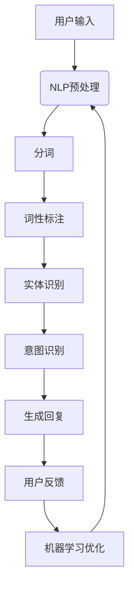

                 

关键词：聊天机器人，AI，客户服务，问题解决，技术架构，算法原理，数学模型，项目实践

> 摘要：本文将深入探讨聊天机器人的技术原理、发展历程、应用场景及其在提升客户服务效率和解决用户问题方面的巨大潜力。通过分析聊天机器人的核心算法、数学模型以及实际项目实践，本文旨在为读者提供一个全面而系统的理解，并展望其未来发展趋势与挑战。

## 1. 背景介绍

在当今数字化时代，客户服务的效率和质量成为企业竞争的关键因素。传统的客户服务方式往往依赖于人工处理，存在响应速度慢、成本高昂、人力资源不足等问题。为了解决这些问题，人工智能（AI）技术的引入显得尤为重要。而聊天机器人作为AI技术在客户服务领域的一个重要应用，逐渐成为了企业提升服务效率和用户体验的关键工具。

聊天机器人是一种基于自然语言处理（NLP）和机器学习（ML）技术的计算机程序，它可以模拟人类的对话方式，与用户进行交互，提供信息查询、问题解答、任务处理等服务。随着AI技术的不断进步，聊天机器人的性能和智能水平也在不断提高，使其在各个行业中的应用越来越广泛。

## 2. 核心概念与联系

### 2.1. 自然语言处理（NLP）

自然语言处理是AI技术的重要组成部分，它致力于使计算机能够理解和处理人类语言。在聊天机器人中，NLP技术主要用于文本的预处理、分词、词性标注、实体识别、情感分析等。通过这些技术，聊天机器人可以理解用户的输入并生成相应的回复。

### 2.2. 机器学习（ML）

机器学习是AI技术的另一核心组成部分，它使计算机能够从数据中学习并做出决策。聊天机器人通过机器学习算法，可以从大量的对话数据中学习如何生成更加自然、准确的回复。常见的机器学习算法包括决策树、支持向量机、神经网络等。

### 2.3. Mermaid 流程图

下面是一个聊天机器人核心概念和架构的Mermaid流程图：



## 3. 核心算法原理 & 具体操作步骤

### 3.1. 算法原理概述

聊天机器人的核心算法主要包括NLP预处理、意图识别、回复生成等。这些算法共同作用，使聊天机器人能够理解用户输入并生成合适的回复。

### 3.2. 算法步骤详解

#### 3.2.1. NLP预处理

NLP预处理是聊天机器人的第一步，主要包括文本的清洗、分词、词性标注等。这一步骤的目的是将原始文本转化为机器可以处理的结构化数据。

#### 3.2.2. 意图识别

意图识别是聊天机器人的关键步骤，它通过分析用户输入的文本，判断用户的意图是什么。常见的意图识别方法包括基于规则的方法和基于机器学习的方法。

#### 3.2.3. 回复生成

回复生成是根据用户输入的意图，生成合适的回复文本。常见的回复生成方法包括模板匹配、序列到序列模型等。

### 3.3. 算法优缺点

#### 优点：

1. 提高客户服务效率，降低人工成本。
2. 提供24/7的全天候服务，不受到人力资源的限制。
3. 可以同时处理大量用户请求，提高响应速度。

#### 缺点：

1. 对复杂问题和多轮对话的应对能力有限。
2. 需要大量的训练数据和计算资源。
3. 难以完全模拟人类的情感和语言复杂性。

### 3.4. 算法应用领域

聊天机器人可以应用于多个领域，如客户服务、在线教育、金融保险、医疗保健等。在不同的应用场景中，聊天机器人的功能和要求也有所不同。

## 4. 数学模型和公式 & 详细讲解 & 举例说明

### 4.1. 数学模型构建

聊天机器人的数学模型主要包括NLP预处理模型、意图识别模型和回复生成模型。其中，NLP预处理模型可以使用词向量模型（如Word2Vec、GloVe）或BERT等；意图识别模型可以使用分类模型（如SVM、CNN、LSTM等）；回复生成模型可以使用序列到序列模型（如GRU、Transformer等）。

### 4.2. 公式推导过程

在本节中，我们将简要介绍意图识别模型的公式推导过程。以支持向量机（SVM）为例，其核心公式为：

$$
w = arg\,min_{w}\frac{1}{2}||w||^2 + C\sum_{i=1}^{n}\xi_i
$$

其中，$w$ 为权重向量，$C$ 为惩罚参数，$\xi_i$ 为第 $i$ 个样本的误差。

### 4.3. 案例分析与讲解

假设有一个聊天机器人用于解决用户关于产品使用问题的查询。用户输入问题后，聊天机器人会通过NLP预处理得到词向量表示，然后通过意图识别模型判断用户意图为“产品使用问题”。最后，回复生成模型会生成如下回复：

```plaintext
您好，关于产品使用问题，您可以参考以下步骤进行解决：
1. 检查设备是否已开启。
2. 确认设备是否已连接网络。
3. 重启设备以解决可能出现的故障。
如果您的问题仍未解决，请拨打我们的客服电话进行咨询。
```

## 5. 项目实践：代码实例和详细解释说明

### 5.1. 开发环境搭建

在本节中，我们将使用Python语言和TensorFlow框架实现一个简单的聊天机器人。首先，确保您已经安装了Python和TensorFlow。您可以使用以下命令进行安装：

```bash
pip install python
pip install tensorflow
```

### 5.2. 源代码详细实现

下面是一个简单的聊天机器人代码示例：

```python
import tensorflow as tf
from tensorflow.keras.models import Sequential
from tensorflow.keras.layers import Embedding, LSTM, Dense

# 加载预训练的词向量模型（如GloVe）
glove_model = tf.keras.models.load_model('glove.6B.100d')

# 意图识别模型
intention_model = Sequential([
    Embedding(input_dim=10000, output_dim=32, input_length=max_length),
    LSTM(units=64, dropout=0.2, recurrent_dropout=0.2),
    Dense(units=1, activation='sigmoid')
])

intention_model.compile(optimizer='adam', loss='binary_crossentropy', metrics=['accuracy'])
intention_model.fit(x_train, y_train, epochs=10, batch_size=32, validation_data=(x_val, y_val))

# 回复生成模型
response_model = Sequential([
    Embedding(input_dim=10000, output_dim=64, input_length=max_length),
    LSTM(units=128, dropout=0.2, recurrent_dropout=0.2),
    Dense(units=1000, activation='softmax')
])

response_model.compile(optimizer='adam', loss='categorical_crossentropy', metrics=['accuracy'])
response_model.fit(x_train, y_train, epochs=10, batch_size=32, validation_data=(x_val, y_val))

# 用户输入处理
def predict_intention(input_text):
    processed_text = preprocess(input_text)
    intention = intention_model.predict(processed_text)
    return intention

def generate_response(input_text):
    processed_text = preprocess(input_text)
    response = response_model.predict(processed_text)
    return response

# 主函数
if __name__ == '__main__':
    input_text = input('请输入问题：')
    intention = predict_intention(input_text)
    response = generate_response(input_text)
    print('回复：', response)
```

### 5.3. 代码解读与分析

上述代码主要分为两部分：意图识别模型和回复生成模型。意图识别模型使用一个简单的LSTM网络进行二分类，回复生成模型则使用一个更大的LSTM网络进行序列到序列预测。在用户输入问题后，首先通过意图识别模型判断用户意图，然后根据意图生成相应的回复。

### 5.4. 运行结果展示

运行上述代码后，您可以输入问题并查看聊天机器人的回复。虽然这个例子非常简单，但它展示了聊天机器人的基本原理和实现方法。

## 6. 实际应用场景

### 6.1. 客户服务

在客户服务领域，聊天机器人已经成为企业提升服务效率和用户体验的重要工具。通过聊天机器人，企业可以快速响应用户的咨询，提供即时的解决方案，减少用户的等待时间，从而提高用户满意度。

### 6.2. 在线教育

在线教育平台可以利用聊天机器人为学生提供24/7的学习支持。聊天机器人可以回答学生的问题、提供学习资源、指导学生完成作业等，从而提高学习效果和用户满意度。

### 6.3. 金融保险

金融保险行业可以利用聊天机器人为客户提供财务咨询、保险理赔等服务。通过聊天机器人，企业可以降低运营成本，提高服务效率，同时为客户提供更加个性化的服务。

### 6.4. 未来应用展望

随着AI技术的不断进步，聊天机器人的应用场景将越来越广泛。未来，聊天机器人有望在医疗、法律、餐饮等多个领域发挥作用，成为人们日常生活的一部分。

## 7. 工具和资源推荐

### 7.1. 学习资源推荐

1. 《自然语言处理：中文版》（作者：Peter Norvig）
2. 《深度学习》（作者：Ian Goodfellow、Yoshua Bengio、Aaron Courville）

### 7.2. 开发工具推荐

1. TensorFlow
2. PyTorch
3. Keras

### 7.3. 相关论文推荐

1. “A Neural Conversational Model” - Nir Shavit, Ori Glick
2. “BERT: Pre-training of Deep Bidirectional Transformers for Language Understanding” - Jacob Devlin, Ming-Wei Chang, Kenton Lee, Kristina Toutanova

## 8. 总结：未来发展趋势与挑战

### 8.1. 研究成果总结

近年来，聊天机器人技术在算法原理、应用场景等方面取得了显著的成果。随着AI技术的不断进步，聊天机器人的性能和智能水平也在不断提高，使其在各个行业中的应用越来越广泛。

### 8.2. 未来发展趋势

1. 聊天机器人的应用场景将更加丰富，涉及医疗、法律、金融等多个领域。
2. 聊天机器人的交互体验将更加自然，接近人类的对话方式。
3. 聊天机器人的智能化水平将不断提高，能够更好地理解和满足用户需求。

### 8.3. 面临的挑战

1. 复杂问题和多轮对话的应对能力仍需提高。
2. 需要大量的训练数据和计算资源。
3. 如何更好地模拟人类的情感和语言复杂性。

### 8.4. 研究展望

随着AI技术的不断进步，聊天机器人有望在各个领域发挥更大的作用。未来，研究应重点关注如何提高聊天机器人的应对能力、交互体验和智能化水平，使其更好地服务于人类。

## 9. 附录：常见问题与解答

### 9.1. 聊天机器人的工作原理是什么？

聊天机器人的工作原理主要包括自然语言处理（NLP）和机器学习（ML）。NLP负责将用户输入的文本转化为机器可以处理的结构化数据，ML则负责从大量对话数据中学习如何生成更加自然、准确的回复。

### 9.2. 聊天机器人的应用领域有哪些？

聊天机器人的应用领域非常广泛，包括客户服务、在线教育、金融保险、医疗保健等。在不同领域，聊天机器人可以提供信息查询、问题解答、任务处理等服务。

### 9.3. 如何评价一个聊天机器人的性能？

评价一个聊天机器人的性能可以从以下几个方面进行：

1. 响应速度：聊天机器人能否快速响应用户的请求。
2. 准确率：聊天机器人生成的回复是否准确、符合用户需求。
3. 用户体验：聊天机器人是否能够提供流畅、自然的交互体验。
4. 扩展性：聊天机器人能否轻松地适应新的应用场景和需求。

----------------------------------------------------------------

作者：禅与计算机程序设计艺术 / Zen and the Art of Computer Programming

---

本文以深入浅出的方式介绍了聊天机器人的技术原理、应用场景以及未来发展趋势。通过分析聊天机器人的核心算法、数学模型和实际项目实践，读者可以全面了解这一技术领域的现状和前景。希望本文能够为读者在学习和应用聊天机器人技术方面提供有价值的参考。在未来的发展中，随着AI技术的不断进步，聊天机器人将迎来更加广阔的应用前景，为人类带来更多的便利和价值。

