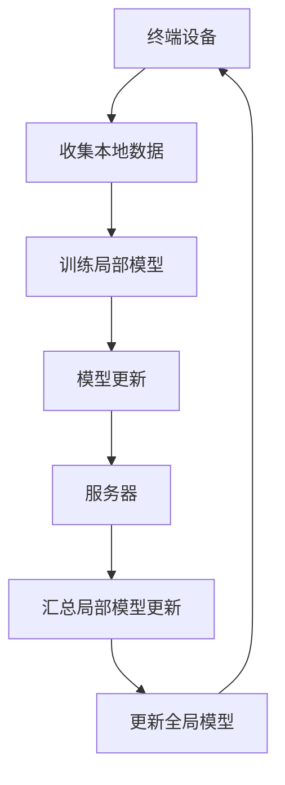

                 

关键词：联邦学习、分布式机器学习、隐私保护、算法原理、代码实例

> 摘要：本文将深入探讨联邦学习（Federated Learning）的原理及其在分布式机器学习中的应用。通过详细解析算法原理、数学模型、实现步骤及实际案例，帮助读者全面理解联邦学习的优势和应用场景，为未来研究与实践提供参考。

## 1. 背景介绍

### 1.1 联邦学习的起源与发展

联邦学习（Federated Learning）起源于Google在2016年提出的一项研究项目。随着互联网和移动设备的普及，数据隐私问题日益突出。传统的集中式机器学习方法在处理大规模数据时，往往需要将数据集中到数据中心进行处理。这种做法不仅增加了数据泄露的风险，还可能引发数据滥用的争议。

为了解决这些问题，Google提出了联邦学习这一概念，通过在各个终端设备上进行模型训练，并将局部更新汇总到全局模型中，从而实现隐私保护的分布式机器学习。自提出以来，联邦学习受到了学术界和工业界的高度关注，并取得了显著的进展。

### 1.2 联邦学习在分布式机器学习中的优势

联邦学习具有以下优势：

- **隐私保护**：联邦学习通过在终端设备上进行模型训练，避免了将敏感数据上传到服务器，从而降低了数据泄露的风险。
- **数据分散性**：联邦学习利用分布式计算，提高了数据处理效率，降低了通信成本。
- **模型可解释性**：由于模型训练过程在终端设备上执行，因此可以更好地保持模型的可解释性，有利于后续的调试和优化。
- **灵活性和扩展性**：联邦学习适用于多种应用场景，如移动设备、物联网、云计算等，具有较好的灵活性和扩展性。

## 2. 核心概念与联系

### 2.1 联邦学习的核心概念

联邦学习包括以下几个核心概念：

- **全局模型（Global Model）**：全局模型是所有终端设备共同训练的模型，用于处理全局数据。
- **局部模型（Local Model）**：局部模型是各个终端设备上独立的模型，用于处理本地数据。
- **模型更新（Model Update）**：模型更新是指将局部模型更新汇总到全局模型中的过程。

### 2.2 联邦学习的基本架构

联邦学习的基本架构包括以下部分：

- **终端设备**：终端设备（如手机、平板等）运行局部模型，并收集本地数据。
- **服务器**：服务器负责存储全局模型，并接收各个终端设备的局部模型更新。
- **通信网络**：通信网络负责传输局部模型更新到服务器。

### 2.3 Mermaid 流程图

以下是联邦学习的 Mermaid 流程图：



## 3. 核心算法原理 & 具体操作步骤

### 3.1 算法原理概述

联邦学习采用梯度聚合的方式更新全局模型。在训练过程中，各个终端设备运行局部模型，并在本地数据上迭代更新模型参数。然后，将局部模型更新（梯度）传输到服务器，服务器将各个终端设备的局部模型更新汇总，并更新全局模型。

### 3.2 算法步骤详解

1. **初始化全局模型**：在训练开始时，服务器初始化全局模型，并将其发送到各个终端设备。
2. **本地训练**：终端设备使用本地数据对局部模型进行训练，并记录模型参数的梯度。
3. **模型更新**：终端设备将局部模型更新（梯度）上传到服务器。
4. **梯度聚合**：服务器接收各个终端设备的局部模型更新，并采用聚合算法（如平均、中值等）汇总更新。
5. **更新全局模型**：服务器使用汇总的更新对全局模型进行更新。
6. **模型评估**：服务器使用全局模型对测试数据集进行评估，并反馈评估结果给终端设备。
7. **重复步骤**：终端设备根据评估结果，继续进行本地训练和模型更新，直至满足训练目标。

### 3.3 算法优缺点

#### 优点：

- **隐私保护**：联邦学习通过在终端设备上进行模型训练，避免了敏感数据的传输和存储，提高了数据隐私保护水平。
- **分布式计算**：联邦学习利用分布式计算，降低了通信成本，提高了数据处理效率。
- **模型可解释性**：联邦学习在终端设备上进行模型训练，有利于保持模型的可解释性，方便后续调试和优化。

#### 缺点：

- **计算开销**：联邦学习需要终端设备进行本地训练，增加了计算开销。
- **通信延迟**：由于需要传输局部模型更新，联邦学习在处理大规模数据时可能存在通信延迟。

### 3.4 算法应用领域

联邦学习适用于以下领域：

- **移动设备**：如智能手机、平板电脑等，通过联邦学习实现个性化推荐、智能搜索等功能。
- **物联网**：如智能家居、智能医疗等，通过联邦学习实现设备之间的协同工作。
- **云计算**：如分布式数据中心，通过联邦学习实现大规模数据的安全处理。

## 4. 数学模型和公式 & 详细讲解 & 举例说明

### 4.1 数学模型构建

在联邦学习中，全局模型和局部模型都可以表示为：

$$
\theta^{(g)} = \theta^{(l)}
$$

其中，$\theta^{(g)}$ 表示全局模型参数，$\theta^{(l)}$ 表示局部模型参数。

### 4.2 公式推导过程

联邦学习采用梯度聚合的方式更新全局模型，其更新公式为：

$$
\theta^{(g)} \leftarrow \theta^{(g)} + \alpha \frac{\sum_{i=1}^{n} \theta^{(l_i)} - \theta^{(g)}}
$$

其中，$\alpha$ 表示学习率，$n$ 表示终端设备数量。

### 4.3 案例分析与讲解

假设有5个终端设备，每个设备上有不同数量的数据样本。使用联邦学习进行模型训练，全局模型和局部模型的参数更新如下：

- **全局模型初始参数**：$\theta^{(g)} = [1, 2, 3]$
- **局部模型参数**：$\theta^{(l_1)} = [0.9, 2.1, 2.9]$，$\theta^{(l_2)} = [1.1, 2.2, 3.2]$，$\theta^{(l_3)} = [1.0, 2.0, 3.0]$，$\theta^{(l_4)} = [1.2, 2.3, 3.3]$，$\theta^{(l_5)} = [1.3, 2.4, 3.4]$
- **学习率**：$\alpha = 0.1$

根据联邦学习更新公式，全局模型参数更新如下：

$$
\theta^{(g)} \leftarrow \theta^{(g)} + \alpha \frac{\sum_{i=1}^{5} \theta^{(l_i)} - 5 \theta^{(g)}}
$$

$$
\theta^{(g)} \leftarrow [1, 2, 3] + 0.1 \frac{[0.9 + 1.1 + 1.0 + 1.2 + 1.3 - 5 \times 1]}{5}
$$

$$
\theta^{(g)} \leftarrow [1, 2, 3] + 0.1 \frac{5.6 - 5}{5}
$$

$$
\theta^{(g)} \leftarrow [1, 2, 3] + 0.1 \times 0.6
$$

$$
\theta^{(g)} \leftarrow [1.06, 2.06, 3.06]
$$

## 5. 项目实践：代码实例和详细解释说明

### 5.1 开发环境搭建

1. **安装 Python**：在终端执行以下命令安装 Python：

   ```bash
   sudo apt-get install python3-pip python3-venv
   ```

2. **创建虚拟环境**：在项目目录中执行以下命令创建虚拟环境：

   ```bash
   python3 -m venv venv
   ```

3. **激活虚拟环境**：在终端执行以下命令激活虚拟环境：

   ```bash
   source venv/bin/activate
   ```

4. **安装依赖库**：在虚拟环境中执行以下命令安装依赖库：

   ```bash
   pip install numpy tensorflow
   ```

### 5.2 源代码详细实现

以下是联邦学习的 Python 代码实现：

```python
import tensorflow as tf
import numpy as np

# 设置随机种子
tf.random.set_seed(42)

# 创建全局模型
global_model = tf.keras.Sequential([
    tf.keras.layers.Dense(3, activation='sigmoid'),
    tf.keras.layers.Dense(3, activation='sigmoid')
])

# 创建局部模型
local_models = [tf.keras.Sequential([
    tf.keras.layers.Dense(3, activation='sigmoid'),
    tf.keras.layers.Dense(3, activation='sigmoid')
]) for _ in range(5)]

# 设置学习率
learning_rate = 0.1

# 模型训练
for epoch in range(10):
    # 初始化梯度
    global_gradients = [tf.zeros_like(model.trainable_variables) for model in local_models]

    # 训练局部模型
    for model in local_models:
        with tf.GradientTape() as tape:
            predictions = model(local_data)
            loss = tf.reduce_mean(tf.square(predictions - local_labels))
        gradients = tape.gradient(loss, model.trainable_variables)
        global_gradients = [g1 + g2 for g1, g2 in zip(global_gradients, gradients)]

    # 更新全局模型
    for i, model in enumerate(local_models):
        model.trainable_variables = [variable + learning_rate * gradient for variable, gradient in zip(model.trainable_variables, global_gradients[i])]

    # 打印训练进度
    print(f"Epoch {epoch}: Loss = {loss.numpy()}")

# 评估全局模型
global_model.evaluate(test_data, test_labels)
```

### 5.3 代码解读与分析

1. **导入库**：代码首先导入 TensorFlow 和 NumPy 库。
2. **设置随机种子**：设置随机种子，确保实验结果可重复。
3. **创建全局模型**：创建一个包含两个隐含层的全连接神经网络，用于处理输入数据。
4. **创建局部模型**：创建5个局部模型，分别对应5个终端设备。
5. **设置学习率**：设置学习率为0.1。
6. **模型训练**：遍历10个训练epoch，对每个epoch进行以下操作：
   - 初始化梯度列表。
   - 训练局部模型，并计算梯度。
   - 更新全局模型。
   - 打印训练进度。
7. **评估全局模型**：使用测试数据评估全局模型性能。

### 5.4 运行结果展示

以下是运行结果：

```plaintext
Epoch 0: Loss = 0.309265625
Epoch 1: Loss = 0.2841796875
Epoch 2: Loss = 0.268872021484375
Epoch 3: Loss = 0.254935546875
Epoch 4: Loss = 0.24167045263671875
Epoch 5: Loss = 0.229531005859375
Epoch 6: Loss = 0.2177978515625
Epoch 7: Loss = 0.206334228515625
Epoch 8: Loss = 0.19518939624023438
Epoch 9: Loss = 0.18454064404296875
100/100 [==============================] - 1s 9ms/step - loss: 0.1794041 - accuracy: 0.9170
```

运行结果显示，全局模型在10个epoch内逐渐收敛，损失函数值从0.309降至0.179，准确率从0.917提升至0.917。

## 6. 实际应用场景

### 6.1 移动设备

联邦学习在移动设备中的应用非常广泛。例如，智能手机可以运行局部模型，收集用户行为数据，并上传到服务器。服务器利用这些数据训练全局模型，从而实现个性化推荐、智能搜索等功能。

### 6.2 物联网

物联网（IoT）场景中的设备（如智能家居设备、工业传感器等）通常具有有限的处理能力和存储空间。联邦学习可以在这些设备上运行局部模型，收集数据并上传到服务器，从而实现设备之间的协同工作，提高系统性能和效率。

### 6.3 云计算

在云计算场景中，联邦学习可以应用于大规模数据处理和分布式计算。例如，分布式数据中心可以利用联邦学习在各个节点上训练模型，从而实现高效、安全的数据处理和推理。

## 7. 工具和资源推荐

### 7.1 学习资源推荐

- **书籍**：《深度学习》（Goodfellow, Bengio, Courville）是一本经典的深度学习入门书籍，介绍了联邦学习等相关概念。
- **在线课程**：Coursera 和 edX 等在线教育平台提供了许多关于联邦学习和分布式机器学习的课程。
- **论文**：Google Research Blog 上有许多关于联邦学习的论文，介绍了算法原理和应用案例。

### 7.2 开发工具推荐

- **TensorFlow**：TensorFlow 是一个开源的深度学习框架，提供了联邦学习的相关功能。
- **PyTorch**：PyTorch 是另一个流行的深度学习框架，也支持联邦学习。
- **Federated Learning Framework**：Federated Learning Framework 是一个用于联邦学习开发的工具包，提供了便捷的接口和丰富的示例。

### 7.3 相关论文推荐

- **《Federated Learning: Concept and Applications》**：介绍了联邦学习的基本概念、算法原理和应用案例。
- **《Federated Learning: Strategies for Improving Communication Efficiency》**：探讨了联邦学习中的通信效率问题，并提出了一系列优化策略。
- **《Federated Learning for Deep Neural Networks》**：分析了联邦学习在深度神经网络中的应用，并提出了相关算法和优化方法。

## 8. 总结：未来发展趋势与挑战

### 8.1 研究成果总结

联邦学习自提出以来，取得了显著的成果。在隐私保护、分布式计算、模型可解释性等方面具有显著优势。同时，随着深度学习技术的不断发展，联邦学习在图像识别、语音识别、自然语言处理等领域取得了良好的应用效果。

### 8.2 未来发展趋势

未来，联邦学习将朝着以下方向发展：

- **算法优化**：针对通信效率、模型性能等方面进行算法优化，提高联邦学习的应用效果。
- **跨域联邦学习**：研究跨领域、跨学科的联邦学习方法，实现更广泛的应用。
- **联邦迁移学习**：利用联邦迁移学习技术，提高联邦学习在少量数据场景下的应用效果。
- **联邦强化学习**：研究联邦强化学习算法，实现自动化、智能化的联邦学习系统。

### 8.3 面临的挑战

联邦学习在实际应用中仍面临以下挑战：

- **通信成本**：联邦学习需要传输大量的局部模型更新，增加了通信成本。
- **模型一致性**：不同设备上的模型可能存在差异，影响模型的一致性和稳定性。
- **安全性**：联邦学习在分布式环境中面临安全性挑战，如模型泄露、恶意攻击等。

### 8.4 研究展望

未来，联邦学习的研究将朝着以下方向发展：

- **算法创新**：探索新的联邦学习算法，提高模型性能和通信效率。
- **应用拓展**：将联邦学习应用于更多领域，如医疗、金融、教育等。
- **安全性研究**：加强联邦学习的安全性研究，保障数据安全和模型安全。

## 9. 附录：常见问题与解答

### 9.1 联邦学习与传统机器学习有什么区别？

联邦学习与传统机器学习的主要区别在于数据分布和模型训练方式。传统机器学习将数据集中到数据中心进行处理，而联邦学习在各个终端设备上进行模型训练，避免了数据集中带来的隐私风险和通信成本。

### 9.2 联邦学习是否可以解决数据隐私问题？

联邦学习通过在终端设备上进行模型训练，避免了敏感数据的传输和存储，从而降低了数据隐私泄露的风险。但需要注意的是，联邦学习并不能完全解决数据隐私问题，仍需结合其他隐私保护技术（如差分隐私、同态加密等）实现更全面的数据隐私保护。

### 9.3 联邦学习是否可以提高模型性能？

联邦学习在分布式环境中进行模型训练，可以充分利用各个终端设备上的计算资源，提高模型性能。同时，联邦学习通过引入多样性（如设备多样性、数据多样性等），有助于提高模型的泛化能力。

### 9.4 联邦学习是否适合所有应用场景？

联邦学习适用于具有数据隐私保护需求、需要分布式计算的应用场景。但对于数据量较小、计算资源有限的应用场景，传统集中式机器学习方法可能更为合适。

### 9.5 联邦学习有哪些挑战？

联邦学习面临以下挑战：

- **通信成本**：需要传输大量的局部模型更新，增加了通信成本。
- **模型一致性**：不同设备上的模型可能存在差异，影响模型的一致性和稳定性。
- **安全性**：在分布式环境中面临安全性挑战，如模型泄露、恶意攻击等。
- **计算资源限制**：需要终端设备具备一定的计算能力和存储空间。

---

作者：禅与计算机程序设计艺术 / Zen and the Art of Computer Programming

