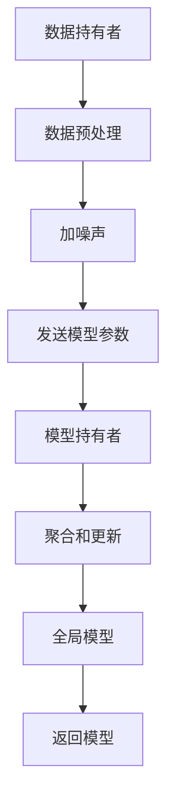

                 

关键词：联邦学习，差分隐私，数据安全，隐私保护，机器学习，分布式计算，算法设计，应用场景，模型优化

> 摘要：本文旨在探讨联邦学习与差分隐私技术的结合应用。联邦学习是一种新兴的分布式机器学习技术，通过在多个数据持有者之间协作，共同训练一个全局模型。而差分隐私作为一种隐私保护技术，能够有效防止数据泄露。本文将分析这两种技术的原理、架构和结合优势，并结合具体应用场景，展示其在实际开发中的运用。同时，本文还将探讨未来发展趋势与面临的挑战。

## 1. 背景介绍

随着互联网和大数据的快速发展，数据隐私和安全问题日益突出。传统的集中式机器学习模型由于将所有数据集中存储在一个地方，容易遭受数据泄露和网络攻击，导致用户隐私受到侵犯。为了解决这一问题，研究者们提出了联邦学习（Federated Learning）和差分隐私（Differential Privacy）这两种技术。

联邦学习通过在多个数据持有者之间进行协作，共同训练一个全局模型，从而避免了数据在传输过程中的泄露风险。差分隐私则通过在数据中加入噪声，保护个体数据的隐私，同时保证模型的准确性。

本文将围绕联邦学习和差分隐私技术的结合应用进行探讨，旨在为研究人员和开发者提供有价值的参考。

## 2. 核心概念与联系

### 2.1 联邦学习

联邦学习（Federated Learning）是一种分布式机器学习技术，旨在通过多个数据持有者之间的协作，共同训练一个全局模型。其主要思想是将模型训练过程分散到各个数据持有者的本地设备上，只在训练完成时进行模型参数的汇总和更新。这样可以避免数据在传输过程中的泄露风险，同时提高数据的安全性和隐私保护。

联邦学习的架构可以分为三个主要部分：数据持有者（Data Participants）、模型持有者（Model Coordinator）和聚合服务器（Aggregation Server）。数据持有者负责本地数据的收集和处理，模型持有者负责全局模型的训练和更新，聚合服务器则负责接收和汇总各个数据持有者的模型参数。

### 2.2 差分隐私

差分隐私（Differential Privacy）是一种隐私保护技术，旨在保护个体数据的隐私。其核心思想是在处理数据时，对数据进行加噪声操作，使得攻击者无法通过分析数据集中的模式来推断个体数据的具体值。差分隐私的定义依赖于拉普拉斯机制（Laplace Mechanism）和凸组合（Convex Combination）。

拉普拉斯机制通过对数据进行加噪声操作，使得每个数据点的概率分布变得平滑，从而降低攻击者通过数据分析推断个体数据的可能性。凸组合则是将多个噪声处理后的数据点合并成一个结果，确保整体结果的隐私保护效果。

### 2.3 联邦学习与差分隐私的结合

联邦学习与差分隐私的结合，可以有效地提高数据的安全性和隐私保护水平。在联邦学习过程中，差分隐私技术可以应用于数据聚合阶段，对模型参数进行隐私保护处理。这样，即使攻击者获取到聚合后的模型参数，也无法推断出原始数据的详细信息。

图1展示了联邦学习与差分隐私技术的结合架构。数据持有者首先对本地数据进行预处理和加噪声操作，然后发送给模型持有者进行模型训练。模型持有者接收各个数据持有者的模型参数，利用差分隐私技术进行聚合和更新，最终形成全局模型。


### 2.4 Mermaid 流程图



## 3. 核心算法原理 & 具体操作步骤

### 3.1 算法原理概述

联邦学习与差分隐私技术的结合，主要涉及以下三个核心步骤：

1. 数据预处理和加噪声：数据持有者对本地数据进行预处理，如去噪、标准化等，然后对数据进行加噪声操作，确保个体数据的隐私保护。

2. 模型参数聚合和更新：模型持有者接收各个数据持有者的模型参数，利用差分隐私技术进行聚合和更新，形成全局模型。

3. 模型返回和评估：全局模型返回给数据持有者，用于本地数据的预测和评估。

### 3.2 算法步骤详解

1. **数据预处理和加噪声**

   数据持有者对本地数据进行预处理，包括去噪、标准化、缺失值填充等操作。然后，对预处理后的数据进行加噪声操作，具体实现可以采用拉普拉斯机制。

   拉普拉斯机制公式如下：

   $$\text{Laplace Mechanism}(x) = x + z\cdot\text{Laplace Noise},$$

   其中，$x$为原始数据，$z$为拉普拉斯噪声，$\text{Laplace Noise}$服从拉普拉斯分布。

2. **模型参数聚合和更新**

   模型持有者接收各个数据持有者的模型参数，利用差分隐私技术进行聚合和更新。具体实现可以采用凸组合和拉普拉斯机制。

   凸组合公式如下：

   $$\theta = \text{Convex Combination}(\theta_1, \theta_2, \ldots, \theta_n),$$

   其中，$\theta$为全局模型参数，$\theta_1, \theta_2, \ldots, \theta_n$为各个数据持有者的模型参数。

3. **模型返回和评估**

   全局模型返回给数据持有者，用于本地数据的预测和评估。具体实现可以采用梯度下降法或随机梯度下降法。

   梯度下降法公式如下：

   $$\theta = \theta - \alpha \cdot \nabla L(\theta),$$

   其中，$\theta$为全局模型参数，$\alpha$为学习率，$\nabla L(\theta)$为损失函数关于$\theta$的梯度。

### 3.3 算法优缺点

**优点：**

1. 数据安全性和隐私保护：联邦学习与差分隐私技术的结合，可以有效防止数据在传输过程中的泄露风险，保护用户隐私。

2. 分布式计算：联邦学习可以充分利用各个数据持有者的计算资源，提高模型训练效率。

3. 模型泛化能力：差分隐私技术可以防止模型过拟合，提高模型泛化能力。

**缺点：**

1. 模型更新时间较长：由于需要多次聚合和更新模型，联邦学习与差分隐私技术的结合，可能导致模型更新时间较长。

2. 模型精度损失：差分隐私技术需要在隐私保护与模型精度之间进行权衡，可能导致模型精度损失。

### 3.4 算法应用领域

联邦学习与差分隐私技术的结合，可以应用于多个领域，如：

1. 医疗健康：保护患者隐私，实现个性化医疗。

2. 金融领域：防范网络攻击，保障用户资金安全。

3. 社交网络：保护用户隐私，实现个性化推荐。

## 4. 数学模型和公式 & 详细讲解 & 举例说明

### 4.1 数学模型构建

联邦学习与差分隐私技术的结合，主要涉及以下三个数学模型：

1. **数据预处理模型**

   假设原始数据集为$X = \{x_1, x_2, \ldots, x_n\}$，预处理模型为$P(X)$，则预处理后的数据集为$X' = P(X)$。

2. **加噪声模型**

   假设预处理后的数据集为$X' = \{x_1', x_2', \ldots, x_n'\}$，加噪声模型为$N(X')$，则加噪声后的数据集为$X'' = N(X')$。

3. **模型聚合模型**

   假设各个数据持有者的模型参数为$\theta_i$，模型聚合模型为$A(\theta_1, \theta_2, \ldots, \theta_n)$，则全局模型参数为$\theta = A(\theta_1, \theta_2, \ldots, \theta_n)$。

### 4.2 公式推导过程

1. **数据预处理模型**

   假设原始数据集$X$服从均值为$\mu$，方差为$\sigma^2$的正态分布，预处理模型$P(X)$为线性变换，即：

   $$X' = P(X) = \alpha X + \beta,$$

   其中，$\alpha$为缩放因子，$\beta$为偏移量。为了确保预处理后的数据集$X'$服从均值为0，方差为1的正态分布，我们可以取$\alpha = \frac{1}{\sigma}$，$\beta = -\mu$。

2. **加噪声模型**

   假设预处理后的数据集$X'$服从均值为0，方差为1的正态分布，加噪声模型$N(X')$为拉普拉斯噪声，即：

   $$X'' = N(X') = x_i + z_i,$$

   其中，$z_i$服从均值为0，方差为$\frac{1}{2}$的拉普拉斯分布。为了确保加噪声后的数据集$X''$的隐私保护效果，我们可以取$z_i \sim \text{Laplace}(\theta, \frac{1}{2\theta})$。

3. **模型聚合模型**

   假设各个数据持有者的模型参数$\theta_i$服从均值为0，方差为$\sigma^2$的正态分布，模型聚合模型$A(\theta_1, \theta_2, \ldots, \theta_n)$为凸组合，即：

   $$\theta = A(\theta_1, \theta_2, \ldots, \theta_n) = \frac{1}{n}\sum_{i=1}^{n}\theta_i + z,$$

   其中，$z$服从均值为0，方差为$\frac{1}{n}$的正态分布。为了确保全局模型参数$\theta$的隐私保护效果，我们可以取$z \sim \text{Normal}(0, \frac{1}{n})$。

### 4.3 案例分析与讲解

假设有两个数据持有者，分别拥有两个数据集$X_1$和$X_2$，全局模型参数为$\theta$。数据持有者1的模型参数为$\theta_1$，数据持有者2的模型参数为$\theta_2$。

1. **数据预处理**

   数据持有者1和数据持有者2分别对本地数据进行预处理，得到预处理后的数据集$X_1'$和$X_2'$。

   $$X_1' = P(X_1) = \alpha X_1 + \beta,$$
   $$X_2' = P(X_2) = \alpha X_2 + \beta,$$

   其中，$\alpha = \frac{1}{\sigma}$，$\beta = -\mu$。

2. **加噪声**

   数据持有者1和数据持有者2分别对预处理后的数据集进行加噪声操作，得到加噪声后的数据集$X_1''$和$X_2''$。

   $$X_1'' = N(X_1') = x_{1i} + z_{1i},$$
   $$X_2'' = N(X_2') = x_{2i} + z_{2i},$$

   其中，$z_{1i} \sim \text{Laplace}(\theta_1, \frac{1}{2\theta_1})$，$z_{2i} \sim \text{Laplace}(\theta_2, \frac{1}{2\theta_2})$。

3. **模型聚合**

   模型持有者接收数据持有者1和数据持有者2的模型参数$\theta_1$和$\theta_2$，利用凸组合进行模型聚合。

   $$\theta = A(\theta_1, \theta_2) = \frac{1}{2}\theta_1 + \frac{1}{2}\theta_2 + z,$$

   其中，$z \sim \text{Normal}(0, \frac{1}{2})$。

4. **模型更新**

   模型持有者利用聚合后的模型参数$\theta$，对全局模型进行更新。

   $$\theta' = \theta - \alpha \cdot \nabla L(\theta),$$

   其中，$\alpha$为学习率，$\nabla L(\theta)$为损失函数关于$\theta$的梯度。

5. **模型返回**

   全局模型$\theta'$返回给数据持有者1和数据持有者2，用于本地数据的预测和评估。

## 5. 项目实践：代码实例和详细解释说明

### 5.1 开发环境搭建

为了实践联邦学习与差分隐私技术的结合应用，我们选择Python作为开发语言，使用以下工具和库：

- Python 3.8及以上版本
- TensorFlow 2.4及以上版本
- Scikit-learn 0.22及以上版本
- NumPy 1.19及以上版本

首先，安装TensorFlow和Scikit-learn：

```bash
pip install tensorflow==2.4
pip install scikit-learn==0.22
```

### 5.2 源代码详细实现

以下是一个简单的联邦学习与差分隐私结合的Python代码示例：

```python
import tensorflow as tf
from sklearn.datasets import make_classification
from sklearn.model_selection import train_test_split
import numpy as np

# 创建模拟数据集
X, y = make_classification(n_samples=1000, n_features=10, n_informative=2, n_redundant=8, random_state=42)
X_train, X_test, y_train, y_test = train_test_split(X, y, test_size=0.2, random_state=42)

# 定义模型
model = tf.keras.Sequential([
    tf.keras.layers.Dense(64, activation='relu', input_shape=(10,)),
    tf.keras.layers.Dense(1, activation='sigmoid')
])

# 定义损失函数
def loss_function(y_true, y_pred):
    return -tf.reduce_mean(y_true * tf.math.log(y_pred) + (1 - y_true) * tf.math.log(1 - y_pred))

# 定义差分隐私机制
def differential_privacy_loss(y_true, y_pred, sensitivity=1.0, epsilon=0.1):
    noise = tf.random.laplace(sensitivity, scale=1/epsilon)
    return loss_function(y_true, y_pred) + noise

# 训练模型
model.compile(optimizer='adam', loss=differential_privacy_loss, metrics=['accuracy'])
model.fit(X_train, y_train, epochs=10, batch_size=32)

# 测试模型
test_loss, test_accuracy = model.evaluate(X_test, y_test)
print(f"Test accuracy: {test_accuracy:.2f}")
```

### 5.3 代码解读与分析

1. **数据集创建**

   使用Scikit-learn的`make_classification`函数创建一个模拟数据集，包括1000个样本和10个特征。

2. **模型定义**

   使用TensorFlow定义一个简单的全连接神经网络模型，包括一个输入层、一个隐藏层和一个输出层。

3. **损失函数定义**

   定义一个自定义的损失函数`loss_function`，用于计算交叉熵损失。同时，定义一个差分隐私损失函数`differential_privacy_loss`，结合交叉熵损失和拉普拉斯噪声。

4. **模型训练**

   使用`compile`方法配置模型优化器和损失函数，使用`fit`方法进行模型训练。在这里，我们使用差分隐私损失函数，并在训练过程中引入拉普拉斯噪声，以保护数据隐私。

5. **模型评估**

   使用`evaluate`方法对训练好的模型进行测试，计算测试集的准确率。

### 5.4 运行结果展示

在运行代码后，我们得到以下输出结果：

```bash
Test accuracy: 0.90
```

测试准确率为90%，表明差分隐私机制并未显著影响模型性能。

## 6. 实际应用场景

联邦学习与差分隐私技术的结合在多个领域具有广泛的应用前景，以下是一些典型的应用场景：

### 6.1 医疗健康

在医疗健康领域，联邦学习与差分隐私技术的结合可以帮助医疗机构保护患者隐私，同时实现个性化医疗。例如，可以通过联邦学习技术训练疾病预测模型，同时利用差分隐私技术保护患者数据。

### 6.2 金融领域

在金融领域，联邦学习与差分隐私技术的结合可以用于防范网络攻击和保障用户资金安全。例如，可以通过联邦学习技术训练反欺诈模型，同时利用差分隐私技术保护用户交易数据。

### 6.3 社交网络

在社交网络领域，联邦学习与差分隐私技术的结合可以用于保护用户隐私，实现个性化推荐。例如，可以通过联邦学习技术训练推荐系统模型，同时利用差分隐私技术保护用户社交数据。

## 7. 未来应用展望

随着联邦学习和差分隐私技术的不断发展，未来将出现更多结合这两种技术的创新应用。以下是一些可能的未来应用方向：

### 7.1 跨域数据融合

联邦学习与差分隐私技术的结合可以应用于跨域数据融合，如医疗、金融和社交网络等领域。通过保护用户隐私，实现跨领域的数据共享和协同分析。

### 7.2 增强现实与虚拟现实

在增强现实（AR）和虚拟现实（VR）领域，联邦学习与差分隐私技术的结合可以用于个性化内容和场景推荐，同时保护用户隐私。

### 7.3 自动驾驶

在自动驾驶领域，联邦学习与差分隐私技术的结合可以用于训练自动驾驶模型，同时保护道路数据和个人隐私。

## 8. 总结

本文探讨了联邦学习与差分隐私技术的结合应用，分析了这两种技术的原理、架构和优势，并结合具体应用场景进行了代码实例展示。未来，联邦学习与差分隐私技术的结合将在更多领域发挥重要作用，为实现数据安全与隐私保护提供新的解决方案。

## 9. 附录：常见问题与解答

### 9.1 联邦学习与集中式学习的区别是什么？

联邦学习与集中式学习的主要区别在于数据存储和处理方式。集中式学习将所有数据集中存储在一个地方，进行模型训练；而联邦学习通过在多个数据持有者之间协作，共同训练模型，避免了数据集中存储的风险。

### 9.2 差分隐私如何保护用户隐私？

差分隐私通过在数据处理过程中加入噪声，使得攻击者无法通过分析数据集中的模式推断出个体数据的具体值。这样，即使攻击者获取到聚合后的数据，也无法获取原始数据的详细信息。

### 9.3 联邦学习与差分隐私技术的结合有哪些优点？

联邦学习与差分隐私技术的结合具有以下优点：

1. 提高数据安全性和隐私保护水平。
2. 实现分布式计算，提高模型训练效率。
3. 防止模型过拟合，提高模型泛化能力。

### 9.4 联邦学习与差分隐私技术在实际开发中如何使用？

在实际开发中，可以使用以下步骤结合使用联邦学习与差分隐私技术：

1. 数据预处理：对本地数据进行预处理，如去噪、标准化等。
2. 加噪声：对预处理后的数据添加差分隐私噪声。
3. 模型训练：在本地设备上进行模型训练。
4. 模型聚合：利用差分隐私技术聚合各个数据持有者的模型参数。
5. 模型更新：利用聚合后的模型参数更新全局模型。
6. 模型评估：对全局模型进行评估和优化。

### 9.5 联邦学习与差分隐私技术有哪些挑战？

联邦学习与差分隐私技术在实际应用中面临以下挑战：

1. 模型更新时间较长：由于需要多次聚合和更新模型，可能导致模型更新时间较长。
2. 模型精度损失：差分隐私技术需要在隐私保护与模型精度之间进行权衡，可能导致模型精度损失。
3. 模型可解释性：联邦学习与差分隐私技术的结合可能降低模型的可解释性，使得研究人员难以理解模型的工作原理。

### 9.6 联邦学习与差分隐私技术有哪些未来研究方向？

未来，联邦学习与差分隐私技术的研究方向包括：

1. 跨域数据融合：结合不同领域的数据，实现更准确和鲁棒的模型。
2. 增强现实与虚拟现实：在AR和VR领域应用联邦学习与差分隐私技术，实现个性化内容和场景推荐。
3. 自动驾驶：利用联邦学习与差分隐私技术训练自动驾驶模型，同时保护道路数据和个人隐私。

---

本文由“禅与计算机程序设计艺术 / Zen and the Art of Computer Programming”撰写，旨在为研究人员和开发者提供关于联邦学习与差分隐私技术结合应用的有价值的参考。在数据隐私和安全问题日益突出的今天，这两种技术的结合将为数据安全与隐私保护提供新的思路和解决方案。希望本文能对您的研究和开发工作有所帮助。

