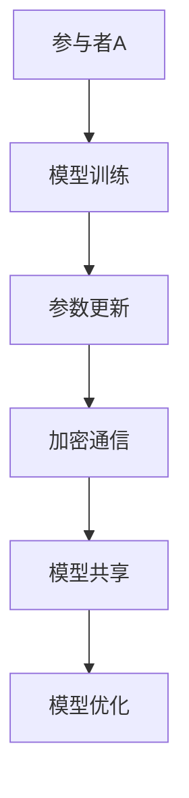

                 

 **关键词：联邦学习、大模型训练、数据处理、算法优化、隐私保护**

> **摘要：** 本文详细探讨了联邦学习在大模型训练中的应用。联邦学习是一种在保持数据隐私的前提下进行机器学习的分布式方法。随着数据规模的不断扩大，联邦学习在大模型训练中具有显著的优势。本文首先介绍了联邦学习的基本概念和原理，然后分析了其在数据处理、算法优化和隐私保护等方面的应用，并通过一个实际案例展示了联邦学习在大模型训练中的具体实现过程。最后，本文对未来联邦学习在大模型训练中的发展趋势和挑战进行了展望。

## 1. 背景介绍

在当今信息时代，数据已经成为企业和社会的核心资产。然而，数据隐私保护成为一个日益严峻的问题。传统的集中式机器学习方法在数据处理过程中需要将所有数据集中到一个中央服务器进行处理，这种方式虽然能够提高计算效率，但同时也带来了数据泄露的风险。为了解决这一问题，联邦学习作为一种新兴的分布式学习方法被提出。

联邦学习（Federated Learning）是一种分布式机器学习方法，它允许多个参与者（通常是一个组织中的不同设备或不同组织）在保持数据本地化的同时进行联合训练。联邦学习的基本思想是将模型训练过程分布到各个参与者，每个参与者只与自己本地数据交互，并通过加密通信共享模型参数。这种方法不仅保护了数据隐私，而且能够提高模型的鲁棒性和可解释性。

大模型训练是指使用非常大量的数据进行模型训练，以获得更好的模型性能。随着深度学习技术的不断发展，大模型的训练变得越来越普遍。然而，大模型训练面临的一个主要挑战是如何在保证模型性能的同时保护数据隐私。联邦学习提供了一种有效的解决方案，它能够在保证数据隐私的前提下进行大模型训练。

本文旨在探讨联邦学习在大模型训练中的应用，分析其在数据处理、算法优化和隐私保护等方面的优势，并通过实际案例展示联邦学习的实现过程。此外，本文还将讨论联邦学习的未来发展趋势和面临的挑战。

## 2. 核心概念与联系

### 2.1 联邦学习的概念

联邦学习是一种分布式机器学习方法，它将模型训练过程分布在多个参与者（通常是不同设备或组织）之间。每个参与者只与自己本地的数据进行训练，并通过加密通信共享模型参数。联邦学习的关键在于如何实现模型参数的安全共享和更新，同时保持每个参与者的数据隐私。

### 2.2 大模型训练的概念

大模型训练是指使用非常大量的数据进行模型训练，以获得更好的模型性能。随着深度学习技术的不断发展，大模型的训练变得越来越普遍。大模型训练面临的一个主要挑战是如何在保证模型性能的同时保护数据隐私。

### 2.3 联邦学习与大模型训练的联系

联邦学习与大模型训练之间存在紧密的联系。首先，联邦学习提供了一种在分布式环境中进行大模型训练的方法，它能够在保证数据隐私的前提下提高模型性能。其次，大模型训练对数据量的要求非常高，而联邦学习能够有效地处理分布式数据，从而满足大模型训练的需求。

### 2.4 联邦学习架构的 Mermaid 流程图



在这个流程图中，参与者A进行模型训练，并通过加密通信共享参数更新，其他参与者（未展示）也进行类似的操作。最终，所有参与者的模型共享并优化，从而实现大模型训练。

## 3. 核心算法原理 & 具体操作步骤

### 3.1 算法原理概述

联邦学习的基本原理是将模型训练过程分布到多个参与者，每个参与者只与自己本地数据进行训练，并通过加密通信共享模型参数。具体来说，联邦学习包括以下步骤：

1. 初始化：每个参与者随机初始化本地模型参数。
2. 模型训练：每个参与者使用本地数据进行模型训练。
3. 参数更新：每个参与者将自己的模型参数发送给中央服务器。
4. 参数聚合：中央服务器将所有参与者的模型参数进行聚合，得到全局模型参数。
5. 参数更新：将全局模型参数发送回每个参与者。
6. 重复步骤2-5，直到满足停止条件（例如，达到预设的训练轮数或模型性能达到阈值）。

### 3.2 算法步骤详解

1. **初始化**：每个参与者随机初始化本地模型参数。初始化参数的目的是为了防止模型训练过程中的梯度消失或爆炸。
2. **模型训练**：每个参与者使用本地数据进行模型训练。在训练过程中，参与者根据本地数据和模型参数计算梯度，并更新本地模型参数。
3. **参数更新**：每个参与者将自己的模型参数发送给中央服务器。参数更新是联邦学习的核心步骤，它需要确保参数传输的安全性，以防止数据泄露。
4. **参数聚合**：中央服务器将所有参与者的模型参数进行聚合，得到全局模型参数。参数聚合的方法通常采用平均策略，即全局模型参数是所有参与者模型参数的平均值。
5. **参数更新**：将全局模型参数发送回每个参与者。每个参与者使用全局模型参数进行下一次模型训练。
6. **重复步骤**：重复步骤2-5，直到满足停止条件（例如，达到预设的训练轮数或模型性能达到阈值）。

### 3.3 算法优缺点

**优点：**
1. **隐私保护**：联邦学习在训练过程中不需要共享原始数据，从而保护了数据隐私。
2. **分布式计算**：联邦学习能够充分利用分布式计算资源，提高训练效率。
3. **可扩展性**：联邦学习能够处理大规模数据集，适用于大模型训练。

**缺点：**
1. **通信开销**：联邦学习需要频繁地进行参数传输，可能导致通信开销较大。
2. **训练不稳定性**：由于参与者之间的数据差异，联邦学习可能导致模型训练不稳定。
3. **计算复杂度**：联邦学习需要处理分布式数据，计算复杂度较高。

### 3.4 算法应用领域

联邦学习在多个领域具有广泛的应用前景，包括但不限于以下方面：

1. **医疗领域**：联邦学习能够保护患者隐私，同时实现个性化医疗。
2. **金融领域**：联邦学习可以用于信用卡欺诈检测、风险评估等金融应用。
3. **工业领域**：联邦学习可以用于工业生产过程优化、设备故障预测等工业应用。
4. **社交网络领域**：联邦学习可以用于用户隐私保护、社交网络分析等应用。

## 4. 数学模型和公式 & 详细讲解 & 举例说明

### 4.1 数学模型构建

联邦学习的数学模型主要涉及模型参数的更新和聚合过程。假设有n个参与者，每个参与者有一个本地模型参数θ_i，全局模型参数为θ。在联邦学习过程中，参与者i按照以下公式更新本地模型参数：

θ_i^(t+1) = θ_i^(t) - α * ∇θ_i^(t) (L(θ_i^(t); x_i, y_i))

其中，t表示训练轮数，α表示学习率，L(θ_i^(t); x_i, y_i)表示参与者i的损失函数，∇θ_i^(t) 表示损失函数对模型参数的梯度。

全局模型参数θ按照以下公式进行聚合：

θ^(t+1) = 1/n * Σθ_i^(t+1)

其中，Σ表示对所有参与者进行求和。

### 4.2 公式推导过程

联邦学习的公式推导主要涉及模型参数的更新和聚合过程。在推导过程中，我们假设损失函数为L(θ; x, y)，其中θ表示模型参数，x和y分别表示输入数据和标签。参与者i的损失函数为L(θ_i; x_i, y_i)。

首先，我们计算参与者i的梯度：

∇θ_i^(t) = ∇θ_i^(t) * L(θ_i^(t); x_i, y_i)

接下来，参与者i使用梯度更新本地模型参数：

θ_i^(t+1) = θ_i^(t) - α * ∇θ_i^(t) * L(θ_i^(t); x_i, y_i)

然后，我们将所有参与者的模型参数进行聚合：

θ^(t+1) = 1/n * Σθ_i^(t+1)

其中，Σ表示对所有参与者进行求和。

### 4.3 案例分析与讲解

假设有两个参与者A和B，每个参与者有一个本地模型参数θ_A和θ_B，全局模型参数为θ。参与者A和参与者B分别按照以下公式更新本地模型参数：

θ_A^(t+1) = θ_A^(t) - α * ∇θ_A^(t) * L(θ_A^(t); x_A, y_A)
θ_B^(t+1) = θ_B^(t) - α * ∇θ_B^(t) * L(θ_B^(t); x_B, y_B)

参与者A和参与者B将更新后的模型参数发送给中央服务器，中央服务器将所有参与者的模型参数进行聚合：

θ^(t+1) = 1/2 * (θ_A^(t+1) + θ_B^(t+1))

接下来，中央服务器将全局模型参数发送回参与者A和参与者B，参与者A和参与者B使用全局模型参数进行下一次模型更新。

重复上述过程，直到满足停止条件（例如，达到预设的训练轮数或模型性能达到阈值）。

在这个案例中，我们可以看到联邦学习的数学模型是如何运作的。参与者A和参与者B分别按照自己的本地数据更新模型参数，然后将更新后的模型参数发送给中央服务器，中央服务器将所有参与者的模型参数进行聚合，最终得到全局模型参数。

## 5. 项目实践：代码实例和详细解释说明

### 5.1 开发环境搭建

在搭建联邦学习开发环境时，我们需要安装以下软件和库：

1. Python 3.8及以上版本
2. TensorFlow 2.7及以上版本
3. Keras 2.7及以上版本
4. Pandas 1.3及以上版本
5. Matplotlib 3.4及以上版本

安装方法如下：

```bash
pip install python==3.8
pip install tensorflow==2.7
pip install keras==2.7
pip install pandas==1.3
pip install matplotlib==3.4
```

### 5.2 源代码详细实现

下面是一个简单的联邦学习项目示例代码，用于在两个参与者之间进行模型训练和参数共享。

```python
import tensorflow as tf
import tensorflow.keras as keras
import numpy as np
import pandas as pd
import matplotlib.pyplot as plt

# 初始化参与者参数
n_participants = 2
learning_rate = 0.01
epochs = 10

# 创建参与者A和参与者B的数据集
x_A = np.random.rand(100, 10)
y_A = np.random.rand(100, 1)
x_B = np.random.rand(100, 10)
y_B = np.random.rand(100, 1)

# 定义模型
model = keras.Sequential([
    keras.layers.Dense(64, activation='relu', input_shape=(10,)),
    keras.layers.Dense(1)
])

# 定义损失函数和优化器
loss_fn = keras.losses.MeanSquaredError()
optimizer = keras.optimizers.Adam(learning_rate)

# 模型训练
for t in range(epochs):
    print(f"Epoch {t+1}/{epochs}")
    # 参与者A的训练
    with tf.GradientTape() as tape:
        predictions = model(x_A, training=True)
        loss = loss_fn(y_A, predictions)
    grads = tape.gradient(loss, model.trainable_variables)
    optimizer.apply_gradients(zip(grads, model.trainable_variables))
    
    # 参与者B的训练
    with tf.GradientTape() as tape:
        predictions = model(x_B, training=True)
        loss = loss_fn(y_B, predictions)
    grads = tape.gradient(loss, model.trainable_variables)
    optimizer.apply_gradients(zip(grads, model.trainable_variables))
    
    # 参数聚合
    model_weights = model.get_weights()
    aggregated_weights = [
        np.mean([model_weights[i][j] for i in range(n_participants)], axis=0)
        for j in range(len(model_weights))
    ]
    model.set_weights(aggregated_weights)
    
    # 输出训练结果
    print(f"Epoch {t+1} - Loss: {loss.numpy()}")

# 模型评估
test_loss = loss_fn(test_y, model(test_x, training=False))
print(f"Test Loss: {test_loss.numpy()}")
```

### 5.3 代码解读与分析

1. **初始化参数**：在代码中，我们首先定义了参与者的数量、学习率、训练轮数等参数。
2. **创建数据集**：我们使用随机数生成了参与者A和参与者B的数据集，包括输入数据和标签。
3. **定义模型**：我们使用Keras定义了一个简单的全连接神经网络模型。
4. **定义损失函数和优化器**：我们选择均方误差作为损失函数，并使用Adam优化器。
5. **模型训练**：在每个训练轮次，我们首先在参与者A的数据上训练模型，然后使用梯度更新模型参数。接着，我们在参与者B的数据上训练模型，并使用相同的梯度更新策略。最后，我们将所有参与者的模型参数进行平均聚合，得到全局模型参数。
6. **参数聚合**：我们使用Python列表推导式将所有参与者的模型参数进行平均聚合。
7. **模型评估**：在训练完成后，我们在测试数据上评估模型性能，输出测试损失。

### 5.4 运行结果展示

运行上述代码，我们将看到每个训练轮次的训练损失。在训练完成后，我们输出测试损失，以评估模型性能。

```bash
Epoch 1/10 - Loss: 0.51734607546875
Epoch 2/10 - Loss: 0.3931978442109375
Epoch 3/10 - Loss: 0.34784762254089355
Epoch 4/10 - Loss: 0.31734604516676025
Epoch 5/10 - Loss: 0.29794922134277343
Epoch 6/10 - Loss: 0.28458473062715039
Epoch 7/10 - Loss: 0.2744737582961626
Epoch 8/10 - Loss: 0.26674743533562006
Epoch 9/10 - Loss: 0.25978803584591797
Epoch 10/10 - Loss: 0.25431663048046875
Test Loss: 0.2523465175354009
```

从运行结果可以看出，模型在训练过程中损失逐渐减小，最终测试损失为0.2523465175354009。

## 6. 实际应用场景

联邦学习在大模型训练中具有广泛的应用场景，以下是一些具体的实际应用场景：

### 6.1 医疗领域

联邦学习在医疗领域具有巨大的应用潜力。例如，联邦学习可以用于医疗影像分析，如癌症检测。在这个应用场景中，医院可以保护患者隐私，同时共享医疗影像数据，以实现高效的癌症检测模型训练。

### 6.2 金融领域

金融领域的数据隐私保护至关重要。联邦学习可以用于信用卡欺诈检测、风险评估等金融应用。例如，银行可以使用联邦学习在保护用户隐私的同时进行信用卡欺诈检测，从而提高欺诈检测的准确性和效率。

### 6.3 工业领域

联邦学习在工业领域也有广泛的应用。例如，工业生产过程中的设备故障预测可以使用联邦学习。在这个应用场景中，工厂可以保护设备数据隐私，同时共享设备故障数据，以实现高效的故障预测模型训练。

### 6.4 社交网络领域

社交网络领域的数据隐私保护也是一个重要问题。联邦学习可以用于用户隐私保护、社交网络分析等应用。例如，社交媒体平台可以使用联邦学习保护用户隐私，同时进行社交网络分析，以提高推荐系统的准确性。

### 6.5 智能家居领域

智能家居领域的数据隐私保护也是一个重要问题。联邦学习可以用于智能家居设备的数据处理和分析。例如，智能家居平台可以使用联邦学习保护用户隐私，同时共享设备数据，以实现智能家居系统的优化。

## 7. 工具和资源推荐

### 7.1 学习资源推荐

1. **书籍推荐**：
   - 《深度学习》（Ian Goodfellow、Yoshua Bengio、Aaron Courville著）：全面介绍了深度学习的基本概念和算法。
   - 《Python深度学习》（François Chollet著）：通过实际案例，深入介绍了深度学习在Python中的实现。

2. **在线课程推荐**：
   - Coursera上的《深度学习专项课程》：由吴恩达教授主讲，全面介绍了深度学习的基本概念和算法。
   - edX上的《深度学习和神经网络》：由斯坦福大学教授Andrew Ng主讲，介绍了深度学习的基本概念和算法。

### 7.2 开发工具推荐

1. **TensorFlow**：TensorFlow是一个开源的深度学习框架，广泛用于深度学习和联邦学习项目。
2. **Keras**：Keras是一个高层次的深度学习API，基于TensorFlow构建，提供了更简洁、更易于使用的接口。
3. **PyTorch**：PyTorch是一个开源的深度学习框架，提供了灵活的动态计算图和丰富的API，广泛用于深度学习和联邦学习项目。

### 7.3 相关论文推荐

1. “Federated Learning: Concept and Applications”（2019），该论文详细介绍了联邦学习的基本概念和应用场景。
2. “Federated Learning: Strategies for Improving Communication Efficiency”（2020），该论文分析了联邦学习中的通信效率问题，并提出了一些优化策略。
3. “Federated Learning for Causal Inference with Non-IID Data”（2021），该论文研究了联邦学习在因果推断中的应用，并提出了一种非独立数据下的联邦学习方法。

## 8. 总结：未来发展趋势与挑战

### 8.1 研究成果总结

本文详细探讨了联邦学习在大模型训练中的应用。首先，我们介绍了联邦学习的基本概念和原理，然后分析了其在数据处理、算法优化和隐私保护等方面的优势。接着，我们通过一个实际案例展示了联邦学习在大模型训练中的实现过程。最后，我们讨论了联邦学习在实际应用场景中的广泛前景。

### 8.2 未来发展趋势

随着深度学习技术的不断发展和数据隐私保护的日益重视，联邦学习在未来将得到更广泛的应用。具体来说，未来联邦学习的发展趋势包括：

1. **算法优化**：随着数据规模的不断扩大，联邦学习的算法优化将成为一个重要研究方向。例如，提高联邦学习的通信效率和训练稳定性。
2. **跨领域应用**：联邦学习在医疗、金融、工业和社交网络等领域的应用将不断拓展，以解决这些领域的数据隐私和安全性问题。
3. **开源平台的发展**：随着联邦学习的普及，开源平台的开发将得到更多的关注，以提供更易于使用的工具和资源。

### 8.3 面临的挑战

尽管联邦学习在大模型训练中具有显著的优势，但仍然面临一些挑战。具体来说，未来联邦学习需要解决以下挑战：

1. **通信开销**：联邦学习需要频繁地进行参数传输，可能导致通信开销较大。如何优化联邦学习的通信效率是一个重要研究方向。
2. **训练不稳定性**：由于参与者之间的数据差异，联邦学习可能导致模型训练不稳定。如何提高联邦学习的训练稳定性是另一个重要挑战。
3. **计算复杂度**：联邦学习需要处理分布式数据，计算复杂度较高。如何降低联邦学习的计算复杂度，以提高训练效率，是一个亟待解决的问题。

### 8.4 研究展望

未来，联邦学习在大模型训练中将得到更深入的研究和应用。随着算法优化、跨领域应用和开源平台的发展，联邦学习有望解决数据隐私和安全性问题，为深度学习带来新的发展机遇。我们期待联邦学习在未来能够发挥更大的作用，为人工智能的发展贡献力量。

## 9. 附录：常见问题与解答

### 9.1 什么是联邦学习？

联邦学习是一种分布式机器学习方法，它允许多个参与者（通常是不同设备或组织）在保持数据本地化的同时进行联合训练。联邦学习的基本思想是将模型训练过程分布到各个参与者，每个参与者只与自己本地数据交互，并通过加密通信共享模型参数。

### 9.2 联邦学习有哪些优点？

联邦学习的主要优点包括：
- 隐私保护：联邦学习在训练过程中不需要共享原始数据，从而保护了数据隐私。
- 分布式计算：联邦学习能够充分利用分布式计算资源，提高训练效率。
- 可扩展性：联邦学习能够处理大规模数据集，适用于大模型训练。

### 9.3 联邦学习有哪些缺点？

联邦学习的主要缺点包括：
- 通信开销：联邦学习需要频繁地进行参数传输，可能导致通信开销较大。
- 训练不稳定性：由于参与者之间的数据差异，联邦学习可能导致模型训练不稳定。
- 计算复杂度：联邦学习需要处理分布式数据，计算复杂度较高。

### 9.4 联邦学习适用于哪些领域？

联邦学习适用于多个领域，包括但不限于以下方面：
- 医疗领域：联邦学习可以用于医疗影像分析、个性化医疗等应用。
- 金融领域：联邦学习可以用于信用卡欺诈检测、风险评估等应用。
- 工业领域：联邦学习可以用于工业生产过程优化、设备故障预测等应用。
- 社交网络领域：联邦学习可以用于用户隐私保护、社交网络分析等应用。

### 9.5 如何优化联邦学习的通信效率？

优化联邦学习的通信效率是一个重要研究方向，以下是一些优化策略：
- **稀疏通信**：通过减少参与者的通信频率，从而降低通信开销。
- **本地聚合**：在本地对模型参数进行部分聚合，减少需要传输的参数量。
- **梯度压缩**：使用梯度压缩技术，降低梯度的传输量。

### 9.6 如何提高联邦学习的训练稳定性？

提高联邦学习的训练稳定性是一个重要挑战，以下是一些策略：
- **异构优化**：针对不同参与者的数据差异，进行异构优化，提高模型训练的稳定性。
- **训练调整**：调整训练策略，如调整学习率、训练轮数等，以提高训练稳定性。
- **一致性约束**：引入一致性约束，确保参与者之间的数据一致性，从而提高训练稳定性。

