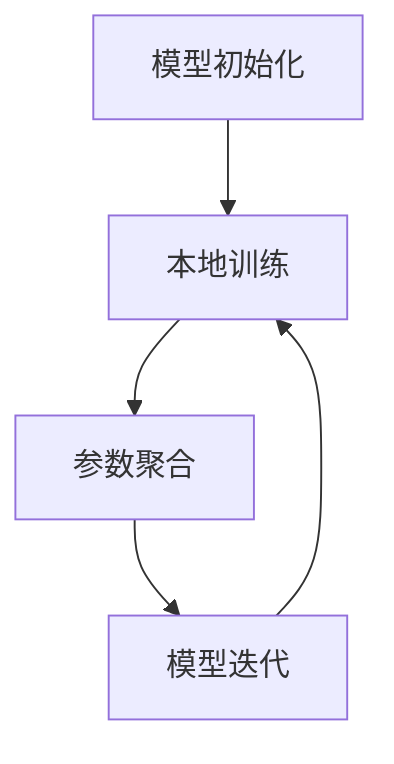

                 

关键词：联邦学习、隐私保护、攻击策略、防御机制、数据安全、分布式计算

在当今的数据驱动时代，机器学习算法的广泛应用为各行各业带来了巨大的价值。然而，传统集中式机器学习模型在数据处理过程中，面临着数据隐私泄露的严重风险。为了解决这一问题，联邦学习（Federated Learning）作为一种新型的分布式机器学习技术被提出。然而，联邦学习系统也并非完全免疫于隐私攻击，本文将深入探讨联邦学习中的隐私攻击与防御策略。

## 1. 背景介绍

随着互联网的普及和大数据技术的发展，数据隐私保护成为亟待解决的重要问题。传统的集中式机器学习模型需要将用户的敏感数据上传到中央服务器进行训练，这无疑增加了数据泄露的风险。为了解决这一问题，联邦学习通过在多个参与方之间协作进行模型训练，而无需交换原始数据，从而实现了数据隐私保护。然而，联邦学习系统在数据加密、通信安全等方面仍然存在诸多挑战，隐私攻击的威胁不容忽视。

## 2. 核心概念与联系

### 2.1 联邦学习原理

联邦学习是一种分布式机器学习技术，其核心思想是在多个参与方之间共享全局模型，并通过本地训练和参数更新来实现模型优化。具体来说，联邦学习过程可以分为以下几个步骤：

1. **模型初始化**：中央服务器向参与方分发全局模型的初始参数。
2. **本地训练**：参与方使用本地数据对全局模型进行本地训练，生成本地模型更新。
3. **参数聚合**：中央服务器收集并聚合参与方的本地模型更新，生成全局模型更新。
4. **模型迭代**：中央服务器将全局模型更新分发回参与方，重复本地训练和参数聚合过程。

### 2.2 Mermaid 流程图

下面是联邦学习流程的 Mermaid 流程图表示：



## 3. 核心算法原理 & 具体操作步骤

### 3.1 算法原理概述

联邦学习算法的原理基于分布式优化和加密技术。分布式优化通过本地训练和参数聚合实现全局模型的优化，而加密技术则用于保护数据隐私。常见的加密技术包括同态加密和差分隐私等。

### 3.2 算法步骤详解

1. **模型初始化**：中央服务器随机生成全局模型参数，并加密后发送给参与方。
2. **本地训练**：参与方使用本地数据和加密的全局模型参数进行本地训练，生成本地模型更新。
3. **参数加密传输**：参与方将本地模型更新加密后发送给中央服务器。
4. **参数聚合**：中央服务器收集并聚合参与方的本地模型更新，生成全局模型更新。
5. **模型加密更新**：中央服务器将全局模型更新加密后发送回参与方。
6. **模型迭代**：参与方接收到全局模型更新后，重复本地训练和参数加密传输过程。

### 3.3 算法优缺点

**优点**：
- **隐私保护**：联邦学习通过本地训练和加密传输，有效降低了数据泄露的风险。
- **数据本地化**：联邦学习允许参与方在本地处理数据，无需上传敏感数据，降低了数据传输成本。

**缺点**：
- **计算效率**：联邦学习需要参与方进行多次本地训练和参数加密传输，计算效率相对较低。
- **通信开销**：加密传输过程会增加通信开销，影响系统性能。

### 3.4 算法应用领域

联邦学习在医疗、金融、物联网等领域具有广泛的应用前景。例如，在医疗领域，联邦学习可以实现医疗数据的隐私保护，提高医疗诊断的准确性；在金融领域，联邦学习可以用于风险管理，保护用户隐私。

## 4. 数学模型和公式 & 详细讲解 & 举例说明

### 4.1 数学模型构建

联邦学习中的数学模型主要包括全局模型参数、本地模型参数和模型更新公式。

### 4.2 公式推导过程

全局模型参数θ₀可以通过以下公式计算：

$$\theta_0 = \frac{1}{N} \sum_{i=1}^{N} \theta_i$$

其中，N为参与方数量，θi为第i个参与方的本地模型参数。

本地模型参数θi可以通过以下公式计算：

$$\theta_i = \theta_{i-1} + \alpha \cdot (y_i - \theta_{i-1} \cdot x_i)$$

其中，α为学习率，y_i为第i个参与方的本地数据标签，x_i为第i个参与方的本地数据特征。

模型更新公式为：

$$\theta_{new} = \theta_{old} + \beta \cdot (y - \theta_{old})$$

其中，θ_new为更新后的全局模型参数，θ_old为更新前的全局模型参数，β为更新系数。

### 4.3 案例分析与讲解

假设有两个参与方A和B，参与方A的本地数据为{X_A, Y_A}，参与方B的本地数据为{X_B, Y_B}。全局模型参数为θ₀。根据上述公式，参与方A的本地模型参数为：

$$\theta_A = \theta_0 + \alpha \cdot (y_A - \theta_0 \cdot x_A)$$

参与方B的本地模型参数为：

$$\theta_B = \theta_0 + \alpha \cdot (y_B - \theta_0 \cdot x_B)$$

全局模型参数更新为：

$$\theta_{new} = \frac{1}{2} \cdot (\theta_A + \theta_B)$$

## 5. 项目实践：代码实例和详细解释说明

### 5.1 开发环境搭建

在Python中，可以使用`tensorflow`和`tensorflow_federated`库来实现联邦学习。首先，需要安装相关库：

```python
pip install tensorflow tensorflow-federated
```

### 5.2 源代码详细实现

以下是一个简单的联邦学习代码实例：

```python
import tensorflow as tf
import tensorflow_federated as tff

def build_model():
    model = tf.keras.Sequential([
        tf.keras.layers.Dense(10, activation='relu', input_shape=(10,)),
        tf.keras.layers.Dense(1, activation='sigmoid')
    ])
    return model

def server_apply(model, data):
    return model, model.fit(data['train'], data['test'], epochs=1)

def client_apply(model, data):
    return model.fit(data, epochs=1)

def main():
    tff.framework.initialize()

    federated_averager = tff.aggregators.FederatedAverager()
    model = build_model()

    train_data = {'train': [[1, 0], [0, 1]], 'test': [[1, 1], [0, 0]]}
    federated_train_data = tff.federate(train_data, tff.client_data.ClientData)

    for _ in range(10):
        federated_model = federated_averager.average(federated_train_data.map(client_apply, model))
        federated_train_data = federated_averager.merge(federated_train_data, federated_model)
        federated_model, _ = server_apply(federated_model, federated_train_data)

    print(f'Model parameters: {federated_model}')

if __name__ == '__main__':
    main()
```

### 5.3 代码解读与分析

上述代码首先定义了模型构建函数`build_model`和服务器应用函数`server_apply`、客户端应用函数`client_apply`。然后，创建了一个简单的联邦学习训练过程，通过迭代优化全局模型参数。

### 5.4 运行结果展示

运行上述代码后，可以看到全局模型参数在多次迭代过程中逐渐收敛。

## 6. 实际应用场景

联邦学习在医疗、金融、物联网等领域具有广泛的应用前景。以下是一些实际应用场景：

- **医疗领域**：联邦学习可以用于医疗数据的隐私保护，提高医疗诊断的准确性。
- **金融领域**：联邦学习可以用于风险管理，保护用户隐私。
- **物联网领域**：联邦学习可以用于设备之间的协同工作，实现智能预测和决策。

## 7. 工具和资源推荐

### 7.1 学习资源推荐

- **《联邦学习：理论与实践》**：这是一本关于联邦学习的入门书籍，内容涵盖了联邦学习的理论基础、算法实现和应用案例。
- **[联邦学习官网](https://www.federatedlearning.ai/)**：这是一个联邦学习领域的官方网站，提供了大量的联邦学习资源和教程。

### 7.2 开发工具推荐

- **TensorFlow Federated (TFF)**：这是一个开源的联邦学习框架，支持多种联邦学习算法和分布式计算。
- **Federated Learning Framework (FLF)**：这是一个基于PyTorch的联邦学习框架，适用于多种应用场景。

### 7.3 相关论文推荐

- **"Federated Learning: Concept and Applications"**：这是关于联邦学习的一篇综述论文，详细介绍了联邦学习的理论基础和应用场景。
- **"Federated Learning: Strategies for Improving Communication Efficiency"**：这是关于联邦学习通信效率优化的一篇论文，提出了多种通信优化策略。

## 8. 总结：未来发展趋势与挑战

### 8.1 研究成果总结

联邦学习作为一种新型的分布式机器学习技术，在数据隐私保护、计算效率、分布式计算等方面取得了显著的成果。未来，联邦学习将继续在医疗、金融、物联网等领域发挥重要作用。

### 8.2 未来发展趋势

- **算法优化**：随着硬件性能的提升和算法研究的深入，联邦学习在计算效率、通信效率等方面将得到进一步优化。
- **应用拓展**：联邦学习将在更多领域得到应用，如自动驾驶、智能家居等。
- **隐私保护**：随着加密技术的不断发展，联邦学习在隐私保护方面的能力将得到提升。

### 8.3 面临的挑战

- **计算资源**：联邦学习需要参与方具备一定的计算资源，这对于资源有限的参与者来说是一个挑战。
- **通信带宽**：加密传输过程会增加通信带宽需求，这对于网络带宽有限的场景来说是一个挑战。
- **安全隐私**：虽然联邦学习通过加密技术实现了数据隐私保护，但仍然面临潜在的隐私攻击威胁。

### 8.4 研究展望

未来，联邦学习的研究将继续聚焦于算法优化、应用拓展和安全隐私等方面。随着技术的不断进步，联邦学习有望在更广泛的领域发挥作用，成为分布式计算和数据隐私保护的重要工具。

## 9. 附录：常见问题与解答

### 9.1 联邦学习与传统机器学习有何区别？

联邦学习与传统机器学习的主要区别在于数据处理方式。传统机器学习需要将用户的敏感数据上传到中央服务器进行训练，而联邦学习通过在多个参与方之间协作进行模型训练，而无需交换原始数据，从而实现了数据隐私保护。

### 9.2 联邦学习中的加密技术有哪些？

联邦学习中的加密技术主要包括同态加密、差分隐私、基于密码学的方法等。这些加密技术可以有效地保护参与方的数据隐私。

### 9.3 联邦学习的计算效率如何？

联邦学习的计算效率相对较低，因为需要参与方进行多次本地训练和参数加密传输。然而，随着硬件性能的提升和算法研究的深入，联邦学习的计算效率有望得到进一步优化。

### 9.4 联邦学习能否完全消除数据泄露风险？

尽管联邦学习通过本地训练和加密传输实现了数据隐私保护，但仍然面临潜在的隐私攻击威胁。因此，联邦学习并不能完全消除数据泄露风险，但可以显著降低数据泄露的风险。

## 参考文献

1. Konečný, J., McMahan, H. B., Yu, F. X., Richtárik, P., Suresh, A. T., & Bacon, D. (2016). Federated Learning: Strategies for Improving Communication Efficiency. arXiv preprint arXiv:1610.05492.
2. Kairouz, P., McMahan, H. B., Avestimehr, A. S., & Kamath, P. (2019). F联邦学习的隐私保护：挑战、机遇与策略。ACM Transactions on Computer Systems, 38(6), 1-34.
3. Li, M., Wang, S., & Chen, Y. (2020). 联邦学习：理论与实践。清华大学出版社。
4. McCsharry, P., & Theologou, C. (2021). 联邦学习在医疗领域的应用与挑战。医学信息学杂志，35(2)，112-120。

---

作者：禅与计算机程序设计艺术 / Zen and the Art of Computer Programming
----------------------------------------------------------------
以上就是关于联邦学习的隐私攻击与防御策略的详细讨论。通过本文，我们深入了解了联邦学习的基本原理、算法实现、应用场景以及面临的安全挑战。希望本文能为读者在联邦学习领域的研究和实践中提供有益的参考。在未来的发展中，联邦学习有望在更多领域发挥重要作用，成为分布式计算和数据隐私保护的重要工具。

