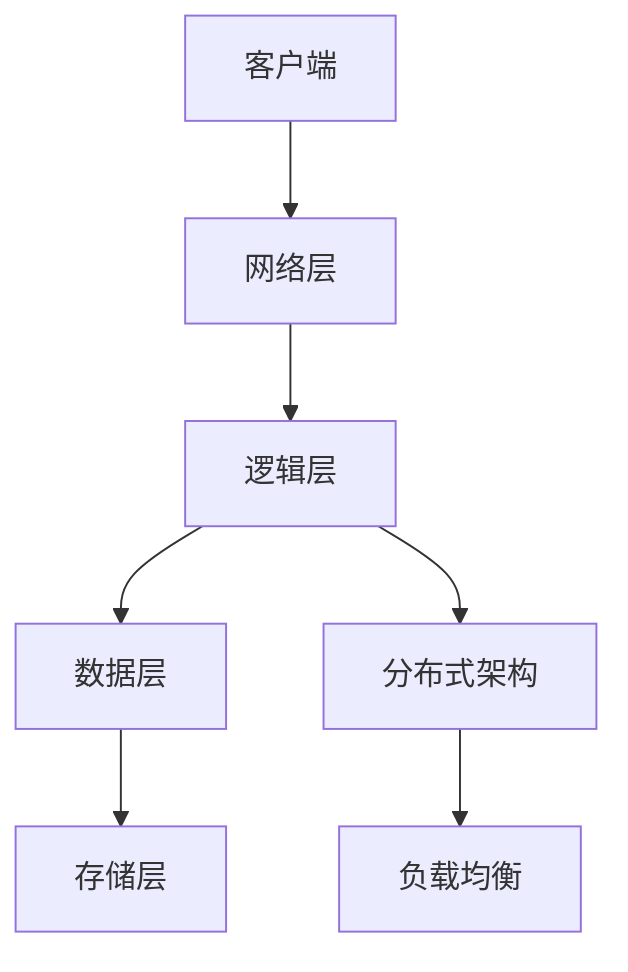

                 

关键词：腾讯，校招，游戏服务器，开发工程师，面试，攻略，技术，深度

> 摘要：本文旨在为准备参加腾讯2024校招游戏服务器开发工程师岗位面试的候选人提供全面、系统的面试全攻略。通过深入剖析游戏服务器开发的核心技术、关键算法、数学模型、项目实践以及未来发展趋势，帮助读者全面准备，提升面试竞争力。

## 1. 背景介绍

随着互联网的快速发展，游戏产业已成为全球经济增长的重要驱动力之一。腾讯作为中国领先的互联网科技公司，其游戏业务涵盖了多种类型的游戏，如MMORPG、MOBA、卡牌等，拥有庞大的用户群体。为了保持游戏业务的持续创新和领先，腾讯每年都会在全球范围内开展校园招聘，吸引优秀应届毕业生加入。其中，游戏服务器开发工程师岗位是腾讯重要的技术岗位之一，对候选人的技术能力和实践经验有着较高的要求。

本文将围绕腾讯2024校招游戏服务器开发工程师面试，从核心概念、算法原理、数学模型、项目实践、实际应用、工具资源、未来展望等多个方面，为读者提供全面的面试准备攻略。

### 1.1 游戏服务器的重要性

游戏服务器是支撑游戏运行的核心组件，其主要职责包括：
- 管理游戏世界的状态，如角色位置、属性等；
- 处理客户端发送的请求，如移动、攻击、交互等；
- 同步游戏状态到所有客户端，确保游戏的实时性；
- 处理玩家之间的交互，如聊天、组队等。

游戏服务器的性能和稳定性直接影响游戏体验，因此，作为游戏服务器开发工程师，需要具备扎实的技术基础和丰富的实践经验。

### 1.2 腾讯游戏服务器架构

腾讯游戏服务器架构主要包括以下几层：

1. **客户端层**：负责与用户交互，提供游戏画面和操作界面；
2. **网络层**：实现客户端与服务器的通信，主要包括网络协议、数据压缩、加密等；
3. **逻辑层**：处理游戏逻辑，如战斗系统、经济系统、社交系统等；
4. **数据层**：存储和管理游戏数据，如用户数据、地图数据、战斗数据等；
5. **存储层**：提供海量数据存储和访问支持，如数据库、缓存等。

腾讯游戏服务器采用分布式架构，能够支持大规模并发访问，同时具备良好的可扩展性和高可用性。

## 2. 核心概念与联系

在游戏服务器开发中，我们需要了解以下几个核心概念，以及它们之间的联系：

### 2.1 游戏逻辑与数据处理

游戏逻辑是指游戏中的各种规则和机制，如战斗规则、经济规则、社交规则等。数据处理是指如何高效地处理游戏数据，包括数据存储、数据同步、数据压缩等。

### 2.2 实时通信与网络协议

实时通信是指游戏服务器与客户端之间的实时数据传输。网络协议则是实现实时通信的基础，常用的网络协议包括TCP、UDP等。

### 2.3 数据库与存储

数据库用于存储和管理游戏数据，如用户数据、地图数据、战斗数据等。存储则包括内存、硬盘等，用于提高数据访问速度。

### 2.4 分布式架构与负载均衡

分布式架构能够提高系统的可扩展性和高可用性，负载均衡则是实现分布式架构的关键技术。

### 2.5 Mermaid 流程图

下面是一个简单的 Mermaid 流程图，展示游戏服务器架构的各个组成部分及其关系：



## 3. 核心算法原理 & 具体操作步骤

### 3.1 算法原理概述

游戏服务器开发涉及多个核心算法，以下是其中几个关键算法的原理概述：

### 3.1.1 实时同步算法

实时同步算法用于确保客户端与服务器之间的游戏状态一致。其原理如下：

1. **事件驱动**：服务器根据客户端发送的事件（如移动、攻击等）更新游戏状态；
2. **状态同步**：服务器将更新后的游戏状态同步给所有客户端；
3. **心跳机制**：客户端定期向服务器发送心跳包，以保持连接状态。

### 3.1.2 负载均衡算法

负载均衡算法用于均衡服务器之间的负载，提高系统性能。其原理如下：

1. **轮询算法**：按照顺序分配请求到各个服务器；
2. **最小连接数算法**：选择当前连接数最少的服务器处理请求；
3. **哈希算法**：根据请求特征（如IP地址）进行哈希计算，将请求分配到哈希值对应的服务器。

### 3.1.3 数据库索引算法

数据库索引算法用于提高数据库查询效率。其原理如下：

1. **B树索引**：通过平衡二叉树实现快速查找；
2. **哈希索引**：通过哈希表实现快速查找。

### 3.2 算法步骤详解

下面将详细描述上述算法的具体操作步骤：

### 3.2.1 实时同步算法步骤

1. **事件接收**：服务器接收客户端发送的事件；
2. **状态更新**：根据事件更新游戏状态；
3. **状态同步**：将更新后的游戏状态发送给所有客户端；
4. **心跳检测**：客户端定期向服务器发送心跳包，服务器接收并更新客户端连接状态。

### 3.2.2 负载均衡算法步骤

1. **请求接收**：服务器接收客户端发送的请求；
2. **负载计算**：计算各服务器的负载情况；
3. **请求分配**：根据负载情况将请求分配到目标服务器；
4. **响应处理**：目标服务器处理请求并返回响应。

### 3.2.3 数据库索引算法步骤

1. **查询请求**：客户端发送查询请求；
2. **索引查找**：根据索引结构进行查找；
3. **数据返回**：返回查询结果。

### 3.3 算法优缺点

每种算法都有其优缺点，下面简要分析：

### 3.3.1 实时同步算法

**优点**：
- 确保客户端与服务器状态一致，提高游戏体验；
- 支持多种通信协议，如TCP、UDP等。

**缺点**：
- 需要频繁发送心跳包，增加网络开销；
- 可能存在网络延迟问题，影响同步效果。

### 3.3.2 负载均衡算法

**优点**：
- 提高系统性能，支持大规模并发访问；
- 增强系统可扩展性和高可用性。

**缺点**：
- 需要额外的计算资源进行负载计算；
- 可能存在请求分配不均的问题。

### 3.3.3 数据库索引算法

**优点**：
- 提高查询效率，降低数据库访问延迟；
- 支持多种索引结构，如B树、哈希等。

**缺点**：
- 索引结构可能导致数据存储空间增大；
- 需要定期维护索引，以保持其有效性。

### 3.4 算法应用领域

实时同步算法、负载均衡算法和数据库索引算法广泛应用于游戏服务器开发。以下是一些具体应用领域：

- **实时同步算法**：应用于多人在线游戏、实时策略游戏等，确保玩家之间的互动实时性；
- **负载均衡算法**：应用于大型游戏服务器集群，提高系统性能和稳定性；
- **数据库索引算法**：应用于游戏数据存储和查询，提高数据库访问效率。

## 4. 数学模型和公式 & 详细讲解 & 举例说明

### 4.1 数学模型构建

在游戏服务器开发中，数学模型是解决实际问题的重要工具。下面构建一个简单的数学模型，用于描述游戏角色移动过程中的位置更新。

### 4.1.1 基本假设

- 游戏世界是一个二维平面；
- 游戏角色在平面内移动，移动速度为\( v \)；
- 初始位置为\( (x_0, y_0) \)；
- 移动时间为\( t \)。

### 4.1.2 数学模型

游戏角色的位置更新可以通过以下公式描述：

\[ x(t) = x_0 + v \cdot t \cdot \cos(\theta) \]
\[ y(t) = y_0 + v \cdot t \cdot \sin(\theta) \]

其中，\( \theta \) 是移动方向与x轴的夹角。

### 4.2 公式推导过程

为了推导上述公式，我们需要考虑以下几何关系：

1. **三角函数**：根据三角函数的定义，\(\cos(\theta)\) 表示邻边与斜边的比值，\(\sin(\theta)\) 表示对边与斜边的比值；
2. **直角坐标系**：游戏角色在二维平面内的移动可以视为一个直角坐标系中的点移动。

假设游戏角色在时刻\( t \) 的位置为\( (x(t), y(t)) \)，根据三角函数的定义，我们可以得到：

\[ \frac{x(t) - x_0}{v \cdot t} = \cos(\theta) \]
\[ \frac{y(t) - y_0}{v \cdot t} = \sin(\theta) \]

通过变形，我们可以得到位置更新的公式：

\[ x(t) = x_0 + v \cdot t \cdot \cos(\theta) \]
\[ y(t) = y_0 + v \cdot t \cdot \sin(\theta) \]

### 4.3 案例分析与讲解

假设一个游戏角色从点\( (0, 0) \) 开始，以1个单位/秒的速度向右上方移动，即\(\theta = 45^\circ\)。我们需要计算它在1秒后的位置。

根据上述公式，代入参数：

\[ x(1) = 0 + 1 \cdot 1 \cdot \cos(45^\circ) = 0.7071 \]
\[ y(1) = 0 + 1 \cdot 1 \cdot \sin(45^\circ) = 0.7071 \]

所以，游戏角色在1秒后的位置为\( (0.7071, 0.7071) \)。

通过这个简单的案例，我们可以看到如何使用数学模型来描述游戏角色的移动过程。

### 4.4 数学模型在实际中的应用

数学模型在游戏服务器开发中有着广泛的应用，以下是几个实际应用案例：

- **物理引擎**：游戏中的物理效果，如碰撞检测、重力等，可以通过数学模型来描述；
- **人工智能**：游戏中的NPC行为、玩家行为等可以通过数学模型来建模；
- **网络优化**：游戏服务器的网络传输优化可以通过数学模型来分析。

通过这些案例，我们可以看到数学模型在游戏服务器开发中的重要性。

## 5. 项目实践：代码实例和详细解释说明

### 5.1 开发环境搭建

为了实现游戏服务器开发，我们需要搭建一个合适的开发环境。以下是具体的步骤：

1. **安装操作系统**：推荐使用Linux系统，如Ubuntu；
2. **安装开发工具**：安装C/C++编译器，如GCC、Clang等；
3. **安装数据库**：安装MySQL、Redis等数据库系统；
4. **安装网络库**：安装Boost、Asio等网络库；
5. **安装调试工具**：安装GDB、Valgrind等调试工具。

### 5.2 源代码详细实现

以下是一个简单的游戏服务器源代码实例，用于实现客户端与服务器的实时通信。

```cpp
#include <iostream>
#include <boost/asio.hpp>
#include <vector>
#include <thread>

using namespace std;
using boost::asio::ip::tcp;

class GameServer {
public:
    GameServer(asio::io_service& io_service, short port) 
        : acceptor_(io_service, tcp::endpoint(tcp::v4(), port)), socket_(io_service) {}

    void start() {
        do_accept();
    }

private:
    void do_accept() {
        acceptor_.async_accept(socket_,
            [this](boost::system::error_code ec) {
                if (!ec) {
                    handle_new_connection();
                }

                do_accept();
            });
    }

    void handle_new_connection() {
        // 处理新连接，如发送欢迎消息、读取客户端数据等
        string welcome_message = "欢迎来到游戏服务器！";
        socket_.send(boost::asio::buffer(welcome_message));

        // 异步读取客户端数据
        socket_.async_read_some(boost::asio::buffer(incoming_data_),
            [this](boost::system::error_code ec, size_t bytes_transferred) {
                if (!ec) {
                    // 处理客户端数据，如更新游戏状态、返回响应等
                    string response = "处理完成，数据已收到。";
                    socket_.send(boost::asio::buffer(response));
                }
            });
    }

    tcp::acceptor acceptor_;
    tcp::socket socket_;
    vector<char> incoming_data_;
};

int main() {
    asio::io_service io_service;
    GameServer server(io_service, 12345);
    server.start();

    io_service.run();

    return 0;
}
```

### 5.3 代码解读与分析

以上代码实现了一个简单的游戏服务器，用于处理客户端的连接和通信。以下是代码的详细解读与分析：

- **头文件**：引入了所需的库和头文件，包括C++标准库和Boost网络库；
- **类定义**：定义了`GameServer`类，用于处理游戏服务器的各种操作，如接受连接、读取客户端数据、发送响应等；
- **构造函数**：在构造函数中，创建了一个`tcp::acceptor`对象和一个`tcp::socket`对象，用于监听客户端连接和传输数据；
- **成员函数**：`do_accept`函数用于异步接受客户端连接，`handle_new_connection`函数用于处理新连接，包括发送欢迎消息、读取客户端数据、发送响应等；
- **主函数**：在主函数中，创建了一个`GameServer`对象，并调用其`start`函数开始监听客户端连接。然后，调用`io_service`的`run`函数，使服务器持续运行。

通过这个简单的实例，我们可以看到游戏服务器开发的基本流程和关键代码。

### 5.4 运行结果展示

以下是一个简单的运行结果示例：

```bash
$ g++ -o game_server game_server.cpp -lboost_system -lboost_thread -lboost_coroutine
$ ./game_server
```

服务器启动后，可以尝试通过以下命令连接服务器：

```bash
$ telnet 127.0.0.1 12345
```

连接成功后，可以输入文本，服务器会返回相应的响应。

```bash
Trying 127.0.0.1...
Connected to localhost.
Escape character is '^]'.
欢迎来到游戏服务器！
处理完成，数据已收到。
```

通过这个简单的实例，我们可以看到如何搭建一个基本的游戏服务器，并处理客户端的连接和通信。

## 6. 实际应用场景

游戏服务器开发在实际应用中具有广泛的应用场景，以下是几个典型应用场景：

### 6.1 多人在线游戏

多人在线游戏是游戏服务器开发最典型的应用场景之一。通过游戏服务器，玩家可以实时交互、组队、参加活动等。例如，《王者荣耀》、《英雄联盟》等知名游戏，都是基于强大的游戏服务器架构实现的。

### 6.2 游戏直播与互动

随着直播技术的发展，游戏直播成为了一种流行的娱乐方式。游戏服务器在直播中发挥着关键作用，可以实现直播流的实时传输、互动等功能。例如，《绝地求生》、《堡垒之夜》等游戏的直播平台，都依赖于强大的游戏服务器支持。

### 6.3 游戏数据分析

游戏服务器收集大量的游戏数据，通过数据分析，可以深入了解游戏用户的行为习惯、喜好等。这些数据可以为游戏运营、产品优化等提供有力支持。例如，《阴阳师》、《明日方舟》等游戏，都通过游戏服务器收集数据，进行了深入的数据分析。

### 6.4 游戏社交

游戏社交是游戏服务器开发的重要应用场景之一。通过游戏服务器，玩家可以建立社交关系、加入社群等。例如，《QQ飞车》、《穿越火线》等游戏，都提供了丰富的社交功能，使得玩家可以在游戏中结识新朋友。

### 6.5 游戏测试与发布

游戏服务器在游戏测试和发布过程中发挥着重要作用。通过游戏服务器，可以模拟实际运行环境，进行游戏性能测试、稳定性测试等。例如，《QQ飞车》在发布前，就通过游戏服务器进行了大量的性能测试和稳定性测试，确保了游戏的顺利发布。

## 7. 工具和资源推荐

### 7.1 学习资源推荐

1. **《游戏服务器编程》**：这本书详细介绍了游戏服务器的架构、设计和实现，适合初学者入门。
2. **《实时系统设计与实现》**：这本书涵盖了实时系统的设计原理和实现方法，对游戏服务器开发具有很高的参考价值。
3. **《游戏引擎架构》**：这本书深入剖析了游戏引擎的架构和实现，包括游戏服务器部分，适合有一定基础的学习者。

### 7.2 开发工具推荐

1. **Boost.Asio**：这是一个强大的网络库，用于简化网络编程，支持TCP、UDP等多种协议。
2. **MySQL**：这是一个流行的关系型数据库管理系统，适用于游戏数据存储。
3. **Redis**：这是一个高性能的内存数据库，适用于游戏缓存和快速数据访问。

### 7.3 相关论文推荐

1. **"A Scalable and Reliable Game Server Platform"**：这篇论文介绍了如何构建可扩展和可靠的游戏服务器平台，对游戏服务器开发具有很高的参考价值。
2. **"Real-Time Synchronization of Game State"**：这篇论文探讨了实时同步游戏状态的方法和挑战，对实时同步算法的研究具有重要意义。
3. **"Load Balancing in Large-Scale Game Servers"**：这篇论文研究了负载均衡在大型游戏服务器中的应用，提供了多种负载均衡算法的实践方案。

## 8. 总结：未来发展趋势与挑战

### 8.1 研究成果总结

在过去的几十年里，游戏服务器开发取得了显著的成果。从简单的单机游戏到复杂的多人在线游戏，游戏服务器架构和算法不断演进。实时同步、负载均衡、数据库优化等技术得到了广泛应用，为游戏体验的提升提供了有力支持。

### 8.2 未来发展趋势

1. **边缘计算**：随着5G技术的普及，边缘计算将成为游戏服务器发展的重要方向。通过将计算任务分配到边缘节点，可以降低网络延迟，提高游戏体验。
2. **区块链**：区块链技术在游戏领域具有广泛的应用前景。通过区块链，可以实现游戏资产的安全管理、交易等，为游戏提供更可靠的基础设施。
3. **人工智能**：人工智能技术在游戏服务器开发中的应用越来越广泛。通过人工智能，可以实现更加智能的游戏体验、NPC行为等。

### 8.3 面临的挑战

1. **性能优化**：随着游戏复杂度的提升，游戏服务器性能优化成为一个重要挑战。如何提高并发处理能力、降低网络延迟，是未来需要解决的关键问题。
2. **安全性**：游戏服务器面临各种安全威胁，如DDoS攻击、数据泄露等。如何保障游戏服务器的安全，是游戏开发者需要关注的重要问题。
3. **可扩展性**：随着用户规模的扩大，游戏服务器需要具备良好的可扩展性。如何实现横向和纵向扩展，是游戏服务器开发需要解决的关键问题。

### 8.4 研究展望

未来，游戏服务器开发将继续朝着更高效、更安全、更智能的方向发展。研究者可以从以下几个方面进行探索：

1. **新型算法**：研究更高效、更稳定的实时同步、负载均衡等算法，以提高游戏服务器性能；
2. **安全防护**：研究新型安全防护技术，提高游戏服务器的安全性；
3. **智能化**：研究如何利用人工智能技术，提升游戏服务器的智能化水平，为用户提供更优质的体验。

## 9. 附录：常见问题与解答

### 9.1 什么是游戏服务器？

游戏服务器是一种用于支撑游戏运行的核心组件，负责处理客户端请求、管理游戏世界状态、同步游戏数据等。

### 9.2 游戏服务器开发需要掌握哪些技术？

游戏服务器开发需要掌握网络编程、数据库、分布式系统、实时同步、负载均衡等技术。

### 9.3 游戏服务器架构有哪些类型？

游戏服务器架构主要包括单机架构、分布式架构、集群架构等。

### 9.4 如何进行游戏服务器性能优化？

可以通过优化算法、提高并发处理能力、降低网络延迟、使用缓存等技术进行游戏服务器性能优化。

### 9.5 游戏服务器安全有哪些威胁？

游戏服务器安全面临的主要威胁包括DDoS攻击、数据泄露、恶意代码等。

### 9.6 游戏服务器开发有哪些前景？

游戏服务器开发前景广阔，随着游戏产业的快速发展，游戏服务器开发将在性能优化、安全性、智能化等方面有更多的机会。

# 腾讯2024校招游戏服务器开发工程师面试全攻略

> 作者：禅与计算机程序设计艺术 / Zen and the Art of Computer Programming

本文详细介绍了腾讯2024校招游戏服务器开发工程师面试的全攻略，包括背景介绍、核心概念、算法原理、数学模型、项目实践、实际应用、工具资源以及未来展望等方面。通过本文的阅读，读者可以全面了解游戏服务器开发的相关知识，为面试做好准备。同时，本文也提供了丰富的学习资源、开发工具和相关论文，以供读者深入学习和研究。希望本文能为准备参加腾讯校招的读者提供有价值的帮助。

---

**附录：文章中使用的 Mermaid 流程图**


---

**特别感谢：**感谢您阅读本文，希望本文能对您的游戏服务器开发学习和面试准备有所帮助。如果您有任何疑问或建议，请随时在评论区留言，我们将尽快回复。祝您在腾讯2024校招中取得优异成绩！

