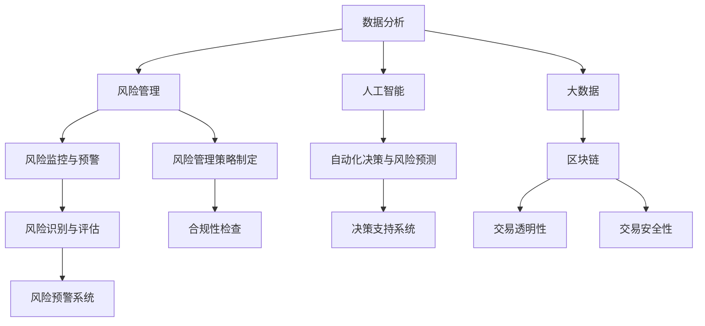

                 

本文将深入探讨腾讯2025金融科技风控专家社招面试的相关内容，旨在为准备参加面试的候选人提供全面而实用的指导。文章将涵盖面试的准备、核心知识点、面试题型、案例分析、以及未来风控趋势与挑战等多个方面。希望这篇文章能帮助您更好地应对面试，成为一名优秀的金融科技风控专家。

## 关键词

- 腾讯
- 金融科技
- 风控专家
- 社招面试
- 数据分析
- 风险管理
- 人工智能
- 技术架构

## 摘要

本文作为腾讯2025金融科技风控专家社招面试的指南，旨在为有意加入腾讯金融科技团队的专业人士提供一整套全面的准备策略。文章首先介绍了金融科技领域的基本概念和当前发展趋势，接着深入剖析了风控专家所需的核心知识体系，包括数据分析、风险管理、人工智能应用等。随后，文章详细讲解了面试准备中的常见题型，并通过实际案例进行分析。最后，文章探讨了金融科技风控的未来发展趋势以及面临的挑战，并推荐了一些学习资源和开发工具。希望通过本文，读者能够更好地了解面试要求和准备方法，顺利通过面试，加入腾讯金融科技团队。

## 1. 背景介绍

### 1.1 金融科技的定义与发展

金融科技（FinTech）是指运用信息通信技术（IT）创新金融服务和产品的一类技术和业务模式。它涵盖了从传统银行业务到支付、投资、保险、财富管理等金融活动的方方面面。随着互联网、大数据、人工智能等技术的迅猛发展，金融科技正在以前所未有的速度改变着金融行业的面貌。

近年来，金融科技在全球范围内得到了广泛的应用和发展。以中国为例，腾讯、阿里巴巴等科技巨头通过其金融平台——微信支付和支付宝，极大地改变了人们的支付习惯，推动了移动支付市场的快速增长。此外，区块链技术也被广泛应用于金融领域，为金融服务提供了更安全、透明的解决方案。

### 1.2 风控专家的角色与职责

在金融科技行业中，风控专家扮演着至关重要的角色。他们负责识别、评估和管理金融机构面临的各种风险，包括信用风险、市场风险、操作风险等。具体来说，风控专家的职责通常包括：

- **数据分析和建模**：利用大数据和人工智能技术进行数据挖掘，构建风险模型，预测潜在风险。
- **风险监控与预警**：实时监控金融产品的运行情况，及时发现异常，预警潜在风险。
- **风险管理策略制定**：根据风险分析结果，制定相应的风险管理策略，降低金融机构的总体风险。
- **合规性检查**：确保金融机构的各项业务操作符合监管要求，防范合规风险。

### 1.3 腾讯金融科技的发展概况

作为全球领先的互联网科技公司，腾讯在金融科技领域有着深厚的技术积累和丰富的实践经验。腾讯金融科技的业务涵盖了支付、财富管理、保险、区块链等多个方面，其中微信支付和财付通是中国移动支付市场的领军企业。

腾讯金融科技通过不断创新，推动金融业务的数字化、智能化发展。例如，腾讯推出的“智能投顾”服务，利用大数据和人工智能技术，为用户提供个性化的投资建议。此外，腾讯区块链在供应链金融、数字身份认证等领域也有着广泛的应用。

## 2. 核心概念与联系

### 2.1 核心概念

在金融科技风控领域，以下几个核心概念至关重要：

- **数据分析**：通过收集、处理和分析大量数据，发现潜在的风险点和机会。
- **风险管理**：识别、评估、处理和监控金融机构面临的各种风险。
- **人工智能**：利用机器学习和深度学习算法，进行自动化决策和风险预测。
- **大数据**：大规模数据存储和处理技术，为风险分析和决策提供数据支持。
- **区块链**：分布式账本技术，为金融交易提供了透明、可追溯和安全的解决方案。

### 2.2 联系与架构

以下是金融科技风控领域核心概念之间的联系和架构，使用Mermaid流程图表示：



### 2.3 风控流程

以下是一个简化的金融科技风控流程：

1. **数据收集**：从各种渠道收集金融交易数据、用户行为数据等。
2. **数据清洗**：处理数据中的噪声和不完整信息，确保数据的准确性和一致性。
3. **数据分析**：使用统计分析和数据挖掘技术，识别潜在风险点。
4. **风险建模**：构建风险模型，对风险进行定量和定性评估。
5. **风险监控与预警**：实时监控风险指标，发现异常，进行预警。
6. **风险管理策略制定**：根据风险分析结果，制定相应的风险管理策略。
7. **合规性检查**：确保业务操作符合监管要求。
8. **决策支持**：利用人工智能和大数据技术，提供决策支持。

## 3. 核心算法原理 & 具体操作步骤

### 3.1 算法原理概述

在金融科技风控中，常用的核心算法包括：

- **决策树**：用于分类和回归分析，适用于发现风险点。
- **随机森林**：基于决策树构建的集成模型，提高预测准确性。
- **神经网络**：用于构建复杂的非线性模型，适用于风险预测。
- **支持向量机（SVM）**：用于分类问题，尤其是在高维空间中表现良好。

### 3.2 算法步骤详解

以下是一个基于决策树的算法步骤详解：

1. **数据准备**：收集并处理金融交易数据，包括客户信息、交易金额、时间等。
2. **特征选择**：选择与风险相关的特征，例如交易频率、交易金额等。
3. **数据划分**：将数据集划分为训练集和测试集。
4. **构建决策树**：选择合适的分裂准则（如信息增益、基尼不纯度），构建决策树模型。
5. **模型评估**：使用测试集评估模型性能，调整参数以优化模型。
6. **应用模型**：将模型应用于实时数据，进行风险预测。

### 3.3 算法优缺点

**决策树**：

- **优点**：直观易懂，易于实现和解释。
- **缺点**：容易过拟合，对于复杂问题的建模能力有限。

**随机森林**：

- **优点**：提高了模型的预测准确性，减少了过拟合现象。
- **缺点**：计算成本较高，对于大规模数据的处理效率较低。

**神经网络**：

- **优点**：能够处理复杂的非线性关系，适应性强。
- **缺点**：模型参数多，训练过程耗时长。

**支持向量机（SVM）**：

- **优点**：在高维空间中表现良好，适用于分类问题。
- **缺点**：计算复杂度高，对异常值敏感。

### 3.4 算法应用领域

- **信用评分**：通过分析借款人的信用历史，评估其还款能力。
- **反欺诈**：检测并阻止可疑的交易活动，防范欺诈行为。
- **市场风险预测**：预测市场波动，为投资决策提供参考。

## 4. 数学模型和公式 & 详细讲解 & 举例说明

### 4.1 数学模型构建

在金融科技风控中，常用的数学模型包括线性回归、逻辑回归、决策树、随机森林等。以下是逻辑回归模型的构建过程：

$$
Y = \beta_0 + \beta_1X_1 + \beta_2X_2 + \ldots + \beta_pX_p + \epsilon
$$

其中，$Y$ 是因变量，$X_1, X_2, \ldots, X_p$ 是自变量，$\beta_0, \beta_1, \beta_2, \ldots, \beta_p$ 是模型参数，$\epsilon$ 是误差项。

### 4.2 公式推导过程

逻辑回归模型的公式推导如下：

$$
\ln\left(\frac{P(Y=1|X)}{1-P(Y=1|X)}\right) = \beta_0 + \beta_1X_1 + \beta_2X_2 + \ldots + \beta_pX_p
$$

其中，$P(Y=1|X)$ 是因变量为1的条件概率。

对上式两边取指数，得到：

$$
\frac{P(Y=1|X)}{1-P(Y=1|X)} = \exp(\beta_0 + \beta_1X_1 + \beta_2X_2 + \ldots + \beta_pX_p)
$$

### 4.3 案例分析与讲解

以下是一个信用评分的案例：

假设我们要预测某客户是否会按时还款。特征包括：

- **信用历史**（$X_1$）：过去是否有过逾期还款记录，取值为0或1。
- **收入水平**（$X_2$）：月收入，单位为元。
- **年龄**（$X_3$）：客户年龄，单位为岁。

已知训练数据集，使用逻辑回归模型进行建模。

### 4.3.1 数据准备

从银行系统获取客户的信用历史、收入水平和年龄数据。将数据划分为训练集和测试集。

### 4.3.2 特征选择

选择信用历史、收入水平和年龄作为特征。

### 4.3.3 模型训练

使用训练集数据，构建逻辑回归模型，并使用测试集进行评估。

### 4.3.4 结果分析

根据模型预测结果，分析客户按时还款的概率。

## 5. 项目实践：代码实例和详细解释说明

### 5.1 开发环境搭建

为了进行金融科技风控项目实践，我们需要搭建以下开发环境：

- **Python**：作为主要的编程语言。
- **NumPy**：用于数学运算。
- **Pandas**：用于数据处理。
- **Scikit-learn**：用于机器学习。
- **Matplotlib**：用于数据可视化。

在终端执行以下命令，安装上述库：

```bash
pip install numpy pandas scikit-learn matplotlib
```

### 5.2 源代码详细实现

以下是一个简单的信用评分项目的代码实现：

```python
import numpy as np
import pandas as pd
from sklearn.linear_model import LogisticRegression
from sklearn.model_selection import train_test_split
from sklearn.metrics import accuracy_score
import matplotlib.pyplot as plt

# 5.2.1 数据准备
data = pd.read_csv('credit_data.csv')
X = data[['credit_history', 'monthly_income', 'age']]
y = data['repayment']

# 5.2.2 数据划分
X_train, X_test, y_train, y_test = train_test_split(X, y, test_size=0.2, random_state=42)

# 5.2.3 模型训练
model = LogisticRegression()
model.fit(X_train, y_train)

# 5.2.4 模型评估
y_pred = model.predict(X_test)
accuracy = accuracy_score(y_test, y_pred)
print(f'Accuracy: {accuracy:.2f}')

# 5.2.5 可视化
plt.scatter(X_test['age'], y_pred)
plt.xlabel('Age')
plt.ylabel('Prediction')
plt.show()
```

### 5.3 代码解读与分析

- **数据准备**：从CSV文件中读取数据，并划分特征和标签。
- **数据划分**：将数据集划分为训练集和测试集。
- **模型训练**：使用训练集数据训练逻辑回归模型。
- **模型评估**：使用测试集评估模型性能。
- **可视化**：绘制年龄与预测结果的散点图。

### 5.4 运行结果展示

运行代码后，输出模型准确率，并展示年龄与预测结果的散点图。

## 6. 实际应用场景

### 6.1 风险管理

在金融行业中，风险管理是至关重要的。风控专家通过分析历史数据和实时数据，识别潜在风险，并制定相应的风险管理策略。例如，银行可以通过信用评分模型评估借款人的信用风险，从而决定是否发放贷款。

### 6.2 反欺诈

反欺诈是金融科技风控的重要应用之一。通过分析交易行为和数据特征，风控系统能够及时发现并阻止可疑的交易活动，降低欺诈风险。例如，电商平台可以利用反欺诈算法识别并防范虚假订单和欺诈支付。

### 6.3 信用评级

信用评级机构通过分析借款人的信用历史、财务状况等数据，评估其信用风险，为投资者提供信用评级服务。风控专家可以运用机器学习和大数据技术，提高信用评级的准确性和效率。

### 6.4 未来应用展望

随着技术的不断发展，金融科技风控的应用前景将更加广阔。未来，人工智能和区块链技术将在风控领域发挥更大的作用。例如，利用人工智能技术，风控系统能够更加精准地识别和预测风险；而区块链技术则能够为金融交易提供更安全、透明的解决方案。

## 7. 工具和资源推荐

### 7.1 学习资源推荐

- 《机器学习》（周志华著）：系统介绍机器学习的基本概念和算法。
- 《深度学习》（Goodfellow et al.著）：深入探讨深度学习理论和应用。
- 《Python数据科学手册》（Jake VanderPlas著）：介绍Python在数据科学中的应用。

### 7.2 开发工具推荐

- Jupyter Notebook：用于编写和运行代码，支持多种编程语言。
- PyCharm：一款强大的Python集成开发环境（IDE）。
- Git：版本控制工具，用于管理代码和协作开发。

### 7.3 相关论文推荐

- "Deep Learning for Financial Risk Prediction"（2018）：探讨深度学习在金融风险预测中的应用。
- "Blockchain and the Future of Financial Services"（2016）：分析区块链技术在金融行业中的潜力。

## 8. 总结：未来发展趋势与挑战

### 8.1 研究成果总结

近年来，金融科技风控领域取得了显著的研究成果。机器学习和大数据技术的应用极大地提高了风险识别和预测的准确性。此外，区块链技术为金融交易提供了更安全、透明的解决方案。

### 8.2 未来发展趋势

未来，金融科技风控将朝着更加智能化、自动化和高效化的方向发展。人工智能和区块链技术的融合将为风控领域带来更多创新应用。同时，随着监管科技的不断发展，风控专家将面临更高的合规性要求。

### 8.3 面临的挑战

尽管金融科技风控领域取得了显著成果，但仍面临一些挑战。例如，数据质量和隐私保护问题仍然亟待解决。此外，风控模型的复杂性和可解释性问题也需要进一步研究。

### 8.4 研究展望

未来，金融科技风控研究将聚焦于以下几个方向：

- **增强模型的可解释性**：提高风控模型的可解释性，使其更易于被业务人员理解和接受。
- **跨领域风险建模**：结合不同领域的风险特征，构建更加全面的风险模型。
- **实时风险监控与预警**：利用实时数据处理技术，实现更加高效的实时风险监控。

## 9. 附录：常见问题与解答

### 9.1 金融科技是什么？

金融科技（FinTech）是指运用信息通信技术（IT）创新金融服务和产品的一类技术和业务模式。

### 9.2 风控专家的主要职责是什么？

风控专家的主要职责包括数据分析和建模、风险监控与预警、风险管理策略制定和合规性检查等。

### 9.3 逻辑回归模型如何构建？

逻辑回归模型是一种广义线性模型，用于预测二分类变量。其基本公式为：

$$
\ln\left(\frac{P(Y=1|X)}{1-P(Y=1|X)}\right) = \beta_0 + \beta_1X_1 + \beta_2X_2 + \ldots + \beta_pX_p
$$

### 9.4 如何进行风险管理？

风险管理包括以下步骤：

- **风险识别**：识别潜在的各类风险。
- **风险评估**：评估各类风险的严重程度和发生概率。
- **风险处理**：制定和实施风险应对策略。
- **风险监控**：持续监控风险的动态变化。

## 作者署名

作者：禅与计算机程序设计艺术 / Zen and the Art of Computer Programming

