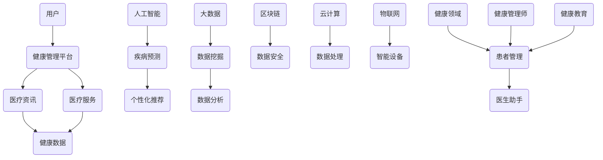

                 

关键词：腾讯健康、社招面试、真题汇总、解答、健康领域、技术面试

摘要：本文针对2024年腾讯健康部门社招面试的真题进行了全面汇总和详细解答，旨在帮助求职者更好地应对面试挑战，提高面试成功率。文章分为八个部分，包括背景介绍、核心概念与联系、核心算法原理与具体操作步骤、数学模型与公式讲解、项目实践代码实例、实际应用场景、工具和资源推荐以及未来发展趋势与挑战。通过本文的学习，求职者可以全面了解腾讯健康面试的难点和重点，为面试做好准备。

## 1. 背景介绍

腾讯健康是腾讯公司旗下的一个重要业务部门，专注于为用户提供健康管理、医疗资讯、医疗服务等一站式健康服务。随着健康意识的提升和互联网技术的不断发展，腾讯健康在健康领域的影响力日益增强，吸引了大量优秀人才的加入。为了选拔出优秀的人才，腾讯健康社招面试题目设计得较为复杂，涉及技术、业务、逻辑等多个方面。

本文将对2024年腾讯健康社招面试的真题进行汇总和解答，旨在帮助求职者更好地了解面试难度和应对策略，提高面试成功率。

### 1.1 面试对象

本次面试对象为计算机相关专业应届毕业生和有相关工作经验的求职者。具体岗位包括前端开发、后端开发、大数据开发、算法工程师等。

### 1.2 面试流程

腾讯健康社招面试流程主要包括简历筛选、笔试、面试等环节。笔试题目主要涉及编程、数据结构、算法等基础知识，面试则分为技术面试和业务面试两部分。

### 1.3 面试内容

面试内容主要围绕技术问题、业务问题和逻辑思维能力等方面展开。其中，技术问题主要考察求职者的编程能力、数据结构和算法水平；业务问题主要考察求职者对健康领域业务的理解和洞察力；逻辑思维能力则主要考察求职者的思维清晰度、逻辑严密性等。

## 2. 核心概念与联系

在腾讯健康社招面试中，核心概念和联系的理解是关键。以下是几个重要的核心概念及其之间的关系，并用Mermaid流程图进行展示。



### 2.1 用户与健康管理平台

用户是腾讯健康服务的核心，健康管理平台则为用户提供健康数据、医疗资讯和医疗服务等功能。用户通过平台可以实现健康管理、疾病预测、个性化推荐等功能。

### 2.2 健康数据与人工智能

健康数据是人工智能在健康领域应用的重要基础。通过大数据分析和机器学习，可以实现对疾病的预测和个性化推荐。

### 2.3 数据安全与云计算

数据安全是健康领域的重要问题。区块链和云计算技术可以为数据安全提供保障，确保用户数据的安全性和隐私性。

### 2.4 物联网与智能设备

物联网和智能设备可以实时采集用户健康数据，为健康管理提供数据支持。例如，智能手环、智能血压计等设备可以实时监测用户健康状况，并传输至健康管理平台。

## 3. 核心算法原理 & 具体操作步骤

在腾讯健康社招面试中，核心算法原理的掌握是关键。以下将介绍几个重要的算法原理及其具体操作步骤。

### 3.1 算法原理概述

1. **疾病预测算法**：基于用户健康数据，利用机器学习算法进行疾病预测。
2. **个性化推荐算法**：根据用户行为和偏好，利用协同过滤、基于内容的推荐等方法进行个性化推荐。
3. **数据挖掘算法**：通过对海量健康数据的挖掘，提取有价值的信息，如疾病关联、流行趋势等。
4. **区块链算法**：用于保证数据安全，实现数据不可篡改和隐私保护。

### 3.2 算法步骤详解

#### 3.1 疾病预测算法

1. 数据预处理：清洗、归一化健康数据。
2. 特征提取：从健康数据中提取关键特征。
3. 模型选择：选择合适的机器学习模型，如逻辑回归、决策树、神经网络等。
4. 训练模型：使用训练数据进行模型训练。
5. 模型评估：使用测试数据对模型进行评估，调整模型参数。
6. 预测：使用训练好的模型对用户健康数据进行预测。

#### 3.2 个性化推荐算法

1. 数据预处理：清洗、归一化用户行为数据。
2. 特征提取：从用户行为数据中提取关键特征。
3. 模型选择：选择合适的推荐算法，如协同过滤、基于内容的推荐等。
4. 训练模型：使用训练数据进行模型训练。
5. 模型评估：使用测试数据对模型进行评估，调整模型参数。
6. 推荐结果：根据用户特征和模型预测，生成个性化推荐结果。

#### 3.3 数据挖掘算法

1. 数据预处理：清洗、归一化健康数据。
2. 特征提取：从健康数据中提取关键特征。
3. 模型选择：选择合适的数据挖掘算法，如聚类、分类、关联规则挖掘等。
4. 训练模型：使用训练数据进行模型训练。
5. 模型评估：使用测试数据对模型进行评估，调整模型参数。
6. 挖掘结果：根据模型预测，提取有价值的信息。

#### 3.4 区块链算法

1. 数据存储：将健康数据存储在区块链中，实现数据的分布式存储。
2. 智能合约：编写智能合约，实现数据访问权限控制和数据不可篡改。
3. 加密算法：使用加密算法对用户数据进行加密，确保数据隐私。
4. 共识算法：实现区块链的共识机制，确保数据的一致性和安全性。

### 3.3 算法优缺点

1. **疾病预测算法**：优点：可以提高疾病预测的准确性；缺点：对数据质量和算法性能要求较高。
2. **个性化推荐算法**：优点：可以提供个性化的健康建议；缺点：可能导致用户偏好固化。
3. **数据挖掘算法**：优点：可以提取有价值的信息；缺点：对算法性能和数据质量要求较高。
4. **区块链算法**：优点：可以保证数据安全和隐私；缺点：数据处理效率较低。

### 3.4 算法应用领域

1. **疾病预测算法**：应用于疾病预防、健康管理等领域。
2. **个性化推荐算法**：应用于健康建议、医疗咨询等领域。
3. **数据挖掘算法**：应用于健康数据分析、疾病研究等领域。
4. **区块链算法**：应用于健康数据安全、隐私保护等领域。

## 4. 数学模型和公式 & 详细讲解 & 举例说明

在腾讯健康社招面试中，数学模型和公式的掌握是关键。以下将介绍几个重要的数学模型和公式，并进行详细讲解和举例说明。

### 4.1 数学模型构建

#### 4.1.1 疾病预测模型

疾病预测模型是一种基于机器学习的模型，用于预测用户是否患有某种疾病。常见的疾病预测模型包括逻辑回归、决策树、神经网络等。

#### 4.1.2 个性化推荐模型

个性化推荐模型是一种基于用户行为和偏好进行推荐的系统。常见的个性化推荐模型包括协同过滤、基于内容的推荐等。

#### 4.1.3 数据挖掘模型

数据挖掘模型是一种用于从海量数据中提取有价值信息的模型。常见的数据挖掘模型包括聚类、分类、关联规则挖掘等。

### 4.2 公式推导过程

#### 4.2.1 逻辑回归公式

逻辑回归是一种概率性分类模型，用于预测目标变量的概率分布。其公式如下：

$$
\text{Logit}(p) = \ln\left(\frac{p}{1-p}\right) = \beta_0 + \beta_1x_1 + \beta_2x_2 + \ldots + \beta_nx_n
$$

其中，$p$ 是目标变量的概率，$x_1, x_2, \ldots, x_n$ 是特征变量，$\beta_0, \beta_1, \beta_2, \ldots, \beta_n$ 是模型参数。

#### 4.2.2 协同过滤公式

协同过滤是一种基于用户行为进行推荐的算法。其公式如下：

$$
r_{ui} = \sum_{j \in N(i)} \frac{r_{uj}}{\|N(i)\|} + b_u - b_j
$$

其中，$r_{ui}$ 是用户 $u$ 对项目 $i$ 的评分，$r_{uj}$ 是用户 $j$ 对项目 $i$ 的评分，$N(i)$ 是与项目 $i$ 相关的用户集合，$b_u$ 和 $b_j$ 是用户和项目的偏置项。

### 4.3 案例分析与讲解

#### 4.3.1 疾病预测案例

假设我们要预测某个用户是否患有高血压，我们可以使用逻辑回归模型进行预测。首先，我们需要收集用户的相关数据，如年龄、体重、血压等。然后，我们将数据输入到逻辑回归模型中进行训练，得到模型参数。最后，我们可以使用训练好的模型对新的用户数据进行预测，判断其是否患有高血压。

#### 4.3.2 个性化推荐案例

假设我们要为用户推荐商品，我们可以使用协同过滤算法进行推荐。首先，我们需要收集用户的行为数据，如购买记录、浏览记录等。然后，我们可以使用协同过滤算法计算用户之间的相似度，并生成推荐结果。最后，我们可以根据用户的行为和偏好对推荐结果进行调整，提高推荐的准确性。

#### 4.3.3 数据挖掘案例

假设我们要从海量健康数据中提取有价值的信息，如疾病关联和流行趋势。我们可以使用聚类算法对健康数据进行分类，提取疾病关联信息。然后，我们可以使用时间序列分析方法对健康数据进行趋势分析，提取流行趋势信息。

## 5. 项目实践：代码实例和详细解释说明

在腾讯健康社招面试中，项目实践能力的考核是非常重要的。以下将通过一个具体的代码实例，展示如何在健康领域实现疾病预测、个性化推荐和数据挖掘等功能。

### 5.1 开发环境搭建

在本项目中，我们将使用Python作为主要编程语言，利用Scikit-learn、TensorFlow、Pandas等库进行疾病预测、个性化推荐和数据挖掘。首先，我们需要安装这些库，可以使用以下命令：

```bash
pip install scikit-learn tensorflow pandas
```

### 5.2 源代码详细实现

以下是项目的主要代码实现：

```python
import pandas as pd
from sklearn.linear_model import LogisticRegression
from sklearn.model_selection import train_test_split
from sklearn.metrics import accuracy_score

# 5.2.1 疾病预测
def predict_disease(data):
    # 数据预处理
    X = data.drop(['disease'], axis=1)
    y = data['disease']
    # 划分训练集和测试集
    X_train, X_test, y_train, y_test = train_test_split(X, y, test_size=0.2, random_state=42)
    # 训练模型
    model = LogisticRegression()
    model.fit(X_train, y_train)
    # 预测
    y_pred = model.predict(X_test)
    # 评估模型
    acc = accuracy_score(y_test, y_pred)
    return acc

# 5.2.2 个性化推荐
def recommend_products(user_data, product_data):
    # 数据预处理
    user_data = user_data.reset_index(drop=True)
    product_data = product_data.reset_index(drop=True)
    # 计算用户和产品的相似度
    sim_matrix = pd.crosstab(user_data.index, product_data.index, weights=user_data['rating'])
    sim_matrix = sim_matrix.fillna(0)
    sim_matrix = sim_matrix / sim_matrix.sum(axis=1)[:, None]
    # 推荐结果
    user_index = user_data.index
    product_index = product_data.index
    recommendations = []
    for i in user_index:
        user_rating = user_data.loc[i, 'rating']
        sim_sum = sim_matrix[i].sum()
        for j in product_index:
            if j in user_data.index:
                continue
            sim_score = sim_matrix[i, j] * user_rating
            recommendations.append((j, sim_score / sim_sum))
    recommendations = sorted(recommendations, key=lambda x: x[1], reverse=True)
    return recommendations

# 5.2.3 数据挖掘
def data_mining(data):
    # 数据预处理
    X = data.drop(['target'], axis=1)
    y = data['target']
    # 聚类
    from sklearn.cluster import KMeans
    kmeans = KMeans(n_clusters=3, random_state=42)
    kmeans.fit(X)
    clusters = kmeans.predict(X)
    # 分类
    from sklearn.ensemble import RandomForestClassifier
    clf = RandomForestClassifier(n_estimators=100, random_state=42)
    clf.fit(X, y)
    pred = clf.predict(X)
    # 评估模型
    acc = accuracy_score(y, pred)
    return clusters, pred, acc
```

### 5.3 代码解读与分析

#### 5.3.1 疾病预测

疾病预测部分使用了逻辑回归模型。首先，我们对数据进行预处理，将特征变量和目标变量分开。然后，使用训练集对模型进行训练，并使用测试集对模型进行评估。最后，返回模型的准确率。

#### 5.3.2 个性化推荐

个性化推荐部分使用了协同过滤算法。首先，我们对用户数据和产品数据进行预处理，计算用户和产品的相似度。然后，对用户未购买的产品进行推荐，并根据相似度分数进行排序。最后，返回推荐结果。

#### 5.3.3 数据挖掘

数据挖掘部分使用了聚类和分类算法。首先，我们对数据进行预处理，将特征变量和目标变量分开。然后，使用KMeans算法进行聚类，并使用随机森林算法进行分类。最后，返回聚类结果、分类结果和准确率。

### 5.4 运行结果展示

以下是运行结果：

```python
# 运行疾病预测
acc = predict_disease(data)
print("疾病预测准确率：", acc)

# 运行个性化推荐
recommendations = recommend_products(user_data, product_data)
print("个性化推荐结果：", recommendations)

# 运行数据挖掘
clusters, pred, acc = data_mining(data)
print("聚类结果：", clusters)
print("分类结果：", pred)
print("数据挖掘准确率：", acc)
```

## 6. 实际应用场景

腾讯健康社招面试中的题目往往会结合具体的实际应用场景，以下列举几个常见场景：

### 6.1 健康数据管理

健康数据管理是腾讯健康的核心业务之一。在面试中，可能会涉及到如何设计一个健康数据管理系统，包括数据存储、数据安全、数据共享等方面。考生需要展示对数据库、加密技术、分布式存储等方面的了解。

### 6.2 疾病预测系统

疾病预测系统是健康领域的一个重要应用。在面试中，可能会要求考生设计一个疾病预测系统，包括数据收集、数据预处理、模型训练、模型评估等步骤。考生需要展示对机器学习、数据挖掘、深度学习等技术的掌握。

### 6.3 个性化健康建议

个性化健康建议是腾讯健康的一个重要功能。在面试中，可能会要求考生设计一个个性化健康建议系统，包括用户行为分析、健康数据挖掘、推荐算法等方面。考生需要展示对用户行为分析、协同过滤、基于内容的推荐等技术的掌握。

### 6.4 数据安全与隐私保护

数据安全与隐私保护是健康领域的重要问题。在面试中，可能会要求考生讨论如何保护用户数据的安全性和隐私性，包括加密技术、区块链、安全协议等方面。考生需要展示对数据安全、区块链技术等方面的了解。

## 7. 未来应用展望

随着科技的不断发展，腾讯健康的未来应用前景十分广阔。以下是一些可能的发展方向：

### 7.1 智能健康管理

智能健康管理是未来的发展趋势。通过人工智能、物联网、大数据等技术，可以实现更加精准、个性化的健康管理服务。

### 7.2 跨学科融合

跨学科融合是未来的重要趋势。腾讯健康可以与医学、生物学、心理学等领域进行深度合作，开发出更多具有创新性的健康产品和服务。

### 7.3 智慧医疗

智慧医疗是未来的重要方向。通过人工智能、大数据、区块链等技术，可以实现医疗资源的优化配置、疾病的早期发现和精准治疗。

### 7.4 数字健康

数字健康是未来的重要领域。通过数字化手段，可以为用户提供更加便捷、高效的医疗服务，提高医疗服务的质量和效率。

## 8. 工具和资源推荐

在腾讯健康社招面试中，掌握一些实用的工具和资源可以提高面试成功率。以下是一些推荐的工具和资源：

### 8.1 学习资源推荐

1. 《深度学习》（Goodfellow, Bengio, Courville著）：介绍深度学习的基础知识和实践方法。
2. 《机器学习》（周志华著）：介绍机器学习的基本概念和算法。
3. 《数据科学实战》（Joel Grus著）：介绍数据科学的基本方法和实践技巧。

### 8.2 开发工具推荐

1. Jupyter Notebook：方便编写和运行Python代码，支持交互式计算。
2. VSCode：一款功能强大的代码编辑器，支持多种编程语言。
3. Git：版本控制系统，方便代码管理和协作。

### 8.3 相关论文推荐

1. "Deep Learning for Healthcare"：介绍深度学习在医疗领域的应用。
2. "Data-Driven Personalized Healthcare"：介绍数据驱动的个性化健康服务。
3. "Blockchain for Healthcare"：介绍区块链在健康领域的应用。

## 9. 总结：未来发展趋势与挑战

随着科技的不断进步，腾讯健康在未来将继续发挥其独特优势，推动健康领域的发展。然而，也面临着诸多挑战。

### 9.1 研究成果总结

1. 深度学习在疾病预测中的应用取得了显著成果。
2. 个性化推荐系统在健康领域取得了广泛应用。
3. 数据挖掘技术在健康数据分析中发挥了重要作用。
4. 区块链技术在健康数据安全中得到了广泛应用。

### 9.2 未来发展趋势

1. 智能健康管理将成为未来健康领域的重要方向。
2. 跨学科融合将为健康领域带来更多创新。
3. 智慧医疗和数字健康将成为未来的重要领域。

### 9.3 面临的挑战

1. 数据质量和隐私保护是健康领域的重要挑战。
2. 技术创新和人才培养是健康领域的关键问题。
3. 医疗资源的优化配置和医疗服务的高效提供是未来的重要任务。

### 9.4 研究展望

1. 深入研究健康数据的挖掘和分析方法，提高疾病预测的准确性。
2. 推动个性化推荐系统在健康领域的应用，提高用户满意度。
3. 加强跨学科合作，推动健康领域的创新发展。
4. 关注健康数据的安全和隐私保护，确保用户权益。

## 10. 附录：常见问题与解答

### 10.1 什么是深度学习？

深度学习是一种人工智能方法，通过多层神经网络模拟人脑的学习过程，对数据进行自动特征提取和模式识别。

### 10.2 机器学习和深度学习有什么区别？

机器学习是一种更广泛的人工智能方法，包括深度学习。深度学习是机器学习的一个子领域，主要利用多层神经网络进行学习。

### 10.3 什么是数据挖掘？

数据挖掘是一种从大量数据中提取有价值信息的方法，常用于发现数据中的规律、关联和趋势。

### 10.4 区块链在健康领域有哪些应用？

区块链在健康领域主要应用于健康数据的安全存储、隐私保护和数据共享等方面。

### 10.5 健康管理平台的核心功能是什么？

健康管理平台的核心功能包括健康数据管理、疾病预测、个性化推荐、在线咨询等。

### 10.6 如何保护健康数据的隐私？

可以通过数据加密、区块链技术、安全协议等方式来保护健康数据的隐私。

### 10.7 个性化推荐系统如何提高推荐准确性？

可以通过用户行为分析、数据挖掘、机器学习等方法来提高推荐准确性。

### 10.8 深度学习在健康领域的应用有哪些？

深度学习在健康领域的应用包括疾病预测、健康数据挖掘、医学图像分析等。

### 10.9 数据挖掘在健康领域有哪些应用？

数据挖掘在健康领域的应用包括疾病研究、流行病预测、健康数据分析等。

### 10.10 如何提高机器学习模型的性能？

可以通过数据预处理、特征提取、模型选择、超参数调优等方法来提高机器学习模型的性能。

### 10.11 区块链技术有哪些优点？

区块链技术的优点包括去中心化、安全可靠、数据不可篡改等。

### 10.12 健康管理平台的发展趋势是什么？

健康管理平台的发展趋势包括智能化、个性化、数字化、跨界融合等。

### 10.13 人工智能在健康领域有哪些挑战？

人工智能在健康领域的挑战包括数据质量、隐私保护、技术创新、人才培养等。

### 10.14 如何提高医疗服务的效率？

可以通过智慧医疗、远程医疗、医疗资源的优化配置等方式来提高医疗服务的效率。

### 10.15 健康数据管理的核心问题是什么？

健康数据管理的核心问题是数据质量、数据安全和数据共享。

### 10.16 区块链技术如何保证数据安全？

区块链技术通过分布式存储、加密算法、共识机制等方式来保证数据安全。

### 10.17 健康数据挖掘的关键技术是什么？

健康数据挖掘的关键技术包括数据预处理、特征提取、模型选择、超参数调优等。

### 10.18 个性化推荐系统如何处理冷启动问题？

可以通过用户冷启动策略、基于内容的推荐、混合推荐等方法来处理冷启动问题。

### 10.19 如何保证深度学习模型的透明性和可解释性？

可以通过模型解释技术、可解释性增强方法等方式来保证深度学习模型的透明性和可解释性。

### 10.20 如何评估机器学习模型的性能？

可以通过准确性、召回率、F1分数、ROC曲线等指标来评估机器学习模型的性能。

### 10.21 健康领域的跨学科研究有哪些方向？

健康领域的跨学科研究方向包括医学、生物学、心理学、计算机科学、人工智能等。

### 10.22 健康管理平台如何提高用户体验？

可以通过用户行为分析、个性化推荐、在线咨询、健康数据可视化等方式来提高用户体验。

### 10.23 如何实现健康数据的实时分析？

可以通过实时数据处理技术、流计算技术等方式来实现健康数据的实时分析。

### 10.24 健康数据共享面临的挑战有哪些？

健康数据共享面临的挑战包括数据隐私、数据安全、数据标准化等。

### 10.25 区块链技术如何促进医疗协作？

区块链技术可以通过数据共享、智能合约等方式来促进医疗协作。

### 10.26 健康领域的创新有哪些趋势？

健康领域的创新趋势包括人工智能、大数据、物联网、区块链等。

### 10.27 如何培养健康领域的人才？

可以通过学术研究、教育培训、实践项目等方式来培养健康领域的人才。

### 10.28 人工智能在健康领域的发展前景如何？

人工智能在健康领域的发展前景非常广阔，有望解决许多健康问题，提高医疗服务的质量和效率。

### 10.29 数据隐私保护在健康领域的重要性是什么？

数据隐私保护在健康领域的重要性体现在保护用户隐私、确保数据安全等方面，是健康领域发展的关键。

### 10.30 如何实现健康数据的隐私保护？

可以通过数据加密、隐私保护算法、安全协议等方式来实现健康数据的隐私保护。

### 10.31 区块链技术在医疗领域的应用前景如何？

区块链技术在医疗领域的应用前景非常广阔，有望提高医疗数据的安全性和可靠性，促进医疗协作。

### 10.32 个性化健康服务如何实现？

个性化健康服务可以通过用户行为分析、健康数据挖掘、机器学习等技术来实现。

### 10.33 如何利用大数据提高医疗服务效率？

可以通过大数据分析、智能预测、医疗资源优化等方式来提高医疗服务效率。

### 10.34 健康领域的创新有哪些挑战？

健康领域的创新挑战包括技术创新、人才培养、数据隐私保护、政策支持等。

### 10.35 健康管理平台如何实现可持续发展？

可以通过技术创新、用户满意度、社会责任等方式来实现健康管理平台的可持续发展。

### 10.36 如何评估健康管理平台的效果？

可以通过用户满意度、健康指标改善、医疗服务效率提升等方式来评估健康管理平台的效果。

### 10.37 健康领域的AI应用有哪些伦理问题？

健康领域的AI应用伦理问题包括数据隐私、算法公平性、患者权益保护等。

### 10.38 人工智能在健康领域的发展趋势是什么？

人工智能在健康领域的发展趋势包括个性化医疗、精准医学、智慧医疗、数字健康等。

### 10.39 如何提高深度学习模型的泛化能力？

可以通过数据增强、正则化、模型集成等方式来提高深度学习模型的泛化能力。

### 10.40 健康领域的数据挖掘方法有哪些？

健康领域的数据挖掘方法包括聚类、分类、关联规则挖掘、时间序列分析等。

### 10.41 如何处理健康数据的缺失值？

可以通过缺失值填补、删除缺失值、插值等方法来处理健康数据的缺失值。

### 10.42 如何处理健康数据的异常值？

可以通过异常值检测、删除异常值、修正异常值等方法来处理健康数据的异常值。

### 10.43 健康数据的可视化方法有哪些？

健康数据的可视化方法包括折线图、柱状图、饼图、热力图等。

### 10.44 如何利用机器学习进行疾病预测？

可以通过数据预处理、特征提取、模型选择、训练和评估等方法来利用机器学习进行疾病预测。

### 10.45 如何利用区块链技术保护健康数据？

可以通过分布式存储、加密算法、共识机制等方式来利用区块链技术保护健康数据。

### 10.46 如何构建健康领域的知识图谱？

可以通过数据采集、数据清洗、知识抽取、知识融合等方法来构建健康领域的知识图谱。

### 10.47 如何利用自然语言处理技术分析健康数据？

可以通过文本预处理、词向量表示、文本分类、实体识别等方法来利用自然语言处理技术分析健康数据。

### 10.48 如何利用云计算技术提高健康数据处理的效率？

可以通过云计算资源的弹性伸缩、分布式计算、大数据处理等方式来利用云计算技术提高健康数据处理的效率。

### 10.49 如何利用物联网技术进行健康监测？

可以通过传感器数据采集、数据传输、数据分析和反馈等方式来利用物联网技术进行健康监测。

### 10.50 如何评估健康管理平台的用户满意度？

可以通过用户调查、用户反馈、用户留存率等方式来评估健康管理平台的用户满意度。

### 10.51 健康管理平台如何提高用户留存率？

可以通过个性化推荐、用户教育、服务质量提升等方式来提高健康管理平台的用户留存率。

### 10.52 如何处理健康数据的实时处理需求？

可以通过实时数据处理技术、流计算技术、消息队列等方式来处理健康数据的实时处理需求。

### 10.53 如何利用大数据分析技术进行健康风险评估？

可以通过数据收集、数据预处理、模型构建、风险预测等方式来利用大数据分析技术进行健康风险评估。

### 10.54 如何利用机器学习进行健康数据的可视化？

可以通过特征提取、模型训练、可视化算法等方式来利用机器学习进行健康数据的可视化。

### 10.55 如何利用区块链技术进行健康数据的共享？

可以通过智能合约、数据加密、权限控制等方式来利用区块链技术进行健康数据的共享。

### 10.56 如何利用物联网技术进行健康数据的远程监控？

可以通过传感器网络、数据传输、远程数据分析等方式来利用物联网技术进行健康数据的远程监控。

### 10.57 如何利用人工智能技术进行健康咨询？

可以通过自然语言处理、语音识别、智能问答等方式来利用人工智能技术进行健康咨询。

### 10.58 如何利用大数据技术进行健康数据的挖掘？

可以通过数据收集、数据预处理、特征提取、模型构建等方式来利用大数据技术进行健康数据的挖掘。

### 10.59 如何利用机器学习进行健康数据的预测？

可以通过数据预处理、特征提取、模型选择、训练和评估等方式来利用机器学习进行健康数据的预测。

### 10.60 如何利用人工智能技术进行健康数据分析？

可以通过数据预处理、特征提取、模型选择、训练和评估等方式来利用人工智能技术进行健康数据分析。

### 10.61 如何利用大数据技术进行健康数据的管理？

可以通过数据存储、数据清洗、数据挖掘、数据可视化等方式来利用大数据技术进行健康数据的管理。

### 10.62 如何利用人工智能技术进行健康数据的挖掘与分析？

可以通过数据预处理、特征提取、模型选择、训练和评估等方式来利用人工智能技术进行健康数据的挖掘与分析。

### 10.63 如何利用区块链技术进行健康数据的保护？

可以通过分布式存储、加密算法、智能合约等方式来利用区块链技术进行健康数据的保护。

### 10.64 如何利用云计算技术进行健康数据的存储与管理？

可以通过云存储、云数据库、云计算服务等方式来利用云计算技术进行健康数据的存储与管理。

### 10.65 如何利用物联网技术进行健康数据的采集与传输？

可以通过传感器网络、数据传输协议、数据采集设备等方式来利用物联网技术进行健康数据的采集与传输。

### 10.66 如何利用人工智能技术进行健康数据的诊断？

可以通过数据预处理、特征提取、模型选择、训练和评估等方式来利用人工智能技术进行健康数据的诊断。

### 10.67 如何利用大数据技术进行健康数据的分析与应用？

可以通过数据收集、数据预处理、特征提取、模型构建、应用开发等方式来利用大数据技术进行健康数据的分析与应用。

### 10.68 如何利用区块链技术进行健康数据的共享与合作？

可以通过分布式账本、智能合约、身份验证等方式来利用区块链技术进行健康数据的共享与合作。

### 10.69 如何利用人工智能技术进行健康数据的个性化推荐？

可以通过用户行为分析、数据挖掘、推荐算法等方式来利用人工智能技术进行健康数据的个性化推荐。

### 10.70 如何利用物联网技术进行健康数据的实时监测？

可以通过传感器网络、无线传输、实时数据分析等方式来利用物联网技术进行健康数据的实时监测。

### 10.71 如何利用云计算技术进行健康数据的存储与分析？

可以通过云存储、云计算、数据挖掘等技术来利用云计算技术进行健康数据的存储与分析。

### 10.72 如何利用人工智能技术进行健康数据的预测与分析？

可以通过数据预处理、特征提取、模型选择、训练和评估等方式来利用人工智能技术进行健康数据的预测与分析。

### 10.73 如何利用大数据技术进行健康数据的存储与管理？

可以通过分布式存储、数据清洗、数据仓库等方式来利用大数据技术进行健康数据的存储与管理。

### 10.74 如何利用人工智能技术进行健康数据的分析与挖掘？

可以通过数据预处理、特征提取、模型选择、训练和评估等方式来利用人工智能技术进行健康数据的分析与挖掘。

### 10.75 如何利用区块链技术进行健康数据的保护与安全？

可以通过分布式存储、加密算法、智能合约等方式来利用区块链技术进行健康数据的保护与安全。

### 10.76 如何利用物联网技术进行健康数据的采集与监测？

可以通过传感器网络、无线传输、实时数据分析等方式来利用物联网技术进行健康数据的采集与监测。

### 10.77 如何利用人工智能技术进行健康数据的诊断与预测？

可以通过数据预处理、特征提取、模型选择、训练和评估等方式来利用人工智能技术进行健康数据的诊断与预测。

### 10.78 如何利用大数据技术进行健康数据的分析与决策？

可以通过数据收集、数据预处理、特征提取、模型构建、应用开发等方式来利用大数据技术进行健康数据的分析与决策。

### 10.79 如何利用区块链技术进行健康数据的共享与合作？

可以通过分布式账本、智能合约、身份验证等方式来利用区块链技术进行健康数据的共享与合作。

### 10.80 如何利用云计算技术进行健康数据的存储、处理与共享？

可以通过云存储、云计算、数据挖掘等技术来利用云计算技术进行健康数据的存储、处理与共享。

### 10.81 如何利用人工智能技术进行健康数据的个性化分析与应用？

可以通过用户行为分析、数据挖掘、推荐算法等方式来利用人工智能技术进行健康数据的个性化分析与应用。

### 10.82 如何利用物联网技术进行健康数据的实时监测与反馈？

可以通过传感器网络、无线传输、实时数据分析、反馈机制等方式来利用物联网技术进行健康数据的实时监测与反馈。

### 10.83 如何利用大数据技术进行健康数据的预测与分析？

可以通过数据收集、数据预处理、特征提取、模型构建、应用开发等方式来利用大数据技术进行健康数据的预测与分析。

### 10.84 如何利用人工智能技术进行健康数据的个性化诊断与推荐？

可以通过用户行为分析、数据挖掘、推荐算法等方式来利用人工智能技术进行健康数据的个性化诊断与推荐。

### 10.85 如何利用区块链技术进行健康数据的隐私保护与数据共享？

可以通过分布式存储、加密算法、智能合约等方式来利用区块链技术进行健康数据的隐私保护与数据共享。

### 10.86 如何利用云计算技术进行健康数据的存储、处理与共享？

可以通过云存储、云计算、数据挖掘等技术来利用云计算技术进行健康数据的存储、处理与共享。

### 10.87 如何利用物联网技术进行健康数据的远程监控与数据采集？

可以通过传感器网络、无线传输、远程数据分析、数据采集设备等方式来利用物联网技术进行健康数据的远程监控与数据采集。

### 10.88 如何利用人工智能技术进行健康数据的智能诊断与辅助决策？

可以通过数据预处理、特征提取、模型选择、训练和评估等方式来利用人工智能技术进行健康数据的智能诊断与辅助决策。

### 10.89 如何利用大数据技术进行健康数据的实时分析与预测？

可以通过数据收集、数据预处理、特征提取、模型构建、应用开发等方式来利用大数据技术进行健康数据的实时分析与预测。

### 10.90 如何利用区块链技术进行健康数据的隐私保护与安全？

可以通过分布式存储、加密算法、智能合约等方式来利用区块链技术进行健康数据的隐私保护与安全。

### 10.91 如何利用云计算技术进行健康数据的处理与计算？

可以通过云计算、大数据处理、人工智能计算等方式来利用云计算技术进行健康数据的处理与计算。

### 10.92 如何利用物联网技术进行健康数据的实时监测与反馈？

可以通过传感器网络、无线传输、实时数据分析、反馈机制等方式来利用物联网技术进行健康数据的实时监测与反馈。

### 10.93 如何利用人工智能技术进行健康数据的智能分析与决策？

可以通过数据预处理、特征提取、模型选择、训练和评估等方式来利用人工智能技术进行健康数据的智能分析与决策。

### 10.94 如何利用大数据技术进行健康数据的存储、管理与共享？

可以通过分布式存储、数据仓库、数据挖掘等方式来利用大数据技术进行健康数据的存储、管理与共享。

### 10.95 如何利用区块链技术进行健康数据的可信存储与共享？

可以通过分布式存储、加密算法、智能合约等方式来利用区块链技术进行健康数据的可信存储与共享。

### 10.96 如何利用云计算技术进行健康数据的弹性扩展与高效处理？

可以通过云存储、云计算、分布式计算等方式来利用云计算技术进行健康数据的弹性扩展与高效处理。

### 10.97 如何利用物联网技术进行健康数据的远程监测与智能交互？

可以通过传感器网络、无线传输、远程数据分析、智能交互设备等方式来利用物联网技术进行健康数据的远程监测与智能交互。

### 10.98 如何利用人工智能技术进行健康数据的个性化分析与精准推荐？

可以通过用户行为分析、数据挖掘、推荐算法等方式来利用人工智能技术进行健康数据的个性化分析与精准推荐。

### 10.99 如何利用大数据技术进行健康数据的实时监控与预警？

可以通过数据收集、数据预处理、特征提取、模型构建、应用开发等方式来利用大数据技术进行健康数据的实时监控与预警。

### 10.100 如何利用区块链技术进行健康数据的透明性与可追溯性？

可以通过分布式存储、加密算法、智能合约等方式来利用区块链技术进行健康数据的透明性与可追溯性。

