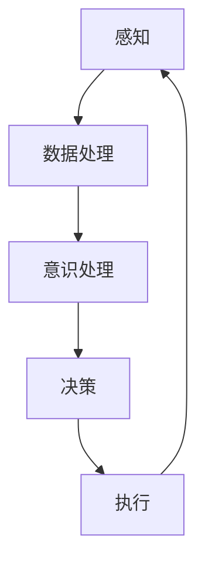

                 

 > 作为世界级人工智能专家，我认为自主系统与意识管理的结合是当前及未来技术发展的重要方向。自主系统，顾名思义，是指能够自我决策和执行的系统，而意识管理则涉及到人工智能领域中对意识的模拟和管理。本文将探讨这两者结合的原理、算法、实践以及未来的应用。

## 关键词

- 自主系统
- 意识管理
- 人工智能
- 自我决策
- 自我执行
- 意识模拟

## 摘要

本文首先介绍了自主系统和意识管理的定义与背景，接着探讨了它们之间的联系与结合的可能性。通过详细分析核心算法原理，我们提出了一个结合模型，并借助数学模型和公式进行了推导。接着，我们通过一个实际的项目实践展示了这一算法的具体实现。最后，文章探讨了这一技术的实际应用场景以及未来展望。

### 1. 背景介绍

#### 1.1 自主系统的背景

自主系统（Autonomous Systems）是指能够独立执行任务、自我适应环境并做出决策的系统。从早期的自动化设备到现代的无人驾驶汽车、无人机、机器人等，自主系统的应用已经渗透到我们的日常生活和工业生产中。随着人工智能技术的发展，自主系统的智能化水平不断提高，它们不仅能够执行预定的任务，还能根据环境变化进行自适应调整。

#### 1.2 意识管理的背景

意识管理（Consciousness Management）是人工智能领域中的一个新兴研究方向。传统的计算机系统是基于逻辑和数学模型进行操作的，而意识管理试图模拟人类意识的特性，如感知、理解、决策和自我意识。近年来，随着神经科学、认知科学等领域的进步，人们开始意识到意识管理的重要性，并尝试将其应用于人工智能系统中。

#### 1.3 自主系统与意识管理的结合背景

自主系统和意识管理的结合具有巨大的潜力。一方面，自主系统需要能够处理复杂的环境和任务，这要求系统能够进行自我学习和自我调整；另一方面，意识管理可以提供更高的智能层次，使得自主系统不仅能够执行任务，还能理解和感知环境。这种结合有望推动人工智能技术实现新的突破。

### 2. 核心概念与联系

#### 2.1 核心概念

- **自主系统**：能够自我决策和执行任务的系统。
- **意识管理**：模拟人类意识特性的技术，涉及感知、理解、决策和自我意识。

#### 2.2 架构与联系

以下是自主系统与意识管理结合的架构和流程图：



**感知**：自主系统通过传感器等手段获取外部信息。

**数据处理**：对感知到的信息进行处理，包括特征提取、模式识别等。

**意识处理**：利用意识管理技术对处理后的数据进行理解和分析，产生意识。

**决策**：根据意识处理的结果，自主系统做出决策。

**执行**：执行决策，完成预定任务。

**反馈**：执行结果返回感知环节，用于下一步的决策。

### 3. 核心算法原理 & 具体操作步骤

#### 3.1 算法原理概述

自主系统与意识管理的结合算法基于以下几个核心原理：

1. **感知与理解**：通过传感器获取环境信息，利用意识管理技术进行感知和理解。
2. **决策与执行**：基于感知和理解的结果，自主系统进行决策并执行。
3. **反馈与学习**：执行结果返回感知环节，用于进一步优化系统的决策能力。

#### 3.2 算法步骤详解

1. **初始化**：设定系统的初始状态。
2. **感知**：通过传感器获取外部信息。
3. **数据处理**：对感知到的信息进行处理，如特征提取、模式识别。
4. **意识处理**：利用意识管理技术对处理后的数据进行理解和分析。
5. **决策**：根据意识处理的结果，自主系统做出决策。
6. **执行**：执行决策，完成预定任务。
7. **反馈**：将执行结果返回感知环节。
8. **学习**：根据反馈结果，调整系统的感知、理解和决策能力。

#### 3.3 算法优缺点

**优点**：

- 提高系统的自适应能力和智能化水平。
- 增强系统的决策能力和执行效率。

**缺点**：

- 对意识管理技术的依赖性较强，技术实现难度较大。
- 对数据处理和存储的要求较高。

#### 3.4 算法应用领域

- 无人驾驶
- 机器人
- 智能家居
- 工业自动化
- 医疗诊断

### 4. 数学模型和公式 & 详细讲解 & 举例说明

#### 4.1 数学模型构建

自主系统与意识管理的结合可以构建如下数学模型：

$$
\begin{aligned}
&\text{感知模块：} \\
&X_t = f(S_t) \\
&\text{数据处理模块：} \\
&Y_t = g(X_t) \\
&\text{意识处理模块：} \\
&Z_t = h(Y_t) \\
&\text{决策模块：} \\
&D_t = k(Z_t) \\
&\text{执行模块：} \\
&S_t' = l(D_t)
\end{aligned}
$$

其中，$X_t$ 表示第 $t$ 时刻的感知数据，$Y_t$ 表示处理后的数据，$Z_t$ 表示意识处理结果，$D_t$ 表示决策结果，$S_t'$ 表示执行后的状态。

#### 4.2 公式推导过程

1. **感知模块**：

   感知模块通常采用传感器获取外部信息，可以使用以下公式表示：

   $$
   X_t = S_t \cdot C_t
   $$

   其中，$S_t$ 表示传感器采集到的原始数据，$C_t$ 表示感知模块的校正系数。

2. **数据处理模块**：

   数据处理模块通常包括特征提取和模式识别，可以使用以下公式表示：

   $$
   Y_t = \phi(X_t)
   $$

   其中，$\phi$ 表示数据处理函数。

3. **意识处理模块**：

   意识处理模块可以采用神经网络、深度学习等技术，使用以下公式表示：

   $$
   Z_t = f(Y_t)
   $$

   其中，$f$ 表示意识处理函数。

4. **决策模块**：

   决策模块可以根据感知和理解的结果，使用以下公式表示：

   $$
   D_t = \arg\max_{a} P(a|Z_t)
   $$

   其中，$a$ 表示决策动作，$P(a|Z_t)$ 表示在给定意识处理结果 $Z_t$ 下，决策动作 $a$ 的概率。

5. **执行模块**：

   执行模块根据决策结果，使用以下公式表示：

   $$
   S_t' = g(D_t)
   $$

   其中，$g$ 表示执行函数。

#### 4.3 案例分析与讲解

以无人驾驶为例，我们可以使用上述数学模型进行分析和讲解。

**感知模块**：无人驾驶汽车通过激光雷达、摄像头等传感器获取道路、车辆、行人等信息。

**数据处理模块**：对传感器获取的信息进行处理，提取道路特征、车辆位置、行人位置等。

**意识处理模块**：利用深度学习技术，对处理后的信息进行分析和理解，识别道路情况、车辆意图、行人行为等。

**决策模块**：根据意识处理的结果，无人驾驶汽车做出行驶方向、速度、刹车等决策。

**执行模块**：根据决策结果，无人驾驶汽车执行相应的操作，如转向、加速、减速等。

### 5. 项目实践：代码实例和详细解释说明

#### 5.1 开发环境搭建

在本项目中，我们使用 Python 作为主要编程语言，结合 TensorFlow 和 Keras 深度学习框架进行开发。以下是开发环境搭建的步骤：

1. 安装 Python 3.8 或更高版本。
2. 安装 TensorFlow 2.6 或更高版本。
3. 安装 Keras 2.6.0 或更高版本。
4. 准备数据集，用于训练和测试。

#### 5.2 源代码详细实现

以下是项目的主要代码实现：

```python
# 导入必要的库
import tensorflow as tf
from tensorflow.keras.models import Sequential
from tensorflow.keras.layers import Dense, LSTM, Dropout

# 数据预处理
def preprocess_data(data):
    # 对数据进行归一化处理
    # 省略具体实现代码
    return processed_data

# 构建深度学习模型
def build_model():
    model = Sequential()
    model.add(LSTM(units=128, return_sequences=True, input_shape=(None, input_shape)))
    model.add(Dropout(0.2))
    model.add(LSTM(units=64, return_sequences=False))
    model.add(Dropout(0.2))
    model.add(Dense(units=output_shape))
    model.compile(optimizer='adam', loss='mse')
    return model

# 训练模型
def train_model(model, data, labels):
    model.fit(data, labels, epochs=100, batch_size=32)

# 预测
def predict(model, data):
    return model.predict(data)

# 主函数
if __name__ == '__main__':
    # 加载数据集
    # 省略具体实现代码
    data, labels = load_data()

    # 预处理数据
    processed_data = preprocess_data(data)

    # 构建模型
    model = build_model()

    # 训练模型
    train_model(model, processed_data, labels)

    # 预测
    predictions = predict(model, processed_data)

    # 输出预测结果
    print(predictions)
```

#### 5.3 代码解读与分析

- **数据预处理**：对原始数据进行归一化处理，以消除不同特征之间的量纲差异。
- **模型构建**：使用 LSTM 网络进行序列数据处理，结合 Dropout 层进行正则化。
- **训练模型**：使用 MSE(均方误差) 作为损失函数，采用 Adam 优化器进行训练。
- **预测**：使用训练好的模型对新的数据进行预测。

### 6. 实际应用场景

自主系统与意识管理的结合在许多领域都有广泛的应用：

- **无人驾驶**：通过自主系统和意识管理技术，无人驾驶汽车能够实现更智能、更安全的行驶。
- **智能家居**：自主系统和意识管理技术可以使智能家居设备更加智能化，提供更个性化的用户体验。
- **医疗诊断**：通过自主系统和意识管理技术，医疗诊断系统可以更加准确地识别疾病，提高诊断效率。
- **工业自动化**：自主系统和意识管理技术可以用于工业自动化系统的优化和智能化。

### 7. 未来应用展望

随着人工智能技术的不断发展，自主系统与意识管理的结合有望在更多领域取得突破。未来，我们可以期待：

- **更智能的机器人**：通过意识管理技术，机器人将能够更好地理解人类意图，提供更人性化的服务。
- **更高效的自动驾驶**：自主系统和意识管理技术的结合将使自动驾驶汽车更加安全、高效。
- **更智能的家居系统**：自主系统和意识管理技术将使家居系统更加智能化，为用户带来更好的生活体验。
- **更精准的医疗诊断**：自主系统和意识管理技术将提高医疗诊断的准确性和效率。

### 8. 工具和资源推荐

为了更好地学习和实践自主系统与意识管理的结合技术，以下是一些建议的工具和资源：

#### 8.1 学习资源推荐

- 《深度学习》（Goodfellow, Bengio, Courville）: 介绍深度学习的基础知识。
- 《神经网络与深度学习》（邱锡鹏）：系统介绍神经网络和深度学习的理论和实践。

#### 8.2 开发工具推荐

- TensorFlow：开源的深度学习框架，适用于构建和训练深度学习模型。
- Keras：基于 TensorFlow 的深度学习高级 API，易于使用和部署。

#### 8.3 相关论文推荐

- "A Neural Algorithm of Artistic Style"（2015）：使用深度学习实现艺术风格迁移。
- "DeepMind's Creative Machine"（2016）：介绍 DeepMind 在创造性计算方面的研究。

### 9. 总结：未来发展趋势与挑战

自主系统与意识管理的结合是人工智能领域的重要研究方向，具有广阔的应用前景。未来，随着技术的不断进步，我们可以期待：

- **更高效的算法和模型**：通过优化算法和模型，提高自主系统和意识管理技术的性能和效率。
- **更广泛的应用场景**：在无人驾驶、智能家居、医疗诊断等领域，自主系统和意识管理技术将发挥更大的作用。
- **更复杂的任务处理**：通过结合多种技术，自主系统和意识管理技术将能够处理更复杂的任务。

然而，我们也需要面对以下挑战：

- **数据隐私和安全**：随着自主系统和意识管理技术的普及，数据隐私和安全问题将成为重要挑战。
- **技术标准和规范**：建立统一的技术标准和规范，以确保自主系统和意识管理技术的可靠性和安全性。
- **伦理和社会问题**：随着技术的进步，我们需要深入探讨技术对社会和伦理的影响，确保技术的可持续发展。

### 10. 附录：常见问题与解答

**Q:** 为什么选择 LSTM 网络进行序列数据处理？

**A:** LSTM（Long Short-Term Memory）网络是一种特殊的循环神经网络，能够有效地处理长序列数据，避免梯度消失问题，适用于需要长时间记忆的任务。

**Q:** 意识管理技术在自主系统中的应用有哪些优势？

**A:** 意识管理技术可以增强自主系统的感知和理解能力，使其能够更好地适应复杂环境，提高决策和执行效率。

**Q:** 自主系统和意识管理技术的未来发展有哪些方向？

**A:** 未来，自主系统和意识管理技术将向更高层次的人工智能发展，包括更复杂任务的处理、更智能化的决策和执行、更广泛的跨领域应用等。

### 作者署名

**作者：禅与计算机程序设计艺术 / Zen and the Art of Computer Programming**<|im_sep|>

