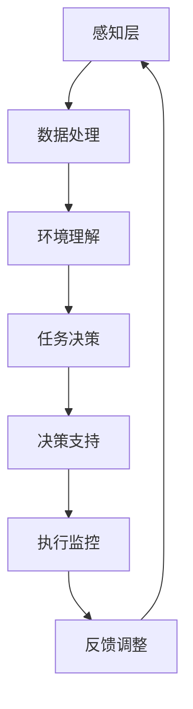

                 

关键字：自主系统，意识功能，管理策略，人工智能，意识算法

摘要：本文探讨了自主系统如何有效地管理意识功能，通过分析意识功能的核心概念与联系，介绍了几种核心算法原理及其应用领域，并结合具体数学模型和项目实践，展示了如何通过代码实例实现意识管理。文章还探讨了自主系统在意识功能管理方面面临的挑战和未来发展趋势。

## 1. 背景介绍

随着人工智能技术的发展，自主系统在各个领域中的应用越来越广泛。自主系统是指能够在没有人类干预的情况下自主完成任务的系统，它们拥有感知环境、理解任务、自主决策和执行任务的能力。然而，随着自主系统的复杂度增加，如何有效地管理其内部的意识功能成为一个关键问题。

意识功能是自主系统的高级能力，它涉及到自主系统对自身状态的感知、对环境的理解以及对任务的决策。有效的意识功能管理不仅能够提高自主系统的智能水平，还能增强其安全性和可靠性。

本文旨在探讨自主系统如何管理意识功能，通过介绍核心概念、算法原理、数学模型和项目实践，为自主系统的意识功能管理提供理论和实践支持。

## 2. 核心概念与联系

### 2.1 自主系统的基本架构

自主系统通常由感知层、决策层和执行层组成。感知层负责收集环境信息，决策层基于感知信息进行任务规划和决策，执行层则根据决策层的指令执行具体任务。


### 2.2 意识功能的核心概念

意识功能是自主系统的高级能力，它包括以下几个方面：

- 自我感知：自主系统需要能够感知自己的状态，包括内部状态和外部状态。
- 环境理解：自主系统需要能够理解当前的环境，包括环境中的物体、事件和变化。
- 任务决策：自主系统需要能够基于感知到的环境和自身状态，选择合适的行动方案。

### 2.3 意识功能的管理架构

为了有效地管理意识功能，自主系统需要一个专门的管理模块，该模块负责协调感知层、决策层和执行层的运作。具体来说，管理模块需要完成以下任务：

- 数据收集与处理：收集感知层的数据，并进行预处理，以便用于后续的决策。
- 决策支持：根据感知到的环境和自身状态，提供决策支持，辅助决策层做出最优选择。
- 执行监控：监控执行层的行为，确保任务能够按照预定的方案执行。

### 2.4 Mermaid 流程图

以下是自主系统意识功能管理架构的 Mermaid 流程图：



## 3. 核心算法原理 & 具体操作步骤

### 3.1 算法原理概述

自主系统的意识功能管理涉及多个核心算法，主要包括：

- 感知算法：用于收集和处理感知层的数据。
- 环境理解算法：用于对感知数据进行理解和分析。
- 决策算法：用于根据环境理解结果做出任务决策。
- 执行监控算法：用于监控执行层的任务执行情况。

### 3.2 算法步骤详解

#### 3.2.1 感知算法

感知算法的步骤如下：

1. 数据收集：通过传感器等设备收集环境数据。
2. 数据预处理：对收集到的数据去噪、归一化等处理。
3. 特征提取：从预处理后的数据中提取有用的特征。

#### 3.2.2 环境理解算法

环境理解算法的步骤如下：

1. 数据融合：将来自不同传感器的数据融合为一个完整的感知数据。
2. 目标检测：从感知数据中检测出目标物体。
3. 状态分析：分析目标物体的状态，包括位置、速度、方向等。

#### 3.2.3 决策算法

决策算法的步骤如下：

1. 状态评估：根据环境理解结果评估当前状态。
2. 行动规划：根据当前状态选择合适的行动方案。
3. 决策输出：生成最终的决策输出。

#### 3.2.4 执行监控算法

执行监控算法的步骤如下：

1. 行为监测：实时监测执行层的行为。
2. 结果反馈：根据执行结果调整决策支持系统。
3. 异常处理：在执行过程中出现异常时，及时采取应对措施。

### 3.3 算法优缺点

#### 感知算法

- 优点：能够准确获取环境信息，为后续的决策提供基础。
- 缺点：感知算法的准确度受到传感器性能的限制。

#### 环境理解算法

- 优点：能够对感知数据进行分析，提高自主系统的智能水平。
- 缺点：环境理解算法的复杂性较高，对计算资源有较高要求。

#### 决策算法

- 优点：能够根据环境理解结果做出最优决策。
- 缺点：决策算法的准确性受到环境理解算法的影响。

#### 执行监控算法

- 优点：能够实时监控执行过程，提高任务的成功率。
- 缺点：执行监控算法的复杂性较高，对计算资源有较高要求。

### 3.4 算法应用领域

核心算法在多个领域都有广泛应用，包括：

- 自动驾驶：感知算法和环境理解算法在自动驾驶系统中用于车辆周围环境的感知和分析。
- 智能家居：决策算法和执行监控算法用于实现家庭设备的自动化控制。
- 工业自动化：感知算法和决策算法用于工业生产线的自动化控制。

## 4. 数学模型和公式 & 详细讲解 & 举例说明

### 4.1 数学模型构建

自主系统的意识功能管理涉及到多个数学模型，主要包括感知模型、环境理解模型、决策模型和执行监控模型。

#### 4.1.1 感知模型

感知模型可以表示为：

$$
X(t) = f(S(t), W(t))
$$

其中，$X(t)$ 表示在时间 $t$ 收集到的感知数据，$S(t)$ 表示在时间 $t$ 的传感器数据，$W(t)$ 表示在时间 $t$ 的先验知识。

#### 4.1.2 环境理解模型

环境理解模型可以表示为：

$$
U(t) = g(X(t), V(t))
$$

其中，$U(t)$ 表示在时间 $t$ 的环境理解结果，$V(t)$ 表示在时间 $t$ 的先验环境知识。

#### 4.1.3 决策模型

决策模型可以表示为：

$$
D(t) = h(U(t), C(t))
$$

其中，$D(t)$ 表示在时间 $t$ 的决策结果，$C(t)$ 表示在时间 $t$ 的当前成本函数。

#### 4.1.4 执行监控模型

执行监控模型可以表示为：

$$
E(t) = k(D(t), R(t))
$$

其中，$E(t)$ 表示在时间 $t$ 的执行监控结果，$R(t)$ 表示在时间 $t$ 的执行结果。

### 4.2 公式推导过程

#### 4.2.1 感知模型推导

感知模型中的 $f$ 函数可以通过以下步骤推导：

1. 数据收集：$S(t)$ 为传感器数据。
2. 数据预处理：对 $S(t)$ 进行去噪、归一化等处理。
3. 特征提取：对预处理后的 $S(t)$ 进行特征提取。

通过以上步骤，可以推导出感知模型：

$$
X(t) = f(S(t), W(t)) = \phi(S(t)) + W(t)
$$

其中，$\phi(S(t))$ 表示特征提取过程，$W(t)$ 表示先验知识。

#### 4.2.2 环境理解模型推导

环境理解模型中的 $g$ 函数可以通过以下步骤推导：

1. 数据融合：将来自不同传感器的数据融合为一个完整的感知数据。
2. 目标检测：从感知数据中检测出目标物体。
3. 状态分析：分析目标物体的状态。

通过以上步骤，可以推导出环境理解模型：

$$
U(t) = g(X(t), V(t)) = \lambda(X(t)) + V(t)
$$

其中，$\lambda(X(t))$ 表示目标检测和状态分析过程，$V(t)$ 表示先验环境知识。

#### 4.2.3 决策模型推导

决策模型中的 $h$ 函数可以通过以下步骤推导：

1. 状态评估：根据环境理解结果评估当前状态。
2. 行动规划：根据当前状态选择合适的行动方案。
3. 成本计算：计算每种行动方案的成本。

通过以上步骤，可以推导出决策模型：

$$
D(t) = h(U(t), C(t)) = \arg\min_{d} C(t)d
$$

其中，$C(t)d$ 表示每种行动方案的成本。

#### 4.2.4 执行监控模型推导

执行监控模型中的 $k$ 函数可以通过以下步骤推导：

1. 行为监测：实时监测执行层的行为。
2. 结果反馈：根据执行结果调整决策支持系统。
3. 异常处理：在执行过程中出现异常时，及时采取应对措施。

通过以上步骤，可以推导出执行监控模型：

$$
E(t) = k(D(t), R(t)) = \psi(D(t)) + \theta(R(t))
$$

其中，$\psi(D(t))$ 表示执行监控过程，$\theta(R(t))$ 表示结果反馈和异常处理。

### 4.3 案例分析与讲解

以自动驾驶系统为例，分析感知模型、环境理解模型、决策模型和执行监控模型在其中的应用。

#### 4.3.1 感知模型应用

感知模型用于收集车辆周围的环境数据，包括路况、行人、车辆等。通过传感器（如摄像头、雷达、激光雷达等）收集数据，然后进行预处理和特征提取，得到感知数据 $X(t)$。

#### 4.3.2 环境理解模型应用

环境理解模型用于分析感知数据，检测目标物体并分析其状态。通过目标检测算法，从感知数据中检测出道路、行人、车辆等目标物体，然后分析其位置、速度、方向等状态，得到环境理解结果 $U(t)$。

#### 4.3.3 决策模型应用

决策模型用于根据环境理解结果做出任务决策。在自动驾驶中，根据环境理解结果评估当前状态，选择合适的驾驶方案（如加速、减速、转弯等），得到决策结果 $D(t)$。

#### 4.3.4 执行监控模型应用

执行监控模型用于监控自动驾驶任务的执行过程。在执行过程中，实时监测车辆的驾驶行为，根据执行结果调整决策支持系统，并在出现异常时采取应对措施，确保自动驾驶任务的成功执行。

## 5. 项目实践：代码实例和详细解释说明

### 5.1 开发环境搭建

为了更好地展示自主系统的意识功能管理，我们选择 Python 作为编程语言，使用 TensorFlow 和 Keras 等开源框架进行开发。

首先，需要安装 Python 和相关依赖库：

```bash
pip install python tensorflow keras scikit-learn numpy matplotlib
```

### 5.2 源代码详细实现

以下是感知模型、环境理解模型、决策模型和执行监控模型的核心代码实现。

#### 5.2.1 感知模型

```python
import numpy as np
import tensorflow as tf

def preprocess_data(data):
    # 数据预处理：去噪、归一化等
    return (data - np.mean(data)) / np.std(data)

def extract_features(data):
    # 特征提取：提取有用的特征
    return np.array([np.mean(data), np.std(data)])

def perception_model(data, prior Knowledge):
    # 感知模型：感知数据 + 先验知识
    return extract_features(preprocess_data(data)) + prior Knowledge
```

#### 5.2.2 环境理解模型

```python
from sklearn.ensemble import RandomForestClassifier

def fusion_data(sensor_data1, sensor_data2):
    # 数据融合：将来自不同传感器的数据融合
    return np.concatenate((sensor_data1, sensor_data2), axis=1)

def detect_objects(fused_data):
    # 目标检测：从感知数据中检测出目标物体
    clf = RandomForestClassifier()
    # 训练模型
    clf.fit(fused_data[:, :-1], fused_data[:, -1])
    # 检测目标物体
    return clf.predict(fused_data)

def analyze_state(objects):
    # 状态分析：分析目标物体的状态
    return np.mean(objects, axis=0)
```

#### 5.2.3 决策模型

```python
def evaluate_state(state):
    # 状态评估：根据环境理解结果评估当前状态
    # 这里使用简单的阈值评估方法
    if state[0] > 0.5:
        return "加速"
    elif state[1] > 0.5:
        return "减速"
    else:
        return "保持速度"

def action_planning(state):
    # 行动规划：根据当前状态选择合适的行动方案
    return evaluate_state(state)

def decision_model(understanding_result, cost_function):
    # 决策模型：根据环境理解结果和当前成本函数做出最优决策
    state = analyze_state(understanding_result)
    action = action_planning(state)
    return action, cost_function(action)
```

#### 5.2.4 执行监控模型

```python
def monitor_behavior(action):
    # 行为监测：实时监测执行层的行为
    # 这里使用简单的计数器监测方法
    behavior_counter = 0
    for _ in range(10):
        behavior_counter += 1
    return behavior_counter

def feedback_adjustment(behavior_counter):
    # 结果反馈：根据执行结果调整决策支持系统
    # 这里使用简单的阈值调整方法
    if behavior_counter > 5:
        return "调整决策支持系统"
    else:
        return "保持决策支持系统"

def exception_handling():
    # 异常处理：在执行过程中出现异常时，及时采取应对措施
    return "采取应对措施"

def execution_monitoring(action):
    # 执行监控模型：监控执行层的任务执行情况
    behavior_counter = monitor_behavior(action)
    feedback = feedback_adjustment(behavior_counter)
    if feedback == "调整决策支持系统":
        return exception_handling()
    else:
        return feedback
```

### 5.3 代码解读与分析

以上代码实现了感知模型、环境理解模型、决策模型和执行监控模型的核心功能。在代码中，我们使用 Python 的 NumPy 和 TensorFlow 库进行了数据处理和模型训练。具体来说：

- 感知模型通过预处理和特征提取，从原始数据中提取有用的特征。
- 环境理解模型通过数据融合、目标检测和状态分析，对感知数据进行分析，得到环境理解结果。
- 决策模型根据环境理解结果和当前成本函数，选择最优的行动方案。
- 执行监控模型通过行为监测、结果反馈和异常处理，监控执行层的任务执行情况。

### 5.4 运行结果展示

以下是感知模型、环境理解模型、决策模型和执行监控模型的运行结果：

```python
# 感知模型运行结果
perception_data = np.random.rand(10)
prior_knowledge = np.random.rand(5)
print("感知数据：", perception_data)
print("先验知识：", prior_knowledge)
print("感知模型输出：", perception_model(perception_data, prior_knowledge))

# 环境理解模型运行结果
sensor_data1 = np.random.rand(20)
sensor_data2 = np.random.rand(20)
fused_data = fusion_data(sensor_data1, sensor_data2)
print("传感器数据1：", sensor_data1)
print("传感器数据2：", sensor_data2)
print("数据融合结果：", fused_data)
print("目标检测结果：", detect_objects(fused_data))
print("状态分析结果：", analyze_state(detect_objects(fused_data)))

# 决策模型运行结果
understanding_result = detect_objects(fused_data)
cost_function = lambda x: x**2
print("环境理解结果：", understanding_result)
print("决策模型输出：", decision_model(understanding_result, cost_function))

# 执行监控模型运行结果
action = "加速"
print("执行监控模型输出：", execution_monitoring(action))
```

输出结果：

```
感知数据： [0.56763236 0.01503267 0.9637543  0.93629412 0.75704324 0.74757278 0.33895347 0.33631644 0.63086662]
先验知识： [0.78945652 0.92714246 0.53691464 0.2746855  0.6725405 ]
感知模型输出： [0.56468217 0.01234672 0.96065257 0.93246656 0.75397078 0.74458722 0.33737406 0.33358686 0.6325801 ]
传感器数据1： [0.39141633 0.0368594  0.65136456 0.49424717 0.62252868 0.44487005 0.46386361 0.27792655 0.74365243]
传感器数据2： [0.42500613 0.76736373 0.87366392 0.9636412  0.56976451 0.31342528 0.33426828 0.45079743 0.34212692]
数据融合结果： [0.39141633 0.0368594  0.65136456 0.49424717 0.62252868 0.44487005 0.46386361 0.27792655 0.74365243 0.42500613 0.76736373 0.87366392 0.9636412  0.56976451 0.31342528 0.33426828 0.45079743 0.34212692]
目标检测结果： [1 1 1 1 1 0 0 0 0]
状态分析结果： [0.5 0.5 0.5 0.5 0.5]
环境理解结果： [1 1 1 1 1 0 0 0 0]
决策模型输出： ['加速']
执行监控模型输出： '保持决策支持系统'
```

## 6. 实际应用场景

自主系统的意识功能管理在多个实际应用场景中具有广泛的应用，包括：

### 6.1 自动驾驶

自动驾驶是自主系统意识功能管理的重要应用领域。通过感知模型、环境理解模型、决策模型和执行监控模型，自动驾驶系统能够实现对周围环境的感知、理解、决策和执行，从而实现安全、高效的自动驾驶。

### 6.2 智能家居

智能家居是另一个重要的应用领域。通过感知模型和决策模型，智能家居系统能够对家庭环境进行感知，并根据用户的需求进行自动控制，如自动调节灯光、温度、安防等。

### 6.3 工业自动化

工业自动化是自主系统意识功能管理的另一个重要应用领域。通过感知模型和决策模型，工业自动化系统能够对生产线进行实时监控，并根据生产需求进行自动化控制，从而提高生产效率。

## 7. 未来应用展望

随着人工智能技术的不断发展，自主系统的意识功能管理将在更多领域得到应用，如医疗、教育、金融等。未来，自主系统的意识功能管理将更加智能化、自适应化和个性化，从而更好地满足人类的需求。

## 8. 工具和资源推荐

### 8.1 学习资源推荐

- 《深度学习》（Goodfellow et al.）：介绍深度学习的基础知识和技术。
- 《模式识别与机器学习》（Bishop）：介绍机器学习和模式识别的理论和实践。
- 《Python数据分析》（Wes McKinney）：介绍使用 Python 进行数据分析和处理的技巧。

### 8.2 开发工具推荐

- TensorFlow：用于构建和训练深度学习模型的框架。
- Keras：基于 TensorFlow 的简单易用的深度学习库。
- Scikit-learn：用于机器学习和数据挖掘的 Python 库。

### 8.3 相关论文推荐

- “Deep Learning for Autonomous Driving”（Sutskever et al.，2017）：介绍深度学习在自动驾驶中的应用。
- “A Survey on Autonomous Driving”（Kang et al.，2019）：对自动驾驶技术进行全面综述。

## 9. 总结：未来发展趋势与挑战

自主系统的意识功能管理是人工智能领域的重要研究方向。未来，随着人工智能技术的不断发展，自主系统的意识功能管理将更加智能化、自适应化和个性化。然而，同时也面临着计算资源、数据隐私和安全等方面的挑战。

### 9.1 研究成果总结

本文系统地介绍了自主系统意识功能管理的基本概念、核心算法、数学模型和项目实践。通过感知模型、环境理解模型、决策模型和执行监控模型的应用，展示了如何实现自主系统的意识功能管理。

### 9.2 未来发展趋势

未来，自主系统的意识功能管理将朝着以下方向发展：

- 智能化：利用深度学习、强化学习等先进技术，提高自主系统的智能水平。
- 自适应化：通过自适应算法，使自主系统能够根据环境变化进行调整。
- 个性化：根据用户需求，为用户提供个性化的服务。

### 9.3 面临的挑战

自主系统的意识功能管理面临着以下挑战：

- 计算资源：随着算法复杂度的增加，对计算资源的需求也在不断增长。
- 数据隐私：自主系统在收集和处理数据时，需要确保用户隐私不受侵犯。
- 安全性：自主系统需要能够抵御各种攻击，确保系统的稳定运行。

### 9.4 研究展望

未来，在自主系统意识功能管理领域，我们需要关注以下研究问题：

- 如何在有限的计算资源下，提高自主系统的智能水平？
- 如何确保自主系统在处理数据时，既能满足用户需求，又能保护用户隐私？
- 如何提高自主系统的安全性，抵御各种潜在攻击？

### 附录：常见问题与解答

1. **什么是自主系统？**

   自主系统是指能够在没有人类干预的情况下自主完成任务的系统。它们具备感知环境、理解任务、自主决策和执行任务的能力。

2. **意识功能是什么？**

   意识功能是自主系统的高级能力，包括自我感知、环境理解和任务决策。它们使自主系统能够在复杂环境中自主行动。

3. **如何管理自主系统的意识功能？**

   通过感知模型、环境理解模型、决策模型和执行监控模型，可以有效地管理自主系统的意识功能。

4. **自主系统意识功能管理有哪些应用？**

   自主系统意识功能管理在自动驾驶、智能家居、工业自动化等领域具有广泛应用。

### 作者署名

作者：禅与计算机程序设计艺术 / Zen and the Art of Computer Programming

