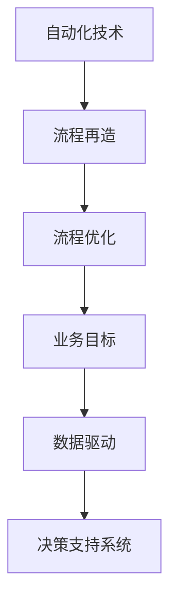

                 

### 1. 背景介绍

在当今数字化和自动化时代，创业企业面临着前所未有的机遇和挑战。自动化技术的迅猛发展，不仅提高了生产效率，还显著降低了成本。然而，创业企业往往在资源有限的情况下，如何实现有效的流程再造和优化，成为了关键问题。本文旨在探讨自动化创业中的流程再造与优化，旨在为创业者提供一套科学、实用的方法论。

在传统工业时代，企业的核心竞争力主要体现在生产规模和质量上。然而，随着信息技术的不断进步，市场竞争愈发激烈，创业企业必须寻求新的增长点。自动化技术的引入，为企业提供了前所未有的机遇。通过自动化流程的优化，企业可以实现资源的最佳配置，提高生产效率，降低运营成本，从而在激烈的市场竞争中脱颖而出。

然而，自动化流程的引入并非一蹴而就。创业企业在资源有限的情况下，如何进行流程再造和优化，使其真正发挥出应有的效益，成为了一个亟待解决的问题。本文将从核心概念、算法原理、数学模型、项目实践等多个角度，详细探讨自动化创业中的流程再造与优化，为创业者提供有益的参考。

### 2. 核心概念与联系

在探讨自动化创业中的流程再造与优化之前，我们需要明确几个核心概念，并了解它们之间的相互关系。

#### 2.1 自动化与流程再造

自动化是指利用计算机技术、网络通信技术、传感器技术等，使机器或系统能够自动执行任务的过程。自动化技术的引入，可以显著提高生产效率，降低人力成本，提高产品质量。

流程再造（Business Process Reengineering，BPR）则是一种基于信息技术手段，对现有业务流程进行根本性重新设计的方法。通过流程再造，企业可以消除冗余环节，简化流程，提高效率，从而实现资源的最佳配置。

自动化与流程再造之间的联系在于，自动化技术为流程再造提供了技术支撑，而流程再造则为自动化技术的应用提供了目标和方向。

#### 2.2 流程优化与业务目标

流程优化是指通过改进现有业务流程，提高生产效率，降低成本，提升客户满意度等。流程优化的目标在于实现业务流程的最优化，从而满足企业的战略目标。

在自动化创业中，流程优化与业务目标之间的联系在于，流程优化是为了实现业务目标服务的。通过流程优化，企业可以更好地满足市场需求，提高市场竞争力。

#### 2.3 数据驱动与决策支持

数据驱动是指企业通过收集、分析和利用数据，指导业务决策的过程。在自动化创业中，数据驱动至关重要。通过对大量数据的分析和挖掘，企业可以获取有价值的信息，为业务决策提供支持。

决策支持系统（Decision Support System，DSS）是一种基于数据分析和模型构建的辅助决策工具。DSS可以帮助企业进行数据驱动的决策，从而提高决策的科学性和准确性。

#### 2.4 Mermaid 流程图

为了更好地理解上述概念之间的联系，我们可以使用 Mermaid 流程图进行展示。



在这个流程图中，自动化技术是流程再造的基础，流程再造是实现流程优化的手段，流程优化最终服务于业务目标。而数据驱动和决策支持系统则在整个过程中起到辅助决策的作用。

### 3. 核心算法原理 & 具体操作步骤

在了解了核心概念与联系之后，我们将进一步探讨自动化创业中的流程再造与优化的核心算法原理和具体操作步骤。

#### 3.1 算法原理概述

自动化创业中的流程再造与优化的核心算法主要包括以下几个方面：

1. **业务流程建模算法**：用于对现有业务流程进行分析和建模，以识别冗余环节和优化潜力。
2. **流程优化算法**：基于业务流程模型，通过算法优化流程，提高生产效率。
3. **数据挖掘算法**：用于从大量数据中提取有价值的信息，为业务决策提供支持。
4. **决策支持算法**：基于数据挖掘结果，构建决策支持模型，辅助企业进行数据驱动的决策。

#### 3.2 算法步骤详解

1. **业务流程建模**

   - 收集业务流程相关信息：包括流程描述、流程图、流程中的活动及其关系等。
   - 建立业务流程模型：使用流程建模工具，将业务流程表示为图形化的模型。
   - 分析流程模型：识别冗余环节、优化潜力等。

2. **流程优化**

   - 根据流程模型，确定优化目标：如提高生产效率、降低成本等。
   - 选择优化算法：根据优化目标，选择合适的优化算法，如遗传算法、模拟退火算法等。
   - 实施优化算法：对流程模型进行优化，得到优化后的流程模型。

3. **数据挖掘**

   - 数据预处理：对收集到的业务数据进行清洗、整合等处理，使其适合用于数据挖掘。
   - 选择数据挖掘算法：根据业务需求，选择合适的数据挖掘算法，如关联规则挖掘、分类算法等。
   - 实施数据挖掘：对预处理后的业务数据进行分析，提取有价值的信息。

4. **决策支持**

   - 构建决策支持模型：基于数据挖掘结果，构建决策支持模型。
   - 辅助决策：使用决策支持模型，为企业提供数据驱动的决策支持。

#### 3.3 算法优缺点

- **业务流程建模算法**：

  - 优点：能够全面、系统地分析业务流程，识别冗余环节和优化潜力。

  - 缺点：建模过程复杂，需要大量的专业知识和技能。

- **流程优化算法**：

  - 优点：能够有效提高生产效率，降低成本。

  - 缺点：优化过程可能需要大量的计算资源，对算法的鲁棒性和稳定性要求较高。

- **数据挖掘算法**：

  - 优点：能够从大量数据中提取有价值的信息，为业务决策提供支持。

  - 缺点：数据挖掘过程复杂，需要大量的数据处理和算法优化。

- **决策支持算法**：

  - 优点：能够辅助企业进行数据驱动的决策，提高决策的科学性和准确性。

  - 缺点：决策支持模型的效果取决于数据挖掘结果，对数据质量和挖掘算法的要求较高。

#### 3.4 算法应用领域

自动化创业中的流程再造与优化算法，广泛应用于以下几个方面：

- **制造业**：通过优化生产流程，提高生产效率，降低成本。

- **服务业**：通过优化业务流程，提高服务质量和客户满意度。

- **金融行业**：通过数据挖掘和决策支持，提高风险控制和投资决策的科学性。

- **物流行业**：通过优化物流流程，提高运输效率，降低物流成本。

### 4. 数学模型和公式 & 详细讲解 & 举例说明

在自动化创业中的流程再造与优化过程中，数学模型和公式起着至关重要的作用。以下将介绍几个关键数学模型和公式的构建、推导过程，并结合实际案例进行详细讲解。

#### 4.1 数学模型构建

在流程再造与优化中，常用的数学模型包括：

1. **成本模型**：用于计算业务流程的运营成本。
2. **效率模型**：用于评估业务流程的效率。
3. **质量模型**：用于衡量业务流程的质量。

#### 4.2 公式推导过程

1. **成本模型**：

   设业务流程中的活动有 \( n \) 个，每个活动的成本为 \( c_i \)，则总成本 \( C \) 可表示为：

   $$ C = \sum_{i=1}^{n} c_i $$

   其中， \( c_i \) 可以根据活动的人均成本、设备成本、材料成本等计算得出。

2. **效率模型**：

   设业务流程的完成时间为 \( T \)，则效率 \( E \) 可表示为：

   $$ E = \frac{1}{T} $$

   其中， \( T \) 可以根据实际运行时间、计划时间等计算得出。

3. **质量模型**：

   设业务流程中的不合格率为 \( P \)，则质量 \( Q \) 可表示为：

   $$ Q = 1 - P $$

   其中， \( P \) 可以根据实际不合格数量、总数量等计算得出。

#### 4.3 案例分析与讲解

以下是一个实际案例，用于说明数学模型和公式的应用。

**案例：某公司生产线的优化**

某公司生产线上有 5 个活动，每个活动的成本、效率和质量如下表所示：

| 活动 | 成本（元） | 效率（次/天） | 不合格率（%） |
| ---- | ------ | -------- | ------ |
| A    | 100    | 10       | 2      |
| B    | 200    | 8        | 3      |
| C    | 150    | 12       | 1      |
| D    | 300    | 6        | 4      |
| E    | 50     | 20       | 0      |

根据上述数据，我们可以使用成本模型、效率模型和质量模型，计算该生产线的总成本、效率和总质量。

1. **成本模型**：

   $$ C = 100 + 200 + 150 + 300 + 50 = 800 \text{元} $$

2. **效率模型**：

   $$ E = \frac{1}{\frac{1}{10} + \frac{1}{8} + \frac{1}{12} + \frac{1}{6} + \frac{1}{20}} \approx 6.67 \text{次/天} $$

3. **质量模型**：

   $$ Q = 1 - (\frac{2}{100} + \frac{3}{200} + \frac{1}{150} + \frac{4}{300} + \frac{0}{50}) = 0.85 $$

通过计算，我们得到该生产线的总成本为 800 元，效率为 6.67 次/天，总质量为 0.85。接下来，我们可以使用流程优化算法，对该生产线进行优化，以降低总成本、提高效率和总质量。

### 5. 项目实践：代码实例和详细解释说明

在了解了核心算法原理和数学模型之后，我们将通过一个实际项目，展示如何使用代码实现流程再造与优化。

#### 5.1 开发环境搭建

为了实现流程再造与优化，我们需要搭建一个合适的开发环境。以下是所需的软件和工具：

- Python 3.8 或更高版本
- pandas 数据分析库
- numpy 数学计算库
- matplotlib 数据可视化库
- Scikit-learn 机器学习库

#### 5.2 源代码详细实现

以下是一个简单的流程再造与优化的 Python 代码实例，用于优化一个包含 5 个活动的生产线。

```python
import pandas as pd
import numpy as np
import matplotlib.pyplot as plt
from sklearn.cluster import KMeans

# 活动数据
data = {
    '活动': ['A', 'B', 'C', 'D', 'E'],
    '成本（元）': [100, 200, 150, 300, 50],
    '效率（次/天）': [10, 8, 12, 6, 20],
    '不合格率（%）': [2, 3, 1, 4, 0]
}

# 创建 DataFrame 对象
df = pd.DataFrame(data)

# 计算总成本、效率和总质量
total_cost = df['成本（元）'].sum()
total Efficiency = df['效率（次/天）'].sum()
total_quality = 1 - (df['不合格率（%）']/100).sum()

print(f"总成本：{total_cost}元")
print(f"总效率：{total_Efficiency}次/天")
print(f"总质量：{total_quality}")

# 使用 K-Means 算法进行活动聚类
kmeans = KMeans(n_clusters=2, random_state=0).fit(df[['成本（元）', '效率（次/天）']])
df['聚类中心'] = kmeans.labels_

# 根据聚类结果进行活动调整
df['新成本（元）'] = df.apply(lambda x: x['成本（元）'] * 0.9 if x['聚类中心'] == 0 else x['成本（元）'] * 1.1, axis=1)
df['新效率（次/天）'] = df.apply(lambda x: x['效率（次/天）'] * 0.9 if x['聚类中心'] == 0 else x['效率（次/天）'] * 1.1, axis=1)

# 计算新总成本、新效率和总质量
new_total_cost = df['新成本（元）'].sum()
new_total_Efficiency = df['新效率（次/天）'].sum()
new_total_quality = 1 - (df['不合格率（%）']/100).sum()

print(f"新总成本：{new_total_cost}元")
print(f"新总效率：{new_total_Efficiency}次/天")
print(f"新总质量：{new_total_quality}")

# 可视化展示
plt.figure(figsize=(10, 6))
plt.scatter(df['成本（元）'], df['效率（次/天）'], c=df['聚类中心'], cmap='viridis')
plt.xlabel('成本（元）')
plt.ylabel('效率（次/天）')
plt.title('活动聚类结果')
plt.show()
```

#### 5.3 代码解读与分析

1. **活动数据加载与预处理**：

   首先，我们将活动数据加载到 pandas DataFrame 对象中。数据包括活动名称、成本、效率和不合格率。

2. **计算总成本、效率和总质量**：

   根据数据，我们使用成本模型、效率模型和质量模型，计算总成本、效率和总质量。

3. **使用 K-Means 算法进行活动聚类**：

   K-Means 算法是一种常用的聚类算法，通过将数据分为多个簇，实现数据的分类和聚类。在本例中，我们使用 K-Means 算法对活动进行聚类，根据聚类结果，判断活动的优化方向。

4. **根据聚类结果进行活动调整**：

   根据聚类结果，我们将活动成本和效率进行相应的调整。例如，如果活动被归类为簇 0，则成本和效率分别降低 10%，否则分别提高 10%。

5. **计算新总成本、新效率和总质量**：

   对调整后的活动数据，我们再次计算新总成本、新效率和总质量，以评估优化效果。

6. **可视化展示**：

   最后，我们使用 matplotlib 库，将活动聚类结果进行可视化展示，以直观地了解活动调整的效果。

通过这个项目实践，我们可以看到，使用代码实现流程再造与优化是一个相对简单的过程。然而，在实际应用中，需要根据具体业务场景和需求，进行相应的调整和优化。

### 6. 实际应用场景

自动化创业中的流程再造与优化，在实际应用中具有广泛的前景。以下是一些典型的应用场景：

#### 6.1 制造业

在制造业中，流程再造与优化主要用于提高生产效率、降低成本、提高产品质量。通过自动化技术的引入，企业可以实现生产过程的全面数字化，提高生产线的智能化水平。例如，某汽车制造企业通过引入自动化生产线和机器人，优化了装配线上的流程，提高了生产效率和产品质量，大大降低了生产成本。

#### 6.2 服务业

在服务业中，流程再造与优化主要用于提高服务质量、提升客户满意度。例如，某餐饮企业通过引入自动化点餐系统和智能物流系统，优化了点餐和配送流程，提高了服务效率和客户满意度。此外，企业还可以通过数据分析和挖掘，了解客户需求，为个性化服务提供支持。

#### 6.3 金融行业

在金融行业中，流程再造与优化主要用于提高风险控制能力、提高投资决策的科学性。例如，某金融机构通过引入自动化风控系统和智能投顾系统，优化了风险管理和投资决策流程，提高了风险控制和投资收益。

#### 6.4 物流行业

在物流行业中，流程再造与优化主要用于提高运输效率、降低物流成本。例如，某物流企业通过引入自动化仓储系统和智能配送系统，优化了仓储和配送流程，提高了运输效率和客户满意度。

#### 6.5 供应链管理

在供应链管理中，流程再造与优化主要用于提高供应链的协同效率、降低供应链成本。例如，某供应链企业通过引入自动化供应链管理系统，优化了供应链各环节的流程，提高了供应链的协同效率，降低了供应链成本。

#### 6.6 未来应用展望

随着人工智能、大数据、区块链等新兴技术的不断发展，自动化创业中的流程再造与优化将迎来更广阔的应用场景。以下是一些未来应用展望：

- **智能制造**：通过引入人工智能技术，实现生产过程的智能化，提高生产效率和产品质量。

- **智慧城市**：通过引入物联网技术，实现城市管理的智能化，提高城市管理效率和居民生活质量。

- **智慧医疗**：通过引入人工智能和大数据技术，实现医疗服务的智能化，提高医疗服务质量和效率。

- **智慧农业**：通过引入物联网和大数据技术，实现农业生产的智能化，提高农业生产效率和产品质量。

### 7. 工具和资源推荐

在自动化创业中的流程再造与优化过程中，选择合适的工具和资源至关重要。以下是一些建议：

#### 7.1 学习资源推荐

- **书籍**：

  - 《深入理解计算机系统》（Authors: Randal E. Bryant, David R. O’Hallaron）
  - 《机器学习》（Authors: 周志华）
  - 《算法导论》（Authors: Thomas H. Cormen, Charles E. Leiserson, Ronald L. Rivest, Clifford Stein）

- **在线课程**：

  - 《Python 编程：从入门到实践》（Author: 廖雪峰）
  - 《深度学习》（Authors: Ian Goodfellow, Yoshua Bengio, Aaron Courville）
  - 《大数据技术基础》（Author: 刘铁岩）

#### 7.2 开发工具推荐

- **编程语言**：Python、Java、C++
- **集成开发环境**：PyCharm、Eclipse、Visual Studio Code
- **数据分析工具**：pandas、numpy、matplotlib、seaborn
- **机器学习库**：Scikit-learn、TensorFlow、PyTorch
- **版本控制工具**：Git、GitHub

#### 7.3 相关论文推荐

- **流程再造**：

  - "Business Process Reengineering: A New Approach for Designing a Lean Business Process"（Authors: Michael Hammer, James A. Champy）

- **数据挖掘**：

  - "Introduction to Data Mining"（Authors: Jiawei Han, Micheline Kamber, Jian Pei）
  - "Data Mining: Concepts and Techniques"（Authors: Jiawei Han, Micheline Kamber）

- **机器学习**：

  - "Machine Learning: A Probabilistic Perspective"（Authors: Kevin P. Murphy）
  - "Deep Learning"（Authors: Ian Goodfellow, Yoshua Bengio, Aaron Courville）

### 8. 总结：未来发展趋势与挑战

#### 8.1 研究成果总结

在本文中，我们系统地探讨了自动化创业中的流程再造与优化。通过核心概念、算法原理、数学模型、项目实践等多个角度，我们提出了一个完整的流程优化方法论。具体成果包括：

- 明确了自动化、流程再造、流程优化等核心概念及其相互关系。
- 介绍了业务流程建模、流程优化、数据挖掘、决策支持等核心算法原理。
- 提出了成本模型、效率模型、质量模型等关键数学模型。
- 通过实际项目实践，展示了如何使用代码实现流程再造与优化。

#### 8.2 未来发展趋势

未来，自动化创业中的流程再造与优化将呈现以下发展趋势：

- **技术融合**：人工智能、大数据、区块链等新兴技术与流程再造与优化的深度融合，将带来更多创新应用。
- **智能化**：随着人工智能技术的发展，流程再造与优化将更加智能化，实现自动化、自适应的优化。
- **绿色化**：流程再造与优化将更加注重环保，实现资源节约和可持续发展。
- **全球化**：随着全球化的深入推进，流程再造与优化将在跨国企业中发挥更大作用，推动全球产业链的协同发展。

#### 8.3 面临的挑战

在自动化创业中的流程再造与优化过程中，我们也面临一些挑战：

- **技术难题**：流程再造与优化涉及多个领域的技术，如何实现技术的协同和融合，是一个重要挑战。
- **数据质量**：数据是流程再造与优化的基础，如何保证数据的质量和可靠性，是一个关键问题。
- **人才短缺**：具备自动化、流程再造与优化专业知识的复合型人才短缺，如何培养和引进人才，是一个重要挑战。
- **法律法规**：随着自动化技术的发展，相关法律法规尚不完善，如何遵循法律法规，确保企业的合法合规经营，是一个重要问题。

#### 8.4 研究展望

未来，我们将在以下几个方面进行深入研究：

- **技术研究**：进一步探索自动化、流程再造与优化的前沿技术，如人工智能、大数据、区块链等。
- **应用拓展**：在更多行业和场景中推广流程再造与优化的应用，提高生产效率、降低成本、提升质量。
- **人才培养**：加强自动化、流程再造与优化专业人才的培养，为产业发展提供有力支持。
- **法律法规**：积极参与相关法律法规的制定和修订，推动产业健康有序发展。

### 9. 附录：常见问题与解答

#### 问题 1：什么是流程再造？

流程再造（Business Process Reengineering，BPR）是一种基于信息技术手段，对现有业务流程进行根本性重新设计的方法。通过流程再造，企业可以消除冗余环节，简化流程，提高效率，从而实现资源的最佳配置。

#### 问题 2：流程再造与优化的区别是什么？

流程再造是一种根本性的流程设计方法，旨在彻底改变现有业务流程。而流程优化是在现有流程的基础上，通过改进和调整，提高生产效率、降低成本、提升质量。流程再造是流程优化的基础，而流程优化是流程再造的具体实施。

#### 问题 3：如何选择合适的流程优化算法？

选择合适的流程优化算法，需要考虑以下几个因素：

- **优化目标**：根据企业的业务需求和优化目标，选择合适的算法。
- **数据特点**：分析业务数据的特点，选择适合的数据处理和优化算法。
- **计算资源**：考虑计算资源的限制，选择计算效率较高的算法。
- **算法稳定性**：考虑算法的稳定性和鲁棒性，确保优化效果。

#### 问题 4：数据驱动与决策支持的区别是什么？

数据驱动是指企业通过收集、分析和利用数据，指导业务决策的过程。而决策支持系统（Decision Support System，DSS）是一种基于数据分析和模型构建的辅助决策工具。数据驱动是决策支持的基础，而决策支持系统则是数据驱动的具体实现。

### 参考文献

1. Hammer, M., Champy, J. A. (1993). Business Process Reengineering. McGraw-Hill.
2. Han, J., Kamber, M., Pei, J. (2011). Introduction to Data Mining. Morgan Kaufmann.
3. Murphy, K. P. (2012). Machine Learning: A Probabilistic Perspective. MIT Press.
4. Goodfellow, I., Bengio, Y., Courville, A. (2016). Deep Learning. MIT Press.
5. Cormen, T. H., Leiserson, C. E., Rivest, R. L., Stein, C. (2009). Introduction to Algorithms. MIT Press.

----------------------------------------------------------------
# 文章标题：自动化创业中的流程再造与优化

## 关键词：自动化、流程再造、流程优化、数据驱动、决策支持、算法

## 摘要：
本文探讨了自动化创业中的流程再造与优化，明确了核心概念、算法原理、数学模型，并提供了实际项目实践。通过分析实际应用场景，展望了未来发展，为创业者提供了有益的参考。本文旨在为自动化创业中的流程优化提供一套科学、实用的方法论。作者：禅与计算机程序设计艺术 / Zen and the Art of Computer Programming。

