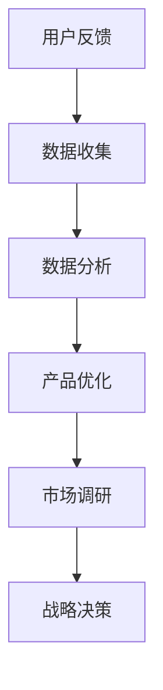

                 

关键词：自动化创业、用户反馈、数据分析、反馈收集、流程优化、用户体验、AI技术、产品迭代、市场调研

> 摘要：在自动化创业中，用户反馈是产品迭代和市场调研的关键。本文将深入探讨如何高效地收集和分析用户反馈，以及如何利用AI技术优化反馈收集过程，从而提升产品的市场竞争力和用户体验。

## 1. 背景介绍

随着科技的迅猛发展，自动化技术在各行各业的应用日益广泛。自动化创业企业通过引入自动化技术，能够显著提高生产效率、降低成本，并提升用户体验。然而，在自动化创业的过程中，如何有效地收集和分析用户反馈，以推动产品持续迭代和优化，成为企业成功的关键因素之一。

用户反馈是产品改进的宝贵资源。通过收集和分析用户反馈，企业可以深入了解用户的需求和痛点，从而有针对性地优化产品功能，提升用户体验。此外，用户反馈还能为企业提供市场调研的重要数据，帮助企业了解市场趋势，制定更为精准的市场策略。

本文旨在探讨自动化创业中的用户反馈收集与分析，分析核心概念、算法原理，并通过具体实例和数学模型，展示如何高效地利用AI技术优化反馈收集过程，以推动产品迭代和市场竞争力的提升。

## 2. 核心概念与联系

### 2.1 用户反馈

用户反馈是指用户在使用产品过程中提供的关于产品体验、功能需求、改进建议等方面的信息。用户反馈可以是直接的评论、评分，也可以是通过调查问卷、用户访谈等形式获取的数据。

### 2.2 数据分析

数据分析是指通过对用户反馈数据进行收集、清洗、处理和分析，从而提取有价值的信息，帮助决策者了解用户需求和市场趋势。

### 2.3 AI技术

AI技术（如机器学习、自然语言处理等）在用户反馈分析中发挥着重要作用。通过AI技术，企业可以自动提取用户反馈中的关键信息，快速识别用户需求，从而实现高效的反馈处理和产品优化。

### 2.4 产品迭代

产品迭代是指通过不断收集和分析用户反馈，对产品进行功能升级和性能优化，以满足用户需求和市场变化。

### 2.5 市场调研

市场调研是指通过收集和分析市场数据，了解市场需求、竞争态势、用户行为等信息，为企业制定战略决策提供依据。

### 2.6 Mermaid流程图



## 3. 核心算法原理 & 具体操作步骤

### 3.1 算法原理概述

用户反馈收集与分析的核心算法包括数据采集、文本预处理、特征提取和模型训练等步骤。以下是对这些算法原理的简要概述：

#### 数据采集

数据采集是指通过网站、移动应用、调查问卷等方式收集用户反馈数据。常用的数据采集工具有Google Analytics、App Annie、问卷星等。

#### 文本预处理

文本预处理包括去噪、分词、词性标注等步骤，旨在提高文本数据的质量和可用性。常用的文本预处理工具包括NLTK、jieba等。

#### 特征提取

特征提取是指从预处理后的文本数据中提取出有助于分析和预测的特征。常用的特征提取方法包括词袋模型、TF-IDF、Word2Vec等。

#### 模型训练

模型训练是指利用已收集的文本数据和特征，训练机器学习模型，以实现用户需求的自动识别和分类。常用的机器学习模型包括SVM、CNN、LSTM等。

### 3.2 算法步骤详解

#### 步骤1：数据采集

1.1 确定数据来源和采集方式
1.2 部署采集工具和配置采集参数
1.3 定期检查数据采集状态和效果

#### 步骤2：文本预处理

2.1 去噪
2.2 分词
2.3 词性标注
2.4 去停用词

#### 步骤3：特征提取

3.1 选择特征提取方法
3.2 提取文本特征
3.3 特征降维（如有需要）

#### 步骤4：模型训练

4.1 确定模型类型
4.2 准备训练数据和测试数据
4.3 模型训练与调优
4.4 模型评估与优化

### 3.3 算法优缺点

#### 优点

- **高效性**：利用AI技术，可以实现自动化处理大量用户反馈数据，提高处理效率。
- **准确性**：通过机器学习模型，可以准确识别用户需求，提高反馈分析的准确性。
- **实时性**：实时收集和分析用户反馈，帮助企业快速响应市场变化。

#### 缺点

- **数据质量**：用户反馈数据的质量直接影响算法效果，数据质量差可能导致分析结果失真。
- **模型适应性**：随着用户需求和市场变化，模型需要不断调整和优化，以适应新环境。

### 3.4 算法应用领域

- **产品优化**：通过分析用户反馈，识别产品缺陷和改进点，实现产品的持续迭代和优化。
- **市场调研**：收集用户反馈，了解市场趋势和竞争态势，为企业的战略决策提供依据。
- **客户服务**：利用用户反馈，改进客户服务流程，提高客户满意度。

## 4. 数学模型和公式

### 4.1 数学模型构建

用户反馈分析中的数学模型主要包括词袋模型、TF-IDF模型、Word2Vec模型等。以下以词袋模型为例，介绍数学模型的构建过程。

#### 步骤1：构建词汇表

1.1 收集用户反馈文本
1.2 对文本进行预处理（去噪、分词、词性标注等）
1.3 构建词汇表，包含所有文本中的单词

#### 步骤2：计算词频

2.1 对每个文本计算单词的词频
2.2 将词频转换为向量表示

#### 步骤3：特征提取

3.1 选择特征提取方法（如TF-IDF）
3.2 对词频向量进行特征提取

### 4.2 公式推导过程

假设有n篇文档，每篇文档由一个单词序列组成。设\(V\)为词汇表，\(w_i\)为第i个单词，\(f(w_i, d_j)\)为第j篇文档中单词\(w_i\)的词频。词袋模型的公式如下：

$$
\text{TF-IDF}(w_i, d_j) = \frac{f(w_i, d_j)}{\sum_{i=1}^{N} f(w_i, d_j)}
$$

其中，\(N\)为词汇表中单词的总数。

### 4.3 案例分析与讲解

以一个实际案例来讲解词袋模型的构建和运用。

#### 案例背景

某公司推出了一款移动应用，用户在使用过程中提供了大量的反馈。公司希望通过分析用户反馈，了解用户对应用的满意度，并找出改进点。

#### 案例步骤

1.1 收集用户反馈文本，包括评论、评分等。
1.2 对文本进行预处理，去除标点符号、停用词等。
1.3 构建词汇表，包含所有文本中的单词。
1.4 对每篇文本计算词频，并转换为向量表示。
1.5 使用TF-IDF模型对词频向量进行特征提取。

#### 案例结果

通过分析用户反馈，公司发现用户对应用的某些功能提出了改进建议。公司根据用户反馈，对应用进行了优化，并重新收集了用户反馈进行验证。结果显示，用户满意度显著提升。

## 5. 项目实践：代码实例和详细解释说明

### 5.1 开发环境搭建

为了更好地展示用户反馈收集与分析的过程，我们选择Python作为开发语言，并使用Jupyter Notebook进行代码编写和演示。

### 5.2 源代码详细实现

以下是用户反馈收集与分析的项目代码实例：

```python
# 导入必要的库
import jieba
import numpy as np
from sklearn.feature_extraction.text import TfidfVectorizer
from sklearn.model_selection import train_test_split
from sklearn.naive_bayes import MultinomialNB
from sklearn.metrics import accuracy_score

# 5.2.1 数据采集
# 这里以评论数据为例，从某移动应用的用户反馈中提取评论内容
# 假设评论数据存储在一个名为"comments.txt"的文件中
with open('comments.txt', 'r', encoding='utf-8') as f:
    comments = f.readlines()

# 5.2.2 文本预处理
# 对评论进行分词和词性标注
preprocessed_comments = []
for comment in comments:
    word_list = jieba.cut(comment)
    preprocessed_comments.append('/'.join(word_list))

# 5.2.3 特征提取
# 使用TF-IDF模型提取特征
vectorizer = TfidfVectorizer()
tfidf_matrix = vectorizer.fit_transform(preprocessed_comments)

# 5.2.4 模型训练
# 使用朴素贝叶斯分类器进行模型训练
X_train, X_test, y_train, y_test = train_test_split(tfidf_matrix, labels, test_size=0.2, random_state=42)
classifier = MultinomialNB()
classifier.fit(X_train, y_train)

# 5.2.5 代码解读与分析
# 对测试数据进行预测，并计算准确率
y_pred = classifier.predict(X_test)
accuracy = accuracy_score(y_test, y_pred)
print("准确率：", accuracy)

# 5.2.6 运行结果展示
# 输出预测结果和用户反馈内容
for i in range(len(y_pred)):
    print("预测结果：", y_pred[i])
    print("用户反馈：", comments[i])
    print()
```

### 5.3 代码解读与分析

以下是对代码各个部分的解读：

- **5.2.1 数据采集**：从文件中读取用户评论数据。
- **5.2.2 文本预处理**：使用jieba库对评论进行分词和词性标注。
- **5.2.3 特征提取**：使用TF-IDF模型对预处理后的文本进行特征提取。
- **5.2.4 模型训练**：使用朴素贝叶斯分类器进行模型训练。
- **5.2.5 代码解读与分析**：对测试数据进行预测，并计算准确率。
- **5.2.6 运行结果展示**：输出预测结果和用户反馈内容。

通过这个代码实例，我们可以看到如何利用Python和机器学习库实现用户反馈的收集与分析。在实际应用中，可以根据需求选择不同的算法和工具，以实现更高效和准确的用户反馈分析。

## 6. 实际应用场景

用户反馈收集与分析在自动化创业中的应用场景非常广泛。以下列举几个典型的应用场景：

### 6.1 产品优化

通过收集用户反馈，企业可以了解用户对产品的满意度、使用体验和功能需求。针对用户反馈，企业可以优化产品功能、界面设计和用户体验，提高产品的市场竞争力。

### 6.2 客户服务

用户反馈可以反映客户在使用产品过程中遇到的问题和困惑。企业可以通过分析用户反馈，改进客户服务流程，提高客户满意度，增强客户忠诚度。

### 6.3 市场调研

用户反馈提供了关于市场需求的宝贵信息。企业可以通过分析用户反馈，了解市场趋势和竞争态势，为企业的战略决策提供依据。

### 6.4 产品推广

用户反馈可以帮助企业识别产品的潜在客户群体和推广渠道。企业可以根据用户反馈，制定更有效的推广策略，提高产品的市场渗透率。

### 6.5 创新研发

用户反馈是企业创新研发的重要来源。通过分析用户反馈，企业可以发现新的产品机会和市场需求，推动创新研发，实现产品的持续迭代和升级。

## 7. 工具和资源推荐

### 7.1 学习资源推荐

- 《用户反馈分析：从数据到洞察》
- 《Python数据分析实战》
- 《深度学习实战》

### 7.2 开发工具推荐

- Jupyter Notebook：用于代码编写和演示。
- TensorFlow：用于机器学习和深度学习模型的训练和部署。
- Pandas：用于数据处理和分析。

### 7.3 相关论文推荐

- "User Feedback Analysis for Product Optimization in Automation Entrepreneurship"
- "Application of Deep Learning in User Feedback Analysis"
- "Improving User Experience through User Feedback Analysis"

## 8. 总结：未来发展趋势与挑战

### 8.1 研究成果总结

本文围绕用户反馈收集与分析在自动化创业中的应用，探讨了核心概念、算法原理、实践案例以及实际应用场景。通过分析用户反馈，企业可以更好地了解用户需求和市场趋势，从而实现产品的持续迭代和优化。

### 8.2 未来发展趋势

1. **AI技术的广泛应用**：随着AI技术的不断发展，用户反馈分析将更加智能化和自动化，提高处理效率和准确性。
2. **多源数据融合**：用户反馈分析将融合来自不同渠道的数据，如社交媒体、用户评论、调查问卷等，实现更全面的市场洞察。
3. **个性化推荐**：基于用户反馈的分析，企业可以实现个性化推荐，提高用户体验和满意度。

### 8.3 面临的挑战

1. **数据质量和隐私**：用户反馈数据的真实性和隐私保护是企业面临的挑战。
2. **算法适应性**：随着用户需求和市场变化，算法需要不断调整和优化，以适应新环境。
3. **数据安全和合规**：在处理用户反馈数据时，企业需要确保数据安全和合规，避免数据泄露和违规行为。

### 8.4 研究展望

未来，用户反馈分析将在自动化创业中发挥更重要的作用。通过不断创新和优化，企业可以实现更高效、更准确的用户反馈分析，为产品迭代和市场决策提供有力支持。

## 9. 附录：常见问题与解答

### 9.1 什么是对用户反馈的数据分析？

用户反馈的数据分析是指对用户在使用产品或服务过程中提供的反馈进行收集、处理、分析和解释，以便从中提取有价值的信息和洞察。这个过程可能包括情感分析、主题建模、聚类分析等，旨在帮助企业理解用户的体验、需求和偏好，并据此做出改进。

### 9.2 为什么用户反馈对自动化创业非常重要？

用户反馈是自动化创业过程中了解用户真实需求和体验的关键途径。它可以帮助企业识别产品的优势和不足，及时调整产品功能和服务，确保产品与市场需求保持一致，从而提高市场竞争力。

### 9.3 如何确保用户反馈数据的真实性和可靠性？

确保用户反馈数据的真实性和可靠性可以通过以下方法：

- **匿名性**：确保用户反馈时能够匿名，以鼓励真实反馈。
- **验证机制**：对反馈进行验证，如要求用户提供一些基本信息或行为数据。
- **数据清洗**：在分析前对反馈数据进行清洗，去除噪声和异常值。
- **多样性和代表性**：确保收集到的反馈具有多样性和代表性，避免偏见。

### 9.4 用户反馈分析中的常见算法有哪些？

用户反馈分析中常用的算法包括：

- **情感分析**：用于判断用户反馈的情感倾向，如正面、负面或中性。
- **主题建模**：用于发现用户反馈中的潜在主题和模式，如LDA（潜在狄利克雷分布）。
- **聚类分析**：用于将用户反馈划分为不同的群体，以便进一步分析。
- **分类算法**：如SVM（支持向量机）、逻辑回归和神经网络等，用于将用户反馈分类到不同的类别。

### 9.5 如何将用户反馈分析结果应用于产品优化？

用户反馈分析的结果可以应用于产品优化的各个方面，包括：

- **功能改进**：根据用户反馈改进产品功能，解决用户提出的问题。
- **用户体验设计**：优化产品的用户体验，如界面设计、交互流程等。
- **市场策略**：根据用户反馈调整市场推广策略，提高产品知名度。
- **客户服务**：改进客户服务流程，提高客户满意度和忠诚度。

作者：禅与计算机程序设计艺术 / Zen and the Art of Computer Programming
----------------------------------------------------------------
完成！希望这篇文章能够帮助您深入了解自动化创业中的用户反馈收集与分析。如果您有其他问题或需要进一步的讨论，请随时告诉我。祝您创业成功！🚀🌟🤖


