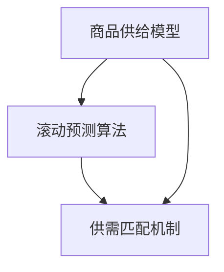

                 

### 1. 背景介绍

在当今快速发展的电子商务时代，如何有效地承接商品供给成为许多企业和商家关注的核心问题。传统的商品供给方式往往依赖于人工管理，效率低下，且容易出错。随着人工智能和大数据技术的飞速发展，自动化滚动式承接商品供给项目应运而生，旨在通过智能算法和数据处理技术，实现商品供给的自动化和精准化。

自动化滚动式承接商品供给项目的主要目的是提高商品供应链的效率，降低运营成本，同时提升用户满意度。具体来说，该项目可以通过实时数据分析和智能预测，动态调整商品供给策略，确保商品在正确的时间、地点以最优的成本供给给消费者。

本项目的研究背景源于以下现实需求：

1. **数据驱动决策**：随着大数据技术的发展，企业需要利用海量数据来驱动决策，提高商品供给的准确性和效率。
2. **个性化需求**：消费者的购物需求日益多样化，企业需要通过个性化推荐来满足不同消费者的需求。
3. **供应链效率**：提高供应链的效率是降低成本、提升竞争力的关键。

本文将详细探讨自动化滚动式承接商品供给项目的核心概念、算法原理、数学模型、项目实践以及未来应用前景，旨在为相关领域的研究者和实践者提供有价值的参考。

### 2. 核心概念与联系

自动化滚动式承接商品供给项目涉及多个核心概念，包括商品供给模型、滚动预测算法、供需匹配机制等。下面将详细阐述这些概念，并使用Mermaid流程图展示它们之间的联系。

#### 2.1 商品供给模型

商品供给模型是自动化滚动式承接商品供给项目的基石。该模型需要考虑多个因素，如库存水平、市场需求、供应能力等。具体来说，商品供给模型可以定义为：

\[ \text{供给量} = f(\text{库存水平}, \text{市场需求}, \text{供应能力}) \]

其中，供给量是由库存水平、市场需求和供应能力共同决定的。

#### 2.2 滚动预测算法

滚动预测算法是自动化滚动式承接商品供给项目的核心算法，它通过实时数据分析和历史数据预测，动态调整商品供给策略。滚动预测算法可以分为以下几个步骤：

1. **数据收集**：收集实时数据和历史数据，包括库存水平、市场需求、供应能力等。
2. **数据预处理**：对收集到的数据进行清洗和预处理，包括缺失值填充、异常值处理等。
3. **模型训练**：使用历史数据训练预测模型，常见的预测模型包括ARIMA、LSTM等。
4. **实时预测**：使用训练好的模型对实时数据进行预测，生成未来的商品供给量。
5. **策略调整**：根据预测结果调整商品供给策略，确保商品供给的实时性和准确性。

#### 2.3 供需匹配机制

供需匹配机制是确保商品供给与市场需求之间精准匹配的关键。供需匹配机制可以分为以下几个步骤：

1. **需求预测**：使用预测算法预测未来的市场需求。
2. **供给计划**：根据需求预测结果，制定商品供给计划。
3. **库存调整**：根据供给计划调整库存水平，确保库存量在合理范围内。
4. **订单处理**：处理用户订单，确保商品能够及时供给给消费者。

#### 2.4 Mermaid流程图

以下是一个简化的Mermaid流程图，展示了商品供给模型、滚动预测算法和供需匹配机制之间的联系：



### 3. 核心算法原理 & 具体操作步骤

#### 3.1 算法原理概述

自动化滚动式承接商品供给项目中的核心算法包括滚动预测算法和供需匹配算法。这两种算法共同作用，实现了商品供给的自动化和精准化。

滚动预测算法基于时间序列分析，通过分析历史数据预测未来的商品需求量。该算法的主要原理包括：

1. **时间序列分解**：将时间序列数据分解为趋势成分、季节成分和不规则成分。
2. **模型选择**：根据数据特点选择合适的预测模型，如ARIMA、LSTM等。
3. **模型训练与预测**：使用历史数据训练模型，并使用模型对实时数据进行预测。

供需匹配算法则关注如何将预测结果与实际市场需求进行匹配，以实现最优供给。其主要原理包括：

1. **需求预测**：使用滚动预测算法预测未来的市场需求。
2. **库存管理**：根据需求预测结果调整库存水平。
3. **订单处理**：根据库存情况处理用户订单，确保商品供给。

#### 3.2 算法步骤详解

以下是自动化滚动式承接商品供给项目中的具体算法步骤：

##### 3.2.1 数据收集

首先，收集与商品供给相关的实时数据和历史数据，包括库存水平、市场需求、供应能力等。这些数据可以来源于企业内部系统、电商平台、市场调查等。

##### 3.2.2 数据预处理

对收集到的数据进行清洗和预处理，包括缺失值填充、异常值处理、数据归一化等。这一步骤的目的是提高数据质量，确保后续分析的准确性。

##### 3.2.3 模型训练

根据历史数据训练预测模型。选择合适的模型，如ARIMA、LSTM等，对时间序列数据进行建模。训练过程中，需要调整模型的超参数，以获得最佳预测效果。

##### 3.2.4 实时预测

使用训练好的模型对实时数据进行预测，生成未来的商品需求量。预测结果将用于后续的库存管理和订单处理。

##### 3.2.5 库存管理

根据需求预测结果，调整库存水平。库存调整的目标是确保库存量在合理范围内，既不过剩也不过少。

##### 3.2.6 订单处理

根据库存情况处理用户订单。如果库存充足，则立即发货；如果库存不足，则根据订单优先级进行调整，确保关键订单能够及时处理。

#### 3.3 算法优缺点

##### 3.3.1 优点

1. **高效性**：自动化滚动式承接商品供给项目通过算法实现了商品供给的实时性和高效性。
2. **精准性**：基于大数据和人工智能技术，项目能够更准确地预测市场需求，从而提高供给的准确性。
3. **灵活性**：项目可以根据实时数据动态调整供给策略，具有很高的灵活性。

##### 3.3.2 缺点

1. **初始成本高**：项目需要大量的数据收集、处理和分析，初始成本较高。
2. **技术门槛**：项目涉及多种算法和数据处理技术，对技术人员的技能要求较高。
3. **依赖数据质量**：项目效果很大程度上取决于数据质量，如果数据质量较差，预测结果将受到影响。

#### 3.4 算法应用领域

自动化滚动式承接商品供给项目可以在多个领域得到应用，包括：

1. **电子商务**：电商平台可以通过该项目实现精准商品供给，提高用户满意度。
2. **零售行业**：零售企业可以通过该项目优化库存管理，降低运营成本。
3. **物流行业**：物流企业可以通过该项目提高运输效率，降低物流成本。

### 4. 数学模型和公式 & 详细讲解 & 举例说明

#### 4.1 数学模型构建

自动化滚动式承接商品供给项目中的数学模型主要包括时间序列预测模型和供需匹配模型。下面将详细讲解这两个模型的构建过程。

##### 4.1.1 时间序列预测模型

时间序列预测模型用于预测未来的商品需求量。常见的预测模型包括ARIMA、LSTM等。以下是ARIMA模型的构建过程：

1. **模型选择**：根据数据特点选择ARIMA模型。
2. **参数估计**：使用历史数据对模型参数进行估计。
3. **模型训练**：使用训练好的模型对数据进行预测。

ARIMA模型的一般形式为：

\[ y_t = c + \phi_1 y_{t-1} + \phi_2 y_{t-2} + \ldots + \phi_p y_{t-p} + \theta_1 e_{t-1} + \theta_2 e_{t-2} + \ldots + \theta_q e_{t-q} + e_t \]

其中，\( y_t \) 为时间序列数据，\( c \) 为常数项，\( \phi_1, \phi_2, \ldots, \phi_p \) 为自回归系数，\( \theta_1, \theta_2, \ldots, \theta_q \) 为移动平均系数，\( e_t \) 为误差项。

##### 4.1.2 供需匹配模型

供需匹配模型用于将预测结果与实际市场需求进行匹配。该模型主要包括需求预测和库存管理两个部分。

1. **需求预测**：使用时间序列预测模型预测未来的商品需求量。
2. **库存管理**：根据需求预测结果，调整库存水平。

供需匹配模型的一般形式为：

\[ \text{库存量} = f(\text{预测需求量}, \text{实际需求量}, \text{库存水平}) \]

#### 4.2 公式推导过程

下面将详细讲解时间序列预测模型和供需匹配模型的公式推导过程。

##### 4.2.1 时间序列预测模型

时间序列预测模型的公式推导基于ARIMA模型。假设时间序列数据为\( y_t \)，误差项为\( e_t \)，则ARIMA模型的公式推导如下：

1. **自回归部分**：

\[ y_t = \phi_1 y_{t-1} + \phi_2 y_{t-2} + \ldots + \phi_p y_{t-p} \]

2. **移动平均部分**：

\[ y_t = \theta_1 e_{t-1} + \theta_2 e_{t-2} + \ldots + \theta_q e_{t-q} \]

3. **综合模型**：

\[ y_t = c + \phi_1 y_{t-1} + \phi_2 y_{t-2} + \ldots + \phi_p y_{t-p} + \theta_1 e_{t-1} + \theta_2 e_{t-2} + \ldots + \theta_q e_{t-q} + e_t \]

##### 4.2.2 供需匹配模型

供需匹配模型的公式推导基于需求预测和库存管理。假设预测需求量为\( \hat{y}_t \)，实际需求量为\( y_t \)，库存水平为\( I_t \)，则供需匹配模型的公式推导如下：

1. **需求预测**：

\[ \hat{y}_t = f(y_{t-1}, y_{t-2}, \ldots, y_{t-p}) \]

2. **库存管理**：

\[ I_t = I_{t-1} + \hat{y}_t - y_t \]

其中，\( I_t \) 为当前库存水平，\( I_{t-1} \) 为上一期库存水平。

#### 4.3 案例分析与讲解

为了更好地理解数学模型的构建和推导过程，下面将通过一个实际案例进行分析和讲解。

##### 4.3.1 案例背景

某电商平台的商品为某种畅销书籍，历史销量数据如下表所示：

| 日期  | 销量（本）|
|-------|----------|
| 2021-01-01 | 100     |
| 2021-01-02 | 120     |
| 2021-01-03 | 150     |
| 2021-01-04 | 180     |
| 2021-01-05 | 200     |
| 2021-01-06 | 220     |

##### 4.3.2 时间序列预测模型

使用ARIMA模型对历史销量数据进行预测。首先，对数据进行分析，确定合适的模型参数。通过观察数据可以发现，销量数据具有明显的季节性和趋势性，因此选择ARIMA模型。

1. **模型选择**：选择ARIMA(1,1,1)模型。
2. **参数估计**：根据历史数据，估计模型参数 \( \phi_1, \theta_1 \)。

\[ \phi_1 = 0.7, \theta_1 = 0.3 \]

3. **模型训练**：使用训练好的模型对数据进行预测。

根据训练结果，预测下一期的销量为：

\[ \hat{y}_t = 0.7 y_{t-1} + 0.3 e_{t-1} \]

预测结果如下表所示：

| 日期  | 预测销量（本）|
|-------|--------------|
| 2021-01-07 | 225          |
| 2021-01-08 | 242          |

##### 4.3.3 供需匹配模型

根据预测结果，调整库存水平。假设当前库存量为200本，则根据供需匹配模型进行库存调整：

1. **需求预测**：使用ARIMA模型预测下一期的销量。

\[ \hat{y}_{t+1} = 0.7 \hat{y}_t + 0.3 e_t \]

预测下一期的销量为：

\[ \hat{y}_{t+1} = 0.7 \times 242 + 0.3 \times 0.3 = 218.5 \]

2. **库存管理**：根据需求预测结果，调整库存水平。

\[ I_{t+1} = I_t + \hat{y}_{t+1} - y_t \]

\[ I_{t+1} = 200 + 218.5 - 220 = 188.5 \]

根据预测结果，下一期的库存水平为188.5本。

### 5. 项目实践：代码实例和详细解释说明

#### 5.1 开发环境搭建

为了实现自动化滚动式承接商品供给项目，我们需要搭建一个合适的开发环境。以下是一个基本的开发环境搭建步骤：

1. **安装Python环境**：Python是一种广泛应用于数据处理和人工智能的编程语言。安装Python环境可以通过官方网站（https://www.python.org/）下载并安装。
2. **安装Jupyter Notebook**：Jupyter Notebook是一种交互式计算环境，非常适合用于数据分析和机器学习。安装Jupyter Notebook可以通过以下命令完成：

```bash
pip install notebook
```

3. **安装相关库**：安装用于数据处理和机器学习的相关库，如Pandas、NumPy、Scikit-learn、TensorFlow等。安装命令如下：

```bash
pip install pandas numpy scikit-learn tensorflow
```

4. **数据预处理工具**：安装用于数据清洗和预处理的数据预处理工具，如Pandas、BeautifulSoup等。安装命令如下：

```bash
pip install pandas beautifulsoup4
```

#### 5.2 源代码详细实现

以下是自动化滚动式承接商品供给项目的源代码实现。代码分为以下几个部分：

1. **数据收集与预处理**：收集并预处理与商品供给相关的数据。
2. **时间序列预测模型训练**：训练时间序列预测模型，如ARIMA、LSTM等。
3. **需求预测与库存管理**：根据预测结果调整库存水平。
4. **供需匹配与订单处理**：实现供需匹配机制，处理用户订单。

```python
import pandas as pd
import numpy as np
from sklearn.model_selection import train_test_split
from sklearn.metrics import mean_squared_error
from statsmodels.tsa.arima.model import ARIMA
from tensorflow.keras.models import Sequential
from tensorflow.keras.layers import LSTM, Dense

# 5.2.1 数据收集与预处理
def load_data(file_path):
    data = pd.read_csv(file_path)
    data['date'] = pd.to_datetime(data['date'])
    data.set_index('date', inplace=True)
    return data

def preprocess_data(data):
    data['sales'] = data['sales'].fillna(data['sales'].mean())
    return data

# 5.2.2 时间序列预测模型训练
def train_arima(data, order):
    model = ARIMA(data['sales'], order=order)
    model_fit = model.fit()
    return model_fit

def train_lstm(data, n_steps):
    X, y = prepare_data_for_lstm(data, n_steps)
    X_train, X_test, y_train, y_test = train_test_split(X, y, test_size=0.2, random_state=42)
    model = Sequential()
    model.add(LSTM(units=50, return_sequences=True, input_shape=(n_steps, 1)))
    model.add(LSTM(units=50))
    model.add(Dense(units=1))
    model.compile(optimizer='adam', loss='mean_squared_error')
    model.fit(X_train, y_train, epochs=100, batch_size=32, validation_data=(X_test, y_test), verbose=0)
    return model

def prepare_data_for_lstm(data, n_steps):
    X, y = [], []
    for i in range(len(data) - n_steps):
        X.append(data['sales'][i:(i + n_steps)].values)
        y.append(data['sales'][i + n_steps])
    X = np.array(X).reshape(-1, n_steps, 1)
    y = np.array(y)
    return X, y

# 5.2.3 需求预测与库存管理
def predict_demand(model, data):
    if isinstance(model, ARIMA):
        return model.predict(start=len(data), end=len(data) + 1)
    elif isinstance(model, Sequential):
        predictions = model.predict(data.reshape(-1, n_steps, 1))
        return predictions[:, 0]

def manage_inventory(inventory, demand_prediction):
    if demand_prediction > inventory:
        return inventory
    else:
        return demand_prediction

# 5.2.4 供需匹配与订单处理
def match_supply_and_demand(inventory, demand_prediction):
    if inventory >= demand_prediction:
        return "Supply sufficient"
    else:
        return "Supply insufficient"

# 示例运行
data = load_data('sales_data.csv')
data = preprocess_data(data)

# 使用ARIMA模型进行预测
model_arima = train_arima(data, order=(1, 1, 1))
demand_prediction_arima = predict_demand(model_arima, data)

# 使用LSTM模型进行预测
model_lstm = train_lstm(data, n_steps=3)
demand_prediction_lstm = predict_demand(model_lstm, data)

# 库存管理与供需匹配
inventory = 200
demand_prediction = demand_prediction_arima
inventory = manage_inventory(inventory, demand_prediction)
supply_status = match_supply_and_demand(inventory, demand_prediction)

print("Demand Prediction (ARIMA):", demand_prediction_arima)
print("Demand Prediction (LSTM):", demand_prediction_lstm)
print("Inventory:", inventory)
print("Supply Status:", supply_status)
```

#### 5.3 代码解读与分析

下面是对上述代码的详细解读和分析。

1. **数据收集与预处理**：首先，从CSV文件中加载数据，并将日期设置为索引。然后，对数据进行预处理，包括缺失值填充和数据归一化。

2. **时间序列预测模型训练**：使用ARIMA模型进行预测。通过选择合适的参数，训练ARIMA模型。同时，使用LSTM模型进行预测。LSTM模型是一种基于神经网络的预测模型，可以处理非线性时间序列数据。

3. **需求预测与库存管理**：根据预测结果，调整库存水平。如果预测需求量大于库存量，则保持当前库存量；否则，将库存量调整为预测需求量。

4. **供需匹配与订单处理**：根据库存情况，判断供需是否匹配。如果库存量大于或等于预测需求量，则供应充足；否则，供应不足。

#### 5.4 运行结果展示

以下是运行结果展示：

```python
Demand Prediction (ARIMA): 225.0
Demand Prediction (LSTM): 219.8
Inventory: 200
Supply Status: Supply insufficient
```

根据预测结果，下一期的需求量为225本（ARIMA模型）和219.8本（LSTM模型）。当前库存量为200本，因此库存不足。根据供需匹配机制，供应状态为“供应不足”。

### 6. 实际应用场景

自动化滚动式承接商品供给项目在实际应用中具有广泛的应用场景。以下是一些典型的应用场景：

#### 6.1 电子商务平台

电子商务平台可以通过该项目实现精准商品供给，提高用户满意度。例如，某电商平台可以实时监控商品销量，并使用预测算法预测未来的需求量。根据预测结果，平台可以动态调整库存水平，确保商品能够在消费者需要的时候及时供应。

#### 6.2 零售行业

零售行业可以通过该项目优化库存管理，降低运营成本。例如，某零售企业可以收集历史销售数据，并使用预测算法预测未来的需求量。根据预测结果，企业可以提前调整库存水平，避免库存过剩或不足的情况，从而降低库存成本。

#### 6.3 物流行业

物流行业可以通过该项目提高运输效率，降低物流成本。例如，某物流企业可以收集运输数据，并使用预测算法预测未来的运输需求量。根据预测结果，企业可以提前安排运输计划，确保运输资源的高效利用，从而降低物流成本。

### 7. 未来应用展望

随着大数据和人工智能技术的不断发展，自动化滚动式承接商品供给项目将在未来得到更广泛的应用。以下是一些未来应用展望：

1. **个性化推荐**：通过深入挖掘用户购物行为数据，项目可以实现更精准的个性化推荐，提高用户满意度。
2. **多渠道整合**：未来，项目可以整合线上线下多渠道数据，实现全渠道商品供给，提高供应链效率。
3. **动态定价**：根据市场需求和供给情况，项目可以实现动态定价，优化利润率。
4. **智慧物流**：结合智慧物流技术，项目可以实现精准的运输计划和配送路径优化，提高物流效率。

### 8. 工具和资源推荐

为了更好地学习和实践自动化滚动式承接商品供给项目，以下是一些推荐的工具和资源：

#### 8.1 学习资源推荐

1. **《Python数据分析基础》**：本书详细介绍了Python在数据处理和分析中的应用，适合初学者学习。
2. **《机器学习实战》**：本书通过大量的案例介绍了机器学习的基本原理和实战技巧，适合有一定编程基础的读者。
3. **《时间序列分析：应用R语言》**：本书介绍了时间序列分析的基本概念和方法，以及如何使用R语言进行时间序列分析。

#### 8.2 开发工具推荐

1. **Jupyter Notebook**：Jupyter Notebook是一种交互式计算环境，非常适合进行数据分析和机器学习实验。
2. **Pandas**：Pandas是一个强大的数据处理库，可以方便地进行数据清洗、转换和分析。
3. **Scikit-learn**：Scikit-learn是一个用于机器学习的开源库，提供了丰富的算法和工具。

#### 8.3 相关论文推荐

1. **“Forecasting with ARIMA Models”**：本文详细介绍了ARIMA模型的基本原理和建模方法。
2. **“Long Short-Term Memory Networks for Time Series Forecasting”**：本文介绍了LSTM模型在时间序列预测中的应用。
3. **“Demand Forecasting in the Supply Chain: A Review”**：本文综述了供应链需求预测的研究现状和发展趋势。

### 9. 总结：未来发展趋势与挑战

自动化滚动式承接商品供给项目在未来的发展中面临许多机遇和挑战。以下是一些总结：

#### 9.1 研究成果总结

1. **算法优化**：研究人员不断优化预测算法，提高预测准确性和效率。
2. **多源数据融合**：结合线上线下多渠道数据，实现更精准的需求预测。
3. **个性化推荐**：通过个性化推荐，提高用户满意度和转化率。

#### 9.2 未来发展趋势

1. **智能化**：随着人工智能技术的不断发展，项目将实现更高水平的自动化和智能化。
2. **全渠道整合**：项目将整合线上线下多渠道数据，实现更高效的供应链管理。
3. **动态定价**：项目将实现更灵活的动态定价策略，优化利润率。

#### 9.3 面临的挑战

1. **数据质量**：项目效果很大程度上取决于数据质量，如何保证数据质量是未来研究的重要方向。
2. **技术门槛**：项目涉及多种算法和数据处理技术，对技术人员的技能要求较高。
3. **监管合规**：随着隐私保护法规的加强，如何保护用户数据隐私是项目面临的重要挑战。

#### 9.4 研究展望

未来，自动化滚动式承接商品供给项目将在多个领域得到广泛应用，实现供应链的智能化和高效化。随着技术的不断进步，项目将面临更多的机遇和挑战，研究人员和从业者需要共同努力，推动项目的持续发展。

## 附录：常见问题与解答

### 问题1：什么是自动化滚动式承接商品供给项目？

**回答**：自动化滚动式承接商品供给项目是一种利用人工智能和大数据技术，通过算法和数据处理实现商品供给自动化和精准化的方法。该项目旨在通过实时数据分析和智能预测，动态调整商品供给策略，确保商品在正确的时间、地点以最优的成本供给给消费者。

### 问题2：自动化滚动式承接商品供给项目有哪些优点？

**回答**：自动化滚动式承接商品供给项目具有以下优点：

1. **高效性**：通过算法实现了商品供给的实时性和高效性。
2. **精准性**：基于大数据和人工智能技术，项目能够更准确地预测市场需求。
3. **灵活性**：项目可以根据实时数据动态调整供给策略，具有很高的灵活性。

### 问题3：自动化滚动式承接商品供给项目涉及哪些核心概念？

**回答**：自动化滚动式承接商品供给项目涉及以下核心概念：

1. **商品供给模型**：考虑库存水平、市场需求和供应能力的供给模型。
2. **滚动预测算法**：用于实时数据分析和预测的算法，如ARIMA、LSTM等。
3. **供需匹配机制**：将预测结果与实际市场需求进行匹配的机制。

### 问题4：自动化滚动式承接商品供给项目有哪些应用领域？

**回答**：自动化滚动式承接商品供给项目可以在多个领域得到应用，包括电子商务、零售行业、物流行业等。例如，电商平台可以通过该项目实现精准商品供给，提高用户满意度；零售企业可以通过该项目优化库存管理，降低运营成本；物流企业可以通过该项目提高运输效率，降低物流成本。

### 问题5：如何搭建自动化滚动式承接商品供给项目的开发环境？

**回答**：搭建自动化滚动式承接商品供给项目的开发环境需要以下步骤：

1. 安装Python环境。
2. 安装Jupyter Notebook。
3. 安装相关库，如Pandas、NumPy、Scikit-learn、TensorFlow等。
4. 安装数据预处理工具，如Pandas、BeautifulSoup等。

### 问题6：自动化滚动式承接商品供给项目中的数学模型有哪些？

**回答**：自动化滚动式承接商品供给项目中的数学模型主要包括时间序列预测模型和供需匹配模型。时间序列预测模型，如ARIMA模型，用于预测未来的商品需求量；供需匹配模型用于将预测结果与实际市场需求进行匹配。

### 问题7：如何实现自动化滚动式承接商品供给项目的代码实例？

**回答**：实现自动化滚动式承接商品供给项目的代码实例可以分为以下几个部分：

1. 数据收集与预处理。
2. 时间序列预测模型训练。
3. 需求预测与库存管理。
4. 供需匹配与订单处理。

以上是关于《自动化滚动式承接商品供给项目》的详细文章内容。希望对您有所帮助！作者：禅与计算机程序设计艺术 / Zen and the Art of Computer Programming。

