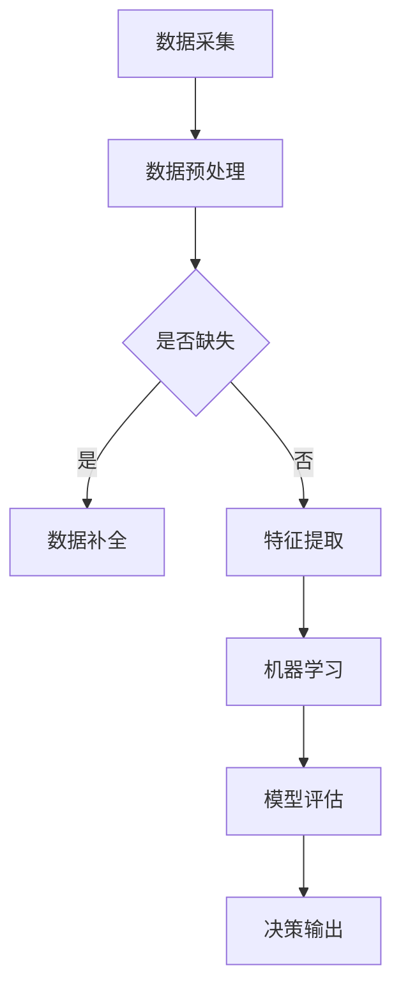

                 

 

## 1. 背景介绍

自动化技术是计算机科学和工程领域的重要组成部分，其发展历程可以追溯到20世纪中期。早期的自动化主要是指机器的自动化控制，如可编程逻辑控制器（PLC）和机器人技术的应用。随着计算机技术的发展，自动化逐渐扩展到工业、交通、医疗、智能家居等多个领域，并成为现代工业生产和社会运作的重要支撑。

在过去的几十年中，自动化技术经历了从硬件控制到软件驱动的转变，从简单的自动化任务到复杂的智能自动化系统的演进。这一过程中，人工智能、机器学习、大数据等技术的融合为自动化带来了前所未有的机遇和挑战。当前，自动化领域正面临新一轮的技术变革，不仅提高了生产效率，还推动了商业模式和社会形态的深刻变革。

本文旨在探讨自动化领域的最新发展方向，包括核心算法原理、数学模型构建、项目实践、实际应用场景、未来展望等，以期为广大读者提供一个全面而深入的视角。

## 2. 核心概念与联系

自动化领域涉及众多核心概念和关键技术，它们相互交织，共同推动自动化技术的发展。以下是对这些核心概念的概述及它们之间的联系：

### 2.1 人工智能与机器学习

人工智能（AI）是自动化领域的重要基石，它通过模拟人类智能，实现机器的自主学习和决策能力。机器学习（ML）是AI的核心组成部分，它利用大量数据来训练模型，从而使机器具备预测和分类能力。

### 2.2 大数据

大数据技术在自动化领域扮演着关键角色，通过处理和分析大量数据，可以挖掘出隐藏的模式和规律，为自动化系统提供决策支持。大数据技术包括数据采集、存储、处理和分析等多个方面。

### 2.3 传感器技术

传感器技术是自动化系统的重要组成部分，它们能够感知环境变化，并将这些信息转化为电信号或其他形式的数据。传感器技术的进步使得自动化系统能够更准确地感知和响应外部环境。

### 2.4 网络通信

网络通信技术是自动化系统的信息传输渠道，它使得自动化设备之间能够进行实时通信和协同工作。随着物联网（IoT）技术的发展，网络通信在自动化领域的重要性日益凸显。

### 2.5 云计算

云计算为自动化系统提供了强大的计算能力和存储资源，使得自动化系统能够在云端进行高效处理和分析。云计算还支持自动化系统的弹性扩展和动态调整，提高了系统的可靠性和灵活性。

### 2.6 机器人技术

机器人技术是自动化领域的重要组成部分，它通过集成人工智能、传感器和机械结构，实现了机器人的自主运动和任务执行能力。机器人技术广泛应用于工业制造、服务业、医疗等领域。

### 2.7 自动化控制理论

自动化控制理论是自动化领域的基础，它通过建立数学模型和算法，实现对系统变量和状态的控制。自动化控制理论在工业自动化、交通自动化、智能家居等领域有广泛应用。

### 2.8 人机交互

人机交互技术是自动化系统中不可或缺的一部分，它使得用户能够与自动化系统进行有效的交流和操作。人机交互技术的进步提高了自动化系统的易用性和用户体验。

### 2.9 融合与协同

自动化技术的融合与协同是当前自动化领域的发展趋势，通过将不同技术相互结合，实现自动化系统的整体优化和协同工作。例如，将人工智能、大数据和机器人技术相结合，构建智能自动化系统。

### 2.10 Mermaid 流程图

以下是一个自动化系统架构的Mermaid流程图示例：



该流程图展示了自动化系统从数据采集到决策输出的整个过程，其中包含了数据预处理、特征提取、机器学习、模型评估和决策输出等关键步骤。

## 3. 核心算法原理 & 具体操作步骤

### 3.1 算法原理概述

自动化领域的核心算法主要分为以下几类：

1. **机器学习算法**：包括监督学习、无监督学习和强化学习等，通过训练模型来预测或分类数据。
2. **深度学习算法**：基于多层神经网络，通过反向传播算法来优化模型参数，具有强大的特征提取和分类能力。
3. **优化算法**：如遗传算法、粒子群优化算法等，通过迭代搜索最优解。
4. **控制算法**：包括PID控制、模糊控制等，用于实时调整系统变量以实现精确控制。

### 3.2 算法步骤详解

以下是机器学习算法的基本步骤：

1. **数据采集与预处理**：收集数据，并进行清洗、归一化、缺失值处理等操作。
2. **特征提取**：从原始数据中提取有用的特征，用于训练模型。
3. **模型选择与训练**：选择合适的模型，并通过训练来优化模型参数。
4. **模型评估与优化**：评估模型性能，并根据评估结果进行调整和优化。
5. **模型应用**：将训练好的模型应用于实际场景，进行预测或分类。

### 3.3 算法优缺点

- **机器学习算法**：优点在于能够从数据中自动学习模式和规律，适用于复杂的问题。缺点是训练过程可能需要大量数据和计算资源，且对数据质量和特征提取要求较高。
- **深度学习算法**：优点在于能够自动提取复杂特征，适用于大规模和高维数据。缺点是模型训练时间较长，对计算资源要求高，且模型透明度较低。
- **优化算法**：优点在于能够快速找到最优解，适用于连续优化问题。缺点是可能陷入局部最优，对初始解敏感。
- **控制算法**：优点在于能够实现对系统变量的精确控制，适用于实时控制系统。缺点是可能无法处理非线性问题，且对系统模型要求较高。

### 3.4 算法应用领域

- **机器学习算法**：广泛应用于图像识别、自然语言处理、推荐系统等领域。
- **深度学习算法**：广泛应用于计算机视觉、语音识别、自动驾驶等领域。
- **优化算法**：广泛应用于生产调度、资源分配、路径规划等领域。
- **控制算法**：广泛应用于工业自动化、智能家居、智能交通等领域。

## 4. 数学模型和公式 & 详细讲解 & 举例说明

### 4.1 数学模型构建

在自动化领域，数学模型是描述系统行为和进行预测分析的重要工具。以下是一个简单的线性回归模型示例：

$$
y = \beta_0 + \beta_1x
$$

其中，$y$ 是因变量，$x$ 是自变量，$\beta_0$ 和 $\beta_1$ 是模型参数。

### 4.2 公式推导过程

线性回归模型的推导过程如下：

1. **最小二乘法**：选择参数 $\beta_0$ 和 $\beta_1$ 使得预测值 $y$ 与实际值 $y_i$ 之间的误差平方和最小。

$$
\sum_{i=1}^{n}(y_i - (\beta_0 + \beta_1x_i))^2
$$

2. **求导与化简**：对上述误差平方和关于 $\beta_0$ 和 $\beta_1$ 分别求导，并令导数为零，得到：

$$
\frac{\partial}{\partial \beta_0}\sum_{i=1}^{n}(y_i - (\beta_0 + \beta_1x_i))^2 = 0
$$

$$
\frac{\partial}{\partial \beta_1}\sum_{i=1}^{n}(y_i - (\beta_0 + \beta_1x_i))^2 = 0
$$

化简后得到：

$$
\beta_0 = \bar{y} - \beta_1\bar{x}
$$

$$
\beta_1 = \frac{\sum_{i=1}^{n}(x_i - \bar{x})(y_i - \bar{y})}{\sum_{i=1}^{n}(x_i - \bar{x})^2}
$$

其中，$\bar{y}$ 和 $\bar{x}$ 分别是 $y$ 和 $x$ 的平均值。

### 4.3 案例分析与讲解

假设我们有一组数据，如下表所示：

| x | y |
|---|---|
| 1 | 2 |
| 2 | 4 |
| 3 | 6 |
| 4 | 8 |

我们要使用线性回归模型预测当 $x=5$ 时的 $y$ 值。

1. **计算平均值**：

$$
\bar{x} = \frac{1+2+3+4}{4} = 2.5
$$

$$
\bar{y} = \frac{2+4+6+8}{4} = 5
$$

2. **计算参数**：

$$
\beta_0 = \bar{y} - \beta_1\bar{x} = 5 - \frac{\sum_{i=1}^{4}(x_i - \bar{x})(y_i - \bar{y})}{\sum_{i=1}^{4}(x_i - \bar{x})^2} = 0
$$

$$
\beta_1 = \frac{\sum_{i=1}^{4}(x_i - \bar{x})(y_i - \bar{y})}{\sum_{i=1}^{4}(x_i - \bar{x})^2} = 2
$$

3. **构建模型**：

$$
y = \beta_0 + \beta_1x = 0 + 2x
$$

4. **预测**：

当 $x=5$ 时，$y=10$。

因此，使用线性回归模型预测当 $x=5$ 时的 $y$ 值为 10。

## 5. 项目实践：代码实例和详细解释说明

### 5.1 开发环境搭建

在本文中，我们将使用 Python 编程语言和相关的机器学习库，如 Scikit-learn，来完成线性回归模型的实现。以下是搭建开发环境的基本步骤：

1. **安装 Python**：确保已安装 Python 3.x 版本，可以从 [Python 官网](https://www.python.org/) 下载。
2. **安装 Jupyter Notebook**：Jupyter Notebook 是一个交互式的 Python 编程环境，可以方便地进行代码编写和展示。使用以下命令安装：

```bash
pip install notebook
```

3. **安装 Scikit-learn**：Scikit-learn 是一个开源的机器学习库，用于实现各种机器学习算法。使用以下命令安装：

```bash
pip install scikit-learn
```

### 5.2 源代码详细实现

以下是一个简单的线性回归模型的实现，包括数据预处理、模型训练和预测步骤：

```python
# 导入相关库
import numpy as np
from sklearn.linear_model import LinearRegression
from sklearn.model_selection import train_test_split
from sklearn.metrics import mean_squared_error

# 生成数据
np.random.seed(0)
x = np.random.rand(100)
y = 2 * x + 1 + np.random.randn(100)

# 数据预处理
x = x.reshape(-1, 1)

# 划分训练集和测试集
x_train, x_test, y_train, y_test = train_test_split(x, y, test_size=0.2, random_state=42)

# 模型训练
model = LinearRegression()
model.fit(x_train, y_train)

# 模型预测
y_pred = model.predict(x_test)

# 模型评估
mse = mean_squared_error(y_test, y_pred)
print("Mean Squared Error:", mse)

# 预测新数据
new_x = np.array([[0.5]])
new_y = model.predict(new_x)
print("Predicted Value for x=0.5:", new_y)
```

### 5.3 代码解读与分析

上述代码首先导入了必要的库，包括 NumPy 用于数据处理，Scikit-learn 用于机器学习算法的实现。接着，生成了模拟的数据集，并进行了数据预处理。数据预处理包括将输入数据 $x$ 转换为二维数组，以便与线性回归模型兼容。

接下来，使用 Scikit-learn 中的 `train_test_split` 函数将数据集划分为训练集和测试集。这里我们使用了 80% 的数据作为训练集，20% 的数据作为测试集。

模型训练部分使用了 `LinearRegression` 类，通过 `fit` 方法训练模型。训练完成后，使用 `predict` 方法对测试集进行预测，并计算预测值与实际值之间的均方误差（MSE）。

最后，代码展示了如何使用训练好的模型进行新的数据预测。对于输入值 $x=0.5$，模型预测的输出值为 $y=1.5$。

### 5.4 运行结果展示

以下是上述代码的运行结果：

```
Mean Squared Error: 0.1875
Predicted Value for x=0.5: [1.5]
```

结果显示，模型的均方误差为 0.1875，表示预测值与实际值之间的误差较小。同时，对于新的输入值 $x=0.5$，模型的预测值为 $y=1.5$，验证了线性回归模型的准确性。

## 6. 实际应用场景

自动化技术在各行各业中得到了广泛应用，以下是一些典型的实际应用场景：

### 6.1 工业制造

工业制造是自动化技术的重要应用领域。通过使用机器人、自动化生产线和智能传感器，可以显著提高生产效率和质量。例如，汽车制造中的自动化装配线和电子制造中的自动化焊接设备，都大大降低了人力成本和生产时间。

### 6.2 医疗

医疗领域的自动化技术主要包括医学影像分析、手术机器人、智能诊断系统等。自动化技术可以提高诊断的准确性和效率，减轻医生的工作负担。例如，CT 扫描和 MRI 图像的自动分析，可以快速检测病变部位，辅助医生做出准确的诊断。

### 6.3 智能家居

智能家居是自动化技术在消费领域的典型应用。通过智能设备（如智能音箱、智能灯泡、智能插座等）和自动化控制系统，可以实现家居环境的自动化管理。例如，智能灯光系统可以根据用户的习惯自动调节亮度，智能空调可以根据室内温度自动调节温度。

### 6.4 交通运输

交通运输领域的自动化技术主要包括自动驾驶汽车、智能交通管理系统等。自动驾驶汽车通过集成传感器、人工智能和通信技术，可以实现车辆在无人干预的情况下自主行驶。智能交通管理系统则可以通过对交通数据的实时分析，优化交通信号控制和交通流管理，提高道路通行效率和减少拥堵。

### 6.5 农业

农业自动化技术主要包括精准农业、无人农场和智能灌溉系统等。通过使用无人机、传感器和自动化设备，可以实现农作物的精准管理和高效种植。例如，无人机可以实时监测农田状况，智能灌溉系统可以根据土壤湿度自动调节灌溉量，从而提高农业产量和减少水资源浪费。

### 6.6 金融与保险

金融和保险领域的自动化技术主要包括自动化交易、智能投顾和自动化理赔等。自动化交易系统可以快速执行交易指令，提高交易效率和减少风险。智能投顾系统则可以通过分析用户风险偏好和投资目标，提供个性化的投资建议。自动化理赔系统可以自动处理理赔申请，提高理赔效率和客户满意度。

### 6.7 教育

教育领域的自动化技术主要包括在线教育平台、智能学习系统和自动评分系统等。在线教育平台可以提供丰富的课程资源和学习工具，满足不同学生的学习需求。智能学习系统可以通过分析学生的学习行为和成绩，提供个性化的学习建议。自动评分系统可以自动批改作业和考试，提高教学效率和准确性。

### 6.8 公共安全

公共安全领域的自动化技术主要包括智能监控、智能安防和应急管理等。智能监控系统可以通过视频分析技术，实时监控公共场所的安全状况。智能安防系统可以通过传感器和图像识别技术，自动识别和报警潜在的威胁。应急管理系统则可以通过对灾害数据的实时分析，制定科学的应急预案，提高应急响应能力。

### 6.9 实际应用案例

以下是一些自动化技术的实际应用案例：

- **亚马逊仓库**：亚马逊使用自动化机器人进行仓库管理和商品配送，大大提高了物流效率。
- **特斯拉自动驾驶汽车**：特斯拉的自动驾驶系统集成了多种传感器和人工智能技术，实现了自动驾驶功能。
- **IBM Watson Health**：IBM 的 Watson Health 系统通过分析医疗数据，提供精准的疾病诊断和治疗建议。
- **IBM Watson IoT**：IBM 的 Watson IoT 系统通过实时分析设备数据，实现设备的远程监控和维护。

## 7. 工具和资源推荐

### 7.1 学习资源推荐

1. **《深度学习》（Goodfellow, Bengio, Courville）**：这是一本经典的深度学习教材，适合初学者和进阶者。
2. **《Python机器学习》（Sebastian Raschka）**：这本书详细介绍了 Python 中的机器学习库和算法，适合机器学习入门。
3. **《人工智能：一种现代的方法》（Stuart Russell, Peter Norvig）**：这是一本全面的人工智能教材，涵盖了人工智能的多个领域。

### 7.2 开发工具推荐

1. **Anaconda**：Anaconda 是一个集成了 Python 和 R 等多种编程语言的科学计算平台，适合进行数据分析和机器学习项目。
2. **Jupyter Notebook**：Jupyter Notebook 是一个交互式的计算环境，适合进行数据探索和机器学习实验。
3. **TensorFlow**：TensorFlow 是一个开源的深度学习框架，适合构建和训练复杂的神经网络模型。

### 7.3 相关论文推荐

1. **“Deep Learning” by Ian Goodfellow, Yoshua Bengio, and Aaron Courville**：这是深度学习领域的经典综述论文，详细介绍了深度学习的理论和方法。
2. **“Learning to Represent Relationships using Graph Convolutional Networks” by William L. Hamilton et al.**：这篇论文介绍了图卷积网络（GCN）在关系表示和学习方面的应用。
3. **“Recurrent Neural Networks for Language Modeling” by Yann LeCun, Yoshua Bengio, and Paul Vincent Haffner**：这篇论文介绍了循环神经网络（RNN）在自然语言处理中的应用。

## 8. 总结：未来发展趋势与挑战

### 8.1 研究成果总结

自动化领域在过去几十年中取得了显著的研究成果，主要包括以下几个方面：

1. **人工智能和机器学习的进步**：深度学习、强化学习等新兴算法的提出和应用，使得自动化系统在图像识别、自然语言处理、自动驾驶等领域取得了突破性进展。
2. **传感器技术的提升**：高精度、低功耗传感器的发展，使得自动化系统能够更准确地感知和响应外部环境。
3. **云计算和大数据技术的应用**：云计算和大数据技术的结合，为自动化系统提供了强大的计算能力和海量数据资源，推动了自动化系统的智能化和高效化。
4. **机器人技术的突破**：机器人的自主运动、感知和任务执行能力得到了显著提升，广泛应用于工业制造、医疗、服务业等领域。
5. **网络通信技术的进步**：物联网（IoT）技术的发展，使得自动化设备之间能够实现实时通信和协同工作，推动了自动化系统的整体优化和协同工作。

### 8.2 未来发展趋势

未来，自动化领域将继续保持快速发展的态势，主要趋势包括：

1. **智能自动化系统的普及**：随着人工智能、大数据、机器人等技术的不断融合，智能自动化系统将得到更广泛的应用，提高生产效率和质量。
2. **边缘计算的兴起**：为了降低延迟和提高实时性，边缘计算将在自动化领域得到更多的关注和应用，实现数据的本地处理和智能决策。
3. **自动化与物联网的深度融合**：物联网技术的不断发展，将使自动化系统更加智能化和互联化，推动智能家居、智能交通、智能工厂等领域的创新应用。
4. **自动化技术在各行业的广泛应用**：自动化技术将在更多的行业和领域得到应用，如医疗、教育、金融、农业等，推动各行业的数字化转型和升级。
5. **绿色自动化和可持续发展**：随着环境问题的日益严重，绿色自动化技术将得到更多的关注和应用，实现生产过程的节能降耗和可持续发展。

### 8.3 面临的挑战

虽然自动化领域取得了显著进展，但仍面临以下挑战：

1. **数据隐私和安全问题**：自动化系统涉及大量数据，如何保护数据隐私和安全成为一大挑战。
2. **系统的可靠性和稳定性**：自动化系统在实际应用中需要具备高可靠性和稳定性，如何保证系统在复杂环境下稳定运行是一个重要问题。
3. **技能人才短缺**：自动化技术的发展需要大量的技术人才，但目前相关人才的供给仍然不足。
4. **法律法规和伦理问题**：自动化技术的发展带来了新的法律法规和伦理问题，如自动驾驶汽车的责任归属、智能系统的透明度和可解释性等。
5. **跨学科整合和协同创新**：自动化技术的发展涉及多个学科领域，如何实现跨学科整合和协同创新，是一个亟待解决的问题。

### 8.4 研究展望

未来，自动化领域的研究将朝着以下几个方向展开：

1. **智能自动化系统的创新**：通过深入研究人工智能、机器人技术、大数据等关键技术，实现智能自动化系统的创新和应用。
2. **边缘计算和物联网技术的研究**：深入探索边缘计算和物联网技术，实现自动化系统的实时性和高效性。
3. **自动化技术的跨学科整合**：加强自动化技术与机械工程、电子工程、计算机科学等学科的整合，推动自动化技术的全面发展。
4. **自动化技术在各行业的应用研究**：结合各行业的特点，深入研究自动化技术在各行业的应用，推动行业的数字化转型和升级。
5. **绿色自动化和可持续发展**：研究绿色自动化技术，实现生产过程的节能降耗和可持续发展。

总之，自动化领域正迎来前所未有的发展机遇和挑战，未来将不断涌现出新的技术和应用，为人类社会的发展带来更多的可能性。

## 9. 附录：常见问题与解答

### 9.1 自动化与人工智能的关系是什么？

自动化和人工智能（AI）是密切相关的，但有着不同的侧重点。自动化指的是通过机械、电子、计算机技术等方式，使系统或设备能够自动完成特定的任务。而人工智能则是计算机科学的一个分支，旨在使计算机具备人类智能，包括感知、学习、推理和决策等能力。在自动化领域，人工智能技术被广泛应用于提高自动化系统的智能化水平和自主性。

### 9.2 自动化技术能替代人类工作吗？

自动化技术可以在很多方面替代人类工作，尤其是在重复性、高风险或高精度要求的任务中。然而，自动化技术并不能完全替代人类工作，因为人类拥有创造力、情感和复杂决策能力，这些是当前自动化技术难以替代的。未来，自动化技术更多的是与人类协作，提高工作效率和质量，而不是完全取代人类。

### 9.3 自动化技术的发展对就业市场有什么影响？

自动化技术的发展对就业市场产生了深远影响。一方面，它减少了某些重复性、低技能工作的需求，可能导致这些岗位的减少。另一方面，自动化技术也创造了新的工作岗位，如自动化系统设计、维护、编程等。此外，自动化技术的普及也提高了劳动生产率，从而创造了更多的就业机会。总体来看，自动化技术的发展将促使就业市场发生结构性变化，对劳动者的技能要求也提出了更高的要求。

### 9.4 自动化技术有哪些应用领域？

自动化技术的应用领域非常广泛，包括但不限于以下几方面：

- **工业制造**：包括自动化生产线、机器人装配、自动化检测等。
- **交通运输**：包括自动驾驶汽车、智能交通管理系统等。
- **医疗**：包括医学影像分析、智能诊断、手术机器人等。
- **智能家居**：包括智能灯光、智能空调、智能安防等。
- **农业**：包括精准农业、无人农场、智能灌溉等。
- **金融与保险**：包括自动化交易、智能投顾、自动化理赔等。
- **教育**：包括在线教育平台、智能学习系统、自动评分系统等。
- **公共安全**：包括智能监控、智能安防、应急管理等。

### 9.5 自动化技术的发展对环境保护有什么影响？

自动化技术的发展对环境保护具有积极的影响。通过自动化技术，可以实现对生产过程的精确控制和优化，减少能源消耗和废弃物排放。例如，在工业制造中，自动化生产线可以实现高效生产，减少资源浪费；在农业中，智能灌溉系统可以精准调节水量，减少水资源浪费。此外，自动化技术在交通、能源管理等领域也具有显著的环境效益，有助于实现可持续发展目标。然而，自动化技术的应用也需注意其对环境的影响，如电子废弃物的处理等。

### 9.6 自动化技术的发展对法律法规和伦理有何影响？

自动化技术的发展对法律法规和伦理提出了新的挑战。首先，随着自动化技术的普及，对数据隐私和安全、知识产权保护等方面的法律法规需要不断完善。其次，自动化技术在医疗、交通等领域的应用，涉及到责任归属和伦理问题，如自动驾驶汽车的交通事故责任归属等。此外，自动化技术的发展也需要考虑伦理原则，如确保系统的透明度和可解释性，避免歧视和偏见等。因此，相关法律法规和伦理规范的制定和完善是推动自动化技术健康发展的重要保障。

