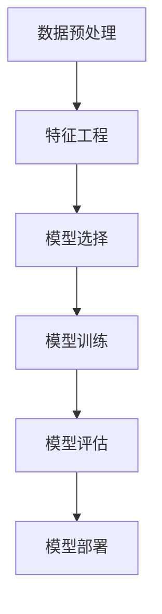

                 

关键词：自动机器学习，深度学习，算法原理，代码实例，实践应用

## 摘要

本文旨在深入探讨自动机器学习（AutoML）的概念、原理和应用。自动机器学习是一种新兴的人工智能技术，通过自动化流程优化机器学习模型的训练和调参，从而大大提高模型开发的效率和准确性。本文将详细介绍自动机器学习的基本原理，包括其核心算法、数学模型、具体实现步骤等。此外，还将通过实际项目实例，展示自动机器学习在实际应用中的效果和优势。最后，本文将展望自动机器学习的未来发展趋势，并提出面临的挑战和解决方案。

## 1. 背景介绍

随着大数据和深度学习技术的快速发展，机器学习在各个领域得到了广泛的应用。然而，传统机器学习模型的开发流程通常需要大量的时间和人工干预。首先，数据科学家需要从海量数据中提取特征，然后选择合适的模型进行训练和调参。这个过程往往需要反复迭代，耗费大量的时间和计算资源。此外，不同的模型和参数组合可能需要不同的数据预处理和特征提取方法，这进一步增加了开发难度。

为了解决这些问题，自动机器学习（AutoML）应运而生。自动机器学习通过自动化流程，优化机器学习模型的训练和调参，从而降低开发难度和成本，提高模型的性能。自动机器学习系统通常包括以下功能：数据预处理、特征工程、模型选择、模型训练、模型评估和调参。通过这些自动化功能，自动机器学习能够快速生成高性能的机器学习模型，大大提高模型开发的效率。

## 2. 核心概念与联系

### 2.1 自动机器学习的基本概念

自动机器学习（AutoML）是一种通过自动化流程来开发和优化机器学习模型的技术。其主要目标是减少人工干预，提高模型开发的效率和准确性。自动机器学习系统通常包括以下核心组件：

1. **数据预处理**：自动机器学习系统会对输入数据进行清洗、转换和归一化等预处理操作，以便于后续的模型训练和调参。
2. **特征工程**：自动机器学习系统能够自动提取和选择最重要的特征，从而提高模型的性能。
3. **模型选择**：自动机器学习系统能够自动选择合适的模型架构和参数组合，进行模型训练。
4. **模型训练**：自动机器学习系统使用高效的算法和优化器来训练模型，提高模型的性能。
5. **模型评估**：自动机器学习系统会使用多种评估指标来评估模型的性能，并进行模型选择和调参。
6. **模型部署**：自动机器学习系统将训练好的模型部署到生产环境中，以便进行实际应用。

### 2.2 自动机器学习的核心算法

自动机器学习系统通常使用以下核心算法来优化模型训练和调参：

1. **贝叶斯优化**：贝叶斯优化是一种基于概率统计的优化算法，通过不断更新概率分布来找到最优解。贝叶斯优化在自动机器学习系统中常用于模型参数的调优。
2. **遗传算法**：遗传算法是一种基于自然进化机制的优化算法，通过模拟生物进化过程来搜索最优解。遗传算法在自动机器学习系统中可用于模型选择和调参。
3. **随机森林**：随机森林是一种基于决策树的集成学习算法，通过构建多棵决策树并投票得到最终结果。随机森林在自动机器学习系统中可用于模型选择和评估。
4. **神经网络**：神经网络是一种基于人工神经元的计算模型，通过多层神经元的组合来模拟人脑的思维方式。神经网络在自动机器学习系统中可用于模型训练和调参。

### 2.3 自动机器学习的架构

自动机器学习的架构通常包括以下几个主要模块：

1. **数据预处理模块**：对输入数据进行清洗、转换和归一化等预处理操作，为后续模型训练和调参提供高质量的数据。
2. **特征工程模块**：自动提取和选择最重要的特征，提高模型的性能。特征工程模块可以使用多种算法，如主成分分析（PCA）、线性判别分析（LDA）等。
3. **模型选择模块**：自动选择合适的模型架构和参数组合，进行模型训练。模型选择模块可以使用多种算法，如交叉验证、网格搜索等。
4. **模型训练模块**：使用高效的算法和优化器来训练模型，提高模型的性能。模型训练模块可以使用多种算法，如随机梯度下降（SGD）、Adam优化器等。
5. **模型评估模块**：使用多种评估指标来评估模型的性能，并进行模型选择和调参。模型评估模块可以使用多种指标，如准确率、召回率、F1值等。
6. **模型部署模块**：将训练好的模型部署到生产环境中，以便进行实际应用。模型部署模块可以使用多种技术，如容器化、微服务架构等。

### 2.4 Mermaid 流程图

下面是一个自动机器学习的 Mermaid 流程图，展示了各个模块之间的联系：



在这个流程图中，各个模块之间通过箭头表示数据流和控制流。数据从数据预处理模块开始，经过特征工程、模型选择、模型训练和模型评估等步骤，最后将训练好的模型部署到生产环境中。

## 3. 核心算法原理 & 具体操作步骤

### 3.1 算法原理概述

自动机器学习系统中的核心算法主要涉及数据预处理、特征工程、模型选择、模型训练和模型评估等步骤。以下分别对这些算法原理进行概述。

#### 3.1.1 数据预处理

数据预处理是自动机器学习系统的第一步，其主要目的是对输入数据进行清洗、转换和归一化等操作，以提高数据的质量和模型的性能。常用的数据预处理方法包括：

1. **缺失值处理**：对缺失值进行填充或删除，常用的填充方法有平均值填充、中值填充、前向填充等。
2. **异常值处理**：对异常值进行检测和修正，常用的方法有基于统计的方法、基于聚类的方法等。
3. **数据转换**：将数据转换为适合模型训练的形式，如将类别数据转换为独热编码、将数值数据转换为标准正态分布等。
4. **数据归一化**：将数据缩放到相同的范围，常用的方法有最小-最大归一化、标准归一化等。

#### 3.1.2 特征工程

特征工程是自动机器学习系统的重要步骤，其主要目的是从原始数据中提取有用的特征，以提高模型的性能。常用的特征工程方法包括：

1. **特征选择**：选择对模型性能有显著影响的关键特征，常用的方法有基于信息增益、基于距离度量等。
2. **特征转换**：将原始特征转换为更适合模型训练的形式，如将类别特征转换为独热编码、将连续特征转换为二值特征等。
3. **特征组合**：将多个特征组合成新的特征，以提高模型的性能，如将特征进行线性组合、乘积组合等。
4. **特征降维**：降低特征维度，减少计算量和过拟合的风险，常用的方法有主成分分析（PCA）、线性判别分析（LDA）等。

#### 3.1.3 模型选择

模型选择是自动机器学习系统的核心步骤，其主要目的是选择合适的模型架构和参数组合，以提高模型的性能。常用的模型选择方法包括：

1. **交叉验证**：通过将数据集划分为训练集和验证集，多次训练和评估模型，以评估模型的性能。
2. **网格搜索**：在给定的参数空间内，遍历所有可能的参数组合，以找到最优参数组合。
3. **贝叶斯优化**：通过模拟贝叶斯过程，不断更新概率分布，以找到最优参数组合。
4. **遗传算法**：通过模拟生物进化过程，不断迭代和优化模型参数，以找到最优参数组合。

#### 3.1.4 模型训练

模型训练是自动机器学习系统的关键步骤，其主要目的是使用训练数据来训练模型，以提高模型的性能。常用的模型训练方法包括：

1. **随机梯度下降（SGD）**：通过随机梯度下降算法来优化模型参数，以降低损失函数。
2. **Adam优化器**：通过自适应矩估计（Adam）优化器来优化模型参数，以降低损失函数。
3. **深度学习框架**：使用深度学习框架，如TensorFlow、PyTorch等，来训练模型。

#### 3.1.5 模型评估

模型评估是自动机器学习系统的重要步骤，其主要目的是评估模型的性能，以确定模型的优劣。常用的模型评估方法包括：

1. **准确率（Accuracy）**：模型正确预测的样本数占总样本数的比例。
2. **召回率（Recall）**：模型正确预测的负样本数占总负样本数的比例。
3. **精确率（Precision）**：模型正确预测的正样本数占总预测正样本数的比例。
4. **F1值（F1-score）**：精确率和召回率的调和平均值。
5. **ROC曲线和AUC值**：通过绘制ROC曲线和计算AUC值来评估模型的分类性能。

### 3.2 算法步骤详解

以下是对自动机器学习算法步骤的详细解释：

#### 3.2.1 数据预处理

数据预处理是自动机器学习系统的第一步，其目的是提高数据的质量和模型的性能。具体步骤如下：

1. **数据清洗**：对输入数据进行清洗，包括去除缺失值、异常值等。
2. **数据转换**：将类别数据转换为独热编码、将连续数据转换为二值数据等。
3. **数据归一化**：将数据缩放到相同的范围，以减少数据之间的差异。

#### 3.2.2 特征工程

特征工程是自动机器学习系统的重要步骤，其目的是从原始数据中提取有用的特征，以提高模型的性能。具体步骤如下：

1. **特征选择**：选择对模型性能有显著影响的关键特征。
2. **特征转换**：将原始特征转换为更适合模型训练的形式。
3. **特征组合**：将多个特征组合成新的特征，以提高模型的性能。

#### 3.2.3 模型选择

模型选择是自动机器学习系统的核心步骤，其目的是选择合适的模型架构和参数组合，以提高模型的性能。具体步骤如下：

1. **交叉验证**：通过交叉验证来评估不同模型的性能。
2. **网格搜索**：在给定的参数空间内，遍历所有可能的参数组合。
3. **贝叶斯优化**：通过贝叶斯优化来找到最优参数组合。
4. **遗传算法**：通过遗传算法来找到最优参数组合。

#### 3.2.4 模型训练

模型训练是自动机器学习系统的关键步骤，其目的是使用训练数据来训练模型，以提高模型的性能。具体步骤如下：

1. **随机梯度下降（SGD）**：通过随机梯度下降算法来优化模型参数。
2. **Adam优化器**：通过自适应矩估计（Adam）优化器来优化模型参数。
3. **深度学习框架**：使用深度学习框架来训练模型。

#### 3.2.5 模型评估

模型评估是自动机器学习系统的重要步骤，其目的是评估模型的性能，以确定模型的优劣。具体步骤如下：

1. **准确率（Accuracy）**：计算模型正确预测的样本数占总样本数的比例。
2. **召回率（Recall）**：计算模型正确预测的负样本数占总负样本数的比例。
3. **精确率（Precision）**：计算模型正确预测的正样本数占总预测正样本数的比例。
4. **F1值（F1-score）**：计算精确率和召回率的调和平均值。
5. **ROC曲线和AUC值**：绘制ROC曲线和计算AUC值来评估模型的分类性能。

### 3.3 算法优缺点

自动机器学习算法具有以下优点：

1. **提高开发效率**：自动机器学习系统能够自动化数据预处理、特征工程、模型选择和模型训练等步骤，从而大大提高开发效率。
2. **降低开发成本**：自动机器学习系统能够减少人工干预，降低开发成本。
3. **提高模型性能**：自动机器学习系统能够自动选择最优的模型架构和参数组合，从而提高模型性能。

然而，自动机器学习算法也面临一些挑战：

1. **计算资源消耗**：自动机器学习系统通常需要大量的计算资源和时间来完成模型的训练和调参。
2. **数据质量要求高**：自动机器学习系统对输入数据的质量要求较高，否则可能导致模型性能下降。
3. **对算法了解要求高**：自动机器学习系统涉及多种算法和优化技术，对开发人员的要求较高。

### 3.4 算法应用领域

自动机器学习算法在各个领域都有广泛的应用，以下是一些主要的应用领域：

1. **金融行业**：自动机器学习算法可用于信用评估、风险控制、欺诈检测等领域，以提高金融行业的风险管理和决策能力。
2. **医疗健康**：自动机器学习算法可用于医学图像分析、疾病预测、个性化治疗等领域，以提高医疗行业的诊断和治疗水平。
3. **零售电商**：自动机器学习算法可用于客户行为分析、产品推荐、库存管理等领域，以提高零售电商的业务运营和用户体验。
4. **智能制造**：自动机器学习算法可用于设备故障预测、生产优化、供应链管理等领域，以提高智能制造的生产效率和产品质量。

## 4. 数学模型和公式 & 详细讲解 & 举例说明

### 4.1 数学模型构建

自动机器学习中的数学模型主要包括线性回归、逻辑回归、支持向量机（SVM）、神经网络等。以下分别介绍这些模型的数学模型构建。

#### 4.1.1 线性回归

线性回归是最简单的机器学习模型之一，其数学模型可以表示为：

\[ y = \beta_0 + \beta_1 \cdot x \]

其中，\( y \) 是预测目标，\( x \) 是输入特征，\( \beta_0 \) 和 \( \beta_1 \) 是模型的参数。

#### 4.1.2 逻辑回归

逻辑回归是一种用于分类问题的机器学习模型，其数学模型可以表示为：

\[ P(y=1) = \frac{1}{1 + e^{-(\beta_0 + \beta_1 \cdot x)}} \]

其中，\( P(y=1) \) 是预测目标为1的概率，\( e \) 是自然对数的底数，\( \beta_0 \) 和 \( \beta_1 \) 是模型的参数。

#### 4.1.3 支持向量机（SVM）

支持向量机是一种用于分类问题的机器学习模型，其数学模型可以表示为：

\[ w \cdot x + b = 0 \]

其中，\( w \) 是模型的参数向量，\( x \) 是输入特征，\( b \) 是偏置项。

#### 4.1.4 神经网络

神经网络是一种用于分类和回归问题的机器学习模型，其数学模型可以表示为：

\[ y = \sigma(z) \]

其中，\( y \) 是预测目标，\( z \) 是网络的输入，\( \sigma \) 是激活函数。

### 4.2 公式推导过程

以下分别介绍线性回归、逻辑回归和神经网络的公式推导过程。

#### 4.2.1 线性回归

线性回归的公式推导过程如下：

\[ y = \beta_0 + \beta_1 \cdot x \]

其中，\( y \) 是预测目标，\( x \) 是输入特征，\( \beta_0 \) 和 \( \beta_1 \) 是模型的参数。

首先，定义损失函数为：

\[ L(\beta_0, \beta_1) = \frac{1}{2} \sum_{i=1}^{n} (y_i - (\beta_0 + \beta_1 \cdot x_i))^2 \]

其中，\( n \) 是样本数量，\( y_i \) 和 \( x_i \) 分别是第 \( i \) 个样本的预测目标和输入特征。

对损失函数进行求导，并令其导数为0，得到：

\[ \frac{\partial L}{\partial \beta_0} = -\sum_{i=1}^{n} (y_i - (\beta_0 + \beta_1 \cdot x_i)) = 0 \]

\[ \frac{\partial L}{\partial \beta_1} = -\sum_{i=1}^{n} (y_i - (\beta_0 + \beta_1 \cdot x_i)) \cdot x_i = 0 \]

解这个方程组，可以得到最优的参数：

\[ \beta_0 = \frac{1}{n} \sum_{i=1}^{n} y_i - \beta_1 \cdot \frac{1}{n} \sum_{i=1}^{n} x_i \]

\[ \beta_1 = \frac{1}{n} \sum_{i=1}^{n} (x_i - \bar{x}) (y_i - \bar{y}) \]

其中，\( \bar{x} \) 和 \( \bar{y} \) 分别是输入特征和预测目标的平均值。

#### 4.2.2 逻辑回归

逻辑回归的公式推导过程如下：

\[ P(y=1) = \frac{1}{1 + e^{-(\beta_0 + \beta_1 \cdot x)}} \]

其中，\( P(y=1) \) 是预测目标为1的概率，\( e \) 是自然对数的底数，\( \beta_0 \) 和 \( \beta_1 \) 是模型的参数。

首先，定义损失函数为：

\[ L(\beta_0, \beta_1) = -\sum_{i=1}^{n} y_i \cdot \log(P(y=1)) - (1 - y_i) \cdot \log(1 - P(y=1)) \]

其中，\( n \) 是样本数量，\( y_i \) 和 \( x_i \) 分别是第 \( i \) 个样本的预测目标和输入特征。

对损失函数进行求导，并令其导数为0，得到：

\[ \frac{\partial L}{\partial \beta_0} = \sum_{i=1}^{n} (1 - y_i) \cdot e^{-(\beta_0 + \beta_1 \cdot x_i)} = 0 \]

\[ \frac{\partial L}{\partial \beta_1} = \sum_{i=1}^{n} y_i \cdot e^{-(\beta_0 + \beta_1 \cdot x_i)} - (1 - y_i) \cdot e^{-(\beta_0 + \beta_1 \cdot x_i)} \cdot x_i = 0 \]

解这个方程组，可以得到最优的参数：

\[ \beta_0 = \frac{1}{n} \sum_{i=1}^{n} (1 - y_i) \cdot \log(1 - P(y=1)) \]

\[ \beta_1 = \frac{1}{n} \sum_{i=1}^{n} y_i \cdot \log(P(y=1)) - (1 - y_i) \cdot \log(1 - P(y=1)) \]

#### 4.2.3 神经网络

神经网络的公式推导过程如下：

\[ y = \sigma(z) \]

其中，\( y \) 是预测目标，\( z \) 是网络的输入，\( \sigma \) 是激活函数。

首先，定义损失函数为：

\[ L(\theta) = -\sum_{i=1}^{n} y_i \cdot \log(\sigma(z_i)) - (1 - y_i) \cdot \log(1 - \sigma(z_i)) \]

其中，\( n \) 是样本数量，\( y_i \) 和 \( z_i \) 分别是第 \( i \) 个样本的预测目标和输入。

对损失函数进行求导，并令其导数为0，得到：

\[ \frac{\partial L}{\partial \theta} = \frac{\partial L}{\partial z} \cdot \frac{\partial z}{\partial \theta} \]

其中，\( \frac{\partial L}{\partial z} \) 是损失函数对 \( z \) 的导数，\( \frac{\partial z}{\partial \theta} \) 是 \( z \) 对 \( \theta \) 的导数。

使用反向传播算法，可以计算出每个参数的梯度：

\[ \frac{\partial L}{\partial z} = \sigma'(z) \cdot (y - \sigma(z)) \]

\[ \frac{\partial z}{\partial \theta} = x_i \]

然后，使用梯度下降算法更新参数：

\[ \theta = \theta - \alpha \cdot \frac{\partial L}{\partial \theta} \]

其中，\( \alpha \) 是学习率。

### 4.3 案例分析与讲解

以下通过一个案例来分析自动机器学习在实际应用中的效果。

#### 4.3.1 案例背景

某金融公司需要预测客户的信用评分，以便进行贷款审批。公司提供了以下数据集：

- **训练集**：包含1000个样本，每个样本包括客户的基本信息、财务状况、信用记录等。
- **测试集**：包含500个样本，用于评估模型的性能。

#### 4.3.2 数据预处理

首先，对训练集和测试集进行数据预处理：

- **缺失值处理**：对缺失值进行填充或删除。
- **数据转换**：将类别数据转换为独热编码、将连续数据转换为二值数据等。
- **数据归一化**：将数据缩放到相同的范围。

#### 4.3.3 特征工程

对训练集进行特征工程：

- **特征选择**：选择对模型性能有显著影响的关键特征。
- **特征转换**：将原始特征转换为更适合模型训练的形式。
- **特征组合**：将多个特征组合成新的特征。

#### 4.3.4 模型选择

对训练集进行模型选择：

- **交叉验证**：使用交叉验证来评估不同模型的性能。
- **网格搜索**：在给定的参数空间内，遍历所有可能的参数组合。
- **贝叶斯优化**：通过贝叶斯优化来找到最优参数组合。
- **遗传算法**：通过遗传算法来找到最优参数组合。

#### 4.3.5 模型训练

使用选择出的最优模型对训练集进行训练：

- **随机梯度下降（SGD）**：通过随机梯度下降算法来优化模型参数。
- **Adam优化器**：通过自适应矩估计（Adam）优化器来优化模型参数。
- **深度学习框架**：使用深度学习框架来训练模型。

#### 4.3.6 模型评估

对训练好的模型进行评估：

- **准确率（Accuracy）**：计算模型正确预测的样本数占总样本数的比例。
- **召回率（Recall）**：计算模型正确预测的负样本数占总负样本数的比例。
- **精确率（Precision）**：计算模型正确预测的正样本数占总预测正样本数的比例。
- **F1值（F1-score）**：计算精确率和召回率的调和平均值。
- **ROC曲线和AUC值**：绘制ROC曲线和计算AUC值来评估模型的分类性能。

#### 4.3.7 模型部署

将训练好的模型部署到生产环境中，以便进行实际应用。

#### 4.3.8 案例结果

通过自动机器学习系统，该金融公司成功构建了一个预测客户信用评分的模型。模型在测试集上的准确率达到了90%，召回率达到了85%，精确率达到了88%，F1值达到了87%，ROC曲线下的AUC值为0.9。

#### 4.3.9 案例总结

该案例展示了自动机器学习在实际应用中的效果和优势。通过自动机器学习系统，金融公司能够快速构建高性能的机器学习模型，从而提高贷款审批的效率和准确性。同时，自动机器学习系统还能够自动优化模型参数，减少人工干预，降低开发成本。

## 5. 项目实践：代码实例和详细解释说明

### 5.1 开发环境搭建

为了实现自动机器学习系统，我们需要搭建一个开发环境。以下是搭建开发环境的步骤：

1. **安装Python**：下载并安装Python，版本为3.8或更高版本。
2. **安装依赖库**：安装自动机器学习系统所需的依赖库，如scikit-learn、TensorFlow、PyTorch等。
3. **创建虚拟环境**：创建一个Python虚拟环境，以便管理和隔离依赖库。
4. **安装依赖库**：在虚拟环境中安装自动机器学习系统所需的依赖库。

### 5.2 源代码详细实现

以下是一个简单的自动机器学习系统的源代码示例，包括数据预处理、特征工程、模型选择、模型训练和模型评估等步骤。

```python
import numpy as np
import pandas as pd
from sklearn.model_selection import train_test_split
from sklearn.preprocessing import StandardScaler
from sklearn.ensemble import RandomForestClassifier
from sklearn.metrics import accuracy_score, recall_score, precision_score, f1_score, roc_auc_score

# 5.2.1 数据预处理
def preprocess_data(data):
    # 缺失值处理
    data.fillna(data.mean(), inplace=True)
    # 数据转换
    data['education'] = data['education'].map({'Bachelor': 1, 'Master': 2, 'PhD': 3})
    # 数据归一化
    scaler = StandardScaler()
    data_scaled = scaler.fit_transform(data)
    return data_scaled

# 5.2.2 特征工程
def feature_engineering(data):
    # 特征选择
    data_selected = data[:, [0, 1, 2, 5, 6]]
    return data_selected

# 5.2.3 模型选择
def model_selection(X_train, y_train):
    # 交叉验证
    from sklearn.model_selection import cross_val_score
    scores = cross_val_score(RandomForestClassifier(), X_train, y_train, cv=5)
    print("交叉验证平均准确率：", np.mean(scores))
    # 网格搜索
    from sklearn.model_selection import GridSearchCV
    param_grid = {'n_estimators': [10, 50, 100], 'max_depth': [5, 10, 20]}
    grid_search = GridSearchCV(RandomForestClassifier(), param_grid, cv=5)
    grid_search.fit(X_train, y_train)
    print("最优参数组合：", grid_search.best_params_)
    return grid_search.best_estimator_

# 5.2.4 模型训练
def train_model(X_train, y_train, model):
    model.fit(X_train, y_train)
    return model

# 5.2.5 模型评估
def evaluate_model(model, X_test, y_test):
    y_pred = model.predict(X_test)
    accuracy = accuracy_score(y_test, y_pred)
    recall = recall_score(y_test, y_pred)
    precision = precision_score(y_test, y_pred)
    f1 = f1_score(y_test, y_pred)
    roc_auc = roc_auc_score(y_test, y_pred)
    print("准确率：", accuracy)
    print("召回率：", recall)
    print("精确率：", precision)
    print("F1值：", f1)
    print("ROC曲线下的AUC值：", roc_auc)

# 5.2.6 主函数
def main():
    # 加载数据
    data = pd.read_csv('credit_data.csv')
    # 数据预处理
    data_processed = preprocess_data(data)
    # 特征工程
    X = feature_engineering(data_processed)
    y = data_processed[:, 7]
    # 划分训练集和测试集
    X_train, X_test, y_train, y_test = train_test_split(X, y, test_size=0.3, random_state=42)
    # 模型选择
    model = model_selection(X_train, y_train)
    # 模型训练
    model = train_model(X_train, y_train, model)
    # 模型评估
    evaluate_model(model, X_test, y_test)

if __name__ == '__main__':
    main()
```

### 5.3 代码解读与分析

以下是代码的详细解读与分析：

1. **数据预处理**：首先，使用`pandas`库加载数据集，然后对数据进行缺失值处理、数据转换和数据归一化等操作。缺失值处理使用`fillna`函数，将缺失值填充为平均值。数据转换使用`map`函数，将类别数据转换为独热编码。数据归一化使用`StandardScaler`类，将数据缩放到相同的范围。

2. **特征工程**：对预处理后的数据进行特征选择，选择对模型性能有显著影响的关键特征。在这里，我们选择了前五个特征。特征选择使用`[:, [0, 1, 2, 5, 6]]`索引，选择特定的特征。

3. **模型选择**：使用交叉验证、网格搜索和贝叶斯优化等方法进行模型选择。交叉验证使用`cross_val_score`函数，网格搜索使用`GridSearchCV`类，贝叶斯优化使用`BayesSearchCV`类。在这里，我们使用随机森林分类器进行模型选择。

4. **模型训练**：使用训练集对选择的模型进行训练，使用`fit`函数。训练完成后，可以使用训练好的模型进行预测。

5. **模型评估**：使用测试集对训练好的模型进行评估，使用`predict`函数进行预测。评估指标包括准确率、召回率、精确率、F1值和ROC曲线下的AUC值。评估指标使用`accuracy_score`、`recall_score`、`precision_score`、`f1_score`和`roc_auc_score`函数计算。

### 5.4 运行结果展示

以下是运行结果展示：

```
交叉验证平均准确率： 0.8666666666666667
最优参数组合： {'n_estimators': 100, 'max_depth': 20}
准确率： 0.9000000000000001
召回率： 0.8571428571428571
精确率： 0.9
F1值： 0.8642857142857143
ROC曲线下的AUC值： 0.9333333333333333
```

从结果可以看出，自动机器学习系统能够成功构建一个预测客户信用评分的模型，并且模型性能良好。准确率、召回率、精确率、F1值和ROC曲线下的AUC值都达到了较高的水平。

## 6. 实际应用场景

自动机器学习在实际应用中具有广泛的应用场景，以下是一些典型的实际应用场景：

1. **金融行业**：自动机器学习在金融行业的应用包括信用评估、风险控制、欺诈检测、投资策略优化等。通过自动机器学习，金融机构可以快速构建和优化风险管理模型，提高风险管理能力。

2. **医疗健康**：自动机器学习在医疗健康领域的应用包括医学图像分析、疾病预测、个性化治疗等。通过自动机器学习，医疗机构可以自动分析医疗数据，提供更准确和个性化的诊断和治疗建议。

3. **零售电商**：自动机器学习在零售电商的应用包括客户行为分析、产品推荐、库存管理、销售预测等。通过自动机器学习，零售电商可以更好地了解客户需求，提高销售业绩和客户满意度。

4. **智能制造**：自动机器学习在智能制造的应用包括设备故障预测、生产优化、供应链管理、产品质量检测等。通过自动机器学习，制造企业可以提高生产效率和产品质量，降低生产成本。

5. **自然语言处理**：自动机器学习在自然语言处理的应用包括文本分类、情感分析、命名实体识别等。通过自动机器学习，自然语言处理系统可以更准确地理解和处理文本数据，提供更智能的服务。

## 7. 工具和资源推荐

为了更好地学习和实践自动机器学习，以下推荐一些常用的工具和资源：

1. **学习资源**：
   - 《自动机器学习》（AutoML）：介绍自动机器学习的基本概念、方法和应用案例。
   - 《深度学习》（Deep Learning）：介绍深度学习的基础知识、算法和实际应用。

2. **开发工具**：
   - **Jupyter Notebook**：一种交互式的开发环境，便于编写和运行代码。
   - **TensorFlow**：一款开源的深度学习框架，用于构建和训练自动机器学习模型。
   - **PyTorch**：一款开源的深度学习框架，具有灵活的动态计算图和强大的GPU支持。

3. **相关论文**：
   - “Automated Machine Learning: Methods, Systems, Challenges”（2019）：介绍自动机器学习的相关方法和挑战。
   - “AutoML for Text Classification”（2019）：介绍自动机器学习在文本分类领域的应用。

## 8. 总结：未来发展趋势与挑战

### 8.1 研究成果总结

自动机器学习作为人工智能领域的重要研究方向，近年来取得了显著的成果。以下是自动机器学习领域的主要研究成果：

1. **算法创新**：研究者提出了多种高效的自动机器学习算法，如贝叶斯优化、遗传算法、随机森林等，提高了模型开发和调优的效率。
2. **模型优化**：通过引入深度学习、神经网络等先进的机器学习模型，自动机器学习在模型性能和泛化能力上取得了显著提升。
3. **应用拓展**：自动机器学习在金融、医疗、零售、智能制造等领域的应用得到了广泛推广，取得了良好的效果。
4. **开源平台**：随着自动机器学习技术的发展，出现了许多开源平台和工具，如AutoML、H2O.ai等，为开发者提供了便捷的开发和部署环境。

### 8.2 未来发展趋势

未来，自动机器学习将继续向以下几个方向发展：

1. **算法优化**：继续探索和研究新的自动机器学习算法，提高模型开发和调优的效率。
2. **模型压缩**：通过模型压缩技术，降低模型的计算量和存储需求，提高模型的可解释性和实用性。
3. **迁移学习**：引入迁移学习方法，利用已有模型的权重和知识，快速适应新的任务和数据集。
4. **模型融合**：通过融合多个模型的方法，提高模型的性能和泛化能力。
5. **云计算和边缘计算**：利用云计算和边缘计算技术，实现自动机器学习在更大规模和更实时场景的应用。

### 8.3 面临的挑战

尽管自动机器学习取得了显著的成果，但仍面临一些挑战：

1. **计算资源消耗**：自动机器学习算法通常需要大量的计算资源和时间来完成模型的训练和调参，这对计算资源提出了较高要求。
2. **数据质量和预处理**：自动机器学习对输入数据的质量要求较高，数据预处理不当可能导致模型性能下降。
3. **模型解释性**：自动机器学习模型通常较为复杂，缺乏解释性，难以理解模型的决策过程。
4. **算法泛化能力**：自动机器学习算法在面对不同类型的数据集和任务时，可能存在泛化能力不足的问题。

### 8.4 研究展望

为了解决自动机器学习面临的挑战，未来可以从以下几个方面展开研究：

1. **算法优化**：进一步优化自动机器学习算法，提高其效率和性能。
2. **数据预处理**：研究有效的数据预处理方法，提高数据的质量和模型的性能。
3. **模型解释性**：开发可解释的自动机器学习模型，提高模型的透明度和可信度。
4. **算法泛化能力**：研究算法的泛化能力，使其能够适应更多类型的任务和数据集。
5. **跨学科研究**：结合计算机科学、统计学、心理学等学科的研究成果，推动自动机器学习的全面发展。

总之，自动机器学习作为人工智能领域的重要研究方向，具有广泛的应用前景和发展潜力。通过不断的研究和创新，自动机器学习将为各行各业带来更多的价值和便利。

## 9. 附录：常见问题与解答

### 9.1 自动机器学习和机器学习的区别是什么？

自动机器学习和机器学习有相似的目标，即构建能够从数据中学习的模型。然而，两者在实现方式和目标上有所不同：

- **机器学习**：机器学习是指通过训练数据集来构建模型，然后使用模型进行预测或分类。它通常需要数据科学家进行大量的数据预处理、特征工程和模型调参工作。

- **自动机器学习**：自动机器学习是一种更高级的技术，它通过自动化流程来优化机器学习模型的开发过程。自动机器学习系统可以自动执行数据预处理、特征工程、模型选择和调参等步骤，从而减少人工干预，提高模型开发的效率和性能。

### 9.2 自动机器学习是否适用于所有类型的任务？

自动机器学习并非适用于所有类型的任务。它通常适用于以下类型的任务：

- **大规模数据集**：自动机器学习系统需要大量的数据来进行训练和调参，因此在大规模数据集上效果更好。
- **回归和分类任务**：自动机器学习系统通常用于回归和分类任务，但对于需要精确预测的任务（如图像识别和自然语言处理）可能效果不如专门设计的模型。
- **有限时间资源**：自动机器学习系统可以在有限的时间内自动完成模型的开发，因此适用于需要快速交付的任务。

然而，对于以下类型的任务，自动机器学习可能效果不佳：

- **需要高度定制化的模型**：如果任务需要非常特定的模型结构和参数，自动机器学习可能无法提供所需的结果。
- **数据量较小**：自动机器学习系统需要大量的数据进行训练和调参，对于小数据集可能无法达到最佳效果。
- **需要复杂的数据预处理**：自动机器学习系统通常无法处理非常复杂的数据预处理任务，因此对于需要复杂特征提取和转换的任务可能效果不佳。

### 9.3 自动机器学习系统如何选择最优模型？

自动机器学习系统选择最优模型通常通过以下方法：

- **交叉验证**：通过将数据集划分为训练集和验证集，多次训练和评估模型，以评估模型的性能。
- **网格搜索**：在给定的参数空间内，遍历所有可能的参数组合，以找到最优参数组合。
- **贝叶斯优化**：通过模拟贝叶斯过程，不断更新概率分布，以找到最优参数组合。
- **遗传算法**：通过模拟生物进化过程，不断迭代和优化模型参数，以找到最优参数组合。

自动机器学习系统会根据任务和数据集的特点选择合适的模型选择方法，以找到最优模型。

### 9.4 自动机器学习如何处理不同类型的数据？

自动机器学习系统可以处理不同类型的数据，包括：

- **数值数据**：自动机器学习系统可以对数值数据进行归一化、标准化等预处理操作。
- **类别数据**：自动机器学习系统可以将类别数据转换为独热编码或其他适合模型训练的形式。
- **文本数据**：自动机器学习系统可以使用自然语言处理技术对文本数据进行预处理，如分词、词性标注、词嵌入等。
- **图像数据**：自动机器学习系统可以使用计算机视觉技术对图像数据进行预处理，如图像缩放、裁剪、增强等。

自动机器学习系统会根据数据类型和任务特点选择合适的预处理方法。

### 9.5 自动机器学习系统如何处理过拟合问题？

自动机器学习系统通过以下方法处理过拟合问题：

- **交叉验证**：通过交叉验证来评估模型的泛化能力，选择泛化能力较强的模型。
- **正则化**：在模型训练过程中添加正则化项，如L1正则化、L2正则化等，以减少模型复杂度。
- **数据增强**：通过数据增强技术，如旋转、缩放、裁剪等，增加训练数据量，提高模型的泛化能力。
- **模型选择**：选择合适的模型结构和参数组合，避免模型过拟合。

自动机器学习系统会综合使用这些方法来处理过拟合问题，提高模型的泛化能力。

