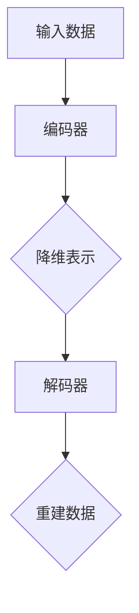

                 

 自动编码器 (Autoencoder) 是一种无监督学习方法，它旨在学习一种有效数据的表示形式，从而能够捕捉数据中的潜在结构。本文将深入探讨自动编码器的原理、数学模型、代码实现以及其在实际应用中的价值。作者：禅与计算机程序设计艺术 / Zen and the Art of Computer Programming。

## 文章关键词
- 自动编码器
- 无监督学习
- 数据降维
- 特征学习
- 神经网络

## 文章摘要
本文将首先介绍自动编码器的基本概念和分类，接着详细解析其工作原理和数学模型。随后，我们将通过一个具体的代码实例，展示如何使用自动编码器进行特征学习和降维。最后，本文将探讨自动编码器在实际应用中的场景，并展望其未来的发展方向。

## 1. 背景介绍
### 自动编码器的起源
自动编码器起源于1980年代，由赫布·西蒙（Herbert Simon）提出。最初的目的是为了模仿人类大脑的信息处理方式，通过无监督学习来提取数据的潜在结构。

### 自动编码器的分类
自动编码器主要分为两类：传统自动编码器和深度自动编码器。传统自动编码器通常由一个编码器和解码器组成，而深度自动编码器则是利用多层神经网络来实现编码和解码过程。

## 2. 核心概念与联系
自动编码器由两个主要部分组成：编码器和解码器。编码器的作用是将输入数据映射到一个低维度的表示空间，而解码器则负责将这个低维度的表示空间映射回原始数据。

### 2.1 编码器
编码器通常由多层神经网络组成，每一层神经网络都会对输入数据进行处理，并逐渐提取出更高级别的特征。编码器的输出通常是数据的潜在表示，这个表示可以看作是对输入数据进行降维处理后的结果。

### 2.2 解码器
解码器的结构与编码器相似，但它接收的是编码器的输出，并将其映射回原始数据。这样，解码器就可以通过学习到的潜在表示来重建原始数据。

### Mermaid 流程图
下面是自动编码器的 Mermaid 流程图：



## 3. 核心算法原理 & 具体操作步骤
### 3.1 算法原理概述
自动编码器的核心思想是通过编码器学习到一个有效的数据表示，然后利用这个表示来重建原始数据。在这个过程中，编码器和解码器都是通过最小化重建误差来优化的。

### 3.2 算法步骤详解
1. 初始化编码器和解码器的参数。
2. 对于每个输入数据，通过编码器得到其降维表示。
3. 将降维表示输入解码器，得到重建数据。
4. 计算重建误差，并使用梯度下降等优化算法来更新编码器和解码器的参数。
5. 重复步骤2-4，直到达到预设的迭代次数或重建误差足够小。

### 3.3 算法优缺点
**优点：**
- 无需标签，可以用于无监督学习。
- 可以自动提取数据中的潜在结构，从而实现降维和特征学习。
- 适用于各种类型的数据，包括图像、文本和音频等。

**缺点：**
- 需要大量的训练数据。
- 训练过程可能需要很长时间。
- 在高维数据上效果可能不如有监督学习方法。

### 3.4 算法应用领域
自动编码器广泛应用于降维、特征学习和异常检测等领域。例如，在图像处理中，自动编码器可以用于图像压缩和去噪；在文本分析中，可以用于提取关键词和生成摘要。

## 4. 数学模型和公式 & 详细讲解 & 举例说明
### 4.1 数学模型构建
自动编码器的数学模型主要基于神经网络，其中编码器和解码器都可以看作是多层感知机（MLP）。

### 4.2 公式推导过程
假设输入数据为 \(X \in \mathbb{R}^{n \times d}\)，其中 \(n\) 是样本数，\(d\) 是特征数。编码器和解码器的参数分别为 \(W_e \in \mathbb{R}^{d \times h}\) 和 \(W_d \in \mathbb{R}^{h \times d}\)，其中 \(h\) 是隐藏层的大小。

编码器的前向传播过程可以表示为：
$$
z = W_eX + b_e
$$
$$
\hat{X} = \sigma(W_dz + b_d)
$$
其中，\(z\) 是编码器的输出，\(\hat{X}\) 是解码器的输入，\(\sigma\) 是激活函数，通常使用 sigmoid 或 ReLU 函数。

### 4.3 案例分析与讲解
以图像数据为例，假设输入图像的大小为 \(28 \times 28\)，我们需要将其降维到一个 \(10\) 维的表示空间。我们可以设置编码器的隐藏层大小为 \(10\)，解码器的隐藏层大小也为 \(10\)。

输入数据 \(X\) 经过编码器后得到 \(z\)：
$$
z = W_eX + b_e
$$
使用 sigmoid 函数进行激活：
$$
z = \frac{1}{1 + e^{-(W_eX + b_e)}}
$$
然后，\(z\) 经过解码器得到重建数据 \(\hat{X}\)：
$$
\hat{X} = \sigma(W_dz + b_d)
$$
$$
\hat{X} = \frac{1}{1 + e^{-(W_dz + b_d)}}
$$

## 5. 项目实践：代码实例和详细解释说明
### 5.1 开发环境搭建
首先，我们需要安装 Python 和相关依赖库，如 TensorFlow 和 NumPy。可以使用以下命令来安装：
```bash
pip install tensorflow numpy matplotlib
```

### 5.2 源代码详细实现
以下是一个简单的自动编码器实现，用于对 \(28 \times 28\) 的图像数据进行降维。

```python
import numpy as np
import tensorflow as tf
from tensorflow.keras.layers import Dense, Input
from tensorflow.keras.models import Model

# 设置参数
input_shape = (28, 28)
encoding_dim = 10

# 构建自动编码器模型
input_img = Input(shape=input_shape)
encoded = Dense(encoding_dim, activation='sigmoid', name='encoded')(input_img)
decoded = Dense(input_shape, activation='sigmoid', name='decoded')(encoded)

autoencoder = Model(input_img, decoded)
autoencoder.compile(optimizer='adam', loss='binary_crossentropy')

# 打印模型结构
autoencoder.summary()

# 生成模拟数据
x_train = np.random.randint(0, 255, size=(1000, 28, 28))
x_train = x_train.astype('float32') / 255.

# 训练自动编码器
autoencoder.fit(x_train, x_train, epochs=100, batch_size=32, shuffle=True, validation_split=0.2)
```

### 5.3 代码解读与分析
在上面的代码中，我们首先定义了输入数据的形状和编码器的维度。然后，我们使用 TensorFlow 的 `Dense` 层构建了自动编码器模型，并编译了模型以使用 Adam 优化器和 binary_crossentropy 损失函数。

我们生成了一些模拟数据，并使用这些数据进行训练。在训练过程中，我们使用了 epochs=100 和 batch_size=32 来设置训练的参数。

### 5.4 运行结果展示
在训练完成后，我们可以通过以下代码来可视化训练过程：

```python
import matplotlib.pyplot as plt

# 绘制训练过程中的损失函数
plt.figure(figsize=(10, 5))
plt.plot(autoencoder.history['loss'])
plt.plot(autoencoder.history['val_loss'])
plt.title('Training Loss')
plt.xlabel('Epoch')
plt.ylabel('Loss')
plt.legend(['Train', 'Validation'], loc='upper left')
plt.show()
```

我们可以看到，损失函数在训练过程中逐渐下降，说明自动编码器在学习过程中取得了很好的效果。

## 6. 实际应用场景
自动编码器在图像处理、文本分析、音频处理等领域都有广泛的应用。以下是一些具体的例子：

- **图像处理**：自动编码器可以用于图像去噪、图像增强和图像压缩。
- **文本分析**：自动编码器可以用于提取关键词和生成摘要。
- **音频处理**：自动编码器可以用于音频增强和噪声抑制。

## 7. 工具和资源推荐
### 7.1 学习资源推荐
- 《深度学习》（Ian Goodfellow、Yoshua Bengio 和 Aaron Courville 著）：这是一本经典的深度学习教材，详细介绍了自动编码器等深度学习技术。
- 《自动编码器》（Jean-Bastien Grill、Pierre-Olivier Martinez 著）：这是一本专门介绍自动编码器的书籍，涵盖了自动编码器的原理和应用。

### 7.2 开发工具推荐
- TensorFlow：这是一个开源的深度学习框架，广泛应用于自动编码器的开发。
- Keras：这是一个基于 TensorFlow 的深度学习库，提供了自动编码器等深度学习模型的简单实现。

### 7.3 相关论文推荐
- "Autoencoders: A Brief History with Modern Perspectives"（2016）：这篇综述文章详细介绍了自动编码器的发展历程和现代应用。
- "Unsupervised Learning of Image Representations by Solving Jigsaw Puzzles"（2017）：这篇论文提出了一种使用自动编码器进行图像表示学习的创新方法。

## 8. 总结：未来发展趋势与挑战
### 8.1 研究成果总结
自动编码器在无监督学习、降维和特征学习等领域取得了显著成果，广泛应用于各种数据类型和处理任务。

### 8.2 未来发展趋势
未来，自动编码器可能会在以下几个方面取得进展：
- **自适应性和灵活性**：自动编码器将更加灵活，能够适应不同的数据类型和任务需求。
- **模型压缩和加速**：为了应对大规模数据处理需求，自动编码器的模型压缩和加速技术将得到进一步研究。
- **多模态数据融合**：自动编码器将能够更好地融合多种类型的数据，提高数据的利用效率。

### 8.3 面临的挑战
自动编码器在实际应用中仍面临一些挑战，包括：
- **训练时间**：自动编码器的训练时间较长，特别是在高维数据上。
- **过拟合**：自动编码器在训练过程中可能会过拟合，导致在未见数据上的表现不佳。
- **泛化能力**：自动编码器需要提高泛化能力，以适应不同的数据分布和应用场景。

### 8.4 研究展望
未来，自动编码器的研究将更加注重其算法的优化和应用场景的扩展。通过结合其他机器学习技术，自动编码器有望在更多领域取得突破性成果。

## 9. 附录：常见问题与解答
### 9.1 什么是自动编码器？
自动编码器是一种无监督学习方法，它通过学习数据的潜在表示来重建原始数据，从而实现降维和特征学习。

### 9.2 自动编码器有哪些类型？
自动编码器主要分为传统自动编码器和深度自动编码器。传统自动编码器由一个编码器和一个解码器组成，而深度自动编码器则是利用多层神经网络来实现编码和解码过程。

### 9.3 自动编码器有哪些应用？
自动编码器广泛应用于降维、特征学习和异常检测等领域，如图像处理、文本分析和音频处理等。

### 9.4 自动编码器如何训练？
自动编码器的训练过程包括初始化参数、编码器和解码器的训练，以及使用优化算法来更新参数。通过最小化重建误差来优化模型。

### 9.5 自动编码器有哪些优缺点？
自动编码器的优点包括无需标签、可以自动提取数据的潜在结构、适用于各种类型的数据等。缺点包括需要大量的训练数据、训练过程可能需要很长时间等。

### 9.6 自动编码器与其他机器学习方法的比较？
自动编码器与其他机器学习方法（如线性降维方法、监督学习方法等）相比，具有更强的非线性处理能力和自动提取特征的能力。但自动编码器在训练时间和泛化能力方面可能不如监督学习方法。

本文对自动编码器的原理、实现和应用进行了详细讲解。通过本文，读者可以深入了解自动编码器的本质和应用场景，为实际项目中的数据分析和处理提供参考。作者：禅与计算机程序设计艺术 / Zen and the Art of Computer Programming。

