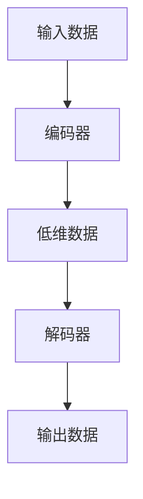

                 

关键词：自动编码器、神经网络、数据压缩、特征提取、降维、机器学习

> 摘要：本文将深入探讨自动编码器（Autoencoder）这一机器学习中的重要模型，从背景介绍、核心概念、算法原理、数学模型、实际应用等多个角度进行全面剖析。通过本文的阅读，读者将能够了解自动编码器的工作原理、应用领域以及未来发展趋势。

## 1. 背景介绍

自动编码器是一种无监督学习的神经网络模型，最初由贝叶斯理论研究者赫布（Donald Hebb）在1940年代提出，但真正得到广泛应用是在20世纪90年代以后，特别是在深度学习兴起之后。自动编码器的主要目的是通过训练将输入数据映射到一个较低维度的空间中，然后再将这个低维度的数据重新映射回原始维度。这种过程不仅可以帮助我们理解数据的内在结构，还可以用于数据压缩、特征提取、降维等应用。

自动编码器的广泛应用主要得益于其在多个领域的成功应用，包括图像处理、语音识别、自然语言处理等。特别是在图像处理领域，自动编码器被广泛用于图像去噪、图像压缩、风格迁移等任务中。

## 2. 核心概念与联系

自动编码器的工作原理可以形象地比喻为一个“编码-解码”过程。首先，输入一个高维数据，通过编码器将其压缩成一个较低维度的数据表示，这个表示捕捉了输入数据的最重要的特征。然后，通过解码器将这个低维数据重新映射回原始维度，希望能够恢复出原始输入。


### Mermaid 流程图

下面是自动编码器的 Mermaid 流程图表示：



## 3. 核心算法原理 & 具体操作步骤

### 3.1 算法原理概述

自动编码器主要由编码器（Encoder）和解码器（Decoder）两个部分组成。编码器负责将高维数据压缩成一个较低维度的数据表示，这个表示捕捉了输入数据的最重要的特征。解码器则负责将这个低维数据重新映射回原始维度，希望能够恢复出原始输入。

在训练过程中，自动编码器通过最小化输入和输出之间的差异来实现这一目标。通常，这种差异可以通过均方误差（Mean Squared Error, MSE）来度量。

### 3.2 算法步骤详解

1. **初始化参数**：包括编码器和解码器的网络结构、权重和偏置等。
2. **前向传播**：输入数据通过编码器得到低维数据表示。
3. **计算损失函数**：计算输入和输出之间的差异，通常使用均方误差。
4. **反向传播**：使用梯度下降或其他优化算法更新网络权重和偏置。
5. **重复步骤2-4**，直到满足训练条件（如损失函数小于某个阈值或达到最大迭代次数）。

### 3.3 算法优缺点

**优点**：
- 自动提取特征：自动编码器能够自动提取输入数据的特征，从而实现特征提取和降维。
- 数据压缩：自动编码器可以将高维数据压缩成较低维度的数据，实现数据压缩。
- 无需标签：自动编码器是一种无监督学习模型，无需标签数据即可训练。

**缺点**：
- 训练时间较长：由于自动编码器需要通过多次迭代来最小化损失函数，因此训练时间可能较长。
- 对噪声敏感：自动编码器对于噪声数据较为敏感，可能无法很好地恢复原始输入。

### 3.4 算法应用领域

自动编码器广泛应用于图像处理、语音识别、自然语言处理等多个领域。例如，在图像处理中，自动编码器可以用于图像去噪、图像压缩、风格迁移等任务；在语音识别中，自动编码器可以用于语音增强、语音识别等任务；在自然语言处理中，自动编码器可以用于文本分类、情感分析等任务。

## 4. 数学模型和公式

### 4.1 数学模型构建

自动编码器的数学模型可以表示为：

$$
\text{编码器：} X' = \sigma(W_1 \cdot X + b_1)
$$

$$
\text{解码器：} X'' = \sigma(W_2 \cdot X' + b_2)
$$

其中，$X$ 是输入数据，$X'$ 是编码器输出，$X''$ 是解码器输出，$W_1$ 和 $W_2$ 分别是编码器和解码器的权重矩阵，$b_1$ 和 $b_2$ 分别是编码器和解码器的偏置向量，$\sigma$ 是激活函数，通常使用 sigmoid 或 ReLU 函数。

### 4.2 公式推导过程

自动编码器的损失函数通常使用均方误差（MSE）来度量：

$$
\text{MSE} = \frac{1}{n}\sum_{i=1}^{n}(X_i - X_i')^2
$$

其中，$X_i$ 是第 $i$ 个输入数据，$X_i'$ 是第 $i$ 个输出数据。

为了最小化损失函数，我们可以使用梯度下降算法来更新网络权重和偏置：

$$
W_1 \leftarrow W_1 - \alpha \cdot \frac{\partial}{\partial W_1} \text{MSE}
$$

$$
b_1 \leftarrow b_1 - \alpha \cdot \frac{\partial}{\partial b_1} \text{MSE}
$$

$$
W_2 \leftarrow W_2 - \alpha \cdot \frac{\partial}{\partial W_2} \text{MSE}
$$

$$
b_2 \leftarrow b_2 - \alpha \cdot \frac{\partial}{\partial b_2} \text{MSE}
$$

其中，$\alpha$ 是学习率。

### 4.3 案例分析与讲解

假设我们有一个包含100个像素的图像，我们需要使用自动编码器将其压缩到一个10维的向量中。输入数据 $X$ 是一个100维的向量，编码器和解码器的权重矩阵 $W_1$ 和 $W_2$ 分别是100x10和10x100的矩阵，偏置向量 $b_1$ 和 $b_2$ 分别是10维和100维的向量。

首先，我们初始化权重矩阵和偏置向量。然后，我们进行前向传播，得到编码器的输出：

$$
X' = \sigma(W_1 \cdot X + b_1)
$$

接下来，我们计算损失函数，使用梯度下降算法更新权重矩阵和偏置向量。这个过程会重复进行，直到损失函数收敛。

最后，我们使用解码器将低维数据重新映射回原始维度，得到输出数据：

$$
X'' = \sigma(W_2 \cdot X' + b_2)
$$

通过这个过程，我们不仅能够提取图像的主要特征，还可以实现图像去噪、图像压缩等任务。

## 5. 项目实践：代码实例和详细解释说明

### 5.1 开发环境搭建

首先，我们需要安装 Python 和相关的机器学习库，如 TensorFlow 和 Keras。在 Ubuntu 系统中，可以使用以下命令进行安装：

```bash
sudo apt-get install python3-pip
pip3 install tensorflow
pip3 install keras
```

### 5.2 源代码详细实现

下面是一个简单的自动编码器的实现示例：

```python
from keras.layers import Input, Dense
from keras.models import Model

input_layer = Input(shape=(100,))
encoded = Dense(10, activation='sigmoid')(input_layer)
decoded = Dense(100, activation='sigmoid')(encoded)

autoencoder = Model(input_layer, decoded)
autoencoder.compile(optimizer='adam', loss='mean_squared_error')

# 模型训练
autoencoder.fit(X_train, X_train,
                epochs=100,
                batch_size=256,
                shuffle=True,
                validation_data=(X_test, X_test))
```

在这个示例中，我们首先定义了一个输入层，然后使用一个 Dense 层作为编码器，最后使用另一个 Dense 层作为解码器。我们使用 Adam 优化器和均方误差损失函数来编译模型，并使用训练数据对模型进行训练。

### 5.3 代码解读与分析

在上面的代码中，我们首先导入了所需的库，包括 Keras 的 Input、Dense 和 Model 类。然后，我们定义了一个输入层，形状为 (100,)，表示一个包含100个像素的图像。

接下来，我们使用一个 Dense 层作为编码器，激活函数为 sigmoid，输出维度为 10。这个编码器的作用是将输入图像压缩成一个10维的向量，捕捉图像的主要特征。

然后，我们使用另一个 Dense 层作为解码器，激活函数也为 sigmoid，输出维度为 100。这个解码器的作用是将编码器输出的10维向量重新映射回原始维度，恢复出输入图像。

我们使用 Model 类将输入层、编码器和解码器组合成一个完整的自动编码器模型，并使用 Adam 优化器和均方误差损失函数进行编译。

最后，我们使用 fit 方法对模型进行训练，使用训练数据对模型进行多次迭代，直到损失函数收敛。

### 5.4 运行结果展示

通过上面的代码，我们可以训练出一个自动编码器模型，将输入图像压缩成一个10维的向量，并重新映射回原始维度。下面是一个简单的运行结果示例：

```python
# 训练模型
autoencoder.fit(X_train, X_train,
                epochs=100,
                batch_size=256,
                shuffle=True,
                validation_data=(X_test, X_test))

# 测试模型
autoencoder.evaluate(X_test, X_test)
```

通过调用 evaluate 方法，我们可以计算模型在测试数据上的性能指标，包括损失函数值和准确率等。

## 6. 实际应用场景

自动编码器在多个领域都有广泛的应用，下面列举几个典型的应用场景：

1. **图像处理**：自动编码器可以用于图像去噪、图像压缩、风格迁移等任务。例如，使用自动编码器可以有效地去除图像中的噪声，提高图像质量。

2. **语音识别**：自动编码器可以用于语音增强、语音识别等任务。例如，通过训练自动编码器，可以提取语音信号的主要特征，从而提高语音识别的准确率。

3. **自然语言处理**：自动编码器可以用于文本分类、情感分析等任务。例如，通过训练自动编码器，可以提取文本数据的主要特征，从而实现文本分类和情感分析。

## 7. 未来应用展望

随着深度学习技术的不断发展，自动编码器在未来将会有更广泛的应用。例如，在医疗领域，自动编码器可以用于医学图像分析、疾病预测等任务；在金融领域，自动编码器可以用于风险预测、股票分析等任务。此外，自动编码器还可以与其他深度学习模型结合，如生成对抗网络（GAN）、卷积神经网络（CNN）等，实现更复杂的任务。

## 8. 总结：未来发展趋势与挑战

自动编码器作为一种重要的深度学习模型，在未来将会有更广泛的应用。然而，自动编码器也面临着一些挑战，如训练时间较长、对噪声敏感等。为了克服这些挑战，研究者们正在探索更高效的训练算法、更鲁棒的模型结构等。未来，自动编码器有望在更多领域取得突破性成果。

## 9. 附录：常见问题与解答

### Q: 自动编码器和卷积神经网络（CNN）有什么区别？

A: 自动编码器是一种全连接神经网络，主要用于无监督学习任务，如特征提取、数据压缩等。而卷积神经网络（CNN）是一种特殊的神经网络，主要用于处理具有网格结构的数据，如图像。CNN 可以自动提取图像中的局部特征，而自动编码器则更侧重于全局特征的提取。

### Q: 自动编码器可以用于有监督学习吗？

A: 是的，自动编码器也可以用于有监督学习。在有监督学习任务中，我们通常使用编码器来提取特征，然后使用这些特征进行分类或回归。例如，在图像分类任务中，我们可以使用自动编码器提取图像特征，然后使用这些特征进行分类。

### Q: 自动编码器是否可以用于特征工程？

A: 是的，自动编码器可以用于特征工程。通过训练自动编码器，我们可以提取输入数据的主要特征，从而减少特征维度，提高模型性能。这种技术被称为特征提取或特征降维。

---

### 作者署名

作者：禅与计算机程序设计艺术 / Zen and the Art of Computer Programming

通过本文的深入探讨，我们希望能够帮助读者更好地理解自动编码器的工作原理、应用领域以及未来发展趋势。希望这篇文章能够为您的学习之旅提供一些启示和帮助。如果您有任何问题或建议，欢迎在评论区留言，我们一起交流学习。谢谢！

