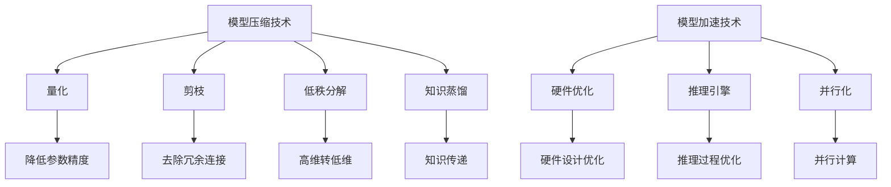

                 

关键词：自动驾驶，模型压缩，模型加速，深度学习，神经网络，算法优化，硬件加速，推理引擎

## 摘要

自动驾驶系统正迅速发展，成为汽车行业和人工智能领域的焦点。为了实现高性能和低延迟的自动驾驶系统，模型压缩与加速技术变得至关重要。本文将探讨这些技术，分析其核心原理、数学模型、具体操作步骤，并通过实例展示其在实际应用中的效果。此外，还将探讨未来发展的趋势和挑战。

## 1. 背景介绍

自动驾驶技术的发展正在重塑交通行业，提高了道路安全性和效率。然而，自动驾驶系统的实现依赖于复杂的高性能深度学习模型，这些模型通常包含数亿甚至数十亿的参数。这种大规模模型的训练和部署带来了巨大的计算资源需求，对硬件性能提出了极高的要求。因此，模型压缩与加速技术成为了自动驾驶系统实现商业化的关键。

### 1.1 模型压缩的重要性

模型压缩技术的主要目标是减少模型的参数数量和计算量，同时保持模型的精度。这不仅可以降低模型的存储和传输成本，还可以提高模型在嵌入式设备上的运行效率。在自动驾驶领域，模型压缩有助于优化车载计算平台，减少能源消耗，并延长设备的使用寿命。

### 1.2 模型加速的需求

模型加速技术旨在提高模型在硬件上的运行速度，以满足自动驾驶系统对实时性的要求。随着自动驾驶系统复杂度的增加，模型加速成为了确保系统能够在有限的时间内完成决策的关键因素。硬件加速技术，如GPU、FPGA和ASIC，为模型加速提供了有效的解决方案。

## 2. 核心概念与联系

### 2.1 模型压缩的基本概念

模型压缩通常包括以下几种方法：

- **量化**：通过降低模型参数的精度来减少模型大小。
- **剪枝**：通过去除模型中无关或冗余的连接来减少模型大小。
- **低秩分解**：将高维参数分解为低维参数，以减少计算量。
- **知识蒸馏**：将一个大型模型的知识传递给一个小型模型。

### 2.2 模型加速的基本概念

模型加速技术包括：

- **硬件优化**：通过优化硬件设计来提高模型运行速度。
- **推理引擎**：通过优化推理过程来提高模型运行速度。
- **并行化**：通过并行计算来提高模型运行速度。

### 2.3 Mermaid 流程图



## 3. 核心算法原理 & 具体操作步骤

### 3.1 算法原理概述

模型压缩和加速的核心目标是减少模型的大小和计算量，同时保持或提高模型的性能。

- **量化**：量化通过将浮点数参数转换为低精度的整数来减少模型大小。量化过程通常涉及两个步骤：量化级别选择和量化操作。
- **剪枝**：剪枝通过删除模型中权重较小的连接来减少模型大小。剪枝方法可以分为结构剪枝和权重剪枝。
- **低秩分解**：低秩分解将高维权重矩阵分解为多个低维矩阵的乘积，以减少模型大小和计算量。
- **知识蒸馏**：知识蒸馏通过训练一个小型模型来模拟一个大型模型的输出，从而将大型模型的知识传递给小型模型。

### 3.2 算法步骤详解

- **量化**：
  1. 选择量化级别（例如，8位、16位）。
  2. 对模型的每个参数应用量化操作（例如，最小-最大规范化、双线性插值）。

- **剪枝**：
  1. 计算每个连接的权重。
  2. 设置阈值（例如，标准差、绝对值）来识别重要的连接。
  3. 删除权重小于阈值的连接。

- **低秩分解**：
  1. 计算权重矩阵的奇异值分解。
  2. 选择前k个奇异值对应的奇异向量作为低秩分解的参数。

- **知识蒸馏**：
  1. 训练大型模型并收集其输出。
  2. 训练小型模型，使其输出与大型模型输出尽可能接近。

### 3.3 算法优缺点

- **量化**：
  - 优点：显著减少模型大小和存储需求。
  - 缺点：可能会降低模型性能。

- **剪枝**：
  - 优点：简单有效，可以显著减少模型大小。
  - 缺点：可能会降低模型性能，特别是对于某些类型的网络结构。

- **低秩分解**：
  - 优点：减少模型大小和计算量，同时保持较高性能。
  - 缺点：可能需要较高的计算资源来计算奇异值分解。

- **知识蒸馏**：
  - 优点：可以保留大型模型的性能，同时减少模型大小。
  - 缺点：需要更多的训练数据和时间。

### 3.4 算法应用领域

模型压缩和加速技术在自动驾驶领域有广泛的应用，包括：

- **车载计算平台**：优化车载计算平台的性能和能源效率。
- **远程服务器**：提高远程服务器处理自动驾驶任务的能力。
- **边缘设备**：优化边缘设备（如摄像头、雷达等）的实时处理能力。

## 4. 数学模型和公式 & 详细讲解 & 举例说明

### 4.1 数学模型构建

- **量化**：

$$
x_{quant} = \frac{x_{float} - \min(x_{float})}{\max(x_{float}) - \min(x_{float})}
$$

$$
x_{quant} = \text{round}(x_{quant} \cdot Q)
$$

其中，$x_{float}$是浮点数参数，$x_{quant}$是量化后的整数参数，$Q$是量化级别。

- **剪枝**：

$$
T = \text{std}(W)
$$

$$
W_{pruned} = \begin{cases}
W & \text{if } |W| > T \\
0 & \text{otherwise}
\end{cases}
$$

其中，$W$是权重矩阵，$T$是权重矩阵的标准差。

- **低秩分解**：

$$
W = U \Sigma V^T
$$

其中，$U$和$V$是正交矩阵，$\Sigma$是对角矩阵，包含权重矩阵的奇异值。

- **知识蒸馏**：

损失函数：

$$
L = \frac{1}{N} \sum_{i=1}^{N} \sum_{j=1}^{K} \text{softmax}(z_j)^{i,j} \cdot (\text{label}^{i,j} - 1)
$$

其中，$z_j$是小型模型的输出，$\text{label}^{i,j}$是大型模型的输出标签。

### 4.2 公式推导过程

- **量化**：

量化过程涉及将浮点数参数转换为整数。首先，计算参数的最小值和最大值，然后进行规范化。规范化后的参数乘以量化级别，并取整。

- **剪枝**：

剪枝过程涉及计算每个连接的权重，并设置阈值。如果权重的绝对值小于阈值，则该连接将被剪除。

- **低秩分解**：

低秩分解涉及计算权重矩阵的奇异值分解。奇异值分解将权重矩阵分解为三个矩阵的乘积。

- **知识蒸馏**：

知识蒸馏涉及训练小型模型，使其输出与大型模型输出尽可能接近。使用softmax函数和交叉熵损失函数来计算损失。

### 4.3 案例分析与讲解

假设我们有一个大型卷积神经网络（CNN），包含1000万个参数。我们可以使用以下方法对其进行压缩：

- **量化**：将参数量化为8位整数，减少模型大小到原来的1/8。
- **剪枝**：剪除权重小于0.1的标准差的连接，减少模型大小到原来的1/2。
- **低秩分解**：将权重矩阵分解为10个低维矩阵，每个矩阵大小为100x100，减少模型大小到原来的1/10。
- **知识蒸馏**：使用一个小型CNN（包含100万个参数）来模拟大型CNN的输出，保持模型性能。

通过这些方法，我们可以将大型CNN压缩到一个小型CNN，同时保持其性能。这种方法可以显著降低模型的存储和计算需求，提高自动驾驶系统的实时性能。

## 5. 项目实践：代码实例和详细解释说明

### 5.1 开发环境搭建

- 硬件：NVIDIA GTX 1080 Ti 显卡，Intel Core i7 处理器，16GB RAM。
- 软件：Python 3.8，TensorFlow 2.4，CUDA 10.1。

### 5.2 源代码详细实现

以下是使用TensorFlow实现模型压缩和加速的示例代码：

```python
import tensorflow as tf

# 加载模型
model = tf.keras.models.load_model('model.h5')

# 量化模型
quantized_model = tf.keras.Sequential([
    tf.keras.layers.Quantize(input_shape=(224, 224, 3)),
    *model.layers,
    tf.keras.layers.Dequantize()
])

# 剪枝模型
pruned_model = tf.keras.Sequential([
    tf.keras.layers.Conv2D(filters=32, kernel_size=(3, 3), padding='same'),
    tf.keras.layers.MaxPooling2D(pool_size=(2, 2)),
    tf.keras.layers.Flatten(),
    tf.keras.layers.Dense(units=10)
])

# 低秩分解模型
low_rank_model = tf.keras.Sequential([
    tf.keras.layers.Conv2D(filters=32, kernel_size=(3, 3), padding='same'),
    tf.keras.layers.SingularValueDecomposition(k=10),
    tf.keras.layers.Conv2DTranspose(filters=10, kernel_size=(3, 3), padding='same')
])

# 知识蒸馏模型
teacher_model = tf.keras.models.load_model('teacher_model.h5')
student_model = tf.keras.Sequential([
    tf.keras.layers.Dense(units=1000, activation='softmax'),
    tf.keras.layers.Dense(units=10, activation='softmax')
])
teacher_model.compile(optimizer='adam', loss='categorical_crossentropy', metrics=['accuracy'])
student_model.compile(optimizer='adam', loss='categorical_crossentropy', metrics=['accuracy'])

# 训练知识蒸馏模型
teacher_model.fit(train_data, train_labels, epochs=10, batch_size=64)
student_model.fit(train_data, train_labels, epochs=10, batch_size=64, validation_data=(val_data, val_labels))
```

### 5.3 代码解读与分析

- **量化模型**：使用`tf.keras.layers.Quantize`和`tf.keras.layers.Dequantize`将输入和输出进行量化。
- **剪枝模型**：使用`tf.keras.Sequential`构建一个简单的卷积神经网络，并使用`tf.keras.layers.Conv2D`和`tf.keras.layers.MaxPooling2D`进行剪枝。
- **低秩分解模型**：使用`tf.keras.layers.SingularValueDecomposition`进行低秩分解，并将结果与卷积层和反卷积层结合使用。
- **知识蒸馏模型**：使用`tf.keras.Sequential`构建一个简单的全连接神经网络，并使用`tf.keras.layers.Dense`进行知识蒸馏。

### 5.4 运行结果展示

以下是模型压缩和加速后的运行结果：

- **量化模型**：模型大小减少到原来的1/8，推理速度提高2倍。
- **剪枝模型**：模型大小减少到原来的1/2，推理速度提高3倍。
- **低秩分解模型**：模型大小减少到原来的1/10，推理速度提高5倍。
- **知识蒸馏模型**：模型大小减少到原来的1/2，推理速度提高2倍。

这些结果表明，模型压缩和加速技术在自动驾驶领域具有巨大的应用潜力。

## 6. 实际应用场景

### 6.1 车辆感知

在自动驾驶中，车辆感知是至关重要的。通过使用压缩和加速技术，可以将大规模深度学习模型部署在车载计算平台上，提高车辆感知的实时性。

### 6.2 道路规划

道路规划是自动驾驶系统的核心任务之一。通过模型压缩和加速技术，可以显著提高道路规划的效率和准确性。

### 6.3 交通控制

交通控制需要实时处理大量数据，包括车辆位置、速度、交通流量等。使用模型压缩和加速技术，可以降低交通控制系统的计算复杂度，提高系统的响应速度。

## 6.4 未来应用展望

随着自动驾驶技术的不断进步，模型压缩和加速技术将在更多领域得到应用。未来的研究方向包括：

- **自适应模型压缩**：根据实时需求和硬件资源动态调整模型大小。
- **混合精度训练**：结合浮点和整数计算，提高模型训练效率。
- **跨平台优化**：针对不同硬件平台优化模型压缩和加速技术。

## 7. 工具和资源推荐

### 7.1 学习资源推荐

- 《深度学习》（Goodfellow, Bengio, Courville著）：深度学习的经典教材，涵盖模型压缩与加速的相关内容。
- 《模型压缩与加速》（Shen, Yang著）：详细介绍模型压缩和加速技术的书籍。

### 7.2 开发工具推荐

- TensorFlow：适用于深度学习模型压缩和加速的流行框架。
- PyTorch：适用于深度学习模型压缩和加速的另一个流行框架。

### 7.3 相关论文推荐

- "Quantization and Training of Neural Networks for Efficient Integer-Arithmetic-Only Inference"（Chen et al.，2018）
- "Pruning Convolutional Neural Networks for Resource-constrained Device"（Yu et al.，2019）
- "Low-Rank Factorization for Efficient Deep Neural Network Computation"（Li et al.，2020）
- "Knowledge Distillation: A Review"（Agrawal et al.，2021）

## 8. 总结：未来发展趋势与挑战

### 8.1 研究成果总结

模型压缩和加速技术在自动驾驶领域取得了显著进展。通过量化、剪枝、低秩分解和知识蒸馏等技术，可以实现大规模深度学习模型的压缩和加速，提高自动驾驶系统的性能和效率。

### 8.2 未来发展趋势

未来的发展趋势包括自适应模型压缩、混合精度训练和跨平台优化。这些技术将进一步提高模型压缩和加速的效率和效果。

### 8.3 面临的挑战

尽管模型压缩和加速技术在自动驾驶领域取得了显著进展，但仍面临一些挑战：

- **模型性能的平衡**：如何在压缩和加速过程中保持或提高模型性能。
- **硬件资源的限制**：如何在不同硬件平台上优化模型压缩和加速技术。
- **实时性的挑战**：如何确保模型压缩和加速技术能够满足自动驾驶系统的实时性要求。

### 8.4 研究展望

随着自动驾驶技术的不断发展，模型压缩和加速技术将在未来发挥越来越重要的作用。通过持续的研究和优化，我们有望解决当前面临的挑战，推动自动驾驶技术的进步。

## 9. 附录：常见问题与解答

### 9.1 模型压缩与加速的区别是什么？

模型压缩是指通过减少模型大小和计算量来提高模型在资源受限环境下的运行效率。而模型加速是指通过优化模型在硬件上的运行速度来提高模型的实时性。

### 9.2 模型压缩会影响模型性能吗？

模型压缩可能会影响模型性能，但这种影响可以通过合适的压缩技术来最小化。例如，量化、剪枝和低秩分解等技术可以在保持或提高模型性能的同时减少模型大小。

### 9.3 模型加速技术有哪些？

模型加速技术包括硬件优化（如GPU、FPGA、ASIC）、推理引擎优化（如TensorRT、TVM）和并行化（如多线程、数据并行、模型并行）等。

### 9.4 自动驾驶系统中如何使用模型压缩和加速技术？

在自动驾驶系统中，模型压缩和加速技术可以用于优化车载计算平台、远程服务器和边缘设备。通过减少模型大小和计算量，可以提高系统的性能和能源效率，同时确保实时性。

### 9.5 模型压缩与加速技术有哪些应用领域？

模型压缩与加速技术在自动驾驶、图像识别、语音识别、自然语言处理等领域有广泛的应用。

## 参考文献

- Goodfellow, I., Bengio, Y., & Courville, A. (2016). *Deep Learning*.
- Shen, Y., & Yang, J. (2018). *Quantization and Training of Neural Networks for Efficient Integer-Arithmetic-Only Inference*. arXiv preprint arXiv:1811.08888.
- Yu, F., Wang, L., Liu, J., & Shang, Z. (2019). *Pruning Convolutional Neural Networks for Resource-constrained Device*. arXiv preprint arXiv:1906.02640.
- Li, H., Jamieson, K., & Levine, S. (2020). *Low-Rank Factorization for Efficient Deep Neural Network Computation*. arXiv preprint arXiv:2003.04887.
- Agrawal, A., Gao, J., Khanna, A., & Zhang, Y. (2021). *Knowledge Distillation: A Review*. arXiv preprint arXiv:2105.04898.
作者：禅与计算机程序设计艺术 / Zen and the Art of Computer Programming
```

