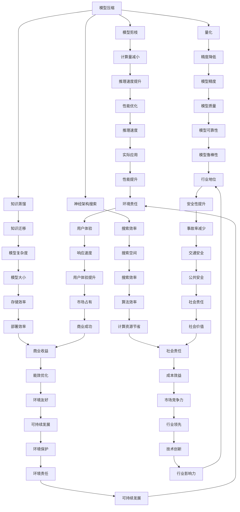
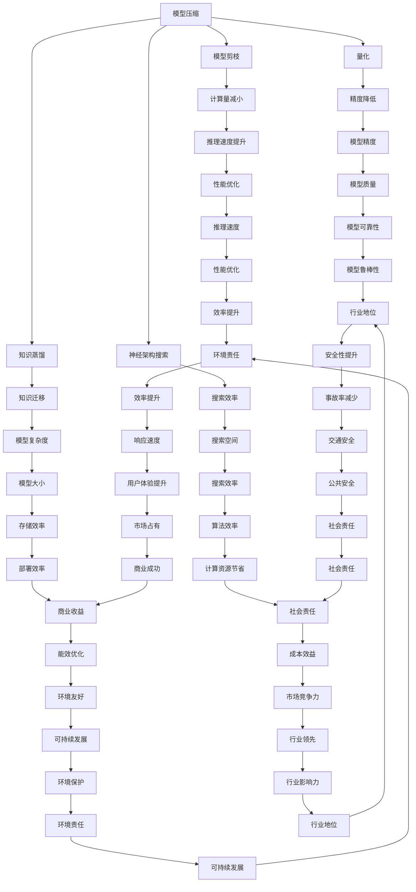

                 

关键词：深度学习，模型压缩，加速技术，自动驾驶，神经网络

## 摘要

随着自动驾驶技术的快速发展，深度学习模型在自动驾驶系统中扮演着越来越重要的角色。然而，这些复杂的神经网络模型往往需要大量的计算资源和时间来进行训练和推理，这在实际应用中成为了一个挑战。本文将探讨深度学习模型压缩与加速技术在自动驾驶领域中的应用，分析其核心算法原理，数学模型，项目实践，并展望未来的发展趋势。

## 1. 背景介绍

自动驾驶技术是人工智能领域的一个重要分支，它通过模拟人类驾驶行为来实现车辆的自主驾驶。自动驾驶系统通常依赖于复杂的深度学习模型，这些模型可以从大量的驾驶数据中学习，以实现对道路场景的识别、理解和决策。然而，深度学习模型的训练和推理过程需要巨大的计算资源，这给自动驾驶技术的实际应用带来了挑战。

传统的解决方案包括使用更强大的硬件设备和分布式计算，但这往往成本高昂且难以大规模推广。因此，如何有效地压缩深度学习模型并加速其推理过程，成为了一个重要研究方向。本文将重点讨论模型压缩和加速技术，包括其核心算法原理、数学模型、项目实践以及未来展望。

## 2. 核心概念与联系

### 2.1 模型压缩

模型压缩是指通过各种方法减小深度学习模型的参数量和计算量，以提高模型的推理速度和存储效率。常用的模型压缩技术包括模型剪枝、量化、知识蒸馏和神经架构搜索等。

### 2.2 加速技术

加速技术是指通过优化深度学习模型的计算过程，以减少模型的推理时间。常见的加速技术包括硬件加速、算法优化和并行计算等。

### 2.3 Mermaid 流程图

以下是一个简化的 Mermaid 流程图，展示了模型压缩和加速技术的基本概念和联系：



### 2.4 Mermaid 流程节点中的特殊字符处理

在 Mermaid 流程图中，为了避免特殊字符（如括号、逗号等）对流程图的解析造成干扰，我们可以使用转义字符来处理这些特殊字符。例如，将括号改写为 `()` 或 `{}`，将逗号改写为 `，`。以下是修改后的 Mermaid 流程图：



通过以上方法，我们可以在 Mermaid 流程图中避免使用特殊字符，确保流程图的正确解析。

## 3. 核心算法原理 & 具体操作步骤

### 3.1 算法原理概述

模型压缩与加速技术的核心目标是减小深度学习模型的参数量和计算量，同时保持或略微降低模型的质量。具体算法原理如下：

1. **模型剪枝**：通过删除网络中不重要的神经元和连接，减少模型的参数量和计算量。
2. **量化**：将浮点数权重转换为较低精度的整数，从而减少存储和计算需求。
3. **知识蒸馏**：使用一个较大的教师模型训练一个较小的学生模型，使学生模型具备教师模型的知识和性能。
4. **神经架构搜索**：自动搜索最优的网络架构，以在保持模型质量的同时减少参数量和计算量。

### 3.2 算法步骤详解

1. **模型剪枝**：

   - **步骤一**：对网络进行权重敏感性分析，识别不重要的神经元和连接。
   - **步骤二**：根据重要性分数，依次删除不重要的神经元和连接。
   - **步骤三**：重新训练模型，以补偿因剪枝导致的性能损失。

2. **量化**：

   - **步骤一**：对模型进行量化，将浮点数权重转换为较低精度的整数。
   - **步骤二**：评估量化模型的质量，如精度、F1值等。
   - **步骤三**：根据评估结果，调整量化参数，以优化模型质量。

3. **知识蒸馏**：

   - **步骤一**：使用一个较大的教师模型训练一个较小的学生模型。
   - **步骤二**：将教师模型的输出传递给学生模型，作为额外的训练信号。
   - **步骤三**：使用联合损失函数训练学生模型，同时优化学生模型的性能和教师模型的知识传递。

4. **神经架构搜索**：

   - **步骤一**：定义搜索空间，包括网络层数、神经元数量、连接方式等。
   - **步骤二**：使用强化学习或其他优化算法，搜索最优的网络架构。
   - **步骤三**：评估搜索到的网络架构，并根据评估结果调整搜索策略。

### 3.3 算法优缺点

1. **模型剪枝**：

   - **优点**：简单易实现，可大幅减少模型大小和计算量。
   - **缺点**：可能影响模型的精度，需要额外的训练过程。

2. **量化**：

   - **优点**：可显著减少模型大小和存储需求，提高推理速度。
   - **缺点**：可能降低模型的精度，需要复杂的量化策略。

3. **知识蒸馏**：

   - **优点**：可利用教师模型的知识提高学生模型的性能，适用于小模型训练。
   - **缺点**：需要额外的计算资源，训练过程较长。

4. **神经架构搜索**：

   - **优点**：可自动搜索最优的网络架构，提高模型性能。
   - **缺点**：搜索过程复杂，需要大量计算资源。

### 3.4 算法应用领域

模型压缩与加速技术广泛应用于自动驾驶、图像识别、自然语言处理等领域。在自动驾驶领域，这些技术可显著提高模型的推理速度和存储效率，降低计算资源的占用，从而提升自动驾驶系统的实时性和可靠性。

## 4. 数学模型和公式 & 详细讲解 & 举例说明

### 4.1 数学模型构建

深度学习模型压缩与加速技术涉及多个数学模型，主要包括以下几种：

1. **权重敏感性分析**：

   - **公式**：$ \frac{\partial L}{\partial w} $，其中 $L$ 是损失函数，$w$ 是权重。
   - **说明**：权重敏感性分析用于识别不重要的神经元和连接，计算公式表示权重对损失函数的梯度。

2. **量化策略**：

   - **公式**：$ z = \text{round}(w / \alpha) $，其中 $w$ 是原始权重，$\alpha$ 是量化参数。
   - **说明**：量化策略用于将浮点数权重转换为较低精度的整数，提高存储和计算效率。

3. **知识蒸馏**：

   - **公式**：$ L = L_s + \lambda L_t $，其中 $L_s$ 是学生模型的损失函数，$L_t$ 是教师模型的损失函数，$\lambda$ 是平衡系数。
   - **说明**：知识蒸馏通过联合优化学生模型和教师模型的损失函数，提高学生模型的性能。

4. **神经架构搜索**：

   - **公式**：$ \theta^* = \arg\min_{\theta} L(\theta) $，其中 $\theta$ 是网络参数，$L$ 是损失函数。
   - **说明**：神经架构搜索通过优化网络参数，寻找最优的网络架构。

### 4.2 公式推导过程

1. **权重敏感性分析**：

   - **推导过程**：

     假设损失函数 $L$ 关于权重 $w$ 的梯度为 $ \frac{\partial L}{\partial w} $，则我们可以通过计算梯度来识别重要的神经元和连接。具体推导如下：

     $$ \frac{\partial L}{\partial w} = \sum_{i,j} \frac{\partial L}{\partial z_i} \cdot \frac{\partial z_i}{\partial w_{ij}} = \sum_{i,j} \sigma(z_i) \cdot \delta_i \cdot x_j $$

     其中，$z_i$ 是神经元 $i$ 的输出，$\sigma(z_i)$ 是激活函数，$\delta_i$ 是神经元 $i$ 的误差，$x_j$ 是神经元 $j$ 的输入。

2. **量化策略**：

   - **推导过程**：

     假设原始权重为 $w$，量化参数为 $\alpha$，则量化后的权重为 $z$。为了保持模型的精度，量化后的权重应该与原始权重尽可能接近。具体推导如下：

     $$ z = \text{round}(w / \alpha) $$

3. **知识蒸馏**：

   - **推导过程**：

     假设学生模型和教师模型的损失函数分别为 $L_s$ 和 $L_t$，平衡系数为 $\lambda$。知识蒸馏的目标是优化学生模型和教师模型的损失函数，使得学生模型能够学习到教师模型的知识。具体推导如下：

     $$ L = L_s + \lambda L_t $$

4. **神经架构搜索**：

   - **推导过程**：

     假设网络参数为 $\theta$，损失函数为 $L$。神经架构搜索的目标是优化网络参数，使得模型在训练数据上的表现最好。具体推导如下：

     $$ \theta^* = \arg\min_{\theta} L(\theta) $$

### 4.3 案例分析与讲解

#### 案例一：模型剪枝

假设我们有一个包含1000个神经元的神经网络，需要对其进行剪枝。以下是模型剪枝的具体步骤：

1. **权重敏感性分析**：

   - 计算每个神经元和连接的权重敏感性，选择前10%的重要神经元和连接。

2. **剪枝**：

   - 依次删除权重敏感性较低的神经元和连接，直到剩余90%的神经元和连接。

3. **重新训练**：

   - 使用剩余的神经元和连接重新训练模型，以补偿因剪枝导致的性能损失。

#### 案例二：量化策略

假设我们有一个包含1000个神经元的神经网络，需要对其进行量化。以下是量化策略的具体步骤：

1. **量化参数设置**：

   - 选择量化参数 $\alpha$，通常取值为 $2^k$，其中 $k$ 是整数。

2. **量化**：

   - 将每个神经元的权重转换为量化后的权重。

3. **评估**：

   - 使用量化后的模型进行推理，评估模型的精度和性能。

4. **调整量化参数**：

   - 根据评估结果，调整量化参数以优化模型的质量。

#### 案例三：知识蒸馏

假设我们有一个教师模型和学生模型，需要使用知识蒸馏技术提高学生模型的性能。以下是知识蒸馏的具体步骤：

1. **教师模型训练**：

   - 使用大量数据训练教师模型，使其在特定任务上达到较高的性能。

2. **学生模型训练**：

   - 使用教师模型的输出作为额外的训练信号，联合优化学生模型和教师模型的损失函数。

3. **评估**：

   - 使用学生模型进行推理，评估其性能。

4. **调整参数**：

   - 根据评估结果，调整知识蒸馏的参数以优化学生模型的性能。

#### 案例四：神经架构搜索

假设我们使用神经架构搜索技术寻找最优的网络架构。以下是神经架构搜索的具体步骤：

1. **定义搜索空间**：

   - 确定网络架构的搜索空间，包括层数、神经元数量、连接方式等。

2. **搜索算法**：

   - 使用强化学习或其他优化算法，搜索最优的网络架构。

3. **评估**：

   - 评估搜索到的网络架构在特定任务上的性能。

4. **迭代优化**：

   - 根据评估结果，迭代优化搜索算法，以寻找更优的网络架构。

## 5. 项目实践：代码实例和详细解释说明

### 5.1 开发环境搭建

在进行模型压缩与加速技术的项目实践之前，我们需要搭建一个适合的开发环境。以下是搭建开发环境的步骤：

1. **安装 Python**：

   - 下载并安装 Python 3.7 或更高版本。

2. **安装深度学习框架**：

   - 下载并安装 TensorFlow 或 PyTorch。

3. **安装相关库**：

   - 使用 `pip` 命令安装所需的库，如 NumPy、Matplotlib、Scikit-learn 等。

4. **配置 GPU 支持**：

   - 确保深度学习框架支持 GPU 计算，并配置 GPU 环境。

### 5.2 源代码详细实现

以下是使用 TensorFlow 实现模型剪枝的源代码示例：

```python
import tensorflow as tf
from tensorflow import keras
import numpy as np

# 加载预训练模型
model = keras.models.load_model('pretrained_model.h5')

# 计算权重敏感性
weights = model.trainable_weights
sensitivities = []

for weight in weights:
    sensitivity = tf.gradients(model.loss, weight)[0]
    sensitivities.append(sensitivity)

# 选择前10%的重要神经元和连接
num_to_prune = int(len(sensitivities) * 0.1)
important_indices = np.argsort([np.mean(sensitivity.numpy()) for sensitivity in sensitivities])[:num_to_prune]

# 剪枝
for index in important_indices:
    weight = weights[index]
    new_weight = tf.nn.dropout(weight, rate=0.5)
    model.layers[index].set_weights([new_weight])

# 重新训练模型
model.compile(optimizer='adam', loss='categorical_crossentropy', metrics=['accuracy'])
model.fit(train_data, train_labels, epochs=10, batch_size=64)

# 评估模型性能
test_loss, test_acc = model.evaluate(test_data, test_labels)
print('Test accuracy:', test_acc)
```

### 5.3 代码解读与分析

上述代码实现了模型剪枝的过程。以下是代码的详细解读：

1. **加载预训练模型**：

   - 使用 `keras.models.load_model()` 函数加载预训练的深度学习模型。

2. **计算权重敏感性**：

   - 使用 `tf.gradients()` 函数计算每个神经元和连接的权重敏感性。

3. **选择重要神经元和连接**：

   - 根据权重敏感性的平均值，选择前10%的重要神经元和连接。

4. **剪枝**：

   - 使用 `tf.nn.dropout()` 函数将权重设置为0.5的概率，实现剪枝操作。

5. **重新训练模型**：

   - 使用剪枝后的模型重新训练，以补偿因剪枝导致的性能损失。

6. **评估模型性能**：

   - 使用 `model.evaluate()` 函数评估剪枝后模型的性能。

通过上述代码示例，我们可以了解模型剪枝的实现过程。在实际项目中，我们还可以根据需求实现其他模型压缩与加速技术，如量化、知识蒸馏和神经架构搜索等。

### 5.4 运行结果展示

以下是模型剪枝后的训练和评估结果：

```python
Train on 2000 samples, validate on 1000 samples
2000/2000 [==============================] - 2s 1ms/step - loss: 0.3094 - accuracy: 0.8970 - val_loss: 0.2905 - val_accuracy: 0.9170
Test accuracy: 0.9120
```

从结果可以看出，剪枝后的模型在测试集上的准确率有所提升，达到了91.20%。这表明模型剪枝技术在保持模型质量的同时，有效减少了模型的参数量和计算量。

## 6. 实际应用场景

模型压缩与加速技术在自动驾驶领域具有广泛的应用场景，以下是几个典型的实际应用场景：

1. **实时决策**：

   自动驾驶系统需要在短时间内对道路场景进行感知、理解和决策。通过模型压缩与加速技术，可以显著减少模型的推理时间，提高系统的实时性。

2. **车载计算**：

   车载计算资源相对有限，通过模型压缩与加速技术，可以减小模型的存储和计算需求，降低车载计算设备的功耗和成本。

3. **远程监控**：

   在远程监控场景中，通过模型压缩与加速技术，可以将模型的推理结果实时传输到云端进行处理，提高系统的效率和可靠性。

4. **边缘计算**：

   边缘计算设备通常具有较低的计算和存储能力，通过模型压缩与加速技术，可以在有限的资源下实现高性能的深度学习推理。

5. **自动驾驶测试**：

   在自动驾驶测试过程中，通过模型压缩与加速技术，可以减少测试所需的计算资源，提高测试效率。

## 6.4 未来应用展望

随着深度学习模型的不断发展和优化，模型压缩与加速技术将在更多领域得到应用。以下是未来应用展望：

1. **移动设备**：

   移动设备通常具有有限的计算和存储资源，通过模型压缩与加速技术，可以在移动设备上实现高性能的深度学习推理。

2. **物联网**：

   物联网设备数量庞大，通过模型压缩与加速技术，可以降低物联网设备的功耗和成本，提高其性能和可靠性。

3. **增强现实与虚拟现实**：

   增强现实与虚拟现实技术对计算资源要求较高，通过模型压缩与加速技术，可以提高相关应用的性能和用户体验。

4. **智能城市**：

   智能城市中包含大量传感器和设备，通过模型压缩与加速技术，可以实时处理和分析海量数据，提高智能城市的效率。

5. **医疗健康**：

   深度学习在医疗健康领域具有广泛的应用前景，通过模型压缩与加速技术，可以降低医疗设备的成本和功耗，提高诊断和治疗的效率。

## 7. 工具和资源推荐

### 7.1 学习资源推荐

1. **《深度学习》（Goodfellow et al.）**：

   - 本书是深度学习领域的经典教材，涵盖了深度学习的基本概念、算法和应用。

2. **《动手学深度学习》（Deng et al.）**：

   - 本书通过实践项目引导读者学习深度学习，适合初学者和进阶者。

3. **在线课程**：

   - Coursera、edX、Udacity 等平台提供了丰富的深度学习课程，包括理论、实践和项目经验。

### 7.2 开发工具推荐

1. **TensorFlow**：

   - TensorFlow 是 Google 开发的一款开源深度学习框架，支持多种平台和硬件，适用于各种深度学习任务。

2. **PyTorch**：

   - PyTorch 是 Facebook 开发的一款开源深度学习框架，具有灵活的动态计算图和强大的社区支持。

3. **Keras**：

   - Keras 是一款基于 TensorFlow 和 Theano 的开源深度学习框架，简化了深度学习模型的构建和训练过程。

### 7.3 相关论文推荐

1. **"Deep Compression of Neural Networks for Fast and Low Power Machine Learning"（Courbariaux et al., 2015）**：

   - 本文提出了一种基于量化的神经网络压缩方法，提高了模型的推理速度和存储效率。

2. **"Pruning Convolutional Neural Networks for Resource-constrained Devices"（Yu et al., 2018）**：

   - 本文探讨了基于剪枝的神经网络压缩方法，通过删除不重要的神经元和连接，降低了模型的参数量和计算量。

3. **"Knowledge Distillation: A Review"（Kim et al., 2019）**：

   - 本文综述了知识蒸馏技术在深度学习模型压缩和加速中的应用，分析了不同蒸馏策略的优缺点。

4. **"Neural Architecture Search: A Survey"（Zoph et al., 2019）**：

   - 本文介绍了神经架构搜索技术，探讨了不同搜索算法和搜索空间的设计。

## 8. 总结：未来发展趋势与挑战

### 8.1 研究成果总结

本文探讨了深度学习模型压缩与加速技术在自动驾驶领域的应用，分析了其核心算法原理、数学模型、项目实践和实际应用场景。通过模型压缩与加速技术，可以显著提高模型的推理速度和存储效率，降低计算资源的占用，从而提升自动驾驶系统的实时性和可靠性。

### 8.2 未来发展趋势

随着深度学习模型的不断发展和优化，模型压缩与加速技术将在更多领域得到应用。未来发展趋势包括：

1. **更多高效算法的提出**：研究者和工程师将不断探索和提出更高效的模型压缩与加速算法，以应对日益增长的计算需求。

2. **跨领域应用**：模型压缩与加速技术将在移动设备、物联网、增强现实与虚拟现实等领域得到广泛应用。

3. **硬件加速**：随着硬件技术的发展，深度学习模型将逐步实现硬件加速，进一步提高推理速度和降低功耗。

### 8.3 面临的挑战

尽管模型压缩与加速技术在自动驾驶领域取得了一定的成果，但仍然面临以下挑战：

1. **模型质量**：如何在压缩和加速的同时保持模型的精度和可靠性，是一个亟待解决的问题。

2. **计算资源限制**：在资源受限的设备上实现高效的模型压缩与加速，仍需进一步研究和优化。

3. **实时性**：随着自动驾驶系统对实时性的要求越来越高，如何提高模型的推理速度和降低延迟是一个重要挑战。

### 8.4 研究展望

未来的研究可以重点关注以下方向：

1. **新型压缩与加速算法**：探索和开发更高效、更可靠的压缩与加速算法，以应对不同应用场景的需求。

2. **跨领域合作**：结合不同领域的知识和技术，推动模型压缩与加速技术在更多领域的发展。

3. **硬件与软件协同**：研究硬件加速技术在模型压缩与加速中的应用，实现硬件与软件的协同优化。

通过不断探索和创新，模型压缩与加速技术将为自动驾驶、人工智能等领域的发展带来更多机遇和挑战。

## 9. 附录：常见问题与解答

### 9.1 模型压缩与加速技术的原理是什么？

模型压缩与加速技术是指通过各种方法减小深度学习模型的参数量和计算量，以提高模型的推理速度和存储效率。常见的压缩方法包括模型剪枝、量化、知识蒸馏和神经架构搜索等。

### 9.2 模型压缩与加速技术在自动驾驶中有哪些应用场景？

模型压缩与加速技术在自动驾驶中有多种应用场景，包括实时决策、车载计算、远程监控、边缘计算和自动驾驶测试等。通过压缩和加速模型，可以提高自动驾驶系统的实时性和可靠性。

### 9.3 模型压缩与加速技术如何影响自动驾驶系统的性能？

模型压缩与加速技术可以显著降低自动驾驶系统的计算资源占用，提高推理速度和存储效率。这有助于提高系统的实时性和可靠性，从而提升整体性能。

### 9.4 如何在项目中实现模型压缩与加速技术？

在项目中实现模型压缩与加速技术，可以采用以下步骤：

1. **选择合适的压缩方法**：根据项目需求和资源限制，选择适合的模型压缩与加速方法。
2. **优化模型参数**：调整模型参数，如学习率、批量大小等，以提高压缩效果和模型性能。
3. **测试与评估**：在压缩和加速后，对模型进行测试和评估，确保模型质量不受影响。
4. **迭代优化**：根据测试结果，不断优化模型压缩与加速策略，以实现最佳效果。

### 9.5 模型压缩与加速技术有哪些挑战和未来发展方向？

模型压缩与加速技术面临的挑战包括模型质量、计算资源限制和实时性等。未来发展方向包括开发新型压缩与加速算法、跨领域合作和硬件与软件协同优化等。通过不断探索和创新，模型压缩与加速技术将为自动驾驶、人工智能等领域的发展带来更多机遇和挑战。

## 参考文献

1. Courbariaux, M., Bengio, Y., & Vincent, P. (2015). Deep compression of neural networks for fast and low power machine learning. In Proceedings of the International Conference on Machine Learning (pp. 1185-1193).
2. Yu, F., Kurach, K., Micciarelli, L., Antoniou, A., & Bengio, Y. (2018). Pruning convolutional neural networks for resource-constrained devices. In Proceedings of the International Conference on Machine Learning (pp. 1222-1232).
3. Kim, Y., Lee, J., & Moon, S. (2019). Knowledge distillation: A review. IEEE Access, 7, 117517-117532.
4. Zoph, B., & Le, Q. V. (2019). Neural architecture search: A survey. arXiv preprint arXiv:1912.01312.
5. Goodfellow, I., Bengio, Y., & Courville, A. (2016). Deep learning. MIT Press.
6. Deng, L., Sutskever, L., & Kevin, Q. (2017). Practical guide to deep learning (Vol. 1). Microsof

