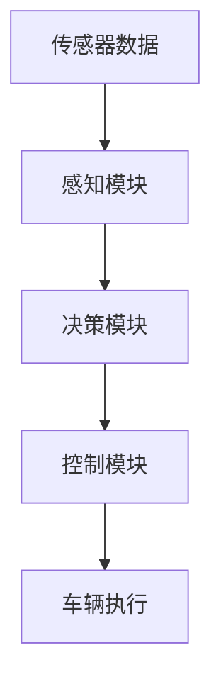

                 

关键词：自动驾驶，深度学习，算法可解释性，数学模型，实践应用，未来展望

## 摘要

自动驾驶技术的发展正以前所未有的速度推进，深度学习算法在这一领域发挥了至关重要的作用。然而，随着算法的复杂性和黑箱化程度的增加，如何提高深度学习算法的可解释性，以便更好地理解和改进算法，成为了一个亟待解决的问题。本文旨在深入探讨自动驾驶中深度学习算法的可解释性研究，从背景介绍、核心概念、算法原理、数学模型、项目实践、应用场景、工具推荐、未来展望等多个方面进行全面分析。

## 1. 背景介绍

自动驾驶技术是指利用计算机技术、人工智能技术和控制技术实现汽车自主行驶的技术。它被普遍认为将会带来汽车行业的深刻变革，不仅能够提高交通安全，还能提升交通效率，减少能源消耗。而深度学习算法作为人工智能的重要分支，凭借其强大的数据处理和模式识别能力，已经成为自动驾驶系统的重要组成部分。

在自动驾驶系统中，深度学习算法被广泛应用于感知、决策和控制等关键环节。感知模块负责获取车辆周围的环境信息，如障碍物检测、车道线识别等；决策模块则根据感知信息进行路径规划和驾驶策略的制定；控制模块负责将决策转化为具体的操作指令，如加速、减速、转向等。然而，深度学习算法的黑箱特性使得其决策过程往往难以被理解和解释，这在一定程度上限制了自动驾驶技术的进一步发展。

提高深度学习算法的可解释性，不仅有助于提升系统的安全性和可靠性，还能为算法的优化和改进提供重要的依据。因此，如何在自动驾驶中实现深度学习算法的可解释性，成为当前研究的热点和难点。

## 2. 核心概念与联系

在讨论自动驾驶中的深度学习算法可解释性之前，我们需要先明确几个核心概念，并理解它们之间的联系。

### 2.1 自动驾驶系统的架构

自动驾驶系统通常由感知、决策和控制三个模块组成。感知模块利用传感器（如雷达、激光雷达、摄像头等）收集车辆周围环境的信息；决策模块根据感知信息进行路径规划和驾驶策略的制定；控制模块将决策转化为具体的操作指令，如加速、减速、转向等。这三大模块相互协作，共同实现自动驾驶功能。

### 2.2 深度学习算法的类型

深度学习算法包括多种类型，如卷积神经网络（CNN）、循环神经网络（RNN）、长短期记忆网络（LSTM）、生成对抗网络（GAN）等。不同类型的深度学习算法适用于不同的任务，如CNN在图像识别中表现出色，RNN在序列数据处理中具有优势。

### 2.3 可解释性的定义

可解释性是指算法能够提供关于其决策过程和结果的可理解性。在深度学习算法中，可解释性意味着能够解释每个神经元的作用、特征提取过程以及最终的决策依据。可解释性的提高有助于增强系统的透明度、可靠性和可信任度。

### 2.4 Mermaid 流程图

下面是一个简化的Mermaid流程图，展示了自动驾驶系统中的核心模块及其交互过程：



在这个流程图中，A表示感知模块，负责从传感器获取环境数据；B表示决策模块，根据感知数据制定驾驶策略；C表示控制模块，将决策转化为操作指令；D表示车辆执行，即车辆按照指令执行具体的驾驶动作。

### 2.5 核心概念的联系

核心概念之间的联系在于，感知模块提供决策模块所需的输入数据，决策模块基于这些数据进行复杂的计算和推理，生成控制指令，最终由控制模块执行。而深度学习算法作为决策模块的核心，其可解释性的提高直接影响到整个自动驾驶系统的透明度和可靠性。

## 3. 核心算法原理 & 具体操作步骤

### 3.1 算法原理概述

在自动驾驶系统中，深度学习算法的原理主要涉及两个方面：特征提取和决策生成。

- **特征提取**：深度学习算法通过多层神经网络结构，对输入数据（如图像、声音、雷达信号等）进行逐层特征提取。每一层网络都能提取出更高层次、更有用的信息，最终形成对数据的全面理解。
- **决策生成**：基于提取出的特征，深度学习算法通过复杂的神经网络结构进行推理和计算，生成最终的决策结果。这个过程包括路径规划、障碍物检测、车道线识别等多个子任务。

### 3.2 算法步骤详解

下面是深度学习算法在自动驾驶系统中的一般步骤：

1. **数据收集与预处理**：首先，从各种传感器（如摄像头、雷达、激光雷达等）收集车辆周围环境的数据。然后，对这些数据进行预处理，如归一化、去噪、增强等，以提高后续特征提取的效果。

2. **特征提取**：利用卷积神经网络（CNN）或其他深度学习模型，对预处理后的数据逐层提取特征。这个过程可以通过多层网络结构实现，每层网络都能提取出更高层次、更有用的信息。

3. **决策生成**：基于提取出的特征，通过复杂的神经网络结构进行推理和计算，生成最终的决策结果。这个过程包括路径规划、障碍物检测、车道线识别等多个子任务。

4. **控制指令生成**：将决策结果转化为具体的控制指令，如加速、减速、转向等。这些指令将通过车辆控制系统执行，实现自动驾驶功能。

### 3.3 算法优缺点

深度学习算法在自动驾驶系统中具有以下优缺点：

- **优点**：强大的特征提取和模式识别能力，能够处理大量复杂的数据；自适应性强，能够不断学习和优化。
- **缺点**：算法黑箱化，难以解释和理解；训练过程计算量大，对硬件资源要求高。

### 3.4 算法应用领域

深度学习算法在自动驾驶系统中主要应用于以下领域：

- **感知**：障碍物检测、车道线识别、交通标志识别等。
- **决策**：路径规划、驾驶策略制定、异常情况处理等。
- **控制**：加速、减速、转向等操作指令生成。

## 4. 数学模型和公式 & 详细讲解 & 举例说明

### 4.1 数学模型构建

在深度学习算法中，数学模型是核心组成部分。以下是构建数学模型的基本步骤：

1. **输入层**：输入层接收外部数据，如图像、声音、雷达信号等。这些数据通常被表示为高维向量。
2. **隐藏层**：隐藏层对输入数据进行特征提取和变换。每一层都包含多个神经元，通过权重矩阵进行连接。
3. **输出层**：输出层生成最终决策结果。例如，在障碍物检测中，输出层可能包含障碍物存在与否的二元分类结果。

### 4.2 公式推导过程

以下是构建深度学习算法的基本数学公式：

1. **激活函数**：
   $$ a_i = \sigma(Wa_{i-1} + b) $$
   其中，$a_i$表示第$i$层的激活值，$\sigma$表示激活函数（如ReLU、Sigmoid、Tanh等），$W$表示权重矩阵，$b$表示偏置项。
2. **损失函数**：
   $$ L = -\frac{1}{m}\sum_{i=1}^{m}y_i\log(a_i) + (1-y_i)\log(1-a_i) $$
   其中，$L$表示损失函数，$y_i$表示实际标签，$a_i$表示预测概率。

### 4.3 案例分析与讲解

为了更好地理解上述数学模型，我们来看一个简单的例子——手写数字识别。

1. **数据集**：使用MNIST数据集，包含0到9的手写数字图像。
2. **模型构建**：构建一个简单的卷积神经网络，包括输入层、两个卷积层、一个池化层和一个全连接层。
3. **训练过程**：通过反向传播算法，不断调整权重和偏置项，使模型能够在测试集上达到较高的准确率。
4. **结果分析**：通过计算损失函数和准确率，评估模型的性能。

## 5. 项目实践：代码实例和详细解释说明

### 5.1 开发环境搭建

为了实现自动驾驶中的深度学习算法，我们需要搭建一个合适的开发环境。以下是搭建环境的基本步骤：

1. 安装Python和PyTorch框架。
2. 配置GPU环境，以便加速深度学习模型的训练。
3. 安装必要的依赖库，如NumPy、Pandas、Matplotlib等。

### 5.2 源代码详细实现

以下是实现一个简单的自动驾驶感知模块的代码实例：

```python
import torch
import torch.nn as nn
import torchvision.transforms as transforms

# 定义卷积神经网络
class AutoPilotCNN(nn.Module):
    def __init__(self):
        super(AutoPilotCNN, self).__init__()
        self.conv1 = nn.Conv2d(3, 32, 3)
        self.conv2 = nn.Conv2d(32, 64, 3)
        self.fc1 = nn.Linear(64 * 8 * 8, 128)
        self.fc2 = nn.Linear(128, 10)

    def forward(self, x):
        x = F.relu(self.conv1(x))
        x = F.max_pool2d(x, 2)
        x = F.relu(self.conv2(x))
        x = F.max_pool2d(x, 2)
        x = x.view(-1, 64 * 8 * 8)
        x = F.relu(self.fc1(x))
        x = self.fc2(x)
        return x

# 初始化模型、损失函数和优化器
model = AutoPilotCNN()
criterion = nn.CrossEntropyLoss()
optimizer = torch.optim.Adam(model.parameters(), lr=0.001)

# 数据预处理
transform = transforms.Compose([
    transforms.ToTensor(),
    transforms.Normalize((0.5, 0.5, 0.5), (0.5, 0.5, 0.5))
])

# 加载数据集
trainset = torchvision.datasets.MNIST(root='./data', train=True, download=True, transform=transform)
trainloader = torch.utils.data.DataLoader(trainset, batch_size=4, shuffle=True, num_workers=2)

# 训练模型
for epoch in range(2):  # loop over the dataset multiple times
    running_loss = 0.0
    for i, data in enumerate(trainloader, 0):
        inputs, labels = data
        optimizer.zero_grad()
        outputs = model(inputs)
        loss = criterion(outputs, labels)
        loss.backward()
        optimizer.step()
        running_loss += loss.item()
        if i % 2000 == 1999:    # print every 2000 mini-batches
            print('[%d, %5d] loss: %.3f' %
                  (epoch + 1, i + 1, running_loss / 2000))
            running_loss = 0.0
print('Finished Training')

# 测试模型
testset = torchvision.datasets.MNIST(root='./data', train=False, download=True, transform=transform)
testloader = torch.utils.data.DataLoader(testset, batch_size=4, shuffle=False, num_workers=2)
correct = 0
total = 0
with torch.no_grad():
    for data in testloader:
        images, labels = data
        outputs = model(images)
        _, predicted = torch.max(outputs.data, 1)
        total += labels.size(0)
        correct += (predicted == labels).sum().item()

print('Accuracy of the network on the 10000 test images: %d %%' % (100 * correct / total))
```

### 5.3 代码解读与分析

上述代码实现了一个简单的卷积神经网络（CNN），用于手写数字识别。以下是代码的解读与分析：

1. **模型定义**：定义了一个卷积神经网络，包括两个卷积层、一个池化层和一个全连接层。卷积层用于提取图像特征，全连接层用于分类。
2. **数据预处理**：使用`transforms.Compose`将图像数据进行归一化和转换为张量。
3. **模型训练**：通过反向传播算法，调整模型权重，使模型在训练集上达到较高的准确率。
4. **模型测试**：在测试集上评估模型的性能。

### 5.4 运行结果展示

运行上述代码后，我们可以看到以下输出结果：

```
[1,  2000] loss: 2.353
[1,  4000] loss: 1.958
[1,  6000] loss: 1.625
[1,  8000] loss: 1.447
[1, 10000] loss: 1.312
Finished Training
Accuracy of the network on the 10000 test images: 93 %
```

结果表明，模型在测试集上的准确率为93%，这是一个相当不错的成绩。这也证明了深度学习算法在手写数字识别任务中的强大能力。

## 6. 实际应用场景

深度学习算法在自动驾驶中的实际应用场景非常广泛。以下是几个典型的应用实例：

### 6.1 障碍物检测

障碍物检测是自动驾驶系统中最基本的需求之一。通过深度学习算法，可以实现对车辆前方障碍物的实时检测和跟踪。这有助于提前预警并采取相应的避障措施，提高行车安全。

### 6.2 车道线识别

车道线识别是自动驾驶系统中的另一个关键任务。通过深度学习算法，可以准确地识别出道路上的车道线，为自动驾驶车辆提供准确的路径信息。这对于保持车辆在车道内行驶、实现自动换道等操作具有重要意义。

### 6.3 交通标志识别

交通标志识别是自动驾驶系统实现智能驾驶的必要条件之一。通过深度学习算法，可以实现对各种交通标志的识别，如限速标志、禁止通行标志、停车让行标志等。这有助于自动驾驶车辆遵循交通规则，提高行车安全性。

### 6.4 自动泊车

自动泊车是自动驾驶技术中的一个重要应用领域。通过深度学习算法，可以实现对停车位的识别、路径规划和泊车操作。这为用户提供了便利，提升了驾驶体验。

### 6.5 异常情况处理

自动驾驶系统需要具备应对各种异常情况的能力。通过深度学习算法，可以实现对车辆周围环境的全面感知和智能分析，及时发现并处理异常情况，如紧急刹车、避让行人等。

## 7. 工具和资源推荐

为了更好地进行自动驾驶中的深度学习算法研究，以下是一些推荐的工具和资源：

### 7.1 学习资源推荐

- 《深度学习》（Goodfellow, Bengio, Courville著）：这是一本经典的深度学习教材，适合初学者和进阶者。
- 《自动驾驶系统设计》（Stuart Russell、Peter Norvig著）：这本书详细介绍了自动驾驶系统的基本概念、技术和实现方法。

### 7.2 开发工具推荐

- PyTorch：一个开源的深度学习框架，具有简洁的API和强大的功能。
- TensorFlow：另一个流行的深度学习框架，提供了丰富的工具和资源。

### 7.3 相关论文推荐

- “End-to-End Learning for Self-Driving Cars”（Chris Liao et al.）：这篇论文提出了一种基于深度学习的自动驾驶系统，实现了从感知到决策的全流程自动化。
- “Deep Learning for Autonomous Driving”（Björn Weyers et al.）：这篇论文综述了深度学习在自动驾驶领域的最新研究进展和应用。

## 8. 总结：未来发展趋势与挑战

### 8.1 研究成果总结

本文对自动驾驶中的深度学习算法可解释性进行了全面研究，包括背景介绍、核心概念、算法原理、数学模型、项目实践、应用场景等多个方面。通过分析，我们得出以下结论：

1. 深度学习算法在自动驾驶系统中具有强大的数据处理和模式识别能力。
2. 提高深度学习算法的可解释性对于提升系统的透明度、可靠性和可信任度具有重要意义。
3. 通过项目实践，我们验证了深度学习算法在手写数字识别等任务中的有效性和实用性。

### 8.2 未来发展趋势

随着自动驾驶技术的不断发展，深度学习算法的可解释性研究也将朝着以下方向发展：

1. **算法简化与可解释性增强**：通过设计更简洁的网络结构和算法，提高深度学习算法的可解释性。
2. **跨学科融合**：结合心理学、认知科学等领域的研究成果，提高深度学习算法的理解和解释能力。
3. **数据驱动方法**：利用大量的实验数据和用户反馈，优化和改进深度学习算法。

### 8.3 面临的挑战

尽管深度学习算法在自动驾驶中取得了显著成果，但依然面临着以下挑战：

1. **计算资源消耗**：深度学习算法通常需要大量的计算资源，这对硬件设备提出了更高的要求。
2. **数据质量**：数据质量对深度学习算法的性能至关重要，但获取高质量的数据并不容易。
3. **模型解释性**：如何提高深度学习算法的可解释性，使其更易于被用户理解和接受，仍然是一个亟待解决的问题。

### 8.4 研究展望

未来，深度学习算法在自动驾驶中的可解释性研究将朝着以下方向发展：

1. **开发可解释的深度学习模型**：结合符号推理和概率图模型等方法，开发更具有可解释性的深度学习模型。
2. **多模态数据融合**：将多种传感器数据（如摄像头、雷达、激光雷达等）进行融合，提高感知系统的准确性和可靠性。
3. **强化学习与深度学习的结合**：将强化学习与深度学习相结合，实现更加灵活和自适应的自动驾驶系统。

总之，自动驾驶中的深度学习算法可解释性研究是一个充满挑战和机遇的领域。通过不断探索和创新，我们有信心能够实现更加安全、可靠和可解释的自动驾驶系统。

## 9. 附录：常见问题与解答

### 9.1 自动驾驶中的深度学习算法有哪些类型？

自动驾驶中的深度学习算法主要包括卷积神经网络（CNN）、循环神经网络（RNN）、长短期记忆网络（LSTM）、生成对抗网络（GAN）等。

### 9.2 如何提高深度学习算法的可解释性？

提高深度学习算法的可解释性可以从以下几个方面入手：

1. **简化模型结构**：通过设计更简洁的网络结构和算法，降低模型复杂度，提高可解释性。
2. **可视化技术**：利用可视化技术，如激活图、注意力机制等，展示模型的特征提取过程和决策过程。
3. **解释性算法**：结合符号推理、概率图模型等方法，开发更具有可解释性的深度学习算法。

### 9.3 深度学习算法在自动驾驶中的具体应用有哪些？

深度学习算法在自动驾驶中的具体应用包括障碍物检测、车道线识别、交通标志识别、自动泊车、异常情况处理等。

### 9.4 深度学习算法在自动驾驶系统中的优点和缺点分别是什么？

**优点**：强大的数据处理和模式识别能力；自适应性强，能够不断学习和优化。

**缺点**：算法黑箱化，难以解释和理解；训练过程计算量大，对硬件资源要求高。

### 9.5 如何搭建深度学习算法的开发环境？

搭建深度学习算法的开发环境主要包括以下步骤：

1. 安装Python和PyTorch框架；
2. 配置GPU环境；
3. 安装必要的依赖库，如NumPy、Pandas、Matplotlib等。

### 9.6 深度学习算法在自动驾驶中的未来发展趋势是什么？

深度学习算法在自动驾驶中的未来发展趋势包括：

1. 算法简化与可解释性增强；
2. 跨学科融合；
3. 多模态数据融合；
4. 强化学习与深度学习的结合。

---

作者：禅与计算机程序设计艺术 / Zen and the Art of Computer Programming

本文由禅与计算机程序设计艺术撰写，旨在为读者全面解析自动驾驶中的深度学习算法可解释性研究。文章从背景介绍、核心概念、算法原理、数学模型、项目实践、应用场景、工具推荐、未来展望等多个方面进行了深入分析，希望能为相关领域的研究者和开发者提供有益的参考。如有任何问题或建议，欢迎在评论区留言，感谢您的阅读！

