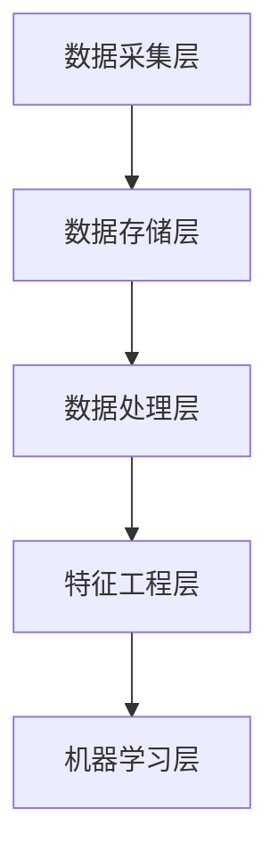

                 

关键词：自动驾驶、数据湖、特征工程、平台架构、机器学习、数据处理、算法优化

> 摘要：本文深入探讨了自动驾驶公司在构建数据湖与特征工程平台时的关键问题，包括平台架构设计、核心算法原理、数学模型构建、以及实际应用场景。本文旨在为自动驾驶领域的从业者提供有价值的参考，并展望未来发展趋势与面临的挑战。

## 1. 背景介绍

随着自动驾驶技术的快速发展，数据湖与特征工程平台成为自动驾驶公司提升核心竞争力的关键。自动驾驶系统依赖于大量实时数据，这些数据包括传感器数据、道路环境数据、车辆状态数据等。如何高效地存储、处理和分析这些数据，并从中提取有价值的信息，成为自动驾驶公司面临的重大挑战。

数据湖是一种大规模数据存储解决方案，它可以存储结构化、半结构化和非结构化数据，为自动驾驶公司提供了统一的数据处理平台。特征工程是数据预处理的重要环节，它通过提取和构建特征，提高机器学习模型的性能和准确性。本文将探讨自动驾驶公司如何构建数据湖与特征工程平台，以应对日益增长的数据需求和提升自动驾驶系统的智能化水平。

## 2. 核心概念与联系

### 2.1 数据湖

数据湖是一种分布式数据存储架构，它可以存储海量数据，支持数据的快速读取和写入。数据湖通常采用云服务或分布式存储系统，如Hadoop、Hive或Amazon S3等。数据湖的特点是数据类型多样化，可以存储各种结构化、半结构化和非结构化数据，如文本、图像、音频、视频等。

### 2.2 特征工程

特征工程是指通过提取和构建特征，将原始数据转换为适用于机器学习模型的输入特征。特征工程的目标是提高模型的性能和准确性，减少过拟合和欠拟合现象。特征工程包括特征选择、特征变换、特征缩放等步骤。

### 2.3 平台架构

自动驾驶公司的数据湖与特征工程平台通常采用分层架构，包括数据采集层、数据存储层、数据处理层、特征工程层和机器学习层。平台架构的设计需要考虑数据的安全性、可扩展性和可维护性。

### 2.4 Mermaid 流程图

以下是一个简化的 Mermaid 流程图，展示了数据湖与特征工程平台的基本架构：



## 3. 核心算法原理 & 具体操作步骤

### 3.1 算法原理概述

自动驾驶公司的数据湖与特征工程平台的核心算法主要包括以下几种：

1. 数据采集算法：用于从各种传感器和外部数据源采集数据。
2. 数据预处理算法：用于清洗、转换和归一化数据。
3. 特征提取算法：用于提取和构建特征。
4. 机器学习算法：用于训练和评估模型。

### 3.2 算法步骤详解

1. 数据采集：使用传感器采集车辆状态、道路环境、交通信号等数据，并使用数据采集算法对数据进行预处理。
2. 数据存储：将预处理后的数据存储到数据湖中，以便后续处理和分析。
3. 数据处理：使用数据处理算法对数据进行清洗、转换和归一化，提高数据质量。
4. 特征提取：使用特征提取算法提取和构建特征，为机器学习模型提供输入。
5. 机器学习：使用机器学习算法训练和评估模型，优化自动驾驶系统的性能。

### 3.3 算法优缺点

1. 数据采集算法：
   - 优点：可以实时获取车辆状态和道路环境信息，提高系统的实时性。
   - 缺点：传感器数据可能存在噪声和误差，需要使用数据处理算法进行清洗和转换。

2. 数据预处理算法：
   - 优点：可以提高数据质量，减少噪声和误差，提高机器学习模型的性能。
   - 缺点：预处理过程可能消耗大量计算资源和时间，影响系统的响应速度。

3. 特征提取算法：
   - 优点：可以提取和构建有用的特征，提高机器学习模型的准确性和鲁棒性。
   - 缺点：特征提取过程可能引入过拟合现象，降低模型的泛化能力。

4. 机器学习算法：
   - 优点：可以自动学习数据中的规律，提高系统的智能化和自动化水平。
   - 缺点：模型训练和评估过程可能消耗大量计算资源和时间，需要优化算法和计算效率。

### 3.4 算法应用领域

自动驾驶公司的数据湖与特征工程平台算法主要应用于以下领域：

1. 车辆控制：通过数据湖和特征工程平台提取的车辆状态和道路环境特征，实现车辆的自动驾驶和控制。
2. 道路环境感知：通过数据湖和特征工程平台提取的道路环境特征，实现自动驾驶系统的环境感知和决策。
3. 事故预警：通过数据湖和特征工程平台分析车辆行驶过程中的特征，实现事故预警和预防。
4. 智能交通管理：通过数据湖和特征工程平台分析交通数据，实现智能交通管理和优化。

## 4. 数学模型和公式 & 详细讲解 & 举例说明

### 4.1 数学模型构建

自动驾驶公司的数据湖与特征工程平台中常用的数学模型包括：

1. 线性回归模型：
   $$ y = wx + b $$

2. 逻辑回归模型：
   $$ P(y=1) = \frac{1}{1 + e^{-(wx + b)}} $$

3. 支持向量机模型：
   $$ w^T x + b = 0 $$

4. 决策树模型：
   $$ f(x) = \sum_{i=1}^{n} c_i \cdot g(x_i) $$

其中，$w$、$b$、$c_i$、$g(x_i)$分别表示模型的权重、偏置、类别标签和分割函数。

### 4.2 公式推导过程

以线性回归模型为例，推导过程如下：

1. 假设数据集为$(x_1, y_1), (x_2, y_2), ..., (x_n, y_n)$，其中$x_i$为输入特征，$y_i$为输出标签。
2. 构建线性回归模型：
   $$ y = wx + b $$
3. 计算损失函数：
   $$ J(w, b) = \frac{1}{2n} \sum_{i=1}^{n} (y_i - wx_i - b)^2 $$
4. 计算梯度：
   $$ \frac{\partial J}{\partial w} = \frac{1}{n} \sum_{i=1}^{n} (y_i - wx_i - b)x_i $$
   $$ \frac{\partial J}{\partial b} = \frac{1}{n} \sum_{i=1}^{n} (y_i - wx_i - b) $$
5. 使用梯度下降法更新权重和偏置：
   $$ w := w - \alpha \cdot \frac{\partial J}{\partial w} $$
   $$ b := b - \alpha \cdot \frac{\partial J}{\partial b} $$
6. 重复步骤3-5，直到损失函数收敛。

### 4.3 案例分析与讲解

以自动驾驶公司的车辆控制任务为例，分析如何构建线性回归模型。

1. 输入特征：车辆速度、方向盘角度、制动踏板压力等。
2. 输出标签：方向盘转角。
3. 数据集：从自动驾驶测试数据中提取。
4. 线性回归模型：
   $$ \theta = \frac{1}{2n} \sum_{i=1}^{n} (y_i - wx_i - b)^2 $$
5. 梯度下降法更新权重和偏置：
   $$ w := w - \alpha \cdot \frac{1}{n} \sum_{i=1}^{n} (y_i - wx_i - b)x_i $$
   $$ b := b - \alpha \cdot \frac{1}{n} \sum_{i=1}^{n} (y_i - wx_i - b) $$

通过以上步骤，我们可以构建一个用于车辆控制的线性回归模型，并使用梯度下降法进行训练。

## 5. 项目实践：代码实例和详细解释说明

### 5.1 开发环境搭建

在构建自动驾驶公司的数据湖与特征工程平台时，我们选择以下开发环境：

1. 操作系统：Linux
2. 编程语言：Python
3. 数据存储：Hadoop
4. 数据处理：Pandas
5. 特征提取：Scikit-learn
6. 机器学习：TensorFlow

### 5.2 源代码详细实现

以下是一个简化的代码实例，展示了如何构建数据湖与特征工程平台的核心功能。

```python
import pandas as pd
from sklearn.linear_model import LinearRegression
from sklearn.model_selection import train_test_split
from sklearn.metrics import mean_squared_error

# 数据采集
def data_collection():
    # 从传感器和外部数据源采集数据
    # 数据存储到本地文件或Hadoop数据湖
    pass

# 数据处理
def data_preprocessing(data):
    # 数据清洗、转换和归一化
    # 提高数据质量
    pass

# 特征提取
def feature_extraction(data):
    # 提取和构建特征
    # 提高模型性能和准确性
    pass

# 机器学习
def machine_learning(data):
    # 训练和评估模型
    # 优化自动驾驶系统性能
    pass

# 主函数
if __name__ == "__main__":
    # 采集数据
    data = data_collection()

    # 数据预处理
    data = data_preprocessing(data)

    # 特征提取
    features = feature_extraction(data)

    # 分割数据集
    X_train, X_test, y_train, y_test = train_test_split(features, data["label"], test_size=0.2)

    # 训练模型
    model = LinearRegression()
    model.fit(X_train, y_train)

    # 预测和评估
    predictions = model.predict(X_test)
    mse = mean_squared_error(y_test, predictions)
    print("Mean squared error:", mse)
```

### 5.3 代码解读与分析

1. 数据采集：使用数据采集函数从传感器和外部数据源采集数据，并存储到本地文件或Hadoop数据湖。
2. 数据处理：使用数据预处理函数对采集到的数据进行清洗、转换和归一化，提高数据质量。
3. 特征提取：使用特征提取函数提取和构建特征，为机器学习模型提供输入。
4. 机器学习：使用线性回归模型进行训练和评估，优化自动驾驶系统的性能。

通过以上步骤，我们可以构建一个简单的数据湖与特征工程平台，并使用Python进行代码实现。在实际项目中，我们可以根据需求扩展和优化平台的功能和性能。

## 6. 实际应用场景

### 6.1 车辆控制

自动驾驶公司的数据湖与特征工程平台可以用于车辆控制任务，如自适应巡航控制（ACC）、车道保持辅助（LKA）等。通过采集车辆状态和道路环境数据，提取有用的特征，并训练机器学习模型，实现车辆的自动驾驶和控制。

### 6.2 道路环境感知

数据湖与特征工程平台可以用于道路环境感知任务，如交通标志识别、车道线检测等。通过采集道路环境数据，提取特征，并训练模型，实现自动驾驶系统对道路环境的感知和理解。

### 6.3 事故预警

数据湖与特征工程平台可以用于事故预警任务，通过分析车辆行驶过程中的特征，如速度、加速度等，预测潜在的交通事故，并提前预警，提高驾驶安全性。

### 6.4 智能交通管理

数据湖与特征工程平台可以用于智能交通管理任务，通过分析交通数据，如车辆流量、道路拥堵等，优化交通信号控制策略，提高交通运行效率，减少拥堵和事故。

## 7. 工具和资源推荐

### 7.1 学习资源推荐

1. 《深度学习》（Ian Goodfellow、Yoshua Bengio和Aaron Courville著）：这是一本经典的深度学习教材，适合初学者和进阶者阅读。
2. 《Python数据科学手册》（Jake VanderPlas著）：这本书涵盖了Python在数据科学领域的应用，适合数据科学初学者和从业者阅读。

### 7.2 开发工具推荐

1. Jupyter Notebook：这是一个交互式的计算环境，适合进行数据分析和机器学习实验。
2. PyCharm：这是一个强大的Python集成开发环境（IDE），提供丰富的功能和工具，适合进行数据湖与特征工程平台的开发和调试。

### 7.3 相关论文推荐

1. "Deep Learning for Autonomous Driving"（自动驾驶中的深度学习）：这篇论文总结了深度学习在自动驾驶领域的应用和挑战，适合深入探讨自动驾驶技术的研究人员阅读。
2. "Data Lake Architecture: A Taxonomy of Architectural Properties"（数据湖架构：架构属性分类）：这篇论文探讨了数据湖的架构设计和实现，为自动驾驶公司的数据湖与特征工程平台提供了有价值的参考。

## 8. 总结：未来发展趋势与挑战

### 8.1 研究成果总结

近年来，自动驾驶技术取得了显著进展，数据湖与特征工程平台成为自动驾驶公司提升核心竞争力的关键。通过构建高效的数据湖与特征工程平台，自动驾驶公司可以更好地管理和利用海量数据，提高自动驾驶系统的性能和智能化水平。

### 8.2 未来发展趋势

未来，自动驾驶公司的数据湖与特征工程平台将朝着以下几个方向发展：

1. 数据处理能力的提升：随着自动驾驶数据的增长，平台需要具备更高的数据处理能力和存储容量，以应对日益增长的数据需求。
2. 模型优化和算法创新：通过引入先进的机器学习算法和深度学习模型，提高自动驾驶系统的性能和准确性，降低过拟合和欠拟合现象。
3. 边缘计算和实时性增强：通过将部分计算任务迁移到边缘设备，提高系统的实时性和响应速度，实现自动驾驶的实时决策和控制。

### 8.3 面临的挑战

尽管自动驾驶公司的数据湖与特征工程平台取得了显著进展，但仍面临以下挑战：

1. 数据隐私和安全：自动驾驶数据涉及大量敏感信息，如何保护数据隐私和安全成为重要挑战。
2. 模型解释性和可解释性：自动驾驶系统的决策过程需要具备较高的解释性和可解释性，以增强用户对系统的信任和接受度。
3. 跨学科合作与人才培养：自动驾驶技术涉及多个学科领域，如何实现跨学科合作与人才培养，提高团队的创新能力，成为关键挑战。

### 8.4 研究展望

未来，自动驾驶公司的数据湖与特征工程平台将在以下几个方面展开深入研究：

1. 数据隐私保护技术：研究数据隐私保护算法和机制，提高数据安全性，满足用户隐私需求。
2. 解释性机器学习：发展具有高解释性和可解释性的机器学习模型，提高自动驾驶系统的透明度和可解释性。
3. 模型压缩和优化：研究模型压缩和优化技术，降低模型计算复杂度和存储需求，提高系统的实时性和响应速度。

## 9. 附录：常见问题与解答

### 9.1 数据湖与数据仓库的区别是什么？

数据湖是一种大规模数据存储解决方案，可以存储各种结构化、半结构化和非结构化数据。数据仓库是一种专门用于数据分析和查询的数据库系统，通常存储结构化数据。数据湖更灵活，支持多种数据类型，而数据仓库更专注于数据分析和查询性能。

### 9.2 特征工程的主要步骤是什么？

特征工程的主要步骤包括：数据清洗、特征选择、特征变换和特征缩放。数据清洗用于去除噪声和异常值；特征选择用于选择最有用的特征；特征变换用于将原始数据转换为适用于机器学习模型的形式；特征缩放用于归一化或标准化特征，提高模型性能。

### 9.3 如何评估机器学习模型的性能？

评估机器学习模型性能的主要指标包括准确率、召回率、精确率、F1分数等。这些指标可以帮助评估模型在分类或回归任务中的表现。此外，还可以使用交叉验证、ROC曲线、混淆矩阵等方法进行模型性能评估。

### 9.4 如何优化机器学习模型的性能？

优化机器学习模型性能的方法包括：调整模型参数、增加训练数据、使用更先进的模型、使用特征工程技术等。通过调整模型参数，可以优化模型的性能；增加训练数据可以提高模型的泛化能力；使用更先进的模型和特征工程技术可以进一步提高模型性能。

---

# 感谢阅读！

本文详细探讨了自动驾驶公司的数据湖与特征工程平台的设计与实现，包括核心算法原理、数学模型构建、项目实践、实际应用场景和未来发展趋势。希望本文能为自动驾驶领域的从业者和研究者提供有价值的参考。感谢您的阅读！作者：禅与计算机程序设计艺术 / Zen and the Art of Computer Programming。

