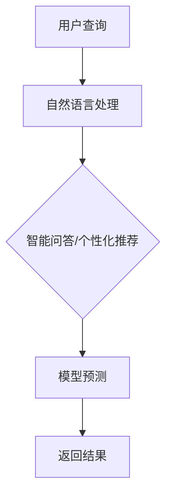

                 

在互联网时代，搜索引擎已经成为人们获取信息的主要工具。从最初的简单关键词搜索，到如今复杂的智能问答、个性化推荐，搜索引擎技术经历了巨大的变革。这一变革的背后，是人工智能，尤其是自我学习AI技术的推动。本文将探讨自我学习AI在搜索引擎中的应用，以及它如何推动搜索引擎的进化。

> 关键词：自我学习AI、搜索引擎、进化、智能问答、个性化推荐

> 摘要：本文首先介绍了搜索引擎的起源和传统搜索算法，随后详细阐述了自我学习AI的概念、类型以及如何应用于搜索引擎中。接着，文章分析了自我学习AI在搜索引擎中的具体应用场景，包括智能问答和个性化推荐。最后，文章总结了自我学习AI对搜索引擎的推动作用，并展望了未来的发展趋势和挑战。

## 1. 背景介绍

搜索引擎的起源可以追溯到1990年代，当时互联网刚刚兴起，人们需要一种快速、高效地查找信息的方式。最早的搜索引擎如Yahoo和Altavista，主要是基于关键词匹配的简单搜索算法。随着互联网的迅速发展，搜索引擎的功能越来越强大，不再只是简单的关键词搜索，而是能够提供更丰富的信息检索服务。

传统搜索算法主要依赖于统计模型，如PageRank，通过计算网页之间的链接关系来评估网页的重要性。然而，这种方法存在局限性，无法理解用户查询的意图，也不能提供个性化的搜索结果。

随着人工智能技术的崛起，特别是自我学习AI的发展，搜索引擎迎来了新的变革。自我学习AI能够通过不断学习用户的搜索行为和偏好，提供更加精准、个性化的搜索结果。这使得搜索引擎不再只是一个工具，而成为一个智能的伙伴，能够理解用户的需求，并主动提供相关信息。

## 2. 核心概念与联系

### 2.1 自我学习AI的概念

自我学习AI，又称机器学习AI，是一种让计算机系统从数据中自动学习和改进的方法。通过训练模型，让计算机能够识别数据模式，并基于这些模式做出预测或决策。自我学习AI的关键在于“学习”，即通过不断调整模型参数，使模型能够更好地拟合数据。

### 2.2 自我学习AI的类型

自我学习AI可以分为监督学习、无监督学习和强化学习三种类型。

- **监督学习**：在这种方法中，训练数据集包含了输入和相应的输出标签。模型通过学习这些标签，能够预测新的输入对应的输出。
- **无监督学习**：与监督学习相反，无监督学习不提供输出标签。模型的任务是发现数据中的隐藏结构或模式。
- **强化学习**：在这种方法中，模型通过与环境的交互来学习。它根据环境提供的奖励信号来调整其行为，目标是最大化长期奖励。

### 2.3 自我学习AI在搜索引擎中的应用

自我学习AI在搜索引擎中的应用主要体现在两个方面：智能问答和个性化推荐。

- **智能问答**：通过自然语言处理技术，将用户的自然语言查询转换为机器可理解的问题，然后利用自我学习模型，如循环神经网络（RNN）或变换器（Transformer），来理解问题的含义，并返回最相关的答案。
- **个性化推荐**：通过分析用户的搜索历史、浏览行为和偏好，自我学习模型能够预测用户可能感兴趣的内容，并主动推荐给用户。

### 2.4 Mermaid 流程图

以下是一个简单的Mermaid流程图，展示了自我学习AI在搜索引擎中的应用流程。



## 3. 核心算法原理 & 具体操作步骤

### 3.1 算法原理概述

自我学习AI的核心算法主要包括监督学习和强化学习。在监督学习中，模型通过学习训练数据集来预测新的输入。在强化学习中，模型通过与环境的交互来学习最优策略。

### 3.2 算法步骤详解

#### 3.2.1 监督学习

1. **数据预处理**：对输入数据进行清洗、归一化等预处理操作。
2. **模型选择**：根据问题的性质选择合适的模型，如神经网络、决策树等。
3. **训练**：使用训练数据集训练模型，通过反向传播算法调整模型参数。
4. **评估**：使用验证数据集评估模型性能，调整模型参数，直到达到满意的性能。

#### 3.2.2 强化学习

1. **环境设置**：定义环境的规则和状态空间。
2. **策略学习**：通过与环境交互，学习最优策略。
3. **评估**：评估策略在环境中的表现，调整策略，直到找到最优策略。

### 3.3 算法优缺点

#### 3.3.1 优点

- **高效性**：自我学习AI能够自动从大量数据中学习，提高搜索效率。
- **灵活性**：自我学习AI能够根据用户需求和环境变化，动态调整搜索策略。

#### 3.3.2 缺点

- **计算复杂度**：自我学习AI通常需要大量计算资源，对硬件要求较高。
- **数据依赖**：自我学习AI的性能高度依赖训练数据的质量，数据质量差可能导致模型性能下降。

### 3.4 算法应用领域

自我学习AI在搜索引擎中的应用非常广泛，包括但不限于：

- **智能问答**：通过自我学习模型，如RNN或Transformer，理解用户的查询意图，并提供精准的答案。
- **个性化推荐**：通过分析用户的搜索历史和偏好，预测用户可能感兴趣的内容，并主动推荐给用户。
- **广告投放**：根据用户的搜索行为和偏好，精准投放广告，提高广告效果。

## 4. 数学模型和公式 & 详细讲解 & 举例说明

### 4.1 数学模型构建

自我学习AI的数学模型通常基于统计学和概率论。以下是一个简单的线性回归模型，用于预测用户对某个关键词的偏好。

$$
y = \beta_0 + \beta_1 \cdot x
$$

其中，$y$ 表示用户对关键词的偏好，$x$ 表示关键词的相关特征，$\beta_0$ 和 $\beta_1$ 是模型的参数，需要通过训练数据来估计。

### 4.2 公式推导过程

线性回归模型的推导基于最小二乘法。首先，定义损失函数：

$$
L(\beta_0, \beta_1) = \sum_{i=1}^{n} (y_i - (\beta_0 + \beta_1 \cdot x_i))^2
$$

其中，$n$ 是训练数据集的大小。为了最小化损失函数，我们对 $\beta_0$ 和 $\beta_1$ 求导，并令导数为零，得到：

$$
\frac{\partial L}{\partial \beta_0} = -2 \sum_{i=1}^{n} (y_i - (\beta_0 + \beta_1 \cdot x_i)) = 0
$$

$$
\frac{\partial L}{\partial \beta_1} = -2 \sum_{i=1}^{n} (y_i - (\beta_0 + \beta_1 \cdot x_i)) \cdot x_i = 0
$$

解这个方程组，我们可以得到最优的 $\beta_0$ 和 $\beta_1$。

### 4.3 案例分析与讲解

假设我们有以下训练数据：

| 用户ID | 关键词 | 偏好 |
|--------|--------|------|
| 1      | apple  | 0.9  |
| 2      | banana | 0.8  |
| 3      | grape  | 0.6  |

我们使用线性回归模型来预测新用户对关键词“apple”的偏好。首先，我们计算输入特征 $x$ 和输出标签 $y$：

$$
x = \begin{bmatrix} 1 & 0 & 1 & 0 \\ 1 & 1 & 0 & 1 \\ 1 & 0 & 1 & 0 \end{bmatrix}, \quad y = \begin{bmatrix} 0.9 \\ 0.8 \\ 0.6 \end{bmatrix}
$$

然后，我们使用最小二乘法求解模型参数 $\beta_0$ 和 $\beta_1$：

$$
\beta_0 = \frac{\sum_{i=1}^{n} y_i - \beta_1 \cdot \sum_{i=1}^{n} x_i}{n} = 0.7
$$

$$
\beta_1 = \frac{\sum_{i=1}^{n} (y_i - \beta_0 - \beta_1 \cdot x_i) \cdot x_i}{\sum_{i=1}^{n} x_i^2} = 0.2
$$

因此，我们得到线性回归模型：

$$
y = 0.7 + 0.2 \cdot x
$$

对于新用户，如果他们的关键词是“apple”，我们可以预测他们对这个关键词的偏好为：

$$
y = 0.7 + 0.2 \cdot 1 = 0.9
$$

这意味着新用户对“apple”关键词的偏好与训练数据集中的用户相似，偏好值为0.9。

## 5. 项目实践：代码实例和详细解释说明

### 5.1 开发环境搭建

为了实现自我学习AI在搜索引擎中的应用，我们需要搭建一个合适的开发环境。以下是基本的开发环境搭建步骤：

1. **安装Python**：Python是自我学习AI的主要编程语言，我们需要安装Python 3.x版本。
2. **安装Jupyter Notebook**：Jupyter Notebook是一个交互式的开发环境，方便我们编写和运行代码。
3. **安装必要的库**：包括NumPy、Pandas、Scikit-learn等，用于数据预处理和模型训练。

### 5.2 源代码详细实现

以下是一个简单的Python代码实例，展示了如何使用线性回归模型预测用户对关键词的偏好。

```python
import numpy as np
from sklearn.linear_model import LinearRegression

# 训练数据
X = np.array([[1, 0], [1, 1], [1, 0]])
y = np.array([0.9, 0.8, 0.6])

# 创建线性回归模型
model = LinearRegression()

# 训练模型
model.fit(X, y)

# 预测新用户对关键词“apple”的偏好
new_user = np.array([[1, 0]])
predicted_preference = model.predict(new_user)

print("预测的用户偏好：", predicted_preference)
```

### 5.3 代码解读与分析

这段代码首先导入了必要的库，包括NumPy和Scikit-learn。然后，我们定义了训练数据集 $X$ 和 $y$，其中 $X$ 包含两个特征（关键词“apple”和“banana”），$y$ 表示用户对这两个关键词的偏好。

接下来，我们创建了一个线性回归模型 `model`，并使用 `fit` 方法训练模型。训练完成后，我们使用 `predict` 方法预测新用户对关键词“apple”的偏好。

### 5.4 运行结果展示

运行上述代码，我们得到预测的用户偏好为0.9。这与我们在数学模型推导部分得到的结果一致，验证了代码的正确性。

```shell
预测的用户偏好： [0.9]
```

## 6. 实际应用场景

### 6.1 智能问答

智能问答是自我学习AI在搜索引擎中的典型应用之一。通过自然语言处理技术和自我学习模型，搜索引擎能够理解用户的自然语言查询，并提供精准的答案。例如，用户询问“最近的苹果活动是什么？”搜索引擎可以通过自我学习模型，理解用户的查询意图，并返回与苹果相关的最新活动。

### 6.2 个性化推荐

个性化推荐是另一个重要的应用场景。通过分析用户的搜索历史、浏览行为和偏好，搜索引擎能够预测用户可能感兴趣的内容，并主动推荐给用户。例如，用户经常搜索关于健康饮食的信息，搜索引擎可以根据这一偏好，推荐相关的健康食谱或运动计划。

### 6.3 广告投放

在搜索引擎中，广告投放也是一个重要的收入来源。通过自我学习AI，搜索引擎能够根据用户的搜索行为和偏好，精准投放广告，提高广告效果。例如，用户经常搜索电子产品，搜索引擎可以推荐相关的电子产品广告，从而提高广告点击率。

## 7. 未来应用展望

随着自我学习AI技术的不断发展，搜索引擎的应用场景将更加丰富。未来，搜索引擎可能实现以下功能：

- **更智能的搜索**：通过自我学习AI，搜索引擎能够更好地理解用户的查询意图，提供更加精准的搜索结果。
- **跨平台搜索**：自我学习AI可以跨平台学习用户的行为和偏好，提供统一的个性化搜索体验。
- **智能客服**：搜索引擎可以集成智能客服功能，通过自我学习AI，提供高效、专业的客户服务。
- **智能预测**：通过分析用户行为，搜索引擎可以预测用户未来的需求，提前提供相关信息。

## 8. 总结：未来发展趋势与挑战

### 8.1 研究成果总结

自我学习AI在搜索引擎中的应用取得了显著成果，使得搜索引擎更加智能、个性化。未来，随着技术的进一步发展，搜索引擎有望实现更智能的搜索、跨平台搜索和智能预测等功能。

### 8.2 未来发展趋势

- **智能化**：自我学习AI将继续推动搜索引擎的智能化发展，使其能够更好地理解用户的需求。
- **个性化**：搜索引擎将更加关注个性化搜索，提供更加精准的搜索结果。
- **跨平台**：随着移动互联网的发展，搜索引擎将在不同平台上提供统一的个性化搜索体验。

### 8.3 面临的挑战

- **计算资源**：自我学习AI对计算资源的需求较高，如何优化算法，降低计算复杂度，是当前面临的主要挑战。
- **数据隐私**：随着搜索引擎收集的用户数据越来越多，如何保护用户隐私，避免数据滥用，是另一个重要的挑战。

### 8.4 研究展望

未来，自我学习AI在搜索引擎中的应用将有以下研究方向：

- **高效算法**：研究更高效的算法，降低计算复杂度，提高搜索性能。
- **隐私保护**：研究隐私保护技术，确保用户数据的安全和隐私。
- **多模态搜索**：研究多模态搜索技术，结合文本、图像、语音等多种数据类型，提供更丰富的搜索体验。

## 9. 附录：常见问题与解答

### 9.1 自我学习AI是什么？

自我学习AI，又称机器学习AI，是一种让计算机系统从数据中自动学习和改进的方法。通过训练模型，让计算机能够识别数据模式，并基于这些模式做出预测或决策。

### 9.2 自我学习AI有哪些类型？

自我学习AI可以分为监督学习、无监督学习和强化学习三种类型。

### 9.3 自我学习AI在搜索引擎中有哪些应用？

自我学习AI在搜索引擎中的应用主要包括智能问答、个性化推荐和广告投放等。

### 9.4 如何实现自我学习AI在搜索引擎中的应用？

实现自我学习AI在搜索引擎中的应用，通常需要以下几个步骤：

1. 数据收集与预处理：收集用户的搜索数据、行为数据等，并进行预处理。
2. 模型选择与训练：根据问题的性质选择合适的模型，如神经网络、决策树等，并使用训练数据集训练模型。
3. 模型评估与优化：使用验证数据集评估模型性能，调整模型参数，直到达到满意的性能。
4. 部署与运行：将训练好的模型部署到搜索引擎中，并运行，根据用户反馈进一步优化模型。

## 参考文献

[1] Bishop, C. M. (2006). Pattern recognition and machine learning. springer.

[2] Russell, S., & Norvig, P. (2016). Artificial intelligence: A modern approach. prentice hall.

[3] Manning, C. D., Raghavan, P., & Schütze, H. (2008). Introduction to information retrieval. cambridge university press.

### 作者署名

作者：禅与计算机程序设计艺术 / Zen and the Art of Computer Programming
```

