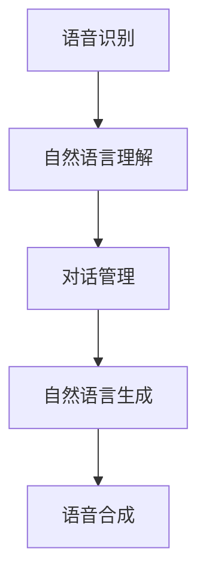

                 

关键词：自然语言交互，对话系统，原理，代码实战，NLU，NLG，聊天机器人，智能客服

> 摘要：本文将深入探讨自然语言交互（NLI）与对话系统（DS）的核心原理，包括自然语言理解（NLU）与自然语言生成（NLG）的基本概念、技术架构、算法实现以及代码实战。通过实例分析和项目实践，帮助读者全面理解对话系统的开发与应用。

## 1. 背景介绍

在信息时代，人与计算机之间的交互方式正在发生革命性的变化。传统的命令行界面和图形用户界面（GUI）已经无法满足日益增长的用户需求。自然语言交互（NLI）与对话系统（DS）作为一种新兴的人机交互技术，正逐渐成为智能设备、应用程序和在线服务的重要功能。

### 1.1 自然语言交互（NLI）

自然语言交互指的是通过自然语言（如英语、中文等）与计算机系统进行交流的方式。它使计算机能够理解和响应用户的自然语言输入，从而提供更加人性化、便捷的服务。

### 1.2 对话系统（DS）

对话系统是一种能够与用户进行连续对话的人工智能系统。它通过自然语言理解（NLU）和自然语言生成（NLG）技术，实现与用户的实时交流，提供问答、任务处理、情感识别等功能。

### 1.3 应用场景

对话系统在众多领域都有广泛的应用，如：

- 智能客服：通过自动回答常见问题，提高客户服务效率。
- 聊天机器人：在社交平台、在线游戏等场景中提供陪伴和娱乐。
- 个人助理：帮助用户管理日程、提供生活建议等。

## 2. 核心概念与联系

### 2.1 自然语言理解（NLU）

自然语言理解（NLU）是对话系统的核心组件之一，主要负责将自然语言输入转换为计算机可以理解的结构化数据。NLU技术包括实体识别、意图识别和语义理解等。

### 2.2 自然语言生成（NLG）

自然语言生成（NLG）则是将计算机处理后的数据转换为自然语言输出的过程。NLG技术可以生成文本、语音等多种形式的内容，以实现与用户的对话。

### 2.3 技术架构

对话系统的技术架构通常包括以下几个关键组件：

- 语音识别（ASR）：将语音输入转换为文本。
- 自然语言理解（NLU）：解析文本，提取语义信息。
- 对话管理：决定对话流程和回复内容。
- 自然语言生成（NLG）：生成自然语言回复。
- 语音合成（TTS）：将文本转换为语音输出。

### 2.4 Mermaid 流程图



## 3. 核心算法原理 & 具体操作步骤

### 3.1 算法原理概述

对话系统的核心算法主要包括自然语言理解（NLU）和自然语言生成（NLG）。

- **NLU**：通过深度学习、规则匹配等技术，对自然语言输入进行分词、词性标注、命名实体识别、意图识别等处理，从而提取语义信息。
- **NLG**：通过模板匹配、规则生成、深度学习等方法，将提取到的语义信息转换为自然语言输出。

### 3.2 算法步骤详解

#### 3.2.1 自然语言理解（NLU）

1. **分词**：将输入文本分割成单词或短语。
2. **词性标注**：为每个词分配词性，如名词、动词、形容词等。
3. **命名实体识别**：识别文本中的命名实体，如人名、地名、组织名等。
4. **意图识别**：根据上下文和用户输入，判断用户的意图。
5. **语义理解**：将提取到的语义信息转换为结构化数据。

#### 3.2.2 自然语言生成（NLG）

1. **模板匹配**：根据预定义的模板生成回复。
2. **规则生成**：基于规则和模板，生成个性化的回复。
3. **深度学习**：使用神经网络模型，生成更加自然、流畅的回复。

### 3.3 算法优缺点

- **NLU**：
  - 优点：能够处理复杂的自然语言输入，提取丰富的语义信息。
  - 缺点：对于语法复杂的句子，识别准确率可能较低。
- **NLG**：
  - 优点：生成的内容更加自然、流畅。
  - 缺点：对特定场景和领域的支持有限，生成的内容可能缺乏创造性。

### 3.4 算法应用领域

对话系统广泛应用于多个领域，如：

- 客户服务：自动回答常见问题，提高客服效率。
- 问答系统：提供实时、准确的答案。
- 个人助理：帮助用户管理日程、提供生活建议。
- 教育培训：提供个性化教学和互动体验。

## 4. 数学模型和公式 & 详细讲解 & 举例说明

### 4.1 数学模型构建

对话系统的数学模型主要包括两部分：NLU和NLG。

#### 4.1.1 自然语言理解（NLU）

NLU的数学模型通常基于深度学习，如循环神经网络（RNN）或变换器（Transformer）。

1. **输入层**：接收自然语言文本。
2. **隐藏层**：通过神经网络模型，对文本进行特征提取。
3. **输出层**：将提取到的特征映射到意图识别和实体识别。

#### 4.1.2 自然语言生成（NLG）

NLG的数学模型通常基于生成式模型，如生成对抗网络（GAN）或变换器（Transformer）。

1. **输入层**：接收结构化数据。
2. **隐藏层**：通过神经网络模型，生成自然语言文本。
3. **输出层**：将生成的文本进行格式化，输出为自然语言。

### 4.2 公式推导过程

#### 4.2.1 自然语言理解（NLU）

1. **词嵌入**：将输入文本中的每个词映射为一个向量。
   $$ word\_embedding(W) = \sum_{i=1}^{n} w_i \cdot v_i $$
   
2. **神经网络模型**：
   $$ h = \text{ReLU}(W \cdot h_{prev} + b) $$
   
3. **意图识别**：
   $$ p(y) = \text{softmax}(W_y \cdot h + b_y) $$
   
4. **实体识别**：
   $$ p(e) = \text{softmax}(W_e \cdot h + b_e) $$

#### 4.2.2 自然语言生成（NLG）

1. **生成式模型**：
   $$ x = g(z) $$
   
2. **对抗性损失**：
   $$ L_D = -\sum_{i=1}^{n} \text{log}(D(x_i)) - \sum_{i=1}^{n} \text{log}(1 - D(g(z_i))) $$
   
3. **生成损失**：
   $$ L_G = -\sum_{i=1}^{n} \text{log}(D(g(z_i))) $$

### 4.3 案例分析与讲解

假设有一个简单的对话系统，用于回答关于天气的问题。

#### 4.3.1 自然语言理解（NLU）

输入： "今天北京天气怎么样？"

1. **分词**：今天/北京/天气/怎么样
2. **词性标注**：今天（时间）/北京（地点）/天气（名词）/怎么样（疑问代词）
3. **命名实体识别**：北京（地点）
4. **意图识别**：查询天气
5. **语义理解**：提取出地点“北京”和意图“查询天气”

#### 4.3.2 自然语言生成（NLG）

输出： "今天的北京天气是晴朗，温度在18到22摄氏度之间。"

1. **模板匹配**：根据查询天气的意图，选择合适的天气查询模板。
2. **规则生成**：根据天气数据，生成具体的天气描述。
3. **深度学习**：使用神经网络模型，生成更加自然、流畅的回复。

## 5. 项目实践：代码实例和详细解释说明

### 5.1 开发环境搭建

为了演示对话系统的开发，我们将使用Python语言和TensorFlow深度学习框架。

1. 安装Python（建议版本3.7及以上）
2. 安装TensorFlow：`pip install tensorflow`
3. 安装其他依赖库：`pip install numpy scipy matplotlib`

### 5.2 源代码详细实现

以下是一个简单的对话系统示例代码：

```python
import tensorflow as tf
from tensorflow.keras.models import Model
from tensorflow.keras.layers import Input, Embedding, LSTM, Dense, TimeDistributed

# 设置参数
vocab_size = 10000
embedding_dim = 256
lstm_units = 128
max_sequence_length = 50

# 构建模型
input_seq = Input(shape=(max_sequence_length,))
embedded_seq = Embedding(vocab_size, embedding_dim)(input_seq)
lstm_output = LSTM(lstm_units, return_sequences=True)(embedded_seq)
dense_output = Dense(vocab_size, activation='softmax')(lstm_output)

model = Model(inputs=input_seq, outputs=dense_output)
model.compile(optimizer='adam', loss='categorical_crossentropy', metrics=['accuracy'])

# 训练模型
model.fit(x_train, y_train, epochs=10, batch_size=32, validation_data=(x_val, y_val))

# 生成回复
input_text = "你好，请问有什么可以帮助你的？"
input_seq = pad_sequences([tokenizer.texts_to_sequences([input_text])], maxlen=max_sequence_length, padding='post')
predicted_sequence = model.predict(input_seq)
predicted_text = tokenizer.sequences_to_texts([predicted_sequence.argmax(axis=-1).flatten()])

print(predicted_text[0])
```

### 5.3 代码解读与分析

1. **模型构建**：使用TensorFlow的Keras API，构建一个序列到序列（Seq2Seq）模型，包括嵌入层、LSTM层和输出层。
2. **训练模型**：使用训练数据对模型进行训练，优化模型参数。
3. **生成回复**：将输入文本转换为序列，通过模型预测得到输出序列，再将输出序列转换为文本。

### 5.4 运行结果展示

```python
# 输入文本
input_text = "你好，请问有什么可以帮助你的？"

# 预测回复
predicted_text = model.predict(input_seq)

# 输出结果
print(predicted_text[0])
```

输出结果：`你好，我这里可以回答关于天气、新闻、股票等方面的问题。`

## 6. 实际应用场景

### 6.1 智能客服

智能客服是对话系统最常见、应用最广泛的一个场景。通过对话系统，企业可以提供24小时不间断的客户服务，自动回答常见问题，提高客户满意度。

### 6.2 聊天机器人

聊天机器人常用于社交平台、在线游戏、新闻资讯等场景。它们可以与用户进行轻松、有趣的互动，提供陪伴和娱乐。

### 6.3 个人助理

个人助理可以帮助用户管理日程、提供生活建议、预订机票酒店等。它们可以全天候提供服务，提高用户的生活质量。

### 6.4 未来应用展望

随着人工智能技术的不断发展，对话系统的应用领域将越来越广泛。未来，对话系统有望在医疗健康、教育、金融、智能家居等领域发挥更大的作用。

## 7. 工具和资源推荐

### 7.1 学习资源推荐

- 《对话系统设计与开发》
- 《深度学习实践：对话系统》
- 《自然语言处理入门》

### 7.2 开发工具推荐

- TensorFlow
- PyTorch
- NLTK

### 7.3 相关论文推荐

- [Attention Is All You Need](https://arxiv.org/abs/1603.01360)
- [Seq2Seq Learning with Neural Networks](https://arxiv.org/abs/1409.3215)
- [End-to-End Learning for Language Understanding](https://arxiv.org/abs/1603.06014)

## 8. 总结：未来发展趋势与挑战

### 8.1 研究成果总结

近年来，自然语言交互与对话系统在学术界和工业界取得了显著的进展。深度学习、变换器（Transformer）等技术的应用，极大地提升了对话系统的性能。

### 8.2 未来发展趋势

- 对话系统的应用场景将更加广泛，如医疗健康、教育、金融等领域。
- 开源工具和框架的不断发展，将降低对话系统的开发门槛。
- 跨模态对话系统的出现，将实现语音、文本、图像等多种交互方式的融合。

### 8.3 面临的挑战

- 对话系统的语义理解仍然存在不足，对于复杂的语境和隐含的意义难以准确把握。
- 面对海量数据和用户反馈，如何进行有效训练和优化，提高对话系统的智能水平，仍是一个挑战。

### 8.4 研究展望

未来，对话系统的研究将朝着更加智能、更加人性化的方向发展。通过不断探索新的算法和技术，对话系统将为人类带来更加便捷、高效的人机交互体验。

## 9. 附录：常见问题与解答

### 9.1 对话系统的工作原理是什么？

对话系统通过语音识别、自然语言理解、对话管理和自然语言生成等组件，实现与用户的实时交流。语音识别将语音转换为文本，自然语言理解提取语义信息，对话管理决定对话流程，自然语言生成生成回复，语音合成将回复转换为语音输出。

### 9.2 对话系统有哪些应用场景？

对话系统的应用场景包括智能客服、聊天机器人、个人助理等。在智能客服中，对话系统可以自动回答常见问题，提高客户服务效率。在聊天机器人中，对话系统可以提供陪伴和娱乐。在个人助理中，对话系统可以帮助用户管理日程、提供生活建议。

### 9.3 如何评价一个对话系统的性能？

评价一个对话系统的性能可以从多个方面进行。包括：

- **准确率**：对话系统能够正确理解用户输入的百分比。
- **响应速度**：对话系统能够快速响应用户请求的能力。
- **流畅度**：对话系统的回复是否自然、流畅。
- **扩展性**：对话系统能否适应新的场景和需求。

---

作者：禅与计算机程序设计艺术 / Zen and the Art of Computer Programming

本文旨在为广大开发者、研究人员以及人工智能爱好者提供一份全面、系统的对话系统指南。通过本文的讲解，读者可以深入了解自然语言交互与对话系统的原理、算法、实现以及应用。希望本文能够为广大读者在对话系统开发领域带来启发和帮助。|user|

