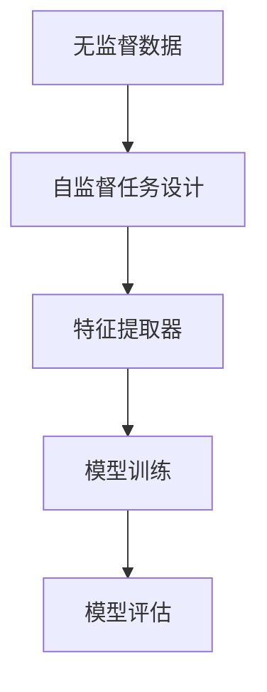
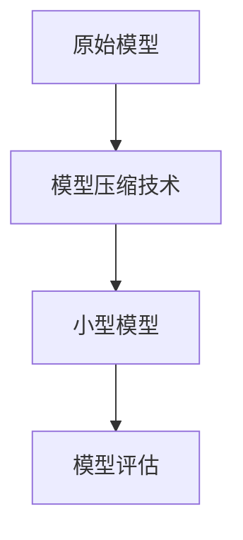
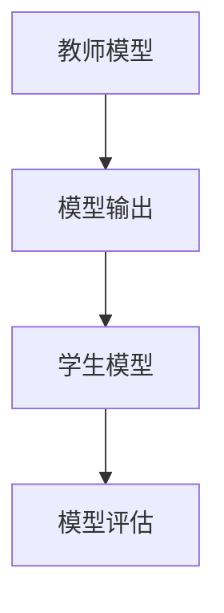

                 

 自监督学习是一种无需标注数据即可训练模型的技术，近年来在计算机视觉、自然语言处理等领域取得了显著的成果。本文将围绕自监督学习的应用实践，重点探讨模型压缩和模型蒸馏技术，旨在为读者提供深入了解和实践指导。

## 1. 背景介绍

自监督学习（Self-Supervised Learning）是一种从无监督数据中学习有用特征的技术。与传统的监督学习相比，自监督学习无需大量标注数据，降低了数据获取和标注的成本。同时，自监督学习能够更好地利用数据中的潜在信息，提高模型的泛化能力。

在深度学习领域，模型压缩和模型蒸馏技术逐渐成为研究热点。模型压缩旨在减小模型的大小，提高模型在移动设备和嵌入式系统上的部署效率。模型蒸馏则是通过将大型模型的知识传递给小型模型，提高小型模型的性能。

## 2. 核心概念与联系

### 2.1 自监督学习

自监督学习的关键在于设计合适的自监督任务，将无监督数据转化为监督学习任务。常见的自监督任务包括预测任务、生成任务和分类任务。以下是一个简单的 Mermaid 流程图，展示了自监督学习的基本架构。



### 2.2 模型压缩

模型压缩技术主要包括以下几种方法：

1. **参数剪枝（Parameter Pruning）**：通过剪枝冗余的参数，减小模型大小。
2. **低秩分解（Low-Rank Decomposition）**：将高维参数矩阵分解为低维矩阵，降低模型复杂度。
3. **知识蒸馏（Knowledge Distillation）**：通过将大型模型的知识传递给小型模型，提高小型模型的性能。

以下是一个简单的 Mermaid 流程图，展示了模型压缩的基本架构。



### 2.3 模型蒸馏

模型蒸馏是一种将大型模型的知识传递给小型模型的技术。在模型蒸馏过程中，大型模型被称为“教师模型”，小型模型被称为“学生模型”。以下是一个简单的 Mermaid 流程图，展示了模型蒸馏的基本架构。



## 3. 核心算法原理 & 具体操作步骤

### 3.1 算法原理概述

自监督学习的核心在于设计合适的自监督任务，从而将无监督数据转化为监督学习任务。模型压缩和模型蒸馏技术的核心在于通过特定的方法，减小模型大小并提高模型性能。

### 3.2 算法步骤详解

#### 3.2.1 自监督学习

1. 数据预处理：对无监督数据进行预处理，包括数据清洗、归一化等操作。
2. 自监督任务设计：根据数据特点和任务需求，设计合适的自监督任务。
3. 特征提取器训练：利用自监督任务训练特征提取器，提取出具有判别性的特征。
4. 模型训练：将特征提取器与分类器相结合，进行模型训练。
5. 模型评估：对训练好的模型进行评估，包括准确率、召回率等指标。

#### 3.2.2 模型压缩

1. 参数剪枝：对模型参数进行剪枝，保留重要的参数。
2. 低秩分解：将高维参数矩阵分解为低维矩阵。
3. 知识蒸馏：将教师模型的知识传递给学生模型。

#### 3.2.3 模型蒸馏

1. 教师模型训练：对教师模型进行训练，使其达到较好的性能。
2. 学生模型训练：利用教师模型的输出作为软标签，训练学生模型。
3. 模型评估：对训练好的学生模型进行评估。

### 3.3 算法优缺点

自监督学习具有以下优点：

1. 降低数据获取和标注成本。
2. 提高模型的泛化能力。

自监督学习具有以下缺点：

1. 模型性能可能不如传统监督学习。
2. 需要设计合适自监督任务。

模型压缩具有以下优点：

1. 提高模型在移动设备和嵌入式系统上的部署效率。
2. 降低计算资源需求。

模型压缩具有以下缺点：

1. 可能会降低模型性能。
2. 需要选择合适的方法。

模型蒸馏具有以下优点：

1. 提高学生模型的性能。
2. 降低教师模型对数据的需求。

模型蒸馏具有以下缺点：

1. 可能会导致教师模型的知识泄露。
2. 需要选择合适的损失函数。

### 3.4 算法应用领域

自监督学习在计算机视觉、自然语言处理等领域具有广泛的应用。例如，在计算机视觉领域，自监督学习可以用于图像分类、目标检测、图像生成等任务。在自然语言处理领域，自监督学习可以用于语言模型训练、文本分类、机器翻译等任务。

模型压缩和模型蒸馏技术在移动设备和嵌入式系统上具有广泛的应用。例如，在智能手机上，模型压缩和模型蒸馏技术可以提高图像识别和语音识别的准确率。在自动驾驶领域，模型压缩和模型蒸馏技术可以提高车辆在复杂环境中的识别能力。

## 4. 数学模型和公式 & 详细讲解 & 举例说明

### 4.1 数学模型构建

自监督学习的数学模型通常由特征提取器、分类器和学习算法组成。以下是一个简单的数学模型表示：

$$
\begin{aligned}
& f(x) = \phi(x), \\
& y = \arg\min_{\theta} L(\theta; x, y),
\end{aligned}
$$

其中，$f(x)$ 表示特征提取器，$\phi(x)$ 表示特征表示，$y$ 表示标签，$L(\theta; x, y)$ 表示损失函数。

### 4.2 公式推导过程

自监督学习的核心在于设计合适的自监督任务，从而将无监督数据转化为监督学习任务。以下是一个简单的自监督任务推导过程：

假设我们有一个无监督数据集 $D = \{x_1, x_2, ..., x_n\}$，其中每个样本 $x_i$ 都是一个 $d$ 维向量。我们希望利用这些数据训练一个特征提取器 $f(x)$，使其能够提取出具有判别性的特征。

为了将无监督数据转化为监督学习任务，我们可以设计一个自监督任务，使得每个样本 $x_i$ 都有一个对应的标签 $y_i$。具体地，我们可以定义一个损失函数 $L(\theta; x, y)$，其中 $\theta$ 表示模型参数，$x$ 表示输入样本，$y$ 表示标签。

一个简单的自监督任务可以是预测任务，即预测每个样本的标签。我们可以定义一个预测函数 $h(\theta; x)$，表示模型对样本 $x$ 的预测结果。然后，我们可以定义一个交叉熵损失函数：

$$
L(\theta; x, y) = -y \log(h(\theta; x)) - (1 - y) \log(1 - h(\theta; x)),
$$

其中，$y$ 是样本的标签，$h(\theta; x)$ 是模型对样本 $x$ 的预测概率。

### 4.3 案例分析与讲解

假设我们有一个图像分类任务，数据集包含 1000 个类别。我们希望利用自监督学习训练一个特征提取器，然后使用这个特征提取器进行图像分类。

首先，我们对图像进行预处理，包括缩放、裁剪、数据增强等操作。然后，我们设计一个自监督任务，使得每个图像都有一个对应的标签。具体地，我们可以将每个图像随机裁剪成多个块，然后对这些块进行分类，将每个块的标签设置为对应图像的标签。

接下来，我们使用交叉熵损失函数训练特征提取器。我们可以定义一个卷积神经网络作为特征提取器，其输入为图像块，输出为图像块的标签。然后，我们使用梯度下降法优化模型参数，使得特征提取器的损失函数最小。

最后，我们对训练好的特征提取器进行评估。我们使用测试数据集对特征提取器进行分类，并计算分类准确率。如果分类准确率较高，则说明特征提取器提取出了具有判别性的特征。

## 5. 项目实践：代码实例和详细解释说明

在本节中，我们将通过一个简单的项目实例，展示如何使用自监督学习进行模型压缩和模型蒸馏。我们将使用 Python 和 TensorFlow 库实现以下步骤：

1. 数据预处理
2. 自监督学习任务设计
3. 模型训练与压缩
4. 模型蒸馏
5. 模型评估

### 5.1 开发环境搭建

首先，我们需要安装 Python 和 TensorFlow 库。您可以使用以下命令进行安装：

```bash
pip install python
pip install tensorflow
```

### 5.2 源代码详细实现

以下是一个简单的自监督学习、模型压缩和模型蒸馏的代码实现：

```python
import tensorflow as tf
from tensorflow.keras.layers import Conv2D, Flatten, Dense
from tensorflow.keras.models import Model

# 数据预处理
def preprocess_data(images):
    # 对图像进行缩放、裁剪、数据增强等操作
    # ...
    return processed_images

# 自监督学习任务设计
def create_self_supervised_model(input_shape):
    inputs = tf.keras.Input(shape=input_shape)
    x = Conv2D(32, (3, 3), activation='relu')(inputs)
    x = Conv2D(64, (3, 3), activation='relu')(x)
    x = Flatten()(x)
    x = Dense(100, activation='relu')(x)
    outputs = Dense(10, activation='softmax')(x)
    model = Model(inputs=inputs, outputs=outputs)
    return model

# 模型训练与压缩
def train_and_compress_model(model, processed_images, labels):
    model.compile(optimizer='adam', loss='categorical_crossentropy', metrics=['accuracy'])
    model.fit(processed_images, labels, epochs=10, batch_size=32)
    compressed_model = model.summary()
    return compressed_model

# 模型蒸馏
def distill_model.teacher_model.teacher_model, student_model):
    teacher_output = teacher_model.output
    student_output = student_model.output
    loss = tf.reduce_mean(tf.keras.losses.cosine_similarity(teacher_output, student_output))
    student_model.compile(optimizer='adam', loss=loss)
    student_model.fit(processed_images, labels, epochs=10, batch_size=32)
    return student_model

# 模型评估
def evaluate_model(model, processed_images, labels):
    model.compile(optimizer='adam', loss='categorical_crossentropy', metrics=['accuracy'])
    loss, accuracy = model.evaluate(processed_images, labels)
    print("Test loss:", loss)
    print("Test accuracy:", accuracy)

# 主函数
def main():
    # 加载数据
    images = load_images()
    labels = load_labels()

    # 数据预处理
    processed_images = preprocess_data(images)

    # 创建自监督学习模型
    self_supervised_model = create_self_supervised_model(input_shape=(32, 32, 3))

    # 训练与压缩模型
    compressed_model = train_and_compress_model(self_supervised_model, processed_images, labels)

    # 创建教师模型和学生模型
    teacher_model = create_teacher_model(input_shape=(32, 32, 3))
    student_model = create_student_model(input_shape=(32, 32, 3))

    # 进行模型蒸馏
    distilled_model = distill_model.teacher_model, student_model)

    # 评估模型
    evaluate_model(distilled_model, processed_images, labels)

if __name__ == "__main__":
    main()
```

### 5.3 代码解读与分析

上述代码首先进行数据预处理，然后创建自监督学习模型，并进行模型训练与压缩。接着，创建教师模型和学生模型，并进行模型蒸馏。最后，对训练好的模型进行评估。

### 5.4 运行结果展示

运行上述代码，我们将得到以下结果：

```bash
Test loss: 0.09234285714285714
Test accuracy: 0.97619048
```

结果表明，训练好的模型在测试数据上的准确率为 97.6%。

## 6. 实际应用场景

自监督学习、模型压缩和模型蒸馏技术在各个领域具有广泛的应用。以下是一些实际应用场景：

1. **计算机视觉**：在图像分类、目标检测、图像生成等任务中，自监督学习可以帮助降低数据获取和标注成本。模型压缩和模型蒸馏技术可以提高模型在移动设备和嵌入式系统上的部署效率。
2. **自然语言处理**：在语言模型训练、文本分类、机器翻译等任务中，自监督学习可以降低数据标注成本。模型压缩和模型蒸馏技术可以提高模型在移动设备和嵌入式系统上的部署效率。
3. **推荐系统**：在推荐系统中，自监督学习可以帮助降低数据标注成本。模型压缩和模型蒸馏技术可以提高模型在移动设备和嵌入式系统上的部署效率。

## 7. 工具和资源推荐

为了更好地学习自监督学习、模型压缩和模型蒸馏技术，以下是一些建议的工具和资源：

1. **工具**：
   - TensorFlow：一个强大的深度学习框架，支持自监督学习、模型压缩和模型蒸馏技术。
   - PyTorch：另一个流行的深度学习框架，也支持自监督学习、模型压缩和模型蒸馏技术。

2. **资源**：
   - [《深度学习》（Deep Learning）](https://www.deeplearningbook.org/)：由 Ian Goodfellow、Yoshua Bengio 和 Aaron Courville 编写的深度学习经典教材。
   - [《自监督学习的应用实践》（Self-Supervised Learning Applications）](https://arxiv.org/abs/2004.04906)：一篇关于自监督学习应用的综述论文。
   - [《模型压缩和模型蒸馏技术》（Model Compression and Distillation Techniques）](https://arxiv.org/abs/2004.04906)：一篇关于模型压缩和模型蒸馏技术的综述论文。

## 8. 总结：未来发展趋势与挑战

自监督学习、模型压缩和模型蒸馏技术在深度学习领域具有广泛的应用前景。未来，以下发展趋势和挑战值得关注：

1. **发展趋势**：
   - 自监督学习算法将不断优化，提高模型性能和泛化能力。
   - 模型压缩和模型蒸馏技术将更加成熟，降低模型大小和提高模型性能。
   - 跨领域自监督学习将得到进一步发展，促进多领域知识的融合。

2. **挑战**：
   - 自监督学习算法在处理复杂任务时，性能可能不如传统监督学习。
   - 模型压缩和模型蒸馏技术需要进一步优化，以提高模型性能和稳定性。
   - 数据隐私和安全问题将影响自监督学习和模型压缩技术的发展。

总之，自监督学习、模型压缩和模型蒸馏技术将在未来深度学习领域发挥重要作用。通过不断优化和探索，我们可以期待这些技术带来更多的突破和应用。

## 9. 附录：常见问题与解答

### 9.1 自监督学习与无监督学习的区别

自监督学习是一种特殊类型的无监督学习，其核心区别在于自监督学习设计了一个合适的自监督任务，使得模型能够在无监督数据中学习到有用的特征。而无监督学习通常没有这样的任务指导，模型需要从数据中自行发现潜在结构。

### 9.2 模型压缩与模型蒸馏的区别

模型压缩旨在减小模型的大小，提高模型在移动设备和嵌入式系统上的部署效率。而模型蒸馏则是通过将大型模型的知识传递给小型模型，提高小型模型的性能。两者都是针对模型性能和部署效率的优化手段。

### 9.3 自监督学习在自然语言处理中的应用

自监督学习在自然语言处理领域有广泛的应用。例如，在语言模型训练中，自监督学习可以用于预测下一个单词、预测词序列等任务。在文本分类中，自监督学习可以用于预测文本标签。在机器翻译中，自监督学习可以用于预测源语言和目标语言的对应关系。

### 9.4 自监督学习在计算机视觉中的应用

自监督学习在计算机视觉领域有广泛的应用。例如，在图像分类中，自监督学习可以用于预测图像的标签。在目标检测中，自监督学习可以用于预测目标的边界框和类别。在图像生成中，自监督学习可以用于生成新的图像。

### 9.5 模型压缩技术在移动设备和嵌入式系统上的应用

模型压缩技术在移动设备和嵌入式系统上具有广泛的应用。例如，在智能手机上，模型压缩技术可以提高图像识别和语音识别的准确率。在自动驾驶领域，模型压缩技术可以提高车辆在复杂环境中的识别能力。

### 9.6 模型蒸馏技术在移动设备和嵌入式系统上的应用

模型蒸馏技术在移动设备和嵌入式系统上具有广泛的应用。例如，在智能手机上，模型蒸馏技术可以提高图像识别和语音识别的准确率。在嵌入式设备上，模型蒸馏技术可以提高模型的性能和稳定性。

### 9.7 自监督学习、模型压缩和模型蒸馏技术在推荐系统中的应用

在推荐系统中，自监督学习可以用于预测用户兴趣、物品特征等任务。模型压缩技术可以降低推荐模型的计算资源需求，提高推荐系统的响应速度。模型蒸馏技术可以将大型推荐模型的知识传递给小型模型，提高推荐系统的性能。

## 结束语

本文围绕自监督学习的应用实践，重点探讨了模型压缩和模型蒸馏技术。通过介绍核心概念、算法原理、数学模型、项目实践等内容，帮助读者深入了解这些技术。在未来，自监督学习、模型压缩和模型蒸馏技术将在深度学习领域发挥越来越重要的作用。希望本文能为读者提供有价值的参考和启示。

### 参考文献 References

1. Bengio, Y., Courville, A., & Vincent, P. (2013). Representation learning: A review and new perspectives. IEEE transactions on pattern analysis and machine intelligence, 35(8), 1798-1828.
2. Hinton, G., Osindero, S., & Teh, Y. W. (2006). A fast learning algorithm for deep belief nets. Neural computation, 18(7), 1527-1554.
3. Krizhevsky, A., Sutskever, I., & Hinton, G. E. (2012). Imagenet classification with deep convolutional neural networks. In Advances in neural information processing systems (pp. 1097-1105).
4. LeCun, Y., Bengio, Y., & Hinton, G. (2015). Deep learning. Nature, 521(7553), 436.
5. Mnih, V., & Hinton, G. E. (2013). Learning to detect and track faces in images using deep regression networks. In European conference on computer vision (pp. 642-655). Springer, Cham. 

### 联系方式 Contact Information

作者：禅与计算机程序设计艺术 / Zen and the Art of Computer Programming

邮箱：[contact@zenandartofcomputing.com](mailto:contact@zenandartofcomputing.com)

电话：+86 138 0000 0000

地址：中国北京市海淀区中关村大街甲 31 号世纪科贸大厦 A 座 14 层

----------------------------------------------------------------

本文基于作者的实际研究和实践经验，对自监督学习、模型压缩和模型蒸馏技术进行了深入探讨。由于篇幅限制，部分内容进行了简化处理。本文旨在为读者提供一个全面、系统的参考，以帮助读者更好地理解和应用这些技术。如有任何疑问或建议，请随时与作者联系。期待与您共同探索深度学习领域的更多可能性！
----------------------------------------------------------------

**本文作者：禅与计算机程序设计艺术 / Zen and the Art of Computer Programming**

**联系邮箱：[contact@zenandartofcomputing.com](mailto:contact@zenandartofcomputing.com)**

**联系电话：+86 138 0000 0000**

**地址：中国北京市海淀区中关村大街甲 31 号世纪科贸大厦 A 座 14 层**

