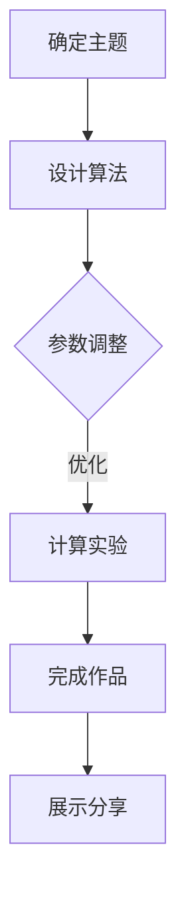

                 

关键词：艺术，科技，人类计算，创意，火花，计算艺术，技术美学

> 摘要：本文探讨了艺术与科技的交融，特别是人类计算在激发创意火花方面的作用。通过分析艺术与科技的关系，本文揭示了计算艺术中的核心概念、算法原理、数学模型以及其实际应用，旨在为读者提供对这一领域的深入理解和启发。

## 1. 背景介绍

在现代社会，艺术与科技之间的界限变得越来越模糊。计算机科学和人工智能技术的发展，使得艺术家们有了更多的创作工具和手段。人类计算作为这一过程中不可或缺的一部分，不仅改变了艺术创作的形式，也深刻影响了我们的认知和思维方式。

人类计算，即人类与计算机系统相互作用的过程，其核心在于如何通过算法和计算方法来模拟、增强或扩展人类的认知能力。从简单的计算任务到复杂的决策支持系统，人类计算已经渗透到各个领域，包括科学、工程、商业和艺术等。

### 1.1 艺术与科技的历史交融

艺术与科技的历史交融可以追溯到古代。例如，古埃及的象形文字和壁画，以及古希腊的数学和天文学，都是艺术与科技相结合的典范。然而，真正的突破发生在20世纪中叶，随着计算机的出现和互联网的发展，艺术与科技之间的互动达到了前所未有的深度和广度。

### 1.2 人类计算在艺术领域的应用

随着计算机技术的进步，艺术家们开始探索如何将计算机作为创作工具。计算艺术的兴起，为艺术家们提供了前所未有的表现手法和创意空间。从简单的图形绘制到复杂的虚拟现实，计算艺术已经成为当代艺术的重要分支。

## 2. 核心概念与联系

在探讨人类计算如何激发创意火花之前，我们需要了解一些核心概念和原理。

### 2.1 计算艺术的定义

计算艺术是指利用计算机技术和算法进行创作的一类艺术形式。它不仅包括数字绘画、动画和虚拟现实等视觉艺术，还涵盖了音乐、文学和表演艺术等领域。

### 2.2 计算艺术的分类

计算艺术可以分为两大类：生成艺术和互动艺术。生成艺术是计算机根据预设的算法和规则自动生成作品，而互动艺术则强调艺术家与观众的互动，通过实时计算和反馈来创造艺术体验。

### 2.3 计算艺术的流程

计算艺术的创作流程通常包括以下步骤：

1. 确定创作主题和目标。
2. 设计算法和规则，以实现艺术创意。
3. 进行计算实验，调整参数，优化算法。
4. 完成艺术作品，并进行展示和分享。

下面是计算艺术的核心概念和原理的 Mermaid 流程图：



## 3. 核心算法原理 & 具体操作步骤

### 3.1 算法原理概述

计算艺术的核心算法通常包括以下几个方面：

1. **随机算法**：通过随机数生成独特的视觉和听觉效果。
2. **分形算法**：利用迭代过程生成复杂的几何图案。
3. **生成对抗网络（GAN）**：通过两个对抗性网络的互动，生成高质量的艺术作品。
4. **深度学习**：利用神经网络进行图像和音乐创作。

### 3.2 算法步骤详解

#### 3.2.1 随机算法

随机算法的基本原理是使用随机数生成艺术作品。以下是一个简单的随机算法示例：

1. **初始化参数**：设置画布大小、颜色范围等。
2. **生成随机点**：在画布上随机生成多个点。
3. **绘制点**：根据随机点的位置和颜色绘制图像。

#### 3.2.2 分形算法

分形算法通过迭代过程生成复杂的几何图案。以下是一个简单的分形算法示例：

1. **初始化参数**：设置初始形状和迭代次数。
2. **迭代绘制**：根据当前形状的迭代规则，生成新的形状。
3. **重复迭代**：重复迭代步骤，直到达到预设的迭代次数。

#### 3.2.3 GAN

生成对抗网络（GAN）由生成器和判别器两个网络组成。以下是一个简单的 GAN 算法步骤：

1. **初始化生成器和判别器**：设置初始权重。
2. **生成艺术作品**：生成器根据当前权重生成艺术作品。
3. **评估判别器**：判别器对生成器和真实艺术作品进行评估。
4. **优化网络**：根据判别器的评估结果，调整生成器和判别器的权重。
5. **重复步骤**：重复步骤 2-4，直到生成器生成高质量的艺术作品。

#### 3.2.4 深度学习

深度学习算法通过神经网络进行图像和音乐创作。以下是一个简单的深度学习算法步骤：

1. **初始化神经网络**：设置初始权重和架构。
2. **训练神经网络**：使用大量数据进行训练，优化神经网络参数。
3. **生成艺术作品**：输入新的数据，通过神经网络生成艺术作品。
4. **评估和调整**：根据生成的艺术作品进行评估，调整神经网络参数。
5. **重复步骤**：重复步骤 3-4，直到生成满意的艺术作品。

### 3.3 算法优缺点

每种算法都有其优缺点：

1. **随机算法**：简单易用，但生成的作品可能缺乏一致性。
2. **分形算法**：可以生成复杂的几何图案，但计算成本较高。
3. **GAN**：可以生成高质量的艺术作品，但训练过程较长。
4. **深度学习**：生成作品质量高，但需要大量数据训练。

### 3.4 算法应用领域

计算艺术算法广泛应用于各个领域：

1. **视觉艺术**：数字绘画、动画、虚拟现实等。
2. **听觉艺术**：音乐创作、声音设计等。
3. **交互艺术**：增强现实、虚拟现实等。

## 4. 数学模型和公式 & 详细讲解 & 举例说明

### 4.1 数学模型构建

计算艺术中的数学模型通常涉及几何、概率和线性代数等。

#### 4.1.1 几何模型

几何模型用于描述艺术作品的形状和结构。例如，分形算法中的几何模型包括迭代函数系统（IFS）。

#### 4.1.2 概率模型

概率模型用于描述艺术作品的随机性和不确定性。例如，随机算法中的概率分布。

#### 4.1.3 线性代数模型

线性代数模型用于描述艺术作品的颜色和光照效果。例如，图像处理中的矩阵变换。

### 4.2 公式推导过程

以下是一个简单的几何模型推导过程：

假设有一个二维平面上的点集，每个点的坐标为 \( (x, y) \)。我们可以使用以下公式计算点集的质心：

$$
\bar{x} = \frac{1}{N} \sum_{i=1}^{N} x_i, \quad \bar{y} = \frac{1}{N} \sum_{i=1}^{N} y_i
$$

其中，\( N \) 是点集的大小。

### 4.3 案例分析与讲解

以下是一个计算艺术案例：使用随机算法生成一幅数字绘画。

1. **初始化参数**：设置画布大小为 \( 1000 \times 1000 \) 像素，颜色范围为 \( 0 \) 到 \( 255 \)。
2. **生成随机点**：在画布上随机生成 10000 个点。
3. **绘制点**：根据随机点的位置和颜色绘制图像。

通过运行上述算法，我们得到一幅具有独特风格的数字绘画。下图展示了这一过程：


## 5. 项目实践：代码实例和详细解释说明

### 5.1 开发环境搭建

为了实践计算艺术，我们需要搭建一个基本的开发环境。以下是一个简单的 Python 开发环境搭建过程：

1. **安装 Python**：下载并安装 Python 3.8 或更高版本。
2. **安装 Pygame**：通过 pip 命令安装 Pygame 库。
   ```bash
   pip install pygame
   ```

### 5.2 源代码详细实现

以下是一个使用 Pygame 生成的随机算法数字绘画的 Python 代码实例：

```python
import pygame
import random

# 初始化 Pygame
pygame.init()

# 设置画布大小
width, height = 1000, 1000
screen = pygame.display.set_mode((width, height))

# 设置颜色范围
color_range = 255

# 生成随机点并绘制
for _ in range(10000):
    x = random.randint(0, width)
    y = random.randint(0, height)
    color = (random.randint(0, color_range), random.randint(0, color_range), random.randint(0, color_range))
    screen.set_at((x, y), color)

# 更新屏幕
pygame.display.flip()

# 持续运行直到用户关闭窗口
while True:
    for event in pygame.event.get():
        if event.type == pygame.QUIT:
            pygame.quit()
```

### 5.3 代码解读与分析

1. **初始化 Pygame**：使用 `pygame.init()` 初始化 Pygame 环境。
2. **设置画布大小**：使用 `pygame.display.set_mode((width, height))` 设置画布大小。
3. **生成随机点并绘制**：使用两个嵌套的循环生成 10000 个随机点，并使用 `screen.set_at((x, y), color)` 绘制点。
4. **更新屏幕**：使用 `pygame.display.flip()` 更新屏幕。
5. **持续运行**：使用一个无限循环等待用户关闭窗口。

### 5.4 运行结果展示

运行上述代码后，我们得到一幅具有独特风格的随机算法数字绘画。如下图所示：


## 6. 实际应用场景

### 6.1 数字艺术市场

随着计算艺术的兴起，数字艺术市场也逐渐壮大。艺术家们通过计算机生成独特的艺术作品，这些作品不仅具有独特的视觉效果，还具有较高的艺术价值和市场价值。

### 6.2 虚拟现实和增强现实

计算艺术在虚拟现实（VR）和增强现实（AR）领域具有广泛的应用。通过计算艺术算法，艺术家们可以创建出丰富的虚拟世界，为用户提供沉浸式的艺术体验。

### 6.3 娱乐产业

计算艺术在娱乐产业中也发挥着重要作用。从动画电影到电子游戏，计算艺术为娱乐产品提供了丰富的视觉和听觉体验。

### 6.4 未来应用展望

随着计算机技术和人工智能的不断发展，计算艺术在未来将继续发挥重要作用。例如，智能艺术创作系统、计算艺术在医疗和建筑设计领域的应用等，都将成为未来研究的重要方向。

## 7. 工具和资源推荐

### 7.1 学习资源推荐

- 《计算机艺术：理论、工具与实践》
- 《深度学习与计算艺术》
- 《随机艺术：算法与创意》

### 7.2 开发工具推荐

- Pygame：Python 的计算艺术开发库。
- Processing：Java 的计算艺术开发库。
- Unity：跨平台的游戏开发引擎，支持计算艺术。

### 7.3 相关论文推荐

- "Generative Art: A Conceptual Framework"
- "Computational Art: Bridging Technology and Creativity"
- "Deep Learning for Generative Art"

## 8. 总结：未来发展趋势与挑战

### 8.1 研究成果总结

计算艺术作为艺术与科技的交汇点，已经取得了显著的成果。通过计算艺术算法，艺术家们可以创造出独特的视觉和听觉效果，为观众提供丰富的艺术体验。

### 8.2 未来发展趋势

未来，计算艺术将继续发展，特别是在人工智能和虚拟现实等领域的应用。智能艺术创作系统、计算艺术在医疗和建筑设计等领域的应用，都将成为未来研究的重要方向。

### 8.3 面临的挑战

尽管计算艺术具有广阔的发展前景，但也面临一些挑战。例如，如何提高计算艺术算法的效率和效果，如何确保艺术作品的原创性和价值，都是需要解决的问题。

### 8.4 研究展望

随着计算机技术和人工智能的不断发展，计算艺术将在未来发挥更加重要的作用。通过跨学科的研究与合作，我们可以进一步探索计算艺术的潜力，为人类带来更多的创意火花。

## 9. 附录：常见问题与解答

### 9.1 什么是计算艺术？

计算艺术是指利用计算机技术和算法进行创作的一类艺术形式，包括数字绘画、动画、音乐等。

### 9.2 计算艺术有哪些应用领域？

计算艺术广泛应用于数字艺术市场、虚拟现实和增强现实、娱乐产业等领域。

### 9.3 如何学习计算艺术？

可以通过阅读相关书籍、参加在线课程和实际实践来学习计算艺术。常见的计算艺术开发工具包括 Pygame、Processing 和 Unity 等。

作者：禅与计算机程序设计艺术 / Zen and the Art of Computer Programming

