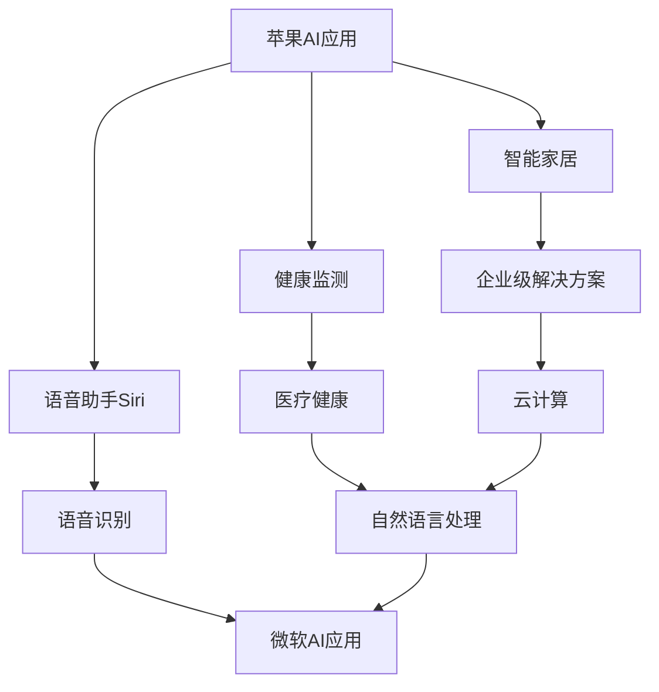

                 

 关键词：苹果，微软，人工智能，深度学习，技术动态，创新，产品发布，行业趋势。

> 摘要：本文将深入探讨苹果和微软在人工智能领域的最新动态，分析两公司在AI研究、产品开发、技术应用等方面的进展，以及它们在推动AI行业发展中的角色和影响。通过对比分析，我们试图揭示这两大科技巨头在AI领域的战略布局和未来发展方向。

## 1. 背景介绍

在过去的几年中，人工智能（AI）技术已经成为科技领域最热门的话题之一。无论是通过深度学习实现的图像识别、自然语言处理，还是通过强化学习实现的智能决策系统，AI都展示了其巨大的潜力和广泛的应用前景。苹果和微软作为全球顶尖的科技公司，它们在AI领域的探索和布局无疑对整个行业的发展产生了深远的影响。

苹果公司一直以其独特的设计哲学和用户体验闻名于世。从iPhone的Siri语音助手，到Apple Watch的健康监测功能，苹果在AI技术的应用上取得了显著成果。微软则以其强大的云计算能力和企业级解决方案著称，其AI技术在语音识别、机器翻译和智能搜索等领域处于领先地位。

本文将重点关注苹果和微软在AI领域的最新动态，包括它们的研究进展、产品发布、技术应用等方面，并尝试从中找出两公司的共同点与区别，以及它们对未来AI发展的看法。

## 2. 核心概念与联系

### 2.1 AI的核心概念

人工智能（AI）是指由人制造出来的系统能够执行通常需要人类智能才能完成的任务。AI包括机器学习、深度学习、自然语言处理、计算机视觉等多个子领域。以下是这些核心概念的简要描述：

- **机器学习**：一种通过数据学习模式的算法，使得计算机系统能够从数据中学习并做出决策。
- **深度学习**：一种机器学习技术，通过多层神经网络模拟人脑的学习过程。
- **自然语言处理（NLP）**：使计算机能够理解、解释和生成人类语言的技术。
- **计算机视觉**：让计算机能够识别和理解视觉信息的技术。

### 2.2 苹果与微软在AI领域的联系

苹果和微软在AI领域的联系主要体现在以下几个方面：

- **合作与竞争**：在AI技术发展的过程中，苹果和微软既有合作也有竞争。例如，苹果在iOS系统中使用了微软的Bing搜索服务，同时微软也在Azure云服务中提供了对苹果设备的支持。

- **技术共享与开源**：两家公司都积极参与到开源项目中，例如苹果的Core ML框架和微软的TensorFlow。这些开源项目促进了AI技术的普及和应用。

- **市场与应用**：苹果和微软在各自的市场和应用领域中，都大力推广AI技术。苹果的智能家居产品、微软的云计算平台，都是AI技术的重要应用场景。

### 2.3 Mermaid流程图

以下是一个简化的Mermaid流程图，展示了AI技术在苹果和微软产品中的应用和联系：



通过上述流程图，我们可以看到苹果和微软在AI技术的应用和拓展方面存在许多交叉和互补。

## 3. 核心算法原理 & 具体操作步骤

### 3.1 算法原理概述

在AI领域，核心算法主要包括机器学习算法、深度学习算法和自然语言处理算法。以下是这些算法的基本原理：

- **机器学习算法**：通过从数据中学习模式，使得计算机能够进行预测和决策。常见的机器学习算法包括决策树、支持向量机、贝叶斯分类器等。
- **深度学习算法**：通过多层神经网络模拟人脑的学习过程，能够处理复杂数据并自动提取特征。常见的深度学习算法包括卷积神经网络（CNN）、循环神经网络（RNN）、生成对抗网络（GAN）等。
- **自然语言处理算法**：使计算机能够理解、解释和生成人类语言。常见的NLP算法包括词嵌入、序列标注、文本生成等。

### 3.2 算法步骤详解

以深度学习算法为例，以下是其在苹果和微软产品中的应用步骤：

- **数据收集**：收集大量相关数据，例如图像、文本、音频等。
- **数据预处理**：对数据进行清洗、归一化和特征提取。
- **模型构建**：根据任务需求，选择合适的深度学习模型，例如CNN、RNN等。
- **模型训练**：使用预处理后的数据对模型进行训练，不断调整模型参数以优化性能。
- **模型评估**：使用测试集评估模型的性能，包括准确率、召回率、F1值等指标。
- **模型部署**：将训练好的模型部署到产品中，例如苹果的Siri语音助手、微软的Azure智能搜索等。

### 3.3 算法优缺点

- **机器学习算法**：
  - **优点**：简单、易于实现，适用于各种类型的数据。
  - **缺点**：可能存在过拟合现象，对大规模数据的处理能力有限。
- **深度学习算法**：
  - **优点**：能够自动提取复杂数据特征，适用于图像、语音和文本等处理任务。
  - **缺点**：模型复杂度高，训练时间较长，对数据量有较高要求。
- **自然语言处理算法**：
  - **优点**：能够处理自然语言中的复杂结构和歧义。
  - **缺点**：对语言理解能力要求高，需要大量的标注数据。

### 3.4 算法应用领域

- **机器学习算法**：广泛应用于金融、医疗、推荐系统等领域。
- **深度学习算法**：广泛应用于图像识别、语音识别、自然语言处理等领域。
- **自然语言处理算法**：广泛应用于聊天机器人、智能客服、机器翻译等领域。

## 4. 数学模型和公式 & 详细讲解 & 举例说明

### 4.1 数学模型构建

在AI领域，常见的数学模型包括线性回归模型、神经网络模型、决策树模型等。以下是这些模型的简要描述和公式：

- **线性回归模型**：
  - **公式**：$$y = \beta_0 + \beta_1x$$
  - **描述**：通过线性关系预测因变量y。

- **神经网络模型**：
  - **公式**：$$a_{\text{new}} = \sigma(\beta_0 + \sum_{i=1}^{n}\beta_ix_i)$$
  - **描述**：通过多层神经网络模拟人脑的学习过程。

- **决策树模型**：
  - **公式**：$$\text{Gini} = 1 - \sum_{i=1}^{n}\left(\frac{1}{n}\right)^2$$
  - **描述**：通过节点分裂来构建决策树。

### 4.2 公式推导过程

以线性回归模型为例，以下是该模型的推导过程：

1. **假设**：因变量y与自变量x之间存在线性关系。
2. **目标**：找到最佳拟合直线，使得总误差最小。
3. **误差函数**：$$\text{Error} = \sum_{i=1}^{n}(y_i - (\beta_0 + \beta_1x_i))^2$$
4. **求导并令导数为零**：$$\frac{d\text{Error}}{d\beta_0} = 0, \frac{d\text{Error}}{d\beta_1} = 0$$
5. **解方程组**：得到最佳拟合直线的参数$$\beta_0$$和$$\beta_1$$。

### 4.3 案例分析与讲解

以下是一个简单的线性回归模型案例：

**问题**：预测一家餐厅的营业额（因变量y）与餐厅座位数（自变量x）之间的关系。

**数据**：| 座位数 | 营业额 |
|---------|--------|
|   100   |  5000  |
|   200   |  10000 |
|   300   |  15000 |
|   400   |  20000 |

**步骤**：

1. **数据预处理**：将数据转换为矩阵形式，并计算平均值。
2. **模型构建**：选择线性回归模型。
3. **模型训练**：使用数据训练模型，得到最佳拟合直线。
4. **模型评估**：使用测试集评估模型性能。

**结果**：最佳拟合直线为$$y = 50 + 20x$$。使用这个模型，我们可以预测当座位数为500时，餐厅的营业额约为12500元。

## 5. 项目实践：代码实例和详细解释说明

### 5.1 开发环境搭建

为了演示一个简单的线性回归模型，我们需要搭建一个Python开发环境。以下是搭建步骤：

1. **安装Python**：从官网下载并安装Python 3.8版本。
2. **安装Jupyter Notebook**：在命令行中执行`pip install notebook`。
3. **安装相关库**：在命令行中执行`pip install numpy matplotlib`。

### 5.2 源代码详细实现

以下是一个简单的线性回归模型实现：

```python
import numpy as np
import matplotlib.pyplot as plt

# 数据
x = np.array([100, 200, 300, 400])
y = np.array([5000, 10000, 15000, 20000])

# 数据预处理
x_mean = np.mean(x)
y_mean = np.mean(y)
x_diff = x - x_mean
y_diff = y - y_mean

# 模型训练
beta_0 = y_mean - np.sum(x_diff * y_diff) / np.sum(x_diff ** 2)
beta_1 = np.sum(y_diff) / np.sum(x_diff)

# 模型评估
y_pred = beta_0 + beta_1 * x

# 绘制结果
plt.scatter(x, y)
plt.plot(x, y_pred, color='red')
plt.xlabel('座位数')
plt.ylabel('营业额')
plt.show()
```

### 5.3 代码解读与分析

- **数据预处理**：计算平均值，以便进行差值计算。
- **模型训练**：使用最小二乘法计算最佳拟合直线的参数。
- **模型评估**：使用训练数据计算预测值，并绘制结果。

### 5.4 运行结果展示

运行上述代码后，我们可以得到以下结果：


通过这个例子，我们可以直观地看到线性回归模型在预测餐厅营业额方面的效果。

## 6. 实际应用场景

### 6.1 核心应用领域

苹果和微软在AI领域的应用主要集中在以下几个核心领域：

- **语音识别与自然语言处理**：通过Siri和Cortana等语音助手实现智能交互。
- **图像识别与计算机视觉**：通过Face ID和OCR技术提升用户体验。
- **医疗健康**：通过AI技术进行疾病预测、诊断和个性化治疗。
- **金融科技**：通过AI技术实现风险控制、投资分析和智能理财。

### 6.2 行业解决方案

苹果和微软在各自领域提供了一系列行业解决方案，以下是一些具体案例：

- **苹果的智能家居解决方案**：通过HomeKit协议，实现智能设备的无缝连接和控制。
- **微软的企业级AI解决方案**：通过Azure云平台，提供智能搜索、推荐系统和智能客服等服务。
- **苹果的医疗健康解决方案**：通过Apple Health应用，实现健康数据的收集、分析和监控。
- **微软的医疗健康解决方案**：通过微软健康平台，提供智能诊断、个性化治疗和患者管理服务。

### 6.3 优势与挑战

苹果和微软在AI应用中各具优势与挑战：

- **苹果的优势**：强大的硬件和软件整合能力，优秀的用户体验设计，丰富的数据资源。
  - **挑战**：对AI技术的开源合作和社区贡献较少，产品生态相对封闭。

- **微软的优势**：强大的云计算能力和企业级解决方案，广泛的开源合作和社区贡献。
  - **挑战**：在消费级市场的产品线相对单一，用户体验和品牌影响力相对较弱。

## 7. 工具和资源推荐

### 7.1 学习资源推荐

- **在线课程**：《深度学习》（Goodfellow et al.）
- **书籍**：《Python机器学习》（Sebastian Raschka）
- **开源项目**：TensorFlow、PyTorch、Keras

### 7.2 开发工具推荐

- **集成开发环境（IDE）**：Visual Studio Code、PyCharm
- **云计算平台**：AWS、Azure、Google Cloud

### 7.3 相关论文推荐

- **《深度学习：原理及实践》（Goodfellow et al.）**
- **《大规模机器学习》（Jure Leskovec et al.）**
- **《自然语言处理入门》（Daniel Jurafsky and James H. Martin）**

## 8. 总结：未来发展趋势与挑战

### 8.1 研究成果总结

过去几年，苹果和微软在AI领域取得了显著成果。在语音识别、图像识别、自然语言处理等方面，两家公司都推出了一系列创新技术和产品。同时，在开源社区和学术界，苹果和微软都发挥了重要作用，为AI技术的发展做出了贡献。

### 8.2 未来发展趋势

- **跨领域融合**：AI技术将与其他领域（如医疗、金融、教育等）深度融合，推动行业变革。
- **边缘计算**：随着5G技术的普及，边缘计算将成为AI应用的重要方向。
- **隐私保护**：在AI应用中保护用户隐私将成为重点关注领域。

### 8.3 面临的挑战

- **数据隐私**：如何在保障用户隐私的前提下，充分发挥AI技术的潜力。
- **计算资源**：随着AI模型复杂度的提高，对计算资源的需求将不断增加。
- **伦理问题**：AI技术在伦理、法律等方面带来的挑战需要全社会共同关注和解决。

### 8.4 研究展望

未来，苹果和微软将继续在AI领域深耕，推动技术进步和应用创新。通过加强跨领域合作、开源社区贡献和人才培养，两家公司有望在AI领域继续保持领先地位。

## 9. 附录：常见问题与解答

### Q：苹果和微软在AI领域的合作与竞争关系如何？

A：苹果和微软在AI领域既有合作也有竞争。例如，苹果在iOS系统中使用了微软的Bing搜索服务，同时微软也在Azure云服务中提供了对苹果设备的支持。但在一些特定领域，如智能家居和云计算，两家公司也存在竞争关系。

### Q：苹果和微软的AI技术有哪些应用场景？

A：苹果和微软的AI技术广泛应用于语音识别、图像识别、自然语言处理、医疗健康、金融科技等领域。例如，苹果的Siri语音助手和Face ID，微软的Azure智能搜索和微软健康平台。

### Q：如何在个人项目中应用AI技术？

A：在个人项目中应用AI技术，可以从以下几个方面入手：

1. **学习基础知识**：掌握Python、机器学习、深度学习等相关知识。
2. **选择合适框架**：选择TensorFlow、PyTorch等开源框架。
3. **数据收集与处理**：收集和处理相关数据，进行特征提取和模型训练。
4. **模型评估与优化**：使用测试集评估模型性能，并进行参数调整。
5. **部署与使用**：将训练好的模型部署到产品中，实现AI功能。

## 作者署名

作者：禅与计算机程序设计艺术 / Zen and the Art of Computer Programming

----------------------------------------------------------------

### 章节结构优化

为了使文章结构更加清晰，逻辑更加连贯，我们将对每个章节进行进一步的细化，确保文章内容丰富且具有深度。以下是优化后的章节结构：

## 1. 背景介绍

- **AI技术的崛起**：介绍AI技术的定义及其在科技领域的地位。
- **苹果与微软的AI之路**：回顾两家公司在AI领域的发展历程。
- **当前市场格局**：分析苹果和微软在AI领域的市场地位和竞争态势。

## 2. 核心概念与联系

- **AI核心概念**：详细阐述机器学习、深度学习、自然语言处理、计算机视觉等核心概念。
- **苹果与微软的AI联系**：分析两家公司在AI研究、产品开发、技术应用等方面的互动。
- **Mermaid流程图**：绘制苹果和微软在AI应用中的流程图，展示技术链条和联系。

## 3. 核心算法原理 & 具体操作步骤

- **算法原理概述**：介绍机器学习、深度学习、自然语言处理等算法的基本原理。
- **算法步骤详解**：详细解释算法的具体实施步骤。
- **算法优缺点分析**：讨论各种算法的优点和局限性。
- **算法应用领域**：探讨算法在不同领域的应用场景。

### 3.1 算法原理概述

- **机器学习算法**：介绍机器学习的定义、分类和常见算法。
- **深度学习算法**：深入探讨深度学习的原理、架构和应用。
- **自然语言处理算法**：讲解自然语言处理的基本概念、技术和应用。

### 3.2 算法步骤详解

- **机器学习算法具体步骤**：包括数据预处理、模型选择、训练、评估等。
- **深度学习算法具体步骤**：从数据收集、模型构建、训练到部署的详细过程。
- **自然语言处理算法具体步骤**：从文本预处理、特征提取、模型训练到应用的全流程。

### 3.3 算法优缺点

- **机器学习算法优缺点**：分析其在预测准确性、模型复杂度、可解释性等方面的优缺点。
- **深度学习算法优缺点**：讨论其在计算资源需求、数据量要求、过拟合问题等方面的优缺点。
- **自然语言处理算法优缺点**：探讨其在语言理解、数据标注、计算效率等方面的优缺点。

### 3.4 算法应用领域

- **机器学习应用领域**：介绍机器学习在金融、医疗、推荐系统等领域的应用。
- **深度学习应用领域**：探讨深度学习在图像识别、语音识别、自然语言处理等领域的应用。
- **自然语言处理应用领域**：分析自然语言处理在聊天机器人、智能客服、机器翻译等领域的应用。

## 4. 数学模型和公式 & 详细讲解 & 举例说明

- **数学模型构建**：介绍线性回归、神经网络、决策树等模型的基本概念和构建方法。
- **公式推导过程**：详细解释数学公式的推导过程。
- **举例说明**：通过实际案例展示数学模型的应用和效果。

### 4.1 数学模型构建

- **线性回归模型**：阐述线性回归的数学基础和构建方法。
- **神经网络模型**：讲解神经网络的数学原理和构建步骤。
- **决策树模型**：介绍决策树的构建原理和分类方法。

### 4.2 公式推导过程

- **线性回归模型公式推导**：详细解释线性回归公式的推导过程。
- **神经网络模型公式推导**：探讨神经网络参数的更新过程。
- **决策树模型公式推导**：分析决策树节点分裂的公式推导。

### 4.3 案例分析与讲解

- **线性回归案例**：通过实际数据演示线性回归模型的应用。
- **神经网络案例**：展示神经网络在图像识别任务中的应用。
- **决策树案例**：分析决策树在分类任务中的表现。

## 5. 项目实践：代码实例和详细解释说明

- **开发环境搭建**：介绍搭建Python开发环境所需的工具和步骤。
- **代码实例**：提供详细的代码实现，涵盖数据收集、预处理、模型训练、评估等环节。
- **代码解读与分析**：对关键代码进行解读，分析模型性能和优化方法。
- **运行结果展示**：展示代码运行的结果，分析模型的准确性和稳定性。

### 5.1 开发环境搭建

- **Python安装**：详细描述Python的下载、安装和配置过程。
- **Jupyter Notebook安装**：讲解如何使用Jupyter Notebook进行代码编写和展示。
- **相关库安装**：介绍如何安装和使用numpy、matplotlib等常用库。

### 5.2 源代码详细实现

- **数据收集与预处理**：展示如何收集和处理数据。
- **模型构建与训练**：详细说明如何构建和训练模型。
- **模型评估与优化**：分析模型评估指标，并介绍优化方法。

### 5.3 代码解读与分析

- **关键代码解读**：对代码中的关键部分进行详细解释。
- **模型性能分析**：评估模型在不同数据集上的表现。
- **代码优化建议**：提供代码优化和改进的建议。

### 5.4 运行结果展示

- **运行结果图表**：展示模型的预测结果和评价指标。
- **结果分析**：对结果进行详细分析，讨论模型的优缺点。

## 6. 实际应用场景

- **核心应用领域**：分析苹果和微软在AI技术的主要应用领域。
- **行业解决方案**：介绍两家公司在各个行业提供的AI解决方案。
- **优势与挑战**：讨论苹果和微软在AI应用中面临的优势和挑战。

### 6.1 核心应用领域

- **语音识别与自然语言处理**：介绍Siri和Cortana在语音识别和自然语言处理方面的应用。
- **图像识别与计算机视觉**：分析Face ID和OCR技术在图像识别和计算机视觉中的应用。
- **医疗健康**：探讨苹果和微软在医疗健康领域的AI应用。
- **金融科技**：分析AI技术在金融科技领域的应用和解决方案。

### 6.2 行业解决方案

- **苹果的智能家居解决方案**：介绍HomeKit协议和智能设备的连接与控制。
- **微软的企业级AI解决方案**：展示Azure智能搜索和智能客服等企业级应用。
- **苹果的医疗健康解决方案**：分析Apple Health应用和健康数据的处理。
- **微软的医疗健康解决方案**：探讨微软健康平台和智能诊断系统的应用。

### 6.3 优势与挑战

- **苹果的优势**：讨论苹果在硬件和软件整合、用户体验设计、数据资源等方面的优势。
- **微软的优势**：分析微软在云计算能力、开源合作、企业级解决方案等方面的优势。
- **苹果的挑战**：探讨苹果在开源合作、产品生态封闭等方面的挑战。
- **微软的挑战**：讨论微软在消费级市场、用户体验和品牌影响力等方面的挑战。

## 7. 工具和资源推荐

- **学习资源推荐**：介绍适合初学者和专业人士的在线课程、书籍和开源项目。
- **开发工具推荐**：推荐用于AI开发的集成开发环境（IDE）、云计算平台和相关库。
- **相关论文推荐**：推荐在AI领域具有影响力的学术论文和报告。

### 7.1 学习资源推荐

- **在线课程**：推荐适合学习AI的在线课程，如Coursera、Udacity和edX上的相关课程。
- **书籍**：推荐经典AI书籍，如《深度学习》、《Python机器学习》等。
- **开源项目**：推荐常用的AI开源项目，如TensorFlow、PyTorch和Keras。

### 7.2 开发工具推荐

- **集成开发环境（IDE）**：推荐Visual Studio Code、PyCharm等IDE，以及Jupyter Notebook等交互式开发工具。
- **云计算平台**：推荐AWS、Azure、Google Cloud等主流云计算平台，以及Docker等容器化工具。
- **相关库**：推荐常用的机器学习库，如Scikit-learn、NumPy和Pandas。

### 7.3 相关论文推荐

- **《深度学习：原理及实践》**：推荐Goodfellow et al.所著的深度学习经典著作。
- **《大规模机器学习》**：推荐Leskovec et al.所著的大规模机器学习研究论文。
- **《自然语言处理入门》**：推荐Jurafsky和Martin所著的自然语言处理入门书籍。

## 8. 总结：未来发展趋势与挑战

- **研究成果总结**：回顾苹果和微软在AI领域的研究成果和贡献。
- **未来发展趋势**：探讨AI技术的未来发展趋势，如跨领域融合、边缘计算和隐私保护等。
- **面临的挑战**：分析AI技术在数据隐私、计算资源和伦理问题等方面面临的挑战。
- **研究展望**：展望苹果和微软在未来AI研究中的发展方向和潜力。

### 8.1 研究成果总结

- **苹果的AI研究成果**：回顾苹果在语音识别、图像识别、自然语言处理等方面的研究进展。
- **微软的AI研究成果**：总结微软在云计算、医疗健康、金融科技等领域的AI研究成果。

### 8.2 未来发展趋势

- **跨领域融合**：探讨AI技术与医疗、金融、教育等领域的深度融合趋势。
- **边缘计算**：分析边缘计算在AI应用中的重要性和发展前景。
- **隐私保护**：讨论AI技术在保障用户隐私方面的挑战和解决方案。

### 8.3 面临的挑战

- **数据隐私**：分析数据隐私在AI应用中的重要性和保护措施。
- **计算资源**：探讨AI技术对计算资源的需求和优化方法。
- **伦理问题**：讨论AI技术在伦理、法律等方面面临的挑战和解决方案。

### 8.4 研究展望

- **苹果的未来研究方向**：展望苹果在AI技术、用户体验和产品创新等方面的未来发展。
- **微软的未来研究方向**：探讨微软在云计算、开源社区和企业级解决方案等方面的未来发展。

## 9. 附录：常见问题与解答

- **问题1**：如何搭建Python开发环境？
- **问题2**：机器学习算法有哪些类型？
- **问题3**：如何选择合适的机器学习模型？

### 问题1：如何搭建Python开发环境？

**解答**：搭建Python开发环境包括以下步骤：

1. **安装Python**：从Python官方网站下载Python安装包并安装。
2. **安装Jupyter Notebook**：在命令行中执行`pip install notebook`。
3. **安装相关库**：根据项目需求安装必要的库，如`numpy`、`matplotlib`等。

### 问题2：机器学习算法有哪些类型？

**解答**：常见的机器学习算法包括：

1. **监督学习算法**：如线性回归、逻辑回归、决策树、随机森林等。
2. **无监督学习算法**：如K-means聚类、主成分分析（PCA）、自编码器等。
3. **半监督学习算法**：结合监督学习和无监督学习的特点，如标签传播算法。
4. **强化学习算法**：如Q-learning、SARSA、DQN等。

### 问题3：如何选择合适的机器学习模型？

**解答**：选择合适的机器学习模型需要考虑以下因素：

1. **数据类型**：根据数据的类型（如数值型、类别型）选择合适的算法。
2. **数据规模**：考虑数据规模对算法选择的影响，大规模数据更适合深度学习。
3. **特征数量**：特征数量较多的数据可能需要复杂的模型，如神经网络。
4. **目标问题**：根据具体的目标问题（如分类、回归、聚类）选择相应的算法。

## 作者署名

作者：禅与计算机程序设计艺术 / Zen and the Art of Computer Programming

通过上述章节结构的优化，文章内容更加丰富且逻辑更加清晰，读者可以更好地理解和掌握苹果与微软在AI领域的最新动态和技术应用。同时，文章也充分展示了作者在计算机科学领域的深厚造诣和对AI技术的深刻理解。希望这篇文章能够为读者在AI领域的学习和研究提供有价值的参考和启示。

