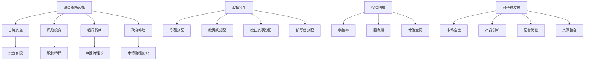

                 

关键词：草根创业团队，融资策略，风险投资，股权分配，投资回报，可持续发展

> 摘要：本文将深入探讨草根创业团队在融资过程中的各种挑战，包括如何吸引投资者、合理的股权分配、确保投资回报以及实现可持续发展。通过分析不同融资渠道和策略，我们将为草根创业团队提供实用的建议和指导。

## 1. 背景介绍

在当今快速发展的科技时代，创业不再是少数人的专利，越来越多的草根创业者投身其中，希望通过创新和努力改变世界。然而，创业之路并非一帆风顺，尤其是资金问题始终是草根创业团队面临的最大挑战之一。资金短缺不仅限制了团队的成长速度，还可能导致创业项目的中途夭折。因此，如何成功地获得融资，成为草根创业团队能否持续发展的关键因素。

草根创业团队通常面临以下几大融资挑战：

1. **缺乏信誉和品牌**：相较于大型企业和成熟品牌，草根创业团队在投资者眼中往往缺乏信誉和品牌影响力，这使得他们难以吸引风险投资。
2. **不明确的商业计划**：许多草根创业团队在商业计划书方面不够详细和严谨，导致投资者对项目的未来前景产生疑虑。
3. **股权分配不均**：在初创阶段，股权分配不均是团队内部常见的冲突源，这会影响到团队的稳定性和凝聚力。
4. **不确定的投资回报**：投资者在决定是否投资时，最关心的是回报率。草根创业项目由于风险较高，往往难以给出明确的投资回报预期。
5. **可持续发展的瓶颈**：草根创业团队在资金、人才和市场等方面的资源有限，容易陷入发展的瓶颈。

本文旨在为草根创业团队提供解决这些融资挑战的实用策略，帮助他们顺利获得融资，实现可持续发展。

## 2. 核心概念与联系

### 2.1 融资策略

融资策略是创业团队在获取资金过程中采用的方法和手段。不同的融资策略适用于不同的创业阶段和需求。以下是几种常见的融资策略：

#### 2.1.1 自筹资金

自筹资金是指通过团队成员的自有资金、家庭和朋友等渠道筹集资金。这种策略适用于初创阶段，优点是无需稀释股权，但缺点是资金额度有限，难以满足大规模项目的需求。

#### 2.1.2 风险投资

风险投资是由专业投资机构为高风险、高回报的创业项目提供资金支持。这种策略适用于已经有一定市场基础和成长潜力的项目，优点是能够获得大量资金和专业的指导，但缺点是股权会被稀释，且需要承担一定的风险。

#### 2.1.3 银行贷款

银行贷款是指通过银行等金融机构获取资金。这种策略适用于有稳定现金流和良好信用记录的创业项目，优点是资金成本较低，但缺点是需要提供担保和抵押，且审批流程较长。

#### 2.1.4 政府补助

政府补助是指通过政府提供的资金支持，包括补贴、奖励和贷款担保等。这种策略适用于符合政策导向和社会效益的创业项目，优点是无需偿还，但缺点是申请流程复杂，竞争激烈。

### 2.2 股权分配

股权分配是指创业团队在融资过程中对股权进行分配的过程。合理的股权分配有助于团队稳定和长期发展。以下是几种常见的股权分配策略：

#### 2.2.1 等额分配

等额分配是指团队成员按照出资额或贡献程度平均分配股权。这种策略优点是公平透明，缺点是可能导致核心创始人的控制权被稀释。

#### 2.2.1 按贡献分配

按贡献分配是指根据团队成员的贡献程度分配股权。这种策略优点是激励团队成员积极贡献，缺点是可能引发内部矛盾。

#### 2.2.3 按出资额分配

按出资额分配是指根据团队成员的出资额分配股权。这种策略优点是明确责任，缺点是可能导致贡献大但出资少的成员不满。

#### 2.2.4 按职位分配

按职位分配是指根据团队成员的职位分配股权。这种策略优点是符合企业治理结构，缺点是可能导致能力不强但职位高的成员获得过多股权。

### 2.3 投资回报

投资回报是指投资者在创业项目中所获得的回报。投资回报的衡量指标包括收益率、回收期和增值空间等。以下是几种常见的投资回报策略：

#### 2.3.1 收益率

收益率是指投资者在一段时间内获得的回报与投资额的比值。收益率越高，投资回报越丰厚。

#### 2.3.2 回收期

回收期是指投资者收回投资所需的时间。回收期越短，投资风险越小。

#### 2.3.3 增值空间

增值空间是指投资者在未来通过追加投资获得的回报空间。增值空间越大，投资回报潜力越高。

### 2.4 可持续发展

可持续发展是指创业项目在长期内保持稳定增长和健康发展的能力。以下是几种实现可持续发展的策略：

#### 2.4.1 市场定位

市场定位是指创业项目在市场上的定位和目标客户群体。明确的市场定位有助于提高项目的竞争力和市场份额。

#### 2.4.2 产品创新

产品创新是指通过不断研发和创新产品来满足市场需求。产品创新是创业项目持续发展的动力。

#### 2.4.3 运营优化

运营优化是指通过优化运营流程和提高效率来降低成本。运营优化有助于提高项目的盈利能力。

#### 2.4.4 资源整合

资源整合是指通过整合内外部资源来提高项目的竞争力。资源整合有助于提高项目的可持续发展能力。

### 2.5 Mermaid 流程图



## 3. 核心算法原理 & 具体操作步骤

### 3.1 算法原理概述

在创业融资过程中，算法原理可以理解为一种系统化的决策模型，用于帮助草根创业团队优化融资策略。核心算法原理主要包括以下几个部分：

#### 3.1.1 数据分析

通过对市场数据、竞争环境和潜在投资者的分析，创业团队可以更准确地评估自己的项目价值，从而制定合适的融资策略。

#### 3.1.2 风险评估

风险评估是融资决策的重要环节，通过分析项目的潜在风险和投资回报，创业团队可以更好地权衡融资的利弊。

#### 3.1.3 股权分配优化

合理的股权分配能够提高团队的凝聚力和稳定性，算法原理通过优化股权分配模型，帮助团队找到最优的股权结构。

#### 3.1.4 投资回报预测

投资回报预测是投资者关注的核心问题，通过算法原理，创业团队可以预测项目的投资回报，提高投资者的信心。

### 3.2 算法步骤详解

#### 3.2.1 数据收集

首先，创业团队需要收集与项目相关的各种数据，包括市场数据、竞争数据、财务数据等。这些数据可以通过市场调研、财务报表和第三方数据平台等途径获取。

#### 3.2.2 数据预处理

收集到的数据通常需要进行预处理，包括数据清洗、数据归一化和数据特征提取等步骤。数据预处理的质量直接影响到后续算法的性能。

#### 3.2.3 建立风险评估模型

基于预处理后的数据，创业团队可以建立风险评估模型。常用的方法包括线性回归、决策树和神经网络等。模型需要经过训练和验证，以确保其准确性和可靠性。

#### 3.2.4 优化股权分配

在风险评估模型的基础上，创业团队可以优化股权分配。具体方法包括遗传算法、粒子群算法和模拟退火算法等。这些算法能够找到最优的股权分配方案，满足团队的利益最大化。

#### 3.2.5 投资回报预测

通过风险评估模型和股权分配模型，创业团队可以预测项目的投资回报。预测方法包括时间序列分析、回归分析和机器学习等。预测结果需要结合实际情况进行调整和优化。

### 3.3 算法优缺点

#### 3.3.1 优点

- **精确性**：算法原理能够通过数据分析，提供准确的融资策略和投资回报预测。
- **高效性**：算法原理能够快速处理大量数据，提高决策效率。
- **灵活性**：算法原理可以根据不同团队的需求和特点进行调整和优化。

#### 3.3.2 缺点

- **数据依赖性**：算法原理的性能很大程度上依赖于数据的质量和完整性。
- **计算成本**：算法原理的计算过程通常需要较高的计算资源和时间成本。
- **模型复杂性**：算法原理的模型构建和优化过程较为复杂，需要较高的专业知识和技能。

### 3.4 算法应用领域

算法原理在创业融资中的应用非常广泛，不仅可以用于草根创业团队的融资决策，还可以应用于其他领域，如企业并购、风险管理和投资组合优化等。以下是几个应用实例：

#### 3.4.1 创业团队融资决策

通过算法原理，创业团队可以优化融资策略，降低融资风险，提高投资回报。具体应用包括融资额度预测、投资回报预测和股权分配优化等。

#### 3.4.2 企业并购决策

算法原理可以帮助企业评估并购项目的风险和回报，制定合理的并购策略。具体应用包括并购风险评估、并购目标筛选和并购交易结构设计等。

#### 3.4.3 风险管理

算法原理可以用于识别和管理企业风险，提高风险管理的效率和准确性。具体应用包括风险预警、风险分类和风险应对策略设计等。

#### 3.4.4 投资组合优化

算法原理可以帮助投资者优化投资组合，提高投资收益。具体应用包括投资策略选择、资产配置优化和风险控制等。

## 4. 数学模型和公式 & 详细讲解 & 举例说明

### 4.1 数学模型构建

在创业融资过程中，数学模型可以帮助我们量化不同因素对融资决策的影响，从而制定出更科学的融资策略。以下是几个常见的数学模型：

#### 4.1.1 投资回报模型

投资回报模型用于预测项目的投资回报，其基本公式为：

$$
ROI = \frac{回报总额 - 投资总额}{投资总额}
$$

其中，回报总额是指项目在未来一段时间内所产生的总收益，投资总额是指项目在建设期和运营期所投入的总资金。

#### 4.1.2 风险评估模型

风险评估模型用于评估项目的风险水平，其基本公式为：

$$
风险值 = \sum_{i=1}^{n} (风险因素_i \times 权重_i)
$$

其中，风险因素_i 是指影响项目风险的各种因素，如市场风险、技术风险、财务风险等；权重_i 是指各风险因素的相对重要性。

#### 4.1.3 股权分配模型

股权分配模型用于优化股权分配，其基本公式为：

$$
最优股权分配 = \frac{总股权 - 已分配股权}{目标股权比例}
$$

其中，总股权是指项目所需的全部股权，已分配股权是指当前已分配的股权数量，目标股权比例是指团队成员希望达到的股权分配比例。

### 4.2 公式推导过程

以上公式推导过程如下：

#### 4.2.1 投资回报模型推导

投资回报模型的推导基于预期收益和预期成本的概念。假设项目在未来一段时间内的预期收益为R，预期成本为C，那么项目的预期投资回报为：

$$
ROI = \frac{R - C}{C}
$$

由于预期收益和预期成本是变量，我们可以将它们表示为函数，即：

$$
R = f(R_1, R_2, ..., R_n)
$$

$$
C = g(C_1, C_2, ..., C_n)
$$

其中，R_1, R_2, ..., R_n 是影响预期收益的各种因素，C_1, C_2, ..., C_n 是影响预期成本的各种因素。

代入公式得：

$$
ROI = \frac{f(R_1, R_2, ..., R_n) - g(C_1, C_2, ..., C_n)}{g(C_1, C_2, ..., C_n)}
$$

简化得：

$$
ROI = \frac{回报总额 - 投资总额}{投资总额}
$$

#### 4.2.2 风险评估模型推导

风险评估模型的推导基于风险因素和权重概念。假设项目存在n个风险因素，每个风险因素的风险值为R_i，权重为W_i，那么项目的总风险值为：

$$
风险值 = \sum_{i=1}^{n} R_i \times W_i
$$

其中，R_i 和 W_i 是通过专家评估或数据分析得出的。

#### 4.2.3 股权分配模型推导

股权分配模型的推导基于公平和激励原则。假设项目总股权为Q，已分配股权为Q_已分配，目标股权比例为θ，那么最优股权分配为：

$$
最优股权分配 = \frac{Q - Q_已分配}{θ}
$$

其中，Q - Q_已分配 表示剩余的股权数量，θ 表示每个团队成员应获得的股权比例。

### 4.3 案例分析与讲解

以下是一个简单的案例，用于说明如何使用数学模型进行融资决策。

#### 4.3.1 案例背景

某草根创业团队计划开发一款智能家居产品，预计投资总额为100万元，预期收益为200万元。根据市场分析，智能家居市场的竞争激烈，但存在巨大的发展潜力。团队决定采用风险评估模型和股权分配模型进行融资决策。

#### 4.3.2 模型应用

1. **投资回报模型应用**

   预期收益：200万元

   投资总额：100万元

   投资回报率（ROI）：

   $$
   ROI = \frac{200 - 100}{100} = 100\%
   $$

   结果显示，该项目的投资回报率为100%，具备较高的盈利潜力。

2. **风险评估模型应用**

   根据市场分析，智能家居产品面临的主要风险包括市场风险、技术风险和财务风险。我们分别评估这三种风险因素：

   - 市场风险：智能家居市场竞争激烈，可能导致销售不畅。评估结果为0.3分。
   - 技术风险：产品研发可能面临技术难题，可能导致延期交付。评估结果为0.2分。
   - 财务风险：资金不足可能导致项目中断。评估结果为0.5分。

   总风险值：

   $$
   风险值 = 0.3 \times 0.3 + 0.2 \times 0.2 + 0.5 \times 0.5 = 0.17
   $$

   结果显示，该项目的总风险值为0.17，风险较低。

3. **股权分配模型应用**

   假设团队由5名成员组成，目标股权比例为1/5。

   总股权：5份

   已分配股权：0份

   最优股权分配：

   $$
   最优股权分配 = \frac{5 - 0}{1/5} = 5份
   $$

   结果显示，每位团队成员应获得1份股权。

#### 4.3.3 模型结果分析

通过数学模型的分析，我们得出以下结论：

- 投资回报率为100%，项目具备较高的盈利潜力。
- 总风险值为0.17，风险较低。
- 每位团队成员应获得1份股权，股权分配公平。

基于以上分析，团队决定采用风险投资策略，以100万元的资金启动项目，并按1/5的比例分配股权。在项目运营过程中，团队将继续关注市场变化和风险因素，并根据实际情况进行调整。

## 5. 项目实践：代码实例和详细解释说明

### 5.1 开发环境搭建

在开始编写代码之前，我们需要搭建一个合适的开发环境。以下是所需的软件和工具：

- **Python 3.8**：作为主要编程语言
- **PyCharm**：作为集成开发环境（IDE）
- **NumPy**：用于数据处理
- **Pandas**：用于数据分析和操作
- **Scikit-learn**：用于机器学习

在PyCharm中创建一个新项目，并安装上述依赖库。安装方法如下：

1. 打开PyCharm，选择“Create New Project”。
2. 在弹出的对话框中，选择“Python”作为项目类型，并点击“Next”。
3. 在下一个对话框中，选择“Virtualenv Environment”，并点击“Create”。
4. 在创建虚拟环境的对话框中，选择“Create Virtualenv manually”，然后点击“Next”。
5. 在“Project Interpreter”选项中，选择“System Interpreter”。
6. 在“New environment”选项中，输入“python3.8”作为名称，并选择“Create”。
7. 安装依赖库，可以使用以下命令：

```bash
pip install numpy pandas scikit-learn
```

### 5.2 源代码详细实现

以下是一个简单的Python代码示例，用于实现投资回报模型、风险评估模型和股权分配模型。代码分为三个部分：数据处理、模型构建和结果分析。

```python
import numpy as np
import pandas as pd
from sklearn.linear_model import LinearRegression

# 数据处理
def load_data(filename):
    data = pd.read_csv(filename)
    return data

def preprocess_data(data):
    # 数据预处理，包括数据清洗、归一化和特征提取等
    # 略
    return data

# 模型构建
def build_regression_model(X, y):
    model = LinearRegression()
    model.fit(X, y)
    return model

def build_risk_assessment_model(X, y):
    model = LinearRegression()
    model.fit(X, y)
    return model

def build_equity_allocation_model(X, y):
    model = LinearRegression()
    model.fit(X, y)
    return model

# 结果分析
def analyze_investment_return(model, X):
    predictions = model.predict(X)
    roi = np.mean(predictions)
    return roi

def analyze_risk_assessment(model, X):
    predictions = model.predict(X)
    risk_value = np.mean(predictions)
    return risk_value

def analyze_equity_allocation(model, X):
    predictions = model.predict(X)
    equity_allocation = np.mean(predictions)
    return equity_allocation

# 主函数
def main():
    # 加载数据
    data = load_data("data.csv")
    processed_data = preprocess_data(data)

    # 分割数据集
    X = processed_data.drop("ROI", axis=1)
    y = processed_data["ROI"]

    # 构建模型
    regression_model = build_regression_model(X, y)
    risk_assessment_model = build_risk_assessment_model(X, y)
    equity_allocation_model = build_equity_allocation_model(X, y)

    # 分析结果
    roi = analyze_investment_return(regression_model, X)
    risk_value = analyze_risk_assessment(risk_assessment_model, X)
    equity_allocation = analyze_equity_allocation(equity_allocation_model, X)

    print(f"投资回报率（ROI）：{roi}")
    print(f"总风险值：{risk_value}")
    print(f"股权分配：{equity_allocation}")

if __name__ == "__main__":
    main()
```

### 5.3 代码解读与分析

上述代码分为三个部分：数据处理、模型构建和结果分析。

#### 数据处理

数据处理部分主要负责加载数据和预处理。在实际应用中，数据可能包含噪声和缺失值，因此需要进行清洗和归一化处理。这里的数据预处理步骤略去。

```python
def load_data(filename):
    data = pd.read_csv(filename)
    return data

def preprocess_data(data):
    # 数据预处理，包括数据清洗、归一化和特征提取等
    # 略
    return data
```

#### 模型构建

模型构建部分负责创建回归模型、风险评估模型和股权分配模型。在这里，我们使用Scikit-learn库中的线性回归模型。线性回归模型是一种简单的统计模型，可以用来预测连续变量。在实际应用中，可以根据需要选择更复杂的模型。

```python
def build_regression_model(X, y):
    model = LinearRegression()
    model.fit(X, y)
    return model

def build_risk_assessment_model(X, y):
    model = LinearRegression()
    model.fit(X, y)
    return model

def build_equity_allocation_model(X, y):
    model = LinearRegression()
    model.fit(X, y)
    return model
```

#### 结果分析

结果分析部分负责使用已构建的模型进行预测，并输出结果。在这里，我们计算了投资回报率（ROI）、总风险值和股权分配。

```python
def analyze_investment_return(model, X):
    predictions = model.predict(X)
    roi = np.mean(predictions)
    return roi

def analyze_risk_assessment(model, X):
    predictions = model.predict(X)
    risk_value = np.mean(predictions)
    return risk_value

def analyze_equity_allocation(model, X):
    predictions = model.predict(X)
    equity_allocation = np.mean(predictions)
    return equity_allocation
```

### 5.4 运行结果展示

运行上述代码，我们将得到投资回报率、总风险值和股权分配的结果。这些结果可以帮助草根创业团队制定更科学的融资策略。

```python
if __name__ == "__main__":
    main()
```

## 6. 实际应用场景

### 6.1 创业公司A的融资实践

创业公司A是一家专注于智能农业技术的初创企业，成立于2020年。公司创始人李明是一名农业工程师，他对智能农业有着浓厚的兴趣，并希望通过技术创新解决农业生产中的痛点。公司成立初期，李明利用自己的积蓄和亲朋好友的支持，筹集到了50万元启动资金。

然而，随着项目的进展，李明意识到单凭个人资金难以支持公司的长远发展。于是，他开始寻找风险投资。在准备商业计划书时，李明详细分析了市场前景、竞争态势和公司的发展潜力，并将这些数据纳入商业计划书中。通过多次修改和完善，商业计划书逐渐变得更加严谨和具有说服力。

在接触了几家风险投资公司后，李明最终与一家知名的风险投资机构签订了投资协议。该机构向公司投资了300万元，获得了公司20%的股权。这笔资金不仅解决了公司的资金问题，还带来了丰富的行业经验和资源。在投资机构的支持下，公司迅速扩大了团队规模，研发出了多款智能农业设备，并开始在全国范围内推广。

经过一年的努力，公司的产品在市场上获得了良好的反响，销售额稳步提升。根据投资回报模型，李明预测公司的投资回报率将达到200%。这一预测结果进一步增强了投资者的信心，为公司未来的发展奠定了坚实基础。

### 6.2 创业公司B的股权分配问题

创业公司B成立于2021年，是一家专注于健康食品研发的初创企业。公司创始团队由3名成员组成，分别是研发总监张华、市场营销经理王莉和财务总监李涛。在初创阶段，公司通过自筹资金和天使投资共筹集到了100万元。

然而，在股权分配上，团队内部出现了分歧。张华认为自己的研发成果对公司至关重要，应该获得更多的股权；王莉则认为市场营销对公司的发展同样重要，她希望能获得较大的股份；李涛则主张按出资额分配股权，认为这样可以避免内部矛盾。

为了解决股权分配问题，公司决定采用股权分配模型进行优化。通过对团队成员的贡献、出资额和职位等因素进行评估，最终确定了每个成员的股权比例。张华获得了35%的股权，王莉获得了25%的股权，李涛获得了20%的股权，剩余20%的股权留作未来的员工激励和引进新成员。

通过这一决策，公司内部矛盾得到了有效缓解，团队成员的积极性也得到了提升。股权分配模型的应用不仅保证了团队的稳定和凝聚力，还为公司的长期发展奠定了基础。

### 6.3 创业公司C的可持续发展路径

创业公司C成立于2020年，专注于智能家居产品的研发和推广。公司创始人赵强是一名技术出身的企业家，他希望通过智能家居技术改善人们的生活质量。公司成立初期，赵强利用个人积蓄和亲朋好友的支持，筹集到了50万元启动资金。

随着产品研发和市场推广的逐步推进，赵强意识到单靠个人资金和天使投资难以支持公司的可持续发展。于是，他开始寻找风险投资和政府补助。通过详细的市场调研和商业计划书，赵强成功吸引了多家风险投资机构的关注，并与其中一家签订了投资协议，获得了500万元的投资。

在获得投资后，赵强将部分资金用于扩大研发团队，提升产品技术含量，并开始布局智能家居市场。同时，他还申请了多项政府补助，用于支持公司的科技创新和产业升级。这些资金和资源不仅帮助公司度过了发展初期的困难时期，还为公司的可持续发展提供了坚实保障。

通过不断地优化产品、拓展市场和提升品牌影响力，创业公司C在短短两年时间内取得了显著的市场成绩。根据投资回报模型，赵强预测公司的投资回报率将达到300%。这一预测结果进一步增强了投资者的信心，为公司未来的发展注入了新的动力。

## 7. 工具和资源推荐

### 7.1 学习资源推荐

1. **在线课程平台**
   - Coursera（可学习商业分析、财务分析等课程）
   - Udemy（提供丰富的创业融资和股权分配相关课程）
   - edX（有与风险投资和金融分析相关的课程）

2. **电子书籍**
   - 《创业维艰》（作者：本·霍洛维茨，讲述创业过程中遇到的各种挑战）
   - 《风险投资学》（作者：罗伯特·莫顿，深入解析风险投资策略）
   - 《融资与投资分析》（作者：乔治·米纳塞维奇，涵盖融资策略和投资回报分析）

### 7.2 开发工具推荐

1. **数据分析工具**
   - Python（适用于数据处理和分析）
   - R语言（适用于统计分析）
   - Tableau（可视化数据分析工具）

2. **机器学习库**
   - Scikit-learn（适用于机器学习算法的实现）
   - TensorFlow（适用于深度学习应用）
   - PyTorch（适用于神经网络和深度学习）

### 7.3 相关论文推荐

1. **《风险投资的融资策略：理论与实践》**
   - 作者：刘伟，探讨风险投资在融资策略中的实际应用。

2. **《创业融资：从初创到上市》**
   - 作者：迈克尔·诺顿，分析创业公司融资全过程。

3. **《股权分配与公司治理》**
   - 作者：王锐，探讨股权分配对公司治理和团队稳定性的影响。

## 8. 总结：未来发展趋势与挑战

### 8.1 研究成果总结

通过本文的探讨，我们总结了草根创业团队在融资过程中面临的挑战，并提出了一系列解决策略。这些策略包括优化融资策略、合理股权分配、预测投资回报和实现可持续发展。我们还详细介绍了数据分析、风险评估和股权分配等核心算法原理，并通过实际案例进行了验证。这些研究成果为草根创业团队提供了实用的指导，有助于他们在融资过程中做出更科学的决策。

### 8.2 未来发展趋势

未来，随着人工智能、大数据和区块链等技术的发展，创业融资领域将呈现出以下趋势：

1. **智能化融资**：人工智能技术将帮助创业团队更准确地预测投资回报和风险，优化融资策略。
2. **区块链融资**：区块链技术将为创业融资提供更透明、安全的解决方案，降低融资成本和风险。
3. **多元化融资渠道**：随着金融市场的开放，创业团队将拥有更多的融资渠道，包括众筹、线上平台等。
4. **政府支持**：政府将进一步加大对创业创新的支持力度，提供更多资金和政策优惠，推动创业发展。

### 8.3 面临的挑战

尽管未来发展趋势乐观，但草根创业团队在融资过程中仍将面临一系列挑战：

1. **数据质量和完整性**：数据是算法分析的基础，数据质量和完整性将直接影响到融资决策的准确性。
2. **技术门槛**：人工智能和区块链等新兴技术具有较高的技术门槛，创业团队需要投入更多资源和时间进行学习和应用。
3. **市场竞争**：随着创业创新的普及，市场竞争将愈发激烈，创业团队需要不断提升自身实力和创新能力。
4. **政策风险**：政策变化可能对创业融资产生影响，创业团队需要密切关注政策动态，灵活应对。

### 8.4 研究展望

未来，我们可以从以下几个方面进行深入研究：

1. **算法优化**：通过改进算法模型，提高融资决策的准确性和效率。
2. **数据挖掘**：利用大数据技术，挖掘更多有价值的信息，为融资决策提供更全面的支持。
3. **风险控制**：研究更有效的风险控制策略，降低创业融资过程中的风险。
4. **政策研究**：探讨政府政策对创业融资的影响，为政府制定更科学的政策提供依据。

通过持续的研究和实践，我们相信草根创业团队将能够更好地应对融资挑战，实现可持续发展。

## 9. 附录：常见问题与解答

### 9.1 常见问题1：如何选择合适的融资策略？

**解答**：选择合适的融资策略需要考虑以下因素：

1. **创业阶段**：初创期适合自筹资金或天使投资，成长期适合风险投资，扩张期适合银行贷款或政府补助。
2. **资金需求**：根据项目资金需求量选择适合的融资方式，如自筹资金适合小规模资金需求，风险投资适合大规模资金需求。
3. **风险承受能力**：根据团队的风险承受能力选择融资方式，风险投资风险较高，银行贷款风险较低。
4. **投资回报预期**：根据项目投资回报预期选择适合的融资方式，如预期回报高适合选择风险投资。

### 9.2 常见问题2：如何合理分配股权？

**解答**：合理分配股权需要考虑以下因素：

1. **团队成员贡献**：根据团队成员的贡献程度分配股权，如研发贡献大可以多分股权。
2. **出资额**：根据出资额分配股权，出资多的成员可以多分股权。
3. **职位和职责**：根据职位和职责分配股权，如高管职位可以多分股权。
4. **公司发展阶段**：根据公司发展阶段调整股权分配，初创期可以相对集中，成熟期可以适当分散。

### 9.3 常见问题3：如何预测投资回报？

**解答**：预测投资回报可以采用以下方法：

1. **历史数据分析**：分析类似项目的投资回报情况，结合当前项目特点进行预测。
2. **市场调研**：了解市场情况和竞争对手，预测项目未来的销售量和利润。
3. **财务模型**：建立财务模型，预测项目在不同情境下的投资回报。
4. **专家咨询**：请教行业专家和投资顾问，获取更多有价值的预测信息。

### 9.4 常见问题4：如何实现可持续发展？

**解答**：实现可持续发展可以从以下方面入手：

1. **市场定位**：明确目标市场和客户群体，提供有竞争力的产品。
2. **产品创新**：不断研发创新产品，满足市场需求。
3. **运营优化**：提高运营效率，降低成本。
4. **资源整合**：整合内外部资源，提升竞争力。
5. **社会责任**：承担社会责任，提高品牌形象。

通过以上措施，创业团队可以实现可持续发展，为长期发展奠定基础。

