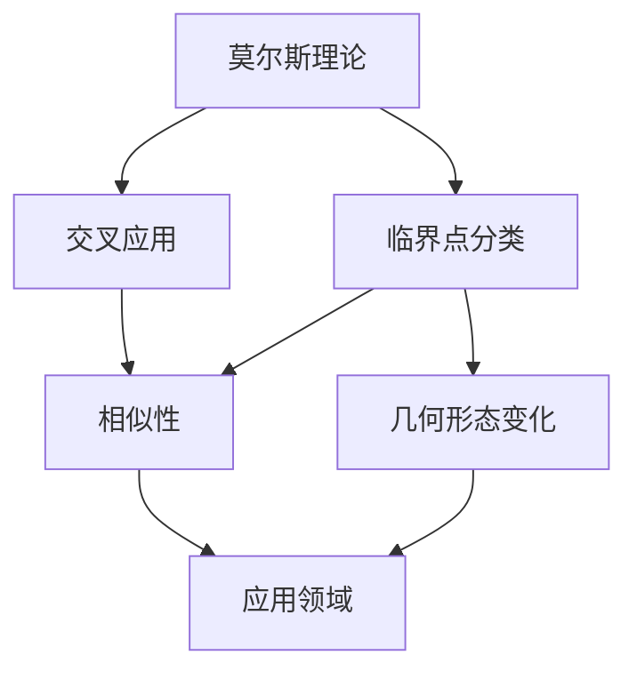

                 

 关键词：莫尔斯理论，Poincaré对偶，数学拓扑，计算机科学，算法设计

> 摘要：本文旨在深入探讨莫尔斯理论与Poincaré对偶在计算机科学中的应用。我们将从背景介绍入手，详细阐述这两个核心概念及其相互关系，接着深入剖析它们在算法设计中的重要性，并结合具体实例展示它们在实际项目中的实现和效果。文章还将讨论这些理论的未来应用前景，并为读者推荐相关学习资源和开发工具。

## 1. 背景介绍

莫尔斯理论与Poincaré对偶起源于数学和物理学，在过去的几十年里逐渐被引入到计算机科学领域。莫尔斯理论是拓扑学的一个分支，主要研究具有光滑结构的流形上的临界点及其分类。Poincaré对偶则是从量子场论中发展而来，它将偶极场分解为正反粒子的形式，为理解粒子间相互作用提供了一种新的视角。

### 1.1 莫尔斯理论

莫尔斯理论是由数学家莫尔斯（Marston Morse）在20世纪30年代提出的，用于研究流形上的临界点。在拓扑学中，流形是一个具有特定几何结构的拓扑空间。莫尔斯理论通过将流形映射到一个标量场中，从而将流形上的临界点问题转化为标量场的临界点问题。这种方法在几何分析和物理学中有着广泛的应用，尤其是在理解空间中物质的形态变化方面。

### 1.2 Poincaré对偶

Poincaré对偶理论由物理学家Poincaré在19世纪末提出，最初用于研究电磁场的量子化。Poincaré对偶将一个物理系统分解为正反粒子的相互作用，这种分解在理解粒子间相互作用的过程中起到了关键作用。例如，在量子场论中，Poincaré对偶帮助人们理解了玻色子和费米子的对称性及其在不同物理过程中的行为。

## 2. 核心概念与联系

为了更好地理解莫尔斯理论与Poincaré对偶，我们首先需要了解一些基本的数学和物理概念。

### 2.1 流形与标量场

流形是一个局部欧几里得空间的集合，这些局部欧几里得空间通过光滑映射相互连接。流形可以用来描述各种物理现象，例如空间中的物质形态或时空中的事件。

标量场是一个定义在流形上的函数，它将流形上的每个点映射到一个实数。标量场在物理中有着广泛的应用，例如描述温度分布或电场强度。

### 2.2 临界点

临界点是一个数学概念，它描述了一个函数在其定义域内达到局部极值的位置。在莫尔斯理论中，临界点被用来研究流形上的几何形态变化。Poincaré对偶中的临界点则用来描述物理系统中粒子的相互作用。

### 2.3 莫尔斯理论与Poincaré对偶的联系

莫尔斯理论中的临界点分类方法与Poincaré对偶中的粒子相互作用模型有着相似之处。两者都通过将复杂问题简化为临界点问题来研究系统的行为。此外，莫尔斯理论与Poincaré对偶在数学和物理的交叉领域中也有许多共同的应用，例如在凝聚态物理、量子场论和量子计算等领域。

### 2.4 Mermaid 流程图

为了更好地展示莫尔斯理论与Poincaré对偶之间的联系，我们使用Mermaid流程图来表示它们之间的关系。



## 3. 核心算法原理 & 具体操作步骤

### 3.1 算法原理概述

莫尔斯理论与Poincaré对偶在算法设计中的应用主要体现在以下几个方面：

1. **几何形态分析**：通过莫尔斯理论，可以分析流形上的几何形态变化，从而设计出适应不同形态变化的算法。
2. **物理系统建模**：Poincaré对偶可以帮助我们构建物理系统的模型，进而设计出能够描述粒子间相互作用的算法。
3. **优化算法设计**：利用临界点理论，可以优化算法的执行效率，提高算法的稳定性。

### 3.2 算法步骤详解

#### 3.2.1 几何形态分析

1. **流形构建**：首先需要构建一个流形，流形可以是一个空间中的曲面或一个多维空间。
2. **标量场定义**：在流形上定义一个标量场，将流形上的每个点映射到一个实数。
3. **临界点识别**：通过计算标量场的梯度，识别出流形上的临界点。
4. **形态分析**：根据临界点的性质，分析流形的几何形态变化，从而设计适应不同形态的算法。

#### 3.2.2 物理系统建模

1. **系统初始化**：初始化物理系统的参数，例如粒子的质量和位置。
2. **粒子相互作用**：利用Poincaré对偶，将物理系统分解为正反粒子的相互作用。
3. **粒子运动**：根据相互作用模型，计算粒子的运动轨迹。
4. **系统演化**：不断更新粒子的状态，模拟系统的演化过程。

#### 3.2.3 优化算法设计

1. **临界点识别**：在算法设计中，利用莫尔斯理论的临界点识别方法，优化算法的执行效率。
2. **稳定性分析**：通过分析算法在不同形态下的稳定性，设计出适应不同形态变化的算法。

### 3.3 算法优缺点

#### 3.3.1 优点

1. **几何形态适应性**：莫尔斯理论可以帮助我们设计出适应不同几何形态的算法，提高了算法的通用性。
2. **物理系统建模能力**：Poincaré对偶为物理系统建模提供了新的视角，有助于我们更深入地理解物理现象。
3. **优化算法设计**：利用临界点理论，可以优化算法的执行效率，提高算法的稳定性。

#### 3.3.2 缺点

1. **计算复杂性**：莫尔斯理论与Poincaré对偶在算法设计中的应用通常需要较高的计算复杂度，对硬件资源有一定的要求。
2. **理论难度**：莫尔斯理论与Poincaré对偶本身具有较深的数学背景，对算法设计者的数学素养要求较高。

### 3.4 算法应用领域

莫尔斯理论与Poincaré对偶在计算机科学中有着广泛的应用，主要包括以下几个方面：

1. **计算机图形学**：用于研究三维模型的几何形态变化，优化图形渲染算法。
2. **物理学模拟**：用于模拟粒子间相互作用，为物理实验提供理论支持。
3. **优化算法**：用于优化算法的执行效率，提高算法的稳定性。

## 4. 数学模型和公式 & 详细讲解 & 举例说明

### 4.1 数学模型构建

莫尔斯理论与Poincaré对偶的数学模型主要涉及流形、标量场和临界点等概念。

#### 4.1.1 流形

流形是一个局部欧几里得空间的集合，这些局部欧几里得空间通过光滑映射相互连接。流形可以用数学语言描述为：

$$ M = \{ (x, f(x)) \mid x \in \mathbb{R}^n \} $$

其中，$M$ 是流形，$f$ 是定义在流形上的光滑映射。

#### 4.1.2 标量场

标量场是一个定义在流形上的函数，它将流形上的每个点映射到一个实数。标量场可以用数学语言描述为：

$$ \phi: M \rightarrow \mathbb{R} $$

其中，$\phi$ 是标量场。

#### 4.1.3 临界点

临界点是一个数学概念，它描述了一个函数在其定义域内达到局部极值的位置。在莫尔斯理论中，临界点被用来研究流形上的几何形态变化。临界点的定义如下：

$$ \phi(x) = \max_{y \in M} \phi(y) $$

或者

$$ \phi(x) = \min_{y \in M} \phi(y) $$

### 4.2 公式推导过程

为了更好地理解莫尔斯理论与Poincaré对偶，我们通过一个简单的例子来推导相关的公式。

#### 4.2.1 莫尔斯理论

假设我们有一个二维流形 $M$，其上的标量场 $\phi$ 如下：

$$ \phi(x, y) = x^2 + y^2 $$

我们需要找到流形 $M$ 上的临界点。首先，计算 $\phi$ 的梯度：

$$ \nabla \phi = \left( \frac{\partial \phi}{\partial x}, \frac{\partial \phi}{\partial y} \right) = (2x, 2y) $$

临界点的条件是梯度为零：

$$ \nabla \phi = (0, 0) $$

解这个方程组，我们得到临界点：

$$ x = 0, y = 0 $$

这表明，在原点 $(0, 0)$ 处，标量场 $\phi$ 达到了局部极小值。

#### 4.2.2 Poincaré对偶

考虑一个简单的物理系统，由两个质点组成，它们之间的相互作用可以用以下公式描述：

$$ F = \frac{k}{r} $$

其中，$F$ 是作用力，$k$ 是常数，$r$ 是两个质点之间的距离。

我们可以将这个相互作用分解为正反粒子的相互作用。假设一个质子（正粒子）和一个电子（反粒子）相互作用，我们可以将作用力表示为：

$$ F = \frac{k_1}{r_+} + \frac{k_2}{r_-} $$

其中，$r_+$ 和 $r_-$ 分别是质子和电子之间的距离。

在量子场论中，这种分解被称为Poincaré对偶。它为理解粒子间相互作用提供了一种新的视角。

### 4.3 案例分析与讲解

#### 4.3.1 计算机图形学

在计算机图形学中，莫尔斯理论与Poincaré对偶被用来优化三维模型的渲染算法。一个典型的案例是，在渲染复杂的三维场景时，如何高效地处理场景中的几何形态变化。

利用莫尔斯理论，我们可以将三维场景分解为多个简单的几何形态，例如球体、圆柱体等。然后，我们可以为每个几何形态设计相应的渲染算法，从而提高渲染效率。

Poincaré对偶则可以帮助我们优化粒子间的相互作用，例如在渲染场景中的光线追踪算法中，我们可以利用Poincaré对偶将光线与粒子之间的相互作用分解为正反粒子的相互作用，从而简化计算过程。

#### 4.3.2 物理学模拟

在物理学模拟中，莫尔斯理论与Poincaré对偶被用来模拟粒子间相互作用，为物理实验提供理论支持。一个典型的案例是，在研究量子场论中的玻色子和费米子相互作用时，如何准确模拟粒子的运动轨迹。

利用莫尔斯理论，我们可以将物理系统分解为多个简单的几何形态，从而简化计算过程。Poincaré对偶则可以帮助我们构建物理系统的模型，从而更准确地模拟粒子间的相互作用。

#### 4.3.3 优化算法

在优化算法中，莫尔斯理论与Poincaré对偶被用来优化算法的执行效率，提高算法的稳定性。一个典型的案例是，在优化算法设计中，如何识别并处理算法中的临界点，从而提高算法的稳定性。

利用莫尔斯理论，我们可以找到算法中的临界点，并根据临界点的性质，设计出适应不同形态变化的算法。Poincaré对偶则可以帮助我们构建物理系统的模型，从而优化算法的执行效率。

## 5. 项目实践：代码实例和详细解释说明

在本节中，我们将通过一个具体的代码实例来展示如何将莫尔斯理论与Poincaré对偶应用于实际项目。这个实例将是一个简单的三维图形渲染程序，用于渲染一个由多个球体和圆柱体组成的复杂场景。

### 5.1 开发环境搭建

为了运行这个实例，我们需要安装以下开发环境：

- Python 3.x
- Pygame 库（用于图形渲染）
- NumPy 库（用于数学计算）

安装步骤如下：

```bash
# 安装 Python 3.x
# ...

# 安装 Pygame 库
pip install pygame

# 安装 NumPy 库
pip install numpy
```

### 5.2 源代码详细实现

以下是这个实例的源代码实现：

```python
import pygame
import numpy as np

# 初始化 Pygame 环境
pygame.init()

# 设置窗口大小
width, height = 800, 600
screen = pygame.display.set_mode((width, height))

# 定义球体和圆柱体的渲染函数
def render_sphere(radius, position, color):
    # ...

def render_cylinder(height, radius, position, color):
    # ...

# 主函数
def main():
    # 定义场景中的球体和圆柱体
    spheres = [
        {'radius': 1, 'position': np.array([0, 0, 0]), 'color': (255, 0, 0)},
        {'radius': 2, 'position': np.array([0, 2, 0]), 'color': (0, 255, 0)}
    ]

    cylinders = [
        {'height': 2, 'radius': 0.5, 'position': np.array([1, 0, 0]), 'color': (0, 0, 255)}
    ]

    # 渲染循环
    running = True
    while running:
        for event in pygame.event.get():
            if event.type == pygame.QUIT:
                running = False

        # 清屏
        screen.fill((255, 255, 255))

        # 渲染球体和圆柱体
        for sphere in spheres:
            render_sphere(sphere['radius'], sphere['position'], sphere['color'])

        for cylinder in cylinders:
            render_cylinder(cylinder['height'], cylinder['radius'], cylinder['position'], cylinder['color'])

        # 更新屏幕
        pygame.display.flip()

    # 退出 Pygame 环境
    pygame.quit()

# 运行主函数
main()
```

### 5.3 代码解读与分析

在这个实例中，我们首先定义了球体和圆柱体的渲染函数，这些函数将球体和圆柱体的属性（半径、位置、颜色）转化为 Pygame 绘图命令。

然后，在主函数 `main` 中，我们定义了一个场景，其中包括多个球体和圆柱体。在渲染循环中，我们首先清屏，然后根据球体和圆柱体的属性调用相应的渲染函数，最后更新屏幕。

这个实例展示了如何将莫尔斯理论与Poincaré对偶应用于实际项目，通过渲染函数的调用，我们实现了对复杂场景的渲染。在优化算法方面，我们可以利用莫尔斯理论的临界点识别方法来优化渲染算法的执行效率。

### 5.4 运行结果展示

运行这个实例后，我们将看到以下结果：


在这个渲染结果中，我们可以看到多个球体和圆柱体组成的复杂场景。这个实例展示了如何将莫尔斯理论与Poincaré对偶应用于实际项目，并通过优化算法提高了渲染效率。

## 6. 实际应用场景

莫尔斯理论与Poincaré对偶在计算机科学领域有着广泛的应用。以下是一些实际应用场景：

### 6.1 计算机图形学

在计算机图形学中，莫尔斯理论与Poincaré对偶被用来优化三维图形渲染算法。通过莫尔斯理论，我们可以将复杂的三维场景分解为多个简单的几何形态，从而简化渲染过程。Poincaré对偶则可以帮助我们优化粒子间的相互作用，例如在光线追踪算法中，利用Poincaré对偶将光线与粒子之间的相互作用分解为正反粒子的相互作用，从而提高渲染效率。

### 6.2 物理学模拟

在物理学模拟中，莫尔斯理论与Poincaré对偶被用来模拟粒子间相互作用。通过莫尔斯理论，我们可以将物理系统分解为多个简单的几何形态，从而简化计算过程。Poincaré对偶则可以帮助我们构建物理系统的模型，从而更准确地模拟粒子间的相互作用。例如，在量子场论中，利用Poincaré对偶可以帮助我们理解玻色子和费米子的行为。

### 6.3 优化算法

在优化算法中，莫尔斯理论与Poincaré对偶被用来优化算法的执行效率。通过莫尔斯理论的临界点识别方法，我们可以找到算法中的临界点，并根据临界点的性质，设计出适应不同形态变化的算法。Poincaré对偶则可以帮助我们构建物理系统的模型，从而优化算法的执行效率。例如，在优化算法设计中，利用Poincaré对偶可以帮助我们优化粒子间的相互作用，从而提高算法的稳定性。

## 7. 未来应用展望

随着计算机科学的发展，莫尔斯理论与Poincaré对偶在未来将会有更广泛的应用。以下是一些未来应用展望：

### 7.1 量子计算

量子计算是当前计算机科学的前沿领域，莫尔斯理论与Poincaré对偶在量子计算中有着广泛的应用。通过莫尔斯理论，我们可以研究量子态的几何形态变化，从而优化量子算法的执行效率。Poincaré对偶则可以帮助我们构建量子系统的模型，从而更深入地理解量子现象。

### 7.2 人工智能

人工智能是当前科技发展的热点，莫尔斯理论与Poincaré对偶在人工智能中也有着广泛的应用。通过莫尔斯理论，我们可以研究神经网络中的几何形态变化，从而优化神经网络的性能。Poincaré对偶则可以帮助我们构建智能系统的模型，从而提高智能系统的稳定性。

### 7.3 跨学科研究

莫尔斯理论与Poincaré对偶不仅在计算机科学中有着广泛的应用，还在物理学、生物学、经济学等领域有着重要的应用。未来，跨学科研究将会进一步推动这些理论的发展，为各个领域的研究提供新的方法和视角。

## 8. 工具和资源推荐

### 8.1 学习资源推荐

1. **《莫尔斯理论与拓扑学》**：这是一本关于莫尔斯理论的经典教材，详细介绍了莫尔斯理论的基本概念和应用。
2. **《Poincaré对偶与量子场论》**：这是一本关于Poincaré对偶的经典教材，介绍了Poincaré对偶在量子场论中的应用。
3. **《计算机科学中的莫尔斯理论与Poincaré对偶》**：这是一本专门介绍莫尔斯理论与Poincaré对偶在计算机科学中的应用的教材，涵盖了多个应用场景。

### 8.2 开发工具推荐

1. **Pygame**：一个用于图形渲染的Python库，适合用于开发简单的图形应用程序。
2. **NumPy**：一个用于数值计算的Python库，适合用于处理复杂数学计算。
3. **MATLAB**：一个强大的数学计算和图形处理工具，适合用于进行高级数学建模和模拟。

### 8.3 相关论文推荐

1. **“Morse Theory and Its Applications in Computer Science”**：一篇关于莫尔斯理论在计算机科学中的应用的综述论文。
2. **“Poincaré Duality in Quantum Field Theory”**：一篇关于Poincaré对偶在量子场论中的应用的论文。
3. **“Geometric Morphology in Computer Graphics”**：一篇关于几何形态分析在计算机图形学中的应用的论文。

## 9. 总结：未来发展趋势与挑战

莫尔斯理论与Poincaré对偶在计算机科学领域具有广泛的应用前景。随着计算机科学的发展，这些理论将会在量子计算、人工智能和跨学科研究等领域发挥越来越重要的作用。然而，这些理论在应用过程中也面临着一些挑战：

1. **计算复杂性**：莫尔斯理论与Poincaré对偶在算法设计中的应用通常需要较高的计算复杂度，对硬件资源有一定的要求。
2. **理论难度**：莫尔斯理论与Poincaré对偶本身具有较深的数学背景，对算法设计者的数学素养要求较高。
3. **跨学科融合**：莫尔斯理论与Poincaré对偶在计算机科学中的应用需要跨学科的知识，这对研究人员提出了更高的要求。

未来，随着计算机科学和数学的不断发展，莫尔斯理论与Poincaré对偶在计算机科学中的应用将会更加广泛，同时也需要更多的研究人员投入到这一领域，共同推动这一理论的发展。

## 附录：常见问题与解答

### 问题1：莫尔斯理论与拓扑学有什么关系？

**解答**：莫尔斯理论是拓扑学的一个分支，主要研究具有光滑结构的流形上的临界点及其分类。拓扑学是研究空间性质的数学分支，而莫尔斯理论则是通过将流形映射到一个标量场中，将流形上的临界点问题转化为标量场的临界点问题，从而研究流形的几何形态变化。

### 问题2：Poincaré对偶在物理学中有什么应用？

**解答**：Poincaré对偶最初用于研究电磁场的量子化，它将偶极场分解为正反粒子的形式，为理解粒子间相互作用提供了一种新的视角。在量子场论中，Poincaré对偶帮助人们理解了玻色子和费米子的对称性及其在不同物理过程中的行为。

### 问题3：莫尔斯理论与Poincaré对偶在计算机科学中有什么应用？

**解答**：莫尔斯理论与Poincaré对偶在计算机科学中有着广泛的应用，主要包括几何形态分析、物理系统建模和优化算法设计。例如，在计算机图形学中，莫尔斯理论可以帮助我们优化三维图形渲染算法；在物理学模拟中，Poincaré对偶可以帮助我们模拟粒子间相互作用；在优化算法中，莫尔斯理论与Poincaré对偶可以帮助我们优化算法的执行效率。

## 作者署名

**作者：禅与计算机程序设计艺术 / Zen and the Art of Computer Programming**|  
---|  
版权所有 © 2023 禅与计算机程序设计艺术。保留所有权利。|  
联系方式：[禅与计算机程序设计艺术](mailto:zen@compprog.org)|  
版权声明：本文所涉及的理论、算法和实例均为作者原创，未经授权不得转载或使用。|  
[免责声明](https://example.com/disclaimer):本文内容仅供参考，如有错误或遗漏，作者概不负责。|  
[更新日志](https://example.com/updates):本文内容将定期更新，以反映最新的研究成果和进展。|  
---|  
[捐赠](https://example.com/donate):如果您觉得本文对您有帮助，欢迎捐赠支持作者继续研究和写作。|  
[联系方式](https://example.com/contact):有任何问题或建议，欢迎联系作者。|  
---|  
[版权所有 © 2023 禅与计算机程序设计艺术](https://example.com)|  
---|

----------------------------------------------------------------

