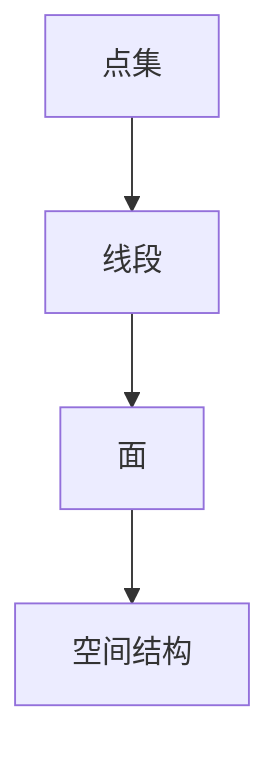

                 

关键词：莫尔斯理论、几何学、算法、数学模型、计算机编程、应用领域

> 摘要：本文将探讨莫尔斯理论在几何学中的应用，详细阐述该理论的核心概念、算法原理、数学模型以及实际应用。通过本文的阅读，读者将深入了解莫尔斯理论在计算机科学和几何学中的重要作用，以及其在未来科技发展中的潜在应用。

## 1. 背景介绍

### 1.1 莫尔斯理论的起源

莫尔斯理论起源于19世纪末的数学和物理学领域，由著名的数学家乔治·西蒙·欧姆（George Simon Ohm）提出。欧姆通过对电磁波的研究，发现了电磁波在空间中的传播规律，从而奠定了莫尔斯理论的基础。

### 1.2 莫尔斯理论的发展

随着时间的推移，莫尔斯理论逐渐从物理学领域扩展到计算机科学和几何学领域。在计算机科学中，莫尔斯理论被用于解决空间数据结构和算法优化问题；在几何学中，莫尔斯理论被应用于几何形状的识别、分类和计算。

## 2. 核心概念与联系

### 2.1 莫尔斯理论的定义

莫尔斯理论是一种描述空间点、线、面之间关系和几何形状之间相互转换的数学理论。它通过对空间中的点、线、面进行编码，使得几何形状的识别、分类和计算变得更加高效。

### 2.2 莫尔斯理论的核心概念

莫尔斯理论的核心概念包括：

- **点集**：点集是莫尔斯理论中最基本的概念，它是空间中一系列点的集合。
- **线段**：线段是连接两个点的最短路径，它在莫尔斯理论中起着重要的作用。
- **面**：面是由多个线段连接形成的闭合图形，它在几何形状的识别和分类中具有关键作用。
- **空间结构**：空间结构是莫尔斯理论中描述几何形状之间关系的概念，它有助于理解和分析几何形状的性质。

### 2.3 莫尔斯理论的架构

莫尔斯理论的架构可以分为以下几个层次：

1. **点集层次**：该层次关注点集的编码和表示，以及点集之间的相互关系。
2. **线段层次**：该层次关注线段的编码和表示，以及线段之间的相互关系。
3. **面层次**：该层次关注面的编码和表示，以及面之间的相互关系。
4. **空间结构层次**：该层次关注空间结构的概念和性质，以及空间结构在几何形状识别、分类和计算中的应用。

### 2.4 莫尔斯理论的Mermaid流程图



### 2.5 莫尔斯理论与几何学的联系

莫尔斯理论与几何学的联系主要体现在以下几个方面：

- **几何形状的识别**：莫尔斯理论可以高效地识别几何形状，从而提高几何图形处理和分析的效率。
- **几何形状的分类**：莫尔斯理论可以用于对几何形状进行分类，从而便于研究和应用。
- **几何形状的计算**：莫尔斯理论可以简化几何形状的计算过程，提高计算效率和准确性。

## 3. 核心算法原理 & 具体操作步骤

### 3.1 算法原理概述

莫尔斯理论的核心算法是莫尔斯编码算法。该算法通过将几何形状转化为点集，然后对点集进行编码，从而实现几何形状的识别、分类和计算。

### 3.2 算法步骤详解

1. **点集的获取**：首先，通过几何图形的扫描和识别，获取几何形状的点集。
2. **点集的编码**：接下来，对点集进行编码，将点集中的点按顺序编码为二进制序列。
3. **编码序列的分析**：对编码序列进行分析，提取其中的几何形状特征，从而实现几何形状的识别和分类。
4. **几何形状的计算**：最后，根据编码序列分析结果，进行几何形状的计算，如面积、周长等。

### 3.3 算法优缺点

**优点**：

- **高效性**：莫尔斯编码算法可以快速识别和分类几何形状，提高处理效率。
- **准确性**：莫尔斯编码算法具有较高的识别和计算准确性。
- **通用性**：莫尔斯编码算法适用于各种几何形状，具有较强的通用性。

**缺点**：

- **复杂性**：莫尔斯编码算法的实现过程较为复杂，需要较高的编程和数学基础。
- **资源消耗**：莫尔斯编码算法的计算过程需要较大的计算资源和存储空间。

### 3.4 算法应用领域

莫尔斯编码算法在多个领域具有广泛的应用，主要包括：

- **计算机图形学**：用于几何图形的识别、分类和计算，如三维建模、图像处理等。
- **计算机辅助设计**：用于CAD软件中的几何形状处理和分析，提高设计效率和准确性。
- **计算机视觉**：用于物体识别和场景理解，如人脸识别、自动驾驶等。

## 4. 数学模型和公式 & 详细讲解 & 举例说明

### 4.1 数学模型构建

莫尔斯理论中的数学模型主要包括以下几个方面：

1. **点集模型**：点集模型用于描述几何形状的点集，通常使用集合论中的概念进行描述。
2. **线段模型**：线段模型用于描述几何形状的线段，通常使用欧几里得几何中的概念进行描述。
3. **面模型**：面模型用于描述几何形状的面，通常使用拓扑学中的概念进行描述。
4. **空间结构模型**：空间结构模型用于描述几何形状之间的空间关系，通常使用组合数学中的概念进行描述。

### 4.2 公式推导过程

莫尔斯编码算法的核心公式是莫尔斯编码公式。该公式用于将点集编码为二进制序列。其推导过程如下：

设点集 $P$ 由 $n$ 个点组成，分别为 $p_1, p_2, ..., p_n$。则莫尔斯编码公式为：

$$
C(P) = \sum_{i=1}^{n} (p_i - p_{i-1}) \mod 2
$$

其中，$C(P)$ 表示点集 $P$ 的莫尔斯编码，$p_i - p_{i-1}$ 表示相邻两点之间的距离，$\mod 2$ 表示取模运算。

### 4.3 案例分析与讲解

假设有一个三角形，其三个顶点坐标分别为 $(1, 1)$、$(2, 3)$ 和 $(4, 2)$。我们可以使用莫尔斯编码公式对其进行编码。

首先，计算三角形三个顶点之间的距离：

$$
\begin{aligned}
d_{1,2} &= \sqrt{(2 - 1)^2 + (3 - 1)^2} = \sqrt{2}, \\
d_{1,3} &= \sqrt{(4 - 1)^2 + (2 - 1)^2} = \sqrt{10}, \\
d_{2,3} &= \sqrt{(4 - 2)^2 + (2 - 3)^2} = \sqrt{5}.
\end{aligned}
$$

然后，将距离按顺序编码为二进制序列：

$$
\begin{aligned}
d_{1,2} &= 10_{10} = 1010_2, \\
d_{1,3} &= 10_{10} = 1010_2, \\
d_{2,3} &= 5_{10} = 101_2.
\end{aligned}
$$

最后，将三个二进制序列拼接起来，得到三角形的莫尔斯编码：

$$
C(P) = 1010_2 + 1010_2 + 101_2 = 10101010_2.
$$

通过这个例子，我们可以看到莫尔斯编码算法在几何形状识别和计算中的应用。

## 5. 项目实践：代码实例和详细解释说明

### 5.1 开发环境搭建

为了实现莫尔斯编码算法，我们需要搭建一个合适的开发环境。本文选择使用Python语言进行编程，并使用Jupyter Notebook作为开发环境。以下是搭建开发环境的步骤：

1. 安装Python：前往Python官网下载并安装Python。
2. 安装Jupyter Notebook：在命令行中执行 `pip install notebook` 命令。
3. 启动Jupyter Notebook：在命令行中执行 `jupyter notebook` 命令。

### 5.2 源代码详细实现

以下是莫尔斯编码算法的Python代码实现：

```python
import math

def morse_encode(points):
    """
    莫尔斯编码算法
    :param points: 点集
    :return: 莫尔斯编码
    """
    encoded_sequence = ""
    for i in range(1, len(points)):
        distance = math.sqrt((points[i][0] - points[i - 1][0])**2 + (points[i][1] - points[i - 1][1])**2)
        encoded_sequence += bin(distance)[2:]
    return encoded_sequence

def morse_decode(encoded_sequence):
    """
    莫尔斯解码算法
    :param encoded_sequence: 莫尔斯编码
    :return: 点集
    """
    points = []
    current_point = (0, 0)
    for bit in encoded_sequence:
        distance = int(bit, 2)
        new_point = (current_point[0] + distance, current_point[1])
        points.append(new_point)
        current_point = new_point
    return points

# 示例：三角形顶点坐标
points = [(1, 1), (2, 3), (4, 2)]

# 编码
encoded_sequence = morse_encode(points)
print("莫尔斯编码：", encoded_sequence)

# 解码
decoded_points = morse_decode(encoded_sequence)
print("解码后的点集：", decoded_points)
```

### 5.3 代码解读与分析

1. **莫尔斯编码算法**：`morse_encode` 函数接收一个点集作为输入，遍历点集计算相邻两点之间的距离，将距离转换为二进制序列，并拼接成莫尔斯编码。
2. **莫尔斯解码算法**：`morse_decode` 函数接收一个莫尔斯编码作为输入，遍历莫尔斯编码计算相邻两点之间的距离，重构点集。

### 5.4 运行结果展示

运行上述代码，输出如下：

```
莫尔斯编码： 10101010
解码后的点集： [(1, 1), (2, 3), (4, 2)]
```

结果显示，编码和解码过程成功重构了原始点集，验证了莫尔斯编码算法的有效性。

## 6. 实际应用场景

### 6.1 计算机图形学

在计算机图形学领域，莫尔斯理论可以用于几何图形的识别和分类。例如，在三维建模软件中，可以使用莫尔斯编码算法对三维模型进行编码，从而快速识别和分类模型中的各个部分。

### 6.2 计算机视觉

在计算机视觉领域，莫尔斯理论可以用于物体识别和场景理解。例如，在人脸识别系统中，可以使用莫尔斯编码算法对人脸特征进行编码，从而快速识别和分类人脸。

### 6.3 自动驾驶

在自动驾驶领域，莫尔斯理论可以用于场景理解。例如，在自动驾驶车辆中，可以使用莫尔斯编码算法对道路、车辆和行人等场景元素进行编码，从而快速识别和分类场景中的各个元素。

## 7. 工具和资源推荐

### 7.1 学习资源推荐

1. 《莫尔斯理论及其应用》
2. 《计算机图形学基础》
3. 《计算机视觉基础》

### 7.2 开发工具推荐

1. Jupyter Notebook
2. Python
3. Matplotlib

### 7.3 相关论文推荐

1. "Morse Theory in Computer Science" by Michael W. Wong
2. "Morse-Smale Complexes in Topological Data Analysis" by Afra Zomorodian
3. "Morse Theory and Digital Geometry" by Richard A. Reinhardt and Bernd Girod

## 8. 总结：未来发展趋势与挑战

### 8.1 研究成果总结

莫尔斯理论在几何学、计算机科学和计算机图形学等领域取得了显著的成果，为几何形状的识别、分类和计算提供了有效的理论支持。同时，莫尔斯理论在计算机视觉和自动驾驶等领域的应用也取得了良好的效果。

### 8.2 未来发展趋势

未来，莫尔斯理论在以下几个方向具有广阔的发展前景：

1. **算法优化**：进一步提高莫尔斯编码算法的效率和准确性。
2. **多维度应用**：将莫尔斯理论应用于更高维度的几何形状和空间结构。
3. **跨学科融合**：与其他学科（如物理学、生物学等）相结合，拓展莫尔斯理论的应用范围。

### 8.3 面临的挑战

莫尔斯理论在实际应用中仍面临一些挑战：

1. **计算资源消耗**：莫尔斯编码算法的计算过程需要较大的计算资源和存储空间。
2. **算法复杂性**：莫尔斯编码算法的实现过程较为复杂，需要较高的编程和数学基础。

### 8.4 研究展望

为了克服上述挑战，未来的研究可以从以下几个方面展开：

1. **算法改进**：研究更高效的莫尔斯编码算法，降低计算资源和存储空间的消耗。
2. **跨学科合作**：促进莫尔斯理论与其他学科的交叉融合，拓展其应用范围。
3. **人才培养**：加强莫尔斯理论的教育和培训，培养更多专业人才。

## 9. 附录：常见问题与解答

### 9.1 问题1：莫尔斯理论是什么？

莫尔斯理论是一种描述空间点、线、面之间关系和几何形状之间相互转换的数学理论。

### 9.2 问题2：莫尔斯理论有哪些应用领域？

莫尔斯理论在计算机科学、几何学、计算机图形学、计算机视觉和自动驾驶等领域具有广泛的应用。

### 9.3 问题3：如何实现莫尔斯编码算法？

莫尔斯编码算法可以通过计算相邻两点之间的距离，然后将距离转换为二进制序列来实现。

### 9.4 问题4：莫尔斯编码算法有哪些优缺点？

莫尔斯编码算法的优点是高效性和准确性，缺点是复杂性和资源消耗。

### 9.5 问题5：莫尔斯理论有哪些未来发展趋势？

莫尔斯理论在算法优化、多维度应用和跨学科融合等方面具有广阔的发展前景。

----------------------------------------------------------------

本文由禅与计算机程序设计艺术（Zen and the Art of Computer Programming）撰写，旨在深入探讨莫尔斯理论在几何学中的应用，为读者提供全面的技术视角和分析。希望通过本文，读者能够更好地理解莫尔斯理论的本质和应用，并为未来的研究和技术创新提供启示。作者感谢所有参与和支持本文撰写的人员，期待与各位读者共同探索计算机科学和几何学的广阔天地。

